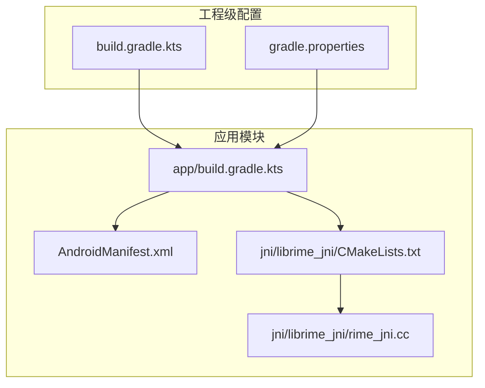
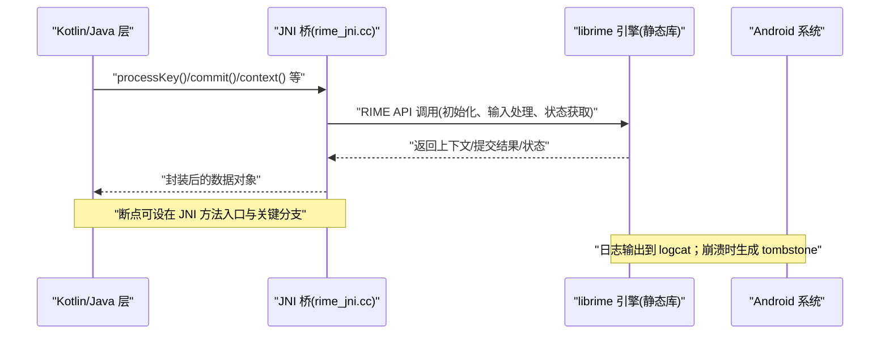
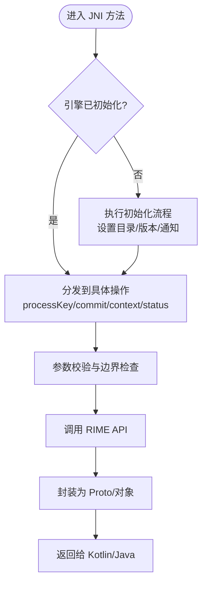
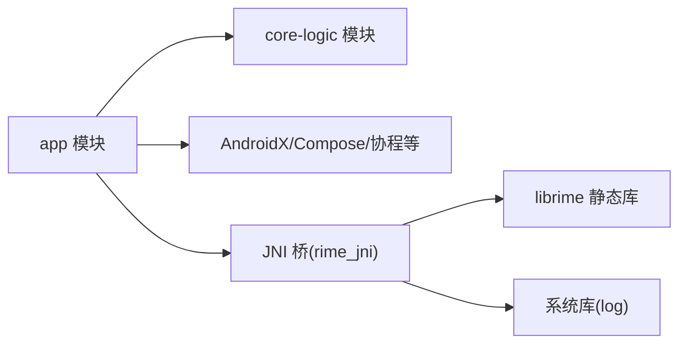

# 调试工具和技巧

<cite>
**本文引用的文件**   
- [app/build.gradle.kts](file://app/build.gradle.kts)
- [build.gradle.kts](file://build.gradle.kts)
- [gradle.properties](file://gradle.properties)
- [app/src/main/jni/librime_jni/CMakeLists.txt](file://app/src/main/jni/librime_jni/CMakeLists.txt)
- [app/src/main/jni/librime_jni/rime_jni.cc](file://app/src/main/jni/librime_jni/rime_jni.cc)
- [app/proguard-rules.pro](file://app/proguard-rules.pro)
- [app/src/main/AndroidManifest.xml](file://app/src/main/AndroidManifest.xml)
</cite>

## 目录
1. [简介](#简介)
2. [项目结构](#项目结构)
3. [核心组件](#核心组件)
4. [架构总览](#架构总览)
5. [详细组件分析](#详细组件分析)
6. [依赖分析](#依赖分析)
7. [性能考虑](#性能考虑)
8. [故障排除指南](#故障排除指南)
9. [结论](#结论)
10. [附录](#附录)

## 简介
本指南面向 Android 输入法项目的调试与性能分析，覆盖以下主题：
- Android Studio 调试器使用（断点、变量监视、调用栈、条件断点、日志过滤）
- NDK 调试配置（LLDB、C++ 代码调试、内存检测工具 AddressSanitizer/MemorySanitizer）
- 性能分析（Android Profiler、Systrace、Perfetto）
- 高级技术（远程调试、热重载、单元测试调试）
- 环境搭建与排错步骤

本项目包含 Kotlin/Compose UI、JNI 桥接层与 C++ 引擎（librime），因此调试需同时关注 Java/Kotlin 与 C++ 两侧。

## 项目结构
- 应用模块 app：Kotlin/Compose、JNI 桥接、资源与清单
- core-logic：纯逻辑模块（无 Android/JNI 依赖）
- librime-prebuilt：预编译的 C++ 引擎静态库及构建脚本
- libs：NDK 头文件与 ABI 产物目录

图表来源
- [app/build.gradle.kts:22-97](file://app/build.gradle.kts#L22-L97)
- [app/src/main/jni/librime_jni/CMakeLists.txt:1-78](file://app/src/main/jni/librime_jni/CMakeLists.txt#L1-L78)
- [app/src/main/AndroidManifest.xml:1-110](file://app/src/main/AndroidManifest.xml#L1-L110)
- [build.gradle.kts:1-7](file://build.gradle.kts#L1-L7)
- [gradle.properties:1-24](file://gradle.properties#L1-L24)

章节来源
- [app/build.gradle.kts:22-97](file://app/build.gradle.kts#L22-L97)
- [app/src/main/jni/librime_jni/CMakeLists.txt:1-78](file://app/src/main/jni/librime_jni/CMakeLists.txt#L1-L78)
- [app/src/main/AndroidManifest.xml:1-110](file://app/src/main/AndroidManifest.xml#L1-L110)
- [build.gradle.kts:1-7](file://build.gradle.kts#L1-L7)
- [gradle.properties:1-24](file://gradle.properties#L1-L24)

## 核心组件
- JNI 桥接层：负责 Kotlin/Java 与 C++ librime 的交互，封装会话生命周期、键值处理、候选项操作等
- CMake 构建：定义 C++ 标准、可选模块开关、链接静态库与系统库、优化选项
- Gradle 配置：启用 Compose、外部 Native 构建、ABI 过滤、混淆规则、测试选项
- 清单与权限：声明输入法服务、Activity、Provider 等组件

章节来源
- [app/src/main/jni/librime_jni/rime_jni.cc:1-200](file://app/src/main/jni/librime_jni/rime_jni.cc#L1-L200)
- [app/src/main/jni/librime_jni/CMakeLists.txt:1-78](file://app/src/main/jni/librime_jni/CMakeLists.txt#L1-L78)
- [app/build.gradle.kts:22-111](file://app/build.gradle.kts#L22-L111)
- [app/src/main/AndroidManifest.xml:20-106](file://app/src/main/AndroidManifest.xml#L20-L106)

## 架构总览
下图展示从 Kotlin 到 C++ 的关键调用路径与构建关系，便于定位问题发生在哪一层。

图表来源
- [app/src/main/jni/librime_jni/rime_jni.cc:45-122](file://app/src/main/jni/librime_jni/rime_jni.cc#L45-L122)

## 详细组件分析

### JNI 层调试要点（rime_jni.cc）
- 单例与初始化流程：避免重复初始化、设置用户/共享目录、注册通知回调、启动维护任务
- 键值处理与候选项：替换输入段、选择候选、翻页、删除候选
- 上下文与状态：获取输入串、光标位置、当前模式与状态
- 日志与错误：通过 Android Log 输出，便于在 logcat 中过滤

图表来源
- [app/src/main/jni/librime_jni/rime_jni.cc:45-122](file://app/src/main/jni/librime_jni/rime_jni.cc#L45-L122)
- [app/src/main/jni/librime_jni/rime_jni.cc:124-200](file://app/src/main/jni/librime_jni/rime_jni.cc#L124-L200)

章节来源
- [app/src/main/jni/librime_jni/rime_jni.cc:1-200](file://app/src/main/jni/librime_jni/rime_jni.cc#L1-L200)

### CMake 构建与调试符号
- C++ 标准与可选模块：C++17、WITH_PREDICT/LUA/OCTAGRAM/OPENCC 开关
- 头文件与静态库路径：指向 libs/include 与 libs/<ABI>/librime.a
- 链接优化：死代码消除、排除全部库、页面对齐
- 调试建议：Debug 构建保留调试符号，Release 构建关闭优化以利于定位

章节来源
- [app/src/main/jni/librime_jni/CMakeLists.txt:1-78](file://app/src/main/jni/librime_jni/CMakeLists.txt#L1-L78)

### Gradle 构建与调试相关配置
- 外部 Native 构建：指定 CMakeLists 路径与版本
- Debug/Release 类型：Debug 禁用 JNI 调试（减少体积）、Release 开启混淆但关闭激进优化
- 测试选项：unitTests 返回默认值，便于单元测试快速运行
- ProGuard 规则：保留 core 包类与 native 方法，避免反射失败

章节来源
- [app/build.gradle.kts:22-111](file://app/build.gradle.kts#L22-L111)
- [app/proguard-rules.pro:1-6](file://app/proguard-rules.pro#L1-L6)

### 清单与组件
- 输入法服务、Activity、Provider 声明，确保调试时可正确启动与交互
- 备份策略：关闭 allowBackup，保护用户词典隐私

章节来源
- [app/src/main/AndroidManifest.xml:1-110](file://app/src/main/AndroidManifest.xml#L1-L110)

## 依赖分析
- 模块依赖：app 依赖 core-logic（纯逻辑）、AndroidX、Compose、协程、WebView、无障碍等
- NDK 依赖：CMake 链接 librime 静态库与系统库（log）
- 构建依赖：Gradle 插件、Kotlin Compose 插件、libs.versions.toml（未在本仓库显示）

图表来源
- [app/build.gradle.kts:143-191](file://app/build.gradle.kts#L143-L191)
- [app/src/main/jni/librime_jni/CMakeLists.txt:62-77](file://app/src/main/jni/librime_jni/CMakeLists.txt#L62-L77)

章节来源
- [app/build.gradle.kts:143-191](file://app/build.gradle.kts#L143-L191)
- [app/src/main/jni/librime_jni/CMakeLists.txt:62-77](file://app/src/main/jni/librime_jni/CMakeLists.txt#L62-L77)

## 性能考虑
- 构建优化：CMake 链接选项启用死代码消除与页面对齐，减小二进制体积并满足 Android 15+ 要求
- 运行时日志：仅输出到 logcat，避免磁盘 I/O 影响性能
- 混淆与优化：Release 开启混淆但关闭激进优化，平衡体积与稳定性

章节来源
- [app/src/main/jni/librime_jni/CMakeLists.txt:55-60](file://app/src/main/jni/librime_jni/CMakeLists.txt#L55-L60)
- [app/src/main/jni/librime_jni/rime_jni.cc:75-76](file://app/src/main/jni/librime_jni/rime_jni.cc#L75-L76)
- [app/build.gradle.kts:66-81](file://app/build.gradle.kts#L66-L81)

## 故障排除指南
- 无法找到 librime.a：检查 CMake 路径与 ABI 是否匹配，确认 libs/<ABI>/librime.a 存在
- JNI 符号缺失：确认 ProGuard 规则保留 core 包与 native 方法
- 初始化失败：检查环境变量（用户/共享目录、版本名）是否正确设置
- 崩溃与内存问题：启用 ASan/MSan 或 LLDB 附加调试，查看 tombstone 与堆栈
- 构建缓慢：调整 gradle.properties JVM 参数与并行配置

章节来源
- [app/src/main/jni/librime_jni/CMakeLists.txt:62-72](file://app/src/main/jni/librime_jni/CMakeLists.txt#L62-L72)
- [app/proguard-rules.pro:1-6](file://app/proguard-rules.pro#L1-L6)
- [app/src/main/jni/librime_jni/rime_jni.cc:68-88](file://app/src/main/jni/librime_jni/rime_jni.cc#L68-L88)
- [gradle.properties:1-24](file://gradle.properties#L1-L24)

## 结论
本指南围绕 JNI 桥接与 C++ 引擎的调试与性能分析，提供了从构建配置到运行时调试的全链路方法。结合 Android Studio 调试器、LLDB、ASan/MSan、Profiler/Systrace/Perfetto，可高效定位问题并优化性能。建议在开发阶段保持调试符号与最小化优化，在发布阶段启用混淆与必要的链接优化。

## 附录

### Android Studio 调试器使用要点
- 断点设置：在 Kotlin/Java 与 C++ 源文件均可设置断点；对 JNI 方法入口与关键分支优先设置
- 变量监视：在“Variables”面板观察对象状态；对复杂结构体可使用表达式求值
- 调用栈分析：切换“Frames”查看跨语言调用链；注意 JNI 帧与系统帧
- 条件断点：基于输入参数或状态设置条件，减少无关中断
- 日志过滤：按 Tag（如 “RimeJNI”）过滤 logcat，快速定位关键信息

### NDK 调试配置（LLDB 与 C++）
- 启用 C++ 调试：在 Run/Debug Configurations 中勾选 “Enable C++ debugging”
- 附加进程：对已运行的输入法进程附加 LLDB，设置断点后继续执行
- 源码映射：确保 CMake 生成正确的调试符号，路径与源码一致
- 常用命令：breakpoint set、thread backtrace、frame select、print、watch

### 内存调试工具（AddressSanitizer、MemorySanitizer）
- 启用 ASan：在 CMake 中添加 -fsanitize=address 并在 Gradle 中传递相应参数
- 启用 MSan：在 CMake 中添加 -fsanitize=memory，注意需要 clang 与特定工具链支持
- 运行与收集：在设备或模拟器上运行，捕获越界访问、未初始化内存等问题
- 分析输出：查看 logcat 中的 Sanitizer 报告，定位崩溃位置与调用栈

### 性能分析工具（Android Profiler、Systrace、Perfetto）
- Android Profiler：CPU/内存/网络/电量视图，识别热点方法与内存峰值
- Systrace：抓取系统级事件，分析 UI 卡顿与线程调度
- Perfetto：更强大的追踪平台，支持长时间录制与离线分析

### 高级调试技术
- 远程调试：通过 adb forward + LLDB 远程附加，或在 CI 环境中使用 headless 调试
- 热重载：Compose 预览与 Instant Run/Apply Changes 加速 UI 迭代
- 单元测试调试：在 test 源集设置断点，使用 IDE 直接运行测试用例

### 调试环境搭建与排错步骤
- 安装必要工具：Android SDK、NDK、CMake、Clang
- 构建产物：确保 libs/include 与 libs/<ABI>/librime.a 存在
- 验证配置：运行 Gradle 构建，检查 CMake 输出与日志
- 启动调试：先调试 Kotlin/Java，再切换到 C++ 侧
- 常见问题：ABI 不匹配、符号缺失、路径错误、权限不足