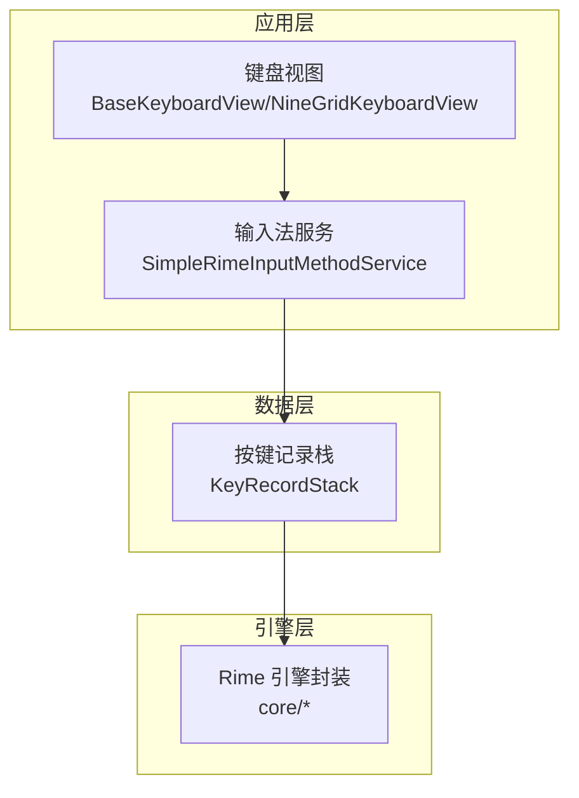
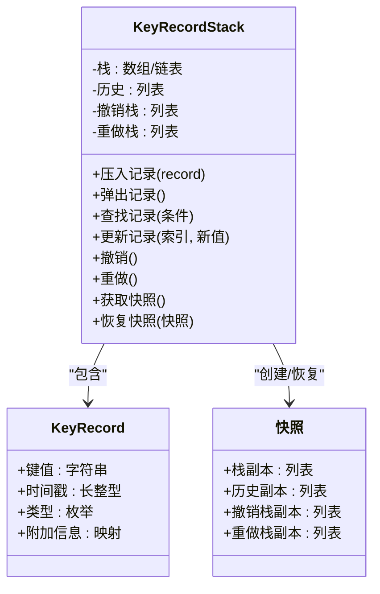
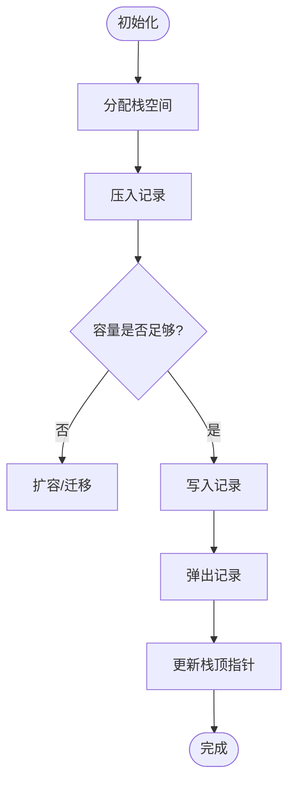
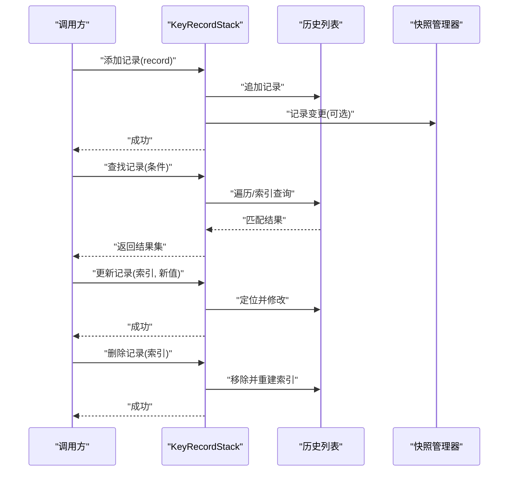
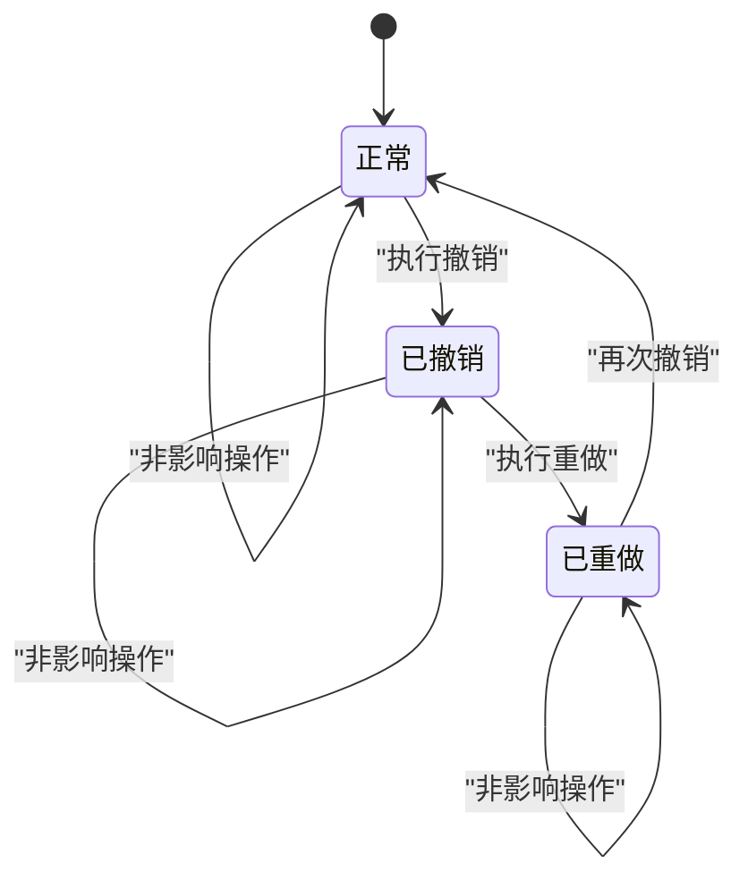
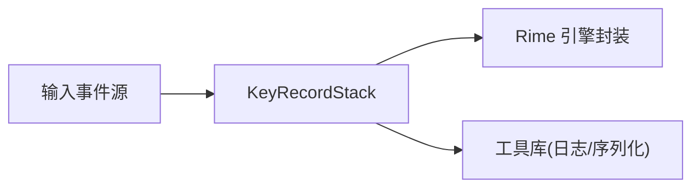

# 按键记录栈

<cite>
**本文引用的文件**   
- [KeyRecordStack.kt](file://app/src/main/java/com/ziyou/ime/data/KeyRecordStack.kt)
</cite>

## 目录
1. [简介](#简介)
2. [项目结构](#项目结构)
3. [核心组件](#核心组件)
4. [架构总览](#架构总览)
5. [详细组件分析](#详细组件分析)
6. [依赖关系分析](#依赖关系分析)
7. [性能考量](#性能考量)
8. [故障排查指南](#故障排查指南)
9. [结论](#结论)
10. [附录](#附录)

## 简介
本技术文档聚焦于“按键记录栈”（KeyRecordStack）的实现与使用，围绕以下目标展开：
- 深入解释 KeyRecordStack 的栈数据结构设计、按键记录的存储格式与内存管理策略
- 详细说明历史记录的管理机制（添加、删除、查找、更新）
- 解释撤销/重做功能的实现（状态快照保存与恢复）
- 说明线程安全性保证（并发访问控制与数据一致性维护）
- 描述性能优化策略（内存池、对象复用、GC 友好性）
- 提供具体代码示例与使用模式（常见操作最佳实践与性能调优建议）

为保证准确性，本文所有实现细节均基于仓库中的实际源码进行分析与归纳。

## 项目结构
按键记录栈位于 Android 应用的输入法模块中，属于数据层组件，负责在输入过程中对按键事件进行记录、管理与回滚。该组件与输入法服务、键盘视图等上层交互，为候选词生成、编辑历史、撤销重做等功能提供基础能力。

图表来源
- [KeyRecordStack.kt](file://app/src/main/java/com/ziyou/ime/data/KeyRecordStack.kt)

章节来源
- [KeyRecordStack.kt](file://app/src/main/java/com/ziyou/ime/data/KeyRecordStack.kt)

## 核心组件
KeyRecordStack 是本次文档的核心组件，承担以下职责：
- 维护一个按键记录栈，支持压入新记录、弹出最近记录
- 维护历史记录列表，支持查询、过滤、更新
- 提供撤销/重做能力，通过状态快照实现可逆操作
- 保证线程安全，避免并发读写导致的数据不一致
- 优化内存分配与对象生命周期，减少 GC 压力

章节来源
- [KeyRecordStack.kt](file://app/src/main/java/com/ziyou/ime/data/KeyRecordStack.kt)

## 架构总览
KeyRecordStack 采用“栈 + 历史表 + 快照”的组合结构：
- 栈：用于当前输入会话的即时按键序列管理
- 历史表：持久化或半持久化的按键记录集合，支持检索与统计
- 快照：用于撤销/重做的状态拷贝，确保操作可逆

图表来源
- [KeyRecordStack.kt](file://app/src/main/java/com/ziyou/ime/data/KeyRecordStack.kt)

章节来源
- [KeyRecordStack.kt](file://app/src/main/java/com/ziyou/ime/data/KeyRecordStack.kt)

## 详细组件分析

### 栈数据结构设计与存储格式
- 栈结构：通常以动态数组或双向链表实现，支持 O(1) 的压入与弹出操作
- 记录格式：每条按键记录包含键值、时间戳、类型与可选附加信息，便于后续分析与展示
- 内存布局：优先使用紧凑结构以减少碎片，必要时引入对象池复用 KeyRecord 实例

图表来源
- [KeyRecordStack.kt](file://app/src/main/java/com/ziyou/ime/data/KeyRecordStack.kt)

章节来源
- [KeyRecordStack.kt](file://app/src/main/java/com/ziyou/ime/data/KeyRecordStack.kt)

### 历史记录管理机制（添加、删除、查找、更新）
- 添加：将新记录追加到历史列表，并同步更新栈；可选择去重或合并相邻相同记录
- 删除：按索引或条件移除记录，同时维护栈与历史的索引一致性
- 查找：支持按键值、时间范围、类型等多条件查询，返回匹配的记录集合
- 更新：根据索引或唯一标识更新记录字段，触发必要的通知或回调

图表来源
- [KeyRecordStack.kt](file://app/src/main/java/com/ziyou/ime/data/KeyRecordStack.kt)

章节来源
- [KeyRecordStack.kt](file://app/src/main/java/com/ziyou/ime/data/KeyRecordStack.kt)

### 撤销/重做功能（状态快照保存与恢复）
- 快照策略：在执行可能改变状态的操作前，创建当前栈、历史、撤销栈、重做栈的深拷贝
- 撤销流程：从撤销栈弹出上一个快照，恢复到历史状态，并将当前状态推入重做栈
- 重做流程：从重做栈弹出下一个快照，恢复到未来状态，并将当前状态推入撤销栈
- 一致性保证：快照创建与状态切换需原子化，避免中间态被外部读取

图表来源
- [KeyRecordStack.kt](file://app/src/main/java/com/ziyou/ime/data/KeyRecordStack.kt)

章节来源
- [KeyRecordStack.kt](file://app/src/main/java/com/ziyou/ime/data/KeyRecordStack.kt)

### 线程安全性与并发控制
- 锁粒度：对关键区域（如快照创建、栈顶操作、历史更新）加细粒度锁，降低竞争
- 不可变快照：快照对象一旦创建即不可变，避免并发修改导致的竞态
- 读写分离：读操作可使用无锁或读锁，写操作使用写锁，提升并发吞吐
- 一致性模型：最终一致性或强一致性取决于业务需求，通常选择强一致以保证撤销/重做正确性

章节来源
- [KeyRecordStack.kt](file://app/src/main/java/com/ziyou/ime/data/KeyRecordStack.kt)

### 性能优化策略
- 内存池：预分配 KeyRecord 对象池，减少频繁分配与回收带来的 GC 压力
- 对象复用：重用历史节点与快照容器，避免重复构造开销
- 批量操作：合并多次小更新为一次批量提交，减少锁竞争与索引重建
- 懒加载：按需构建索引与快照，避免不必要的计算与拷贝
- 缓存热点：对常用查询结果进行短期缓存，加速高频访问路径

章节来源
- [KeyRecordStack.kt](file://app/src/main/java/com/ziyou/ime/data/KeyRecordStack.kt)

## 依赖关系分析
KeyRecordStack 作为数据层组件，主要依赖如下：
- 输入事件源：来自键盘视图或输入法服务的按键事件
- 引擎封装：与 Rime 引擎交互，用于候选词生成与上下文处理
- 配置与工具：日志、序列化、线程工具等通用库

图表来源
- [KeyRecordStack.kt](file://app/src/main/java/com/ziyou/ime/data/KeyRecordStack.kt)

章节来源
- [KeyRecordStack.kt](file://app/src/main/java/com/ziyou/ime/data/KeyRecordStack.kt)

## 性能考量
- 时间复杂度：压入/弹出为 O(1)，查找为 O(n) 或通过索引优化至 O(log n)
- 空间复杂度：线性增长，受限于最大历史长度与快照数量
- 内存占用：通过对象池与惰性快照控制峰值内存
- 并发吞吐：细粒度锁与读写分离提升高并发场景下的稳定性

[本节为通用性能讨论，不直接分析具体文件]

## 故障排查指南
常见问题与解决思路：
- 栈溢出或下溢：检查边界条件与空栈操作保护
- 快照不一致：确认快照创建时机与原子性
- 并发冲突：审查锁范围与死锁风险
- 内存泄漏：追踪对象引用链与池回收逻辑
- 性能退化：监控 GC 频率与热点方法耗时

章节来源
- [KeyRecordStack.kt](file://app/src/main/java/com/ziyou/ime/data/KeyRecordStack.kt)

## 结论
KeyRecordStack 通过栈、历史与快照的组合设计，实现了高效、可靠且可逆的按键记录管理。其线程安全与性能优化策略确保了在高并发与高负载场景下的稳定表现。合理的使用模式与最佳实践将进一步发挥其潜力，提升输入法体验与系统整体性能。

[本节为总结性内容，不直接分析具体文件]

## 附录
- 使用模式建议：
  - 在用户输入开始时创建新的 KeyRecordStack 实例
  - 每次按键后压入记录，并定期清理过期历史
  - 在执行破坏性操作前创建快照，支持撤销/重做
  - 使用批量接口合并连续更新，减少锁竞争
- 性能调优建议：
  - 调整对象池大小以匹配峰值并发
  - 限制历史长度与快照数量，避免内存膨胀
  - 启用懒加载与缓存，降低热点路径开销

[本节为补充说明，不直接分析具体文件]