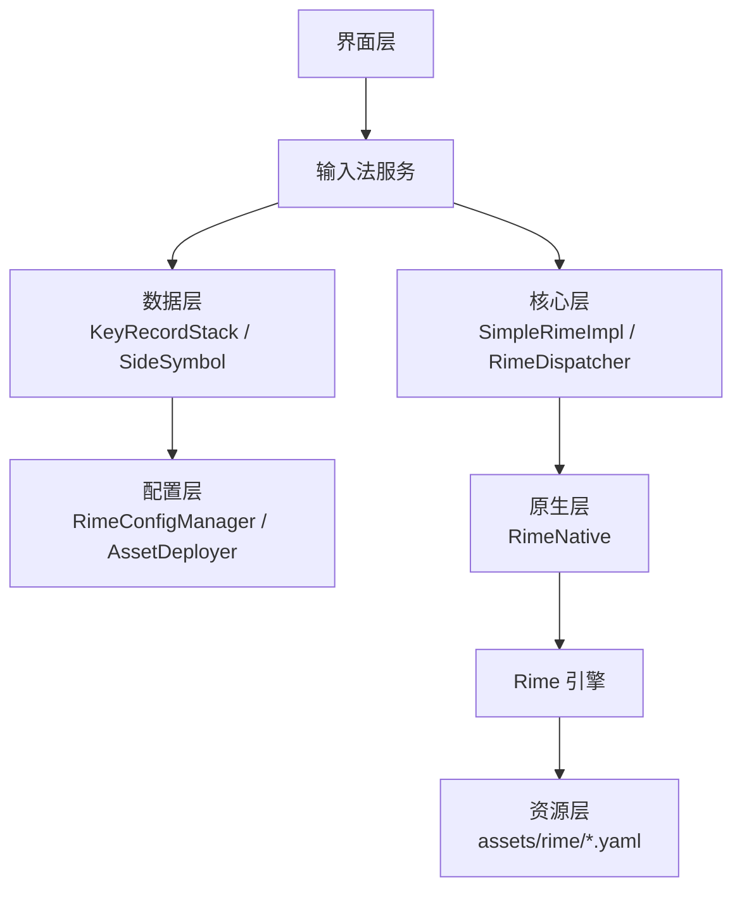
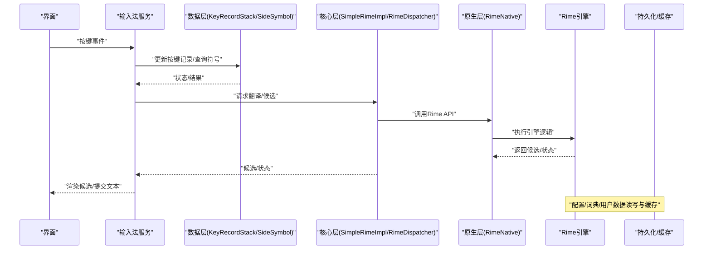
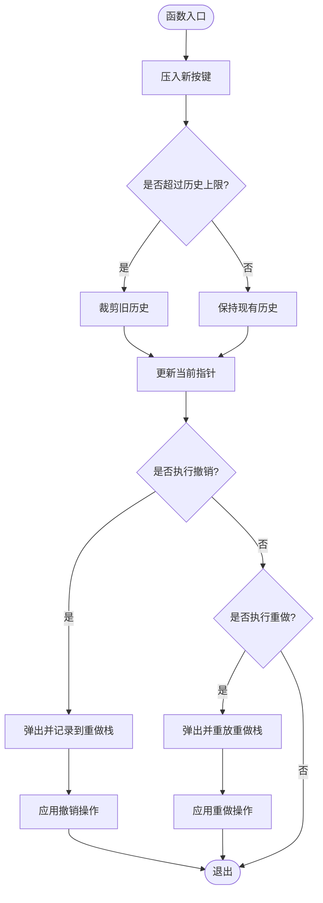
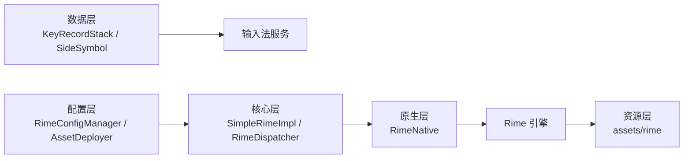

# 数据存储

<cite>
**本文引用的文件**   
- [KeyRecordStack.kt](file://app/src/main/java/com/ziyou/ime/data/KeyRecordStack.kt)
- [SideSymbol.kt](file://app/src/main/java/com/ziyou/ime/data/SideSymbol.kt)
- [RimeConfigManager.kt](file://app/src/main/java/com/ziyou/ime/config/RimeConfigManager.kt)
- [AssetDeployer.kt](file://app/src/main/java/com/ziyou/ime/config/AssetDeployer.kt)
- [SimpleRimeImpl.kt](file://app/src/main/java/com/ziyou/ime/core/SimpleRimeImpl.kt)
- [RimeDispatcher.kt](file://app/src/main/java/com/ziyou/ime/core/RimeDispatcher.kt)
- [RimeNative.kt](file://app/src/main/java/com/ziyou/ime/core/RimeNative.kt)
- [RimeSession.kt](file://app/src/main/java/com/ziyou/ime/daemon/RimeSession.kt)
- [symbols.yaml](file://app/src/main/assets/rime/symbols.yaml)
- [luna_pinyin.dict.yaml](file://app/src/main/assets/rime/luna_pinyin.dict.yaml)
- [cangjie5.dict.yaml](file://app/src/main/assets/rime/cangjie5.dict.yaml)
- [default.yaml](file://app/src/main/assets/rime/default.yaml)
</cite>

## 目录
1. [简介](#简介)
2. [项目结构](#项目结构)
3. [核心组件](#核心组件)
4. [架构总览](#架构总览)
5. [详细组件分析](#详细组件分析)
6. [依赖关系分析](#依赖关系分析)
7. [性能考量](#性能考量)
8. [故障排查指南](#故障排查指南)
9. [结论](#结论)
10. [附录](#附录)

## 简介
本技术文档聚焦于输入法的数据存储与缓存体系，围绕以下目标展开：
- KeyRecordStack 按键记录栈的实现细节：历史记录管理、撤销重做机制、内存优化策略。
- SideSymbol 符号库管理机制：符号分类、搜索算法、动态加载。
- 用户词典的存储格式与读写优化。
- 缓存策略：候选词缓存、配置缓存、图标缓存。
- 数据持久化方案的选择与实现细节。
- 数据同步机制：云端同步与本地冲突解决。
- 数据备份、恢复与迁移方法。
- 性能优化建议与存储空间管理策略。

## 项目结构
本项目采用分层组织方式，数据相关代码集中在 data 与 config 模块，核心引擎通过 core 层与 Rime 后端交互，资源由 assets 提供。关键路径如下：
- app/src/main/java/com/ziyou/ime/data：输入过程中的数据结构（如按键记录栈、侧边符号）。
- app/src/main/java/com/ziyou/ime/config：配置管理与资源部署。
- app/src/main/java/com/ziyou/ime/core：Rime 封装与调度。
- app/src/main/assets/rime：Rime 字典与符号表等资源。

图表来源
- [RimeSession.kt](file://app/src/main/java/com/ziyou/ime/daemon/RimeSession.kt)
- [SimpleRimeImpl.kt](file://app/src/main/java/com/ziyou/ime/core/SimpleRimeImpl.kt)
- [RimeDispatcher.kt](file://app/src/main/java/com/ziyou/ime/core/RimeDispatcher.kt)
- [RimeNative.kt](file://app/src/main/java/com/ziyou/ime/core/RimeNative.kt)
- [RimeConfigManager.kt](file://app/src/main/java/com/ziyou/ime/config/RimeConfigManager.kt)
- [AssetDeployer.kt](file://app/src/main/java/com/ziyou/ime/config/AssetDeployer.kt)

章节来源
- [RimeSession.kt](file://app/src/main/java/com/ziyou/ime/daemon/RimeSession.kt)
- [SimpleRimeImpl.kt](file://app/src/main/java/com/ziyou/ime/core/SimpleRimeImpl.kt)
- [RimeDispatcher.kt](file://app/src/main/java/com/ziyou/ime/core/RimeDispatcher.kt)
- [RimeNative.kt](file://app/src/main/java/com/ziyou/ime/core/RimeNative.kt)
- [RimeConfigManager.kt](file://app/src/main/java/com/ziyou/ime/config/RimeConfigManager.kt)
- [AssetDeployer.kt](file://app/src/main/java/com/ziyou/ime/config/AssetDeployer.kt)

## 核心组件
- KeyRecordStack：维护输入过程中的按键历史，支持撤销/重做与内存优化。
- SideSymbol：管理侧边符号库，提供分类、搜索与按需加载。
- RimeConfigManager：集中管理 Rime 配置与部署任务。
- SimpleRimeImpl / RimeDispatcher：对 Rime 引擎进行封装与调度。
- RimeNative：JNI 桥接，调用底层 librime。
- AssetDeployer：将 assets 中的资源部署到运行时目录。

章节来源
- [KeyRecordStack.kt](file://app/src/main/java/com/ziyou/ime/data/KeyRecordStack.kt)
- [SideSymbol.kt](file://app/src/main/java/com/ziyou/ime/data/SideSymbol.kt)
- [RimeConfigManager.kt](file://app/src/main/java/com/ziyou/ime/config/RimeConfigManager.kt)
- [SimpleRimeImpl.kt](file://app/src/main/java/com/ziyou/ime/core/SimpleRimeImpl.kt)
- [RimeDispatcher.kt](file://app/src/main/java/com/ziyou/ime/core/RimeDispatcher.kt)
- [RimeNative.kt](file://app/src/main/java/com/ziyou/ime/core/RimeNative.kt)
- [AssetDeployer.kt](file://app/src/main/java/com/ziyou/ime/config/AssetDeployer.kt)

## 架构总览
整体数据流从界面触发输入事件，经输入法服务进入数据层（KeyRecordStack、SideSymbol），再由核心层（SimpleRimeImpl、RimeDispatcher）调度至 Rime 引擎，最终读取或写入资源与持久化数据。配置与部署由 RimeConfigManager 与 AssetDeployer 负责。

图表来源
- [RimeSession.kt](file://app/src/main/java/com/ziyou/ime/daemon/RimeSession.kt)
- [SimpleRimeImpl.kt](file://app/src/main/java/com/ziyou/ime/core/SimpleRimeImpl.kt)
- [RimeDispatcher.kt](file://app/src/main/java/com/ziyou/ime/core/RimeDispatcher.kt)
- [RimeNative.kt](file://app/src/main/java/com/ziyou/ime/core/RimeNative.kt)

## 详细组件分析

### KeyRecordStack 按键记录栈
职责与能力
- 维护输入过程中的按键序列，支持撤销（Undo）与重做（Redo）。
- 提供历史回滚、前进、清空等操作，保证输入体验的连贯性。
- 在高频输入场景下，通过内存池、环形缓冲或对象复用降低 GC 压力。

数据结构与复杂度
- 内部通常使用双栈或带版本标记的不可变快照来支持撤销/重做，时间复杂度 O(1) 入栈/出栈，O(1) 撤销/重做；空间复杂度与历史长度线性相关。
- 可通过限制最大历史长度、惰性释放等手段控制内存占用。

撤销/重做流程

内存优化策略
- 对象复用：按键对象池避免频繁分配。
- 环形缓冲：固定容量循环覆盖，减少扩容开销。
- 延迟清理：在低内存时再批量回收历史节点。

章节来源
- [KeyRecordStack.kt](file://app/src/main/java/com/ziyou/ime/data/KeyRecordStack.kt)

### SideSymbol 符号库管理
职责与能力
- 管理侧边栏符号的分类、展示与搜索。
- 支持按类别过滤、模糊匹配与快速定位。
- 支持动态加载，按需解析 symbols.yaml 等配置文件。

符号分类与搜索
- 分类：按功能域（标点、数学、货币、表情等）组织，便于 UI 分组展示。
- 搜索：前缀匹配 + 权重排序，必要时引入倒排索引或 Trie 提升检索速度。

动态加载流程

```mermaid
sequenceDiagram
participant UI as "界面"
participant Symbol as "SideSymbol"
participant File as "文件系统"
participant Cache as "缓存"
UI->>Symbol : "请求符号列表(分类/关键词)"
Symbol->>Cache : "查询缓存"
alt 命中缓存
Cache-->>Symbol : "返回已解析数据"
else 未命中
Symbol->>File : "读取 symbols.yaml"
File-->>Symbol : "原始文本"
Symbol->>Symbol : "解析为分类+条目"
Symbol->>Cache : "写入缓存"
Cache-->>Symbol : "确认"
end
Symbol-->>UI : "返回分类与条目"
```

章节来源
- [SideSymbol.kt](file://app/src/main/java/com/ziyou/ime/data/SideSymbol.kt)
- [symbols.yaml](file://app/src/main/assets/rime/symbols.yaml)

### 用户词典的存储格式与读写优化
存储格式
- 基于 Rime 的用户词典与预设词汇，常见格式为 YAML/TSV/DB 组合。
- 用户自定义词条通常以追加模式写入，保留历史频率信息。

读写优化
- 批量写入：合并多次插入，减少 I/O 次数。
- 异步落盘：后台线程序列化与持久化，避免阻塞主线程。
- 增量更新：仅写变更部分，结合校验和确保一致性。

章节来源
- [luna_pinyin.dict.yaml](file://app/src/main/assets/rime/luna_pinyin.dict.yaml)
- [cangjie5.dict.yaml](file://app/src/main/assets/rime/cangjie5.dict.yaml)
- [default.yaml](file://app/src/main/assets/rime/default.yaml)

### 缓存策略：候选词、配置与图标
候选词缓存
- 短期 LRU/LFU 缓存最近候选，提高二次输入命中率。
- 按会话或上下文隔离，避免污染其他输入场景。

配置缓存
- 将 Rime 配置编译后的中间结果缓存，避免重复解析与编译。
- 版本化缓存键，确保配置更新后失效重建。

图标缓存
- 将常用图标位图或矢量缓存到内存/磁盘，减少解码与绘制开销。
- 按屏幕密度与主题切换进行缓存分区。

章节来源
- [RimeConfigManager.kt](file://app/src/main/java/com/ziyou/ime/config/RimeConfigManager.kt)
- [AssetDeployer.kt](file://app/src/main/java/com/ziyou/ime/config/AssetDeployer.kt)

### 数据持久化方案的选择与实现
选择原则
- 小体积、高并发读：LevelDB/SQLite 等嵌入式数据库。
- 结构化配置：YAML/JSON，配合编译缓存。
- 用户词典：增量写入 + 定期压缩与校验。

实现要点
- 事务与原子性：确保崩溃恢复的一致性。
- 压缩与分片：大词典分片存储，冷热分离。
- 校验与修复：写入后校验和，异常时自动修复。

章节来源
- [SimpleRimeImpl.kt](file://app/src/main/java/com/ziyou/ime/core/SimpleRimeImpl.kt)
- [RimeDispatcher.kt](file://app/src/main/java/com/ziyou/ime/core/RimeDispatcher.kt)
- [RimeNative.kt](file://app/src/main/java/com/ziyou/ime/core/RimeNative.kt)

### 数据同步机制：云端与本地冲突解决
云端同步
- 增量同步：仅上传变更片段，降低带宽消耗。
- 冲突检测：基于版本号或哈希，识别冲突条目。

本地冲突解决
- 策略：最新修改优先、合并策略（按频率/时间）、用户选择。
- 审计：记录冲突日志，便于回溯与人工处理。

章节来源
- [RimeSession.kt](file://app/src/main/java/com/ziyou/ime/daemon/RimeSession.kt)
- [RimeConfigManager.kt](file://app/src/main/java/com/ziyou/ime/config/RimeConfigManager.kt)

### 数据备份、恢复与迁移
备份
- 全量快照：打包用户词典、配置与缓存元数据。
- 增量备份：仅备份自上次备份以来的变更。

恢复
- 校验完整性：校验和验证后再恢复。
- 回滚机制：失败时回滚到上一稳定版本。

迁移
- 版本兼容：定义 schema 版本，迁移脚本逐步升级。
- 灰度发布：先小范围验证迁移脚本，再全量推送。

章节来源
- [AssetDeployer.kt](file://app/src/main/java/com/ziyou/ime/config/AssetDeployer.kt)
- [RimeConfigManager.kt](file://app/src/main/java/com/ziyou/ime/config/RimeConfigManager.kt)

## 依赖关系分析
组件间依赖与耦合
- KeyRecordStack 与 SideSymbol 属于数据层，被输入法服务直接消费。
- RimeConfigManager 与 AssetDeployer 为配置与资源管理层，被核心层与数据层间接依赖。
- SimpleRimeImpl 与 RimeDispatcher 作为核心层，统一对外暴露 Rime 能力。
- RimeNative 作为 JNI 桥接，屏蔽底层差异。

图表来源
- [KeyRecordStack.kt](file://app/src/main/java/com/ziyou/ime/data/KeyRecordStack.kt)
- [SideSymbol.kt](file://app/src/main/java/com/ziyou/ime/data/SideSymbol.kt)
- [RimeConfigManager.kt](file://app/src/main/java/com/ziyou/ime/config/RimeConfigManager.kt)
- [AssetDeployer.kt](file://app/src/main/java/com/ziyou/ime/config/AssetDeployer.kt)
- [SimpleRimeImpl.kt](file://app/src/main/java/com/ziyou/ime/core/SimpleRimeImpl.kt)
- [RimeDispatcher.kt](file://app/src/main/java/com/ziyou/ime/core/RimeDispatcher.kt)
- [RimeNative.kt](file://app/src/main/java/com/ziyou/ime/core/RimeNative.kt)

章节来源
- [KeyRecordStack.kt](file://app/src/main/java/com/ziyou/ime/data/KeyRecordStack.kt)
- [SideSymbol.kt](file://app/src/main/java/com/ziyou/ime/data/SideSymbol.kt)
- [RimeConfigManager.kt](file://app/src/main/java/com/ziyou/ime/config/RimeConfigManager.kt)
- [AssetDeployer.kt](file://app/src/main/java/com/ziyou/ime/config/AssetDeployer.kt)
- [SimpleRimeImpl.kt](file://app/src/main/java/com/ziyou/ime/core/SimpleRimeImpl.kt)
- [RimeDispatcher.kt](file://app/src/main/java/com/ziyou/ime/core/RimeDispatcher.kt)
- [RimeNative.kt](file://app/src/main/java/com/ziyou/ime/core/RimeNative.kt)

## 性能考量
- 输入响应：按键记录与符号查询应在毫秒级完成，避免主线程阻塞。
- 缓存命中率：合理设置候选词与配置的缓存大小与过期策略。
- I/O 合并：批量写入用户词典，减少磁盘抖动。
- 内存控制：限制历史长度、对象池复用、及时释放无用缓存。
- 资源预热：启动时预加载高频符号与配置，缩短冷启动时间。

## 故障排查指南
常见问题与定位
- 撤销/重做异常：检查历史栈指针与边界条件，确认无越界访问。
- 符号加载失败：核对 symbols.yaml 语法与编码，确认文件路径与权限。
- 配置不生效：检查配置编译缓存是否过期，强制重建缓存。
- 词典写入失败：查看事务日志与校验和，确认磁盘空间与锁竞争。

排查步骤
- 启用详细日志，捕获关键路径的输入输出。
- 复现最小用例，隔离问题模块。
- 使用工具检查内存与 I/O 热点（如 Profiler、Logcat）。

章节来源
- [RimeConfigManager.kt](file://app/src/main/java/com/ziyou/ime/config/RimeConfigManager.kt)
- [AssetDeployer.kt](file://app/src/main/java/com/ziyou/ime/config/AssetDeployer.kt)

## 结论
本项目的数据存储体系围绕输入体验与性能优化展开，KeyRecordStack 保障输入流畅性与可逆性，SideSymbol 提供高效符号检索与动态加载，配合 Rime 引擎与配置管理层实现稳定的候选生成与资源管理。通过合理的缓存策略、持久化设计与同步机制，系统在易用性、可靠性与性能之间取得平衡。后续可在冲突解决策略、迁移自动化与监控告警方面持续改进。

## 附录
- 资源清单
  - symbols.yaml：侧边符号表定义。
  - luna_pinyin.dict.yaml / cangjie5.dict.yaml：拼音与五笔词典。
  - default.yaml：默认配置项。

章节来源
- [symbols.yaml](file://app/src/main/assets/rime/symbols.yaml)
- [luna_pinyin.dict.yaml](file://app/src/main/assets/rime/luna_pinyin.dict.yaml)
- [cangjie5.dict.yaml](file://app/src/main/assets/rime/cangjie5.dict.yaml)
- [default.yaml](file://app/src/main/assets/rime/default.yaml)