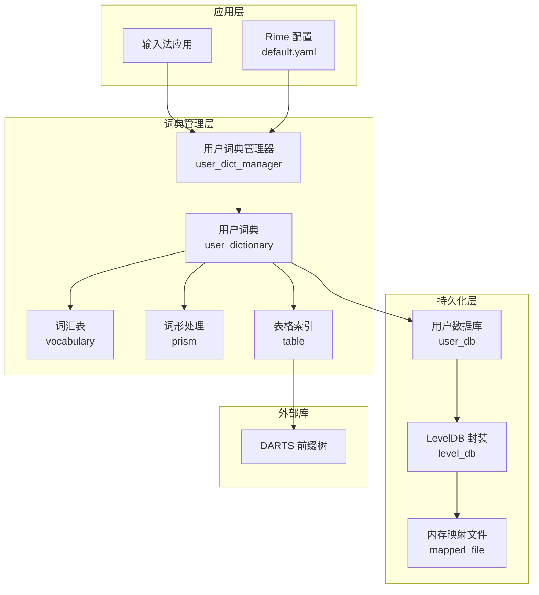
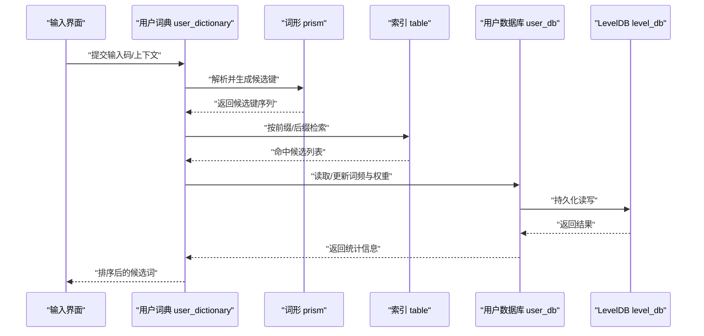
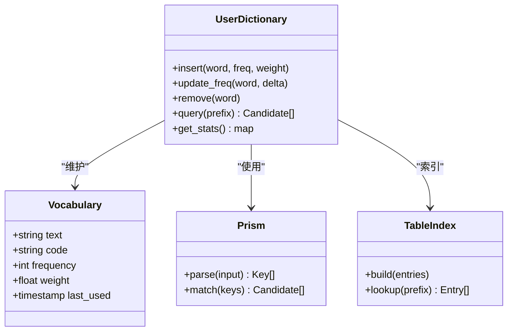
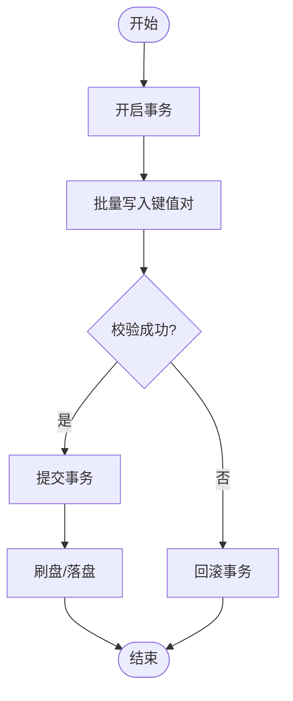
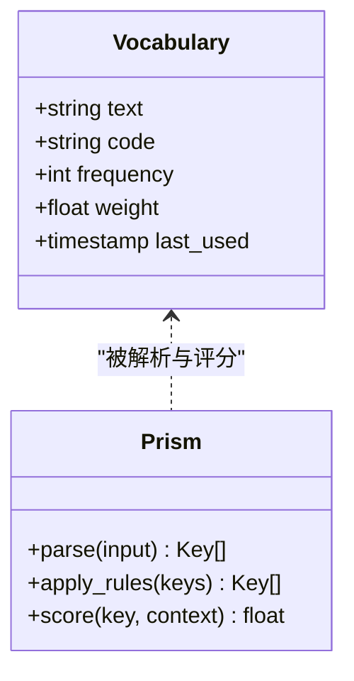
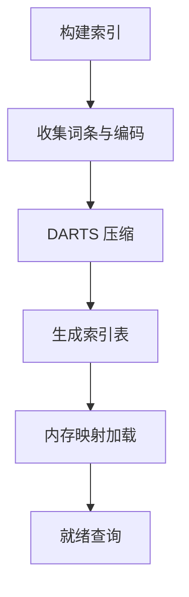
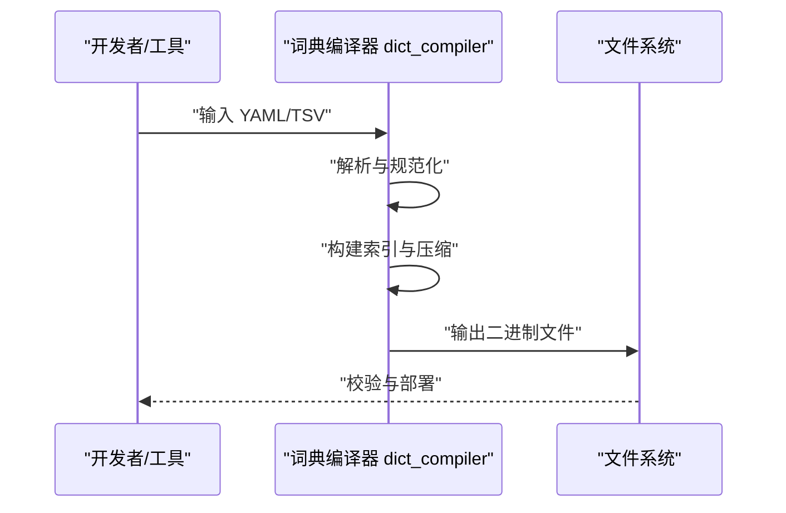
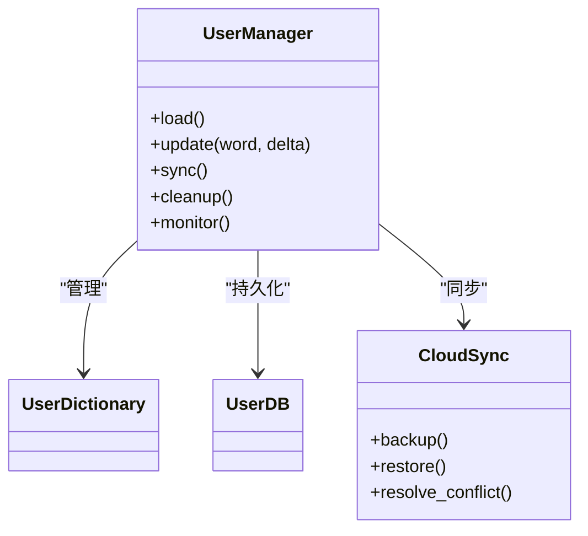
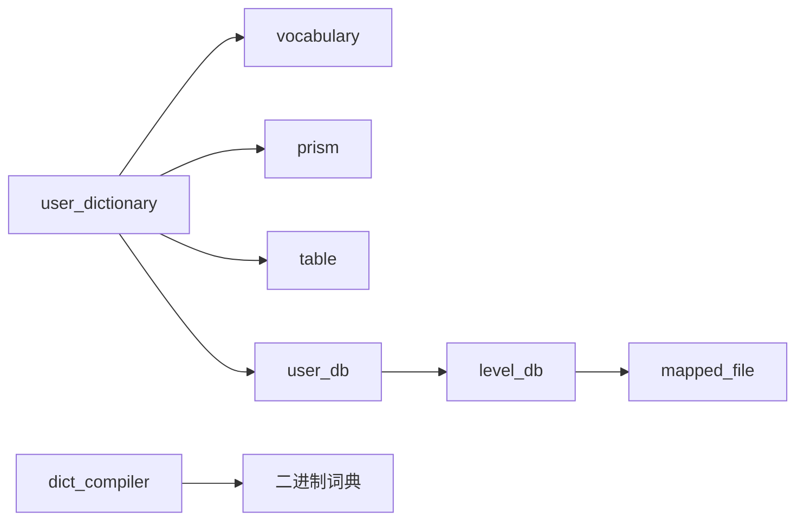

# 用户词典

<cite>
**本文引用的文件**   
- [user_dictionary.h](file://librime-prebuilt/librime/src/rime/dict/user_dictionary.h)
- [user_dictionary.cc](file://librime-prebuilt/librime/src/rime/dict/user_dictionary.cc)
- [user_db.h](file://librime-prebuilt/librime/src/rime/dict/user_db.h)
- [user_db.cc](file://librime-prebuilt/librime/src/rime/dict/user_db.cc)
- [level_db.h](file://librime-prebuilt/librime/src/rime/dict/level_db.h)
- [level_db.cc](file://librime-prebuilt/librime/src/rime/dict/level_db.cc)
- [vocabulary.h](file://librime-prebuilt/librime/src/rime/dict/vocabulary.h)
- [vocabulary.cc](file://librime-prebuilt/librime/src/rime/dict/vocabulary.cc)
- [prism.h](file://librime-prebuilt/librime/src/rime/dict/prism.h)
- [prism.cc](file://librime-prebuilt/librime/src/rime/dict/prism.cc)
- [table.h](file://librime-prebuilt/librime/src/rime/dict/table.h)
- [table.cc](file://librime-prebuilt/librime/src/rime/dict/table.cc)
- [dict_compiler.h](file://librime-prebuilt/librime/src/rime/dict/dict_compiler.h)
- [dict_compiler.cc](file://librime-prebuilt/librime/src/rime/dict/dict_compiler.cc)
- [mapped_file.h](file://librime-prebuilt/librime/src/rime/dict/mapped_file.h)
- [mapped_file.cc](file://librime-prebuilt/librime/src/rime/dict/mapped_file.cc)
- [darts.h](file://librime-prebuilt/librime/include/darts.h)
- [user_dict_manager.h](file://librime-prebuilt/librime/src/rime/lever/user_dict_manager.h)
- [user_dict_manager.cc](file://librime-prebuilt/librime/src/rime/lever/user_dict_manager.cc)
- [default.yaml](file://app/src/main/assets/rime/default.yaml)
</cite>

## 目录
1. [简介](#简介)
2. [项目结构](#项目结构)
3. [核心组件](#核心组件)
4. [架构总览](#架构总览)
5. [详细组件分析](#详细组件分析)
6. [依赖关系分析](#依赖关系分析)
7. [性能考量](#性能考量)
8. [故障排查指南](#故障排查指南)
9. [结论](#结论)
10. [附录](#附录)

## 简介
本技术文档围绕输入法“用户词典”子系统展开，系统性阐述其数据结构、持久化存储（LevelDB）、读写机制（增量更新、批量操作、事务）、词频学习算法（自动收录、频率调整、淘汰策略）、同步能力（云端备份、冲突解决、版本控制），以及编译优化（DARTS 压缩、内存映射、查询加速）与维护管理最佳实践。读者无需深入底层实现即可理解整体设计，同时为二次开发与问题定位提供详实依据。

## 项目结构
用户词典相关代码主要位于 librime 的字典模块与 lever 层：
- 字典核心：user_dictionary、user_db、level_db、vocabulary、prism、table、dict_compiler、mapped_file
- 管理与工具：user_dict_manager
- 配置入口：default.yaml（Rime 配置加载与词典开关）

图表来源
- [user_dict_manager.h](file://librime-prebuilt/librime/src/rime/lever/user_dict_manager.h)
- [user_dictionary.h](file://librime-prebuilt/librime/src/rime/dict/user_dictionary.h)
- [vocabulary.h](file://librime-prebuilt/librime/src/rime/dict/vocabulary.h)
- [prism.h](file://librime-prebuilt/librime/src/rime/dict/prism.h)
- [table.h](file://librime-prebuilt/librime/src/rime/dict/table.h)
- [user_db.h](file://librime-prebuilt/librime/src/rime/dict/user_db.h)
- [level_db.h](file://librime-prebuilt/librime/src/rime/dict/level_db.h)
- [mapped_file.h](file://librime-prebuilt/librime/src/rime/dict/mapped_file.h)
- [darts.h](file://librime-prebuilt/librime/include/darts.h)
- [default.yaml](file://app/src/main/assets/rime/default.yaml)

章节来源
- [default.yaml](file://app/src/main/assets/rime/default.yaml)
- [user_dict_manager.h](file://librime-prebuilt/librime/src/rime/lever/user_dict_manager.h)
- [user_dictionary.h](file://librime-prebuilt/librime/src/rime/dict/user_dictionary.h)

## 核心组件
- 用户词典（user_dictionary）：面向用户的词条集合，维护词频、权重、最近使用等统计信息，并提供增删改查接口。
- 用户数据库（user_db）：负责用户词典数据的持久化，基于 LevelDB 键值存储，支持序列化与索引。
- 词汇表（vocabulary）：抽象词条模型，包含文本、编码、频率、权重等字段。
- 词形处理（prism）：将输入码（如拼音）映射到候选词，参与排序与过滤。
- 表格索引（table）：构建高效的前缀/后缀索引，结合 DARTS 进行快速匹配。
- 词典编译器（dict_compiler）：将 YAML/TSV 等源数据编译为二进制格式，提升加载与查询性能。
- 内存映射（mapped_file）：通过内存映射加速大词典读取。
- 用户词典管理器（user_dict_manager）：对外暴露统一的管理 API，协调加载、更新、同步与清理。

章节来源
- [user_dictionary.h](file://librime-prebuilt/librime/src/rime/dict/user_dictionary.h)
- [user_db.h](file://librime-prebuilt/librime/src/rime/dict/user_db.h)
- [vocabulary.h](file://librime-prebuilt/librime/src/rime/dict/vocabulary.h)
- [prism.h](file://librime-prebuilt/librime/src/rime/dict/prism.h)
- [table.h](file://librime-prebuilt/librime/src/rime/dict/table.h)
- [dict_compiler.h](file://librime-prebuilt/librime/src/rime/dict/dict_compiler.h)
- [mapped_file.h](file://librime-prebuilt/librime/src/rime/dict/mapped_file.h)
- [user_dict_manager.h](file://librime-prebuilt/librime/src/rime/lever/user_dict_manager.h)

## 架构总览
下图展示从输入到候选输出的关键路径，以及用户词典在其中的作用位置。

图表来源
- [user_dictionary.cc](file://librime-prebuilt/librime/src/rime/dict/user_dictionary.cc)
- [prism.cc](file://librime-prebuilt/librime/src/rime/dict/prism.cc)
- [table.cc](file://librime-prebuilt/librime/src/rime/dict/table.cc)
- [user_db.cc](file://librime-prebuilt/librime/src/rime/dict/user_db.cc)
- [level_db.cc](file://librime-prebuilt/librime/src/rime/dict/level_db.cc)

## 详细组件分析

### 用户词典（user_dictionary）
- 职责：维护用户自定义词条及其统计信息；提供插入、删除、更新、查询接口；与 prism/table 协作完成候选生成与排序。
- 数据结构要点：
  - 词条对象：包含文本、编码、频率、权重、最近使用时间戳等。
  - 索引结构：按编码前缀/后缀建立倒排或前缀树，以加速检索。
  - 统计缓存：热点词条的局部缓存以降低 IO 压力。
- 复杂度分析：
  - 插入/更新：O(log N) 或 O(1) 取决于索引类型与哈希策略。
  - 查询：前缀匹配 O(k + log N)，k 为前缀长度。
- 错误处理：对非法输入、重复词条、越界访问进行校验与回滚。

图表来源
- [user_dictionary.h](file://librime-prebuilt/librime/src/rime/dict/user_dictionary.h)
- [vocabulary.h](file://librime-prebuilt/librime/src/rime/dict/vocabulary.h)
- [prism.h](file://librime-prebuilt/librime/src/rime/dict/prism.h)
- [table.h](file://librime-prebuilt/librime/src/rime/dict/table.h)

章节来源
- [user_dictionary.h](file://librime-prebuilt/librime/src/rime/dict/user_dictionary.h)
- [user_dictionary.cc](file://librime-prebuilt/librime/src/rime/dict/user_dictionary.cc)
- [vocabulary.h](file://librime-prebuilt/librime/src/rime/dict/vocabulary.h)
- [prism.h](file://librime-prebuilt/librime/src/rime/dict/prism.h)
- [table.h](file://librime-prebuilt/librime/src/rime/dict/table.h)

### 用户数据库（user_db）与 LevelDB（level_db）
- 职责：将用户词典条目持久化为键值对，支持事务、批量写入、快照与恢复。
- 序列化方案：
  - 键：编码+时间戳或版本号，保证唯一性与可排序性。
  - 值：结构化二进制（如 Protocol Buffers/FlatBuffers），包含频率、权重、元数据。
- 索引优化：
  - 前缀索引：便于范围扫描与前缀匹配。
  - 辅助索引：按词频阈值、最近使用时间等维度建立二级索引。
- 事务与一致性：
  - 原子写入：批量操作包裹于事务，失败回滚。
  - 快照与恢复：崩溃后通过日志回放恢复一致状态。

图表来源
- [user_db.h](file://librime-prebuilt/librime/src/rime/dict/user_db.h)
- [user_db.cc](file://librime-prebuilt/librime/src/rime/dict/user_db.cc)
- [level_db.h](file://librime-prebuilt/librime/src/rime/dict/level_db.h)
- [level_db.cc](file://librime-prebuilt/librime/src/rime/dict/level_db.cc)

章节来源
- [user_db.h](file://librime-prebuilt/librime/src/rime/dict/user_db.h)
- [user_db.cc](file://librime-prebuilt/librime/src/rime/dict/user_db.cc)
- [level_db.h](file://librime-prebuilt/librime/src/rime/dict/level_db.h)
- [level_db.cc](file://librime-prebuilt/librime/src/rime/dict/level_db.cc)

### 词汇表（vocabulary）与词形处理（prism）
- 词汇表：定义词条的最小单元，承载文本、编码、频率、权重、时间戳等属性。
- 词形处理：将输入码转换为候选键序列，支持多音字、模糊音、简繁转换等规则。
- 关联规则：
  - 同音/近音映射：扩展候选集。
  - 上下文敏感：根据历史输入调整权重。

图表来源
- [vocabulary.h](file://librime-prebuilt/librime/src/rime/dict/vocabulary.h)
- [prism.h](file://librime-prebuilt/librime/src/rime/dict/prism.h)
- [prism.cc](file://librime-prebuilt/librime/src/rime/dict/prism.cc)

章节来源
- [vocabulary.h](file://librime-prebuilt/librime/src/rime/dict/vocabulary.h)
- [vocabulary.cc](file://librime-prebuilt/librime/src/rime/dict/vocabulary.cc)
- [prism.h](file://librime-prebuilt/librime/src/rime/dict/prism.h)
- [prism.cc](file://librime-prebuilt/librime/src/rime/dict/prism.cc)

### 表格索引（table）与 DARTS 压缩
- 表格索引：构建前缀/后缀索引，支持快速匹配与范围扫描。
- DARTS 压缩：将字符串集合压缩为紧凑的前缀树，显著降低内存占用并提升查找速度。
- 内存映射：通过 mapped_file 将词典文件映射到进程地址空间，减少拷贝开销。

图表来源
- [table.h](file://librime-prebuilt/librime/src/rime/dict/table.h)
- [table.cc](file://librime-prebuilt/librime/src/rime/dict/table.cc)
- [darts.h](file://librime-prebuilt/librime/include/darts.h)
- [mapped_file.h](file://librime-prebuilt/librime/src/rime/dict/mapped_file.h)
- [mapped_file.cc](file://librime-prebuilt/librime/src/rime/dict/mapped_file.cc)

章节来源
- [table.h](file://librime-prebuilt/librime/src/rime/dict/table.h)
- [table.cc](file://librime-prebuilt/librime/src/rime/dict/table.cc)
- [darts.h](file://librime-prebuilt/librime/include/darts.h)
- [mapped_file.h](file://librime-prebuilt/librime/src/rime/dict/mapped_file.h)
- [mapped_file.cc](file://librime-prebuilt/librime/src/rime/dict/mapped_file.cc)

### 词典编译器（dict_compiler）
- 职责：将 YAML/TSV 等源数据编译为二进制格式，供运行时快速加载。
- 流程：
  - 解析源文件，提取词条与元数据。
  - 去重与规范化（大小写、简繁、编码）。
  - 构建索引与压缩结构。
  - 输出二进制文件与校验和。

图表来源
- [dict_compiler.h](file://librime-prebuilt/librime/src/rime/dict/dict_compiler.h)
- [dict_compiler.cc](file://librime-prebuilt/librime/src/rime/dict/dict_compiler.cc)

章节来源
- [dict_compiler.h](file://librime-prebuilt/librime/src/rime/dict/dict_compiler.h)
- [dict_compiler.cc](file://librime-prebuilt/librime/src/rime/dict/dict_compiler.cc)

### 用户词典管理器（user_dict_manager）
- 职责：统一管理用户词典的加载、更新、同步、清理与监控。
- 功能：
  - 增量更新：监听输入事件，异步更新词频与权重。
  - 批量操作：合并多次写入，减少 IO 次数。
  - 同步：与云端备份服务交互，处理冲突与版本控制。
  - 清理：定期清理低频/过期词条，释放空间。

图表来源
- [user_dict_manager.h](file://librime-prebuilt/librime/src/rime/lever/user_dict_manager.h)
- [user_dict_manager.cc](file://librime-prebuilt/librime/src/rime/lever/user_dict_manager.cc)

章节来源
- [user_dict_manager.h](file://librime-prebuilt/librime/src/rime/lever/user_dict_manager.h)
- [user_dict_manager.cc](file://librime-prebuilt/librime/src/rime/lever/user_dict_manager.cc)

## 依赖关系分析
- 组件耦合：
  - user_dictionary 依赖 vocabulary、prism、table、user_db。
  - user_db 依赖 level_db 与 mapped_file。
  - dict_compiler 独立于运行时，仅用于离线编译。
- 外部依赖：
  - LevelDB：高性能键值存储。
  - DARTS：前缀树压缩库。
  - YAML/TSV：配置与数据源格式。

图表来源
- [user_dictionary.h](file://librime-prebuilt/librime/src/rime/dict/user_dictionary.h)
- [vocabulary.h](file://librime-prebuilt/librime/src/rime/dict/vocabulary.h)
- [prism.h](file://librime-prebuilt/librime/src/rime/dict/prism.h)
- [table.h](file://librime-prebuilt/librime/src/rime/dict/table.h)
- [user_db.h](file://librime-prebuilt/librime/src/rime/dict/user_db.h)
- [level_db.h](file://librime-prebuilt/librime/src/rime/dict/level_db.h)
- [mapped_file.h](file://librime-prebuilt/librime/src/rime/dict/mapped_file.h)
- [dict_compiler.h](file://librime-prebuilt/librime/src/rime/dict/dict_compiler.h)

章节来源
- [user_dictionary.h](file://librime-prebuilt/librime/src/rime/dict/user_dictionary.h)
- [user_db.h](file://librime-prebuilt/librime/src/rime/dict/user_db.h)
- [level_db.h](file://librime-prebuilt/librime/src/rime/dict/level_db.h)
- [dict_compiler.h](file://librime-prebuilt/librime/src/rime/dict/dict_compiler.h)

## 性能考量
- 查询加速：
  - 使用 DARTS 压缩前缀树，降低内存占用并提升匹配速度。
  - 内存映射避免频繁磁盘 I/O。
- 写入优化：
  - 批量写入与事务合并，减少锁竞争与落盘次数。
  - 异步更新与延迟落盘，提高响应性。
- 缓存策略：
  - 热点词条本地缓存，LRU 淘汰策略。
  - 预取常用前缀，减少等待时间。
- 资源限制：
  - 控制词典大小与索引深度，防止内存溢出。
  - 定期清理低频词条，保持词典精简。

[本节为通用指导，不直接分析具体文件]

## 故障排查指南
- 常见问题：
  - 词典加载失败：检查配置文件 default.yaml 与二进制文件完整性。
  - 写入不一致：确认事务是否提交，LevelDB 是否损坏。
  - 查询缓慢：检查索引是否重建，DARTS 压缩是否成功。
- 诊断步骤：
  - 启用详细日志，定位异常堆栈。
  - 校验和验证，确保数据一致性。
  - 使用工具导出快照，分析热点词条与瓶颈。
- 恢复策略：
  - 从备份恢复最新快照。
  - 重放日志，修复损坏记录。
  - 重建索引，重新编译词典。

章节来源
- [default.yaml](file://app/src/main/assets/rime/default.yaml)
- [user_db.cc](file://librime-prebuilt/librime/src/rime/dict/user_db.cc)
- [level_db.cc](file://librime-prebuilt/librime/src/rime/dict/level_db.cc)
- [dict_compiler.cc](file://librime-prebuilt/librime/src/rime/dict/dict_compiler.cc)

## 结论
用户词典系统通过清晰的分层架构与高效的索引/压缩技术，实现了高可用、高性能的词条管理与查询。结合 LevelDB 的持久化能力与 DARTS 的内存优化，系统在增量更新、批量操作与事务处理方面表现稳健。未来可进一步探索云端同步与智能学习算法，以提升用户体验与系统智能化水平。

[本节为总结性内容，不直接分析具体文件]

## 附录
- 配置项说明：
  - default.yaml 中词典开关、路径、加载顺序等。
- 术语表：
  - 词频：词条出现次数，影响排序权重。
  - 权重：综合频率、最近使用、上下文等因素的动态评分。
  - 前缀树：用于快速匹配前缀的树形结构。
- 参考实现：
  - librime 源码中的 dictionary、prism、table、level_db 等模块。

[本节为补充信息，不直接分析具体文件]