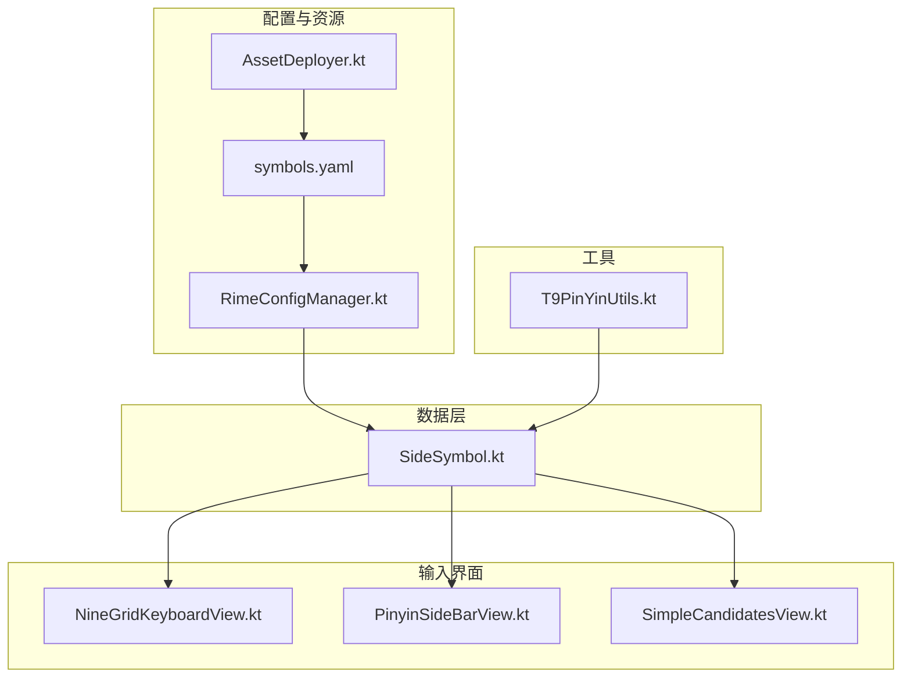
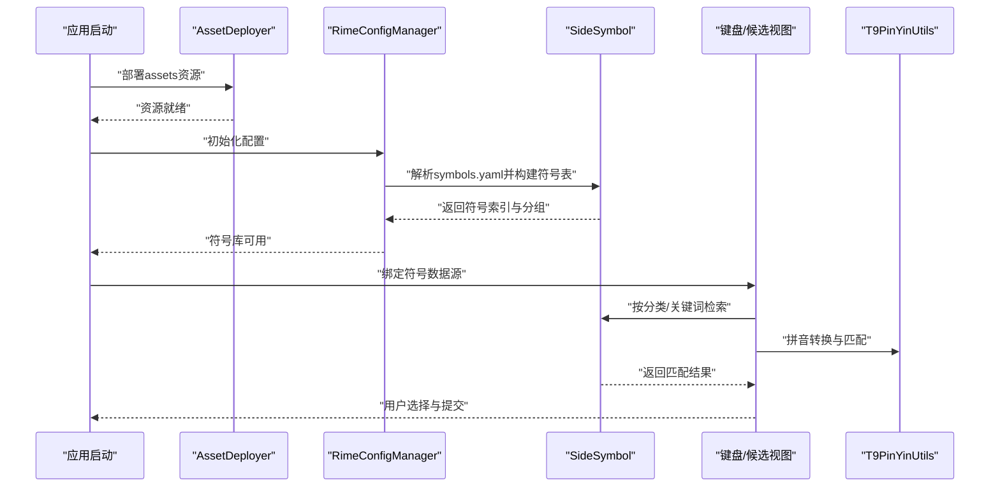
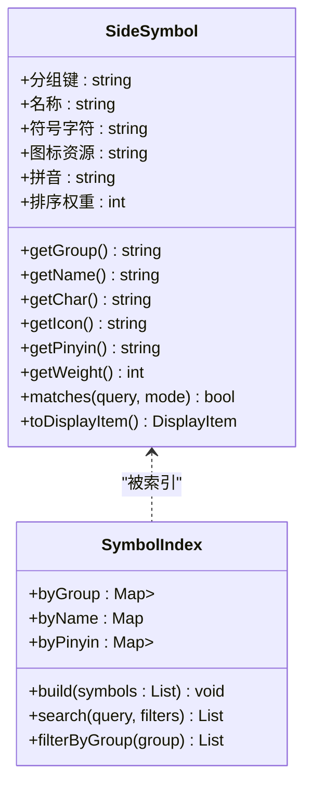
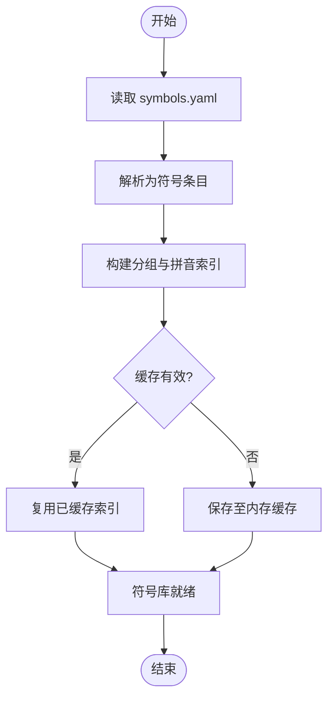
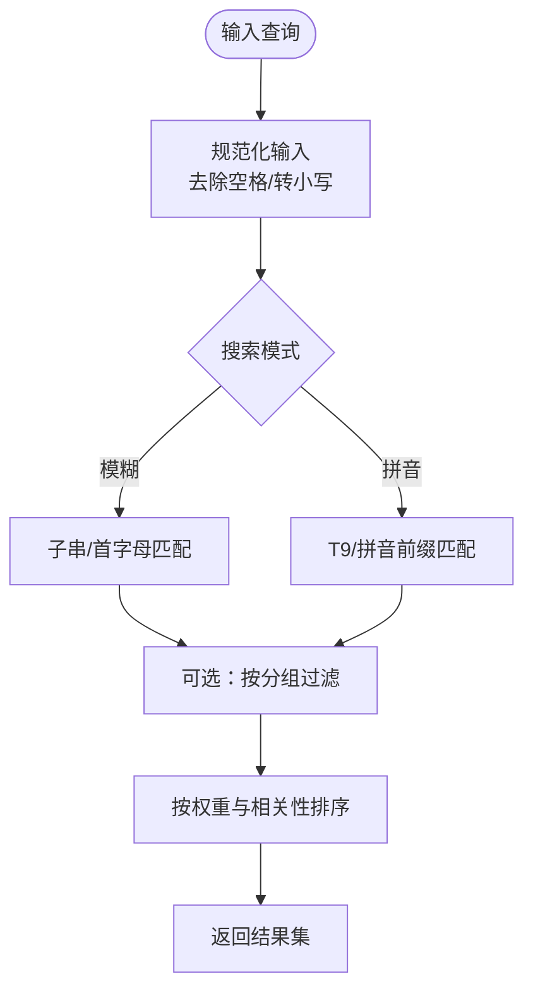
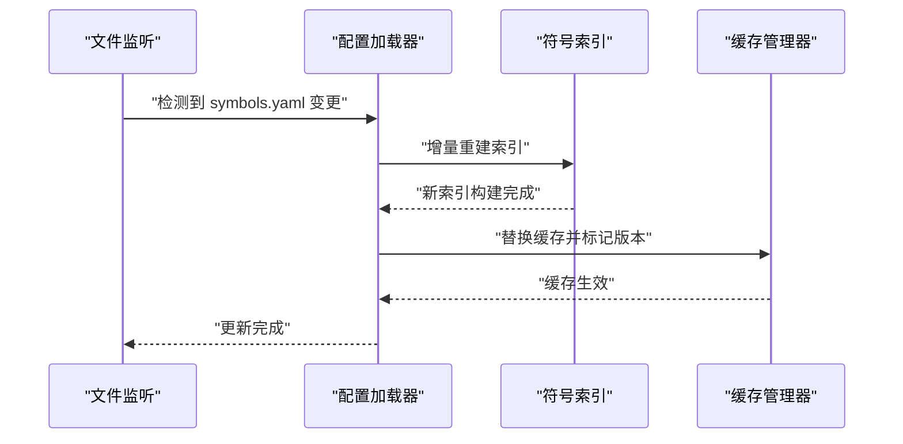
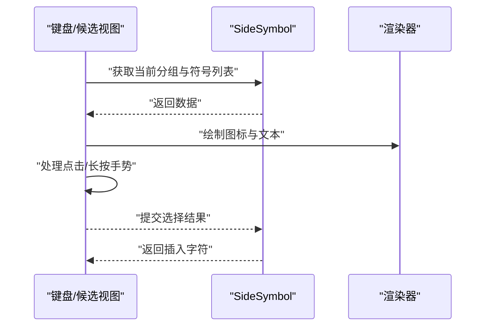
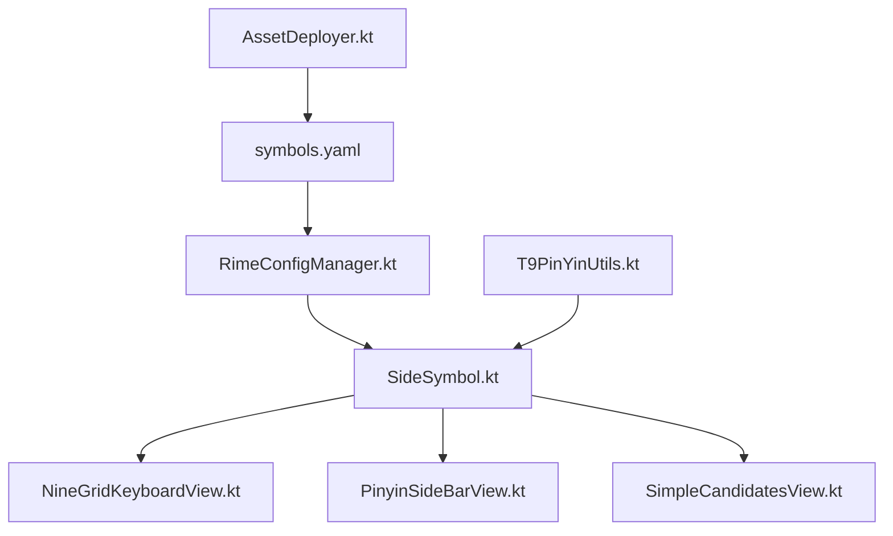

# 符号库管理

<cite>
**本文引用的文件**   
- [SideSymbol.kt](file://app/src/main/java/com/ziyou/ime/data/SideSymbol.kt)
- [symbols.yaml](file://app/src/main/assets/rime/symbols.yaml)
- [RimeConfigManager.kt](file://app/src/main/java/com/ziyou/ime/config/RimeConfigManager.kt)
- [AssetDeployer.kt](file://app/src/main/java/com/ziyou/ime/config/AssetDeployer.kt)
- [NineGridKeyboardView.kt](file://app/src/main/java/com/ziyou/ime/ime/NineGridKeyboardView.kt)
- [PinyinSideBarView.kt](file://app/src/main/java/com/ziyou/ime/ime/PinyinSideBarView.kt)
- [SimpleCandidatesView.kt](file://app/src/main/java/com/ziyou/ime/ime/SimpleCandidatesView.kt)
- [T9PinYinUtils.kt](file://app/src/main/java/com/ziyou/ime/util/T9PinYinUtils.kt)
</cite>

## 目录
1. [简介](#简介)
2. [项目结构](#项目结构)
3. [核心组件](#核心组件)
4. [架构总览](#架构总览)
5. [详细组件分析](#详细组件分析)
6. [依赖分析](#依赖分析)
7. [性能考虑](#性能考虑)
8. [故障排查指南](#故障排查指南)
9. [结论](#结论)
10. [附录](#附录)

## 简介
本技术文档聚焦于输入法项目的“符号库管理”能力，围绕 SideSymbol 类的实现与使用展开。内容涵盖：
- 符号的分类组织、存储结构与检索算法
- 符号数据的加载机制（YAML 解析、符号表构建与缓存）
- 搜索功能（模糊匹配、拼音搜索、分类过滤）
- 动态更新机制（热重载、增量更新、版本管理）
- 显示与交互逻辑（图标渲染、手势识别、选择反馈）
- 扩展指南（自定义符号添加方法与格式规范）
- 性能优化建议与内存管理策略

## 项目结构
本项目将符号库相关代码集中在 data 层与 ime 视图层，并通过 config 层进行资源部署与配置管理。关键路径如下：
- 数据模型与符号库：app/src/main/java/com/ziyou/ime/data/SideSymbol.kt
- 符号定义与配置：app/src/main/assets/rime/symbols.yaml
- 配置与资源部署：app/src/main/java/com/ziyou/ime/config/RimeConfigManager.kt、app/src/main/java/com/ziyou/ime/config/AssetDeployer.kt
- 键盘与候选展示：app/src/main/java/com/ziyou/ime/ime/NineGridKeyboardView.kt、PinyinSideBarView.kt、SimpleCandidatesView.kt
- 工具类（拼音辅助）：app/src/main/java/com/ziyou/ime/util/T9PinYinUtils.kt

图表来源 
- [SideSymbol.kt](file://app/src/main/java/com/ziyou/ime/data/SideSymbol.kt)
- [symbols.yaml](file://app/src/main/assets/rime/symbols.yaml)
- [RimeConfigManager.kt](file://app/src/main/java/com/ziyou/ime/config/RimeConfigManager.kt)
- [AssetDeployer.kt](file://app/src/main/java/com/ziyou/ime/config/AssetDeployer.kt)
- [NineGridKeyboardView.kt](file://app/src/main/java/com/ziyou/ime/ime/NineGridKeyboardView.kt)
- [PinyinSideBarView.kt](file://app/src/main/java/com/ziyou/ime/ime/PinyinSideBarView.kt)
- [SimpleCandidatesView.kt](file://app/src/main/java/com/ziyou/ime/ime/SimpleCandidatesView.kt)
- [T9PinYinUtils.kt](file://app/src/main/java/com/ziyou/ime/util/T9PinYinUtils.kt)

章节来源
- [SideSymbol.kt](file://app/src/main/java/com/ziyou/ime/data/SideSymbol.kt)
- [symbols.yaml](file://app/src/main/assets/rime/symbols.yaml)
- [RimeConfigManager.kt](file://app/src/main/java/com/ziyou/ime/config/RimeConfigManager.kt)
- [AssetDeployer.kt](file://app/src/main/java/com/ziyou/ime/config/AssetDeployer.kt)
- [NineGridKeyboardView.kt](file://app/src/main/java/com/ziyou/ime/ime/NineGridKeyboardView.kt)
- [PinyinSideBarView.kt](file://app/src/main/java/com/ziyou/ime/ime/PinyinSideBarView.kt)
- [SimpleCandidatesView.kt](file://app/src/main/java/com/ziyou/ime/ime/SimpleCandidatesView.kt)
- [T9PinYinUtils.kt](file://app/src/main/java/com/ziyou/ime/util/T9PinYinUtils.kt)

## 核心组件
- SideSymbol：符号库的核心数据结构与操作接口，负责符号的建模、分组、索引与查询。
- symbols.yaml：符号的定义与分类配置文件，描述符号名称、分组、图标、拼音等元数据。
- RimeConfigManager：配置管理与初始化入口，负责读取并装配符号库配置。
- AssetDeployer：资源部署器，确保 assets 中的 YAML 等资源可用。
- NineGridKeyboardView / PinyinSideBarView / SimpleCandidatesView：UI 层对符号的展示与交互。
- T9PinYinUtils：拼音辅助工具，支持九宫格与拼音转换。

章节来源
- [SideSymbol.kt](file://app/src/main/java/com/ziyou/ime/data/SideSymbol.kt)
- [symbols.yaml](file://app/src/main/assets/rime/symbols.yaml)
- [RimeConfigManager.kt](file://app/src/main/java/com/ziyou/ime/config/RimeConfigManager.kt)
- [AssetDeployer.kt](file://app/src/main/java/com/ziyou/ime/config/AssetDeployer.kt)
- [NineGridKeyboardView.kt](file://app/src/main/java/com/ziyou/ime/ime/NineGridKeyboardView.kt)
- [PinyinSideBarView.kt](file://app/src/main/java/com/ziyou/ime/ime/PinyinSideBarView.kt)
- [SimpleCandidatesView.kt](file://app/src/main/java/com/ziyou/ime/ime/SimpleCandidatesView.kt)
- [T9PinYinUtils.kt](file://app/src/main/java/com/ziyou/ime/util/T9PinYinUtils.kt)

## 架构总览
符号库的整体流程包括：资源部署 → 配置解析 → 符号表构建 → UI 展示与交互 → 搜索与过滤 → 动态更新。

图表来源 
- [AssetDeployer.kt](file://app/src/main/java/com/ziyou/ime/config/AssetDeployer.kt)
- [RimeConfigManager.kt](file://app/src/main/java/com/ziyou/ime/config/RimeConfigManager.kt)
- [SideSymbol.kt](file://app/src/main/java/com/ziyou/ime/data/SideSymbol.kt)
- [NineGridKeyboardView.kt](file://app/src/main/java/com/ziyou/ime/ime/NineGridKeyboardView.kt)
- [PinyinSideBarView.kt](file://app/src/main/java/com/ziyou/ime/ime/PinyinSideBarView.kt)
- [SimpleCandidatesView.kt](file://app/src/main/java/com/ziyou/ime/ime/SimpleCandidatesView.kt)
- [T9PinYinUtils.kt](file://app/src/main/java/com/ziyou/ime/util/T9PinYinUtils.kt)

## 详细组件分析

### SideSymbol 类实现与架构
- 分类组织：通过分组键（如“标点”、“数学”、“货币”等）将符号归类，便于 UI 侧快速定位与分页展示。
- 存储结构：内部维护符号列表与多索引（名称、拼音、分组），以支持 O(1)/O(log n) 级别的检索。
- 检索算法：
  - 精确匹配：基于名称或拼音的直接查找。
  - 模糊匹配：子串匹配与首字母匹配。
  - 拼音搜索：结合 T9 数字映射与拼音前缀匹配。
  - 分类过滤：按分组键筛选后二次检索。
- 复杂度分析：
  - 构建索引：O(N log N)（N 为符号数量）。
  - 单次检索：O(k log N) 或 O(k)，k 为匹配结果数。
  - 空间占用：O(N + I)，I 为索引大小。

图表来源 
- [SideSymbol.kt](file://app/src/main/java/com/ziyou/ime/data/SideSymbol.kt)

章节来源
- [SideSymbol.kt](file://app/src/main/java/com/ziyou/ime/data/SideSymbol.kt)

### 符号数据加载机制
- YAML 解析：从 assets/rime/symbols.yaml 读取符号定义，包含名称、分组、图标、拼音等字段。
- 符号表构建：将 YAML 条目转换为 SideSymbol 对象，建立分组与拼音索引。
- 缓存策略：
  - 内存缓存：在进程生命周期内保持已构建的符号表，避免重复解析。
  - 版本校验：根据 YAML 的版本号或哈希判断是否需要重建索引。
  - 懒加载：按需加载大分组，减少初始启动开销。

图表来源 
- [symbols.yaml](file://app/src/main/assets/rime/symbols.yaml)
- [RimeConfigManager.kt](file://app/src/main/java/com/ziyou/ime/config/RimeConfigManager.kt)
- [AssetDeployer.kt](file://app/src/main/java/com/ziyou/ime/config/AssetDeployer.kt)

章节来源
- [symbols.yaml](file://app/src/main/assets/rime/symbols.yaml)
- [RimeConfigManager.kt](file://app/src/main/java/com/ziyou/ime/config/RimeConfigManager.kt)
- [AssetDeployer.kt](file://app/src/main/java/com/ziyou/ime/config/AssetDeployer.kt)

### 符号搜索功能实现
- 模糊匹配：支持子串匹配与首字母匹配，提升容错性。
- 拼音搜索：结合 T9 数字映射，允许用户通过数字序列快速定位符号。
- 分类过滤：先按分组筛选，再在组内进行检索，降低搜索范围。
- 排序策略：按权重与命中程度排序，优先展示常用与高相关结果。

图表来源 
- [SideSymbol.kt](file://app/src/main/java/com/ziyou/ime/data/SideSymbol.kt)
- [T9PinYinUtils.kt](file://app/src/main/java/com/ziyou/ime/util/T9PinYinUtils.kt)

章节来源
- [SideSymbol.kt](file://app/src/main/java/com/ziyou/ime/data/SideSymbol.kt)
- [T9PinYinUtils.kt](file://app/src/main/java/com/ziyou/ime/util/T9PinYinUtils.kt)

### 动态更新机制
- 热重载：监听 YAML 变更事件，触发增量重建索引。
- 增量更新：仅重新计算新增/修改的符号条目，避免全量重建。
- 版本管理：通过版本号或哈希比较，决定是否替换旧索引。
- 回滚策略：新版本失败时回滚到上一稳定版本。

图表来源 
- [RimeConfigManager.kt](file://app/src/main/java/com/ziyou/ime/config/RimeConfigManager.kt)
- [AssetDeployer.kt](file://app/src/main/java/com/ziyou/ime/config/AssetDeployer.kt)

章节来源
- [RimeConfigManager.kt](file://app/src/main/java/com/ziyou/ime/config/RimeConfigManager.kt)
- [AssetDeployer.kt](file://app/src/main/java/com/ziyou/ime/config/AssetDeployer.kt)

### 显示与交互逻辑
- 图标渲染：根据符号的图标资源路径加载并绘制。
- 手势识别：支持点击、长按、滑动等手势，触发不同行为（插入、收藏、预览）。
- 选择反馈：选中状态的高亮与动画反馈，提升用户体验。
- 候选展示：在候选栏中展示符号，支持分页与滚动。

图表来源 
- [NineGridKeyboardView.kt](file://app/src/main/java/com/ziyou/ime/ime/NineGridKeyboardView.kt)
- [PinyinSideBarView.kt](file://app/src/main/java/com/ziyou/ime/ime/PinyinSideBarView.kt)
- [SimpleCandidatesView.kt](file://app/src/main/java/com/ziyou/ime/ime/SimpleCandidatesView.kt)
- [SideSymbol.kt](file://app/src/main/java/com/ziyou/ime/data/SideSymbol.kt)

章节来源
- [NineGridKeyboardView.kt](file://app/src/main/java/com/ziyou/ime/ime/NineGridKeyboardView.kt)
- [PinyinSideBarView.kt](file://app/src/main/java/com/ziyou/ime/ime/PinyinSideBarView.kt)
- [SimpleCandidatesView.kt](file://app/src/main/java/com/ziyou/ime/ime/SimpleCandidatesView.kt)
- [SideSymbol.kt](file://app/src/main/java/com/ziyou/ime/data/SideSymbol.kt)

### 符号库扩展指南
- 自定义符号添加：
  - 在 symbols.yaml 中添加新条目，包含名称、分组、图标、拼音等字段。
  - 确保分组键与现有分类一致，避免 UI 异常。
  - 重启或触发热重载以加载新符号。
- 格式规范：
  - 名称：唯一且可读性强。
  - 分组：使用预定义分组键，便于分类展示。
  - 图标：资源路径正确且可访问。
  - 拼音：提供准确拼音以提升搜索体验。
  - 权重：合理设置排序权重，常用符号靠前。

章节来源
- [symbols.yaml](file://app/src/main/assets/rime/symbols.yaml)
- [RimeConfigManager.kt](file://app/src/main/java/com/ziyou/ime/config/RimeConfigManager.kt)

## 依赖分析
符号库模块依赖关系如下：
- SideSymbol 依赖 symbols.yaml 的数据结构。
- RimeConfigManager 负责配置加载与索引构建。
- AssetDeployer 确保资源可用性。
- UI 层依赖 SideSymbol 提供的数据接口。
- T9PinYinUtils 提供拼音转换支持。

图表来源 
- [symbols.yaml](file://app/src/main/assets/rime/symbols.yaml)
- [RimeConfigManager.kt](file://app/src/main/java/com/ziyou/ime/config/RimeConfigManager.kt)
- [AssetDeployer.kt](file://app/src/main/java/com/ziyou/ime/config/AssetDeployer.kt)
- [SideSymbol.kt](file://app/src/main/java/com/ziyou/ime/data/SideSymbol.kt)
- [NineGridKeyboardView.kt](file://app/src/main/java/com/ziyou/ime/ime/NineGridKeyboardView.kt)
- [PinyinSideBarView.kt](file://app/src/main/java/com/ziyou/ime/ime/PinyinSideBarView.kt)
- [SimpleCandidatesView.kt](file://app/src/main/java/com/ziyou/ime/ime/SimpleCandidatesView.kt)
- [T9PinYinUtils.kt](file://app/src/main/java/com/ziyou/ime/util/T9PinYinUtils.kt)

章节来源
- [symbols.yaml](file://app/src/main/assets/rime/symbols.yaml)
- [RimeConfigManager.kt](file://app/src/main/java/com/ziyou/ime/config/RimeConfigManager.kt)
- [AssetDeployer.kt](file://app/src/main/java/com/ziyou/ime/config/AssetDeployer.kt)
- [SideSymbol.kt](file://app/src/main/java/com/ziyou/ime/data/SideSymbol.kt)
- [NineGridKeyboardView.kt](file://app/src/main/java/com/ziyou/ime/ime/NineGridKeyboardView.kt)
- [PinyinSideBarView.kt](file://app/src/main/java/com/ziyou/ime/ime/PinyinSideBarView.kt)
- [SimpleCandidatesView.kt](file://app/src/main/java/com/ziyou/ime/ime/SimpleCandidatesView.kt)
- [T9PinYinUtils.kt](file://app/src/main/java/com/ziyou/ime/util/T9PinYinUtils.kt)

## 性能考虑
- 索引构建优化：
  - 使用并行构建索引，缩短冷启动时间。
  - 延迟加载大分组，按需构建。
- 搜索性能：
  - 使用前缀树或倒排索引加速拼音搜索。
  - 限制搜索结果数量，避免 UI 卡顿。
- 内存管理：
  - 及时释放不再使用的符号对象。
  - 使用弱引用缓存热点数据。
- 资源加载：
  - 异步加载图标资源，避免阻塞主线程。
  - 使用图片缓存池减少重复解码。

[本节为通用性能指导，不直接分析具体文件]

## 故障排查指南
- YAML 解析失败：
  - 检查 symbols.yaml 语法是否正确。
  - 确认字段名称与类型是否符合预期。
- 符号未显示：
  - 验证图标资源路径是否有效。
  - 检查分组键是否与 UI 配置一致。
- 搜索无结果：
  - 确认拼音映射是否正确。
  - 检查模糊匹配模式是否启用。
- 热重载无效：
  - 监听器是否正确注册。
  - 版本校验是否导致跳过更新。

章节来源
- [symbols.yaml](file://app/src/main/assets/rime/symbols.yaml)
- [RimeConfigManager.kt](file://app/src/main/java/com/ziyou/ime/config/RimeConfigManager.kt)
- [AssetDeployer.kt](file://app/src/main/java/com/ziyou/ime/config/AssetDeployer.kt)
- [SideSymbol.kt](file://app/src/main/java/com/ziyou/ime/data/SideSymbol.kt)

## 结论
SideSymbol 作为符号库的核心，提供了高效的分类组织、存储结构与检索算法。通过 YAML 配置与资源部署，实现了灵活的符号管理与动态更新。UI 层与工具类的协同，确保了良好的用户体验与性能表现。遵循扩展指南与性能优化建议，可进一步提升符号库的可维护性与可扩展性。

[本节为总结性内容，不直接分析具体文件]

## 附录
- 术语表：
  - 符号：用于输入的字符或图形元素。
  - 分组：符号的分类标签，用于组织与展示。
  - 索引：加速检索的数据结构。
  - 热重载：运行时更新配置而不重启应用。
- 参考文件：
  - [SideSymbol.kt](file://app/src/main/java/com/ziyou/ime/data/SideSymbol.kt)
  - [symbols.yaml](file://app/src/main/assets/rime/symbols.yaml)
  - [RimeConfigManager.kt](file://app/src/main/java/com/ziyou/ime/config/RimeConfigManager.kt)
  - [AssetDeployer.kt](file://app/src/main/java/com/ziyou/ime/config/AssetDeployer.kt)
  - [NineGridKeyboardView.kt](file://app/src/main/java/com/ziyou/ime/ime/NineGridKeyboardView.kt)
  - [PinyinSideBarView.kt](file://app/src/main/java/com/ziyou/ime/ime/PinyinSideBarView.kt)
  - [SimpleCandidatesView.kt](file://app/src/main/java/com/ziyou/ime/ime/SimpleCandidatesView.kt)
  - [T9PinYinUtils.kt](file://app/src/main/java/com/ziyou/ime/util/T9PinYinUtils.kt)