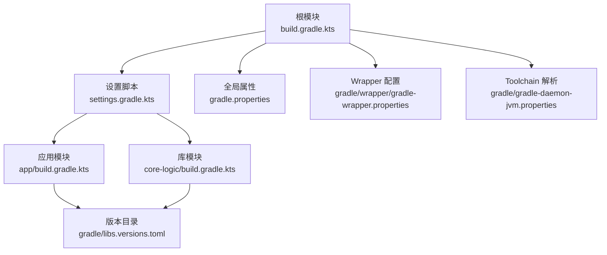
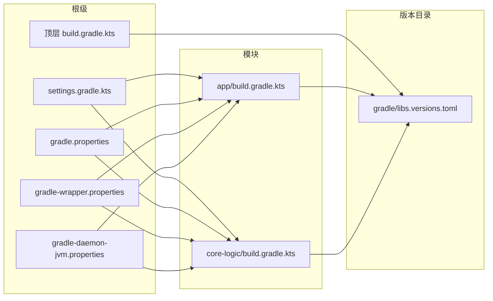
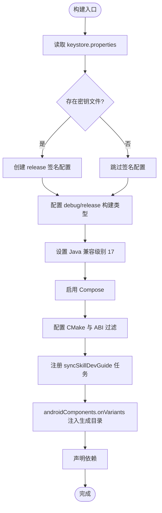
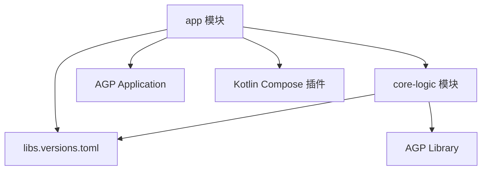

# Gradle 构建配置

<cite>
**本文引用的文件**   
- [build.gradle.kts](file://build.gradle.kts)
- [settings.gradle.kts](file://settings.gradle.kts)
- [app/build.gradle.kts](file://app/build.gradle.kts)
- [core-logic/build.gradle.kts](file://core-logic/build.gradle.kts)
- [gradle/libs.versions.toml](file://gradle/libs.versions.toml)
- [gradle.properties](file://gradle.properties)
- [gradle/wrapper/gradle-wrapper.properties](file://gradle/wrapper/gradle-wrapper.properties)
- [gradle/gradle-daemon-jvm.properties](file://gradle/gradle-daemon-jvm.properties)
- [app/proguard-rules.pro](file://app/proguard-rules.pro)
- [keystore.properties.template](file://keystore.properties.template)
</cite>

## 目录
1. [简介](#简介)
2. [项目结构](#项目结构)
3. [核心组件](#核心组件)
4. [架构总览](#架构总览)
5. [详细组件分析](#详细组件分析)
6. [依赖分析](#依赖分析)
7. [性能与优化](#性能与优化)
8. [故障排查指南](#故障排查指南)
9. [结论](#结论)
10. [附录](#附录)

## 简介
本技术文档围绕该 Android/Kotlin 多模块项目的 Gradle 构建配置进行系统化说明，覆盖顶层插件管理与版本控制、设置与仓库策略、应用模块与库模块的构建配置、版本目录管理、以及构建优化与常见问题解决方案。读者可据此快速理解并维护项目的构建体系，确保在本地与 CI 环境下的稳定、高效构建。

## 项目结构
本项目采用多模块结构：
- 根目录 build.gradle.kts 声明全局插件（Android Application、Android Library、Kotlin Compose），并通过 apply false 避免在根模块直接启用。
- settings.gradle.kts 集中管理插件仓库、依赖仓库、工具链解析器，并声明子模块 app 与 core-logic。
- app 为 Android 应用模块，包含 UI、JNI 集成、资源与签名配置。
- core-logic 为纯逻辑库模块，使用 Android library 形态承载无 Android 框架依赖的可测试代码。
- gradle/libs.versions.toml 统一版本与依赖别名，配合 Gradle Version Catalogs 实现集中化版本治理。
- gradle.properties 与 wrapper 配置用于 JVM 参数、并行与缓存开关、Gradle 版本与 Toolchain。

图表来源
- [build.gradle.kts:1-7](file://build.gradle.kts#L1-L7)
- [settings.gradle.kts:1-28](file://settings.gradle.kts#L1-L28)
- [app/build.gradle.kts:1-192](file://app/build.gradle.kts#L1-L192)
- [core-logic/build.gradle.kts:1-29](file://core-logic/build.gradle.kts#L1-L29)
- [gradle/libs.versions.toml:1-51](file://gradle/libs.versions.toml#L1-L51)
- [gradle.properties:1-24](file://gradle.properties#L1-L24)
- [gradle/wrapper/gradle-wrapper.properties:1-10](file://gradle/wrapper/gradle-wrapper.properties#L1-L10)
- [gradle/gradle-daemon-jvm.properties:1-13](file://gradle/gradle-daemon-jvm.properties#L1-L13)

章节来源
- [build.gradle.kts:1-7](file://build.gradle.kts#L1-L7)
- [settings.gradle.kts:1-28](file://settings.gradle.kts#L1-L28)

## 核心组件
- 顶层插件管理：通过 alias(libs.plugins.*) 引入 Android Application、Android Library、Kotlin Compose 插件，并在根模块 apply false，由子模块按需启用。
- 设置与仓库策略：pluginManagement 限定插件仓库范围；dependencyResolutionManagement 强制 FAIL_ON_PROJECT_REPOS，统一 google()、mavenCentral()。
- 应用模块配置：Android 编译 SDK、默认配置、NDK ABI 过滤、CMake 外部构建、签名、混淆、Compose 支持、资源处理任务、依赖声明。
- 库模块配置：Android library 形态但纯 Kotlin 逻辑，Java 兼容级别、最小 SDK、单元测试依赖。
- 版本目录：集中定义 AGP、Kotlin、Compose BOM、第三方库版本与插件别名，供各模块引用。
- 构建优化：JVM 内存、配置缓存、Toolchain 固定 JDK 路径、禁用自动下载与检测、Wrapper 版本锁定。

章节来源
- [build.gradle.kts:1-7](file://build.gradle.kts#L1-L7)
- [settings.gradle.kts:1-28](file://settings.gradle.kts#L1-L28)
- [app/build.gradle.kts:1-192](file://app/build.gradle.kts#L1-L192)
- [core-logic/build.gradle.kts:1-29](file://core-logic/build.gradle.kts#L1-L29)
- [gradle/libs.versions.toml:1-51](file://gradle/libs.versions.toml#L1-L51)
- [gradle.properties:1-24](file://gradle.properties#L1-L24)

## 架构总览
下图展示 Gradle 构建脚本之间的依赖关系与职责划分：

图表来源
- [build.gradle.kts:1-7](file://build.gradle.kts#L1-L7)
- [settings.gradle.kts:1-28](file://settings.gradle.kts#L1-L28)
- [app/build.gradle.kts:1-192](file://app/build.gradle.kts#L1-L192)
- [core-logic/build.gradle.kts:1-29](file://core-logic/build.gradle.kts#L1-L29)
- [gradle/libs.versions.toml:1-51](file://gradle/libs.versions.toml#L1-L51)
- [gradle.properties:1-24](file://gradle.properties#L1-L24)
- [gradle/wrapper/gradle-wrapper.properties:1-10](file://gradle/wrapper/gradle-wrapper.properties#L1-L10)
- [gradle/gradle-daemon-jvm.properties:1-13](file://gradle/gradle-daemon-jvm.properties#L1-L13)

## 详细组件分析

### 顶层 build.gradle.kts：插件管理与版本控制
- 使用 alias(libs.plugins.*) 引用版本目录中的插件 ID 与版本，避免在各模块重复声明版本号。
- 仅声明插件并 apply false，确保根模块不执行任何构建逻辑，只作为版本与插件的统一入口。
- 优点：集中化版本治理、减少重复、便于升级与一致性校验。

章节来源
- [build.gradle.kts:1-7](file://build.gradle.kts#L1-L7)
- [gradle/libs.versions.toml:46-50](file://gradle/libs.versions.toml#L46-L50)

### settings.gradle.kts：多模块设置与依赖管理
- pluginManagement.repositories：限定插件来源，优先 Google 仓库（含 com.android.*、com.google.*、androidx.*），再回退 mavenCentral 与 Gradle Plugin Portal。
- dependencyResolutionManagement：强制 FAIL_ON_PROJECT_REPOS，禁止子模块自行添加仓库，统一 google() 与 mavenCentral()。
- 工具链解析：启用 org.gradle.toolchains.foojay-resolver-convention 以自动解析跨平台 JDK。
- 模块声明：include(":app") 与 include(":core-logic") 明确多模块边界。

章节来源
- [settings.gradle.kts:1-28](file://settings.gradle.kts#L1-L28)
- [gradle/gradle-daemon-jvm.properties:1-13](file://gradle/gradle-daemon-jvm.properties#L1-L13)

### app/build.gradle.kts：应用模块配置详解
- 命名空间与编译目标：namespace、compileSdk、minSdk、targetSdk、versionCode/versionName。
- NDK 与 CMake：abiFilters 动态读取 -Pziyou.abis，externalNativeBuild 指定 CMakeLists.txt 路径与版本，arguments 开启 WITH_PREDICT。
- 签名配置：从 keystore.properties 读取密钥信息，release 构建可选签名；未提供时产出未签名 APK 便于 CI 校验。
- 构建类型：debug 关闭 JNI 调试；release 开启混淆但不启用激进优化，避免破坏 JNI 符号与反射。
- Java 兼容：source/target compatibility 设置为 17。
- Compose：启用 compose 功能。
- 打包策略：jniLibs.useLegacyPackaging=false。
- 测试选项：unitTests.isReturnDefaultValues=true 提升单测稳定性。
- 自定义任务：SyncSkillDevGuideTask 将 docs/技能插件开发指南.md 同步到 assets/docs/skill_dev_guide.md，并通过 androidComponents.onVariants 注入生成目录。
- 依赖声明：内部模块 :core-logic、AndroidX Core、Lifecycle、Activity Compose、Compose BOM、Coroutines、Preference、WebView、CustomView、调试与测试依赖。

图表来源
- [app/build.gradle.kts:1-192](file://app/build.gradle.kts#L1-L192)

章节来源
- [app/build.gradle.kts:1-192](file://app/build.gradle.kts#L1-L192)
- [app/proguard-rules.pro:1-6](file://app/proguard-rules.pro#L1-L6)
- [keystore.properties.template:1-12](file://keystore.properties.template#L1-L12)

### core-logic/build.gradle.kts：库模块配置
- 使用 Android library 插件，但模块内代码不包含 Android 框架依赖，保持纯逻辑。
- 命名空间、compileSdk、minSdk 与 Java 兼容级别 17。
- 依赖：仅 JUnit 用于单元测试，体现“最小依赖”原则。
- 设计意图：通过编译器强制依赖方向 app → core-logic，保证逻辑层独立可测。

章节来源
- [core-logic/build.gradle.kts:1-29](file://core-logic/build.gradle.kts#L1-L29)

### gradle/libs.versions.toml：版本目录管理
- versions 段：集中定义 AGP、Kotlin、Compose BOM、AndroidX、Coroutines、MockK、org.json 等版本。
- libraries 段：以 group/name/version.ref 形式声明依赖别名，如 androidx-core-ktx、junit、androidx-compose-bom 等。
- plugins 段：声明 android-application、android-library、kotlin-compose 插件 ID 与版本引用。
- 优势：统一版本、减少冲突、提高可读性与可维护性。

章节来源
- [gradle/libs.versions.toml:1-51](file://gradle/libs.versions.toml#L1-L51)

### gradle.properties 与 Wrapper：构建环境与工具链
- org.gradle.jvmargs：设置 Gradle Daemon 最大堆内存与编码。
- org.gradle.configuration-cache：启用配置缓存以提升增量构建速度。
- org.gradle.java.installations.paths：固定 JDK 安装路径，禁用自动检测与下载，确保跨平台一致性。
- gradle-wrapper.properties：锁定 Gradle 分发版本与校验和，保障团队与 CI 一致。
- gradle-daemon-jvm.properties：基于 foojay 解析不同平台的 JDK Toolchain 下载地址与版本。

章节来源
- [gradle.properties:1-24](file://gradle.properties#L1-L24)
- [gradle/wrapper/gradle-wrapper.properties:1-10](file://gradle/wrapper/gradle-wrapper.properties#L1-L10)
- [gradle/gradle-daemon-jvm.properties:1-13](file://gradle/gradle-daemon-jvm.properties#L1-L13)

## 依赖分析
- 模块依赖：app 依赖 core-logic（implementation(project(":core-logic"))），形成单向依赖，利于隔离与测试。
- 插件依赖：app 与 core-logic 分别启用 android.application 与 android.library 插件，均通过版本目录统一管理。
- 外部依赖：AndroidX、Compose、Coroutines、WebView、CustomView、JUnit/MockK 等均在 libs.versions.toml 中集中声明。

图表来源
- [app/build.gradle.kts:143-191](file://app/build.gradle.kts#L143-L191)
- [core-logic/build.gradle.kts:1-29](file://core-logic/build.gradle.kts#L1-L29)
- [gradle/libs.versions.toml:19-50](file://gradle/libs.versions.toml#L19-L50)

章节来源
- [app/build.gradle.kts:143-191](file://app/build.gradle.kts#L143-L191)
- [core-logic/build.gradle.kts:1-29](file://core-logic/build.gradle.kts#L1-L29)
- [gradle/libs.versions.toml:19-50](file://gradle/libs.versions.toml#L19-L50)

## 性能与优化
- 并行构建：可通过 org.gradle.parallel=true 启用（当前注释掉），适用于解耦良好的多模块项目。
- 配置缓存：org.gradle.configuration-cache=true 已启用，显著减少配置阶段耗时。
- 增量编译：AGP 与 Kotlin 默认启用增量编译，结合版本目录可减少不必要的重新编译。
- 内存优化：org.gradle.jvmargs=-Xmx2048m 限制 Gradle 进程内存，避免 OOM。
- Toolchain 固定：org.gradle.java.installations.paths 指向 Android Studio JBR，禁用自动检测与下载，提升稳定性。
- Wrapper 版本锁定：确保所有开发者与 CI 使用相同 Gradle 版本。
- 混淆与体积：release 开启 isMinifyEnabled 与 ProGuard 规则，关闭 optimization 以避免破坏 JNI 符号。

[本节为通用指导，无需具体文件引用]

## 故障排查指南
- JNI 链接失败（undefined symbol）：检查 externalNativeBuild.arguments("-DWITH_PREDICT=ON") 是否与 librime-prebuilt 侧 WITH_PREDICT 开关一致。
- 签名失败或产物未签名：确认 keystore.properties 存在且字段正确；若不存在则 release 构建会产出未签名 APK。
- 资源同步异常：确保 docs/技能插件开发指南.md 存在，syncSkillDevGuide 任务会将内容复制到 assets/docs/skill_dev_guide.md。
- 单测返回桩方法异常：testOptions.unitTests.isReturnDefaultValues=true 已启用，避免 “not mocked” 异常。
- 依赖仓库问题：settings.gradle.kts 已强制 FAIL_ON_PROJECT_REPOS，子模块不得新增仓库；检查网络与镜像源。
- Toolchain 解析失败：确认 gradle-daemon-jvm.properties 可用且网络可达；必要时手动安装对应 JDK。

章节来源
- [app/build.gradle.kts:40-47](file://app/build.gradle.kts#L40-L47)
- [app/build.gradle.kts:50-81](file://app/build.gradle.kts#L50-L81)
- [app/build.gradle.kts:115-141](file://app/build.gradle.kts#L115-L141)
- [app/build.gradle.kts:105-111](file://app/build.gradle.kts#L105-L111)
- [settings.gradle.kts:17-23](file://settings.gradle.kts#L17-L23)
- [gradle/gradle-daemon-jvm.properties:1-13](file://gradle/gradle-daemon-jvm.properties#L1-L13)

## 结论
本项目通过 Gradle 版本目录与集中式设置脚本实现了高度一致的插件与依赖治理，应用与库模块职责清晰，JNI 与 Compose 配置完善，构建性能与稳定性得到充分保障。遵循本文档的配置与排错建议，可在本地与 CI 环境下获得稳定高效的构建体验。

## 附录
- 发布签名模板：keystore.properties.template 提供了密钥库生成与填写指引，务必妥善保管并禁止提交至版本库。
- ProGuard 规则：app/proguard-rules.pro 保留 core 包类与 native 方法，避免混淆破坏 JNI 调用。

章节来源
- [keystore.properties.template:1-12](file://keystore.properties.template#L1-L12)
- [app/proguard-rules.pro:1-6](file://app/proguard-rules.pro#L1-L6)