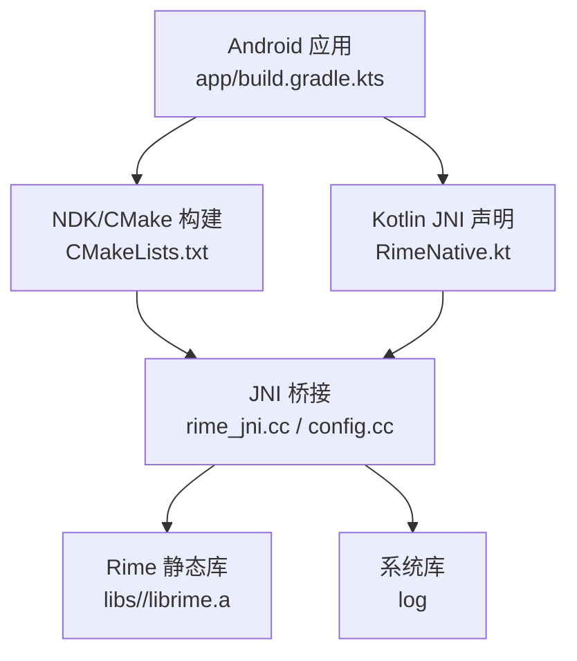
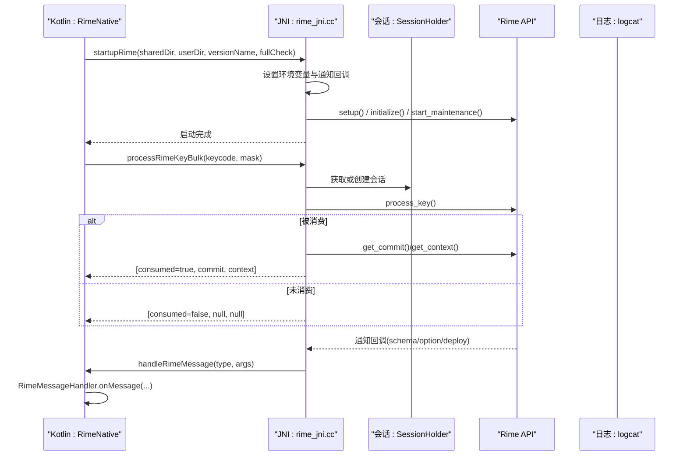
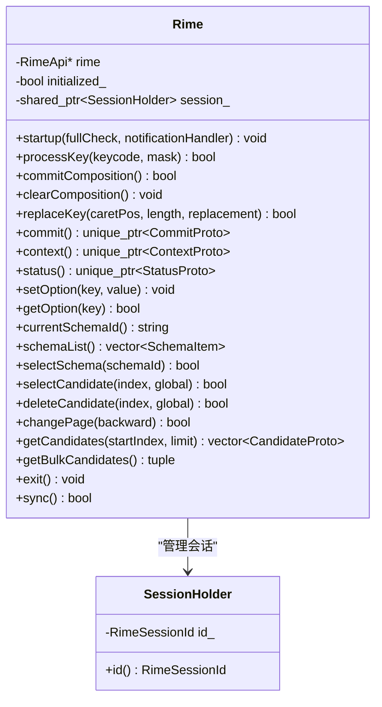
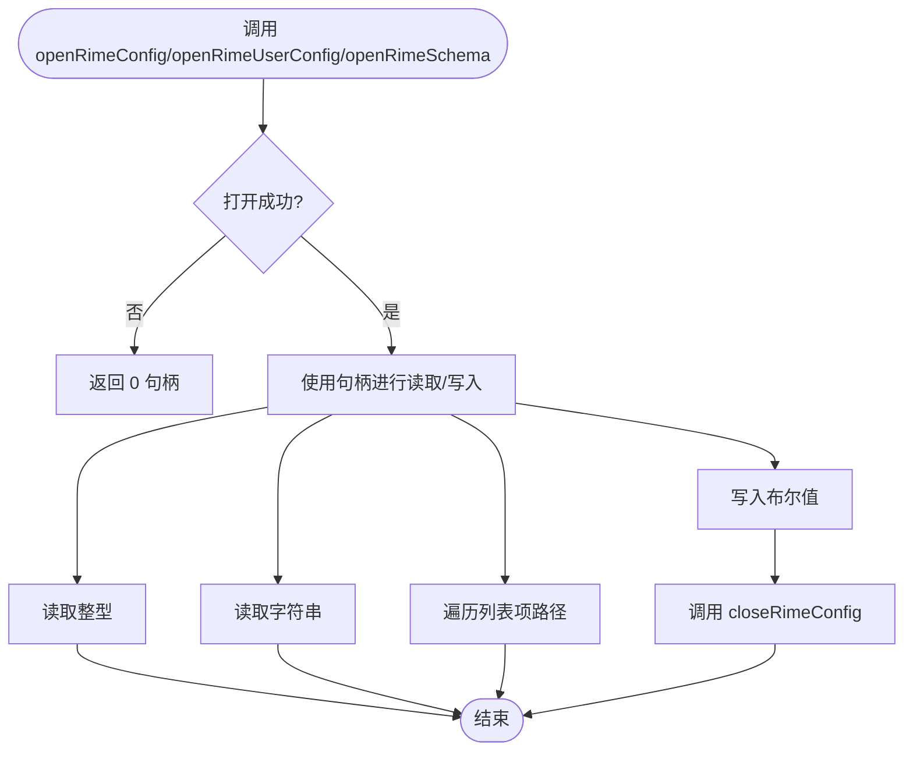
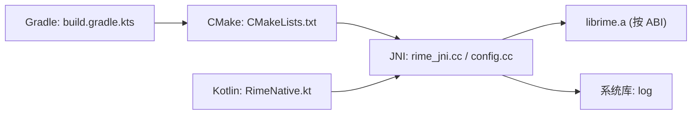

# NDK 集成配置

<cite>
**本文引用的文件**   
- [CMakeLists.txt](file://app/src/main/jni/librime_jni/CMakeLists.txt)
- [rime_jni.cc](file://app/src/main/jni/librime_jni/rime_jni.cc)
- [config.cc](file://app/src/main/jni/librime_jni/config.cc)
- [jni-utils.h](file://app/src/main/jni/librime_jni/jni-utils.h)
- [session.h](file://app/src/main/jni/librime_jni/session.h)
- [helper-types.h](file://app/src/main/jni/librime_jni/helper-types.h)
- [build.gradle.kts](file://app/build.gradle.kts)
- [gradle.properties](file://gradle.properties)
- [RimeNative.kt](file://app/src/main/java/com/ziyou/ime/core/RimeNative.kt)
- [RimeMessage.kt](file://app/src/main/java/com/ziyou/ime/core/RimeMessage.kt)
</cite>

## 目录
1. [简介](#简介)
2. [项目结构](#项目结构)
3. [核心组件](#核心组件)
4. [架构总览](#架构总览)
5. [详细组件分析](#详细组件分析)
6. [依赖关系分析](#依赖关系分析)
7. [性能考虑](#性能考虑)
8. [故障排查指南](#故障排查指南)
9. [结论](#结论)
10. [附录](#附录)

## 简介
本技术文档聚焦于 Android NDK 集成与 Rime 输入法引擎的 C++ 桥接实现，围绕以下目标展开：
- 解析 CMakeLists.txt 中的 C++ 编译配置（目标架构、编译器选项、链接器配置、条件编译标志）。
- 详解 rime_jni.cc 的 JNI 桥接实现（Java 与 C++ 数据类型映射、函数调用约定、异常处理机制）。
- 说明 config.cc 的配置管理实现（Rime 配置文件加载、解析与动态更新）。
- 梳理 gradle.properties 与 app/build.gradle.kts 中的 NDK 构建参数（ABI 过滤、CMake 版本、外部构建路径等）。
- 提供原生库编译流程、调试配置与性能优化技巧。
- 总结常见 NDK 构建问题与解决方案，以及跨平台兼容性注意事项。

## 项目结构
本项目采用“应用模块 + 原生 JNI + 预编译静态库”的组织方式：
- app 模块负责 Android UI、Kotlin 层 API 封装与 Gradle 构建配置。
- jni/librime_jni 目录包含 CMake 脚本与 JNI 桥接源码（rime_jni.cc、config.cc）及工具头文件（jni-utils.h、session.h、helper-types.h）。
- libs 目录存放按 ABI 分发的 librime.a 静态库与公共头文件。
- gradle.properties 与 build.gradle.kts 统一控制 NDK、CMake、ABI 过滤与构建行为。

图表来源
- [build.gradle.kts:92-97](file://app/build.gradle.kts#L92-L97)
- [CMakeLists.txt:5-78](file://app/src/main/jni/librime_jni/CMakeLists.txt#L5-L78)
- [rime_jni.cc:1-528](file://app/src/main/jni/librime_jni/rime_jni.cc#L1-L528)
- [config.cc:1-111](file://app/src/main/jni/librime_jni/config.cc#L1-L111)

章节来源
- [build.gradle.kts:22-48](file://app/build.gradle.kts#L22-L48)
- [CMakeLists.txt:1-78](file://app/src/main/jni/librime_jni/CMakeLists.txt#L1-L78)

## 核心组件
- CMake 构建配置：定义 C++ 标准、可选模块开关、头文件与静态库路径、链接器优化参数、系统库依赖。
- JNI 桥接层：暴露 Java 可调用的 native 方法，封装 Rime 引擎生命周期、输入处理、候选词操作、状态查询与消息回调。
- 配置管理：通过 Rime API 打开/关闭配置对象，读取整数、字符串与列表项，支持布尔写入。
- Kotlin 接口层：声明 external 方法、库加载与错误检查、消息分发与协程流广播。

章节来源
- [CMakeLists.txt:1-78](file://app/src/main/jni/librime_jni/CMakeLists.txt#L1-L78)
- [rime_jni.cc:1-528](file://app/src/main/jni/librime_jni/rime_jni.cc#L1-L528)
- [config.cc:1-111](file://app/src/main/jni/librime_jni/config.cc#L1-L111)
- [RimeNative.kt:1-170](file://app/src/main/java/com/ziyou/ime/core/RimeNative.kt#L1-L170)

## 架构总览
下图展示从 Kotlin 到 C++ 再到 Rime 引擎的调用链路与数据流向，包括 JNI 初始化、键事件批量处理与消息回调。

图表来源
- [rime_jni.cc:270-315](file://app/src/main/jni/librime_jni/rime_jni.cc#L270-L315)
- [rime_jni.cc:366-384](file://app/src/main/jni/librime_jni/rime_jni.cc#L366-L384)
- [session.h:12-35](file://app/src/main/jni/librime_jni/session.h#L12-L35)
- [RimeNative.kt:152-169](file://app/src/main/java/com/ziyou/ime/core/RimeNative.kt#L152-L169)

## 详细组件分析

### CMakeLists.txt 构建配置
- C++ 标准与必需性：启用 C++17，强制要求该标准。
- 可选模块开关：WITH_LUA、WITH_OCTAGRAM、WITH_PREDICT、WITH_OPENCC，通过 add_definitions 注入宏，供源码条件编译使用。
- 头文件与静态库路径：基于相对路径推导根目录，指向 libs/include 与 libs/${ANDROID_ABI}。
- 共享库目标：rime_jni 由 rime_jni.cc 与 config.cc 组成。
- 链接器优化：启用死代码消除、排除所有静态库符号、设置 16KB 页面对齐（Android 15+ 要求）。
- 依赖校验：若找不到 librime.a，构建失败并提示补全预编译产物。
- 系统库：链接 log。

章节来源
- [CMakeLists.txt:8-16](file://app/src/main/jni/librime_jni/CMakeLists.txt#L8-L16)
- [CMakeLists.txt:17-31](file://app/src/main/jni/librime_jni/CMakeLists.txt#L17-L31)
- [CMakeLists.txt:32-53](file://app/src/main/jni/librime_jni/CMakeLists.txt#L32-L53)
- [CMakeLists.txt:55-78](file://app/src/main/jni/librime_jni/CMakeLists.txt#L55-L78)

### rime_jni.cc JNI 桥接实现
- 模块依赖声明：根据 WITH_* 宏在库加载时显式注册可选模块。
- 单例引擎封装：Rime 类维护 API 指针、初始化状态与会话持有者；提供 startup、processKey、commit/clear、替换编码、上下文/状态获取、选项读写、方案管理与候选词操作等方法。
- JNI 入口与全局引用：JNI_OnLoad 初始化全局引用单例，缓存常用 Java 类与方法 ID，便于后续快速调用。
- 环境变量与通知回调：startupRime 设置 RIME_* 环境变量，注册通知回调，将 Rime 通知转发至 Kotlin 的 handleRimeMessage。
- 内存优化：trimNativeHeap 调用 mallopt(M_PURGE) 归还空闲页，降低部署后常驻内存。
- 热路径批量接口：processRimeKeyBulk 在一次跨界中完成按键处理与结果收集，减少 JNI 开销。
- 异常处理：回调中捕获并清理 JNI 异常，避免崩溃；会话创建异常被捕获并记录日志。

图表来源
- [rime_jni.cc:46-265](file://app/src/main/jni/librime_jni/rime_jni.cc#L46-L265)
- [session.h:12-35](file://app/src/main/jni/librime_jni/session.h#L12-L35)

章节来源
- [rime_jni.cc:21-44](file://app/src/main/jni/librime_jni/rime_jni.cc#L21-L44)
- [rime_jni.cc:270-315](file://app/src/main/jni/librime_jni/rime_jni.cc#L270-L315)
- [rime_jni.cc:337-343](file://app/src/main/jni/librime_jni/rime_jni.cc#L337-L343)
- [rime_jni.cc:366-384](file://app/src/main/jni/librime_jni/rime_jni.cc#L366-L384)
- [rime_jni.cc:410-432](file://app/src/main/jni/librime_jni/rime_jni.cc#L410-L432)
- [rime_jni.cc:456-475](file://app/src/main/jni/librime_jni/rime_jni.cc#L456-L475)
- [rime_jni.cc:480-527](file://app/src/main/jni/librime_jni/rime_jni.cc#L480-L527)

### config.cc 配置管理实现
- 打开配置：分别支持普通配置、用户配置与 schema 配置的打开，返回裸指针作为句柄。
- 关闭配置：释放配置对象。
- 读取值：支持整型、字符串与列表项路径遍历。
- 写入值：支持布尔值写入。
- 错误处理：打开失败返回 0 句柄，读取失败返回空值。

图表来源
- [config.cc:11-34](file://app/src/main/jni/librime_jni/config.cc#L11-L34)
- [config.cc:49-57](file://app/src/main/jni/librime_jni/config.cc#L49-L57)
- [config.cc:59-99](file://app/src/main/jni/librime_jni/config.cc#L59-L99)
- [config.cc:101-111](file://app/src/main/jni/librime_jni/config.cc#L101-L111)

章节来源
- [config.cc:1-111](file://app/src/main/jni/librime_jni/config.cc#L1-L111)

### JNI 工具与类型转换
- jni-utils.h：提供 CString/JString/JRef/JEnv 等 RAII 封装，简化 JNI 资源管理；GlobalRefSingleton 缓存 Java 类与方法 ID，提升调用效率。
- helper-types.h：定义 SchemaItem、CommitProto、CandidateProto、CompositionProto、MenuProto、ContextProto、StatusProto 等中间类型，用于 C++ 与 Kotlin 之间的数据映射。
- session.h：SessionHolder 自动创建/销毁 Rime 会话，确保资源安全。

章节来源
- [jni-utils.h:1-209](file://app/src/main/jni/librime_jni/jni-utils.h#L1-L209)
- [helper-types.h:1-165](file://app/src/main/jni/librime_jni/helper-types.h#L1-L165)
- [session.h:1-36](file://app/src/main/jni/librime_jni/session.h#L1-L36)

### Kotlin 层接口与消息分发
- RimeNative.kt：声明 external 方法与库加载逻辑，提供 ensureLoaded 检查与 handleRimeMessage 回调分发。
- RimeMessage.kt：定义 RimeMessage 密封类与 RimeMessageHandler，使用 SharedFlow 广播消息给 UI 订阅者。

章节来源
- [RimeNative.kt:1-170](file://app/src/main/java/com/ziyou/ime/core/RimeNative.kt#L1-L170)
- [RimeMessage.kt:1-42](file://app/src/main/java/com/ziyou/ime/core/RimeMessage.kt#L1-L42)

## 依赖关系分析
- 构建期依赖：CMake 指定 C++ 标准、可选宏、头文件路径与静态库路径；Gradle 指定 CMake 版本与外部构建路径。
- 运行期依赖：rime_jni.so 依赖 librime.a（按 ABI）、系统库 log；Kotlin 层依赖 RimeNative 声明与消息分发。
- 条件编译：WITH_* 宏决定是否链接与注册对应模块。

图表来源
- [build.gradle.kts:92-97](file://app/build.gradle.kts#L92-L97)
- [CMakeLists.txt:55-78](file://app/src/main/jni/librime_jni/CMakeLists.txt#L55-L78)
- [rime_jni.cc:21-44](file://app/src/main/jni/librime_jni/rime_jni.cc#L21-L44)

章节来源
- [build.gradle.kts:16-48](file://app/build.gradle.kts#L16-L48)
- [CMakeLists.txt:1-78](file://app/src/main/jni/librime_jni/CMakeLists.txt#L1-L78)

## 性能考虑
- 链接器优化：启用死代码消除与符号排除，减小二进制体积；设置 16KB 页面对齐满足新系统要求。
- 热路径优化：processRimeKeyBulk 合并多次 JNI 跨界，减少开销。
- 内存回收：trimNativeHeap 调用 mallopt(M_PURGE) 归还空闲页，降低部署后常驻内存。
- 构建优化：Debug 也 strip 原生库，减小 APK 体积加速部署；Release 开启混淆但关闭激进优化以保护 JNI 符号。

章节来源
- [CMakeLists.txt:55-60](file://app/src/main/jni/librime_jni/CMakeLists.txt#L55-L60)
- [rime_jni.cc:337-343](file://app/src/main/jni/librime_jni/rime_jni.cc#L337-L343)
- [build.gradle.kts:62-81](file://app/build.gradle.kts#L62-L81)

## 故障排查指南
- 库加载失败（UnsatisfiedLinkError）：
  - 可能原因：ABI 不匹配（仅 arm64-v8a）、.so 缺失、签名或打包问题。
  - 解决建议：确认 abiFilters 与预编译 librime.a 的 ABI 一致；检查 packaging 配置。
- 找不到 librime.a：
  - 现象：CMake 构建失败并提示路径。
  - 解决建议：按 README 为对应 ABI 构建 librime.a 并放置到 libs/<abi>/librime.a。
- 条件编译不一致：
  - 现象：undefined symbol（如 predict 模块）。
  - 解决建议：确保 CMake 的 WITH_PREDICT 与 librime-prebuilt 侧一致。
- 消息回调异常：
  - 现象：JNI 回调抛出异常导致崩溃。
  - 解决建议：检查 Kotlin 层 handleRimeMessage 的实现与参数类型；确保异常被捕获与清理。
- 内存占用过高：
  - 现象：部署后常驻内存上升。
  - 解决建议：在部署完成后调用 trimNativeHeap；监控分配器行为。

章节来源
- [RimeNative.kt:18-40](file://app/src/main/java/com/ziyou/ime/core/RimeNative.kt#L18-L40)
- [CMakeLists.txt:63-72](file://app/src/main/jni/librime_jni/CMakeLists.txt#L63-L72)
- [build.gradle.kts:40-47](file://app/build.gradle.kts#L40-L47)
- [rime_jni.cc:307-312](file://app/src/main/jni/librime_jni/rime_jni.cc#L307-L312)

## 结论
本项目通过清晰的 CMake 构建配置与稳健的 JNI 桥接实现，将 Rime 输入法引擎高效集成到 Android 应用中。借助条件编译、链接器优化与热路径合并，系统在功能性与性能之间取得良好平衡。配合 Kotlin 层的消息分发与内存回收策略，整体具备可维护性与可扩展性。建议在持续集成中严格校验 ABI 与宏一致性，并在发布前执行内存与体积优化验证。

## 附录
- NDK 与 CMake 版本：
  - Gradle 指定 CMake 版本 3.22.1；CMakeLists.txt 最低版本要求相同。
- ABI 过滤：
  - 默认 arm64-v8a，可通过 -Pziyou.abis 覆盖。
- 构建参数：
  - externalNativeBuild.cmake.arguments 传递 WITH_PREDICT=ON。
- 调试配置：
  - Debug 禁用 JNI 调试、strip 原生库；Release 开启混淆但不激进优化。
- 跨平台兼容：
  - 使用 mallopt 弱符号与运行时判空，兼容低 API 设备；log 系统库统一输出到 logcat。

章节来源
- [build.gradle.kts:40-47](file://app/build.gradle.kts#L40-L47)
- [build.gradle.kts:62-81](file://app/build.gradle.kts#L62-L81)
- [CMakeLists.txt:5-6](file://app/src/main/jni/librime_jni/CMakeLists.txt#L5-L6)
- [rime_jni.cc:332-343](file://app/src/main/jni/librime_jni/rime_jni.cc#L332-L343)