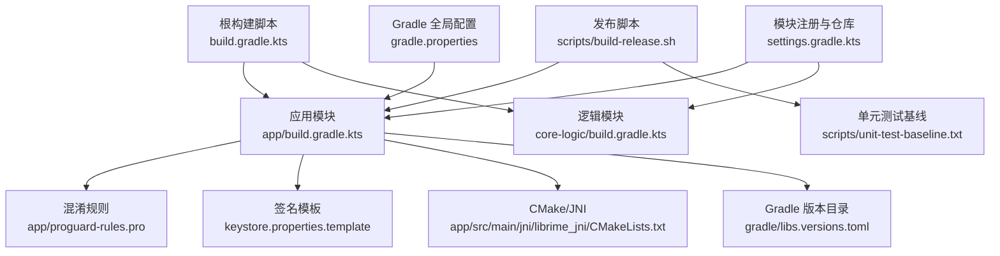
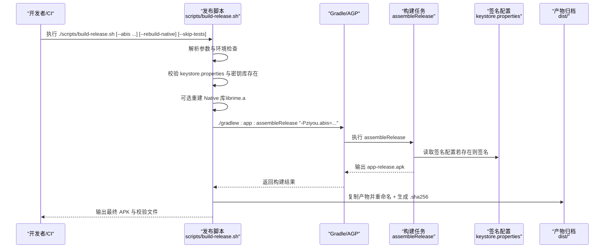
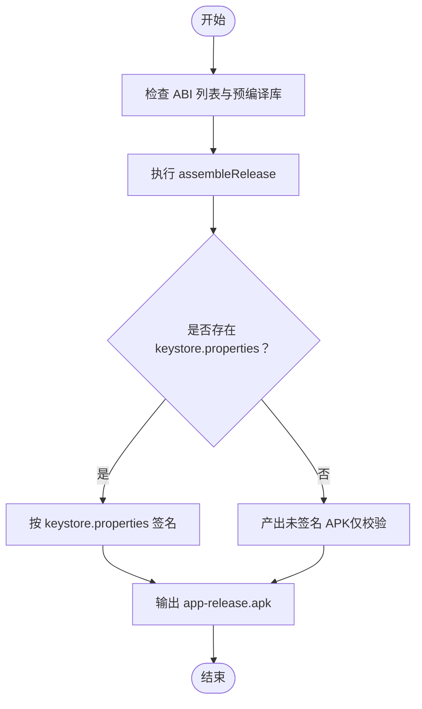
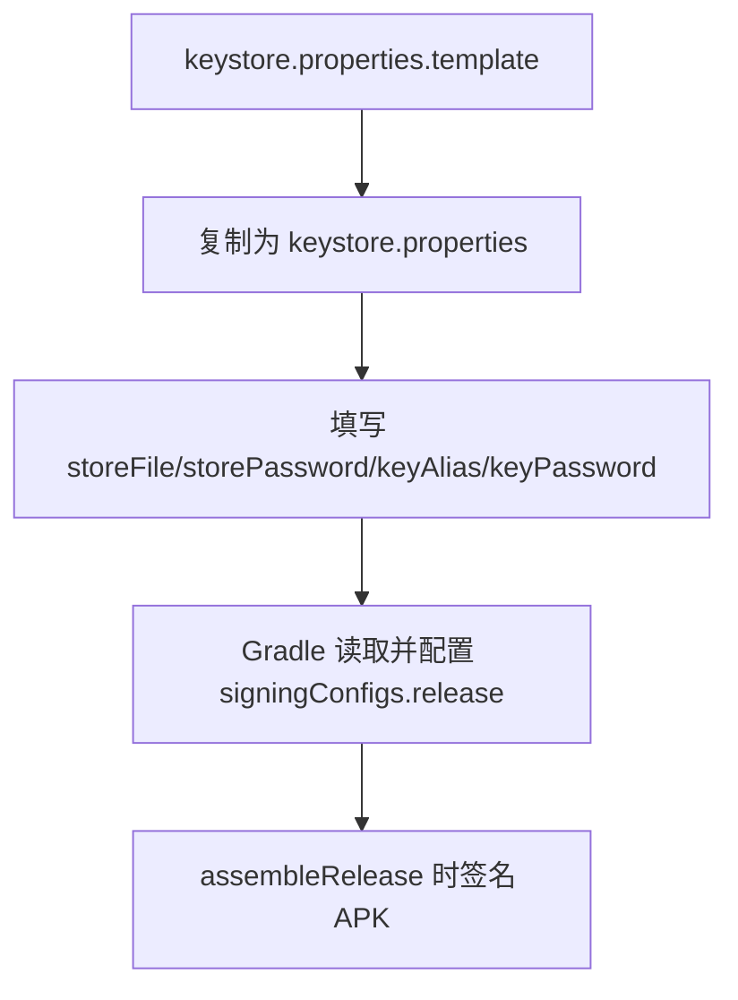
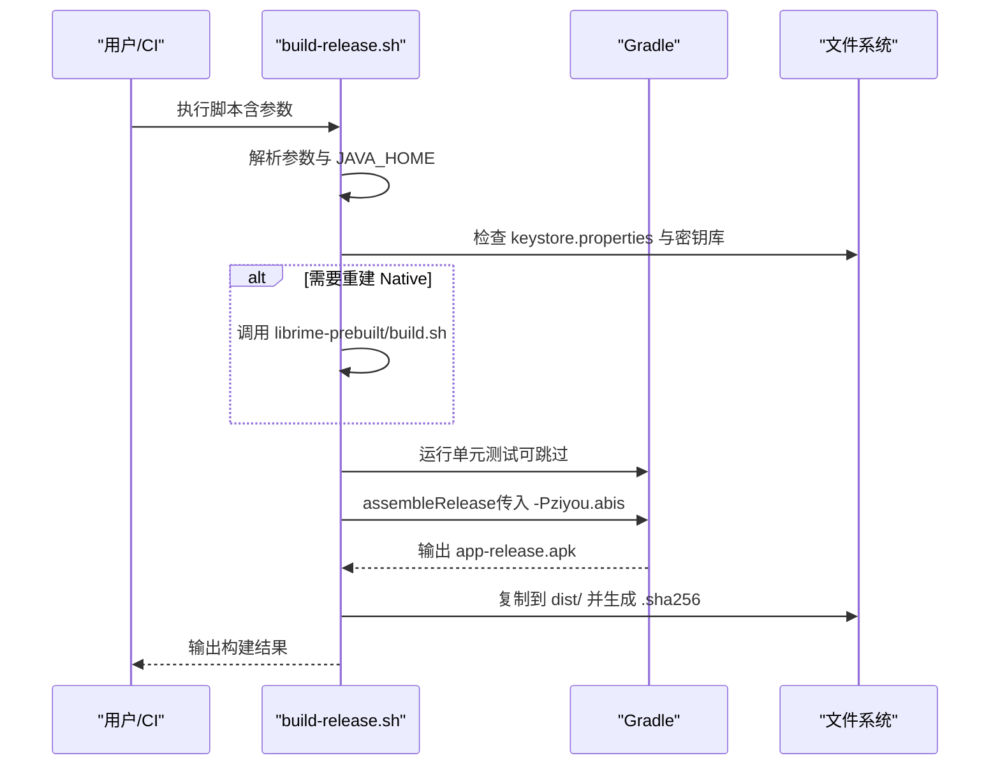
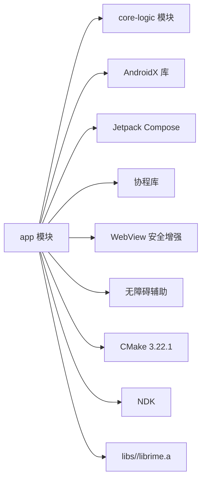

# 发布和部署

<cite>
**本文引用的文件**   
- [app/build.gradle.kts](file://app/build.gradle.kts)
- [app/proguard-rules.pro](file://app/proguard-rules.pro)
- [scripts/build-release.sh](file://scripts/build-release.sh)
- [keystore.properties.template](file://keystore.properties.template)
- [gradle.properties](file://gradle.properties)
- [settings.gradle.kts](file://settings.gradle.kts)
- [build.gradle.kts](file://build.gradle.kts)
- [gradle/libs.versions.toml](file://gradle/libs.versions.toml)
</cite>

## 目录
1. [简介](#简介)
2. [项目结构](#项目结构)
3. [核心组件](#核心组件)
4. [架构总览](#架构总览)
5. [详细组件分析](#详细组件分析)
6. [依赖分析](#依赖分析)
7. [性能考虑](#性能考虑)
8. [故障排查指南](#故障排查指南)
9. [结论](#结论)
10. [附录](#附录)

## 简介
本文件面向“字由输入法”的发布与部署，聚焦以下目标：
- 详细说明 APK 打包流程（release 构建配置、代码混淆与优化设置）
- 解释签名配置（keystore.properties 模板使用、密钥生成与管理、多渠道签名支持）
- 描述自动化发布脚本 build-release.sh 的功能与使用方法（构建参数、环境变量、错误处理）
- 说明多渠道支持与自定义渠道包生成策略
- 介绍应用上架前准备工作（图标、启动画面、权限声明、安全检查）
- 提供持续集成示例（GitHub Actions / Jenkins）
- 给出发布后的监控与维护建议（崩溃收集、性能监控、用户反馈处理）

## 项目结构
本项目采用多模块结构：
- app：Android 应用模块，包含 AndroidManifest、资源、JNI 与 CMake 配置、ProGuard 规则、Gradle 构建脚本等
- core-logic：纯 Kotlin 逻辑模块，无 Android UI 与 JNI 依赖
- librime-prebuilt：Rime 引擎预编译产物与构建脚本
- scripts：发布与测试基线等脚本
- gradle：版本目录与 Gradle 全局配置



**图表来源** 
- [build.gradle.kts:1-7](file://build.gradle.kts#L1-L7)
- [app/build.gradle.kts:1-192](file://app/build.gradle.kts#L1-L192)
- [app/proguard-rules.pro:1-6](file://app/proguard-rules.pro#L1-L6)
- [keystore.properties.template:1-12](file://keystore.properties.template#L1-L12)
- [gradle/libs.versions.toml:1-51](file://gradle/libs.versions.toml#L1-L51)
- [scripts/build-release.sh:1-195](file://scripts/build-release.sh#L1-L195)
- [gradle.properties:1-24](file://gradle.properties#L1-L24)
- [settings.gradle.kts:1-28](file://settings.gradle.kts#L1-L28)

**章节来源**
- [build.gradle.kts:1-7](file://build.gradle.kts#L1-L7)
- [settings.gradle.kts:1-28](file://settings.gradle.kts#L1-L28)
- [gradle.properties:1-24](file://gradle.properties#L1-L24)

## 核心组件
- 构建与签名
  - app 模块的 build.gradle.kts 定义了 release 构建类型、混淆开关、ProGuard 规则、NDK ABI 过滤、CMake 参数、签名配置加载等
  - keystore.properties 用于注入签名信息；不存在时 release 构建产出未签名 APK（便于 CI 校验）
- 混淆与优化
  - release 开启 isMinifyEnabled=true，关闭 optimization.enable=false，避免破坏 JNI 反射调用
  - ProGuard 规则保留 core 包与 native 方法
- 发布脚本
  - scripts/build-release.sh 负责参数解析、JDK 环境检查、签名前置校验、可选重建 Native 库、单元测试门禁、assembleRelease、产物归档与 SHA256 校验

**章节来源**
- [app/build.gradle.kts:50-81](file://app/build.gradle.kts#L50-L81)
- [app/proguard-rules.pro:1-6](file://app/proguard-rules.pro#L1-L6)
- [scripts/build-release.sh:62-97](file://scripts/build-release.sh#L62-L97)
- [scripts/build-release.sh:119-165](file://scripts/build-release.sh#L119-L165)
- [scripts/build-release.sh:168-195](file://scripts/build-release.sh#L168-L195)

## 架构总览
下图展示从发布脚本到 Gradle 构建、签名与产物产出的整体流程。



**图表来源** 
- [scripts/build-release.sh:168-195](file://scripts/build-release.sh#L168-L195)
- [app/build.gradle.kts:50-81](file://app/build.gradle.kts#L50-L81)

## 详细组件分析

### APK 打包流程与 Release 构建配置
- 构建入口
  - 通过 Gradle 任务 assembleRelease 完成 release 构建
  - 可通过 -Pziyou.abis 覆盖 ABI 列表（默认 arm64-v8a），每个 ABI 需提前准备 libs/<abi>/librime.a
- 关键配置项
  - compileSdk/targetSdk/minSdk、applicationId、versionCode/versionName
  - ndk.abiFilters 指定目标 ABI
  - externalNativeBuild.cmake.arguments("-DWITH_PREDICT=ON") 与预编译库保持一致
  - signingConfigs.release 从 keystore.properties 加载 storeFile/storePassword/keyAlias/keyPassword
  - buildTypes.release.isMinifyEnabled=true，proguardFiles 包含默认优化与自定义规则
  - buildTypes.release.optimization.enable=false 避免破坏 JNI 符号与反射
- 产物路径
  - app/build/outputs/apk/release/app-release.apk（已签名）或 unsigned 变体（无 keystore.properties 时）



**图表来源** 
- [app/build.gradle.kts:22-48](file://app/build.gradle.kts#L22-L48)
- [app/build.gradle.kts:50-81](file://app/build.gradle.kts#L50-L81)
- [scripts/build-release.sh:89-97](file://scripts/build-release.sh#L89-L97)

**章节来源**
- [app/build.gradle.kts:22-48](file://app/build.gradle.kts#L22-L48)
- [app/build.gradle.kts:50-81](file://app/build.gradle.kts#L50-L81)

### 代码混淆（ProGuard）与优化设置
- 混淆开关
  - release 启用 isMinifyEnabled=true，使用 proguard-android-optimize.txt 与 app/proguard-rules.pro
- 优化策略
  - 关闭 optimization.enable=false，避免 R8 激进优化破坏 JNI 反射与 native 方法名查找
- 保留规则
  - 保留 com.ziyou.ime.core.** 类与方法
  - 保留 com.ziyou.ime.core.RimeNative 中的 native 方法
- 影响范围
  - 确保 JNI 层与 Java/Kotlin 层的反射调用不被混淆破坏

```mermaid
classDiagram
class ProGuardRules {
"+keep com.ziyou.ime.core.**"
"+keepclassmembers RimeNative.native*"
}
class BuildType {
"+isMinifyEnabled = true"
"+optimization.enable = false"
"+proguardFiles(...)"
}
ProGuardRules <.. BuildType : "被引用"
```

**图表来源** 
- [app/proguard-rules.pro:1-6](file://app/proguard-rules.pro#L1-L6)
- [app/build.gradle.kts:66-81](file://app/build.gradle.kts#L66-L81)

**章节来源**
- [app/proguard-rules.pro:1-6](file://app/proguard-rules.pro#L1-L6)
- [app/build.gradle.kts:66-81](file://app/build.gradle.kts#L66-L81)

### 签名配置与密钥管理
- 配置文件
  - keystore.properties.template 提供模板字段：storeFile、storePassword、keyAlias、keyPassword
  - 实际使用时复制为 keystore.properties（已被忽略，禁止提交）
- 密钥生成
  - 使用 keytool 生成 RSA 4096、有效期约 10000 天的密钥库
- 加载机制
  - app/build.gradle.kts 在 signingConfigs.release 中读取 keystore.properties
  - 若不存在，release 构建仍可进行但产物未签名（适合 CI 校验）
- 安全建议
  - 妥善保管密钥库与口令，丢失将无法覆盖升级
  - 在 CI 中使用受保护的 Secret 变量注入签名信息



**图表来源** 
- [keystore.properties.template:1-12](file://keystore.properties.template#L1-L12)
- [app/build.gradle.kts:50-59](file://app/build.gradle.kts#L50-L59)

**章节来源**
- [keystore.properties.template:1-12](file://keystore.properties.template#L1-L12)
- [app/build.gradle.kts:50-59](file://app/build.gradle.kts#L50-L59)

### 自动化发布脚本 build-release.sh
- 功能概览
  - 参数解析：--abis、--rebuild-native、--skip-tests
  - 环境检查：JAVA_HOME 自动回退到 Android Studio JBR
  - 签名前置校验：keystore.properties 与密钥库存在性检查
  - Native 库：可选重建（复用 librime-prebuilt/build.sh，强制 WITH_PREDICT=ON）
  - 单元测试门禁：运行全量单测，统计 XML 报告，对比基线（只增不减）
  - 构建与归档：assembleRelease，复制产物至 dist/，生成 .sha256
- 使用方式
  - 本地快速验证：./scripts/build-release.sh --skip-tests
  - 正式发布：./scripts/build-release.sh --abis arm64-v8a,armeabi-v7a
  - 需要重建 Native：追加 --rebuild-native
- 错误处理
  - 缺失 keystore.properties 或密钥库文件直接退出
  - 缺少 libs/<abi>/librime.a 提示先构建或追加 --rebuild-native
  - 单测失败/跳过/用例数低于基线均阻断发布



**图表来源** 
- [scripts/build-release.sh:28-42](file://scripts/build-release.sh#L28-L42)
- [scripts/build-release.sh:47-68](file://scripts/build-release.sh#L47-L68)
- [scripts/build-release.sh:82-97](file://scripts/build-release.sh#L82-L97)
- [scripts/build-release.sh:119-165](file://scripts/build-release.sh#L119-L165)
- [scripts/build-release.sh:168-195](file://scripts/build-release.sh#L168-L195)

**章节来源**
- [scripts/build-release.sh:1-195](file://scripts/build-release.sh#L1-195)

### 多渠道支持与自定义渠道包生成
- 当前实现
  - 未在 app/build.gradle.kts 中定义 productFlavors 或 flavorDimensions
  - 通过 -Pziyou.abis 控制 ABI 组合，可用于区分不同设备架构的渠道包
- 扩展建议
  - 如需品牌/渠道维度，可在 app/build.gradle.kts 中引入 productFlavors，结合 resValue/manifestPlaceholders 注入渠道标识
  - 将渠道相关资源（如图标、名称、权限差异）放入对应 flavor 源集
  - 在 build-release.sh 中增加 --flavor 参数，驱动 assembleFlavorRelease

[本节为概念性说明，不直接分析具体文件，故无“章节来源”]

### 应用上架前准备工作
- 应用图标与启动画面
  - 确保 mipmap-anydpi-v26/ic_launcher.xml 及对应分辨率资源齐全
  - 启动画面建议使用 Splash Screen API（Android 12+），或在主题中配置 windowBackground
- 权限声明
  - 检查 AndroidManifest.xml 中 IME 相关权限与最小 SDK 要求
  - 按需声明存储、网络、无障碍等权限，并在运行时请求
- 安全检查
  - 确认 ProGuard 规则保留必要 native 方法与核心类
  - 校验签名配置正确，避免未签名产物进入发布流程
  - 清理调试日志与敏感信息

[本节为通用指导，不直接分析具体文件，故无“章节来源”]

### 持续集成配置示例
- GitHub Actions
  - 触发条件：push/tag
  - 步骤：设置 JDK、缓存 Gradle、安装 NDK/CMake、构建 Native 库、运行单测、assembleRelease、上传产物
  - 使用 Secrets 注入 keystore 与口令
- Jenkins Pipeline
  - 节点：具备 JDK、Android SDK、NDK、CMake 的环境
  - 阶段：checkout、dependency-cache、unit-test、build-release、archive-artifacts、notify

[本节为概念性说明，不直接分析具体文件，故无“章节来源”]

### 发布后监控与维护建议
- 崩溃收集
  - 接入第三方崩溃上报（如 Firebase Crashlytics、Bugsnag），在 release 构建中启用
- 性能监控
  - 使用 Android Profiler、Perfetto、ANR 监控，关注输入延迟与候选区渲染
- 用户反馈
  - 建立反馈渠道（应用内反馈、邮箱、社区），定期复盘问题与优化体验

[本节为通用指导，不直接分析具体文件，故无“章节来源”]

## 依赖分析
- 模块依赖
  - app 依赖 core-logic（业务逻辑）、AndroidX、Compose、Coroutines、WebView、CustomView 等
- 版本管理
  - gradle/libs.versions.toml 集中管理 AGP、Kotlin、Compose BOM、各库版本
- 构建工具链
  - gradle.properties 指定 JVM 参数、配置缓存、Java 安装路径（Android Studio JBR）
- 外部依赖
  - CMake 3.22.1 与 NDK 用于编译 librime_jni
  - 预编译库位于 libs/<abi>/librime.a



**图表来源** 
- [app/build.gradle.kts:143-191](file://app/build.gradle.kts#L143-L191)
- [gradle/libs.versions.toml:1-51](file://gradle/libs.versions.toml#L1-L51)
- [gradle.properties:1-24](file://gradle.properties#L1-L24)

**章节来源**
- [app/build.gradle.kts:143-191](file://app/build.gradle.kts#L143-L191)
- [gradle/libs.versions.toml:1-51](file://gradle/libs.versions.toml#L1-L51)
- [gradle.properties:1-24](file://gradle.properties#L1-L24)

## 性能考虑
- 构建性能
  - 启用 Gradle 配置缓存（org.gradle.configuration-cache=true）
  - 合理设置 org.gradle.jvmargs 内存上限
  - 缓存 Gradle 依赖与 NDK/CMake 产物
- 运行时性能
  - 保持 optimization.enable=false 以避免 JNI 反射异常
  - 精简资源与 Native 库体积，减少 APK 大小与加载时间
  - 关注输入法响应延迟与候选区渲染性能

[本节为通用指导，不直接分析具体文件，故无“章节来源”]

## 故障排查指南
- 常见错误
  - 缺少 keystore.properties 或密钥库文件：检查路径与相对路径解析
  - 未找到 libs/<abi>/librime.a：先构建 Native 库或使用 --rebuild-native
  - 单测失败或被跳过：修复用例或更新基线（scripts/unit-test-baseline.txt）
  - 未签名产物：确认 signingConfig 生效，keystore.properties 存在且有效
- 定位方法
  - 查看 Gradle 构建日志与 test-results/*.xml
  - 使用 shasum 校验产物完整性
  - 在 CI 中打印关键中间产物与路径

**章节来源**
- [scripts/build-release.sh:62-97](file://scripts/build-release.sh#L62-L97)
- [scripts/build-release.sh:119-165](file://scripts/build-release.sh#L119-L165)
- [scripts/build-release.sh:168-195](file://scripts/build-release.sh#L168-L195)

## 结论
本项目通过 Gradle 与发布脚本实现了可重复、可审计的发布流程。release 构建在保持 JNI 兼容的前提下启用混淆与体积优化；签名配置通过模板化管理确保安全与灵活性；脚本内置环境与质量门禁，保障发布质量。后续可按需扩展多渠道与 CI 流水线，完善监控与反馈闭环。

[本节为总结性内容，不直接分析具体文件，故无“章节来源”]

## 附录
- 常用命令
  - 本地快速验证：./scripts/build-release.sh --skip-tests
  - 正式发布（多 ABI）：./scripts/build-release.sh --abis arm64-v8a,armeabi-v7a
  - 重建 Native 库：追加 --rebuild-native
- 关键路径
  - 产物：dist/ziyou-ime-v<version>-<abis>-release.apk 与 .sha256
  - 构建输出：app/build/outputs/apk/release/app-release.apk
  - 测试报告：*/build/test-results/testDebugUnitTest/*.xml

[本节为补充信息，不直接分析具体文件，故无“章节来源”]