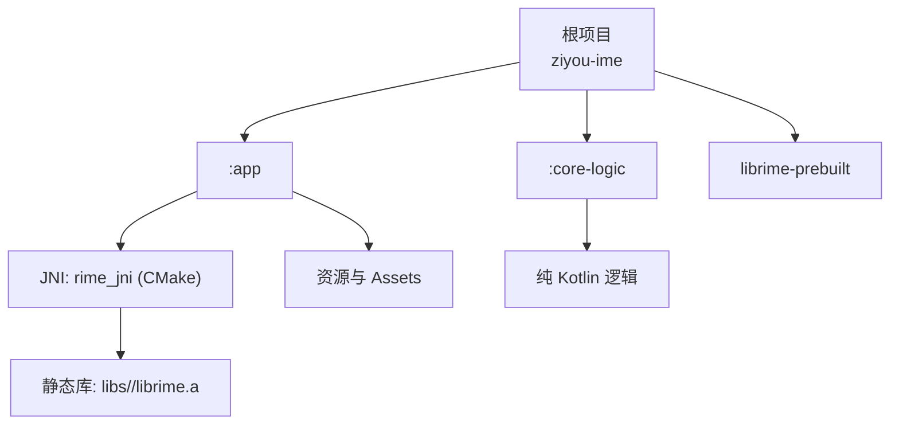
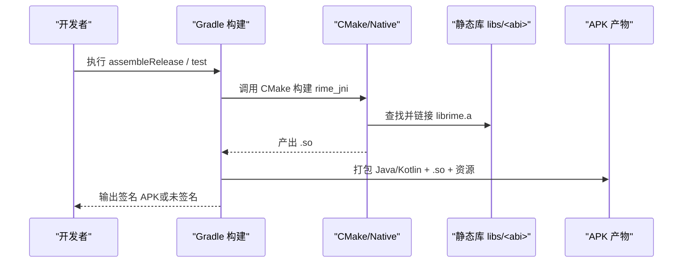
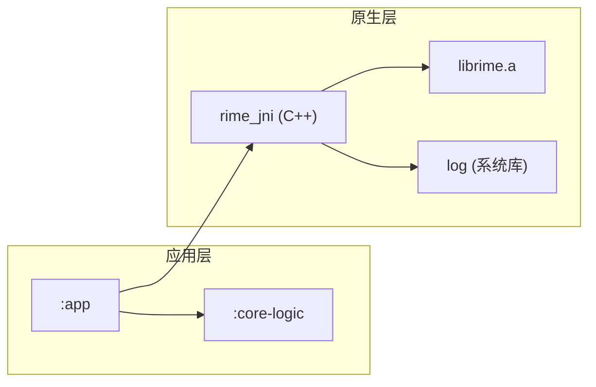

# 构建和部署

<cite>
**本文引用的文件**   
- [settings.gradle.kts](file://settings.gradle.kts)
- [build.gradle.kts](file://build.gradle.kts)
- [libs.versions.toml](file://gradle/libs.versions.toml)
- [app/build.gradle.kts](file://app/build.gradle.kts)
- [core-logic/build.gradle.kts](file://core-logic/build.gradle.kts)
- [CMakeLists.txt](file://app/src/main/jni/librime_jni/CMakeLists.txt)
- [proguard-rules.pro](file://app/proguard-rules.pro)
- [build.sh](file://librime-prebuilt/build.sh)
- [CMakeLists.txt](file://librime-prebuilt/librime/CMakeLists.txt)
- [gradle.properties](file://gradle.properties)
- [build-release.sh](file://scripts/build-release.sh)
</cite>

## 目录
1. [简介](#简介)
2. [项目结构](#项目结构)
3. [核心组件](#核心组件)
4. [架构总览](#架构总览)
5. [详细组件分析](#详细组件分析)
6. [依赖关系分析](#依赖关系分析)
7. [性能与优化](#性能与优化)
8. [故障排除指南](#故障排除指南)
9. [结论](#结论)
10. [附录：常用命令与环境搭建](#附录常用命令与环境搭建)

## 简介
本文件面向开发者，系统化说明字由输入法项目的 Gradle 多模块构建、NDK/CMake 集成、签名发布流程、混淆配置、多渠道/ABI 控制以及持续集成最佳实践。重点覆盖以下方面：
- Gradle 多模块：settings.gradle.kts、顶层 build.gradle.kts、版本目录 libs.versions.toml
- NDK 集成：CMakeLists.txt、librime.a 静态库链接、条件编译（WITH_LUA、WITH_PREDICT 等）
- 签名与发布：APK 打包、ProGuard 混淆、渠道/ABI 控制、自动化脚本
- 构建优化：增量编译、并行构建、配置缓存、依赖分析
- 常见问题排查与 CI/环境搭建建议

## 项目结构
本项目采用 Android Studio 标准的多模块结构：
- app：Android 应用模块，包含 UI、JNI 桥接、资源与构建配置
- core-logic：纯逻辑库模块，不包含 Android 框架与 JNI
- librime-prebuilt：librime 预编译脚本与源码子模块，用于生成各 ABI 的静态库
- gradle/libs.versions.toml：统一依赖与插件版本管理
- scripts：发布与构建辅助脚本

图表来源
- [settings.gradle.kts:25-28](file://settings.gradle.kts#L25-L28)
- [app/build.gradle.kts:92-97](file://app/build.gradle.kts#L92-L97)
- [CMakeLists.txt:17-24](file://app/src/main/jni/librime_jni/CMakeLists.txt#L17-L24)

章节来源
- [settings.gradle.kts:1-28](file://settings.gradle.kts#L1-L28)
- [build.gradle.kts:1-7](file://build.gradle.kts#L1-L7)

## 核心组件
- 模块声明与仓库策略：通过 settings.gradle.kts 定义模块与仓库源，集中管理插件与依赖解析策略
- 顶层插件声明：build.gradle.kts 仅声明插件别名，避免重复配置
- 版本目录：libs.versions.toml 统一管理 AGP、Kotlin、Compose、协程等版本与依赖项
- 应用模块：app/build.gradle.kts 配置 NDK、CMake、签名、混淆、ABI 过滤、测试选项等
- 逻辑库模块：core-logic/build.gradle.kts 提供纯逻辑能力，便于独立单元测试
- NDK/CMake：CMakeLists.txt 定义 C++ 标准、可选开关、头文件与静态库路径、系统库链接
- 预编译脚本：librime-prebuilt/build.sh 负责探测 NDK/CMake、拉取/初始化依赖、按 ABI 构建并安装到 libs
- 发布脚本：scripts/build-release.sh 串联签名、测试门禁、APK 归档与校验

章节来源
- [settings.gradle.kts:1-28](file://settings.gradle.kts#L1-L28)
- [build.gradle.kts:1-7](file://build.gradle.kts#L1-L7)
- [libs.versions.toml:1-51](file://gradle/libs.versions.toml#L1-L51)
- [app/build.gradle.kts:1-192](file://app/build.gradle.kts#L1-L192)
- [core-logic/build.gradle.kts:1-29](file://core-logic/build.gradle.kts#L1-L29)
- [CMakeLists.txt:1-78](file://app/src/main/jni/librime_jni/CMakeLists.txt#L1-L78)
- [build.sh:1-198](file://librime-prebuilt/build.sh#L1-L198)
- [build-release.sh:1-195](file://scripts/build-release.sh#L1-L195)

## 架构总览
下图展示从 Gradle 构建到 NDK 编译再到 APK 产物的整体流程，以及关键配置文件的作用域。

图表来源
- [app/build.gradle.kts:36-48](file://app/build.gradle.kts#L36-L48)
- [CMakeLists.txt:52-72](file://app/src/main/jni/librime_jni/CMakeLists.txt#L52-L72)
- [build-release.sh:168-195](file://scripts/build-release.sh#L168-L195)

## 详细组件分析

### Gradle 多模块与版本管理
- settings.gradle.kts
  - 插件管理与仓库源：限定 com.android.*、com.google.*、androidx.* 优先 Google 仓库，其余走 Maven Central
  - 依赖解析模式：FAIL_ON_PROJECT_REPOS 强制集中式依赖管理
  - 模块声明：include(":app")、include(":core-logic")
- build.gradle.kts（顶层）
  - 仅声明插件别名：android.application、android.library、kotlin.compose，apply false 避免在顶层生效
- libs.versions.toml
  - versions 段：AGP、Kotlin、Compose BOM、Coroutines、Webview、MockK 等
  - libraries 段：以 group:name 形式引用，统一版本号
  - plugins 段：插件 ID 与版本映射，供 alias(libs.plugins.*) 使用

章节来源
- [settings.gradle.kts:1-28](file://settings.gradle.kts#L1-L28)
- [build.gradle.kts:1-7](file://build.gradle.kts#L1-L7)
- [libs.versions.toml:1-51](file://gradle/libs.versions.toml#L1-L51)

### 应用模块构建配置（app/build.gradle.kts）
- 命名空间与 SDK：compileSdk/targetSdk/minSdk 设置
- defaultConfig
  - applicationId、versionCode/versionName
  - ndk.abiFilters：支持通过 -Pziyou.abis 覆盖默认 ABI
  - externalNativeBuild.cmake.arguments：传递 WITH_PREDICT=ON，需与预编译库一致
- signingConfigs
  - 读取 keystore.properties（不入库），动态创建 release 签名配置
- buildTypes
  - debug：关闭 JNI 调试，strip native 库减小体积
  - release：开启 R8 压缩与混淆，禁用激进优化以避免破坏 JNI 符号；无 keystore 时产出未签名 APK
- compileOptions：Java 17 兼容
- buildFeatures：启用 Compose
- externalNativeBuild：指定 CMakeLists.txt 路径与 CMake 版本
- packaging：禁用 legacy jniLibs 打包方式
- testOptions：unitTests.returnDefaultValues=true 简化单测桩行为
- 自定义任务：将 docs/技能插件开发指南.md 同步至 assets/docs/skill_dev_guide.md，作为 App 内文档来源
- dependencies：内部模块 :core-logic、AndroidX、Compose BOM、协程、WebView、无障碍、测试依赖

章节来源
- [app/build.gradle.kts:1-192](file://app/build.gradle.kts#L1-L192)

### 逻辑库模块（core-logic/build.gradle.kts）
- 模块定位：纯 Kotlin 逻辑，不含 Android 框架与 JNI，便于独立单元测试
- 配置：compileSdk、minSdk、Java 17 兼容
- 依赖：仅引入 JUnit 用于单测

章节来源
- [core-logic/build.gradle.kts:1-29](file://core-logic/build.gradle.kts#L1-L29)

### NDK 与 CMake 集成
- CMakeLists.txt（JNI）
  - C++ 标准：C++17
  - 可选开关：WITH_LUA、WITH_OCTAGRAM、WITH_PREDICT、WITH_OPENCC
  - 头文件与静态库路径：指向 libs/include 与 libs/${ANDROID_ABI}/librime.a
  - 链接器优化：gc-sections、exclude-libs、16KB 页面对齐（Android 15+ 要求）
  - 错误提示：若缺失 librime.a，给出明确构建指引
- 与 Gradle 的衔接
  - app/build.gradle.kts 中 externalNativeBuild 指定 CMakeLists 路径与版本
  - defaultConfig 中 arguments("-DWITH_PREDICT=ON") 必须与预编译库一致

章节来源
- [CMakeLists.txt:1-78](file://app/src/main/jni/librime_jni/CMakeLists.txt#L1-L78)
- [app/build.gradle.kts:92-97](file://app/build.gradle.kts#L92-L97)

### 预编译库构建（librime-prebuilt/build.sh）
- 功能
  - 自动探测 NDK 与 CMake（支持环境变量与 SDK 路径）
  - 准备 librime 源码（子模块初始化/克隆）
  - 逐 ABI 构建 Release 静态库，合并安装到 ../libs
  - 支持 WITH_LUA/WITH_OCTAGRAM/WITH_PREDICT 开关
- 产物
  - libs/<abi>/librime.a
  - libs/include/rime_api.h（公共头文件）
- 注意事项
  - 仅在 macOS/Linux 主机上运行
  - 需要正确的 ANDROID_NDK_HOME/ANDROID_SDK_ROOT 或 local.properties 中的 sdk.dir

章节来源
- [build.sh:1-198](file://librime-prebuilt/build.sh#L1-L198)
- [CMakeLists.txt:1-200](file://librime-prebuilt/librime/CMakeLists.txt#L1-L200)

### 签名与发布流程
- 签名配置
  - keystore.properties 存放 storeFile/storePassword/keyAlias/keyPassword
  - app/build.gradle.kts 动态加载并创建 release 签名配置
  - 缺少 keystore.properties 时，release 构建产出未签名 APK（CI 校验用）
- ProGuard 混淆
  - proguard-rules.pro 保留 core 包类与 RimeNative 的 native 方法，避免反射/JNI 被误删
  - release 类型开启 isMinifyEnabled=true，但 optimization.enable=false 避免破坏 JNI 符号
- 多渠道/ABI 控制
  - 通过 -Pziyou.abis=arm64-v8a,armeabi-v7a 控制打包 ABI
  - 每个 ABI 需提前构建出对应 libs/<abi>/librime.a
- 自动化发布脚本
  - scripts/build-release.sh：检查签名、可选重建原生库、运行单元测试门禁、构建签名 APK、归档与 SHA256 校验

章节来源
- [app/build.gradle.kts:50-81](file://app/build.gradle.kts#L50-L81)
- [proguard-rules.pro:1-6](file://app/proguard-rules.pro#L1-L6)
- [build-release.sh:1-195](file://scripts/build-release.sh#L1-L195)

### 构建优化策略
- 增量编译：Gradle 与 AGP 默认启用增量编译，修改部分代码仅重编译受影响模块
- 并行构建：可启用 org.gradle.parallel=true（当前注释关闭，按需开启）
- 配置缓存：org.gradle.configuration-cache=true 加速配置阶段
- JVM 参数：org.gradle.jvmargs=-Xmx2048m -Dfile.encoding=UTF-8
- JDK 工具链：固定 Android Studio JBR 路径，避免 IDE 自带 JRE 影响
- CMake 并行：librime-prebuilt/build.sh 使用 --parallel 与 CPU 核数
- 链接优化：--gc-sections、--exclude-libs、max-page-size=16384

章节来源
- [gradle.properties:1-24](file://gradle.properties#L1-L24)
- [build.sh:162-193](file://librime-prebuilt/build.sh#L162-L193)
- [CMakeLists.txt:55-60](file://app/src/main/jni/librime_jni/CMakeLists.txt#L55-L60)

## 依赖关系分析
- 模块依赖方向
  - :app → :core-logic（单向，编译器强制边界）
  - :app → AndroidX/Compose/协程/WebView/无障碍等第三方库
- 原生依赖
  - rime_jni → librime.a（静态库）→ 系统库 log
- 版本依赖
  - 所有依赖通过 libs.versions.toml 统一管理，避免版本漂移

图表来源
- [app/build.gradle.kts:143-191](file://app/build.gradle.kts#L143-L191)
- [CMakeLists.txt:62-77](file://app/src/main/jni/librime_jni/CMakeLists.txt#L62-L77)

章节来源
- [app/build.gradle.kts:143-191](file://app/build.gradle.kts#L143-L191)
- [CMakeLists.txt:62-77](file://app/src/main/jni/librime_jni/CMakeLists.txt#L62-L77)

## 性能与优化
- 构建阶段
  - 启用配置缓存与并行构建（根据团队需求调整）
  - 合理设置 JVM 内存与编码
  - 固定 JDK 工具链，避免环境差异
- 编译阶段
  - C++17 与最小化依赖，减少编译时间
  - 链接期死代码消除与页面大小对齐，降低运行时开销
- 打包阶段
  - R8 压缩与混淆，禁用激进优化保护 JNI
  - 仅打包目标 ABI，减少 APK 体积
- 测试阶段
  - 单元测试门禁确保用例数量与质量基线

[本节为通用指导，不直接分析具体文件]

## 故障排除指南
- 找不到 NDK 或 CMake
  - 检查 ANDROID_NDK_HOME/ANDROID_SDK_ROOT/local.properties 中的 sdk.dir
  - 确认 Android Studio 已安装 NDK 与 CMake 组件
- 缺少 librime.a
  - 执行 librime-prebuilt/build.sh 生成对应 ABI 的静态库
  - 确保 WITH_PREDICT 等开关与 app 侧保持一致
- 链接失败（undefined symbol）
  - 检查 CMake 的 WITH_* 开关是否与预编译库一致
  - 确认 libs/include 与 libs/<abi>/librime.a 存在且路径正确
- 签名失败或未签名 APK
  - 检查 keystore.properties 是否存在且路径有效
  - 确认 storeFile 为绝对路径或相对仓库根的路径
- 混淆导致崩溃
  - 检查 proguard-rules.pro 是否保留了必要的类与方法
  - 保持 release 类型下 optimization.enable=false
- 单元测试门禁失败
  - 修复失败的用例或跳过用例（不建议）
  - 更新 scripts/unit-test-baseline.txt 基线值（只增不减）

章节来源
- [build.sh:52-88](file://librime-prebuilt/build.sh#L52-L88)
- [CMakeLists.txt:62-72](file://app/src/main/jni/librime_jni/CMakeLists.txt#L62-L72)
- [app/build.gradle.kts:50-81](file://app/build.gradle.kts#L50-L81)
- [proguard-rules.pro:1-6](file://app/proguard-rules.pro#L1-L6)
- [build-release.sh:100-165](file://scripts/build-release.sh#L100-L165)

## 结论
本项目通过 Gradle 多模块与版本目录实现清晰的依赖与构建管理；借助 CMake 与预编译脚本完成 NDK 集成与静态库链接；通过签名与混淆保障发布安全与体积；配合自动化脚本与门禁提升发布质量与效率。遵循本文档的配置与流程，可在本地与 CI 环境中稳定构建与发布。

[本节为总结性内容，不直接分析具体文件]

## 附录：常用命令与环境搭建
- 环境准备
  - 安装 Android Studio、NDK、CMake（或通过 SDK Manager 安装）
  - 配置 JAVA_HOME 或使用内置 JBR（见 gradle.properties）
  - 准备 keystore.properties（参考模板）
- 构建原生库
  - cd librime-prebuilt && ./build.sh arm64-v8a armeabi-v7a x86_64
- 构建与测试
  - ./gradlew :core-logic:testDebugUnitTest :app:testDebugUnitTest
- 构建发布 APK
  - ./scripts/build-release.sh --abis arm64-v8a,armeabi-v7a
  - 如需重建原生库：追加 --rebuild-native
- 快速验证（跳过测试，仅限本地）
  - ./scripts/build-release.sh --skip-tests

章节来源
- [gradle.properties:1-24](file://gradle.properties#L1-L24)
- [build.sh:1-198](file://librime-prebuilt/build.sh#L1-L198)
- [build-release.sh:1-195](file://scripts/build-release.sh#L1-L195)