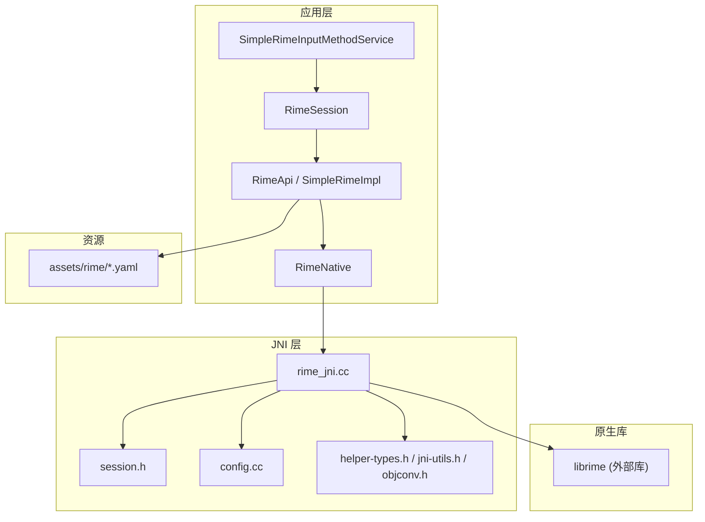
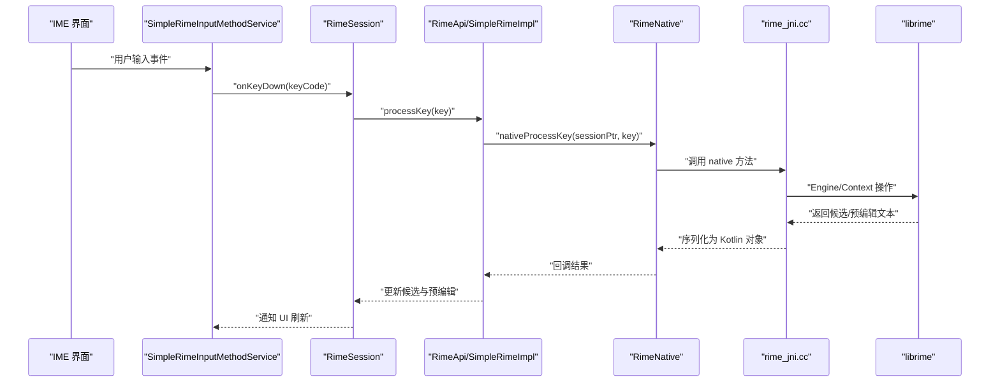
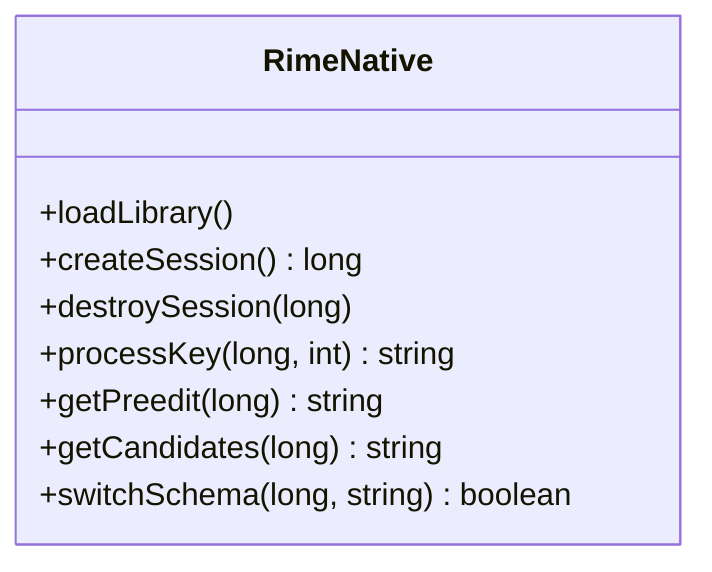
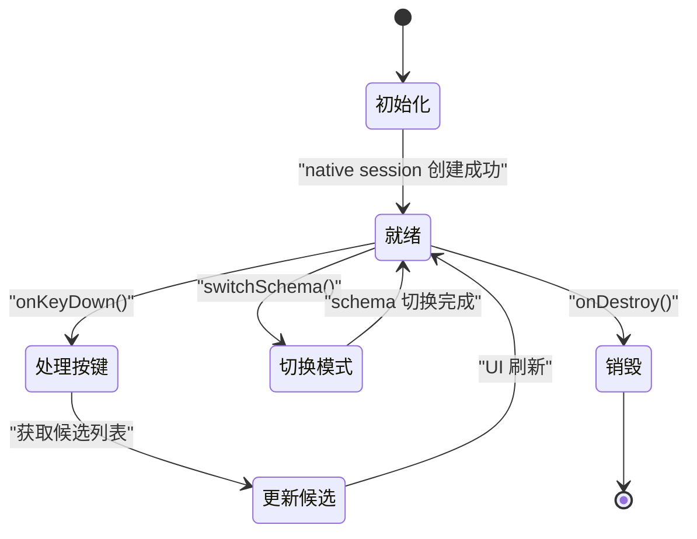
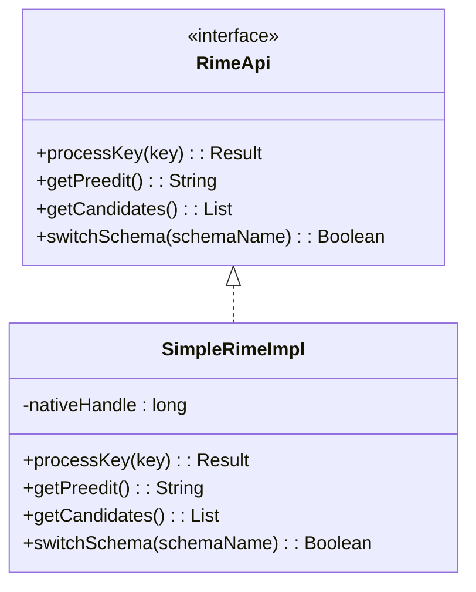
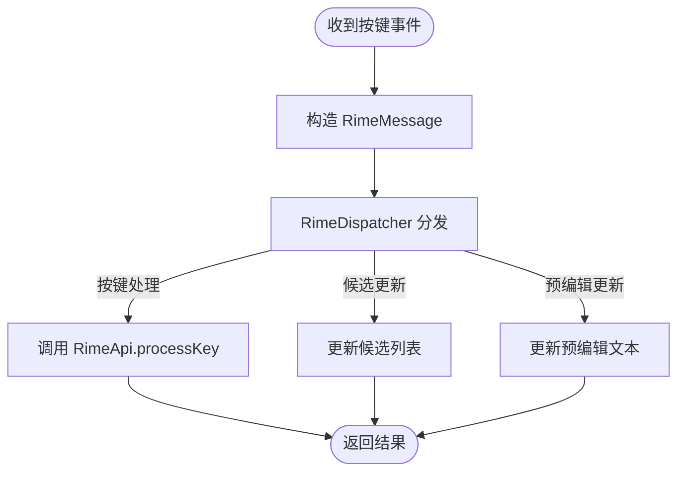
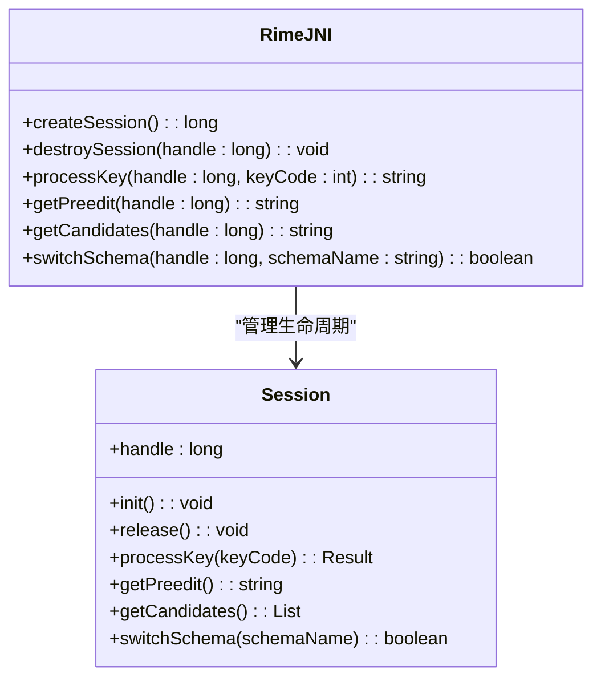
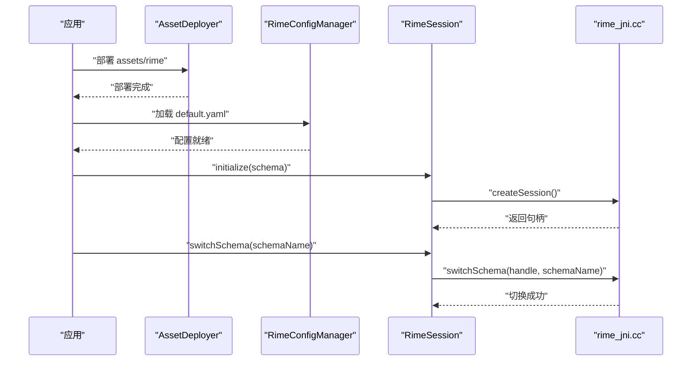
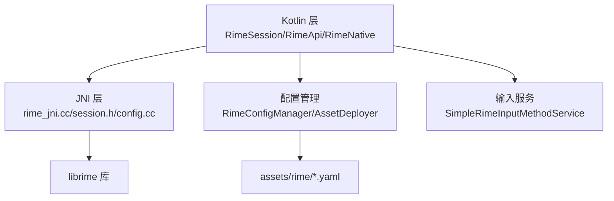

# Rime 引擎层

<cite>
**本文档引用的文件**   
- [RimeNative.kt](file://app/src/main/java/com/ziyou/ime/core/RimeNative.kt)
- [RimeApi.kt](file://app/src/main/java/com/ziyou/ime/core/RimeApi.kt)
- [SimpleRimeImpl.kt](file://app/src/main/java/com/ziyou/ime/core/SimpleRimeImpl.kt)
- [RimeDispatcher.kt](file://app/src/main/java/com/ziyou/ime/core/RimeDispatcher.kt)
- [RimeMessage.kt](file://app/src/main/java/com/ziyou/ime/core/RimeMessage.kt)
- [ProtoTypes.kt](file://app/src/main/java/com/ziyou/ime/core/ProtoTypes.kt)
- [RimeSession.kt](file://app/src/main/java/com/ziyou/ime/daemon/RimeSession.kt)
- [rime_jni.cc](file://app/src/main/jni/librime_jni/rime_jni.cc)
- [session.h](file://app/src/main/jni/librime_jni/session.h)
- [config.cc](file://app/src/main/jni/librime_jni/config.cc)
- [helper-types.h](file://app/src/main/jni/librime_jni/helper-types.h)
- [jni-utils.h](file://app/src/main/jni/librime_jni/jni-utils.h)
- [objconv.h](file://app/src/main/jni/librime_jni/objconv.h)
- [CMakeLists.txt](file://app/src/main/jni/librime_jni/CMakeLists.txt)
- [default.yaml](file://app/src/main/assets/rime/default.yaml)
- [luna_pinyin.schema.yaml](file://app/src/main/assets/rime/luna_pinyin.schema.yaml)
- [cangjie5.schema.yaml](file://app/src/main/assets/rime/cangjie5.schema.yaml)
- [t9.schema.yaml](file://app/src/main/assets/rime/t9.schema.yaml)
- [RimeConfigManager.kt](file://app/src/main/java/com/ziyou/ime/config/RimeConfigManager.kt)
- [AssetDeployer.kt](file://app/src/main/java/com/ziyou/ime/config/AssetDeployer.kt)
- [SimpleRimeInputMethodService.kt](file://app/src/main/java/com/ziyou/ime/ime/SimpleRimeInputMethodService.kt)
</cite>

## 目录
1. [简介](#简介)
2. [项目结构](#项目结构)
3. [核心组件](#核心组件)
4. [架构总览](#架构总览)
5. [详细组件分析](#详细组件分析)
6. [依赖关系分析](#依赖关系分析)
7. [性能考虑](#性能考虑)
8. [故障排查指南](#故障排查指南)
9. [结论](#结论)
10. [附录](#附录)

## 简介
本文件面向 ziyou-ime 项目的 Rime 引擎层集成，聚焦于 Java/Kotlin 与 C++ 原生层的 JNI 桥接、会话生命周期管理、配置加载与输入法切换流程，以及 librime 库的集成方式与版本兼容性。文档从系统架构到代码级细节逐层展开，并提供性能优化建议与调试技巧，帮助开发者快速理解并高效扩展 Rime 引擎能力。

## 项目结构
- Kotlin 层：封装 Rime 引擎调用、消息分发、会话管理与输入服务集成
- JNI 层：定义 native 方法、对象转换、会话句柄与配置操作
- 资源层：Rime 配置文件与词典 schema 位于 assets/rime
- 构建层：CMake 构建脚本将 JNI 模块与预编译 librime 链接

图表来源
- [SimpleRimeInputMethodService.kt](file://app/src/main/java/com/ziyou/ime/ime/SimpleRimeInputMethodService.kt)
- [RimeSession.kt](file://app/src/main/java/com/ziyou/ime/daemon/RimeSession.kt)
- [RimeApi.kt](file://app/src/main/java/com/ziyou/ime/core/RimeApi.kt)
- [SimpleRimeImpl.kt](file://app/src/main/java/com/ziyou/ime/core/SimpleRimeImpl.kt)
- [RimeNative.kt](file://app/src/main/java/com/ziyou/ime/core/RimeNative.kt)
- [rime_jni.cc](file://app/src/main/jni/librime_jni/rime_jni.cc)
- [session.h](file://app/src/main/jni/librime_jni/session.h)
- [config.cc](file://app/src/main/jni/librime_jni/config.cc)
- [helper-types.h](file://app/src/main/jni/librime_jni/helper-types.h)
- [jni-utils.h](file://app/src/main/jni/librime_jni/jni-utils.h)
- [objconv.h](file://app/src/main/jni/librime_jni/objconv.h)
- [default.yaml](file://app/src/main/assets/rime/default.yaml)
- [luna_pinyin.schema.yaml](file://app/src/main/assets/rime/luna_pinyin.schema.yaml)
- [cangjie5.schema.yaml](file://app/src/main/assets/rime/cangjie5.schema.yaml)
- [t9.schema.yaml](file://app/src/main/assets/rime/t9.schema.yaml)

章节来源
- [RimeNative.kt](file://app/src/main/java/com/ziyou/ime/core/RimeNative.kt)
- [RimeApi.kt](file://app/src/main/java/com/ziyou/ime/core/RimeApi.kt)
- [SimpleRimeImpl.kt](file://app/src/main/java/com/ziyou/ime/core/SimpleRimeImpl.kt)
- [RimeDispatcher.kt](file://app/src/main/java/com/ziyou/ime/core/RimeDispatcher.kt)
- [RimeMessage.kt](file://app/src/main/java/com/ziyou/ime/core/RimeMessage.kt)
- [ProtoTypes.kt](file://app/src/main/java/com/ziyou/ime/core/ProtoTypes.kt)
- [RimeSession.kt](file://app/src/main/java/com/ziyou/ime/daemon/RimeSession.kt)
- [rime_jni.cc](file://app/src/main/jni/librime_jni/rime_jni.cc)
- [session.h](file://app/src/main/jni/librime_jni/session.h)
- [config.cc](file://app/src/main/jni/librime_jni/config.cc)
- [helper-types.h](file://app/src/main/jni/librime_jni/helper-types.h)
- [jni-utils.h](file://app/src/main/jni/librime_jni/jni-utils.h)
- [objconv.h](file://app/src/main/jni/librime_jni/objconv.h)
- [CMakeLists.txt](file://app/src/main/jni/librime_jni/CMakeLists.txt)
- [default.yaml](file://app/src/main/assets/rime/default.yaml)
- [luna_pinyin.schema.yaml](file://app/src/main/assets/rime/luna_pinyin.schema.yaml)
- [cangjie5.schema.yaml](file://app/src/main/assets/rime/cangjie5.schema.yaml)
- [t9.schema.yaml](file://app/src/main/assets/rime/t9.schema.yaml)

## 核心组件
- RimeNative：声明并加载 native 方法，提供与 rime_jni.cc 的 JNI 绑定入口
- RimeApi/SimpleRimeImpl：对上层暴露统一的 Rime API 抽象与默认实现
- RimeDispatcher/RimeMessage/ProtoTypes：消息分发与协议类型定义，用于异步处理与数据序列化
- RimeSession：会话生命周期管理，负责初始化、按键事件处理、候选词更新与销毁
- JNI 层（rime_jni.cc、session.h、config.cc）：封装 librime 的 C API，完成对象创建、状态查询、配置读写与内存管理
- 配置与资源：通过 AssetDeployer 部署 assets/rime 下的 schema 与字典，RimeConfigManager 管理运行时配置

章节来源
- [RimeNative.kt](file://app/src/main/java/com/ziyou/ime/core/RimeNative.kt)
- [RimeApi.kt](file://app/src/main/java/com/ziyou/ime/core/RimeApi.kt)
- [SimpleRimeImpl.kt](file://app/src/main/java/com/ziyou/ime/core/SimpleRimeImpl.kt)
- [RimeDispatcher.kt](file://app/src/main/java/com/ziyou/ime/core/RimeDispatcher.kt)
- [RimeMessage.kt](file://app/src/main/java/com/ziyou/ime/core/RimeMessage.kt)
- [ProtoTypes.kt](file://app/src/main/java/com/ziyou/ime/core/ProtoTypes.kt)
- [RimeSession.kt](file://app/src/main/java/com/ziyou/ime/daemon/RimeSession.kt)
- [rime_jni.cc](file://app/src/main/jni/librime_jni/rime_jni.cc)
- [session.h](file://app/src/main/jni/librime_jni/session.h)
- [config.cc](file://app/src/main/jni/librime_jni/config.cc)
- [helper-types.h](file://app/src/main/jni/librime_jni/helper-types.h)
- [jni-utils.h](file://app/src/main/jni/librime_jni/jni-utils.h)
- [objconv.h](file://app/src/main/jni/librime_jni/objconv.h)
- [CMakeLists.txt](file://app/src/main/jni/librime_jni/CMakeLists.txt)
- [RimeConfigManager.kt](file://app/src/main/java/com/ziyou/ime/config/RimeConfigManager.kt)
- [AssetDeployer.kt](file://app/src/main/java/com/ziyou/ime/config/AssetDeployer.kt)

## 架构总览
整体采用“Kotlin 业务层 + JNI 桥接 + C++ 原生 librime”的分层架构。Kotlin 层负责 UI 交互与业务编排；JNI 层屏蔽 C API 差异，统一对象生命周期；原生层使用 librime 的核心能力（引擎、上下文、翻译器、过滤器等）。

图表来源
- [SimpleRimeInputMethodService.kt](file://app/src/main/java/com/ziyou/ime/ime/SimpleRimeInputMethodService.kt)
- [RimeSession.kt](file://app/src/main/java/com/ziyou/ime/daemon/RimeSession.kt)
- [RimeApi.kt](file://app/src/main/java/com/ziyou/ime/core/RimeApi.kt)
- [SimpleRimeImpl.kt](file://app/src/main/java/com/ziyou/ime/core/SimpleRimeImpl.kt)
- [RimeNative.kt](file://app/src/main/java/com/ziyou/ime/core/RimeNative.kt)
- [rime_jni.cc](file://app/src/main/jni/librime_jni/rime_jni.cc)

## 详细组件分析

### RimeNative：JNI 接口设计
- 职责：声明 native 方法，加载 lib，提供 session 句柄与键值处理的 JNI 入口
- 关键点：
  - 方法命名与签名需与 rime_jni.cc 中 JNI_OnLoad 注册一致
  - 指针传递与对象生命周期由 JNI 层统一管理
  - 错误码与异常在 JNI 层捕获并转换为 Kotlin 异常或空值

图表来源
- [RimeNative.kt](file://app/src/main/java/com/ziyou/ime/core/RimeNative.kt)
- [rime_jni.cc](file://app/src/main/jni/librime_jni/rime_jni.cc)

章节来源
- [RimeNative.kt](file://app/src/main/java/com/ziyou/ime/core/RimeNative.kt)
- [rime_jni.cc](file://app/src/main/jni/librime_jni/rime_jni.cc)

### RimeSession：生命周期与会话状态控制
- 职责：维护单个输入会话，处理按键事件、候选词更新、预编辑文本与模式切换
- 生命周期：
  - 创建：分配 native session 句柄，初始化上下文
  - 运行：接收按键事件，调用 native 处理，更新本地状态
  - 销毁：释放 native 资源，清理缓存
- 状态控制：
  - 预编辑状态、候选列表、当前 schema、输入模式（拼音/五笔/T9）
  - 线程安全：避免跨线程直接访问 native 句柄，必要时加锁或使用单线程调度

图表来源
- [RimeSession.kt](file://app/src/main/java/com/ziyou/ime/daemon/RimeSession.kt)
- [rime_jni.cc](file://app/src/main/jni/librime_jni/rime_jni.cc)

章节来源
- [RimeSession.kt](file://app/src/main/java/com/ziyou/ime/daemon/RimeSession.kt)

### RimeApi/SimpleRimeImpl：API 抽象与默认实现
- 职责：为上层提供统一的 Rime 操作接口，隐藏 native 调用细节
- 关键方法：
  - processKey：按键处理
  - getPreedit：获取预编辑文本
  - getCandidates：获取候选词
  - switchSchema：切换输入法方案
- 默认实现：SimpleRimeImpl 通过 RimeNative 调用 native 方法，并进行必要的参数校验与错误处理

图表来源
- [RimeApi.kt](file://app/src/main/java/com/ziyou/ime/core/RimeApi.kt)
- [SimpleRimeImpl.kt](file://app/src/main/java/com/ziyou/ime/core/SimpleRimeImpl.kt)

章节来源
- [RimeApi.kt](file://app/src/main/java/com/ziyou/ime/core/RimeApi.kt)
- [SimpleRimeImpl.kt](file://app/src/main/java/com/ziyou/ime/core/SimpleRimeImpl.kt)

### 消息分发与协议类型：RimeDispatcher/RimeMessage/ProtoTypes
- 职责：定义输入事件与结果的协议类型，支持异步处理与序列化
- 关键点：
  - ProtoTypes：定义候选词、预编辑文本、按键事件等数据结构
  - RimeMessage：封装消息体，包含类型、负载与时间戳
  - RimeDispatcher：按类型分发消息到对应处理器，保证线程安全

图表来源
- [RimeDispatcher.kt](file://app/src/main/java/com/ziyou/ime/core/RimeDispatcher.kt)
- [RimeMessage.kt](file://app/src/main/java/com/ziyou/ime/core/RimeMessage.kt)
- [ProtoTypes.kt](file://app/src/main/java/com/ziyou/ime/core/ProtoTypes.kt)

章节来源
- [RimeDispatcher.kt](file://app/src/main/java/com/ziyou/ime/core/RimeDispatcher.kt)
- [RimeMessage.kt](file://app/src/main/java/com/ziyou/ime/core/RimeMessage.kt)
- [ProtoTypes.kt](file://app/src/main/java/com/ziyou/ime/core/ProtoTypes.kt)

### JNI 层实现细节：rime_jni.cc、session.h、config.cc
- rime_jni.cc：
  - 定义 JNI 方法映射，如 createSession、destroySession、processKey 等
  - 管理 native 句柄的生命周期，确保正确释放内存
  - 处理字符串与数组的编码转换（UTF-8/UTF-16）
- session.h：
  - 定义会话句柄结构与操作方法
  - 封装 librime 的 Context/Engine 调用
- config.cc：
  - 提供配置读取与写入接口
  - 支持动态切换 schema 与词典路径

图表来源
- [rime_jni.cc](file://app/src/main/jni/librime_jni/rime_jni.cc)
- [session.h](file://app/src/main/jni/librime_jni/session.h)
- [config.cc](file://app/src/main/jni/librime_jni/config.cc)

章节来源
- [rime_jni.cc](file://app/src/main/jni/librime_jni/rime_jni.cc)
- [session.h](file://app/src/main/jni/librime_jni/session.h)
- [config.cc](file://app/src/main/jni/librime_jni/config.cc)

### 配置加载与输入法切换流程
- 配置加载：
  - AssetDeployer 将 assets/rime 下的 schema 与字典部署到可写路径
  - RimeConfigManager 读取 default.yaml 与 schema 配置，设置 librime 路径
- 输入法切换：
  - 调用 switchSchema(schemaName) 切换当前输入法方案
  - 更新本地状态并通知 UI 刷新候选列表

图表来源
- [AssetDeployer.kt](file://app/src/main/java/com/ziyou/ime/config/AssetDeployer.kt)
- [RimeConfigManager.kt](file://app/src/main/java/com/ziyou/ime/config/RimeConfigManager.kt)
- [RimeSession.kt](file://app/src/main/java/com/ziyou/ime/daemon/RimeSession.kt)
- [rime_jni.cc](file://app/src/main/jni/librime_jni/rime_jni.cc)
- [default.yaml](file://app/src/main/assets/rime/default.yaml)
- [luna_pinyin.schema.yaml](file://app/src/main/assets/rime/luna_pinyin.schema.yaml)
- [cangjie5.schema.yaml](file://app/src/main/assets/rime/cangjie5.schema.yaml)
- [t9.schema.yaml](file://app/src/main/assets/rime/t9.schema.yaml)

章节来源
- [AssetDeployer.kt](file://app/src/main/java/com/ziyou/ime/config/AssetDeployer.kt)
- [RimeConfigManager.kt](file://app/src/main/java/com/ziyou/ime/config/RimeConfigManager.kt)
- [RimeSession.kt](file://app/src/main/java/com/ziyou/ime/daemon/RimeSession.kt)
- [rime_jni.cc](file://app/src/main/jni/librime_jni/rime_jni.cc)
- [default.yaml](file://app/src/main/assets/rime/default.yaml)
- [luna_pinyin.schema.yaml](file://app/src/main/assets/rime/luna_pinyin.schema.yaml)
- [cangjie5.schema.yaml](file://app/src/main/assets/rime/cangjie5.schema.yaml)
- [t9.schema.yaml](file://app/src/main/assets/rime/t9.schema.yaml)

## 依赖关系分析
- Kotlin 层依赖 JNI 层提供的 native 方法
- JNI 层依赖 librime 的 C API
- 配置与资源通过 AssetDeployer 与 RimeConfigManager 管理
- 输入服务 SimpleRimeInputMethodService 协调 UI 与 RimeSession

图表来源
- [RimeSession.kt](file://app/src/main/java/com/ziyou/ime/daemon/RimeSession.kt)
- [RimeApi.kt](file://app/src/main/java/com/ziyou/ime/core/RimeApi.kt)
- [RimeNative.kt](file://app/src/main/java/com/ziyou/ime/core/RimeNative.kt)
- [rime_jni.cc](file://app/src/main/jni/librime_jni/rime_jni.cc)
- [session.h](file://app/src/main/jni/librime_jni/session.h)
- [config.cc](file://app/src/main/jni/librime_jni/config.cc)
- [RimeConfigManager.kt](file://app/src/main/java/com/ziyou/ime/config/RimeConfigManager.kt)
- [AssetDeployer.kt](file://app/src/main/java/com/ziyou/ime/config/AssetDeployer.kt)
- [SimpleRimeInputMethodService.kt](file://app/src/main/java/com/ziyou/ime/ime/SimpleRimeInputMethodService.kt)

章节来源
- [RimeSession.kt](file://app/src/main/java/com/ziyou/ime/daemon/RimeSession.kt)
- [RimeApi.kt](file://app/src/main/java/com/ziyou/ime/core/RimeApi.kt)
- [RimeNative.kt](file://app/src/main/java/com/ziyou/ime/core/RimeNative.kt)
- [rime_jni.cc](file://app/src/main/jni/librime_jni/rime_jni.cc)
- [session.h](file://app/src/main/jni/librime_jni/session.h)
- [config.cc](file://app/src/main/jni/librime_jni/config.cc)
- [RimeConfigManager.kt](file://app/src/main/java/com/ziyou/ime/config/RimeConfigManager.kt)
- [AssetDeployer.kt](file://app/src/main/java/com/ziyou/ime/config/AssetDeployer.kt)
- [SimpleRimeInputMethodService.kt](file://app/src/main/java/com/ziyou/ime/ime/SimpleRimeInputMethodService.kt)

## 性能考虑
- 减少 JNI 调用频率：批量处理按键事件，合并候选更新
- 避免频繁字符串拷贝：使用字节缓冲与共享内存
- 懒加载配置：按需加载 schema 与词典，减少启动时间
- 线程隔离：JNI 调用限制在单线程，避免同步开销
- 内存管理：及时释放 native 句柄，避免内存泄漏
- 缓存策略：缓存常用候选词与预编辑文本，提升响应速度

[本节为通用指导，不直接分析具体文件]

## 故障排查指南
- 常见问题：
  - native 方法未找到：检查 JNI_OnLoad 注册与方法签名
  - 内存泄漏：确认 destroySession 被调用，释放所有 native 资源
  - 配置加载失败：验证 assets/rime 路径与权限
  - 输入法切换无效：检查 schema 名称与 default.yaml 配置
- 调试技巧：
  - 启用 librime 日志，查看引擎内部状态
  - 打印 JNI 调用栈，定位崩溃点
  - 使用 Android Studio 的 Native Debug 功能

章节来源
- [rime_jni.cc](file://app/src/main/jni/librime_jni/rime_jni.cc)
- [session.h](file://app/src/main/jni/librime_jni/session.h)
- [config.cc](file://app/src/main/jni/librime_jni/config.cc)
- [RimeConfigManager.kt](file://app/src/main/java/com/ziyou/ime/config/RimeConfigManager.kt)
- [AssetDeployer.kt](file://app/src/main/java/com/ziyou/ime/config/AssetDeployer.kt)

## 结论
ziyou-ime 的 Rime 引擎层通过清晰的 JNI 桥接与会话管理，实现了高效的输入法处理能力。遵循本文档的设计与实践，可进一步提升性能与稳定性，并为后续扩展奠定基础。

[本节为总结性内容，不直接分析具体文件]

## 附录
- 版本兼容性：
  - 确保 librime 版本与 JNI 接口兼容
  - 定期检查 schema 文件格式变更
- 最佳实践：
  - 使用单例管理 RimeSession
  - 避免在主线程执行耗时操作
  - 合理配置日志级别，便于问题定位

[本节为补充信息，不直接分析具体文件]