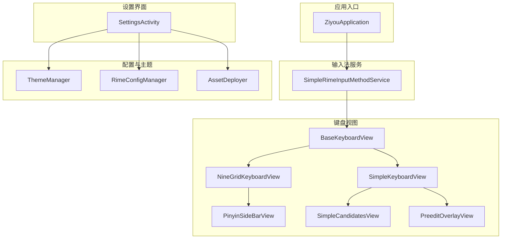
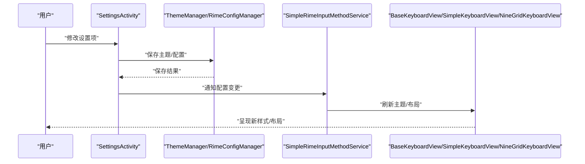
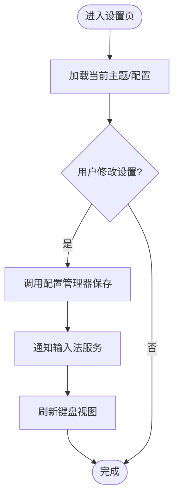
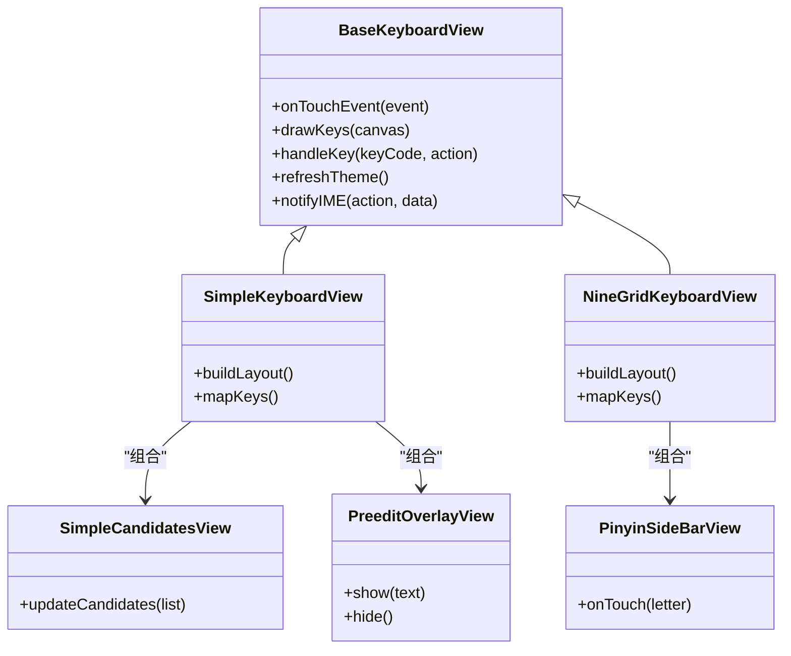
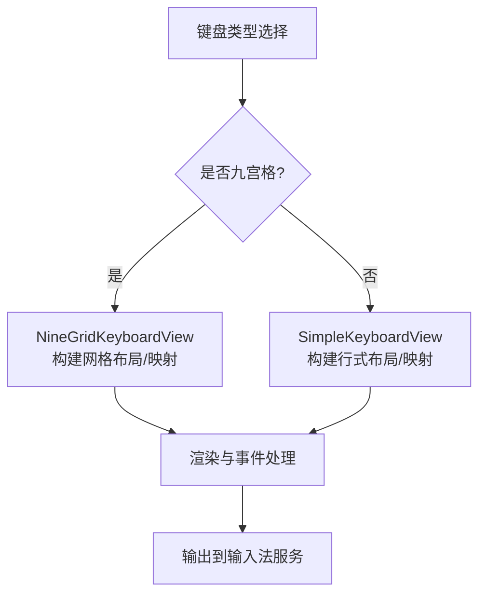
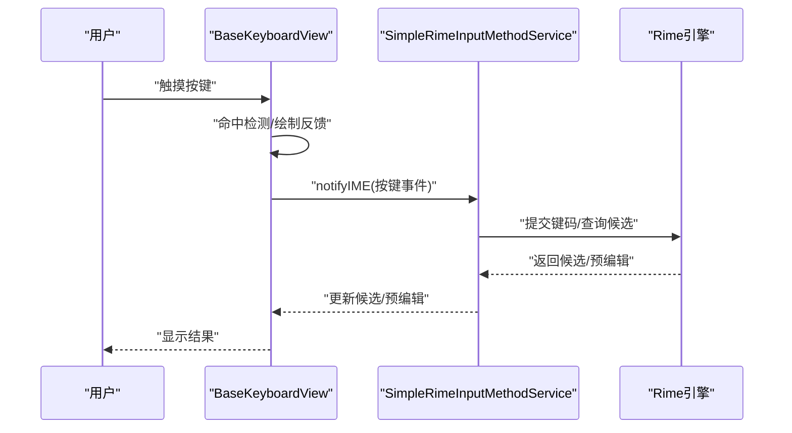
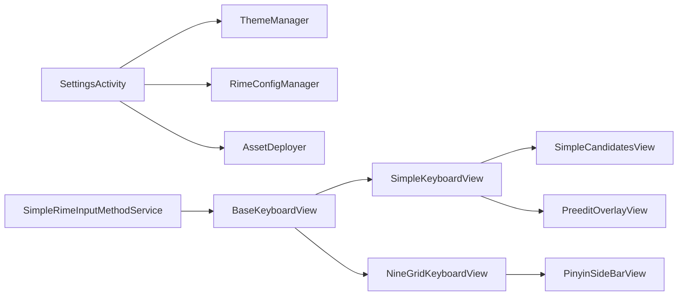

# UI 层设计

<cite>
**本文引用的文件**   
- [SettingsActivity.kt](file://app/src/main/java/com/ziyou/ime/ui/SettingsActivity.kt)
- [BaseKeyboardView.kt](file://app/src/main/java/com/ziyou/ime/ime/BaseKeyboardView.kt)
- [SimpleKeyboardView.kt](file://app/src/main/java/com/ziyou/ime/ime/SimpleKeyboardView.kt)
- [NineGridKeyboardView.kt](file://app/src/main/java/com/ziyou/ime/ime/NineGridKeyboardView.kt)
- [SimpleRimeInputMethodService.kt](file://app/src/main/java/com/ziyou/ime/ime/SimpleRimeInputMethodService.kt)
- [ThemeManager.kt](file://app/src/main/java/com/ziyou/ime/config/ThemeManager.kt)
- [RimeConfigManager.kt](file://app/src/main/java/com/ziyou/ime/config/RimeConfigManager.kt)
- [AssetDeployer.kt](file://app/src/main/java/com/ziyou/ime/config/AssetDeployer.kt)
- [KeyCode.kt](file://app/src/main/java/com/ziyou/ime/ime/KeyCode.kt)
- [KeyboardType.kt](file://app/src/main/java/com/ziyou/ime/ime/KeyboardType.kt)
- [PinyinSideBarView.kt](file://app/src/main/java/com/ziyou/ime/ime/PinyinSideBarView.kt)
- [PreeditOverlayView.kt](file://app/src/main/java/com/ziyou/ime/ime/PreeditOverlayView.kt)
- [SimpleCandidatesView.kt](file://app/src/main/java/com/ziyou/ime/ime/SimpleCandidatesView.kt)
- [ZiyouApplication.kt](file://app/src/main/java/com/ziyou/ime/ZiyouApplication.kt)
- [input_method.xml](file://app/src/main/res/xml/input_method.xml)
</cite>

## 目录
1. [简介](#简介)
2. [项目结构](#项目结构)
3. [核心组件](#核心组件)
4. [架构总览](#架构总览)
5. [详细组件分析](#详细组件分析)
6. [依赖关系分析](#依赖关系分析)
7. [性能考量](#性能考量)
8. [故障排查指南](#故障排查指南)
9. [结论](#结论)
10. [附录](#附录)

## 简介
本文件聚焦 ziyou-ime 项目的 UI 层设计，围绕以下目标展开：
- SettingsActivity 作为设置界面的实现方式与配置管理能力
- BaseKeyboardView 基类的设计模式与键盘视图继承体系
- SimpleKeyboardView 与 NineGridKeyboardView 的实现差异与使用场景
- UI 组件生命周期管理、事件处理机制与用户交互流程
- 键盘布局定制、主题切换等功能的实现示例与实践建议

## 项目结构
UI 层主要位于 app/src/main/java/com/ziyou/ime 包下，按功能分层组织：
- ime：输入法服务与键盘视图（BaseKeyboardView、SimpleKeyboardView、NineGridKeyboardView 等）
- ui：设置界面（SettingsActivity）
- config：配置与主题管理（ThemeManager、RimeConfigManager、AssetDeployer）
- util：工具类（如 T9PinYinUtils）
- data：数据结构与栈（KeyRecordStack、SideSymbol）

图表来源
- [ZiyouApplication.kt](file://app/src/main/java/com/ziyou/ime/ZiyouApplication.kt)
- [SimpleRimeInputMethodService.kt](file://app/src/main/java/com/ziyou/ime/ime/SimpleRimeInputMethodService.kt)
- [BaseKeyboardView.kt](file://app/src/main/java/com/ziyou/ime/ime/BaseKeyboardView.kt)
- [SimpleKeyboardView.kt](file://app/src/main/java/com/ziyou/ime/ime/SimpleKeyboardView.kt)
- [NineGridKeyboardView.kt](file://app/src/main/java/com/ziyou/ime/ime/NineGridKeyboardView.kt)
- [PinyinSideBarView.kt](file://app/src/main/java/com/ziyou/ime/ime/PinyinSideBarView.kt)
- [SimpleCandidatesView.kt](file://app/src/main/java/com/ziyou/ime/ime/SimpleCandidatesView.kt)
- [PreeditOverlayView.kt](file://app/src/main/java/com/ziyou/ime/ime/PreeditOverlayView.kt)
- [SettingsActivity.kt](file://app/src/main/java/com/ziyou/ime/ui/SettingsActivity.kt)
- [ThemeManager.kt](file://app/src/main/java/com/ziyou/ime/config/ThemeManager.kt)
- [RimeConfigManager.kt](file://app/src/main/java/com/ziyou/ime/config/RimeConfigManager.kt)
- [AssetDeployer.kt](file://app/src/main/java/com/ziyou/ime/config/AssetDeployer.kt)

章节来源
- [ZiyouApplication.kt](file://app/src/main/java/com/ziyou/ime/ZiyouApplication.kt)
- [SimpleRimeInputMethodService.kt](file://app/src/main/java/com/ziyou/ime/ime/SimpleRimeInputMethodService.kt)
- [SettingsActivity.kt](file://app/src/main/java/com/ziyou/ime/ui/SettingsActivity.kt)
- [ThemeManager.kt](file://app/src/main/java/com/ziyou/ime/config/ThemeManager.kt)
- [RimeConfigManager.kt](file://app/src/main/java/com/ziyou/ime/config/RimeConfigManager.kt)
- [AssetDeployer.kt](file://app/src/main/java/com/ziyou/ime/config/AssetDeployer.kt)

## 核心组件
- SettingsActivity：提供设置项的展示与编辑，联动 ThemeManager 与 RimeConfigManager 完成主题与 Rime 配置的持久化。
- BaseKeyboardView：抽象键盘视图基类，封装按键绘制、触摸事件分发、候选区与预编辑区的通用逻辑。
- SimpleKeyboardView：标准 QWERTY 或拼音键盘视图，适合文本输入场景。
- NineGridKeyboardView：九宫格键盘视图，适合数字与拼音快速输入场景。
- PinyinSideBarView：拼音侧边栏，用于字母快速定位。
- SimpleCandidatesView：候选词列表视图。
- PreeditOverlayView：预编辑区域覆盖层，显示当前输入状态。
- SimpleRimeInputMethodService：输入法服务，负责连接引擎、生命周期管理与 UI 绑定。

章节来源
- [BaseKeyboardView.kt](file://app/src/main/java/com/ziyou/ime/ime/BaseKeyboardView.kt)
- [SimpleKeyboardView.kt](file://app/src/main/java/com/ziyou/ime/ime/SimpleKeyboardView.kt)
- [NineGridKeyboardView.kt](file://app/src/main/java/com/ziyou/ime/ime/NineGridKeyboardView.kt)
- [PinyinSideBarView.kt](file://app/src/main/java/com/ziyou/ime/ime/PinyinSideBarView.kt)
- [SimpleCandidatesView.kt](file://app/src/main/java/com/ziyou/ime/ime/SimpleCandidatesView.kt)
- [PreeditOverlayView.kt](file://app/src/main/java/com/ziyou/ime/ime/PreeditOverlayView.kt)
- [SimpleRimeInputMethodService.kt](file://app/src/main/java/com/ziyou/ime/ime/SimpleRimeInputMethodService.kt)

## 架构总览
UI 层采用“服务 + 视图”的分层架构：
- 输入法服务（SimpleRimeInputMethodService）负责与 Rime 引擎交互、管理输入会话与 UI 可见性。
- 键盘视图（BaseKeyboardView 及其子类）负责按键渲染与事件处理，向上回调输入法服务。
- 设置界面（SettingsActivity）通过配置管理器更新主题与 Rime 配置，并通知输入法服务刷新 UI。

图表来源
- [SettingsActivity.kt](file://app/src/main/java/com/ziyou/ime/ui/SettingsActivity.kt)
- [ThemeManager.kt](file://app/src/main/java/com/ziyou/ime/config/ThemeManager.kt)
- [RimeConfigManager.kt](file://app/src/main/java/com/ziyou/ime/config/RimeConfigManager.kt)
- [SimpleRimeInputMethodService.kt](file://app/src/main/java/com/ziyou/ime/ime/SimpleRimeInputMethodService.kt)
- [BaseKeyboardView.kt](file://app/src/main/java/com/ziyou/ime/ime/BaseKeyboardView.kt)
- [SimpleKeyboardView.kt](file://app/src/main/java/com/ziyou/ime/ime/SimpleKeyboardView.kt)
- [NineGridKeyboardView.kt](file://app/src/main/java/com/ziyou/ime/ime/NineGridKeyboardView.kt)

## 详细组件分析

### SettingsActivity 设置界面与配置管理
- 职责
  - 展示与编辑主题、Rime 配置等选项
  - 调用 ThemeManager 与 RimeConfigManager 进行读写
  - 在配置变更后通知输入法服务刷新 UI
- 关键交互
  - 用户操作 -> 配置写入 -> 通知服务 -> 视图重绘
- 典型流程
  - 选择主题：更新主题资源引用，触发输入法服务重建键盘视图
  - 切换 Rime 配置：部署资源、重启会话，确保输入行为一致

图表来源
- [SettingsActivity.kt](file://app/src/main/java/com/ziyou/ime/ui/SettingsActivity.kt)
- [ThemeManager.kt](file://app/src/main/java/com/ziyou/ime/config/ThemeManager.kt)
- [RimeConfigManager.kt](file://app/src/main/java/com/ziyou/ime/config/RimeConfigManager.kt)

章节来源
- [SettingsActivity.kt](file://app/src/main/java/com/ziyou/ime/ui/SettingsActivity.kt)
- [ThemeManager.kt](file://app/src/main/java/com/ziyou/ime/config/ThemeManager.kt)
- [RimeConfigManager.kt](file://app/src/main/java/com/ziyou/ime/config/RimeConfigManager.kt)

### BaseKeyboardView 基类设计与继承体系
- 设计模式
  - 模板方法：定义键盘绘制与事件处理的骨架，子类实现具体布局与按键映射
  - 观察者/回调：将按键事件上抛给输入法服务，由服务协调引擎与候选区
- 核心能力
  - 触摸事件分发与按键命中检测
  - 按键绘制（按下、悬停、默认态）
  - 候选区与预编辑区联动
  - 主题资源读取与动态刷新
- 继承体系
  - BaseKeyboardView -> SimpleKeyboardView / NineGridKeyboardView
  - 其他辅助视图：PinyinSideBarView、SimpleCandidatesView、PreeditOverlayView

图表来源
- [BaseKeyboardView.kt](file://app/src/main/java/com/ziyou/ime/ime/BaseKeyboardView.kt)
- [SimpleKeyboardView.kt](file://app/src/main/java/com/ziyou/ime/ime/SimpleKeyboardView.kt)
- [NineGridKeyboardView.kt](file://app/src/main/java/com/ziyou/ime/ime/NineGridKeyboardView.kt)
- [PinyinSideBarView.kt](file://app/src/main/java/com/ziyou/ime/ime/PinyinSideBarView.kt)
- [SimpleCandidatesView.kt](file://app/src/main/java/com/ziyou/ime/ime/SimpleCandidatesView.kt)
- [PreeditOverlayView.kt](file://app/src/main/java/com/ziyou/ime/ime/PreeditOverlayView.kt)

章节来源
- [BaseKeyboardView.kt](file://app/src/main/java/com/ziyou/ime/ime/BaseKeyboardView.kt)
- [SimpleKeyboardView.kt](file://app/src/main/java/com/ziyou/ime/ime/SimpleKeyboardView.kt)
- [NineGridKeyboardView.kt](file://app/src/main/java/com/ziyou/ime/ime/NineGridKeyboardView.kt)
- [PinyinSideBarView.kt](file://app/src/main/java/com/ziyou/ime/ime/PinyinSideBarView.kt)
- [SimpleCandidatesView.kt](file://app/src/main/java/com/ziyou/ime/ime/SimpleCandidatesView.kt)
- [PreeditOverlayView.kt](file://app/src/main/java/com/ziyou/ime/ime/PreeditOverlayView.kt)

### SimpleKeyboardView 与 NineGridKeyboardView 的差异与场景
- SimpleKeyboardView
  - 布局：标准行式键盘，适合长文本输入
  - 交互：支持多键位、修饰键（Shift、空格、回车）
  - 适用场景：英文、拼音全拼、符号输入
- NineGridKeyboardView
  - 布局：九宫格网格，适合数字与拼音快速输入
  - 交互：长按切换字符、侧边栏快速定位
  - 适用场景：移动端快速输入、T9 风格

图表来源
- [KeyboardType.kt](file://app/src/main/java/com/ziyou/ime/ime/KeyboardType.kt)
- [SimpleKeyboardView.kt](file://app/src/main/java/com/ziyou/ime/ime/SimpleKeyboardView.kt)
- [NineGridKeyboardView.kt](file://app/src/main/java/com/ziyou/ime/ime/NineGridKeyboardView.kt)

章节来源
- [KeyboardType.kt](file://app/src/main/java/com/ziyou/ime/ime/KeyboardType.kt)
- [SimpleKeyboardView.kt](file://app/src/main/java/com/ziyou/ime/ime/SimpleKeyboardView.kt)
- [NineGridKeyboardView.kt](file://app/src/main/java/com/ziyou/ime/ime/NineGridKeyboardView.kt)

### 事件处理机制与用户交互流程
- 触摸事件
  - BaseKeyboardView 统一处理 onTouchEvent，计算命中按键并派发
  - 区分按下、抬起、移动等动作，驱动视觉反馈
- 按键映射
  - KeyCode 定义键值类型，KeyboardType 决定布局策略
  - 子类实现 mapKeys 将物理键映射为业务键码
- 上抛事件
  - BaseKeyboardView 通过 notifyIME 将按键事件交给输入法服务
  - 服务协调 Rime 引擎、候选区与预编辑区更新

图表来源
- [BaseKeyboardView.kt](file://app/src/main/java/com/ziyou/ime/ime/BaseKeyboardView.kt)
- [KeyCode.kt](file://app/src/main/java/com/ziyou/ime/ime/KeyCode.kt)
- [KeyboardType.kt](file://app/src/main/java/com/ziyou/ime/ime/KeyboardType.kt)
- [SimpleRimeInputMethodService.kt](file://app/src/main/java/com/ziyou/ime/ime/SimpleRimeInputMethodService.kt)

章节来源
- [BaseKeyboardView.kt](file://app/src/main/java/com/ziyou/ime/ime/BaseKeyboardView.kt)
- [KeyCode.kt](file://app/src/main/java/com/ziyou/ime/ime/KeyCode.kt)
- [KeyboardType.kt](file://app/src/main/java/com/ziyou/ime/ime/KeyboardType.kt)
- [SimpleRimeInputMethodService.kt](file://app/src/main/java/com/ziyou/ime/ime/SimpleRimeInputMethodService.kt)

### UI 组件生命周期管理
- 输入法服务生命周期
  - onCreate/onStartWindowInteracting/onDestroy：初始化/销毁资源、启动/停止会话
- 键盘视图生命周期
  - onAttachedToWindow：创建布局、绑定数据
  - onDetachedFromWindow：释放资源、取消监听
- 设置界面生命周期
  - onResume：同步最新主题/配置
  - onPause：保存用户设置

章节来源
- [SimpleRimeInputMethodService.kt](file://app/src/main/java/com/ziyou/ime/ime/SimpleRimeInputMethodService.kt)
- [BaseKeyboardView.kt](file://app/src/main/java/com/ziyou/ime/ime/BaseKeyboardView.kt)
- [SettingsActivity.kt](file://app/src/main/java/com/ziyou/ime/ui/SettingsActivity.kt)

### 键盘布局定制与主题切换示例
- 键盘布局定制
  - 自定义 KeyboardType：定义布局策略与键位映射
  - 扩展 BaseKeyboardView：重写 buildLayout/mapKeys 实现新布局
  - 组合辅助视图：PinyinSideBarView、SimpleCandidatesView、PreeditOverlayView
- 主题切换
  - ThemeManager：集中管理颜色、字体、图标等资源引用
  - SettingsActivity：用户选择后调用 ThemeManager 保存并通知服务刷新
  - BaseKeyboardView：根据主题资源重绘按键与背景

章节来源
- [KeyboardType.kt](file://app/src/main/java/com/ziyou/ime/ime/KeyboardType.kt)
- [BaseKeyboardView.kt](file://app/src/main/java/com/ziyou/ime/ime/BaseKeyboardView.kt)
- [ThemeManager.kt](file://app/src/main/java/com/ziyou/ime/config/ThemeManager.kt)
- [SettingsActivity.kt](file://app/src/main/java/com/ziyou/ime/ui/SettingsActivity.kt)

## 依赖关系分析
- 组件耦合
  - BaseKeyboardView 与 SimpleRimeInputMethodService 松耦合，通过回调接口通信
  - SettingsActivity 与 ThemeManager/RimeConfigManager 解耦，便于测试与替换
- 外部依赖
  - Rime 引擎通过 JNI 调用，输入法服务负责会话管理
  - 资源文件（XML 输入法配置）定义服务元数据

图表来源
- [SettingsActivity.kt](file://app/src/main/java/com/ziyou/ime/ui/SettingsActivity.kt)
- [ThemeManager.kt](file://app/src/main/java/com/ziyou/ime/config/ThemeManager.kt)
- [RimeConfigManager.kt](file://app/src/main/java/com/ziyou/ime/config/RimeConfigManager.kt)
- [AssetDeployer.kt](file://app/src/main/java/com/ziyou/ime/config/AssetDeployer.kt)
- [SimpleRimeInputMethodService.kt](file://app/src/main/java/com/ziyou/ime/ime/SimpleRimeInputMethodService.kt)
- [BaseKeyboardView.kt](file://app/src/main/java/com/ziyou/ime/ime/BaseKeyboardView.kt)
- [SimpleKeyboardView.kt](file://app/src/main/java/com/ziyou/ime/ime/SimpleKeyboardView.kt)
- [NineGridKeyboardView.kt](file://app/src/main/java/com/ziyou/ime/ime/NineGridKeyboardView.kt)
- [PinyinSideBarView.kt](file://app/src/main/java/com/ziyou/ime/ime/PinyinSideBarView.kt)
- [SimpleCandidatesView.kt](file://app/src/main/java/com/ziyou/ime/ime/SimpleCandidatesView.kt)
- [PreeditOverlayView.kt](file://app/src/main/java/com/ziyou/ime/ime/PreeditOverlayView.kt)

章节来源
- [input_method.xml](file://app/src/main/res/xml/input_method.xml)

## 性能考量
- 视图绘制优化
  - 避免在 onTouchEvent 中执行耗时操作，使用轻量级绘制与缓存
  - 合理拆分候选区与预编辑区，减少重绘范围
- 事件处理
  - 按键命中检测使用几何计算，避免频繁对象分配
- 配置更新
  - 主题切换批量更新资源引用，减少多次重建视图
- 引擎交互
  - 异步处理 Rime 请求，避免阻塞 UI 线程

[本节为通用指导，不直接分析具体文件]

## 故障排查指南
- 常见问题
  - 主题未生效：检查 ThemeManager 是否正确保存与通知服务刷新
  - 候选区空白：确认 Rime 会话已启动且候选数据正确回传
  - 按键无响应：验证 BaseKeyboardView 的事件分发与 keyCode 映射
- 调试建议
  - 在 BaseKeyboardView 中打印命中按键与动作
  - 在 SimpleRimeInputMethodService 中记录引擎返回状态
  - 使用 Android Studio 的布局检查器观察视图层级

章节来源
- [BaseKeyboardView.kt](file://app/src/main/java/com/ziyou/ime/ime/BaseKeyboardView.kt)
- [SimpleRimeInputMethodService.kt](file://app/src/main/java/com/ziyou/ime/ime/SimpleRimeInputMethodService.kt)
- [ThemeManager.kt](file://app/src/main/java/com/ziyou/ime/config/ThemeManager.kt)

## 结论
UI 层以 BaseKeyboardView 为核心，结合 SimpleKeyboardView 与 NineGridKeyboardView 满足多样化输入场景；SettingsActivity 通过 ThemeManager 与 RimeConfigManager 实现灵活的配置与主题管理；输入法服务协调引擎与视图，形成清晰的数据流与事件流。遵循上述设计与实践，可高效扩展新的键盘布局与主题，提升用户体验与可维护性。

[本节为总结性内容，不直接分析具体文件]

## 附录
- 相关资源
  - input_method.xml：输入法服务元数据定义
  - assets/rime：Rime 词典与 schema 配置文件

章节来源
- [input_method.xml](file://app/src/main/res/xml/input_method.xml)