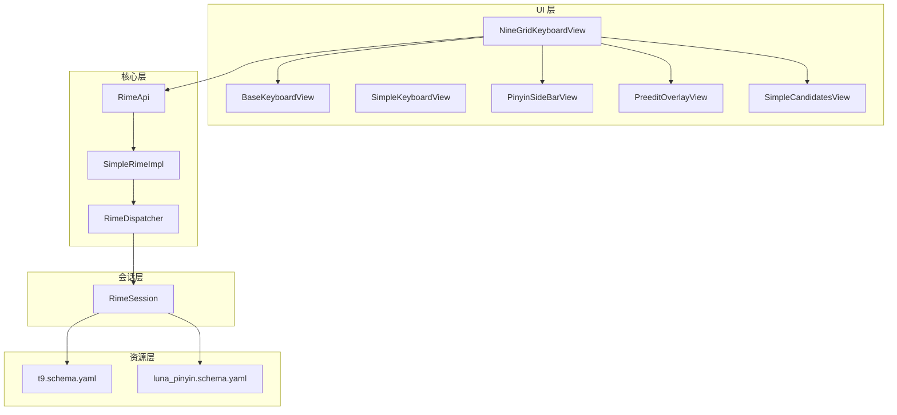
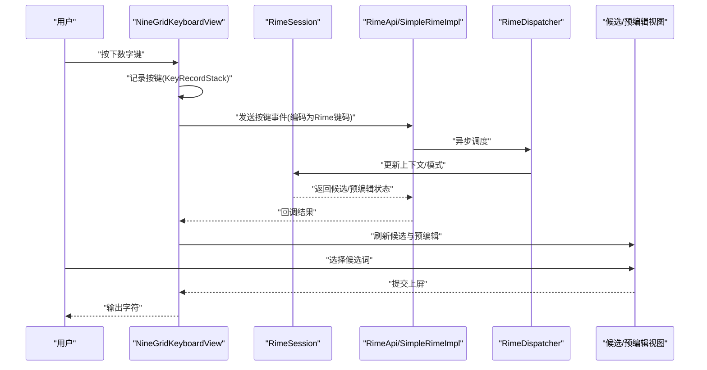
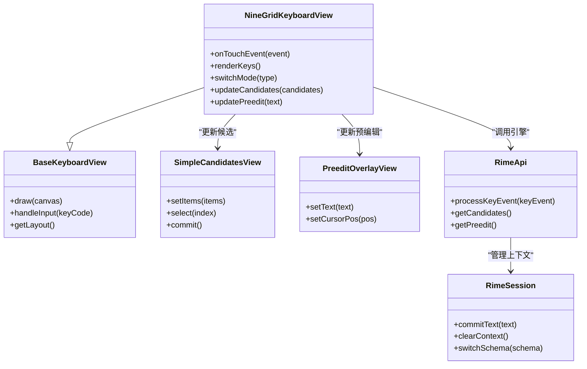
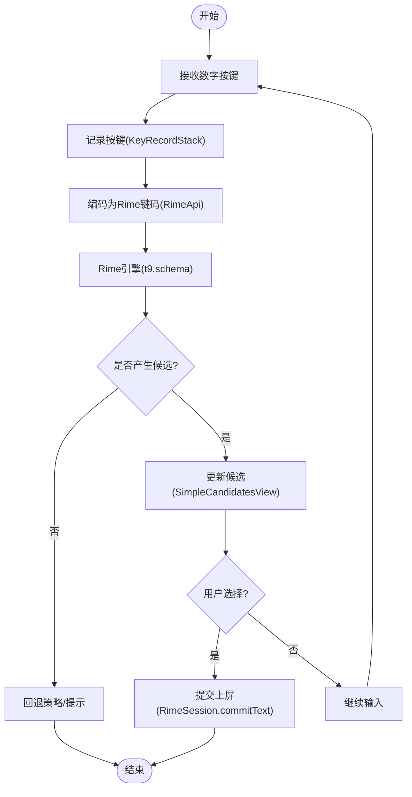
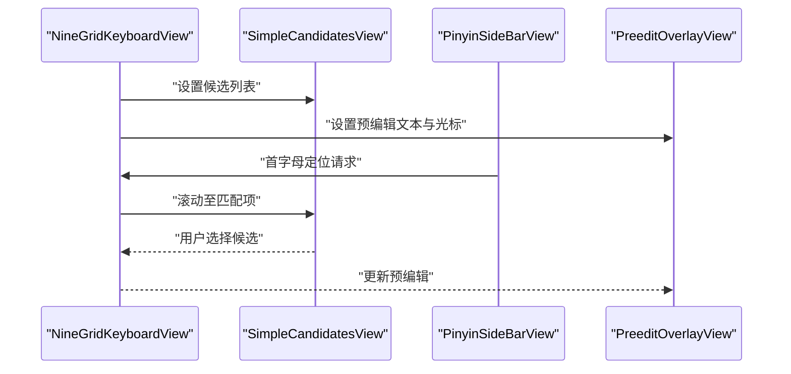
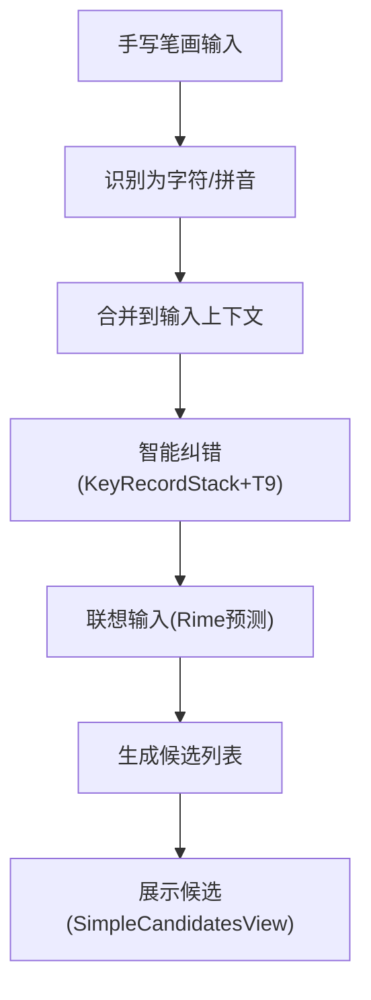
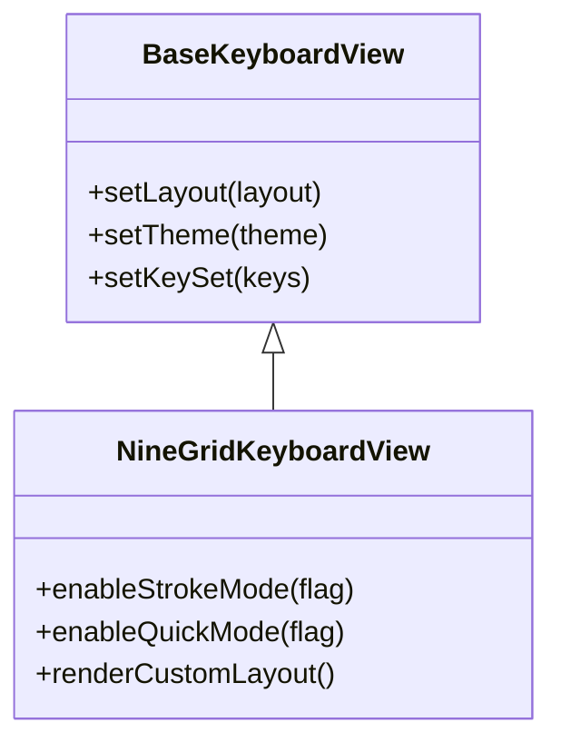
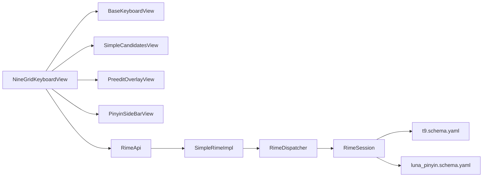

# 九宫格键盘 (NineGridKeyboardView)

<cite>
**本文档引用的文件**   
- [NineGridKeyboardView.kt](file://app/src/main/java/com/ziyou/ime/ime/NineGridKeyboardView.kt)
- [BaseKeyboardView.kt](file://app/src/main/java/com/ziyou/ime/ime/BaseKeyboardView.kt)
- [SimpleKeyboardView.kt](file://app/src/main/java/com/ziyou/ime/ime/SimpleKeyboardView.kt)
- [PinyinSideBarView.kt](file://app/src/main/java/com/ziyou/ime/ime/PinyinSideBarView.kt)
- [PreeditOverlayView.kt](file://app/src/main/java/com/ziyou/ime/ime/PreeditOverlayView.kt)
- [SimpleCandidatesView.kt](file://app/src/main/java/com/ziyou/ime/ime/SimpleCandidatesView.kt)
- [KeyCode.kt](file://app/src/main/java/com/ziyou/ime/ime/KeyCode.kt)
- [KeyboardType.kt](file://app/src/main/java/com/ziyou/ime/ime/KeyboardType.kt)
- [KeyRecordStack.kt](file://app/src/main/java/com/ziyou/ime/data/KeyRecordStack.kt)
- [T9PinYinUtils.kt](file://app/src/main/java/com/ziyou/ime/util/T9PinYinUtils.kt)
- [RimeApi.kt](file://app/src/main/java/com/ziyou/ime/core/RimeApi.kt)
- [SimpleRimeImpl.kt](file://app/src/main/java/com/ziyou/ime/core/SimpleRimeImpl.kt)
- [RimeDispatcher.kt](file://app/src/main/java/com/ziyou/ime/core/RimeDispatcher.kt)
- [RimeSession.kt](file://app/src/main/java/com/ziyou/ime/daemon/RimeSession.kt)
- [t9.schema.yaml](file://app/src/main/assets/rime/t9.schema.yaml)
- [luna_pinyin.schema.yaml](file://app/src/main/assets/rime/luna_pinyin.schema.yaml)
</cite>

## 目录
1. [简介](#简介)
2. [项目结构](#项目结构)
3. [核心组件](#核心组件)
4. [架构总览](#架构总览)
5. [详细组件分析](#详细组件分析)
6. [依赖关系分析](#依赖关系分析)
7. [性能考量](#性能考量)
8. [故障排查指南](#故障排查指南)
9. [结论](#结论)
10. [附录](#附录)

## 简介
本文件面向 NineGridKeyboardView（九宫格拼音键盘）的设计与实现，系统性阐述其设计理念、数字键到字母的映射规则、拼音输入算法、候选词显示逻辑，以及与手写识别、智能纠错和联想输入的集成方式。同时提供九宫格布局定制、笔画输入与快速输入模式的配置说明，帮助开发者快速理解并扩展该键盘能力。

## 项目结构
NineGridKeyboardView 位于输入法模块 ime 包中，围绕 Rime 引擎进行构建，结合自定义视图组件完成按键渲染、候选展示与预编辑区显示。关键目录与职责如下：
- app/src/main/java/com/ziyou/ime/ime：键盘与候选视图、侧边栏、预编辑覆盖层等 UI 组件
- app/src/main/java/com/ziyou/ime/core：Rime 引擎封装与调度
- app/src/main/java/com/ziyou/ime/daemon：Rime 会话管理
- app/src/main/java/com/ziyou/ime/util：工具类（如 T9 拼音工具）
- app/src/main/assets/rime：Rime 模式与词典资源（含 t9 与 luna_pinyin 模式）

**图表来源** 
- [NineGridKeyboardView.kt](file://app/src/main/java/com/ziyou/ime/ime/NineGridKeyboardView.kt)
- [BaseKeyboardView.kt](file://app/src/main/java/com/ziyou/ime/ime/BaseKeyboardView.kt)
- [SimpleKeyboardView.kt](file://app/src/main/java/com/ziyou/ime/ime/SimpleKeyboardView.kt)
- [PinyinSideBarView.kt](file://app/src/main/java/com/ziyou/ime/ime/PinyinSideBarView.kt)
- [PreeditOverlayView.kt](file://app/src/main/java/com/ziyou/ime/ime/PreeditOverlayView.kt)
- [SimpleCandidatesView.kt](file://app/src/main/java/com/ziyou/ime/ime/SimpleCandidatesView.kt)
- [RimeApi.kt](file://app/src/main/java/com/ziyou/ime/core/RimeApi.kt)
- [SimpleRimeImpl.kt](file://app/src/main/java/com/ziyou/ime/core/SimpleRimeImpl.kt)
- [RimeDispatcher.kt](file://app/src/main/java/com/ziyou/ime/core/RimeDispatcher.kt)
- [RimeSession.kt](file://app/src/main/java/com/ziyou/ime/daemon/RimeSession.kt)
- [t9.schema.yaml](file://app/src/main/assets/rime/t9.schema.yaml)
- [luna_pinyin.schema.yaml](file://app/src/main/assets/rime/luna_pinyin.schema.yaml)

**章节来源**
- [NineGridKeyboardView.kt](file://app/src/main/java/com/ziyou/ime/ime/NineGridKeyboardView.kt)
- [BaseKeyboardView.kt](file://app/src/main/java/com/ziyou/ime/ime/BaseKeyboardView.kt)
- [SimpleKeyboardView.kt](file://app/src/main/java/com/ziyou/ime/ime/SimpleKeyboardView.kt)
- [PinyinSideBarView.kt](file://app/src/main/java/com/ziyou/ime/ime/PinyinSideBarView.kt)
- [PreeditOverlayView.kt](file://app/src/main/java/com/ziyou/ime/ime/PreeditOverlayView.kt)
- [SimpleCandidatesView.kt](file://app/src/main/java/com/ziyou/ime/ime/SimpleCandidatesView.kt)
- [RimeApi.kt](file://app/src/main/java/com/ziyou/ime/core/RimeApi.kt)
- [SimpleRimeImpl.kt](file://app/src/main/java/com/ziyou/ime/core/SimpleRimeImpl.kt)
- [RimeDispatcher.kt](file://app/src/main/java/com/ziyou/ime/core/RimeDispatcher.kt)
- [RimeSession.kt](file://app/src/main/java/com/ziyou/ime/daemon/RimeSession.kt)
- [t9.schema.yaml](file://app/src/main/assets/rime/t9.schema.yaml)
- [luna_pinyin.schema.yaml](file://app/src/main/assets/rime/luna_pinyin.schema.yaml)

## 核心组件
- NineGridKeyboardView：九宫格键盘主视图，负责按键绘制、触摸事件处理、候选与预编辑联动、模式切换（数字/字母/符号/快捷输入）。
- BaseKeyboardView：键盘基类，抽象通用行为（布局、按键集合、绘制流程、事件分发）。
- SimpleKeyboardView：简化版键盘实现，用于对比或作为扩展基础。
- PinyinSideBarView：右侧拼音侧边栏，支持按首字母快速定位候选。
- PreeditOverlayView：预编辑文本覆盖层，显示当前拼写串与光标位置。
- SimpleCandidatesView：候选词列表视图，支持翻页、选择、上屏。
- KeyCode / KeyboardType：键盘键码与类型定义，统一按键语义。
- KeyRecordStack：按键记录栈，维护历史按键序列，辅助纠错与回溯。
- T9PinYinUtils：T9 拼音工具，提供数字到字母映射、音节切分、候选生成辅助。
- RimeApi / SimpleRimeImpl / RimeDispatcher：Rime 引擎封装、简单实现与异步调度。
- RimeSession：Rime 会话管理，负责上下文状态、模式切换、候选获取。

**章节来源**
- [NineGridKeyboardView.kt](file://app/src/main/java/com/ziyou/ime/ime/NineGridKeyboardView.kt)
- [BaseKeyboardView.kt](file://app/src/main/java/com/ziyou/ime/ime/BaseKeyboardView.kt)
- [SimpleKeyboardView.kt](file://app/src/main/java/com/ziyou/ime/ime/SimpleKeyboardView.kt)
- [PinyinSideBarView.kt](file://app/src/main/java/com/ziyou/ime/ime/PinyinSideBarView.kt)
- [PreeditOverlayView.kt](file://app/src/main/java/com/ziyou/ime/ime/PreeditOverlayView.kt)
- [SimpleCandidatesView.kt](file://app/src/main/java/com/ziyou/ime/ime/SimpleCandidatesView.kt)
- [KeyCode.kt](file://app/src/main/java/com/ziyou/ime/ime/KeyCode.kt)
- [KeyboardType.kt](file://app/src/main/java/com/ziyou/ime/ime/KeyboardType.kt)
- [KeyRecordStack.kt](file://app/src/main/java/com/ziyou/ime/data/KeyRecordStack.kt)
- [T9PinYinUtils.kt](file://app/src/main/java/com/ziyou/ime/util/T9PinYinUtils.kt)
- [RimeApi.kt](file://app/src/main/java/com/ziyou/ime/core/RimeApi.kt)
- [SimpleRimeImpl.kt](file://app/src/main/java/com/ziyou/ime/core/SimpleRimeImpl.kt)
- [RimeDispatcher.kt](file://app/src/main/java/com/ziyou/ime/core/RimeDispatcher.kt)
- [RimeSession.kt](file://app/src/main/java/com/ziyou/ime/daemon/RimeSession.kt)

## 架构总览
NineGridKeyboardView 采用“视图层 + 核心层 + 会话层 + 资源层”的分层架构。视图层负责交互与展示；核心层封装 Rime 引擎调用；会话层维护输入上下文；资源层提供模式与词典。整体数据流从用户按键开始，经工具与引擎处理后更新候选与预编辑，最终提交到目标应用。

**图表来源** 
- [NineGridKeyboardView.kt](file://app/src/main/java/com/ziyou/ime/ime/NineGridKeyboardView.kt)
- [RimeApi.kt](file://app/src/main/java/com/ziyou/ime/core/RimeApi.kt)
- [SimpleRimeImpl.kt](file://app/src/main/java/com/ziyou/ime/core/SimpleRimeImpl.kt)
- [RimeDispatcher.kt](file://app/src/main/java/com/ziyou/ime/core/RimeDispatcher.kt)
- [RimeSession.kt](file://app/src/main/java/com/ziyou/ime/daemon/RimeSession.kt)
- [SimpleCandidatesView.kt](file://app/src/main/java/com/ziyou/ime/ime/SimpleCandidatesView.kt)
- [PreeditOverlayView.kt](file://app/src/main/java/com/ziyou/ime/ime/PreeditOverlayView.kt)

## 详细组件分析

### NineGridKeyboardView 组件分析
NineGridKeyboardView 是九宫格键盘的核心视图，承担以下职责：
- 按键布局与绘制：根据键盘类型（数字/字母/符号/快捷）动态渲染按键。
- 触摸事件处理：捕获长按、滑动、点击等行为，驱动候选与预编辑更新。
- 候选与预编辑联动：与 SimpleCandidatesView 和 PreeditOverlayView 协作，实时反馈输入状态。
- 模式切换：在数字与字母之间切换，支持快速输入模式。
- 与 Rime 集成：通过 RimeApi/SimpleRimeImpl 将按键转换为 Rime 键码并获取候选。

**图表来源** 
- [NineGridKeyboardView.kt](file://app/src/main/java/com/ziyou/ime/ime/NineGridKeyboardView.kt)
- [BaseKeyboardView.kt](file://app/src/main/java/com/ziyou/ime/ime/BaseKeyboardView.kt)
- [SimpleCandidatesView.kt](file://app/src/main/java/com/ziyou/ime/ime/SimpleCandidatesView.kt)
- [PreeditOverlayView.kt](file://app/src/main/java/com/ziyou/ime/ime/PreeditOverlayView.kt)
- [RimeApi.kt](file://app/src/main/java/com/ziyou/ime/core/RimeApi.kt)
- [RimeSession.kt](file://app/src/main/java/com/ziyou/ime/daemon/RimeSession.kt)

**章节来源**
- [NineGridKeyboardView.kt](file://app/src/main/java/com/ziyou/ime/ime/NineGridKeyboardView.kt)
- [BaseKeyboardView.kt](file://app/src/main/java/com/ziyou/ime/ime/BaseKeyboardView.kt)
- [SimpleCandidatesView.kt](file://app/src/main/java/com/ziyou/ime/ime/SimpleCandidatesView.kt)
- [PreeditOverlayView.kt](file://app/src/main/java/com/ziyou/ime/ime/PreeditOverlayView.kt)
- [RimeApi.kt](file://app/src/main/java/com/ziyou/ime/core/RimeApi.kt)
- [RimeSession.kt](file://app/src/main/java/com/ziyou/ime/daemon/RimeSession.kt)

### 数字键到字母映射与 T9 拼音算法
- 映射规则：遵循标准九宫格布局，数字键 2-9 分别对应一组字母（例如 2→ABC，3→DEF，依此类推），具体映射由 T9PinYinUtils 与 Rime 的 t9.schema.yaml 共同决定。
- 拼音算法：将连续的数字序列按音节边界切分，结合词典与权重生成候选词。KeyRecordStack 维护按键历史，便于纠错与回溯。
- 候选生成：通过 Rime 引擎的 t9 模式解析数字串，返回候选列表；SimpleCandidatesView 负责展示与选择。

**图表来源** 
- [T9PinYinUtils.kt](file://app/src/main/java/com/ziyou/ime/util/T9PinYinUtils.kt)
- [KeyRecordStack.kt](file://app/src/main/java/com/ziyou/ime/data/KeyRecordStack.kt)
- [RimeApi.kt](file://app/src/main/java/com/ziyou/ime/core/RimeApi.kt)
- [t9.schema.yaml](file://app/src/main/assets/rime/t9.schema.yaml)
- [SimpleCandidatesView.kt](file://app/src/main/java/com/ziyou/ime/ime/SimpleCandidatesView.kt)
- [RimeSession.kt](file://app/src/main/java/com/ziyou/ime/daemon/RimeSession.kt)

**章节来源**
- [T9PinYinUtils.kt](file://app/src/main/java/com/ziyou/ime/util/T9PinYinUtils.kt)
- [KeyRecordStack.kt](file://app/src/main/java/com/ziyou/ime/data/KeyRecordStack.kt)
- [RimeApi.kt](file://app/src/main/java/com/ziyou/ime/core/RimeApi.kt)
- [t9.schema.yaml](file://app/src/main/assets/rime/t9.schema.yaml)
- [SimpleCandidatesView.kt](file://app/src/main/java/com/ziyou/ime/ime/SimpleCandidatesView.kt)
- [RimeSession.kt](file://app/src/main/java/com/ziyou/ime/daemon/RimeSession.kt)

### 候选词显示与侧边栏定位
- 候选展示：SimpleCandidatesView 以列表形式展示候选词，支持翻页与选择。
- 侧边栏定位：PinyinSideBarView 提供按首字母快速定位功能，提升长列表候选的选择效率。
- 预编辑显示：PreeditOverlayView 显示当前拼写串与光标位置，帮助用户确认输入状态。

**图表来源** 
- [SimpleCandidatesView.kt](file://app/src/main/java/com/ziyou/ime/ime/SimpleCandidatesView.kt)
- [PinyinSideBarView.kt](file://app/src/main/java/com/ziyou/ime/ime/PinyinSideBarView.kt)
- [PreeditOverlayView.kt](file://app/src/main/java/com/ziyou/ime/ime/PreeditOverlayView.kt)
- [NineGridKeyboardView.kt](file://app/src/main/java/com/ziyou/ime/ime/NineGridKeyboardView.kt)

**章节来源**
- [SimpleCandidatesView.kt](file://app/src/main/java/com/ziyou/ime/ime/SimpleCandidatesView.kt)
- [PinyinSideBarView.kt](file://app/src/main/java/com/ziyou/ime/ime/PinyinSideBarView.kt)
- [PreeditOverlayView.kt](file://app/src/main/java/com/ziyou/ime/ime/PreeditOverlayView.kt)
- [NineGridKeyboardView.kt](file://app/src/main/java/com/ziyou/ime/ime/NineGridKeyboardView.kt)

### 手写识别集成与智能纠错
- 手写识别：通过手势路径与笔画序列识别汉字，与九宫格输入并行或切换使用。识别结果可注入 Rime 上下文或直接上屏。
- 智能纠错：基于 KeyRecordStack 的按键历史与 T9 拼音工具，对误触或模糊输入进行修正，提升候选质量。
- 联想输入：借助 Rime 的预测插件与用户词典，结合上下文生成联想候选，提高输入效率。

**图表来源** 
- [KeyRecordStack.kt](file://app/src/main/java/com/ziyou/ime/data/KeyRecordStack.kt)
- [T9PinYinUtils.kt](file://app/src/main/java/com/ziyou/ime/util/T9PinYinUtils.kt)
- [RimeApi.kt](file://app/src/main/java/com/ziyou/ime/core/RimeApi.kt)
- [SimpleCandidatesView.kt](file://app/src/main/java/com/ziyou/ime/ime/SimpleCandidatesView.kt)

**章节来源**
- [KeyRecordStack.kt](file://app/src/main/java/com/ziyou/ime/data/KeyRecordStack.kt)
- [T9PinYinUtils.kt](file://app/src/main/java/com/ziyou/ime/util/T9PinYinUtils.kt)
- [RimeApi.kt](file://app/src/main/java/com/ziyou/ime/core/RimeApi.kt)
- [SimpleCandidatesView.kt](file://app/src/main/java/com/ziyou/ime/ime/SimpleCandidatesView.kt)

### 九宫格布局定制、笔画输入与快速输入模式
- 布局定制：通过 BaseKeyboardView 的布局接口与 NineGridKeyboardView 的渲染逻辑，可自定义按键大小、间距、主题与按键集合。
- 笔画输入：在特定模式下启用笔画输入，将笔画序列转换为候选词，与拼音输入互补。
- 快速输入模式：支持快捷键与组合键，减少操作步骤，提升输入速度。

**图表来源** 
- [BaseKeyboardView.kt](file://app/src/main/java/com/ziyou/ime/ime/BaseKeyboardView.kt)
- [NineGridKeyboardView.kt](file://app/src/main/java/com/ziyou/ime/ime/NineGridKeyboardView.kt)

**章节来源**
- [BaseKeyboardView.kt](file://app/src/main/java/com/ziyou/ime/ime/BaseKeyboardView.kt)
- [NineGridKeyboardView.kt](file://app/src/main/java/com/ziyou/ime/ime/NineGridKeyboardView.kt)

## 依赖关系分析
NineGridKeyboardView 依赖多个组件与资源，形成清晰的依赖链：
- 视图依赖：BaseKeyboardView、SimpleCandidatesView、PreeditOverlayView、PinyinSideBarView
- 核心依赖：RimeApi、SimpleRimeImpl、RimeDispatcher
- 会话依赖：RimeSession
- 资源依赖：t9.schema.yaml、luna_pinyin.schema.yaml

**图表来源** 
- [NineGridKeyboardView.kt](file://app/src/main/java/com/ziyou/ime/ime/NineGridKeyboardView.kt)
- [BaseKeyboardView.kt](file://app/src/main/java/com/ziyou/ime/ime/BaseKeyboardView.kt)
- [SimpleCandidatesView.kt](file://app/src/main/java/com/ziyou/ime/ime/SimpleCandidatesView.kt)
- [PreeditOverlayView.kt](file://app/src/main/java/com/ziyou/ime/ime/PreeditOverlayView.kt)
- [PinyinSideBarView.kt](file://app/src/main/java/com/ziyou/ime/ime/PinyinSideBarView.kt)
- [RimeApi.kt](file://app/src/main/java/com/ziyou/ime/core/RimeApi.kt)
- [SimpleRimeImpl.kt](file://app/src/main/java/com/ziyou/ime/core/SimpleRimeImpl.kt)
- [RimeDispatcher.kt](file://app/src/main/java/com/ziyou/ime/core/RimeDispatcher.kt)
- [RimeSession.kt](file://app/src/main/java/com/ziyou/ime/daemon/RimeSession.kt)
- [t9.schema.yaml](file://app/src/main/assets/rime/t9.schema.yaml)
- [luna_pinyin.schema.yaml](file://app/src/main/assets/rime/luna_pinyin.schema.yaml)

**章节来源**
- [NineGridKeyboardView.kt](file://app/src/main/java/com/ziyou/ime/ime/NineGridKeyboardView.kt)
- [BaseKeyboardView.kt](file://app/src/main/java/com/ziyou/ime/ime/BaseKeyboardView.kt)
- [SimpleCandidatesView.kt](file://app/src/main/java/com/ziyou/ime/ime/SimpleCandidatesView.kt)
- [PreeditOverlayView.kt](file://app/src/main/java/com/ziyou/ime/ime/PreeditOverlayView.kt)
- [PinyinSideBarView.kt](file://app/src/main/java/com/ziyou/ime/ime/PinyinSideBarView.kt)
- [RimeApi.kt](file://app/src/main/java/com/ziyou/ime/core/RimeApi.kt)
- [SimpleRimeImpl.kt](file://app/src/main/java/com/ziyou/ime/core/SimpleRimeImpl.kt)
- [RimeDispatcher.kt](file://app/src/main/java/com/ziyou/ime/core/RimeDispatcher.kt)
- [RimeSession.kt](file://app/src/main/java/com/ziyou/ime/daemon/RimeSession.kt)
- [t9.schema.yaml](file://app/src/main/assets/rime/t9.schema.yaml)
- [luna_pinyin.schema.yaml](file://app/src/main/assets/rime/luna_pinyin.schema.yaml)

## 性能考量
- 候选生成优化：利用 Rime 的 t9 模式与缓存机制，减少重复计算。
- 视图渲染优化：按需刷新候选与预编辑区域，避免全量重绘。
- 异步调度：通过 RimeDispatcher 将引擎调用异步化，避免阻塞 UI 线程。
- 内存管理：合理管理 KeyRecordStack 长度，防止历史按键过多导致内存占用过高。

[本节为通用指导，不直接分析具体文件]

## 故障排查指南
- 候选为空：检查 t9.schema.yaml 是否正确加载，确认 RimeSession 上下文状态。
- 候选延迟：查看 RimeDispatcher 异步任务队列，确认是否存在阻塞操作。
- 预编辑不更新：检查 PreeditOverlayView 的 setText 与 setCursorPos 调用时机。
- 侧边栏定位异常：验证 PinyinSideBarView 的首字母映射与候选列表排序。

**章节来源**
- [t9.schema.yaml](file://app/src/main/assets/rime/t9.schema.yaml)
- [RimeSession.kt](file://app/src/main/java/com/ziyou/ime/daemon/RimeSession.kt)
- [RimeDispatcher.kt](file://app/src/main/java/com/ziyou/ime/core/RimeDispatcher.kt)
- [PreeditOverlayView.kt](file://app/src/main/java/com/ziyou/ime/ime/PreeditOverlayView.kt)
- [PinyinSideBarView.kt](file://app/src/main/java/com/ziyou/ime/ime/PinyinSideBarView.kt)

## 结论
NineGridKeyboardView 以清晰的层次结构与模块化设计实现了高效的九宫格拼音输入。通过 Rime 引擎的强大能力与自定义视图的灵活扩展，满足了数字键映射、候选展示、手写识别、智能纠错与联想输入等多重需求。开发者可基于现有组件快速定制布局与模式，提升输入体验。

[本节为总结性内容，不直接分析具体文件]

## 附录
- 配置建议：根据用户需求调整 t9 与 luna_pinyin 模式参数，优化候选质量与响应速度。
- 扩展方向：增加更多快捷输入模式与个性化主题，提升用户满意度。

[本节为补充信息，不直接分析具体文件]