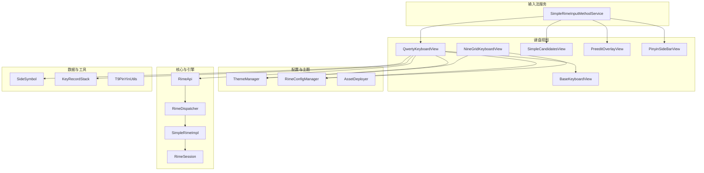
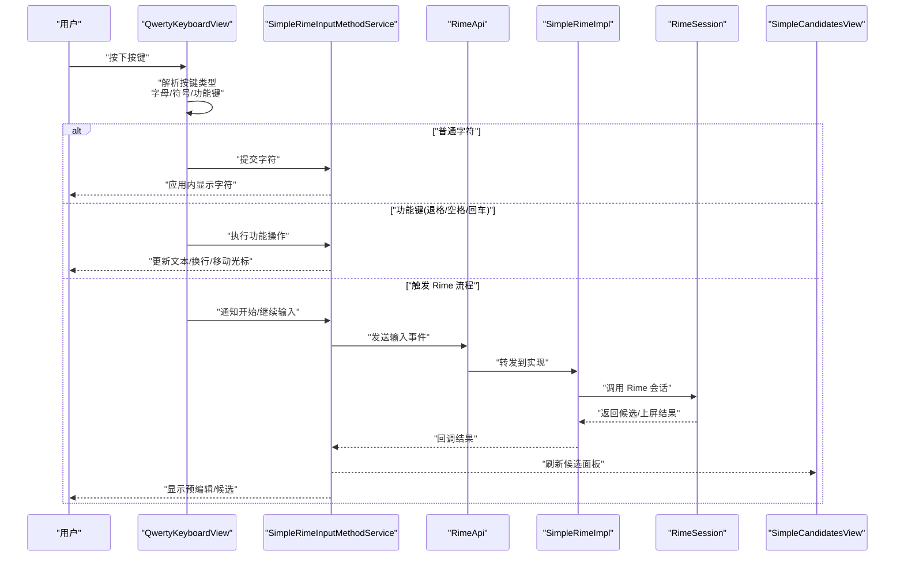
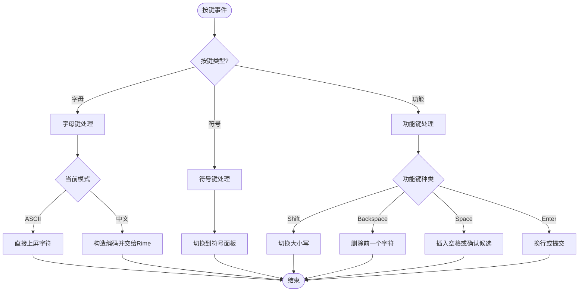
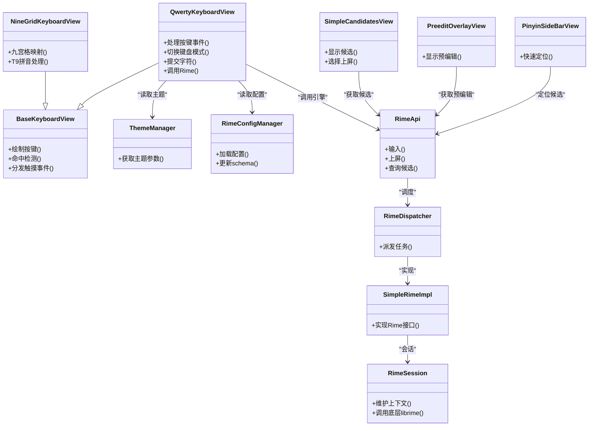

# 全键盘 (QwertyKeyboardView)

<cite>
**本文引用的文件**   
- [QwertyKeyboardView.kt](file://app/src/main/java/com/ziyou/ime/ime/QwertyKeyboardView.kt)
- [BaseKeyboardView.kt](file://app/src/main/java/com/ziyou/ime/ime/BaseKeyboardView.kt)
- [KeyCode.kt](file://app/src/main/java/com/ziyou/ime/ime/KeyCode.kt)
- [KeyboardType.kt](file://app/src/main/java/com/ziyou/ime/ime/KeyboardType.kt)
- [NineGridKeyboardView.kt](file://app/src/main/java/com/ziyou/ime/ime/NineGridKeyboardView.kt)
- [SimpleCandidatesView.kt](file://app/src/main/java/com/ziyou/ime/ime/SimpleCandidatesView.kt)
- [PreeditOverlayView.kt](file://app/src/main/java/com/ziyou/ime/ime/PreeditOverlayView.kt)
- [PinyinSideBarView.kt](file://app/src/main/java/com/ziyou/ime/ime/PinyinSideBarView.kt)
- [SideSymbol.kt](file://app/src/main/java/com/ziyou/ime/data/SideSymbol.kt)
- [KeyRecordStack.kt](file://app/src/main/java/com/ziyou/ime/data/KeyRecordStack.kt)
- [SimpleRimeInputMethodService.kt](file://app/src/main/java/com/ziyou/ime/ime/SimpleRimeInputMethodService.kt)
- [ThemeManager.kt](file://app/src/main/java/com/ziyou/ime/config/ThemeManager.kt)
- [RimeConfigManager.kt](file://app/src/main/java/com/ziyou/ime/config/RimeConfigManager.kt)
- [AssetDeployer.kt](file://app/src/main/java/com/ziyou/ime/config/AssetDeployer.kt)
- [RimeApi.kt](file://app/src/main/java/com/ziyou/ime/core/RimeApi.kt)
- [RimeDispatcher.kt](file://app/src/main/java/com/ziyou/ime/core/RimeDispatcher.kt)
- [SimpleRimeImpl.kt](file://app/src/main/java/com/ziyou/ime/core/SimpleRimeImpl.kt)
- [RimeSession.kt](file://app/src/main/java/com/ziyou/ime/daemon/RimeSession.kt)
- [T9PinYinUtils.kt](file://app/src/main/java/com/ziyou/ime/util/T9PinYinUtils.kt)
- [input_method.xml](file://app/src/main/res/xml/input_method.xml)
</cite>

## 目录
1. [简介](#简介)
2. [项目结构](#项目结构)
3. [核心组件](#核心组件)
4. [架构总览](#架构总览)
5. [详细组件分析](#详细组件分析)
6. [依赖关系分析](#依赖关系分析)
7. [性能考量](#性能考量)
8. [故障排查指南](#故障排查指南)
9. [结论](#结论)
10. [附录](#附录)

## 简介
本文件面向 QwertyKeyboardView（全键盘）的实现原理与布局设计，重点说明标准 QWERTY 键盘的按键映射、字符输入逻辑与特殊功能键处理。文档涵盖大小写切换、符号输入、空格与回车键的功能实现，并提供键盘样式定制、按键音效与震动反馈的配置方法。读者无需深入 Android 输入法开发经验即可理解整体设计与扩展方式。

## 项目结构
QwertyKeyboardView 位于 ime 包中，作为自定义 View 负责渲染与交互；其通过 InputMethodService 与 Rime 引擎协作完成候选词与上屏逻辑；主题与配置由 config 包管理；数据层提供侧边符号与按键历史栈等辅助能力。

图表来源
- [SimpleRimeInputMethodService.kt](file://app/src/main/java/com/ziyou/ime/ime/SimpleRimeInputMethodService.kt)
- [QwertyKeyboardView.kt](file://app/src/main/java/com/ziyou/ime/ime/QwertyKeyboardView.kt)
- [BaseKeyboardView.kt](file://app/src/main/java/com/ziyou/ime/ime/BaseKeyboardView.kt)
- [NineGridKeyboardView.kt](file://app/src/main/java/com/ziyou/ime/ime/NineGridKeyboardView.kt)
- [SimpleCandidatesView.kt](file://app/src/main/java/com/ziyou/ime/ime/SimpleCandidatesView.kt)
- [PreeditOverlayView.kt](file://app/src/main/java/com/ziyou/ime/ime/PreeditOverlayView.kt)
- [PinyinSideBarView.kt](file://app/src/main/java/com/ziyou/ime/ime/PinyinSideBarView.kt)
- [ThemeManager.kt](file://app/src/main/java/com/ziyou/ime/config/ThemeManager.kt)
- [RimeConfigManager.kt](file://app/src/main/java/com/ziyou/ime/config/RimeConfigManager.kt)
- [AssetDeployer.kt](file://app/src/main/java/com/ziyou/ime/config/AssetDeployer.kt)
- [RimeApi.kt](file://app/src/main/java/com/ziyou/ime/core/RimeApi.kt)
- [RimeDispatcher.kt](file://app/src/main/java/com/ziyou/ime/core/RimeDispatcher.kt)
- [SimpleRimeImpl.kt](file://app/src/main/java/com/ziyou/ime/core/SimpleRimeImpl.kt)
- [RimeSession.kt](file://app/src/main/java/com/ziyou/ime/daemon/RimeSession.kt)
- [SideSymbol.kt](file://app/src/main/java/com/ziyou/ime/data/SideSymbol.kt)
- [KeyRecordStack.kt](file://app/src/main/java/com/ziyou/ime/data/KeyRecordStack.kt)
- [T9PinYinUtils.kt](file://app/src/main/java/com/ziyou/ime/util/T9PinYinUtils.kt)

章节来源
- [SimpleRimeInputMethodService.kt](file://app/src/main/java/com/ziyou/ime/ime/SimpleRimeInputMethodService.kt)
- [QwertyKeyboardView.kt](file://app/src/main/java/com/ziyou/ime/ime/QwertyKeyboardView.kt)
- [BaseKeyboardView.kt](file://app/src/main/java/com/ziyou/ime/ime/BaseKeyboardView.kt)
- [NineGridKeyboardView.kt](file://app/src/main/java/com/ziyou/ime/ime/NineGridKeyboardView.kt)
- [SimpleCandidatesView.kt](file://app/src/main/java/com/ziyou/ime/ime/SimpleCandidatesView.kt)
- [PreeditOverlayView.kt](file://app/src/main/java/com/ziyou/ime/ime/PreeditOverlayView.kt)
- [PinyinSideBarView.kt](file://app/src/main/java/com/ziyou/ime/ime/PinyinSideBarView.kt)
- [ThemeManager.kt](file://app/src/main/java/com/ziyou/ime/config/ThemeManager.kt)
- [RimeConfigManager.kt](file://app/src/main/java/com/ziyou/ime/config/RimeConfigManager.kt)
- [AssetDeployer.kt](file://app/src/main/java/com/ziyou/ime/config/AssetDeployer.kt)
- [RimeApi.kt](file://app/src/main/java/com/ziyou/ime/core/RimeApi.kt)
- [RimeDispatcher.kt](file://app/src/main/java/com/ziyou/ime/core/RimeDispatcher.kt)
- [SimpleRimeImpl.kt](file://app/src/main/java/com/ziyou/ime/core/SimpleRimeImpl.kt)
- [RimeSession.kt](file://app/src/main/java/com/ziyou/ime/daemon/RimeSession.kt)
- [SideSymbol.kt](file://app/src/main/java/com/ziyou/ime/data/SideSymbol.kt)
- [KeyRecordStack.kt](file://app/src/main/java/com/ziyou/ime/data/KeyRecordStack.kt)
- [T9PinYinUtils.kt](file://app/src/main/java/com/ziyou/ime/util/T9PinYinUtils.kt)

## 核心组件
- QwertyKeyboardView：QWERTY 键盘视图，负责按键布局绘制、触摸事件分发、状态切换（字母/符号）、以及将按键动作转化为输入事件或引擎调用。
- BaseKeyboardView：键盘基类，封装通用绘制、布局计算、按键命中检测与动画/反馈基础能力。
- NineGridKeyboardView：九宫格键盘视图，用于数字/拼音九宫格模式。
- SimpleCandidatesView：候选词面板，展示 Rime 返回的候选项并支持选择上屏。
- PreeditOverlayView：预编辑区覆盖层，显示当前正在输入的拼音或编码。
- PinyinSideBarView：拼音侧边栏，快速跳转与定位候选。
- ThemeManager：主题管理器，统一控制颜色、字体、按键尺寸等外观参数。
- RimeConfigManager：Rime 配置管理，加载/更新 schema、词典与标点方案。
- AssetDeployer：资源部署器，确保 assets/rime 下的配置文件与词典可用。
- RimeApi/RimeDispatcher/SimpleRimeImpl/RimeSession：Rime 引擎封装与调度，提供输入上下文、翻译、上屏等操作。
- SideSymbol：侧边符号表，定义常用符号集与分组。
- KeyRecordStack：按键记录栈，支持撤销/重做或历史记录。
- T9PinYinUtils：T9 拼音工具，辅助九宫格输入场景。

章节来源
- [QwertyKeyboardView.kt](file://app/src/main/java/com/ziyou/ime/ime/QwertyKeyboardView.kt)
- [BaseKeyboardView.kt](file://app/src/main/java/com/ziyou/ime/ime/BaseKeyboardView.kt)
- [NineGridKeyboardView.kt](file://app/src/main/java/com/ziyou/ime/ime/NineGridKeyboardView.kt)
- [SimpleCandidatesView.kt](file://app/src/main/java/com/ziyou/ime/ime/SimpleCandidatesView.kt)
- [PreeditOverlayView.kt](file://app/src/main/java/com/ziyou/ime/ime/PreeditOverlayView.kt)
- [PinyinSideBarView.kt](file://app/src/main/java/com/ziyou/ime/ime/PinyinSideBarView.kt)
- [ThemeManager.kt](file://app/src/main/java/com/ziyou/ime/config/ThemeManager.kt)
- [RimeConfigManager.kt](file://app/src/main/java/com/ziyou/ime/config/RimeConfigManager.kt)
- [AssetDeployer.kt](file://app/src/main/java/com/ziyou/ime/config/AssetDeployer.kt)
- [RimeApi.kt](file://app/src/main/java/com/ziyou/ime/core/RimeApi.kt)
- [RimeDispatcher.kt](file://app/src/main/java/com/ziyou/ime/core/RimeDispatcher.kt)
- [SimpleRimeImpl.kt](file://app/src/main/java/com/ziyou/ime/core/SimpleRimeImpl.kt)
- [RimeSession.kt](file://app/src/main/java/com/ziyou/ime/daemon/RimeSession.kt)
- [SideSymbol.kt](file://app/src/main/java/com/ziyou/ime/data/SideSymbol.kt)
- [KeyRecordStack.kt](file://app/src/main/java/com/ziyou/ime/data/KeyRecordStack.kt)
- [T9PinYinUtils.kt](file://app/src/main/java/com/ziyou/ime/util/T9PinYinUtils.kt)

## 架构总览
QwertyKeyboardView 作为 UI 层，接收用户触摸事件，根据当前键盘类型（字母/QWERTY、符号、数字/九宫格）决定输入行为。对于普通字符，直接通过输入法框架上屏；对于特殊键（如大小写切换、符号切换、退格、回车、空格），执行相应状态机转换或调用 Rime 引擎进行分词/上屏。候选词面板与预编辑区由服务层统一管理，保证多视图同步。

图表来源
- [QwertyKeyboardView.kt](file://app/src/main/java/com/ziyou/ime/ime/QwertyKeyboardView.kt)
- [SimpleRimeInputMethodService.kt](file://app/src/main/java/com/ziyou/ime/ime/SimpleRimeInputMethodService.kt)
- [RimeApi.kt](file://app/src/main/java/com/ziyou/ime/core/RimeApi.kt)
- [RimeDispatcher.kt](file://app/src/main/java/com/ziyou/ime/core/RimeDispatcher.kt)
- [SimpleRimeImpl.kt](file://app/src/main/java/com/ziyou/ime/core/SimpleRimeImpl.kt)
- [RimeSession.kt](file://app/src/main/java/com/ziyou/ime/daemon/RimeSession.kt)
- [SimpleCandidatesView.kt](file://app/src/main/java/com/ziyou/ime/ime/SimpleCandidatesView.kt)

## 详细组件分析

### QwertyKeyboardView：QWERTY 键盘视图
- 布局设计：按行组织字母键，包含 Shift、Space、Enter、Backspace、符号切换等关键功能键；支持横竖屏自适应与不同 DPI 的按键尺寸计算。
- 按键映射：维护 QWERTY 标准映射，区分大小写态；符号态下映射到常用标点与数学符号集合。
- 输入逻辑：
  - 字母键：在 ASCII 模式下直接上屏；在中文模式下转为编码输入，交由 Rime 处理。
  - 功能键：Shift 切换大小写；符号键切换符号面板；退格删除；空格插入空格或确认候选；回车换行或提交。
- 状态机：内部维护“字母/大写/符号”三种模式，切换时刷新布局与按键标签。
- 反馈机制：可配置按键音效与震动；绘制按压高亮与长按提示。

图表来源
- [QwertyKeyboardView.kt](file://app/src/main/java/com/ziyou/ime/ime/QwertyKeyboardView.kt)
- [KeyCode.kt](file://app/src/main/java/com/ziyou/ime/ime/KeyCode.kt)
- [KeyboardType.kt](file://app/src/main/java/com/ziyou/ime/ime/KeyboardType.kt)

章节来源
- [QwertyKeyboardView.kt](file://app/src/main/java/com/ziyou/ime/ime/QwertyKeyboardView.kt)
- [KeyCode.kt](file://app/src/main/java/com/ziyou/ime/ime/KeyCode.kt)
- [KeyboardType.kt](file://app/src/main/java/com/ziyou/ime/ime/KeyboardType.kt)

### BaseKeyboardView：键盘基类
- 职责：抽象出键盘绘制、布局测量、按键命中检测、触摸事件分发、按压态与动画的基础实现。
- 扩展点：子类需实现按键列表生成、按键绘制与点击回调；基类统一处理坐标换算与事件拦截。
- 性能优化：使用双缓冲绘制、按需重绘区域、避免频繁对象分配。

章节来源
- [BaseKeyboardView.kt](file://app/src/main/java/com/ziyou/ime/ime/BaseKeyboardView.kt)

### NineGridKeyboardView：九宫格键盘
- 用途：数字/拼音九宫格输入，按键映射到 2-9 的数字键，每个键对应多个字母。
- 逻辑：结合 T9PinYinUtils 将按键序列转换为拼音音节，再交由 Rime 处理。
- 交互：支持长按切换符号、滑动选择候选、快速输入。

章节来源
- [NineGridKeyboardView.kt](file://app/src/main/java/com/ziyou/ime/ime/NineGridKeyboardView.kt)
- [T9PinYinUtils.kt](file://app/src/main/java/com/ziyou/ime/util/T9PinYinUtils.kt)

### SimpleCandidatesView：候选词面板
- 职责：展示 Rime 返回的候选项，支持左右翻页与点击上屏。
- 联动：与 PreeditOverlayView 同步显示当前预编辑内容；与键盘视图联动切换中英文模式。

章节来源
- [SimpleCandidatesView.kt](file://app/src/main/java/com/ziyou/ime/ime/SimpleCandidatesView.kt)

### PreeditOverlayView：预编辑覆盖层
- 职责：在输入框上方显示当前拼音/编码的中间状态，便于用户观察输入进度。
- 交互：支持手势调整位置与透明度。

章节来源
- [PreeditOverlayView.kt](file://app/src/main/java/com/ziyou/ime/ime/PreeditOverlayView.kt)

### PinyinSideBarView：拼音侧边栏
- 职责：提供 A-Z 快速定位，提升长候选列表的浏览效率。
- 交互：滑动高亮当前字母，点击跳转到对应候选段。

章节来源
- [PinyinSideBarView.kt](file://app/src/main/java/com/ziyou/ime/ime/PinyinSideBarView.kt)

### ThemeManager：主题管理器
- 职责：集中管理颜色、字体、按键尺寸、间距、阴影等视觉参数。
- 使用：键盘视图在绘制前读取主题配置，确保一致的外观风格。

章节来源
- [ThemeManager.kt](file://app/src/main/java/com/ziyou/ime/config/ThemeManager.kt)

### RimeConfigManager：Rime 配置管理
- 职责：加载/更新 schema、词典、标点方案；监听配置变更并通知相关组件。
- 集成：与 AssetDeployer 配合确保资源就绪。

章节来源
- [RimeConfigManager.kt](file://app/src/main/java/com/ziyou/ime/config/RimeConfigManager.kt)
- [AssetDeployer.kt](file://app/src/main/java/com/ziyou/ime/config/AssetDeployer.kt)

### RimeApi/RimeDispatcher/SimpleRimeImpl/RimeSession：引擎封装
- RimeApi：对外暴露输入接口（输入、上屏、查询候选等）。
- RimeDispatcher：消息派发与线程调度，保证 UI 与引擎调用解耦。
- SimpleRimeImpl：具体实现，封装 RimeSession 的生命周期与状态。
- RimeSession：与底层 librime 交互，维护输入上下文与候选缓存。

章节来源
- [RimeApi.kt](file://app/src/main/java/com/ziyou/ime/core/RimeApi.kt)
- [RimeDispatcher.kt](file://app/src/main/java/com/ziyou/ime/core/RimeDispatcher.kt)
- [SimpleRimeImpl.kt](file://app/src/main/java/com/ziyou/ime/core/SimpleRimeImpl.kt)
- [RimeSession.kt](file://app/src/main/java/com/ziyou/ime/daemon/RimeSession.kt)

### SideSymbol：侧边符号表
- 职责：定义符号分组（标点、数学、货币、单位等）与映射关系。
- 使用：符号面板根据分组动态生成按键。

章节来源
- [SideSymbol.kt](file://app/src/main/java/com/ziyou/ime/data/SideSymbol.kt)

### KeyRecordStack：按键记录栈
- 职责：记录最近按键序列，支持撤销/重做或调试统计。
- 使用：在需要恢复输入状态或回滚操作时发挥作用。

章节来源
- [KeyRecordStack.kt](file://app/src/main/java/com/ziyou/ime/data/KeyRecordStack.kt)

## 依赖关系分析
- UI 层依赖主题与配置模块，以获取外观与行为参数。
- 键盘视图依赖输入法服务以提交字符与候选操作。
- 输入法服务依赖 Rime 引擎封装，完成翻译与上屏。
- 数据层为 UI 与引擎提供辅助数据结构与工具函数。

图表来源
- [QwertyKeyboardView.kt](file://app/src/main/java/com/ziyou/ime/ime/QwertyKeyboardView.kt)
- [BaseKeyboardView.kt](file://app/src/main/java/com/ziyou/ime/ime/BaseKeyboardView.kt)
- [NineGridKeyboardView.kt](file://app/src/main/java/com/ziyou/ime/ime/NineGridKeyboardView.kt)
- [SimpleCandidatesView.kt](file://app/src/main/java/com/ziyou/ime/ime/SimpleCandidatesView.kt)
- [PreeditOverlayView.kt](file://app/src/main/java/com/ziyou/ime/ime/PreeditOverlayView.kt)
- [PinyinSideBarView.kt](file://app/src/main/java/com/ziyou/ime/ime/PinyinSideBarView.kt)
- [ThemeManager.kt](file://app/src/main/java/com/ziyou/ime/config/ThemeManager.kt)
- [RimeConfigManager.kt](file://app/src/main/java/com/ziyou/ime/config/RimeConfigManager.kt)
- [RimeApi.kt](file://app/src/main/java/com/ziyou/ime/core/RimeApi.kt)
- [RimeDispatcher.kt](file://app/src/main/java/com/ziyou/ime/core/RimeDispatcher.kt)
- [SimpleRimeImpl.kt](file://app/src/main/java/com/ziyou/ime/core/SimpleRimeImpl.kt)
- [RimeSession.kt](file://app/src/main/java/com/ziyou/ime/daemon/RimeSession.kt)

章节来源
- [QwertyKeyboardView.kt](file://app/src/main/java/com/ziyou/ime/ime/QwertyKeyboardView.kt)
- [BaseKeyboardView.kt](file://app/src/main/java/com/ziyou/ime/ime/BaseKeyboardView.kt)
- [NineGridKeyboardView.kt](file://app/src/main/java/com/ziyou/ime/ime/NineGridKeyboardView.kt)
- [SimpleCandidatesView.kt](file://app/src/main/java/com/ziyou/ime/ime/SimpleCandidatesView.kt)
- [PreeditOverlayView.kt](file://app/src/main/java/com/ziyou/ime/ime/PreeditOverlayView.kt)
- [PinyinSideBarView.kt](file://app/src/main/java/com/ziyou/ime/ime/PinyinSideBarView.kt)
- [ThemeManager.kt](file://app/src/main/java/com/ziyou/ime/config/ThemeManager.kt)
- [RimeConfigManager.kt](file://app/src/main/java/com/ziyou/ime/config/RimeConfigManager.kt)
- [RimeApi.kt](file://app/src/main/java/com/ziyou/ime/core/RimeApi.kt)
- [RimeDispatcher.kt](file://app/src/main/java/com/ziyou/ime/core/RimeDispatcher.kt)
- [SimpleRimeImpl.kt](file://app/src/main/java/com/ziyou/ime/core/SimpleRimeImpl.kt)
- [RimeSession.kt](file://app/src/main/java/com/ziyou/ime/daemon/RimeSession.kt)

## 性能考量
- 绘制优化：按键布局采用静态缓存与增量重绘，减少不必要的 Canvas 操作。
- 事件分发：优先在父视图拦截高频事件，降低子视图压力。
- 引擎调用：通过 RimeDispatcher 将耗时任务放入后台线程，UI 回调在主线程更新。
- 内存管理：避免在触摸回调中创建临时对象，复用缓冲区与字符串构建器。
- 候选面板：分页加载与懒渲染，避免一次性渲染大量候选项。

[本节为通用指导，不直接分析具体文件]

## 故障排查指南
- 无法上屏字符：检查输入法服务是否正确绑定与权限配置；确认 input_method.xml 声明有效。
- 候选面板不显示：确认 Rime 配置已部署且 schema 正确；查看日志输出是否出现引擎错误。
- 按键无反馈：检查主题配置中的音效与震动开关；确认系统权限允许震动。
- 符号面板异常：核对 SideSymbol 的映射表与分组配置；验证资源路径是否存在。
- 九宫格输入异常：检查 T9PinYinUtils 的映射规则；确认按键序列与音节转换逻辑。

章节来源
- [input_method.xml](file://app/src/main/res/xml/input_method.xml)
- [ThemeManager.kt](file://app/src/main/java/com/ziyou/ime/config/ThemeManager.kt)
- [SideSymbol.kt](file://app/src/main/java/com/ziyou/ime/data/SideSymbol.kt)
- [T9PinYinUtils.kt](file://app/src/main/java/com/ziyou/ime/util/T9PinYinUtils.kt)
- [RimeConfigManager.kt](file://app/src/main/java/com/ziyou/ime/config/RimeConfigManager.kt)
- [AssetDeployer.kt](file://app/src/main/java/com/ziyou/ime/config/AssetDeployer.kt)

## 结论
QwertyKeyboardView 以清晰的职责划分与模块化设计实现了标准 QWERTY 键盘的核心功能，并通过 Rime 引擎提供强大的中文输入能力。主题与配置分离使得外观与行为易于定制；候选面板与预编辑区提升了输入体验。遵循本文档的扩展建议，可进一步丰富按键映射、增强反馈与优化性能。

[本节为总结性内容，不直接分析具体文件]

## 附录

### 标准 QWERTY 按键映射与输入逻辑
- 字母键：小写/大写态分别映射到对应字符；中文模式下转为拼音编码。
- 符号键：切换至符号面板，映射到常用标点与数学符号。
- 功能键：
  - Shift：切换大小写态。
  - Backspace：删除前一个字符。
  - Space：插入空格或在中文模式下确认候选。
  - Enter：换行或提交当前输入。
- 输入流程：
  - ASCII 模式：直接上屏字符。
  - 中文模式：构造编码并交由 Rime 处理，候选面板展示结果。

章节来源
- [QwertyKeyboardView.kt](file://app/src/main/java/com/ziyou/ime/ime/QwertyKeyboardView.kt)
- [KeyCode.kt](file://app/src/main/java/com/ziyou/ime/ime/KeyCode.kt)
- [KeyboardType.kt](file://app/src/main/java/com/ziyou/ime/ime/KeyboardType.kt)

### 键盘样式定制
- 颜色与字体：通过 ThemeManager 设置主色、辅色、字体大小与字重。
- 按键尺寸与间距：根据屏幕密度与方向动态计算，支持用户自定义比例。
- 阴影与圆角：在绘制阶段应用阴影与圆角参数，提升视觉层次。
- 主题切换：运行时切换主题，实时刷新键盘视图。

章节来源
- [ThemeManager.kt](file://app/src/main/java/com/ziyou/ime/config/ThemeManager.kt)

### 按键音效与震动反馈配置
- 音效开关：在主题或配置中启用/禁用按键音。
- 震动强度：根据设备能力设置震动等级，避免过度耗电。
- 反馈时机：在按键按下与释放时触发，提供即时触觉与听觉反馈。

章节来源
- [ThemeManager.kt](file://app/src/main/java/com/ziyou/ime/config/ThemeManager.kt)

### 大小写切换与符号输入
- 大小写切换：Shift 键切换态，持久化至会话结束或手动重置。
- 符号输入：符号面板按分组展示，支持搜索与快速选择。
- 组合键：长按某些键弹出备选字符（如带音调的字母或特殊符号）。

章节来源
- [QwertyKeyboardView.kt](file://app/src/main/java/com/ziyou/ime/ime/QwertyKeyboardView.kt)
- [SideSymbol.kt](file://app/src/main/java/com/ziyou/ime/data/SideSymbol.kt)

### 空格与回车键功能实现
- 空格键：在英文模式插入空格；在中文模式确认候选或插入空格（可配置）。
- 回车键：插入换行符；在某些场景下提交表单或结束输入。
- 行为差异：根据输入框类型与应用上下文动态调整行为。

章节来源
- [QwertyKeyboardView.kt](file://app/src/main/java/com/ziyou/ime/ime/QwertyKeyboardView.kt)

### 与输入法服务的集成
- 服务职责：管理键盘视图生命周期、候选面板与预编辑区、与 Rime 引擎通信。
- 事件传递：键盘视图将按键事件上报服务，服务决定上屏或调用引擎。
- 状态同步：服务统一维护输入状态，确保各视图一致性。

章节来源
- [SimpleRimeInputMethodService.kt](file://app/src/main/java/com/ziyou/ime/ime/SimpleRimeInputMethodService.kt)
- [input_method.xml](file://app/src/main/res/xml/input_method.xml)