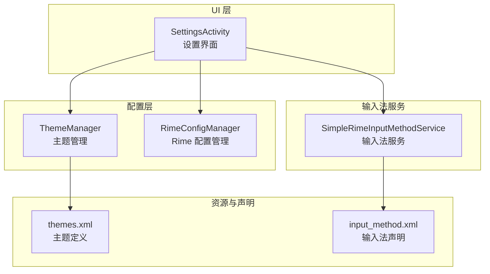
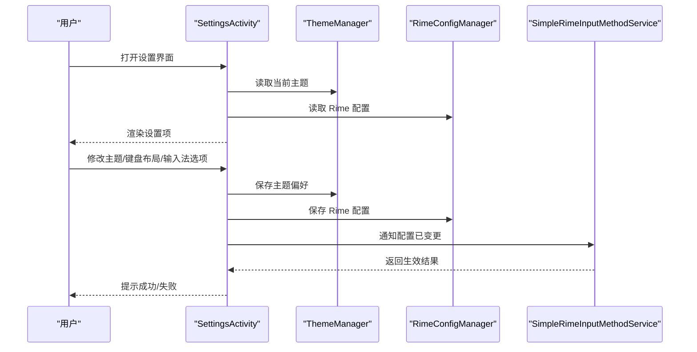
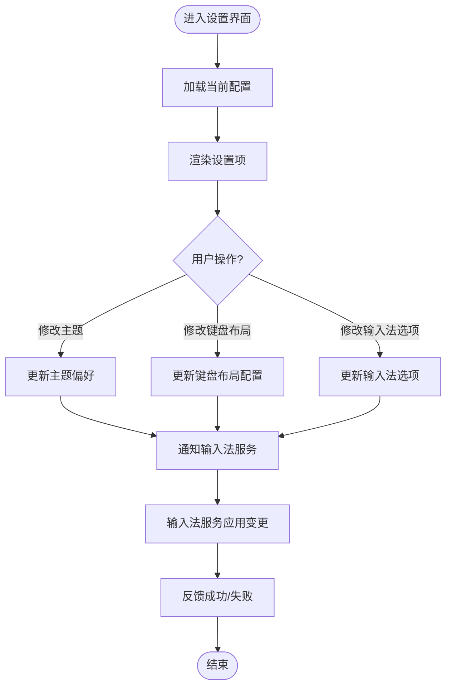
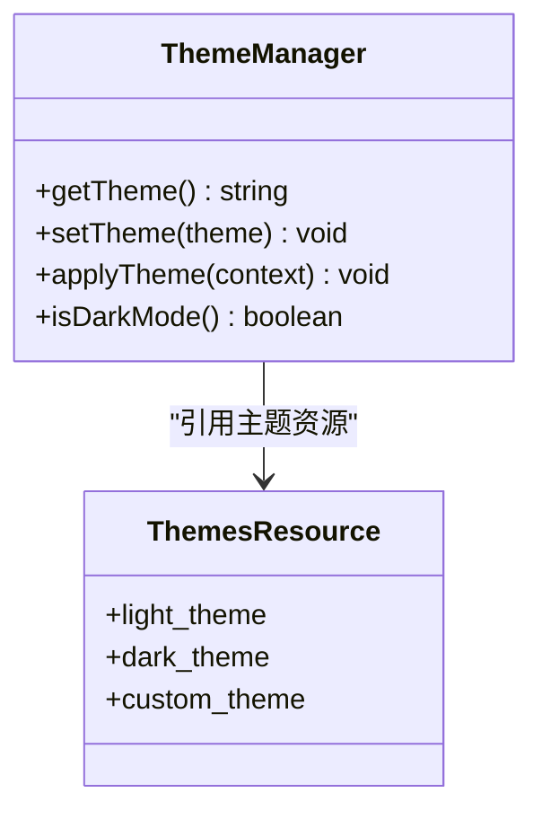
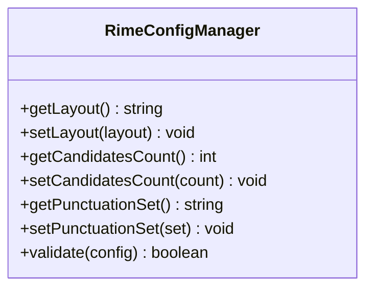
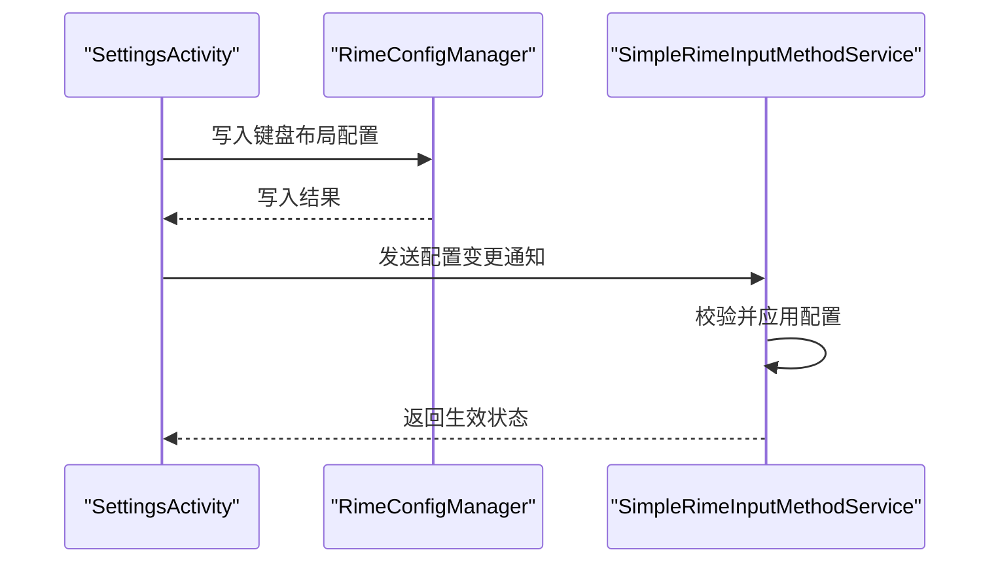
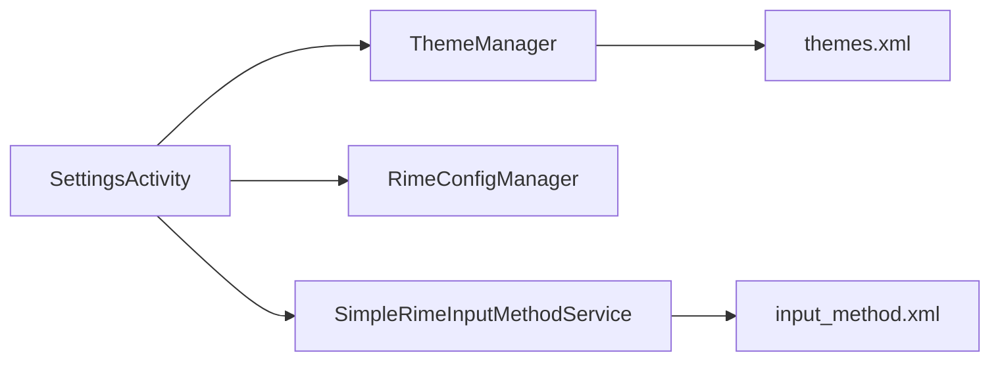

# 设置界面 (SettingsActivity)

<cite>
**本文引用的文件**   
- [app/src/main/java/com/ziyou/ime/ui/SettingsActivity.kt](file://app/src/main/java/com/ziyou/ime/ui/SettingsActivity.kt)
- [app/src/main/java/com/ziyou/ime/config/ThemeManager.kt](file://app/src/main/java/com/ziyou/ime/config/ThemeManager.kt)
- [app/src/main/java/com/ziyou/ime/config/RimeConfigManager.kt](file://app/src/main/java/com/ziyou/ime/config/RimeConfigManager.kt)
- [app/src/main/java/com/ziyou/ime/ime/SimpleRimeInputMethodService.kt](file://app/src/main/java/com/ziyou/ime/ime/SimpleRimeInputMethodService.kt)
- [app/src/main/res/values/themes.xml](file://app/src/main/res/values/themes.xml)
- [app/src/main/res/xml/input_method.xml](file://app/src/main/res/xml/input_method.xml)
</cite>

## 目录
1. [简介](#简介)
2. [项目结构](#项目结构)
3. [核心组件](#核心组件)
4. [架构总览](#架构总览)
5. [详细组件分析](#详细组件分析)
6. [依赖关系分析](#依赖关系分析)
7. [性能考虑](#性能考虑)
8. [故障排查指南](#故障排查指南)
9. [结论](#结论)
10. [附录](#附录)

## 简介
本文件围绕 SettingsActivity（设置界面）进行系统化文档说明，覆盖整体架构、用户交互流程、配置项展示与数据绑定机制、状态管理、主题设置、键盘布局配置、输入法选项等实现细节。同时给出用户偏好设置的存储与读取机制，以及设置变更的实时响应处理方案。

## 项目结构
SettingsActivity 位于应用 UI 层，负责呈现设置页面并协调配置模块与输入法服务之间的状态同步。关键文件组织如下：
- UI 入口：SettingsActivity.kt
- 主题管理：ThemeManager.kt
- Rime 配置管理：RimeConfigManager.kt
- 输入法服务：SimpleRimeInputMethodService.kt
- 主题资源：themes.xml
- 输入法声明：input_method.xml

图表来源
- [app/src/main/java/com/ziyou/ime/ui/SettingsActivity.kt](file://app/src/main/java/com/ziyou/ime/ui/SettingsActivity.kt)
- [app/src/main/java/com/ziyou/ime/config/ThemeManager.kt](file://app/src/main/java/com/ziyou/ime/config/ThemeManager.kt)
- [app/src/main/java/com/ziyou/ime/config/RimeConfigManager.kt](file://app/src/main/java/com/ziyou/ime/config/RimeConfigManager.kt)
- [app/src/main/java/com/ziyou/ime/ime/SimpleRimeInputMethodService.kt](file://app/src/main/java/com/ziyou/ime/ime/SimpleRimeInputMethodService.kt)
- [app/src/main/res/values/themes.xml](file://app/src/main/res/values/themes.xml)
- [app/src/main/res/xml/input_method.xml](file://app/src/main/res/xml/input_method.xml)

章节来源
- [app/src/main/java/com/ziyou/ime/ui/SettingsActivity.kt](file://app/src/main/java/com/ziyou/ime/ui/SettingsActivity.kt)
- [app/src/main/res/values/themes.xml](file://app/src/main/res/values/themes.xml)
- [app/src/main/res/xml/input_method.xml](file://app/src/main/res/xml/input_method.xml)

## 核心组件
- SettingsActivity
  - 职责：承载设置界面，聚合主题、键盘布局、输入法选项等配置项；响应用户操作并持久化偏好；通知输入法服务生效。
  - 关键点：使用 ViewModel/State 或 Preference 框架进行数据绑定与状态管理；在生命周期中加载/保存配置；通过广播或回调触发输入法服务更新。
- ThemeManager
  - 职责：统一管理与切换主题，读写主题偏好，应用主题到当前窗口与系统级别。
  - 关键点：支持多主题枚举值；提供即时切换与重启 Activity 的能力；与 themes.xml 资源联动。
- RimeConfigManager
  - 职责：封装对 Rime 引擎配置的读写，包括输入方案、候选词数量、标点符号集等。
  - 关键点：以键值形式访问配置；提供默认值与校验；在写入后触发输入法服务重载配置。
- SimpleRimeInputMethodService
  - 职责：输入法核心服务，接收来自设置界面的配置变更，动态调整键盘布局与行为。
  - 关键点：监听配置变化事件；重建键盘视图；保持用户输入上下文稳定。

章节来源
- [app/src/main/java/com/ziyou/ime/ui/SettingsActivity.kt](file://app/src/main/java/com/ziyou/ime/ui/SettingsActivity.kt)
- [app/src/main/java/com/ziyou/ime/config/ThemeManager.kt](file://app/src/main/java/com/ziyou/ime/config/ThemeManager.kt)
- [app/src/main/java/com/ziyou/ime/config/RimeConfigManager.kt](file://app/src/main/java/com/ziyou/ime/config/RimeConfigManager.kt)
- [app/src/main/java/com/ziyou/ime/ime/SimpleRimeInputMethodService.kt](file://app/src/main/java/com/ziyou/ime/ime/SimpleRimeInputMethodService.kt)

## 架构总览
设置界面采用“UI 层 + 配置层 + 输入法服务”的分层架构。UI 层负责展示与交互，配置层负责数据存取与校验，输入法服务负责运行时生效。主题与输入法配置通过集中式管理器暴露 API，保证跨组件一致性。

图表来源
- [app/src/main/java/com/ziyou/ime/ui/SettingsActivity.kt](file://app/src/main/java/com/ziyou/ime/ui/SettingsActivity.kt)
- [app/src/main/java/com/ziyou/ime/config/ThemeManager.kt](file://app/src/main/java/com/ziyou/ime/config/ThemeManager.kt)
- [app/src/main/java/com/ziyou/ime/config/RimeConfigManager.kt](file://app/src/main/java/com/ziyou/ime/config/RimeConfigManager.kt)
- [app/src/main/java/com/ziyou/ime/ime/SimpleRimeInputMethodService.kt](file://app/src/main/java/com/ziyou/ime/ime/SimpleRimeInputMethodService.kt)

## 详细组件分析

### SettingsActivity 分析与交互流程
- 展示方式
  - 使用列表/分组展示主题、键盘布局、输入法选项等配置项。
  - 每个配置项对应一个数据模型，包含标题、描述、默认值、可选值集合等。
- 数据绑定机制
  - 通过偏好存储（如 SharedPreferences）或集中式配置管理器进行双向绑定。
  - 初始化时从管理器读取当前值并填充 UI；用户修改后写回管理器并持久化。
- 状态管理
  - 使用单一数据源（Single Source of Truth），避免 UI 与后端状态不一致。
  - 在 onResume/onPause 等生命周期中确保数据同步。
- 用户交互流程
  - 点击配置项 -> 弹出选择器/开关 -> 更新本地状态 -> 调用配置管理器 -> 通知输入法服务 -> 刷新 UI 或提示结果。

图表来源
- [app/src/main/java/com/ziyou/ime/ui/SettingsActivity.kt](file://app/src/main/java/com/ziyou/ime/ui/SettingsActivity.kt)
- [app/src/main/java/com/ziyou/ime/config/ThemeManager.kt](file://app/src/main/java/com/ziyou/ime/config/ThemeManager.kt)
- [app/src/main/java/com/ziyou/ime/config/RimeConfigManager.kt](file://app/src/main/java/com/ziyou/ime/config/RimeConfigManager.kt)
- [app/src/main/java/com/ziyou/ime/ime/SimpleRimeInputMethodService.kt](file://app/src/main/java/com/ziyou/ime/ime/SimpleRimeInputMethodService.kt)

章节来源
- [app/src/main/java/com/ziyou/ime/ui/SettingsActivity.kt](file://app/src/main/java/com/ziyou/ime/ui/SettingsActivity.kt)

### 主题设置（ThemeManager）
- 功能要点
  - 提供主题枚举与切换方法。
  - 将主题偏好写入持久化存储，并在需要时重新应用主题。
  - 与 themes.xml 中的主题资源关联，确保样式一致。
- 数据流
  - SettingsActivity 调用 ThemeManager 获取/设置主题。
  - 主题变更后，必要时重启当前 Activity 以应用新主题。

图表来源
- [app/src/main/java/com/ziyou/ime/config/ThemeManager.kt](file://app/src/main/java/com/ziyou/ime/config/ThemeManager.kt)
- [app/src/main/res/values/themes.xml](file://app/src/main/res/values/themes.xml)

章节来源
- [app/src/main/java/com/ziyou/ime/config/ThemeManager.kt](file://app/src/main/java/com/ziyou/ime/config/ThemeManager.kt)
- [app/src/main/res/values/themes.xml](file://app/src/main/res/values/themes.xml)

### 键盘布局配置（RimeConfigManager）
- 功能要点
  - 管理键盘布局相关配置，如布局类型、候选词数量、标点符号集等。
  - 提供默认值与校验逻辑，防止非法配置导致输入法异常。
- 数据流
  - SettingsActivity 读取/写入 Rime 配置。
  - 配置变更后通知输入法服务重建键盘视图。

图表来源
- [app/src/main/java/com/ziyou/ime/config/RimeConfigManager.kt](file://app/src/main/java/com/ziyou/ime/config/RimeConfigManager.kt)

章节来源
- [app/src/main/java/com/ziyou/ime/config/RimeConfigManager.kt](file://app/src/main/java/com/ziyou/ime/config/RimeConfigManager.kt)

### 输入法选项（SimpleRimeInputMethodService）
- 功能要点
  - 作为输入法核心服务，接收来自设置界面的配置变更。
  - 根据配置动态重建键盘视图，保持用户输入上下文稳定。
  - 与 input_method.xml 声明联动，确保输入法能力正确注册。
- 数据流
  - 收到配置变更事件 -> 校验配置 -> 重建键盘视图 -> 返回生效结果。

图表来源
- [app/src/main/java/com/ziyou/ime/ime/SimpleRimeInputMethodService.kt](file://app/src/main/java/com/ziyou/ime/ime/SimpleRimeInputMethodService.kt)
- [app/src/main/res/xml/input_method.xml](file://app/src/main/res/xml/input_method.xml)

章节来源
- [app/src/main/java/com/ziyou/ime/ime/SimpleRimeInputMethodService.kt](file://app/src/main/java/com/ziyou/ime/ime/SimpleRimeInputMethodService.kt)
- [app/src/main/res/xml/input_method.xml](file://app/src/main/res/xml/input_method.xml)

### 用户偏好设置的存储与读取机制
- 存储位置
  - 主题偏好：ThemeManager 内部持久化（如 SharedPreferences）。
  - Rime 配置：RimeConfigManager 统一管理（可结合文件或内存缓存）。
- 读取时机
  - SettingsActivity 启动时加载所有配置项。
  - 输入法服务启动或配置变更时重新加载。
- 写入策略
  - 用户操作后立即写回，确保下次启动一致性。
  - 批量配置变更时采用事务性写入，减少 IO 次数。

章节来源
- [app/src/main/java/com/ziyou/ime/config/ThemeManager.kt](file://app/src/main/java/com/ziyou/ime/config/ThemeManager.kt)
- [app/src/main/java/com/ziyou/ime/config/RimeConfigManager.kt](file://app/src/main/java/com/ziyou/ime/config/RimeConfigManager.kt)

### 设置变更的实时响应处理
- 事件通道
  - 通过回调、广播或接口方法通知输入法服务。
- 响应流程
  - 配置写入成功后，立即触发输入法服务重建视图。
  - 若重建失败，回滚配置并提示用户。
- 用户体验
  - 提供加载指示与错误提示。
  - 支持撤销最近一次变更（可选）。

章节来源
- [app/src/main/java/com/ziyou/ime/ui/SettingsActivity.kt](file://app/src/main/java/com/ziyou/ime/ui/SettingsActivity.kt)
- [app/src/main/java/com/ziyou/ime/ime/SimpleRimeInputMethodService.kt](file://app/src/main/java/com/ziyou/ime/ime/SimpleRimeInputMethodService.kt)

## 依赖关系分析
- 组件耦合
  - SettingsActivity 依赖 ThemeManager 与 RimeConfigManager，低耦合高内聚。
  - 输入法服务仅依赖配置管理器提供的接口，避免直接访问 UI。
- 外部依赖
  - Android 平台资源（themes.xml、input_method.xml）。
  - 可能的第三方库（如偏好存储、日志等）。

图表来源
- [app/src/main/java/com/ziyou/ime/ui/SettingsActivity.kt](file://app/src/main/java/com/ziyou/ime/ui/SettingsActivity.kt)
- [app/src/main/java/com/ziyou/ime/config/ThemeManager.kt](file://app/src/main/java/com/ziyou/ime/config/ThemeManager.kt)
- [app/src/main/java/com/ziyou/ime/config/RimeConfigManager.kt](file://app/src/main/java/com/ziyou/ime/config/RimeConfigManager.kt)
- [app/src/main/java/com/ziyou/ime/ime/SimpleRimeInputMethodService.kt](file://app/src/main/java/com/ziyou/ime/ime/SimpleRimeInputMethodService.kt)
- [app/src/main/res/values/themes.xml](file://app/src/main/res/values/themes.xml)
- [app/src/main/res/xml/input_method.xml](file://app/src/main/res/xml/input_method.xml)

章节来源
- [app/src/main/java/com/ziyou/ime/ui/SettingsActivity.kt](file://app/src/main/java/com/ziyou/ime/ui/SettingsActivity.kt)
- [app/src/main/java/com/ziyou/ime/config/ThemeManager.kt](file://app/src/main/java/com/ziyou/ime/config/ThemeManager.kt)
- [app/src/main/java/com/ziyou/ime/config/RimeConfigManager.kt](file://app/src/main/java/com/ziyou/ime/config/RimeConfigManager.kt)
- [app/src/main/java/com/ziyou/ime/ime/SimpleRimeInputMethodService.kt](file://app/src/main/java/com/ziyou/ime/ime/SimpleRimeInputMethodService.kt)
- [app/src/main/res/values/themes.xml](file://app/src/main/res/values/themes.xml)
- [app/src/main/res/xml/input_method.xml](file://app/src/main/res/xml/input_method.xml)

## 性能考虑
- 配置加载
  - 使用懒加载与缓存，避免重复 IO。
  - 大对象（如主题资源）按需加载。
- 配置写入
  - 合并多次写入为一次事务，降低磁盘压力。
  - 异步写入，避免阻塞 UI 线程。
- 输入法重建
  - 增量重建视图，减少全量刷新开销。
  - 在后台线程执行耗时操作，主线程仅做轻量更新。

[本节为通用指导，不直接分析具体文件]

## 故障排查指南
- 常见问题
  - 主题未生效：检查 ThemeManager 是否正确应用主题，是否重启了 Activity。
  - 键盘布局异常：确认 RimeConfigManager 的配置校验逻辑，查看输入法服务重建过程。
  - 配置不同步：检查 SettingsActivity 与输入法服务之间的事件通道是否正常。
- 调试建议
  - 增加关键路径日志，记录配置读写与通知事件。
  - 使用断点验证数据流向与状态变更。
  - 模拟异常场景（如权限不足、资源缺失）验证健壮性。

章节来源
- [app/src/main/java/com/ziyou/ime/config/ThemeManager.kt](file://app/src/main/java/com/ziyou/ime/config/ThemeManager.kt)
- [app/src/main/java/com/ziyou/ime/config/RimeConfigManager.kt](file://app/src/main/java/com/ziyou/ime/config/RimeConfigManager.kt)
- [app/src/main/java/com/ziyou/ime/ime/SimpleRimeInputMethodService.kt](file://app/src/main/java/com/ziyou/ime/ime/SimpleRimeInputMethodService.kt)

## 结论
SettingsActivity 作为设置界面的核心，通过清晰的架构分层与集中的配置管理，实现了主题、键盘布局与输入法选项的统一管理。配合输入法服务的实时响应机制，确保了用户偏好的持久化与即时生效。建议在后续迭代中进一步优化性能与错误处理，提升用户体验。

[本节为总结，不直接分析具体文件]

## 附录
- 术语表
  - 主题：界面外观风格，如浅色/深色。
  - 键盘布局：按键排列与功能集合。
  - 输入法选项：影响输入行为的配置项。
- 参考资源
  - themes.xml：主题定义文件。
  - input_method.xml：输入法服务声明文件。

[本节为补充信息，不直接分析具体文件]