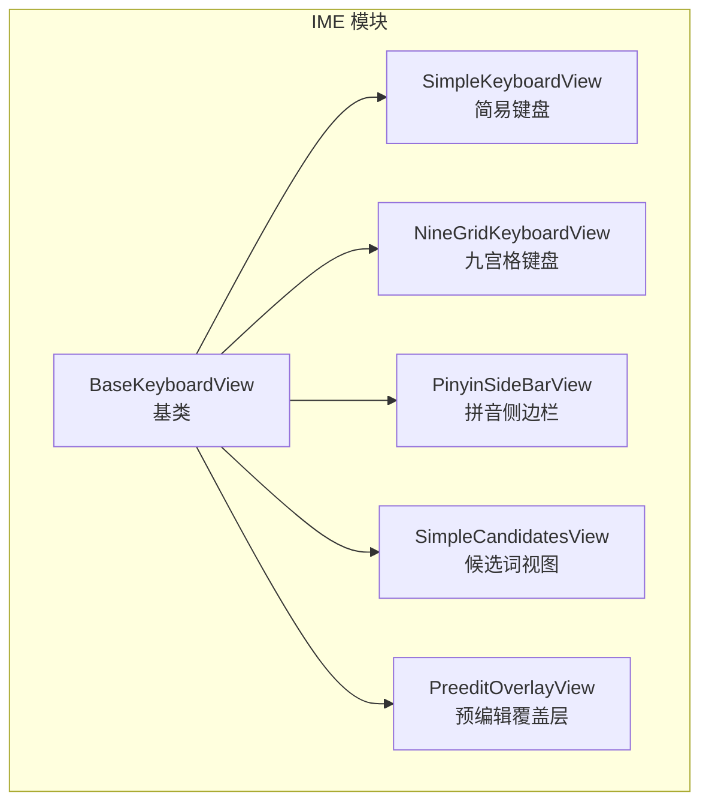
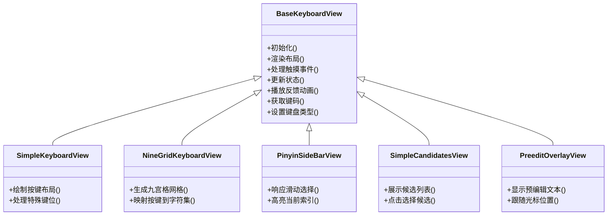
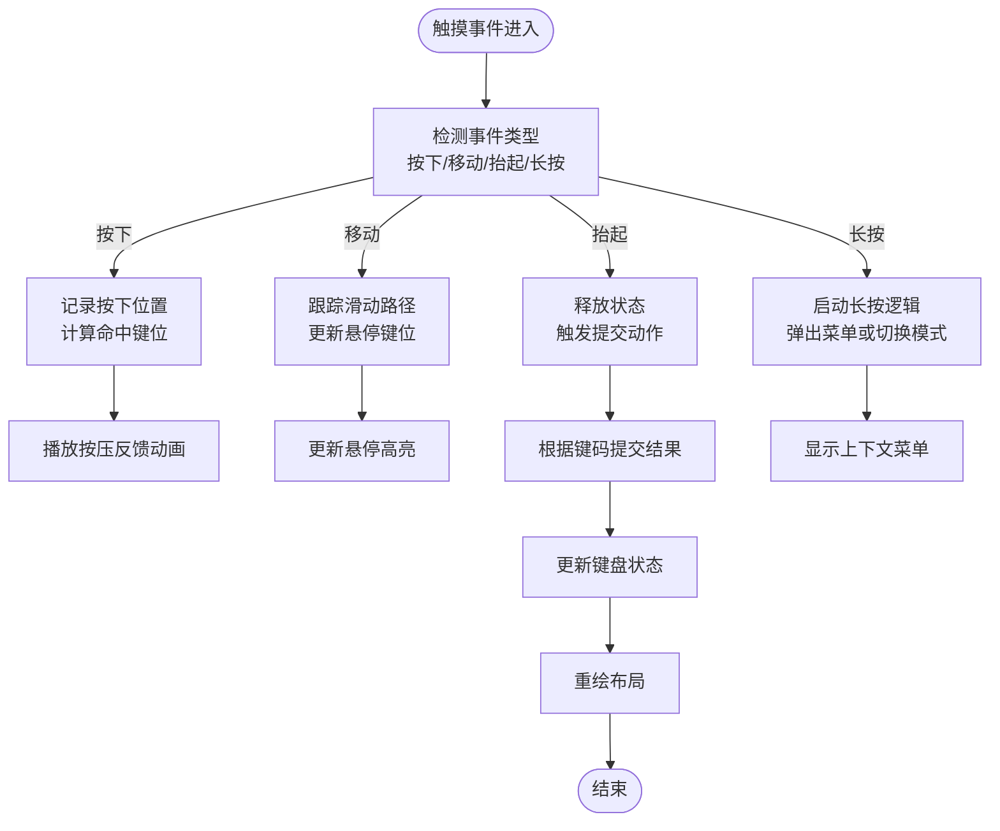
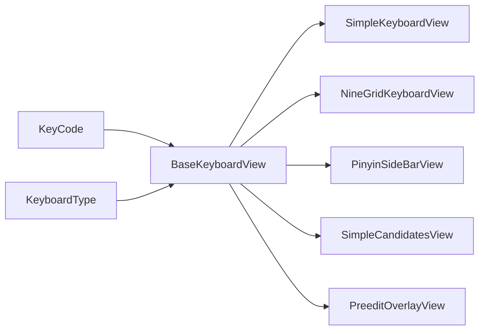

# 键盘基类 (BaseKeyboardView)

<cite>
**本文档引用的文件**   
- [BaseKeyboardView.kt](file://app/src/main/java/com/ziyou/ime/ime/BaseKeyboardView.kt)
- [NineGridKeyboardView.kt](file://app/src/main/java/com/ziyou/ime/ime/NineGridKeyboardView.kt)
- [SimpleKeyboardView.kt](file://app/src/main/java/com/ziyou/ime/ime/SimpleKeyboardView.kt)
- [KeyCode.kt](file://app/src/main/java/com/ziyou/ime/ime/KeyCode.kt)
- [KeyboardType.kt](file://app/src/main/java/com/ziyou/ime/ime/KeyboardType.kt)
- [PinyinSideBarView.kt](file://app/src/main/java/com/ziyou/ime/ime/PinyinSideBarView.kt)
- [PreeditOverlayView.kt](file://app/src/main/java/com/ziyou/ime/ime/PreeditOverlayView.kt)
- [SimpleCandidatesView.kt](file://app/src/main/java/com/ziyou/ime/ime/SimpleCandidatesView.kt)
</cite>

## 目录
1. [简介](#简介)
2. [项目结构](#项目结构)
3. [核心组件](#核心组件)
4. [架构总览](#架构总览)
5. [详细组件分析](#详细组件分析)
6. [依赖关系分析](#依赖关系分析)
7. [性能考量](#性能考量)
8. [故障排查指南](#故障排查指南)
9. [结论](#结论)
10. [附录](#附录)

## 简介
本文件围绕 BaseKeyboardView 基类，系统化阐述其作为输入法键盘视图的基础架构与抽象设计。内容涵盖：
- 键盘布局渲染机制
- 触摸事件处理流程
- 按键反馈系统
- 键盘状态管理、动画效果与性能优化策略
- 子类继承关系与扩展点设计
- 自定义键盘视图开发指南

目标是帮助开发者快速理解并基于 BaseKeyboardView 构建高效、可维护的键盘视图。

## 项目结构
本项目采用按功能模块组织的方式，键盘相关代码集中在 ime 包中。BaseKeyboardView 作为所有键盘视图的基类，提供统一的渲染、事件与状态管理能力；具体键盘实现（如九宫格、简易键盘等）通过继承该基类进行扩展。

图表来源
- [BaseKeyboardView.kt](file://app/src/main/java/com/ziyou/ime/ime/BaseKeyboardView.kt)
- [SimpleKeyboardView.kt](file://app/src/main/java/com/ziyou/ime/ime/SimpleKeyboardView.kt)
- [NineGridKeyboardView.kt](file://app/src/main/java/com/ziyou/ime/ime/NineGridKeyboardView.kt)
- [PinyinSideBarView.kt](file://app/src/main/java/com/ziyou/ime/ime/PinyinSideBarView.kt)
- [SimpleCandidatesView.kt](file://app/src/main/java/com/ziyou/ime/ime/SimpleCandidatesView.kt)
- [PreeditOverlayView.kt](file://app/src/main/java/com/ziyou/ime/ime/PreeditOverlayView.kt)

章节来源
- [BaseKeyboardView.kt](file://app/src/main/java/com/ziyou/ime/ime/BaseKeyboardView.kt)
- [SimpleKeyboardView.kt](file://app/src/main/java/com/ziyou/ime/ime/SimpleKeyboardView.kt)
- [NineGridKeyboardView.kt](file://app/src/main/java/com/ziyou/ime/ime/NineGridKeyboardView.kt)
- [PinyinSideBarView.kt](file://app/src/main/java/com/ziyou/ime/ime/PinyinSideBarView.kt)
- [SimpleCandidatesView.kt](file://app/src/main/java/com/ziyou/ime/ime/SimpleCandidatesView.kt)
- [PreeditOverlayView.kt](file://app/src/main/java/com/ziyou/ime/ime/PreeditOverlayView.kt)

## 核心组件
- BaseKeyboardView：键盘视图基类，负责通用渲染、事件分发、状态管理与动画框架。
- SimpleKeyboardView：基于基类的简易键盘实现，适合字母或符号键盘。
- NineGridKeyboardView：九宫格键盘实现，适配数字与常用符号布局。
- PinyinSideBarView：拼音输入时的侧边栏视图，用于快速导航或选择。
- SimpleCandidatesView：候选词展示视图，通常位于键盘上方。
- PreeditOverlayView：预编辑文本覆盖层，显示当前输入中的临时文本。

这些组件共同构成输入法的 UI 层，其中 BaseKeyboardView 提供统一的能力抽象，其他视图在其基础上扩展特定行为。

章节来源
- [BaseKeyboardView.kt](file://app/src/main/java/com/ziyou/ime/ime/BaseKeyboardView.kt)
- [SimpleKeyboardView.kt](file://app/src/main/java/com/ziyou/ime/ime/SimpleKeyboardView.kt)
- [NineGridKeyboardView.kt](file://app/src/main/java/com/ziyou/ime/ime/NineGridKeyboardView.kt)
- [PinyinSideBarView.kt](file://app/src/main/java/com/ziyou/ime/ime/PinyinSideBarView.kt)
- [SimpleCandidatesView.kt](file://app/src/main/java/com/ziyou/ime/ime/SimpleCandidatesView.kt)
- [PreeditOverlayView.kt](file://app/src/main/java/com/ziyou/ime/ime/PreeditOverlayView.kt)

## 架构总览
下图展示了 BaseKeyboardView 与其子类的继承关系以及关键交互点。基类定义抽象接口与通用逻辑，子类按需重写以实现具体键盘布局与行为。

图表来源
- [BaseKeyboardView.kt](file://app/src/main/java/com/ziyou/ime/ime/BaseKeyboardView.kt)
- [SimpleKeyboardView.kt](file://app/src/main/java/com/ziyou/ime/ime/SimpleKeyboardView.kt)
- [NineGridKeyboardView.kt](file://app/src/main/java/com/ziyou/ime/ime/NineGridKeyboardView.kt)
- [PinyinSideBarView.kt](file://app/src/main/java/com/ziyou/ime/ime/PinyinSideBarView.kt)
- [SimpleCandidatesView.kt](file://app/src/main/java/com/ziyou/ime/ime/SimpleCandidatesView.kt)
- [PreeditOverlayView.kt](file://app/src/main/java/com/ziyou/ime/ime/PreeditOverlayView.kt)

## 详细组件分析

### BaseKeyboardView 基类分析
BaseKeyboardView 是键盘视图的核心抽象，职责包括：
- 键盘布局渲染：根据键盘类型与配置动态绘制按键区域与布局。
- 触摸事件处理：捕获按下、移动、抬起等事件，识别长按、滑动等手势。
- 按键反馈系统：提供视觉与触觉反馈（如按压态、涟漪动画）。
- 键盘状态管理：维护当前模式（如字母/符号）、焦点键、选中项等。
- 动画框架：封装常用动画（淡入淡出、缩放、位移），供子类复用。
- 扩展点：定义抽象方法供子类实现具体布局与行为。

图表来源
- [BaseKeyboardView.kt](file://app/src/main/java/com/ziyou/ime/ime/BaseKeyboardView.kt)

章节来源
- [BaseKeyboardView.kt](file://app/src/main/java/com/ziyou/ime/ime/BaseKeyboardView.kt)

### SimpleKeyboardView 简易键盘
- 特点：线性或网格布局，适用于标准字母键盘或符号键盘。
- 扩展点：重写布局绘制方法以定制按键排列与样式。
- 事件处理：支持基本按键点击与长按行为。

章节来源
- [SimpleKeyboardView.kt](file://app/src/main/java/com/ziyou/ime/ime/SimpleKeyboardView.kt)

### NineGridKeyboardView 九宫格键盘
- 特点：将按键映射到 3x3 网格，常用于数字与常用符号输入。
- 扩展点：自定义网格尺寸、按键映射表与长按行为。
- 性能优化：使用缓存与批量绘制减少重绘开销。

章节来源
- [NineGridKeyboardView.kt](file://app/src/main/java/com/ziyou/ime/ime/NineGridKeyboardView.kt)

### PinyinSideBarView 拼音侧边栏
- 特点：垂直滚动条式导航，快速定位拼音首字母或候选。
- 扩展点：自定义滚动算法与高亮逻辑。
- 事件处理：支持滑动、点击与边界回弹。

章节来源
- [PinyinSideBarView.kt](file://app/src/main/java/com/ziyou/ime/ime/PinyinSideBarView.kt)

### SimpleCandidatesView 候选词视图
- 特点：横向或纵向展示候选词，支持分页与滚动。
- 扩展点：自定义候选项布局与选择行为。
- 交互：点击选择、滑动翻页、长按更多操作。

章节来源
- [SimpleCandidatesView.kt](file://app/src/main/java/com/ziyou/ime/ime/SimpleCandidatesView.kt)

### PreeditOverlayView 预编辑覆盖层
- 特点：在键盘上方显示当前输入的临时文本，随光标移动。
- 扩展点：自定义文本样式、对齐方式与动画过渡。
- 同步：与输入引擎保持预编辑状态一致。

章节来源
- [PreeditOverlayView.kt](file://app/src/main/java/com/ziyou/ime/ime/PreeditOverlayView.kt)

## 依赖关系分析
键盘视图之间的依赖主要体现在继承与协作：
- 所有键盘视图均继承自 BaseKeyboardView，复用其渲染、事件与状态管理能力。
- 候选词视图与预编辑层通常与键盘视图协同工作，由上层控制器协调数据流。
- KeyCode 与 KeyboardType 为键盘行为提供基础枚举与常量支持。

图表来源
- [BaseKeyboardView.kt](file://app/src/main/java/com/ziyou/ime/ime/BaseKeyboardView.kt)
- [KeyCode.kt](file://app/src/main/java/com/ziyou/ime/ime/KeyCode.kt)
- [KeyboardType.kt](file://app/src/main/java/com/ziyou/ime/ime/KeyboardType.kt)

章节来源
- [BaseKeyboardView.kt](file://app/src/main/java/com/ziyou/ime/ime/BaseKeyboardView.kt)
- [KeyCode.kt](file://app/src/main/java/com/ziyou/ime/ime/KeyCode.kt)
- [KeyboardType.kt](file://app/src/main/java/com/ziyou/ime/ime/KeyboardType.kt)

## 性能考量
- 渲染优化：避免频繁重绘，使用脏矩形与分层绘制；对静态背景使用离屏缓存。
- 事件处理：合并高频事件，减少主线程阻塞；使用手势识别器简化复杂交互。
- 内存管理：及时释放不再使用的资源，避免内存泄漏；合理使用对象池。
- 动画性能：优先使用属性动画与硬件加速；避免在动画回调中进行重型计算。
- 布局复杂度：扁平化层级，减少嵌套；对大列表使用虚拟滚动或分页加载。

[本节为通用指导，不直接分析具体文件]

## 故障排查指南
常见问题与解决思路：
- 触摸事件未响应：检查事件分发链是否被拦截；确认命中区域计算是否正确。
- 布局错位：验证测量与布局参数；确保在不同屏幕密度下正确适配。
- 动画卡顿：检查动画帧率与主线程任务；考虑降级动画效果。
- 状态不同步：核对状态更新时机；确保 UI 与数据源一致。
- 内存泄漏：使用工具检测引用链；避免持有 Activity/Context 的强引用。

章节来源
- [BaseKeyboardView.kt](file://app/src/main/java/com/ziyou/ime/ime/BaseKeyboardView.kt)

## 结论
BaseKeyboardView 为输入法键盘提供了稳定、可扩展的基础架构。通过清晰的职责划分与抽象设计，开发者可以快速构建各类键盘视图，并在保持性能与用户体验的前提下进行个性化定制。建议遵循本文档的设计原则与最佳实践，确保键盘视图的可维护性与可测试性。

[本节为总结，不直接分析具体文件]

## 附录
- 自定义键盘视图开发步骤：
  1. 继承 BaseKeyboardView 并重写必要方法。
  2. 实现布局绘制逻辑，定义按键结构与样式。
  3. 处理触摸事件，实现按键反馈与提交逻辑。
  4. 集成状态管理与动画效果，确保流畅体验。
  5. 编写单元测试与 UI 测试，验证行为正确性。

[本节为补充信息，不直接分析具体文件]