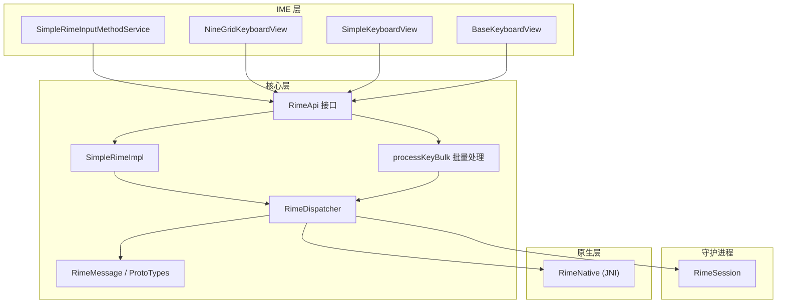
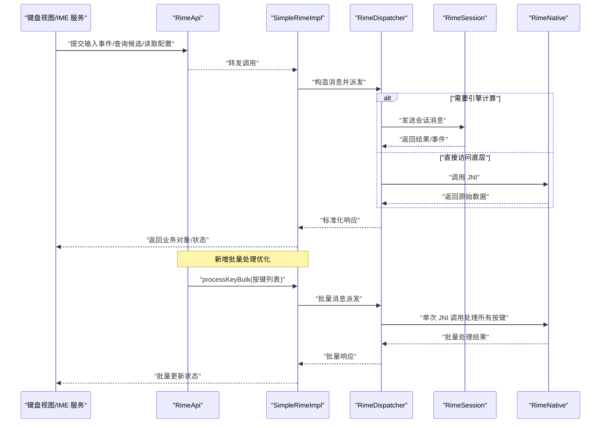
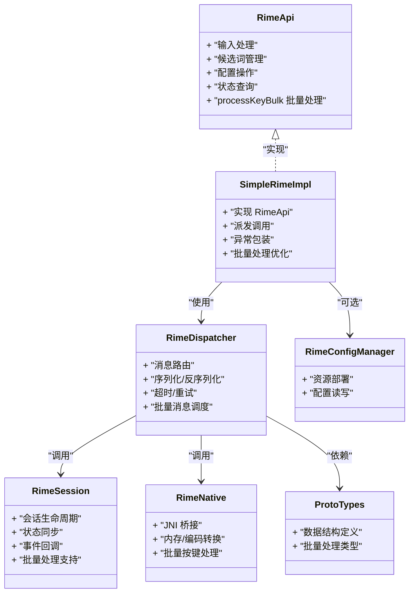

# Rime API 接口设计

<cite>
**本文引用的文件**   
- [RimeApi.kt](file://app/src/main/java/com/ziyou/ime/core/RimeApi.kt)
- [SimpleRimeImpl.kt](file://app/src/main/java/com/ziyou/ime/core/SimpleRimeImpl.kt)
- [RimeDispatcher.kt](file://app/src/main/java/com/ziyou/ime/core/RimeDispatcher.kt)
- [RimeMessage.kt](file://app/src/main/java/com/ziyou/ime/core/RimeMessage.kt)
- [RimeNative.kt](file://app/src/main/java/com/ziyou/ime/core/RimeNative.kt)
- [ProtoTypes.kt](file://app/src/main/java/com/ziyou/ime/core/ProtoTypes.kt)
- [RimeSession.kt](file://app/src/main/java/com/ziyou/ime/daemon/RimeSession.kt)
- [RimeConfigManager.kt](file://app/src/main/java/com/ziyou/ime/config/RimeConfigManager.kt)
- [SimpleRimeInputMethodService.kt](file://app/src/main/java/com/ziyou/ime/ime/SimpleRimeInputMethodService.kt)
- [NineGridKeyboardView.kt](file://app/src/main/java/com/ziyou/ime/ime/NineGridKeyboardView.kt)
- [SimpleKeyboardView.kt](file://app/src/main/java/com/ziyou/ime/ime/SimpleKeyboardView.kt)
- [BaseKeyboardView.kt](file://app/src/main/java/com/ziyou/ime/ime/BaseKeyboardView.kt)
</cite>

## 更新摘要
**所做更改**   
- 新增 processKeyBulk 批量处理接口，优化性能并减少 JNI 边界穿越开销
- 更新输入处理章节，详细说明批量按键处理的实现原理和使用场景
- 增强性能考虑部分，突出批量操作的优势和最佳实践
- 更新架构图和序列图，反映新的批量处理流程

## 目录
1. [简介](#简介)
2. [项目结构](#项目结构)
3. [核心组件](#核心组件)
4. [架构总览](#架构总览)
5. [详细组件分析](#详细组件分析)
6. [依赖分析](#依赖分析)
7. [性能考虑](#性能考虑)
8. [故障排查指南](#故障排查指南)
9. [结论](#结论)
10. [附录](#附录)

## 简介
本文件围绕 RimeApi 接口进行系统化文档化，聚焦其设计原则与抽象层次，覆盖输入处理、候选词管理、配置操作等核心方法。文档同时给出参数与返回语义、使用场景、最佳实践、扩展指南以及错误处理策略，并展示如何在不同输入法类型中复用该接口。**最新更新**：新增了 processKeyBulk 批量处理接口，通过批量按键操作显著减少 JNI 边界穿越开销，提升整体输入性能。

## 项目结构
本项目采用分层与职责分离的设计：
- 核心接口与实现位于 core 包，定义统一的 RimeApi 抽象与轻量实现 SimpleRimeImpl。
- 消息与协议通过 RimeMessage 与 ProtoTypes 描述跨进程通信契约。
- 调度器 RimeDispatcher 负责将上层调用派发到底层会话或 Native 层。
- 守护进程 RimeSession 封装与 Rime 引擎的长连接与会话状态。
- IME 服务与键盘视图（SimpleRimeInputMethodService、NineGridKeyboardView、SimpleKeyboardView）作为上层入口，统一通过 RimeApi 完成输入与候选交互。
- 配置由 RimeConfigManager 统一管理，提供 schema、用户数据与主题等资源部署与读取能力。

图表来源
- [SimpleRimeInputMethodService.kt](file://app/src/main/java/com/ziyou/ime/ime/SimpleRimeInputMethodService.kt)
- [NineGridKeyboardView.kt](file://app/src/main/java/com/ziyou/ime/ime/NineGridKeyboardView.kt)
- [SimpleKeyboardView.kt](file://app/src/main/java/com/ziyou/ime/ime/SimpleKeyboardView.kt)
- [BaseKeyboardView.kt](file://app/src/main/java/com/ziyou/ime/ime/BaseKeyboardView.kt)
- [RimeApi.kt](file://app/src/main/java/com/ziyou/ime/core/RimeApi.kt)
- [SimpleRimeImpl.kt](file://app/src/main/java/com/ziyou/ime/core/SimpleRimeImpl.kt)
- [RimeDispatcher.kt](file://app/src/main/java/com/ziyou/ime/core/RimeDispatcher.kt)
- [RimeMessage.kt](file://app/src/main/java/com/ziyou/ime/core/RimeMessage.kt)
- [ProtoTypes.kt](file://app/src/main/java/com/ziyou/ime/core/ProtoTypes.kt)
- [RimeSession.kt](file://app/src/main/java/com/ziyou/ime/daemon/RimeSession.kt)
- [RimeNative.kt](file://app/src/main/java/com/ziyou/ime/core/RimeNative.kt)

章节来源
- [RimeApi.kt](file://app/src/main/java/com/ziyou/ime/core/RimeApi.kt)
- [SimpleRimeImpl.kt](file://app/src/main/java/com/ziyou/ime/core/SimpleRimeImpl.kt)
- [RimeDispatcher.kt](file://app/src/main/java/com/ziyou/ime/core/RimeDispatcher.kt)
- [RimeMessage.kt](file://app/src/main/java/com/ziyou/ime/core/RimeMessage.kt)
- [ProtoTypes.kt](file://app/src/main/java/com/ziyou/ime/core/ProtoTypes.kt)
- [RimeSession.kt](file://app/src/main/java/com/ziyou/ime/daemon/RimeSession.kt)
- [RimeNative.kt](file://app/src/main/java/com/ziyou/ime/core/RimeNative.kt)
- [SimpleRimeInputMethodService.kt](file://app/src/main/java/com/ziyou/ime/ime/SimpleRimeInputMethodService.kt)
- [NineGridKeyboardView.kt](file://app/src/main/java/com/ziyou/ime/ime/NineGridKeyboardView.kt)
- [SimpleKeyboardView.kt](file://app/src/main/java/com/ziyou/ime/ime/SimpleKeyboardView.kt)
- [BaseKeyboardView.kt](file://app/src/main/java/com/ziyou/ime/ime/BaseKeyboardView.kt)

## 核心组件
- RimeApi：定义输入法核心能力的统一抽象，包括输入事件处理、候选词获取与选择、上下文状态查询、配置读写等。**新增**：processKeyBulk 批量处理接口，支持一次性处理多个按键操作。
- SimpleRimeImpl：RimeApi 的轻量实现，负责将调用委派给 RimeDispatcher，并处理结果转换与异常包装。
- RimeDispatcher：统一调度器，根据消息类型路由到守护进程会话或本地 Native 调用。
- RimeMessage/ProtoTypes：定义跨进程消息结构与数据类型，保证前后端一致。
- RimeSession：封装与 Rime 引擎的会话生命周期、状态同步与事件回调。
- RimeNative：JNI 桥接，直接调用底层 C++ 库。
- RimeConfigManager：集中管理 Rime 配置资源（schema、字典、主题等），提供部署与读取能力。

章节来源
- [RimeApi.kt](file://app/src/main/java/com/ziyou/ime/core/RimeApi.kt)
- [SimpleRimeImpl.kt](file://app/src/main/java/com/ziyou/ime/core/SimpleRimeImpl.kt)
- [RimeDispatcher.kt](file://app/src/main/java/com/ziyou/ime/core/RimeDispatcher.kt)
- [RimeMessage.kt](file://app/src/main/java/com/ziyou/ime/core/RimeMessage.kt)
- [ProtoTypes.kt](file://app/src/main/java/com/ziyou/ime/core/ProtoTypes.kt)
- [RimeSession.kt](file://app/src/main/java/com/ziyou/ime/daemon/RimeSession.kt)
- [RimeNative.kt](file://app/src/main/java/com/ziyou/ime/core/RimeNative.kt)
- [RimeConfigManager.kt](file://app/src/main/java/com/ziyou/ime/config/RimeConfigManager.kt)

## 架构总览
RimeApi 处于"应用层"与"引擎层"之间的稳定边界。上层（IME 服务与键盘视图）只依赖 RimeApi 接口；具体实现通过 RimeDispatcher 将请求分发至 RimeSession（进程内/外会话）或 RimeNative（JNI）。配置由 RimeConfigManager 独立管理，避免侵入核心输入流程。**新增**：批量处理机制通过 processKeyBulk 接口减少 JNI 调用次数，提升整体性能。

图表来源
- [RimeApi.kt](file://app/src/main/java/com/ziyou/ime/core/RimeApi.kt)
- [SimpleRimeImpl.kt](file://app/src/main/java/com/ziyou/ime/core/SimpleRimeImpl.kt)
- [RimeDispatcher.kt](file://app/src/main/java/com/ziyou/ime/core/RimeDispatcher.kt)
- [RimeSession.kt](file://app/src/main/java/com/ziyou/ime/daemon/RimeSession.kt)
- [RimeNative.kt](file://app/src/main/java/com/ziyou/ime/core/RimeNative.kt)

## 详细组件分析

### RimeApi 接口设计
- 设计原则
  - 单一职责：仅暴露输入法所需的最小能力集（输入、候选、上下文、配置）。
  - 面向接口编程：上层不感知实现细节，便于替换与测试。
  - 幂等与可恢复：对重复输入与失败重试具备稳健性。
  - 明确的数据契约：通过 ProtoTypes 规范数据结构，降低耦合。
  - **新增**：批量处理优化：通过 processKeyBulk 接口减少 JNI 边界穿越开销。
- 抽象层次
  - 输入处理：接收按键/组合键，触发分词与翻译管线。**新增**：支持批量按键处理，提升高频输入场景性能。
  - 候选词管理：获取候选列表、翻页、选中、上屏。
  - 配置操作：读取/写入 schema、用户数据、主题等。
  - 状态查询：获取当前编辑上下文、预编辑串、已提交文本等。
- 典型方法类别（以路径引用代替代码内容）
  - 输入处理：[RimeApi.kt](file://app/src/main/java/com/ziyou/ime/core/RimeApi.kt)
  - 候选词管理：[RimeApi.kt](file://app/src/main/java/com/ziyou/ime/core/RimeApi.kt)
  - 配置操作：[RimeApi.kt](file://app/src/main/java/com/ziyou/ime/core/RimeApi.kt)
  - 状态查询：[RimeApi.kt](file://app/src/main/java/com/ziyou/ime/core/RimeApi.kt)
  - **批量处理**：[RimeApi.kt](file://app/src/main/java/com/ziyou/ime/core/RimeApi.kt)

章节来源
- [RimeApi.kt](file://app/src/main/java/com/ziyou/ime/core/RimeApi.kt)

### SimpleRimeImpl 实现
- 职责
  - 将 RimeApi 调用转换为 RimeDispatcher 可识别的消息。
  - 对返回值进行类型转换与空值保护。
  - 捕获并包装异常，向上层抛出统一异常类型。
- 关键行为
  - 输入事件：校验参数有效性，构建消息，等待异步结果。
  - 候选词：分页、排序、去重策略在实现层完成。
  - 配置：调用配置管理器或会话接口，确保线程安全。
  - **新增**：批量处理：聚合多个按键操作，减少 JNI 调用次数。
- 错误处理
  - 网络/进程通信失败时回退为本地缓存或提示重试。
  - 非法参数快速失败，减少无效调用。
  - **新增**：批量处理中的部分失败处理，确保事务一致性。

章节来源
- [SimpleRimeImpl.kt](file://app/src/main/java/com/ziyou/ime/core/SimpleRimeImpl.kt)

### RimeDispatcher 调度器
- 职责
  - 统一消息路由：区分会话消息与本地调用。
  - 序列化/反序列化：基于 ProtoTypes 编解码。
  - 超时与重试：对远端调用设置超时与重试策略。
- 关键点
  - 线程模型：IO 密集型任务在后台线程执行，回调在主线程更新 UI。
  - 幂等控制：对重复请求合并或丢弃。
  - **新增**：批量消息处理：支持批量按键操作的统一调度。

章节来源
- [RimeDispatcher.kt](file://app/src/main/java/com/ziyou/ime/core/RimeDispatcher.kt)

### RimeMessage 与 ProtoTypes 协议
- RimeMessage
  - 定义请求/响应消息体，包含命令类型、参数、时间戳与追踪 ID。
  - **新增**：批量消息类型，支持多个按键操作的打包传输。
- ProtoTypes
  - 定义候选项、上下文、配置项等数据结构，确保跨进程一致性。
  - **新增**：批量处理相关的数据结构定义。

章节来源
- [RimeMessage.kt](file://app/src/main/java/com/ziyou/ime/core/RimeMessage.kt)
- [ProtoTypes.kt](file://app/src/main/java/com/ziyou/ime/core/ProtoTypes.kt)

### RimeSession 守护进程会话
- 职责
  - 维护与 Rime 引擎的长连接，处理生命周期（启动、销毁）。
  - 管理上下文状态，同步候选与预编辑串。
  - 事件回调：将引擎事件推送至上层。
- 关键点
  - 心跳保活与断线重连。
  - 并发安全：多键盘视图共享会话时的锁与队列。
  - **新增**：批量处理优化，支持高效的批量按键操作。

章节来源
- [RimeSession.kt](file://app/src/main/java/com/ziyou/ime/daemon/RimeSession.kt)

### RimeNative JNI 桥接
- 职责
  - 将 Java/Kotlin 调用映射到 C++ 函数。
  - 处理内存与字符串编码转换。
- 关键点
  - 避免频繁 JNI 调用，批量处理提升性能。
  - 错误码映射为统一异常。
  - **新增**：批量按键处理接口，支持单次 JNI 调用处理多个按键。

章节来源
- [RimeNative.kt](file://app/src/main/java/com/ziyou/ime/core/RimeNative.kt)

### RimeConfigManager 配置管理
- 职责
  - 部署 schema、字典、主题等资源。
  - 读取与写入用户配置，支持热更新。
- 关键点
  - 原子更新与回滚机制。
  - 权限与路径校验，防止非法写入。

章节来源
- [RimeConfigManager.kt](file://app/src/main/java/com/ziyou/ime/config/RimeConfigManager.kt)

### IME 与键盘视图集成
- SimpleRimeInputMethodService
  - 作为系统输入法服务，持有 RimeApi 引用，协调键盘视图与引擎。
- NineGridKeyboardView / SimpleKeyboardView / BaseKeyboardView
  - 统一通过 RimeApi 提交按键与渲染候选，屏蔽差异。
  - **新增**：支持批量按键处理，提升输入流畅度。

章节来源
- [SimpleRimeInputMethodService.kt](file://app/src/main/java/com/ziyou/ime/ime/SimpleRimeInputMethodService.kt)
- [NineGridKeyboardView.kt](file://app/src/main/java/com/ziyou/ime/ime/NineGridKeyboardView.kt)
- [SimpleKeyboardView.kt](file://app/src/main/java/com/ziyou/ime/ime/SimpleKeyboardView.kt)
- [BaseKeyboardView.kt](file://app/src/main/java/com/ziyou/ime/ime/BaseKeyboardView.kt)

## 依赖分析
- 松耦合
  - 上层仅依赖 RimeApi 接口，实现可替换。
  - 配置模块独立，不影响输入主流程。
- 关键依赖链
  - RimeApi → SimpleRimeImpl → RimeDispatcher → RimeSession/RimeNative
  - ProtoTypes 贯穿消息编解码
  - RimeConfigManager 被配置相关调用使用
  - **新增**：批量处理链路：RimeApi.processKeyBulk → SimpleRimeImpl → RimeDispatcher → RimeNative

图表来源
- [RimeApi.kt](file://app/src/main/java/com/ziyou/ime/core/RimeApi.kt)
- [SimpleRimeImpl.kt](file://app/src/main/java/com/ziyou/ime/core/SimpleRimeImpl.kt)
- [RimeDispatcher.kt](file://app/src/main/java/com/ziyou/ime/core/RimeDispatcher.kt)
- [RimeSession.kt](file://app/src/main/java/com/ziyou/ime/daemon/RimeSession.kt)
- [RimeNative.kt](file://app/src/main/java/com/ziyou/ime/core/RimeNative.kt)
- [RimeConfigManager.kt](file://app/src/main/java/com/ziyou/ime/config/RimeConfigManager.kt)
- [ProtoTypes.kt](file://app/src/main/java/com/ziyou/ime/core/ProtoTypes.kt)

章节来源
- [RimeApi.kt](file://app/src/main/java/com/ziyou/ime/core/RimeApi.kt)
- [SimpleRimeImpl.kt](file://app/src/main/java/com/ziyou/ime/core/SimpleRimeImpl.kt)
- [RimeDispatcher.kt](file://app/src/main/java/com/ziyou/ime/core/RimeDispatcher.kt)
- [RimeSession.kt](file://app/src/main/java/com/ziyou/ime/daemon/RimeSession.kt)
- [RimeNative.kt](file://app/src/main/java/com/ziyou/ime/core/RimeNative.kt)
- [RimeConfigManager.kt](file://app/src/main/java/com/ziyou/ime/config/RimeConfigManager.kt)
- [ProtoTypes.kt](file://app/src/main/java/com/ziyou/ime/core/ProtoTypes.kt)

## 性能考虑
- 减少 JNI 调用频率：批量处理输入与候选更新。
- 异步与背压：对耗时操作使用异步回调与队列限流。
- 缓存热点数据：如常用候选、最近使用的 schema。
- 线程隔离：UI 线程仅做渲染，计算与 IO 在后台线程。
- 内存管理：避免大对象频繁分配，重用缓冲区。
- **新增**：批量按键处理：通过 processKeyBulk 接口显著减少 JNI 边界穿越开销，提升高频输入场景性能。
- **新增**：批量处理最佳实践：合理分组按键操作，平衡批量化粒度与实时性要求。

## 故障排查指南
- 常见问题定位
  - 输入无响应：检查 RimeDispatcher 是否收到消息，RimeSession 是否在线。
  - 候选为空：确认 schema 与字典是否正确部署，上下文状态是否有效。
  - 配置未生效：查看 RimeConfigManager 的部署日志与权限。
  - **新增**：批量处理问题：检查批量消息格式是否正确，JNI 批量接口是否正常工作。
- 错误处理策略
  - 统一异常类型：区分参数错误、通信错误、引擎错误。
  - 降级与回退：当远端不可用时，切换本地缓存或提示用户。
  - 可观测性：记录关键步骤的时间戳与追踪 ID，便于链路追踪。
  - **新增**：批量处理错误处理：支持部分失败的回滚机制和错误上报。

章节来源
- [RimeDispatcher.kt](file://app/src/main/java/com/ziyou/ime/core/RimeDispatcher.kt)
- [RimeSession.kt](file://app/src/main/java/com/ziyou/ime/daemon/RimeSession.kt)
- [RimeConfigManager.kt](file://app/src/main/java/com/ziyou/ime/config/RimeConfigManager.kt)
- [SimpleRimeImpl.kt](file://app/src/main/java/com/ziyou/ime/core/SimpleRimeImpl.kt)

## 结论
RimeApi 通过清晰的抽象与稳定的契约，将输入法核心能力与实现细节解耦。配合 RimeDispatcher、RimeSession、RimeNative 与 RimeConfigManager，形成高内聚、低耦合的架构。**新增的 processKeyBulk 批量处理接口**进一步提升了性能表现，通过减少 JNI 边界穿越开销，显著优化了高频输入场景的响应速度。遵循本文的最佳实践与错误处理策略，可在多种输入法类型中复用该接口，保障稳定性与可扩展性。

## 附录
- 扩展指南
  - 新增输入模式：在 RimeApi 中定义新方法与 ProtoTypes 字段，实现 SimpleRimeImpl 逻辑。
  - 自定义候选渲染：保持接口不变，仅修改键盘视图渲染逻辑。
  - 插件化引擎：通过 RimeDispatcher 路由到新的后端实现，无需改动上层。
  - **新增**：批量处理扩展：基于 processKeyBulk 接口开发自定义批量处理逻辑，优化特定场景性能。
- 参考路径
  - 接口定义：[RimeApi.kt](file://app/src/main/java/com/ziyou/ime/core/RimeApi.kt)
  - 实现示例：[SimpleRimeImpl.kt](file://app/src/main/java/com/ziyou/ime/core/SimpleRimeImpl.kt)
  - 调度与协议：[RimeDispatcher.kt](file://app/src/main/java/com/ziyou/ime/core/RimeDispatcher.kt), [RimeMessage.kt](file://app/src/main/java/com/ziyou/ime/core/RimeMessage.kt), [ProtoTypes.kt](file://app/src/main/java/com/ziyou/ime/core/ProtoTypes.kt)
  - 会话与原生：[RimeSession.kt](file://app/src/main/java/com/ziyou/ime/daemon/RimeSession.kt), [RimeNative.kt](file://app/src/main/java/com/ziyou/ime/core/RimeNative.kt)
  - 配置管理：[RimeConfigManager.kt](file://app/src/main/java/com/ziyou/ime/config/RimeConfigManager.kt)
  - 集成示例：[SimpleRimeInputMethodService.kt](file://app/src/main/java/com/ziyou/ime/ime/SimpleRimeInputMethodService.kt), [NineGridKeyboardView.kt](file://app/src/main/java/com/ziyou/ime/ime/NineGridKeyboardView.kt), [SimpleKeyboardView.kt](file://app/src/main/java/com/ziyou/ime/ime/SimpleKeyboardView.kt), [BaseKeyboardView.kt](file://app/src/main/java/com/ziyou/ime/ime/BaseKeyboardView.kt)