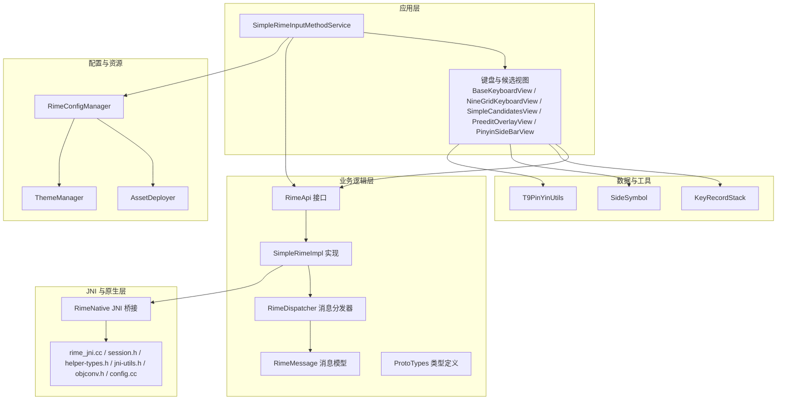
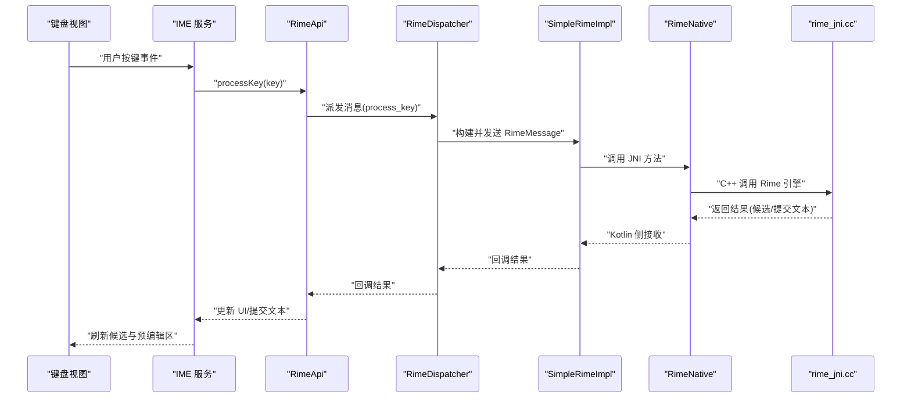
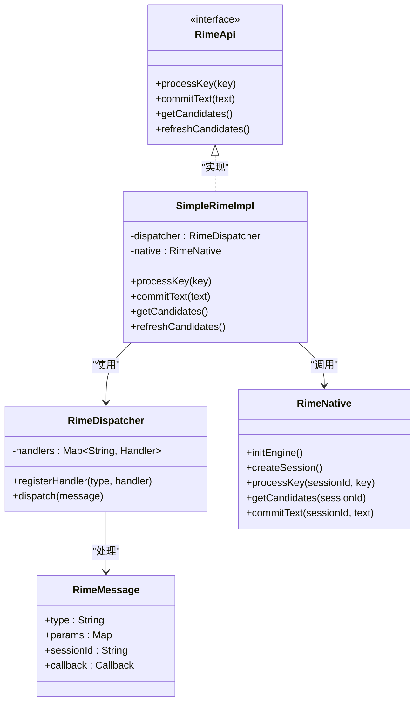

# 业务逻辑层

<cite>
**本文引用的文件**   
- [RimeApi.kt](file://app/src/main/java/com/ziyou/ime/core/RimeApi.kt)
- [SimpleRimeImpl.kt](file://app/src/main/java/com/ziyou/ime/core/SimpleRimeImpl.kt)
- [RimeDispatcher.kt](file://app/src/main/java/com/ziyou/ime/core/RimeDispatcher.kt)
- [RimeMessage.kt](file://app/src/main/java/com/ziyou/ime/core/RimeMessage.kt)
- [RimeNative.kt](file://app/src/main/java/com/ziyou/ime/core/RimeNative.kt)
- [ProtoTypes.kt](file://app/src/main/java/com/ziyou/ime/core/ProtoTypes.kt)
- [RimeSession.kt](file://app/src/main/java/com/ziyou/ime/daemon/RimeSession.kt)
- [SimpleRimeInputMethodService.kt](file://app/src/main/java/com/ziyou/ime/ime/SimpleRimeInputMethodService.kt)
- [BaseKeyboardView.kt](file://app/src/main/java/com/ziyou/ime/ime/BaseKeyboardView.kt)
- [NineGridKeyboardView.kt](file://app/src/main/java/com/ziyou/ime/ime/NineGridKeyboardView.kt)
- [SimpleCandidatesView.kt](file://app/src/main/java/com/ziyou/ime/ime/SimpleCandidatesView.kt)
- [PreeditOverlayView.kt](file://app/src/main/java/com/ziyou/ime/ime/PreeditOverlayView.kt)
- [PinyinSideBarView.kt](file://app/src/main/java/com/ziyou/ime/ime/PinyinSideBarView.kt)
- [ZiyouApplication.kt](file://app/src/main/java/com/ziyou/ime/ZiyouApplication.kt)
- [RimeConfigManager.kt](file://app/src/main/java/com/ziyou/ime/config/RimeConfigManager.kt)
- [AssetDeployer.kt](file://app/src/main/java/com/ziyou/ime/config/AssetDeployer.kt)
- [ThemeManager.kt](file://app/src/main/java/com/ziyou/ime/config/ThemeManager.kt)
- [KeyRecordStack.kt](file://app/src/main/java/com/ziyou/ime/data/KeyRecordStack.kt)
- [SideSymbol.kt](file://app/src/main/java/com/ziyou/ime/data/SideSymbol.kt)
- [T9PinYinUtils.kt](file://app/src/main/java/com/ziyou/ime/util/T9PinYinUtils.kt)
- [rime_jni.cc](file://app/src/main/jni/librime_jni/rime_jni.cc)
- [session.h](file://app/src/main/jni/librime_jni/session.h)
- [helper-types.h](file://app/src/main/jni/librime_jni/helper-types.h)
- [jni-utils.h](file://app/src/main/jni/librime_jni/jni-utils.h)
- [objconv.h](file://app/src/main/jni/librime_jni/objconv.h)
- [config.cc](file://app/src/main/jni/librime_jni/config.cc)
</cite>

## 目录
1. [引言](#引言)
2. [项目结构](#项目结构)
3. [核心组件](#核心组件)
4. [架构总览](#架构总览)
5. [详细组件分析](#详细组件分析)
6. [依赖关系分析](#依赖关系分析)
7. [性能考量](#性能考量)
8. [故障排查指南](#故障排查指南)
9. [结论](#结论)
10. [附录：扩展开发指南](#附录扩展开发指南)

## 引言
本文件聚焦 ziyou-ime 的业务逻辑层，围绕 Rime 引擎在 Android 端的集成与编排展开。重点包括：
- RimeApi 接口的设计与抽象层次
- SimpleRimeImpl 对 Rime 引擎的核心封装
- RimeDispatcher 的消息分发机制与异步处理模式
- RimeMessage 的数据结构与通信协议
- 业务逻辑分层、依赖注入与模块解耦策略
- 扩展新输入法与功能点的实践指南

## 项目结构
业务逻辑层主要位于 app/src/main/java/com/ziyou/ime/core 包内，配合 JNI 层（librime_jni）完成与 C++ Rime 库的交互；上层由 IME 服务与各键盘视图消费能力；配置与资源部署由 config 包提供；数据与工具类位于 data 与 util 包。

图表来源
- [SimpleRimeInputMethodService.kt](file://app/src/main/java/com/ziyou/ime/ime/SimpleRimeInputMethodService.kt)
- [BaseKeyboardView.kt](file://app/src/main/java/com/ziyou/ime/ime/BaseKeyboardView.kt)
- [NineGridKeyboardView.kt](file://app/src/main/java/com/ziyou/ime/ime/NineGridKeyboardView.kt)
- [SimpleCandidatesView.kt](file://app/src/main/java/com/ziyou/ime/ime/SimpleCandidatesView.kt)
- [PreeditOverlayView.kt](file://app/src/main/java/com/ziyou/ime/ime/PreeditOverlayView.kt)
- [PinyinSideBarView.kt](file://app/src/main/java/com/ziyou/ime/ime/PinyinSideBarView.kt)
- [RimeApi.kt](file://app/src/main/java/com/ziyou/ime/core/RimeApi.kt)
- [SimpleRimeImpl.kt](file://app/src/main/java/com/ziyou/ime/core/SimpleRimeImpl.kt)
- [RimeDispatcher.kt](file://app/src/main/java/com/ziyou/ime/core/RimeDispatcher.kt)
- [RimeMessage.kt](file://app/src/main/java/com/ziyou/ime/core/RimeMessage.kt)
- [RimeNative.kt](file://app/src/main/java/com/ziyou/ime/core/RimeNative.kt)
- [rime_jni.cc](file://app/src/main/jni/librime_jni/rime_jni.cc)
- [session.h](file://app/src/main/jni/librime_jni/session.h)
- [helper-types.h](file://app/src/main/jni/librime_jni/helper-types.h)
- [jni-utils.h](file://app/src/main/jni/librime_jni/jni-utils.h)
- [objconv.h](file://app/src/main/jni/librime_jni/objconv.h)
- [config.cc](file://app/src/main/jni/librime_jni/config.cc)
- [RimeConfigManager.kt](file://app/src/main/java/com/ziyou/ime/config/RimeConfigManager.kt)
- [AssetDeployer.kt](file://app/src/main/java/com/ziyou/ime/config/AssetDeployer.kt)
- [ThemeManager.kt](file://app/src/main/java/com/ziyou/ime/config/ThemeManager.kt)
- [KeyRecordStack.kt](file://app/src/main/java/com/ziyou/ime/data/KeyRecordStack.kt)
- [SideSymbol.kt](file://app/src/main/java/com/ziyou/ime/data/SideSymbol.kt)
- [T9PinYinUtils.kt](file://app/src/main/java/com/ziyou/ime/util/T9PinYinUtils.kt)

章节来源
- [SimpleRimeInputMethodService.kt](file://app/src/main/java/com/ziyou/ime/ime/SimpleRimeInputMethodService.kt)
- [RimeApi.kt](file://app/src/main/java/com/ziyou/ime/core/RimeApi.kt)
- [SimpleRimeImpl.kt](file://app/src/main/java/com/ziyou/ime/core/SimpleRimeImpl.kt)
- [RimeDispatcher.kt](file://app/src/main/java/com/ziyou/ime/core/RimeDispatcher.kt)
- [RimeMessage.kt](file://app/src/main/java/com/ziyou/ime/core/RimeMessage.kt)
- [RimeNative.kt](file://app/src/main/java/com/ziyou/ime/core/RimeNative.kt)
- [rime_jni.cc](file://app/src/main/jni/librime_jni/rime_jni.cc)

## 核心组件
- RimeApi：面向上层的统一输入能力抽象，屏蔽底层 Rime 引擎细节，提供键入、提交、候选查询、上下文操作等接口。
- SimpleRimeImpl：RimeApi 的具体实现，负责会话管理、消息构造、调用 RimeNative 与 JNI 层、错误处理与状态同步。
- RimeDispatcher：基于消息的事件分发器，将 UI 事件转换为 RimeMessage，调度到合适的处理器，支持异步回调与线程切换。
- RimeMessage：跨层通信的数据载体，包含消息类型、参数、目标会话标识、回调句柄等字段，确保请求-响应一致性。
- RimeNative：JNI 桥接封装，暴露给 Kotlin 的轻量方法集，内部委托给 rime_jni.cc 中的 C++ 实现。
- ProtoTypes：跨层共享的类型定义，保证 Kotlin 与 JNI/C++ 之间的数据结构一致。

章节来源
- [RimeApi.kt](file://app/src/main/java/com/ziyou/ime/core/RimeApi.kt)
- [SimpleRimeImpl.kt](file://app/src/main/java/com/ziyou/ime/core/SimpleRimeImpl.kt)
- [RimeDispatcher.kt](file://app/src/main/java/com/ziyou/ime/core/RimeDispatcher.kt)
- [RimeMessage.kt](file://app/src/main/java/com/ziyou/ime/core/RimeMessage.kt)
- [RimeNative.kt](file://app/src/main/java/com/ziyou/ime/core/RimeNative.kt)
- [ProtoTypes.kt](file://app/src/main/java/com/ziyou/ime/core/ProtoTypes.kt)

## 架构总览
业务逻辑层采用“接口 + 实现 + 消息分发”的分层设计：
- 接口层（RimeApi）：稳定契约，供 IME 服务与键盘视图使用。
- 实现层（SimpleRimeImpl）：封装 Rime 引擎生命周期、会话、配置加载、JNI 调用。
- 分发层（RimeDispatcher）：统一入口，解析消息、路由到处理器、管理异步回调。
- 数据层（RimeMessage/ProtoTypes）：跨进程/线程安全的数据传输格式。
- 原生层（RimeNative + rime_jni.cc）：与 C++ Rime 库交互，执行分词、翻译、候选生成等核心算法。

图表来源
- [SimpleRimeInputMethodService.kt](file://app/src/main/java/com/ziyou/ime/ime/SimpleRimeInputMethodService.kt)
- [BaseKeyboardView.kt](file://app/src/main/java/com/ziyou/ime/ime/BaseKeyboardView.kt)
- [RimeApi.kt](file://app/src/main/java/com/ziyou/ime/core/RimeApi.kt)
- [RimeDispatcher.kt](file://app/src/main/java/com/ziyou/ime/core/RimeDispatcher.kt)
- [SimpleRimeImpl.kt](file://app/src/main/java/com/ziyou/ime/core/SimpleRimeImpl.kt)
- [RimeNative.kt](file://app/src/main/java/com/ziyou/ime/core/RimeNative.kt)
- [rime_jni.cc](file://app/src/main/jni/librime_jni/rime_jni.cc)

## 详细组件分析

### RimeApi 接口设计与抽象层次
- 职责边界
  - 对外暴露稳定的输入能力：键入处理、提交文本、获取候选、上下文操作、配置读取等。
  - 屏蔽 Rime 引擎细节（会话、配置、JNI 调用），便于替换实现或进行单元测试。
- 抽象层次
  - 高层：面向 UI 的易用方法（如 processKey、commitText）。
  - 中层：会话级操作（如 selectCandidate、refreshCandidates）。
  - 低层：配置与资源访问（如 schema/dict 相关能力，通过配置管理器间接提供）。
- 设计要点
  - 无状态接口：避免在接口中持有可变状态，状态由实现层管理。
  - 回调驱动：所有耗时操作通过回调返回结果，避免阻塞主线程。
  - 错误语义：明确成功/失败路径，错误信息结构化以便上层处理。

章节来源
- [RimeApi.kt](file://app/src/main/java/com/ziyou/ime/core/RimeApi.kt)

### SimpleRimeImpl 对 Rime 引擎的核心封装
- 会话管理
  - 创建/销毁会话，绑定上下文与配置，维护当前输入状态。
- 消息构造与转发
  - 将 RimeApi 的方法调用转化为 RimeMessage，交由 RimeDispatcher 处理。
- JNI 调用封装
  - 通过 RimeNative 调用 rime_jni.cc 提供的函数，完成与 C++ Rime 的交互。
- 错误处理与重试
  - 捕获 JNI 异常、空指针、超时等，向上抛出结构化错误。
- 性能优化
  - 缓存常用对象（如会话句柄、配置引用），减少重复分配。
  - 批量更新候选列表，降低 UI 刷新频率。

章节来源
- [SimpleRimeImpl.kt](file://app/src/main/java/com/ziyou/ime/core/SimpleRimeImpl.kt)
- [RimeNative.kt](file://app/src/main/java/com/ziyou/ime/core/RimeNative.kt)
- [rime_jni.cc](file://app/src/main/jni/librime_jni/rime_jni.cc)

### RimeDispatcher 的消息分发机制与异步处理
- 消息模型
  - 以 RimeMessage 为载体，包含类型、参数、目标会话、回调句柄等。
- 分发流程
  - 注册处理器：按消息类型注册对应的处理函数。
  - 路由匹配：根据消息类型选择处理器，必要时进行参数校验。
  - 异步执行：在后台线程执行耗时逻辑，完成后在主线程回调结果。
- 并发控制
  - 单会话串行化：同一会话的消息顺序执行，避免竞态条件。
  - 全局限流：限制同时处理的请求数，防止资源耗尽。
- 错误恢复
  - 统一异常捕获，记录日志，向调用方返回错误消息。

章节来源
- [RimeDispatcher.kt](file://app/src/main/java/com/ziyou/ime/core/RimeDispatcher.kt)
- [RimeMessage.kt](file://app/src/main/java/com/ziyou/ime/core/RimeMessage.kt)

### RimeMessage 的数据结构与通信协议
- 字段说明
  - 类型：区分不同操作（如键入、提交、查询候选、刷新界面）。
  - 参数：携带具体数据（键值、索引、文本片段等）。
  - 会话标识：用于多会话隔离。
  - 回调句柄：指向回调函数或协程上下文，用于异步返回。
- 序列化与校验
  - 严格类型检查，缺失必填字段时拒绝处理。
  - 可选字段默认值处理，保证兼容性。
- 生命周期
  - 创建后进入队列，被分发器取出处理，完成后释放。

章节来源
- [RimeMessage.kt](file://app/src/main/java/com/ziyou/ime/core/RimeMessage.kt)
- [ProtoTypes.kt](file://app/src/main/java/com/ziyou/ime/core/ProtoTypes.kt)

### 与 JNI 层的交互
- RimeNative 暴露 Kotlin 友好的方法集，内部委托给 rime_jni.cc。
- rime_jni.cc 负责：
  - 初始化 Rime 引擎、加载配置与插件。
  - 创建/销毁会话、处理键入、生成候选、提交文本。
  - 与 C++ 对象互转（通过 helper-types.h、objconv.h、jni-utils.h）。
- 错误传播：JNI 异常通过返回值或异常码回传至 Kotlin 层。

章节来源
- [RimeNative.kt](file://app/src/main/java/com/ziyou/ime/core/RimeNative.kt)
- [rime_jni.cc](file://app/src/main/jni/librime_jni/rime_jni.cc)
- [session.h](file://app/src/main/jni/librime_jni/session.h)
- [helper-types.h](file://app/src/main/jni/librime_jni/helper-types.h)
- [jni-utils.h](file://app/src/main/jni/librime_jni/jni-utils.h)
- [objconv.h](file://app/src/main/jni/librime_jni/objconv.h)
- [config.cc](file://app/src/main/jni/librime_jni/config.cc)

### 业务逻辑分层与依赖注入
- 分层设计
  - 表现层：IME 服务与键盘视图，负责用户交互与 UI 更新。
  - 业务层：RimeApi/SimpleRimeImpl/RimeDispatcher，负责输入逻辑与消息编排。
  - 数据层：RimeNative/JNI，负责与 Rime 引擎交互。
  - 配置层：RimeConfigManager/AssetDeployer/ThemeManager，负责资源部署与主题切换。
- 依赖注入
  - 通过 ZiyouApplication 统一管理实例，避免全局变量耦合。
  - 各组件通过构造函数或属性注入依赖，便于测试与替换。
- 模块解耦
  - 接口与实现分离，允许替换实现（如 Mock 实现用于测试）。
  - 消息驱动降低模块间直接调用，提升可维护性。

章节来源
- [ZiyouApplication.kt](file://app/src/main/java/com/ziyou/ime/ZiyouApplication.kt)
- [RimeConfigManager.kt](file://app/src/main/java/com/ziyou/ime/config/RimeConfigManager.kt)
- [AssetDeployer.kt](file://app/src/main/java/com/ziyou/ime/config/AssetDeployer.kt)
- [ThemeManager.kt](file://app/src/main/java/com/ziyou/ime/config/ThemeManager.kt)

### 键盘视图与候选展示
- BaseKeyboardView：基础键盘视图，处理通用按键与布局。
- NineGridKeyboardView：九宫格键盘，结合 T9 拼音工具进行快速输入。
- SimpleCandidatesView：候选项列表展示，支持翻页与选择。
- PreeditOverlayView：预编辑区覆盖层，显示当前输入状态。
- PinyinSideBarView：拼音侧边栏，辅助选词与导航。

章节来源
- [BaseKeyboardView.kt](file://app/src/main/java/com/ziyou/ime/ime/BaseKeyboardView.kt)
- [NineGridKeyboardView.kt](file://app/src/main/java/com/ziyou/ime/ime/NineGridKeyboardView.kt)
- [SimpleCandidatesView.kt](file://app/src/main/java/com/ziyou/ime/ime/SimpleCandidatesView.kt)
- [PreeditOverlayView.kt](file://app/src/main/java/com/ziyou/ime/ime/PreeditOverlayView.kt)
- [PinyinSideBarView.kt](file://app/src/main/java/com/ziyou/ime/ime/PinyinSideBarView.kt)

### 数据与工具
- KeyRecordStack：按键历史记录栈，支持撤销与重做。
- SideSymbol：侧边符号集合，用于快捷插入特殊字符。
- T9PinYinUtils：T9 拼音转换工具，辅助九宫格输入。

章节来源
- [KeyRecordStack.kt](file://app/src/main/java/com/ziyou/ime/data/KeyRecordStack.kt)
- [SideSymbol.kt](file://app/src/main/java/com/ziyou/ime/data/SideSymbol.kt)
- [T9PinYinUtils.kt](file://app/src/main/java/com/ziyou/ime/util/T9PinYinUtils.kt)

## 依赖关系分析

图表来源
- [RimeApi.kt](file://app/src/main/java/com/ziyou/ime/core/RimeApi.kt)
- [SimpleRimeImpl.kt](file://app/src/main/java/com/ziyou/ime/core/SimpleRimeImpl.kt)
- [RimeDispatcher.kt](file://app/src/main/java/com/ziyou/ime/core/RimeDispatcher.kt)
- [RimeMessage.kt](file://app/src/main/java/com/ziyou/ime/core/RimeMessage.kt)
- [RimeNative.kt](file://app/src/main/java/com/ziyou/ime/core/RimeNative.kt)

章节来源
- [RimeApi.kt](file://app/src/main/java/com/ziyou/ime/core/RimeApi.kt)
- [SimpleRimeImpl.kt](file://app/src/main/java/com/ziyou/ime/core/SimpleRimeImpl.kt)
- [RimeDispatcher.kt](file://app/src/main/java/com/ziyou/ime/core/RimeDispatcher.kt)
- [RimeMessage.kt](file://app/src/main/java/com/ziyou/ime/core/RimeMessage.kt)
- [RimeNative.kt](file://app/src/main/java/com/ziyou/ime/core/RimeNative.kt)

## 性能考量
- 线程模型
  - 主线程仅处理 UI 更新，耗时操作在后台线程执行。
  - 使用协程或线程池管理异步任务，避免阻塞。
- 内存管理
  - 及时释放 JNI 对象引用，避免内存泄漏。
  - 大对象（如候选列表）按需加载与分页。
- I/O 优化
  - 配置与资源预加载，减少首次启动延迟。
  - 磁盘读写批量操作，降低系统调用次数。
- 网络与插件
  - 插件加载懒初始化，按需启用。
  - 网络请求（如有）加超时与重试机制。

## 故障排查指南
- 常见问题
  - JNI 崩溃：检查 rime_jni.cc 中的空指针与越界访问。
  - 候选为空：确认 Rime 配置与词典是否正确部署。
  - 卡顿明显：检查是否在主线程执行耗时操作。
- 调试手段
  - 启用详细日志，记录消息流转与错误堆栈。
  - 使用模拟器与真机对比，定位平台差异。
- 恢复策略
  - 自动重启会话，清理无效状态。
  - 降级模式：禁用复杂插件，保证基本输入可用。

章节来源
- [rime_jni.cc](file://app/src/main/jni/librime_jni/rime_jni.cc)
- [RimeDispatcher.kt](file://app/src/main/java/com/ziyou/ime/core/RimeDispatcher.kt)
- [SimpleRimeImpl.kt](file://app/src/main/java/com/ziyou/ime/core/SimpleRimeImpl.kt)

## 结论
ziyou-ime 的业务逻辑层通过清晰的接口抽象、稳健的消息分发与高效的 JNI 封装，实现了与 Rime 引擎的稳定集成。分层设计确保了模块解耦与可扩展性，为后续新增输入法与功能点提供了坚实基础。

## 附录：扩展开发指南
- 新增输入法
  - 在 RimeApi 中定义新接口，保持向后兼容。
  - 在 SimpleRimeImpl 中实现具体逻辑，复用现有分发器与 JNI 封装。
  - 更新 RimeMessage 类型与参数，确保跨层一致性。
- 新增功能点
  - 在 RimeDispatcher 中注册新处理器，处理特定消息类型。
  - 在 ProtoTypes 中定义新数据结构，避免硬编码。
  - 在配置层添加相应资源与主题支持。
- 最佳实践
  - 遵循单一职责原则，每个组件只做一件事。
  - 使用依赖注入，便于测试与替换。
  - 编写单元测试与集成测试，确保稳定性。