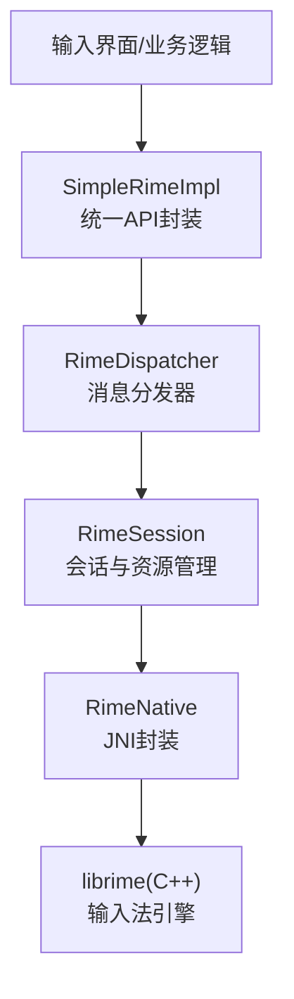
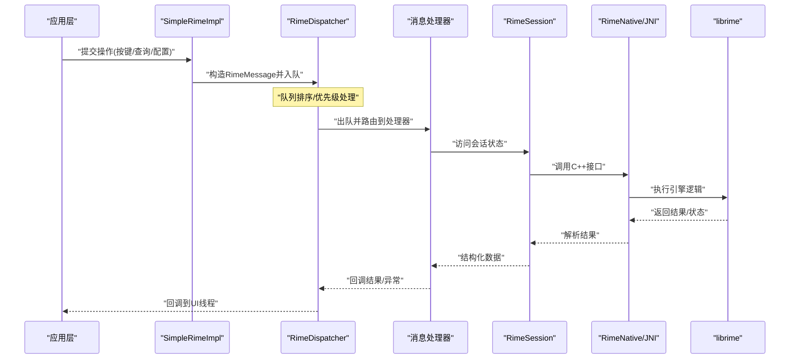
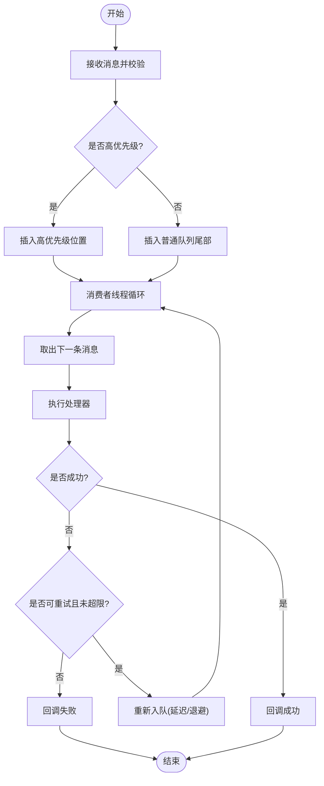
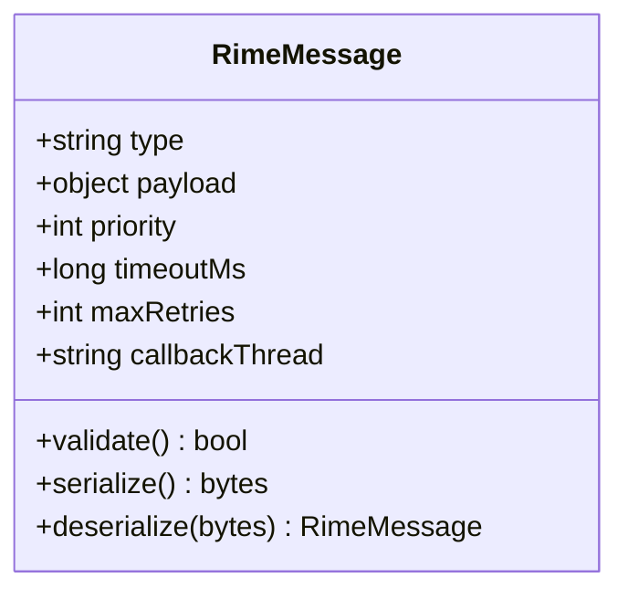
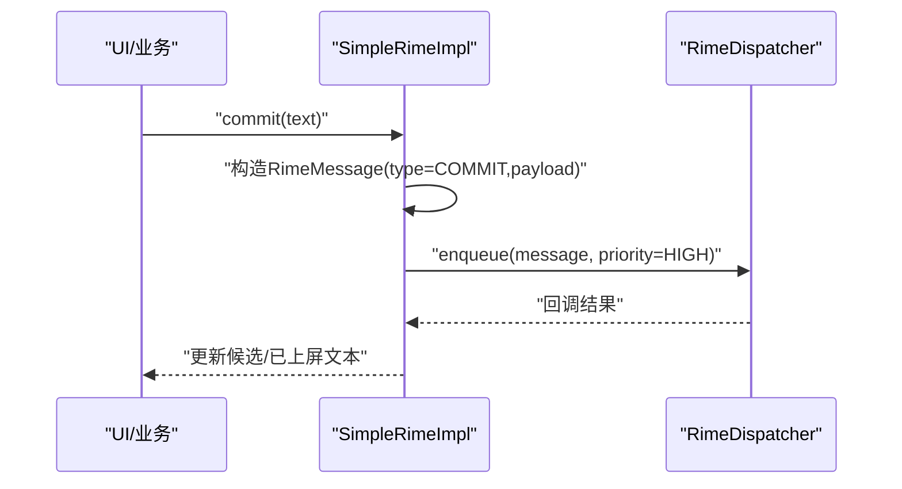
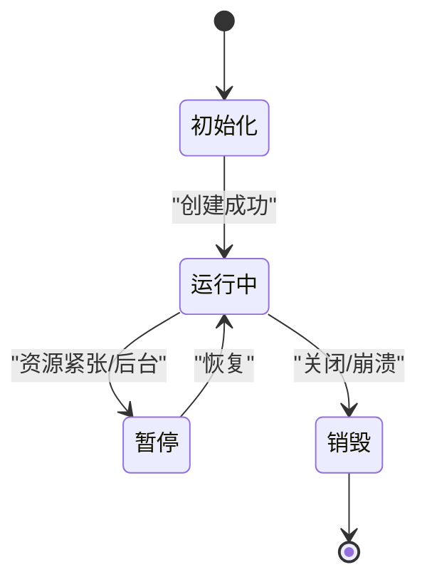
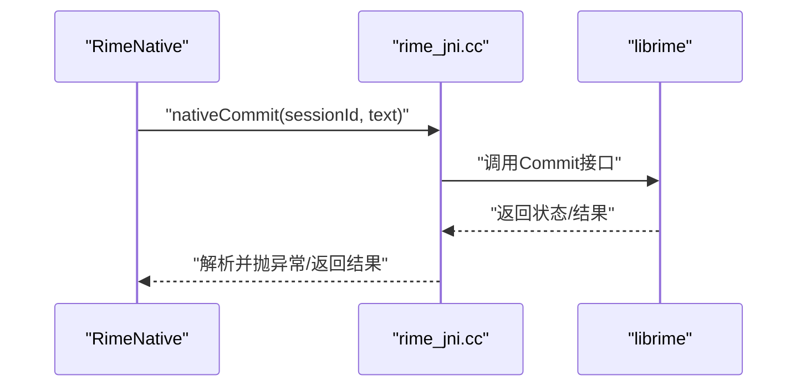
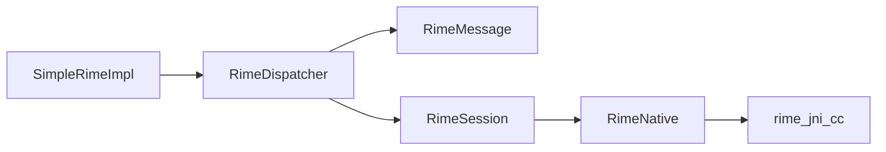

# 消息分发器

<cite>
**本文档引用的文件**   
- [RimeDispatcher.kt](file://app/src/main/java/com/ziyou/ime/core/RimeDispatcher.kt)
- [RimeMessage.kt](file://app/src/main/java/com/ziyou/ime/core/RimeMessage.kt)
- [SimpleRimeImpl.kt](file://app/src/main/java/com/ziyou/ime/core/SimpleRimeImpl.kt)
- [RimeApi.kt](file://app/src/main/java/com/ziyou/ime/core/RimeApi.kt)
- [RimeNative.kt](file://app/src/main/java/com/ziyou/ime/core/RimeNative.kt)
- [RimeSession.kt](file://app/src/main/java/com/ziyou/ime/daemon/RimeSession.kt)
- [rime_jni.cc](file://app/src/main/jni/librime_jni/rime_jni.cc)
</cite>

## 目录
1. [简介](#简介)
2. [项目结构](#项目结构)
3. [核心组件](#核心组件)
4. [架构总览](#架构总览)
5. [详细组件分析](#详细组件分析)
6. [依赖关系分析](#依赖关系分析)
7. [性能考量](#性能考量)
8. [故障排查指南](#故障排查指南)
9. [结论](#结论)
10. [附录](#附录)

## 简介
本文件围绕 RimeDispatcher 的消息分发机制，系统性阐述异步消息处理架构与线程模型设计。重点覆盖：
- 消息队列管理与任务调度、优先级策略
- 事件驱动模式与回调机制实现
- 错误重试、超时处理与资源清理策略
- 自定义消息类型的扩展方法
- 性能监控与可观测性建议

目标是帮助开发者快速理解并安全扩展该分发机制，同时为问题定位与优化提供依据。

## 项目结构
与消息分发相关的关键代码位于 app 模块的 core 与 daemon 包中，并通过 JNI 层与底层 librime 交互。整体分层如下：
- 应用层（IME/UI）通过 SimpleRimeImpl 暴露统一 API
- 核心分发层 RimeDispatcher 负责消息入队、调度与执行
- 会话层 RimeSession 管理长生命周期状态与资源
- 原生桥接层 RimeNative + rime_jni.cc 调用 C++ librime

**图表来源** 
- [SimpleRimeImpl.kt](file://app/src/main/java/com/ziyou/ime/core/SimpleRimeImpl.kt)
- [RimeDispatcher.kt](file://app/src/main/java/com/ziyou/ime/core/RimeDispatcher.kt)
- [RimeSession.kt](file://app/src/main/java/com/ziyou/ime/daemon/RimeSession.kt)
- [RimeNative.kt](file://app/src/main/java/com/ziyou/ime/core/RimeNative.kt)
- [rime_jni.cc](file://app/src/main/jni/librime_jni/rime_jni.cc)

**章节来源**
- [RimeDispatcher.kt](file://app/src/main/java/com/ziyou/ime/core/RimeDispatcher.kt)
- [RimeMessage.kt](file://app/src/main/java/com/ziyou/ime/core/RimeMessage.kt)
- [SimpleRimeImpl.kt](file://app/src/main/java/com/ziyou/ime/core/SimpleRimeImpl.kt)
- [RimeSession.kt](file://app/src/main/java/com/ziyou/ime/daemon/RimeSession.kt)
- [RimeNative.kt](file://app/src/main/java/com/ziyou/ime/core/RimeNative.kt)
- [rime_jni.cc](file://app/src/main/jni/librime_jni/rime_jni.cc)

## 核心组件
- RimeDispatcher：消息分发中枢，维护消息队列、调度器与执行线程，保证有序、可靠地处理输入事件与内部任务。
- RimeMessage：消息抽象，承载类型、参数、优先级、超时与回调信息，支持序列化与跨线程传递。
- SimpleRimeImpl：对外 API 门面，将上层调用转换为 RimeMessage 并投递到分发器。
- RimeSession：会话上下文，持有 librime 句柄、配置与缓存，负责资源生命周期。
- RimeNative + rime_jni.cc：JNI 桥接，将 Java/Kotlin 调用映射到 C++ librime API。

**章节来源**
- [RimeDispatcher.kt](file://app/src/main/java/com/ziyou/ime/core/RimeDispatcher.kt)
- [RimeMessage.kt](file://app/src/main/java/com/ziyou/ime/core/RimeMessage.kt)
- [SimpleRimeImpl.kt](file://app/src/main/java/com/ziyou/ime/core/SimpleRimeImpl.kt)
- [RimeSession.kt](file://app/src/main/java/com/ziyou/ime/daemon/RimeSession.kt)
- [RimeNative.kt](file://app/src/main/java/com/ziyou/ime/core/RimeNative.kt)
- [rime_jni.cc](file://app/src/main/jni/librime_jni/rime_jni.cc)

## 架构总览
RimeDispatcher 采用“生产者-消费者”异步模型：
- 生产者：UI/业务线程通过 SimpleRimeImpl 提交 RimeMessage
- 分发器：单队列、单消费者线程串行消费，避免竞态
- 处理器：根据消息类型路由到对应处理器（翻译、候选、配置等）
- 回调：处理器完成或失败后，按约定回调至指定线程（通常为 UI）

**图表来源** 
- [SimpleRimeImpl.kt](file://app/src/main/java/com/ziyou/ime/core/SimpleRimeImpl.kt)
- [RimeDispatcher.kt](file://app/src/main/java/com/ziyou/ime/core/RimeDispatcher.kt)
- [RimeSession.kt](file://app/src/main/java/com/ziyou/ime/daemon/RimeSession.kt)
- [RimeNative.kt](file://app/src/main/java/com/ziyou/ime/core/RimeNative.kt)
- [rime_jni.cc](file://app/src/main/jni/librime_jni/rime_jni.cc)

## 详细组件分析

### RimeDispatcher：消息分发与调度
职责：
- 维护单一消息队列，确保同一会话内操作的顺序性
- 支持优先级队列，关键操作优先执行
- 单线程消费者，避免锁竞争与状态不一致
- 统一错误处理、重试与超时控制
- 回调派发，确保结果回到期望线程

关键点：
- 入队：校验消息合法性，计算优先级，插入队列
- 出队：按优先级取出，设置执行上下文（会话、超时、重试次数）
- 执行：调用处理器，捕获异常，记录指标
- 回调：成功/失败回调，必要时触发重试或降级

**图表来源** 
- [RimeDispatcher.kt](file://app/src/main/java/com/ziyou/ime/core/RimeDispatcher.kt)

**章节来源**
- [RimeDispatcher.kt](file://app/src/main/java/com/ziyou/ime/core/RimeDispatcher.kt)

### RimeMessage：消息模型与元数据
职责：
- 定义消息类型、负载数据、优先级、超时时间、重试策略
- 支持跨线程序列化与反序列化
- 携带回调目标线程标识，确保回调安全

关键点：
- 类型枚举：区分输入、查询、配置、系统事件等
- 负载：键值对或字节数组，便于通用传输
- 优先级：数值越小优先级越高（或反之，依实现而定）
- 超时：毫秒级阈值，超过则标记失败
- 重试：最大次数、退避策略（固定/指数）

**图表来源** 
- [RimeMessage.kt](file://app/src/main/java/com/ziyou/ime/core/RimeMessage.kt)

**章节来源**
- [RimeMessage.kt](file://app/src/main/java/com/ziyou/ime/core/RimeMessage.kt)

### SimpleRimeImpl：API 门面与消息转换
职责：
- 将上层调用转换为 RimeMessage
- 选择合适优先级与超时策略
- 调用 RimeDispatcher 提交任务
- 封装回调结果，屏蔽内部细节

关键点：
- 方法映射：每个 API 对应一种消息类型
- 参数校验：提前拦截非法输入
- 线程切换：确保回调在 UI 线程执行

**图表来源** 
- [SimpleRimeImpl.kt](file://app/src/main/java/com/ziyou/ime/core/SimpleRimeImpl.kt)
- [RimeDispatcher.kt](file://app/src/main/java/com/ziyou/ime/core/RimeDispatcher.kt)

**章节来源**
- [SimpleRimeImpl.kt](file://app/src/main/java/com/ziyou/ime/core/SimpleRimeImpl.kt)
- [RimeDispatcher.kt](file://app/src/main/java/com/ziyou/ime/core/RimeDispatcher.kt)

### RimeSession：会话与资源管理
职责：
- 持有 librime 会话对象与配置
- 管理内存与文件句柄的生命周期
- 提供线程安全的访问接口

关键点：
- 初始化：加载配置与词典
- 销毁：释放 native 资源，防止泄漏
- 并发：读写分离或加锁保护共享状态

**图表来源** 
- [RimeSession.kt](file://app/src/main/java/com/ziyou/ime/daemon/RimeSession.kt)

**章节来源**
- [RimeSession.kt](file://app/src/main/java/com/ziyou/ime/daemon/RimeSession.kt)

### RimeNative + rime_jni.cc：JNI 桥接
职责：
- 将 Kotlin/Java 调用映射到 C++ librime API
- 处理数据类型转换与异常传播
- 管理 native 对象生命周期

关键点：
- 方法绑定：一一对应 Java 接口
- 错误码：将 C++ 错误码转为 Java 异常
- 内存：避免重复拷贝，使用直接缓冲区

**图表来源** 
- [RimeNative.kt](file://app/src/main/java/com/ziyou/ime/core/RimeNative.kt)
- [rime_jni.cc](file://app/src/main/jni/librime_jni/rime_jni.cc)

**章节来源**
- [RimeNative.kt](file://app/src/main/java/com/ziyou/ime/core/RimeNative.kt)
- [rime_jni.cc](file://app/src/main/jni/librime_jni/rime_jni.cc)

## 依赖关系分析
- SimpleRimeImpl 依赖 RimeDispatcher 进行任务调度
- RimeDispatcher 依赖 RimeMessage 作为统一载荷
- RimeSession 被处理器用于访问 librime 状态
- RimeNative 依赖 rime_jni.cc 提供的本地方法
- 无循环依赖，层次清晰

**图表来源** 
- [SimpleRimeImpl.kt](file://app/src/main/java/com/ziyou/ime/core/SimpleRimeImpl.kt)
- [RimeDispatcher.kt](file://app/src/main/java/com/ziyou/ime/core/RimeDispatcher.kt)
- [RimeMessage.kt](file://app/src/main/java/com/ziyou/ime/core/RimeMessage.kt)
- [RimeSession.kt](file://app/src/main/java/com/ziyou/ime/daemon/RimeSession.kt)
- [RimeNative.kt](file://app/src/main/java/com/ziyou/ime/core/RimeNative.kt)
- [rime_jni.cc](file://app/src/main/jni/librime_jni/rime_jni.cc)

**章节来源**
- [RimeDispatcher.kt](file://app/src/main/java/com/ziyou/ime/core/RimeDispatcher.kt)
- [RimeMessage.kt](file://app/src/main/java/com/ziyou/ime/core/RimeMessage.kt)
- [SimpleRimeImpl.kt](file://app/src/main/java/com/ziyou/ime/core/SimpleRimeImpl.kt)
- [RimeSession.kt](file://app/src/main/java/com/ziyou/ime/daemon/RimeSession.kt)
- [RimeNative.kt](file://app/src/main/java/com/ziyou/ime/core/RimeNative.kt)
- [rime_jni.cc](file://app/src/main/jni/librime_jni/rime_jni.cc)

## 性能考量
- 队列长度与背压：限制最大队列长度，超限时拒绝或丢弃低优先级任务
- 优先级策略：关键输入事件优先，批量查询延后
- 批处理：合并短时多次提交，减少上下文切换
- 线程模型：单消费者避免锁竞争；必要时拆分只读路径
- 超时与重试：合理设置超时阈值，指数退避避免雪崩
- 资源复用：会话与 native 对象复用，避免频繁创建销毁
- 监控指标：入队/出队耗时、队列长度、失败率、重试次数、超时率

[本节为通用指导，不直接分析具体文件]

## 故障排查指南
常见问题与定位要点：
- 消息堆积：检查消费者线程是否阻塞，查看队列长度与出队速率
- 超时过多：核对各处理器耗时与超时阈值，必要时调整
- 重试风暴：确认退避策略是否生效，是否存在外部依赖不稳定
- 回调未触发：检查线程切换是否正确，回调注册是否被覆盖
- 资源泄漏：确认会话关闭流程，native 资源释放是否完整

建议日志与指标：
- 入队/出队时间戳与耗时
- 消息类型与优先级分布
- 失败原因分类统计
- 重试次数与最终结果

**章节来源**
- [RimeDispatcher.kt](file://app/src/main/java/com/ziyou/ime/core/RimeDispatcher.kt)
- [RimeMessage.kt](file://app/src/main/java/com/ziyou/ime/core/RimeMessage.kt)
- [RimeSession.kt](file://app/src/main/java/com/ziyou/ime/daemon/RimeSession.kt)
- [RimeNative.kt](file://app/src/main/java/com/ziyou/ime/core/RimeNative.kt)
- [rime_jni.cc](file://app/src/main/jni/librime_jni/rime_jni.cc)

## 结论
RimeDispatcher 以清晰的异步消息模型与严格的线程模型，实现了稳定可靠的输入法核心调度。通过优先级队列、超时与重试、以及统一的回调机制，既保证了响应性，又提升了鲁棒性。配合合理的监控与调优策略，可在高负载场景下保持良好体验。

[本节为总结，不直接分析具体文件]

## 附录

### 自定义消息类型扩展指南
步骤：
- 在 RimeMessage 中添加新消息类型枚举项
- 在 SimpleRimeImpl 中新增 API 方法，构造并发送新消息
- 在 RimeDispatcher 的处理器路由中增加分支，实现处理逻辑
- 如需访问会话或 native 能力，通过 RimeSession 与 RimeNative 调用
- 添加单元测试与性能基准测试

注意事项：
- 明确优先级与超时策略
- 保证幂等性与可重试性
- 避免在处理器中进行阻塞 I/O

**章节来源**
- [RimeMessage.kt](file://app/src/main/java/com/ziyou/ime/core/RimeMessage.kt)
- [SimpleRimeImpl.kt](file://app/src/main/java/com/ziyou/ime/core/SimpleRimeImpl.kt)
- [RimeDispatcher.kt](file://app/src/main/java/com/ziyou/ime/core/RimeDispatcher.kt)
- [RimeSession.kt](file://app/src/main/java/com/ziyou/ime/daemon/RimeSession.kt)
- [RimeNative.kt](file://app/src/main/java/com/ziyou/ime/core/RimeNative.kt)

### 性能监控方法
- 埋点指标：入队耗时、出队耗时、处理器耗时、队列长度、失败率、重试率、超时率
- 采样策略：全量采集关键路径，抽样采集低频路径
- 可视化：仪表盘展示趋势与告警阈值
- 压测：模拟高频输入与复杂查询，观察瓶颈

[本节为通用指导，不直接分析具体文件]