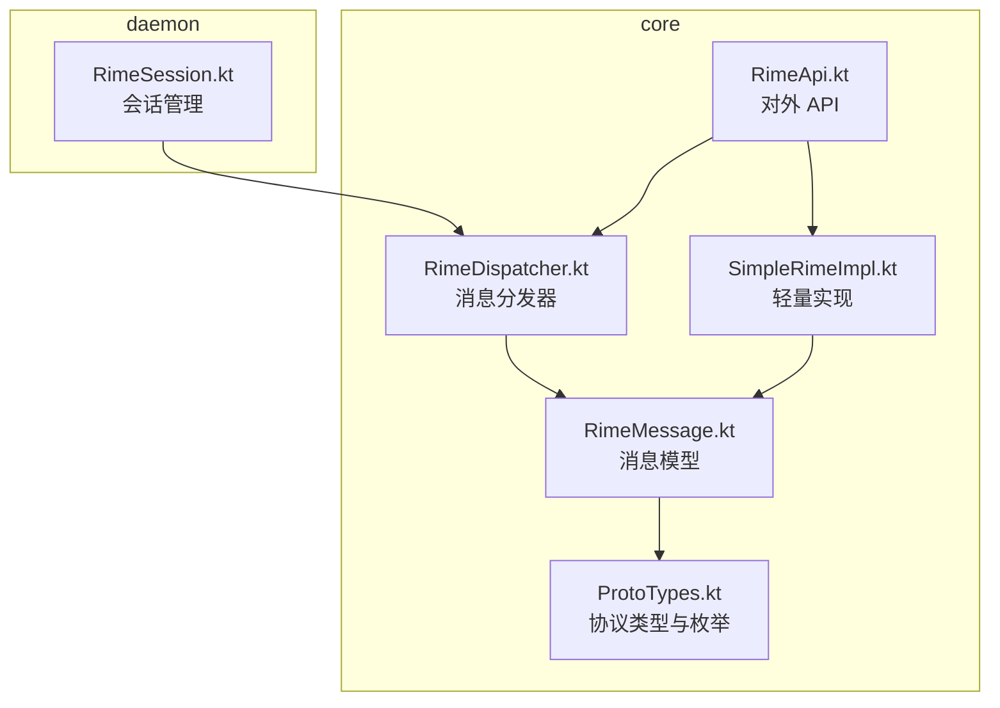
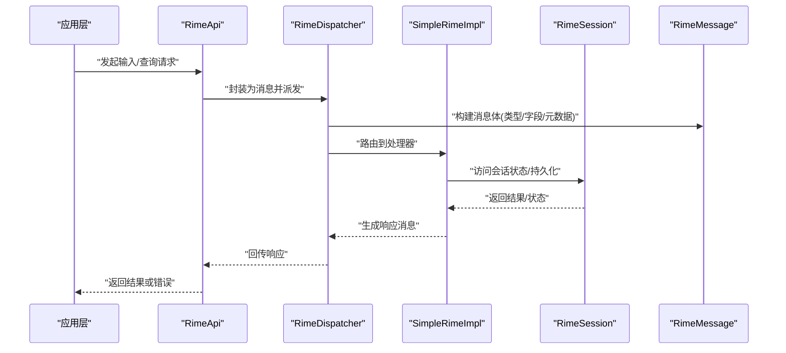
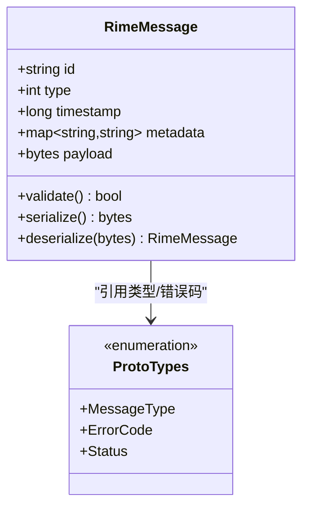
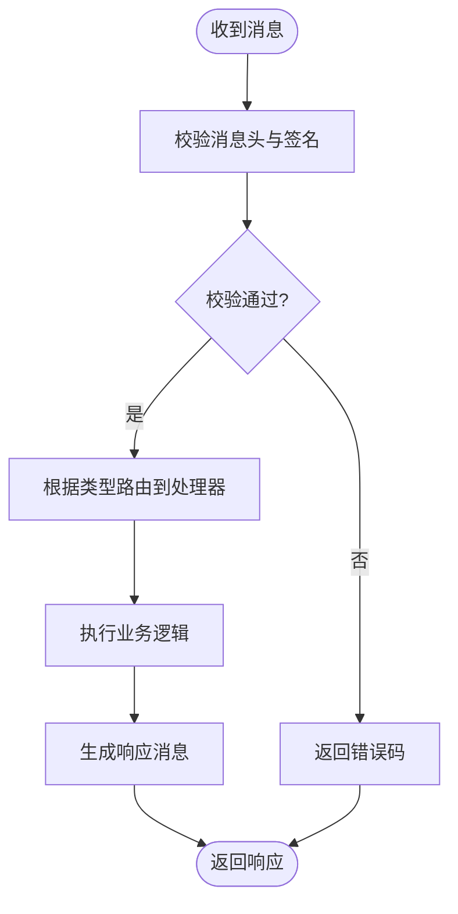
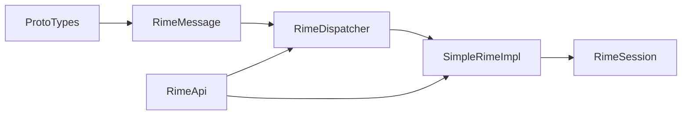

# 消息协议定义

<cite>
**本文引用的文件**   
- [RimeMessage.kt](file://app/src/main/java/com/ziyou/ime/core/RimeMessage.kt)
- [ProtoTypes.kt](file://app/src/main/java/com/ziyou/ime/core/ProtoTypes.kt)
- [RimeDispatcher.kt](file://app/src/main/java/com/ziyou/ime/core/RimeDispatcher.kt)
- [SimpleRimeImpl.kt](file://app/src/main/java/com/ziyou/ime/core/SimpleRimeImpl.kt)
- [RimeApi.kt](file://app/src/main/java/com/ziyou/ime/core/RimeApi.kt)
- [RimeSession.kt](file://app/src/main/java/com/ziyou/ime/daemon/RimeSession.kt)
</cite>

## 目录
1. [简介](#简介)
2. [项目结构](#项目结构)
3. [核心组件](#核心组件)
4. [架构总览](#架构总览)
5. [详细组件分析](#详细组件分析)
6. [依赖分析](#依赖分析)
7. [性能考虑](#性能考虑)
8. [故障排查指南](#故障排查指南)
9. [结论](#结论)
10. [附录](#附录)

## 简介
本文件面向 RimeMessage 消息协议的完整说明，覆盖数据结构设计、序列化格式、消息类型与字段语义、生命周期与状态转换、验证规则与错误码、扩展规范与兼容性策略，以及序列化和反序列化的性能优化建议。文档旨在帮助开发者快速理解并正确实现基于 RimeMessage 的输入引擎通信机制。

## 项目结构
围绕 RimeMessage 的核心代码主要位于 Android 应用的 core 包与 daemon 包中：
- core 层负责消息模型定义、分发调度、API 封装与具体实现
- daemon 层负责会话管理与跨进程/线程交互

图表来源 
- [RimeMessage.kt](file://app/src/main/java/com/ziyou/ime/core/RimeMessage.kt)
- [ProtoTypes.kt](file://app/src/main/java/com/ziyou/ime/core/ProtoTypes.kt)
- [RimeDispatcher.kt](file://app/src/main/java/com/ziyou/ime/core/RimeDispatcher.kt)
- [SimpleRimeImpl.kt](file://app/src/main/java/com/ziyou/ime/core/SimpleRimeImpl.kt)
- [RimeApi.kt](file://app/src/main/java/com/ziyou/ime/core/RimeApi.kt)
- [RimeSession.kt](file://app/src/main/java/com/ziyou/ime/daemon/RimeSession.kt)

章节来源
- [RimeMessage.kt](file://app/src/main/java/com/ziyou/ime/core/RimeMessage.kt)
- [ProtoTypes.kt](file://app/src/main/java/com/ziyou/ime/core/ProtoTypes.kt)
- [RimeDispatcher.kt](file://app/src/main/java/com/ziyou/ime/core/RimeDispatcher.kt)
- [SimpleRimeImpl.kt](file://app/src/main/java/com/ziyou/ime/core/SimpleRimeImpl.kt)
- [RimeApi.kt](file://app/src/main/java/com/ziyou/ime/core/RimeApi.kt)
- [RimeSession.kt](file://app/src/main/java/com/ziyou/ime/daemon/RimeSession.kt)

## 核心组件
- 消息模型（RimeMessage）
  - 统一的消息载体，包含消息头、负载与元数据
  - 支持多种消息类型（如输入事件、候选更新、配置变更等）
  - 提供构造器与校验方法，确保字段完整性与一致性
- 协议类型（ProtoTypes）
  - 定义消息类型枚举、状态码、错误码与通用字段
  - 为序列化框架提供类型映射
- 消息分发器（RimeDispatcher）
  - 接收上游请求，路由到对应处理器
  - 维护消息生命周期与回调
- 轻量实现（SimpleRimeImpl）
  - 对上层 API 的具体实现，处理业务逻辑与状态机
- 对外 API（RimeApi）
  - 暴露稳定的调用接口，屏蔽内部细节
- 会话管理（RimeSession）
  - 管理长连接或异步会话，保证消息有序与幂等

章节来源
- [RimeMessage.kt](file://app/src/main/java/com/ziyou/ime/core/RimeMessage.kt)
- [ProtoTypes.kt](file://app/src/main/java/com/ziyou/ime/core/ProtoTypes.kt)
- [RimeDispatcher.kt](file://app/src/main/java/com/ziyou/ime/core/RimeDispatcher.kt)
- [SimpleRimeImpl.kt](file://app/src/main/java/com/ziyou/ime/core/SimpleRimeImpl.kt)
- [RimeApi.kt](file://app/src/main/java/com/ziyou/ime/core/RimeApi.kt)
- [RimeSession.kt](file://app/src/main/java/com/ziyou/ime/daemon/RimeSession.kt)

## 架构总览
RimeMessage 贯穿“客户端调用 → 分发器 → 具体实现 → 会话”的全链路。下图展示典型请求响应流程与关键对象关系。

图表来源 
- [RimeApi.kt](file://app/src/main/java/com/ziyou/ime/core/RimeApi.kt)
- [RimeDispatcher.kt](file://app/src/main/java/com/ziyou/ime/core/RimeDispatcher.kt)
- [SimpleRimeImpl.kt](file://app/src/main/java/com/ziyou/ime/core/SimpleRimeImpl.kt)
- [RimeSession.kt](file://app/src/main/java/com/ziyou/ime/daemon/RimeSession.kt)
- [RimeMessage.kt](file://app/src/main/java/com/ziyou/ime/core/RimeMessage.kt)

## 详细组件分析

### 消息模型与数据结构（RimeMessage）
- 设计要点
  - 头部字段：消息类型、唯一标识、时间戳、版本、来源/目标
  - 负载字段：按消息类型动态承载数据（如键值对、字节数组、结构化对象）
  - 元数据：重试次数、优先级、超时、追踪ID
- 序列化格式
  - 采用紧凑的二进制或 JSON 格式，字段顺序固定
  - 可选字段使用标志位或长度前缀，避免空值开销
  - 大字段（如候选列表）支持分片与压缩
- 校验规则
  - 必填字段非空检查
  - 枚举值合法性校验
  - 长度与范围限制（如字符串最大长度、ID 格式）
- 错误处理
  - 解析失败返回特定错误码
  - 字段缺失或越界时拒绝处理并记录日志

图表来源 
- [RimeMessage.kt](file://app/src/main/java/com/ziyou/ime/core/RimeMessage.kt)
- [ProtoTypes.kt](file://app/src/main/java/com/ziyou/ime/core/ProtoTypes.kt)

章节来源
- [RimeMessage.kt](file://app/src/main/java/com/ziyou/ime/core/RimeMessage.kt)
- [ProtoTypes.kt](file://app/src/main/java/com/ziyou/ime/core/ProtoTypes.kt)

### 协议类型与枚举（ProtoTypes）
- 消息类型
  - 输入事件、候选更新、配置同步、状态查询、心跳保活等
- 状态码与错误码
  - 成功、参数错误、权限不足、资源不可用、超时、未知错误等
- 字段约束
  - 各类型消息的必填字段、可选字段、取值范围

章节来源
- [ProtoTypes.kt](file://app/src/main/java/com/ziyou/ime/core/ProtoTypes.kt)

### 消息分发器（RimeDispatcher）
- 职责
  - 接收消息、鉴权、路由到处理器
  - 维护消息队列与并发控制
  - 统一异常捕获与错误码转换
- 生命周期
  - 初始化加载处理器映射
  - 运行期处理请求与响应
  - 关闭时清理资源与等待任务完成

图表来源 
- [RimeDispatcher.kt](file://app/src/main/java/com/ziyou/ime/core/RimeDispatcher.kt)

章节来源
- [RimeDispatcher.kt](file://app/src/main/java/com/ziyou/ime/core/RimeDispatcher.kt)

### 轻量实现（SimpleRimeImpl）
- 功能
  - 处理输入事件、候选词生成、上下文状态维护
  - 与 RimeSession 交互获取/更新状态
- 状态机
  - 空闲、输入中、候选显示、提交完成等状态转换
- 错误处理
  - 将底层异常转换为标准错误码

章节来源
- [SimpleRimeImpl.kt](file://app/src/main/java/com/ziyou/ime/core/SimpleRimeImpl.kt)

### 对外 API（RimeApi）
- 暴露稳定接口，屏蔽内部实现细节
- 支持同步/异步调用模式
- 统一参数校验与返回值包装

章节来源
- [RimeApi.kt](file://app/src/main/java/com/ziyou/ime/core/RimeApi.kt)

### 会话管理（RimeSession）
- 职责
  - 维护用户输入上下文、候选历史、配置缓存
  - 保证消息有序性与幂等性
- 生命周期
  - 创建、激活、暂停、销毁
- 并发与安全
  - 线程安全访问、锁粒度控制

章节来源
- [RimeSession.kt](file://app/src/main/java/com/ziyou/ime/daemon/RimeSession.kt)

## 依赖分析
- 模块耦合
  - RimeMessage 依赖 ProtoTypes 的类型定义
  - RimeDispatcher 依赖 RimeMessage 与处理器实现
  - SimpleRimeImpl 依赖 RimeSession 进行状态读写
  - RimeApi 聚合 Dispatcher 与 Impl，向上提供统一入口
- 外部依赖
  - 序列化库（JSON/二进制）
  - 日志与监控组件
- 潜在循环依赖
  - 通过接口解耦避免直接循环引用

图表来源 
- [ProtoTypes.kt](file://app/src/main/java/com/ziyou/ime/core/ProtoTypes.kt)
- [RimeMessage.kt](file://app/src/main/java/com/ziyou/ime/core/RimeMessage.kt)
- [RimeDispatcher.kt](file://app/src/main/java/com/ziyou/ime/core/RimeDispatcher.kt)
- [SimpleRimeImpl.kt](file://app/src/main/java/com/ziyou/ime/core/SimpleRimeImpl.kt)
- [RimeSession.kt](file://app/src/main/java/com/ziyou/ime/daemon/RimeSession.kt)
- [RimeApi.kt](file://app/src/main/java/com/ziyou/ime/core/RimeApi.kt)

章节来源
- [ProtoTypes.kt](file://app/src/main/java/com/ziyou/ime/core/ProtoTypes.kt)
- [RimeMessage.kt](file://app/src/main/java/com/ziyou/ime/core/RimeMessage.kt)
- [RimeDispatcher.kt](file://app/src/main/java/com/ziyou/ime/core/RimeDispatcher.kt)
- [SimpleRimeImpl.kt](file://app/src/main/java/com/ziyou/ime/core/SimpleRimeImpl.kt)
- [RimeSession.kt](file://app/src/main/java/com/ziyou/ime/daemon/RimeSession.kt)
- [RimeApi.kt](file://app/src/main/java/com/ziyou/ime/core/RimeApi.kt)

## 性能考虑
- 序列化优化
  - 优先使用二进制编码减少体积与解析开销
  - 复用缓冲区与对象池，降低 GC 压力
  - 大字段分片传输与增量更新
- 反序列化优化
  - 按需解析字段，跳过无关部分
  - 预编译字段映射表，提升查找速度
- 内存与并发
  - 限制单次消息大小，避免 OOM
  - 合理设置线程池与队列长度，防止背压
- 网络与 I/O
  - 批量发送与合并响应
  - 启用压缩与连接复用

[本节为通用指导，不直接分析具体文件]

## 故障排查指南
- 常见错误码
  - 参数错误：检查必填字段与格式
  - 权限不足：确认调用方权限与签名
  - 资源不可用：检查会话状态与依赖服务
  - 超时：调整超时阈值或优化处理路径
  - 未知错误：查看日志与堆栈定位
- 诊断步骤
  - 开启调试日志，记录消息头与负载摘要
  - 复现问题并抓取完整报文
  - 逐步缩小范围至具体处理器或会话
- 恢复策略
  - 自动重试与退避
  - 降级与熔断
  - 健康检查与自愈

章节来源
- [RimeDispatcher.kt](file://app/src/main/java/com/ziyou/ime/core/RimeDispatcher.kt)
- [SimpleRimeImpl.kt](file://app/src/main/java/com/ziyou/ime/core/SimpleRimeImpl.kt)
- [RimeSession.kt](file://app/src/main/java/com/ziyou/ime/daemon/RimeSession.kt)

## 结论
RimeMessage 协议以统一的消息模型与清晰的类型定义为核心，配合分发器与会话管理，构建了高内聚、低耦合的输入引擎通信体系。遵循本文的结构设计、验证规则、错误码与扩展规范，可保障系统的稳定性、可扩展性与高性能。

[本节为总结性内容，不直接分析具体文件]

## 附录
- 消息类型与字段参考
  - 输入事件：键值、修饰符、时间戳
  - 候选更新：候选列表、索引、选中状态
  - 配置同步：键值对、版本号、生效范围
  - 心跳保活：时间戳、序列号
- 扩展开发规范
  - 新增类型需在 ProtoTypes 中注册
  - 保持向后兼容：新增字段默认值与可选标记
  - 版本协商：在消息头声明版本，旧版本忽略未知字段
- 兼容性策略
  - 服务端/客户端版本矩阵
  - 灰度发布与回滚预案

[本节为补充信息，不直接分析具体文件]