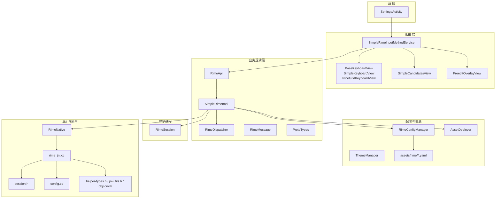
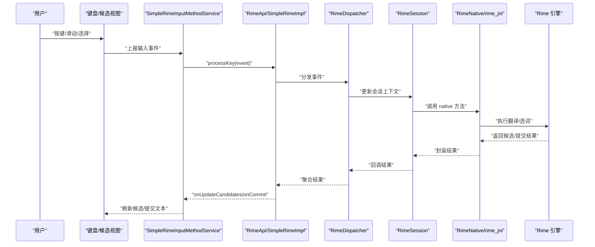
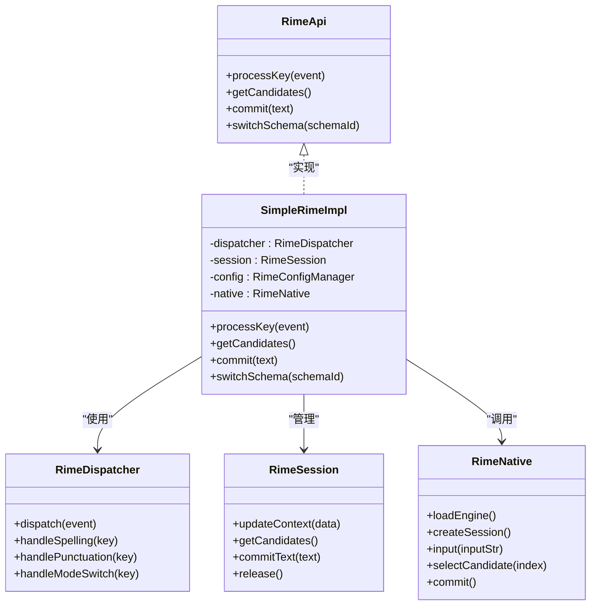
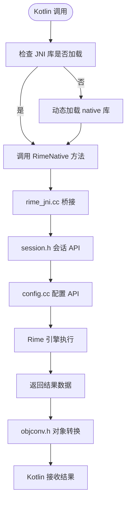
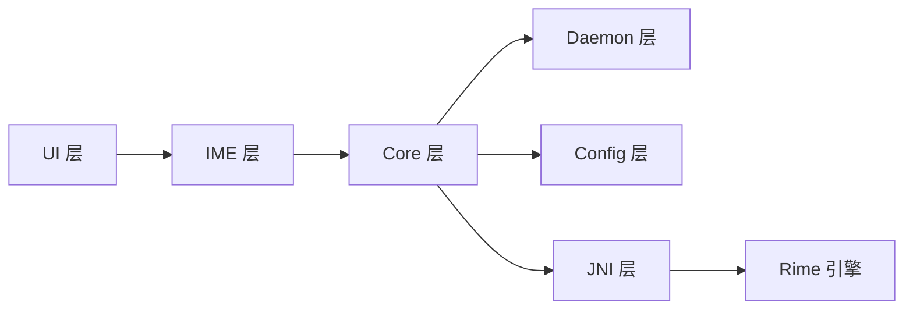

# 分层架构设计

<cite>
**本文引用的文件**   
- [app/src/main/java/com/ziyou/ime/ui/SettingsActivity.kt](file://app/src/main/java/com/ziyou/ime/ui/SettingsActivity.kt)
- [app/src/main/java/com/ziyou/ime/ime/SimpleRimeInputMethodService.kt](file://app/src/main/java/com/ziyou/ime/ime/SimpleRimeInputMethodService.kt)
- [app/src/main/java/com/ziyou/ime/ime/BaseKeyboardView.kt](file://app/src/main/java/com/ziyou/ime/ime/BaseKeyboardView.kt)
- [app/src/main/java/com/ziyou/ime/ime/SimpleKeyboardView.kt](file://app/src/main/java/com/ziyou/ime/ime/SimpleKeyboardView.kt)
- [app/src/main/java/com/ziyou/ime/ime/NineGridKeyboardView.kt](file://app/src/main/java/com/ziyou/ime/ime/NineGridKeyboardView.kt)
- [app/src/main/java/com/ziyou/ime/ime/SimpleCandidatesView.kt](file://app/src/main/java/com/ziyou/ime/ime/SimpleCandidatesView.kt)
- [app/src/main/java/com/ziyou/ime/ime/PreeditOverlayView.kt](file://app/src/main/java/com/ziyou/ime/ime/PreeditOverlayView.kt)
- [app/src/main/java/com/ziyou/ime/core/RimeApi.kt](file://app/src/main/java/com/ziyou/ime/core/RimeApi.kt)
- [app/src/main/java/com/ziyou/ime/core/SimpleRimeImpl.kt](file://app/src/main/java/com/ziyou/ime/core/SimpleRimeImpl.kt)
- [app/src/main/java/com/ziyou/ime/core/RimeDispatcher.kt](file://app/src/main/java/com/ziyou/ime/core/RimeDispatcher.kt)
- [app/src/main/java/com/ziyou/ime/core/RimeNative.kt](file://app/src/main/java/com/ziyou/ime/core/RimeNative.kt)
- [app/src/main/java/com/ziyou/ime/core/RimeMessage.kt](file://app/src/main/java/com/ziyou/ime/core/RimeMessage.kt)
- [app/src/main/java/com/ziyou/ime/core/ProtoTypes.kt](file://app/src/main/java/com/ziyou/ime/core/ProtoTypes.kt)
- [app/src/main/java/com/ziyou/ime/daemon/RimeSession.kt](file://app/src/main/java/com/ziyou/ime/daemon/RimeSession.kt)
- [app/src/main/java/com/ziyou/ime/config/RimeConfigManager.kt](file://app/src/main/java/com/ziyou/ime/config/RimeConfigManager.kt)
- [app/src/main/java/com/ziyou/ime/config/ThemeManager.kt](file://app/src/main/java/com/ziyou/ime/config/ThemeManager.kt)
- [app/src/main/java/com/ziyou/ime/config/AssetDeployer.kt](file://app/src/main/java/com/ziyou/ime/config/AssetDeployer.kt)
- [app/src/main/jni/librime_jni/rime_jni.cc](file://app/src/main/jni/librime_jni/rime_jni.cc)
- [app/src/main/jni/librime_jni/session.h](file://app/src/main/jni/librime_jni/session.h)
- [app/src/main/jni/librime_jni/config.cc](file://app/src/main/jni/librime_jni/config.cc)
- [app/src/main/jni/librime_jni/helper-types.h](file://app/src/main/jni/librime_jni/helper-types.h)
- [app/src/main/jni/librime_jni/jni-utils.h](file://app/src/main/jni/librime_jni/jni-utils.h)
- [app/src/main/jni/librime_jni/objconv.h](file://app/src/main/jni/librime_jni/objconv.h)
- [app/src/main/assets/rime/default.yaml](file://app/src/main/assets/rime/default.yaml)
- [app/src/main/assets/rime/luna_pinyin.schema.yaml](file://app/src/main/assets/rime/luna_pinyin.schema.yaml)
- [app/src/main/assets/rime/cangjie5.schema.yaml](file://app/src/main/assets/rime/cangjie5.schema.yaml)
- [app/src/main/assets/rime/symbols.yaml](file://app/src/main/assets/rime/symbols.yaml)
- [app/src/main/res/xml/input_method.xml](file://app/src/main/res/xml/input_method.xml)
</cite>

## 目录
1. [引言](#引言)
2. [项目结构](#项目结构)
3. [核心组件](#核心组件)
4. [架构总览](#架构总览)
5. [详细组件分析](#详细组件分析)
6. [依赖关系分析](#依赖关系分析)
7. [性能考量](#性能考量)
8. [故障排查指南](#故障排查指南)
9. [结论](#结论)
10. [附录](#附录)

## 引言
本文件面向开发者，系统化阐述 ziyou-ime 的分层架构与实现要点。文档聚焦以下目标：
- UI 层（SettingsActivity、键盘视图等）的职责与交互方式
- 业务逻辑层（RimeApi、SimpleRimeImpl 等）的核心功能与接口设计
- Rime 引擎层的封装与 JNI 原生交互机制
- 各层之间的依赖关系与通信协议
- 数据在各层间的流转过程与异常处理、日志记录等横切关注点
- 为后续扩展与维护提供清晰的层次化开发指导

## 项目结构
项目采用 Android 输入法应用的标准组织方式，按职责划分为 UI、IME、Core、Daemon、Config、JNI 等模块，并附带 Rime 资源与配置。

图表来源
- [app/src/main/java/com/ziyou/ime/ui/SettingsActivity.kt](file://app/src/main/java/com/ziyou/ime/ui/SettingsActivity.kt)
- [app/src/main/java/com/ziyou/ime/ime/SimpleRimeInputMethodService.kt](file://app/src/main/java/com/ziyou/ime/ime/SimpleRimeInputMethodService.kt)
- [app/src/main/java/com/ziyou/ime/ime/BaseKeyboardView.kt](file://app/src/main/java/com/ziyou/ime/ime/BaseKeyboardView.kt)
- [app/src/main/java/com/ziyou/ime/ime/SimpleKeyboardView.kt](file://app/src/main/java/com/ziyou/ime/ime/SimpleKeyboardView.kt)
- [app/src/main/java/com/ziyou/ime/ime/NineGridKeyboardView.kt](file://app/src/main/java/com/ziyou/ime/ime/NineGridKeyboardView.kt)
- [app/src/main/java/com/ziyou/ime/ime/SimpleCandidatesView.kt](file://app/src/main/java/com/ziyou/ime/ime/SimpleCandidatesView.kt)
- [app/src/main/java/com/ziyou/ime/ime/PreeditOverlayView.kt](file://app/src/main/java/com/ziyou/ime/ime/PreeditOverlayView.kt)
- [app/src/main/java/com/ziyou/ime/core/RimeApi.kt](file://app/src/main/java/com/ziyou/ime/core/RimeApi.kt)
- [app/src/main/java/com/ziyou/ime/core/SimpleRimeImpl.kt](file://app/src/main/java/com/ziyou/ime/core/SimpleRimeImpl.kt)
- [app/src/main/java/com/ziyou/ime/core/RimeDispatcher.kt](file://app/src/main/java/com/ziyou/ime/core/RimeDispatcher.kt)
- [app/src/main/java/com/ziyou/ime/core/RimeNative.kt](file://app/src/main/java/com/ziyou/ime/core/RimeNative.kt)
- [app/src/main/java/com/ziyou/ime/daemon/RimeSession.kt](file://app/src/main/java/com/ziyou/ime/daemon/RimeSession.kt)
- [app/src/main/java/com/ziyou/ime/config/RimeConfigManager.kt](file://app/src/main/java/com/ziyou/ime/config/RimeConfigManager.kt)
- [app/src/main/java/com/ziyou/ime/config/ThemeManager.kt](file://app/src/main/java/com/ziyou/ime/config/ThemeManager.kt)
- [app/src/main/java/com/ziyou/ime/config/AssetDeployer.kt](file://app/src/main/java/com/ziyou/ime/config/AssetDeployer.kt)
- [app/src/main/jni/librime_jni/rime_jni.cc](file://app/src/main/jni/librime_jni/rime_jni.cc)
- [app/src/main/jni/librime_jni/session.h](file://app/src/main/jni/librime_jni/session.h)
- [app/src/main/jni/librime_jni/config.cc](file://app/src/main/jni/librime_jni/config.cc)
- [app/src/main/jni/librime_jni/helper-types.h](file://app/src/main/jni/librime_jni/helper-types.h)
- [app/src/main/jni/librime_jni/jni-utils.h](file://app/src/main/jni/librime_jni/jni-utils.h)
- [app/src/main/jni/librime_jni/objconv.h](file://app/src/main/jni/librime_jni/objconv.h)
- [app/src/main/assets/rime/default.yaml](file://app/src/main/assets/rime/default.yaml)
- [app/src/main/assets/rime/luna_pinyin.schema.yaml](file://app/src/main/assets/rime/luna_pinyin.schema.yaml)
- [app/src/main/assets/rime/cangjie5.schema.yaml](file://app/src/main/assets/rime/cangjie5.schema.yaml)
- [app/src/main/assets/rime/symbols.yaml](file://app/src/main/assets/rime/symbols.yaml)

章节来源
- [app/src/main/res/xml/input_method.xml](file://app/src/main/res/xml/input_method.xml)

## 核心组件
- UI 层
  - SettingsActivity：负责输入法设置界面与用户偏好管理，通常通过配置管理器写入主题、候选项样式等。
  - 键盘与候选视图：BaseKeyboardView 作为抽象基类，SimpleKeyboardView、NineGridKeyboardView 分别实现标准九宫格与全键盘布局；SimpleCandidatesView 展示候选词；PreeditOverlayView 显示预编辑文本。
- 业务逻辑层
  - RimeApi：对外暴露的输入处理接口，屏蔽底层实现细节。
  - SimpleRimeImpl：RimeApi 的具体实现，协调调度器、会话、配置与原生调用。
  - RimeDispatcher：消息分发与事件路由，统一处理按键、提交、候选选择等事件。
  - RimeMessage/ProtoTypes：定义跨层通信的数据结构与类型。
- 守护进程
  - RimeSession：封装 Rime 会话生命周期，管理上下文、状态与线程安全。
- 配置与资源
  - RimeConfigManager：加载/合并/保存 Rime 配置。
  - ThemeManager：主题切换与样式参数管理。
  - AssetDeployer：将 assets/rime 下的 schema/dict 等资源部署到运行时目录。
- JNI 与原生
  - RimeNative：Kotlin 侧对 C++ 接口的声明与调用封装。
  - rime_jni.cc/session.h/config.cc：JNI 桥接、会话控制与配置读写。
  - helper-types.h/jni-utils.h/objconv.h：类型转换与工具函数。

章节来源
- [app/src/main/java/com/ziyou/ime/ui/SettingsActivity.kt](file://app/src/main/java/com/ziyou/ime/ui/SettingsActivity.kt)
- [app/src/main/java/com/ziyou/ime/ime/BaseKeyboardView.kt](file://app/src/main/java/com/ziyou/ime/ime/BaseKeyboardView.kt)
- [app/src/main/java/com/ziyou/ime/ime/SimpleKeyboardView.kt](file://app/src/main/java/com/ziyou/ime/ime/SimpleKeyboardView.kt)
- [app/src/main/java/com/ziyou/ime/ime/NineGridKeyboardView.kt](file://app/src/main/java/com/ziyou/ime/ime/NineGridKeyboardView.kt)
- [app/src/main/java/com/ziyou/ime/ime/SimpleCandidatesView.kt](file://app/src/main/java/com/ziyou/ime/ime/SimpleCandidatesView.kt)
- [app/src/main/java/com/ziyou/ime/ime/PreeditOverlayView.kt](file://app/src/main/java/com/ziyou/ime/ime/PreeditOverlayView.kt)
- [app/src/main/java/com/ziyou/ime/core/RimeApi.kt](file://app/src/main/java/com/ziyou/ime/core/RimeApi.kt)
- [app/src/main/java/com/ziyou/ime/core/SimpleRimeImpl.kt](file://app/src/main/java/com/ziyou/ime/core/SimpleRimeImpl.kt)
- [app/src/main/java/com/ziyou/ime/core/RimeDispatcher.kt](file://app/src/main/java/com/ziyou/ime/core/RimeDispatcher.kt)
- [app/src/main/java/com/ziyou/ime/core/RimeMessage.kt](file://app/src/main/java/com/ziyou/ime/core/RimeMessage.kt)
- [app/src/main/java/com/ziyou/ime/core/ProtoTypes.kt](file://app/src/main/java/com/ziyou/ime/core/ProtoTypes.kt)
- [app/src/main/java/com/ziyou/ime/daemon/RimeSession.kt](file://app/src/main/java/com/ziyou/ime/daemon/RimeSession.kt)
- [app/src/main/java/com/ziyou/ime/config/RimeConfigManager.kt](file://app/src/main/java/com/ziyou/ime/config/RimeConfigManager.kt)
- [app/src/main/java/com/ziyou/ime/config/ThemeManager.kt](file://app/src/main/java/com/ziyou/ime/config/ThemeManager.kt)
- [app/src/main/java/com/ziyou/ime/config/AssetDeployer.kt](file://app/src/main/java/com/ziyou/ime/config/AssetDeployer.kt)
- [app/src/main/java/com/ziyou/ime/core/RimeNative.kt](file://app/src/main/java/com/ziyou/ime/core/RimeNative.kt)
- [app/src/main/jni/librime_jni/rime_jni.cc](file://app/src/main/jni/librime_jni/rime_jni.cc)
- [app/src/main/jni/librime_jni/session.h](file://app/src/main/jni/librime_jni/session.h)
- [app/src/main/jni/librime_jni/config.cc](file://app/src/main/jni/librime_jni/config.cc)
- [app/src/main/jni/librime_jni/helper-types.h](file://app/src/main/jni/librime_jni/helper-types.h)
- [app/src/main/jni/librime_jni/jni-utils.h](file://app/src/main/jni/librime_jni/jni-utils.h)
- [app/src/main/jni/librime_jni/objconv.h](file://app/src/main/jni/librime_jni/objconv.h)

## 架构总览
整体采用“UI → IME → Core → Daemon/Config → JNI → Rime 引擎”的分层模型。UI 仅负责展示与用户交互；IME 层承接系统输入事件并驱动 UI 更新；Core 层封装 Rime 能力并提供稳定接口；Daemon 层维护会话与线程隔离；Config 层负责配置与资源部署；JNI 层桥接 Kotlin 与 C++ 原生代码。

图表来源
- [app/src/main/java/com/ziyou/ime/ime/SimpleRimeInputMethodService.kt](file://app/src/main/java/com/ziyou/ime/ime/SimpleRimeInputMethodService.kt)
- [app/src/main/java/com/ziyou/ime/core/RimeApi.kt](file://app/src/main/java/com/ziyou/ime/core/RimeApi.kt)
- [app/src/main/java/com/ziyou/ime/core/SimpleRimeImpl.kt](file://app/src/main/java/com/ziyou/ime/core/SimpleRimeImpl.kt)
- [app/src/main/java/com/ziyou/ime/core/RimeDispatcher.kt](file://app/src/main/java/com/ziyou/ime/core/RimeDispatcher.kt)
- [app/src/main/java/com/ziyou/ime/daemon/RimeSession.kt](file://app/src/main/java/com/ziyou/ime/daemon/RimeSession.kt)
- [app/src/main/java/com/ziyou/ime/core/RimeNative.kt](file://app/src/main/java/com/ziyou/ime/core/RimeNative.kt)
- [app/src/main/jni/librime_jni/rime_jni.cc](file://app/src/main/jni/librime_jni/rime_jni.cc)

## 详细组件分析

### UI 层组件
- SettingsActivity
  - 职责：呈现输入法设置页，读取/写入主题、候选项样式、字体大小等；触发资源部署或配置重载。
  - 交互：通过 ThemeManager 与 RimeConfigManager 进行配置读写；必要时调用 AssetDeployer 部署 schema/dict。
- BaseKeyboardView 及其子类
  - BaseKeyboardView：抽象键盘视图，定义按键绘制、触摸事件捕获、手势识别等通用逻辑。
  - SimpleKeyboardView：标准全键盘布局，支持字母、符号、空格、回车等键位。
  - NineGridKeyboardView：九宫格布局，适配数字键盘与拼音输入场景。
- SimpleCandidatesView
  - 职责：渲染候选列表，响应翻页、选中、长按等操作；与 IME 层同步候选状态。
- PreeditOverlayView
  - 职责：在键盘上方叠加显示预编辑文本，支持光标移动、删除、确认等交互。

章节来源
- [app/src/main/java/com/ziyou/ime/ui/SettingsActivity.kt](file://app/src/main/java/com/ziyou/ime/ui/SettingsActivity.kt)
- [app/src/main/java/com/ziyou/ime/ime/BaseKeyboardView.kt](file://app/src/main/java/com/ziyou/ime/ime/BaseKeyboardView.kt)
- [app/src/main/java/com/ziyou/ime/ime/SimpleKeyboardView.kt](file://app/src/main/java/com/ziyou/ime/ime/SimpleKeyboardView.kt)
- [app/src/main/java/com/ziyou/ime/ime/NineGridKeyboardView.kt](file://app/src/main/java/com/ziyou/ime/ime/NineGridKeyboardView.kt)
- [app/src/main/java/com/ziyou/ime/ime/SimpleCandidatesView.kt](file://app/src/main/java/com/ziyou/ime/ime/SimpleCandidatesView.kt)
- [app/src/main/java/com/ziyou/ime/ime/PreeditOverlayView.kt](file://app/src/main/java/com/ziyou/ime/ime/PreeditOverlayView.kt)

### 业务逻辑层组件
- RimeApi
  - 职责：定义输入处理、候选获取、提交文本等对外接口；屏蔽实现细节，便于替换或扩展。
- SimpleRimeImpl
  - 职责：实现 RimeApi；协调 RimeDispatcher、RimeSession、配置与资源；处理线程切换与回调。
- RimeDispatcher
  - 职责：统一接收来自 UI/IME 的事件，分发给对应处理器（如拼写、标点、切换模式）。
- RimeMessage/ProtoTypes
  - 职责：定义跨层消息结构与类型，保证序列化/反序列化的稳定性。

图表来源
- [app/src/main/java/com/ziyou/ime/core/RimeApi.kt](file://app/src/main/java/com/ziyou/ime/core/RimeApi.kt)
- [app/src/main/java/com/ziyou/ime/core/SimpleRimeImpl.kt](file://app/src/main/java/com/ziyou/ime/core/SimpleRimeImpl.kt)
- [app/src/main/java/com/ziyou/ime/core/RimeDispatcher.kt](file://app/src/main/java/com/ziyou/ime/core/RimeDispatcher.kt)
- [app/src/main/java/com/ziyou/ime/daemon/RimeSession.kt](file://app/src/main/java/com/ziyou/ime/daemon/RimeSession.kt)
- [app/src/main/java/com/ziyou/ime/core/RimeNative.kt](file://app/src/main/java/com/ziyou/ime/core/RimeNative.kt)

章节来源
- [app/src/main/java/com/ziyou/ime/core/RimeApi.kt](file://app/src/main/java/com/ziyou/ime/core/RimeApi.kt)
- [app/src/main/java/com/ziyou/ime/core/SimpleRimeImpl.kt](file://app/src/main/java/com/ziyou/ime/core/SimpleRimeImpl.kt)
- [app/src/main/java/com/ziyou/ime/core/RimeDispatcher.kt](file://app/src/main/java/com/ziyou/ime/core/RimeDispatcher.kt)
- [app/src/main/java/com/ziyou/ime/core/RimeMessage.kt](file://app/src/main/java/com/ziyou/ime/core/RimeMessage.kt)
- [app/src/main/java/com/ziyou/ime/core/ProtoTypes.kt](file://app/src/main/java/com/ziyou/ime/core/ProtoTypes.kt)

### 守护进程与会话
- RimeSession
  - 职责：封装 Rime 会话的生命周期，包括创建、上下文更新、候选获取、提交与释放；确保线程安全与状态一致性。
  - 交互：被 SimpleRimeImpl 调用，内部通过 RimeNative 与 JNI 交互。

章节来源
- [app/src/main/java/com/ziyou/ime/daemon/RimeSession.kt](file://app/src/main/java/com/ziyou/ime/daemon/RimeSession.kt)
- [app/src/main/java/com/ziyou/ime/core/RimeNative.kt](file://app/src/main/java/com/ziyou/ime/core/RimeNative.kt)

### 配置与资源管理
- RimeConfigManager
  - 职责：加载 default.yaml、schema 配置文件，合并用户自定义配置，提供查询与更新接口。
- ThemeManager
  - 职责：管理主题相关参数（颜色、字体、候选框样式），供 UI 层实时切换。
- AssetDeployer
  - 职责：将 assets/rime 下的 schema/dict 部署到运行时目录，确保 Rime 可正确加载。

章节来源
- [app/src/main/java/com/ziyou/ime/config/RimeConfigManager.kt](file://app/src/main/java/com/ziyou/ime/config/RimeConfigManager.kt)
- [app/src/main/java/com/ziyou/ime/config/ThemeManager.kt](file://app/src/main/java/com/ziyou/ime/config/ThemeManager.kt)
- [app/src/main/java/com/ziyou/ime/config/AssetDeployer.kt](file://app/src/main/java/com/ziyou/ime/config/AssetDeployer.kt)
- [app/src/main/assets/rime/default.yaml](file://app/src/main/assets/rime/default.yaml)
- [app/src/main/assets/rime/luna_pinyin.schema.yaml](file://app/src/main/assets/rime/luna_pinyin.schema.yaml)
- [app/src/main/assets/rime/cangjie5.schema.yaml](file://app/src/main/assets/rime/cangjie5.schema.yaml)
- [app/src/main/assets/rime/symbols.yaml](file://app/src/main/assets/rime/symbols.yaml)

### JNI 与原生交互
- RimeNative
  - 职责：声明 native 方法，完成 Kotlin 与 C++ 的参数转换与调用。
- rime_jni.cc/session.h/config.cc
  - 职责：实现 JNI 入口、会话控制、配置读写；与 Rime 引擎 API 对接。
- helper-types.h/jni-utils.h/objconv.h
  - 职责：提供类型转换、字符串编解码、对象映射等工具。

图表来源
- [app/src/main/java/com/ziyou/ime/core/RimeNative.kt](file://app/src/main/java/com/ziyou/ime/core/RimeNative.kt)
- [app/src/main/jni/librime_jni/rime_jni.cc](file://app/src/main/jni/librime_jni/rime_jni.cc)
- [app/src/main/jni/librime_jni/session.h](file://app/src/main/jni/librime_jni/session.h)
- [app/src/main/jni/librime_jni/config.cc](file://app/src/main/jni/librime_jni/config.cc)
- [app/src/main/jni/librime_jni/helper-types.h](file://app/src/main/jni/librime_jni/helper-types.h)
- [app/src/main/jni/librime_jni/jni-utils.h](file://app/src/main/jni/librime_jni/jni-utils.h)
- [app/src/main/jni/librime_jni/objconv.h](file://app/src/main/jni/librime_jni/objconv.h)

章节来源
- [app/src/main/java/com/ziyou/ime/core/RimeNative.kt](file://app/src/main/java/com/ziyou/ime/core/RimeNative.kt)
- [app/src/main/jni/librime_jni/rime_jni.cc](file://app/src/main/jni/librime_jni/rime_jni.cc)
- [app/src/main/jni/librime_jni/session.h](file://app/src/main/jni/librime_jni/session.h)
- [app/src/main/jni/librime_jni/config.cc](file://app/src/main/jni/librime_jni/config.cc)
- [app/src/main/jni/librime_jni/helper-types.h](file://app/src/main/jni/librime_jni/helper-types.h)
- [app/src/main/jni/librime_jni/jni-utils.h](file://app/src/main/jni/librime_jni/jni-utils.h)
- [app/src/main/jni/librime_jni/objconv.h](file://app/src/main/jni/librime_jni/objconv.h)

## 依赖关系分析
- 耦合度
  - UI 层仅依赖 IME 层提供的回调与状态；不直接访问 Core/JNI。
  - IME 层依赖 Core 层接口，避免感知底层实现。
  - Core 层依赖 Daemon/Config/JNI，但通过接口解耦。
- 通信协议
  - 事件流：按键/手势事件由 UI→IME→Core→Dispatcher→Session→JNI→Rime。
  - 数据流：候选/提交结果沿反向路径回传至 UI 更新。
  - 配置流：SettingsActivity→ConfigManager→AssetDeployer→Rime 引擎。
- 潜在循环依赖
  - 当前分层清晰，未见循环引用；建议保持单向依赖。

图表来源
- [app/src/main/java/com/ziyou/ime/ime/SimpleRimeInputMethodService.kt](file://app/src/main/java/com/ziyou/ime/ime/SimpleRimeInputMethodService.kt)
- [app/src/main/java/com/ziyou/ime/core/RimeApi.kt](file://app/src/main/java/com/ziyou/ime/core/RimeApi.kt)
- [app/src/main/java/com/ziyou/ime/daemon/RimeSession.kt](file://app/src/main/java/com/ziyou/ime/daemon/RimeSession.kt)
- [app/src/main/java/com/ziyou/ime/config/RimeConfigManager.kt](file://app/src/main/java/com/ziyou/ime/config/RimeConfigManager.kt)
- [app/src/main/java/com/ziyou/ime/core/RimeNative.kt](file://app/src/main/java/com/ziyou/ime/core/RimeNative.kt)
- [app/src/main/jni/librime_jni/rime_jni.cc](file://app/src/main/jni/librime_jni/rime_jni.cc)

章节来源
- [app/src/main/java/com/ziyou/ime/ime/SimpleRimeInputMethodService.kt](file://app/src/main/java/com/ziyou/ime/ime/SimpleRimeInputMethodService.kt)
- [app/src/main/java/com/ziyou/ime/core/RimeApi.kt](file://app/src/main/java/com/ziyou/ime/core/RimeApi.kt)
- [app/src/main/java/com/ziyou/ime/daemon/RimeSession.kt](file://app/src/main/java/com/ziyou/ime/daemon/RimeSession.kt)
- [app/src/main/java/com/ziyou/ime/config/RimeConfigManager.kt](file://app/src/main/java/com/ziyou/ime/config/RimeConfigManager.kt)
- [app/src/main/java/com/ziyou/ime/core/RimeNative.kt](file://app/src/main/java/com/ziyou/ime/core/RimeNative.kt)
- [app/src/main/jni/librime_jni/rime_jni.cc](file://app/src/main/jni/librime_jni/rime_jni.cc)

## 性能考量
- 线程模型
  - JNI 调用应置于后台线程，避免阻塞 UI 主线程；回调需切回主线程更新视图。
- 内存管理
  - 合理复用 RimeSession，避免频繁创建销毁；及时释放 native 资源。
- I/O 优化
  - 配置与资源部署应在启动时异步完成，避免冷启动卡顿。
- 渲染优化
  - 候选列表分页加载，减少一次性渲染开销；预编辑视图增量更新。

[本节为通用指导，无需具体文件来源]

## 故障排查指南
- 常见问题
  - 引擎未加载：检查 native 库加载顺序与 ABI 匹配。
  - 配置错误：校验 YAML 语法与 schema 引用是否正确。
  - 候选为空：确认输入编码与 schema 匹配，检查字典部署路径。
- 定位手段
  - 在 JNI 层添加关键日志输出，追踪输入串与返回结果。
  - 使用配置管理器打印当前生效的配置快照。
  - 在 UI 层记录事件流与回调时序，辅助复现问题。

章节来源
- [app/src/main/jni/librime_jni/rime_jni.cc](file://app/src/main/jni/librime_jni/rime_jni.cc)
- [app/src/main/java/com/ziyou/ime/config/RimeConfigManager.kt](file://app/src/main/java/com/ziyou/ime/config/RimeConfigManager.kt)
- [app/src/main/java/com/ziyou/ime/ime/SimpleRimeInputMethodService.kt](file://app/src/main/java/com/ziyou/ime/ime/SimpleRimeInputMethodService.kt)

## 结论
ziyou-ime 的分层架构清晰、职责明确，通过 IME 层与 Core 层解耦 UI 与引擎，借助 Daemon/Config/JNI 实现稳定的会话管理与原生交互。遵循本指南进行开发，可有效降低耦合、提升可维护性与可扩展性。

[本节为总结性内容，无需具体文件来源]

## 附录
- 输入法清单注册
  - input_method.xml 定义了输入法服务入口与属性，确保系统能正确识别与启用。
- 资源与配置
  - assets/rime 下包含默认配置与各语言 schema，按需启用或替换。

章节来源
- [app/src/main/res/xml/input_method.xml](file://app/src/main/res/xml/input_method.xml)
- [app/src/main/assets/rime/default.yaml](file://app/src/main/assets/rime/default.yaml)
- [app/src/main/assets/rime/luna_pinyin.schema.yaml](file://app/src/main/assets/rime/luna_pinyin.schema.yaml)
- [app/src/main/assets/rime/cangjie5.schema.yaml](file://app/src/main/assets/rime/cangjie5.schema.yaml)
- [app/src/main/assets/rime/symbols.yaml](file://app/src/main/assets/rime/symbols.yaml)