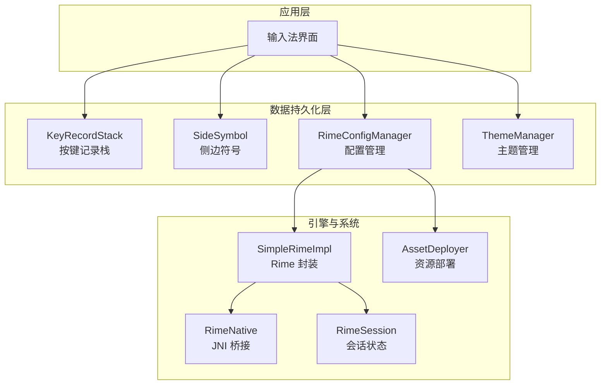
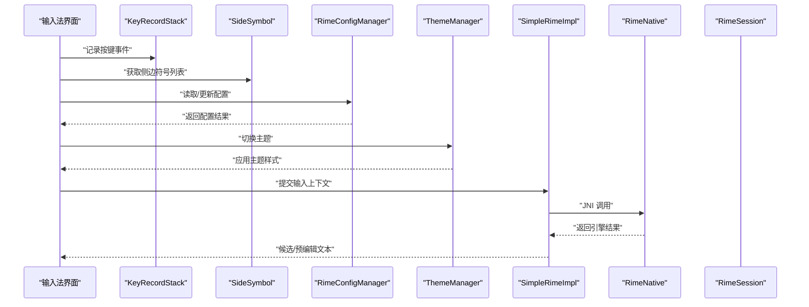
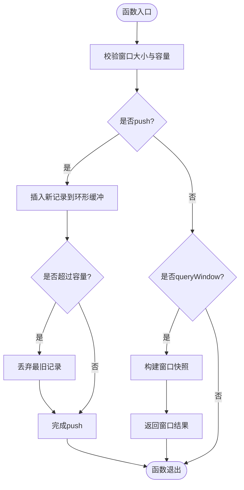
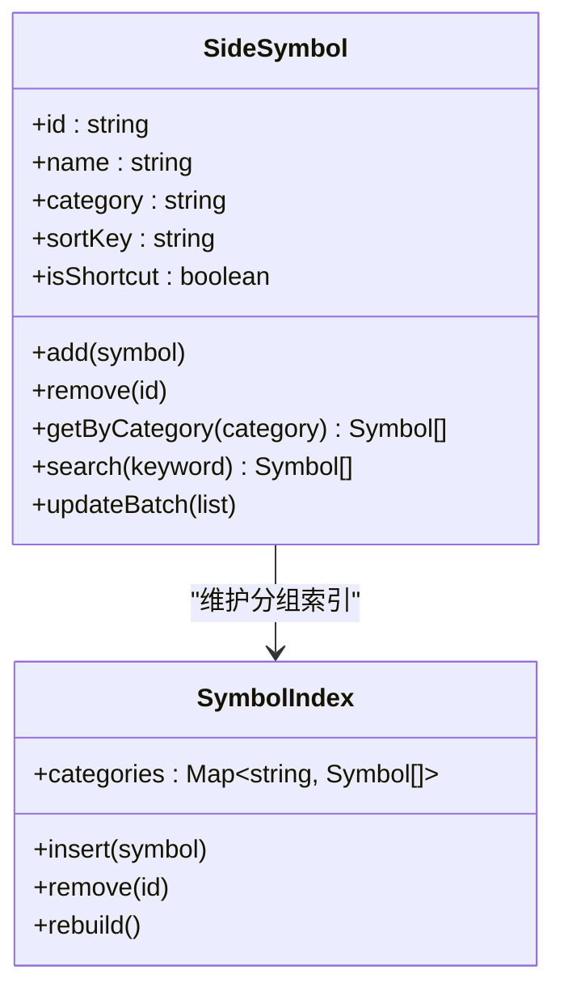
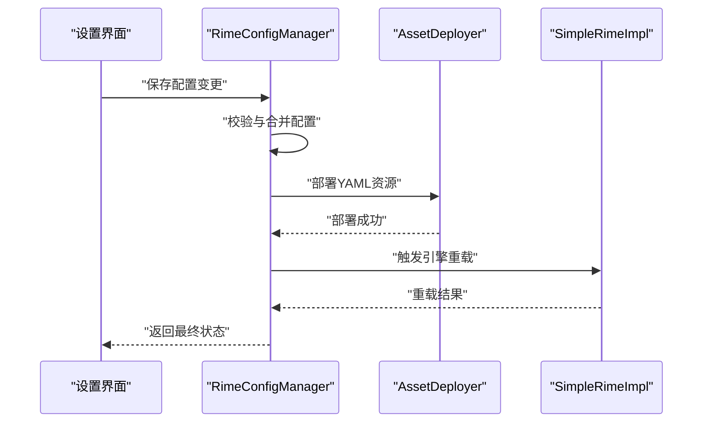
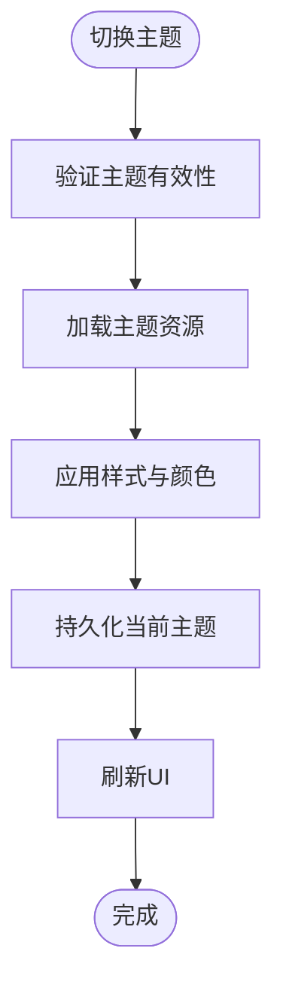
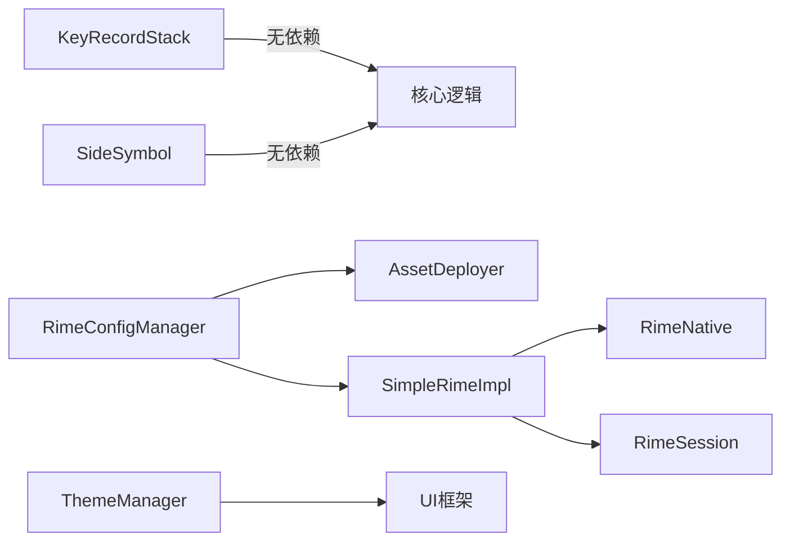

# 数据持久化层

<cite>
**本文引用的文件**   
- [KeyRecordStack.kt](file://app/src/main/java/com/ziyou/ime/data/KeyRecordStack.kt)
- [SideSymbol.kt](file://app/src/main/java/com/ziyou/ime/data/SideSymbol.kt)
- [RimeConfigManager.kt](file://app/src/main/java/com/ziyou/ime/config/RimeConfigManager.kt)
- [ThemeManager.kt](file://app/src/main/java/com/ziyou/ime/config/ThemeManager.kt)
- [AssetDeployer.kt](file://app/src/main/java/com/ziyou/ime/config/AssetDeployer.kt)
- [SimpleRimeImpl.kt](file://app/src/main/java/com/ziyou/ime/core/SimpleRimeImpl.kt)
- [RimeNative.kt](file://app/src/main/java/com/ziyou/ime/core/RimeNative.kt)
- [RimeSession.kt](file://app/src/main/java/com/ziyou/ime/daemon/RimeSession.kt)
</cite>

## 目录
1. [简介](#简介)
2. [项目结构](#项目结构)
3. [核心组件](#核心组件)
4. [架构总览](#架构总览)
5. [详细组件分析](#详细组件分析)
6. [依赖关系分析](#依赖关系分析)
7. [性能考量](#性能考量)
8. [故障排查指南](#故障排查指南)
9. [结论](#结论)
10. [附录](#附录)

## 简介
本文件聚焦 ziyou-ime 的数据持久化层，围绕以下关键能力展开：按键记录栈 KeyRecordStack、侧边符号 SideSymbol、Rime 配置管理 RimeConfigManager、主题管理 ThemeManager。文档将说明各组件的数据结构与算法、缓存与序列化策略、备份恢复与迁移方案，并给出可扩展的自定义数据存储接口设计建议，帮助读者快速理解与扩展该层的实现。

## 项目结构
数据持久化相关代码主要位于 app/src/main/java/com/ziyou/ime 下的 data、config、core、daemon 等包中：
- data：按键记录栈与侧边符号等运行时数据的内存存储
- config：Rime 配置部署与管理、主题资源管理与切换
- core：Rime 引擎封装与 JNI 交互
- daemon：会话级状态与生命周期管理

图表来源 
- [KeyRecordStack.kt](file://app/src/main/java/com/ziyou/ime/data/KeyRecordStack.kt)
- [SideSymbol.kt](file://app/src/main/java/com/ziyou/ime/data/SideSymbol.kt)
- [RimeConfigManager.kt](file://app/src/main/java/com/ziyou/ime/config/RimeConfigManager.kt)
- [ThemeManager.kt](file://app/src/main/java/com/ziyou/ime/config/ThemeManager.kt)
- [AssetDeployer.kt](file://app/src/main/java/com/ziyou/ime/config/AssetDeployer.kt)
- [SimpleRimeImpl.kt](file://app/src/main/java/com/ziyou/ime/core/SimpleRimeImpl.kt)
- [RimeNative.kt](file://app/src/main/java/com/ziyou/ime/core/RimeNative.kt)
- [RimeSession.kt](file://app/src/main/java/com/ziyou/ime/daemon/RimeSession.kt)

章节来源
- [KeyRecordStack.kt](file://app/src/main/java/com/ziyou/ime/data/KeyRecordStack.kt)
- [SideSymbol.kt](file://app/src/main/java/com/ziyou/ime/data/SideSymbol.kt)
- [RimeConfigManager.kt](file://app/src/main/java/com/ziyou/ime/config/RimeConfigManager.kt)
- [ThemeManager.kt](file://app/src/main/java/com/ziyou/ime/config/ThemeManager.kt)
- [AssetDeployer.kt](file://app/src/main/java/com/ziyou/ime/config/AssetDeployer.kt)
- [SimpleRimeImpl.kt](file://app/src/main/java/com/ziyou/ime/core/SimpleRimeImpl.kt)
- [RimeNative.kt](file://app/src/main/java/com/ziyou/ime/core/RimeNative.kt)
- [RimeSession.kt](file://app/src/main/java/com/ziyou/ime/daemon/RimeSession.kt)

## 核心组件
本节概述四大核心组件的职责与协作方式：
- KeyRecordStack：维护最近按键序列的环形缓冲，支持滑动窗口查询与统计，用于候选词排序或输入行为分析。
- SideSymbol：管理侧边栏符号集合及其分组、排序与快速检索，提供按类别过滤与动态更新能力。
- RimeConfigManager：负责 Rime 配置的加载、合并、校验、热更新与持久化（YAML），并与 AssetDeployer 协同完成资源部署。
- ThemeManager：管理主题资源的元数据、选择与切换，确保 UI 与输入法外观一致。

章节来源
- [KeyRecordStack.kt](file://app/src/main/java/com/ziyou/ime/data/KeyRecordStack.kt)
- [SideSymbol.kt](file://app/src/main/java/com/ziyou/ime/data/SideSymbol.kt)
- [RimeConfigManager.kt](file://app/src/main/java/com/ziyou/ime/config/RimeConfigManager.kt)
- [ThemeManager.kt](file://app/src/main/java/com/ziyou/ime/config/ThemeManager.kt)

## 架构总览
数据持久化层在输入流程中的位置如下：
- 输入事件进入后，UI 层调用 KeyRecordStack 记录按键历史；同时根据当前模式从 SideSymbol 获取可用符号集。
- 配置变更通过 RimeConfigManager 统一处理，必要时触发 AssetDeployer 重新部署资源。
- 主题切换由 ThemeManager 协调，更新 UI 与渲染参数。
- 与 Rime 引擎的交互通过 SimpleRimeImpl 与 RimeNative 进行，会话状态由 RimeSession 管理。

图表来源 
- [KeyRecordStack.kt](file://app/src/main/java/com/ziyou/ime/data/KeyRecordStack.kt)
- [SideSymbol.kt](file://app/src/main/java/com/ziyou/ime/data/SideSymbol.kt)
- [RimeConfigManager.kt](file://app/src/main/java/com/ziyou/ime/config/RimeConfigManager.kt)
- [ThemeManager.kt](file://app/src/main/java/com/ziyou/ime/config/ThemeManager.kt)
- [SimpleRimeImpl.kt](file://app/src/main/java/com/ziyou/ime/core/SimpleRimeImpl.kt)
- [RimeNative.kt](file://app/src/main/java/com/ziyou/ime/core/RimeNative.kt)
- [RimeSession.kt](file://app/src/main/java/com/ziyou/ime/daemon/RimeSession.kt)

## 详细组件分析

### KeyRecordStack：按键记录栈
- 数据结构设计
  - 采用固定容量的环形缓冲，避免频繁扩容带来的开销。
  - 每个元素包含键码、时间戳与可选权重，便于后续统计与排序。
- 核心操作
  - push：插入新按键，若满则丢弃最旧项，保持窗口大小恒定。
  - queryWindow：返回最近 N 条记录，支持倒序或正序。
  - countByType：按类型聚合计数，用于高频键识别。
  - clear/reset：清空或重置统计信息。
- 复杂度分析
  - push：O(1)
  - queryWindow：O(N)，N 为窗口大小
  - countByType：O(M)，M 为记录数
- 错误与边界
  - 容量为 0 时直接返回空结果
  - 负数窗口大小被修正为正数
- 使用场景
  - 候选词排序依据近期按键频率
  - 输入行为分析与优化

图表来源 
- [KeyRecordStack.kt](file://app/src/main/java/com/ziyou/ime/data/KeyRecordStack.kt)

章节来源
- [KeyRecordStack.kt](file://app/src/main/java/com/ziyou/ime/data/KeyRecordStack.kt)

### SideSymbol：侧边符号管理
- 数据结构设计
  - 符号条目包含标识、显示名称、分类、排序键与快捷访问标记。
  - 分组索引用于快速按类别筛选。
- 核心操作
  - add/remove：动态增删符号
  - getByCategory：按分类检索
  - sort/update：排序与批量更新
  - search：按名称或关键字模糊匹配
- 性能特性
  - 分组索引 O(1) 查找
  - 搜索采用前缀或子串匹配，复杂度与条目数量线性相关
- 扩展点
  - 支持插件式分类器与自定义排序规则

图表来源 
- [SideSymbol.kt](file://app/src/main/java/com/ziyou/ime/data/SideSymbol.kt)

章节来源
- [SideSymbol.kt](file://app/src/main/java/com/ziyou/ime/data/SideSymbol.kt)

### RimeConfigManager：配置管理与序列化
- 职责范围
  - 加载默认与用户配置，执行合并与校验
  - 监听配置变更并触发热更新
  - 与 AssetDeployer 协作部署 YAML 资源
  - 提供配置快照与回滚能力
- 序列化方案
  - 基于 YAML 的文本序列化，便于人工编辑与版本控制
  - 内部使用结构化对象映射，保证类型安全
- 热更新流程
  - 检测变更 -> 校验语法 -> 合并配置 -> 通知引擎重载
- 备份与恢复
  - 自动创建带时间戳的备份副本
  - 支持恢复到指定版本

图表来源 
- [RimeConfigManager.kt](file://app/src/main/java/com/ziyou/ime/config/RimeConfigManager.kt)
- [AssetDeployer.kt](file://app/src/main/java/com/ziyou/ime/config/AssetDeployer.kt)
- [SimpleRimeImpl.kt](file://app/src/main/java/com/ziyou/ime/core/SimpleRimeImpl.kt)

章节来源
- [RimeConfigManager.kt](file://app/src/main/java/com/ziyou/ime/config/RimeConfigManager.kt)
- [AssetDeployer.kt](file://app/src/main/java/com/ziyou/ime/config/AssetDeployer.kt)

### ThemeManager：主题数据存储与切换逻辑
- 数据存储
  - 主题元数据包括名称、资源路径、颜色映射与字体配置
  - 当前主题状态持久化至本地存储，确保重启后保持一致
- 切换逻辑
  - 验证主题有效性 -> 加载资源 -> 应用样式 -> 刷新 UI
  - 支持预览与回退机制
- 缓存策略
  - 已加载主题资源缓存，避免重复 IO
  - 大资源按需懒加载

图表来源 
- [ThemeManager.kt](file://app/src/main/java/com/ziyou/ime/config/ThemeManager.kt)

章节来源
- [ThemeManager.kt](file://app/src/main/java/com/ziyou/ime/config/ThemeManager.kt)

## 依赖关系分析
数据持久化层与引擎及系统组件的依赖关系如下：
- KeyRecordStack 与 SideSymbol 为纯内存结构，无外部依赖
- RimeConfigManager 依赖 AssetDeployer 与 SimpleRimeImpl
- ThemeManager 依赖资源系统与 UI 框架
- SimpleRimeImpl 通过 RimeNative 与底层 C++ 库交互，会话状态由 RimeSession 管理

图表来源 
- [KeyRecordStack.kt](file://app/src/main/java/com/ziyou/ime/data/KeyRecordStack.kt)
- [SideSymbol.kt](file://app/src/main/java/com/ziyou/ime/data/SideSymbol.kt)
- [RimeConfigManager.kt](file://app/src/main/java/com/ziyou/ime/config/RimeConfigManager.kt)
- [ThemeManager.kt](file://app/src/main/java/com/ziyou/ime/config/ThemeManager.kt)
- [AssetDeployer.kt](file://app/src/main/java/com/ziyou/ime/config/AssetDeployer.kt)
- [SimpleRimeImpl.kt](file://app/src/main/java/com/ziyou/ime/core/SimpleRimeImpl.kt)
- [RimeNative.kt](file://app/src/main/java/com/ziyou/ime/core/RimeNative.kt)
- [RimeSession.kt](file://app/src/main/java/com/ziyou/ime/daemon/RimeSession.kt)

章节来源
- [KeyRecordStack.kt](file://app/src/main/java/com/ziyou/ime/data/KeyRecordStack.kt)
- [SideSymbol.kt](file://app/src/main/java/com/ziyou/ime/data/SideSymbol.kt)
- [RimeConfigManager.kt](file://app/src/main/java/com/ziyou/ime/config/RimeConfigManager.kt)
- [ThemeManager.kt](file://app/src/main/java/com/ziyou/ime/config/ThemeManager.kt)
- [AssetDeployer.kt](file://app/src/main/java/com/ziyou/ime/config/AssetDeployer.kt)
- [SimpleRimeImpl.kt](file://app/src/main/java/com/ziyou/ime/core/SimpleRimeImpl.kt)
- [RimeNative.kt](file://app/src/main/java/com/ziyou/ime/core/RimeNative.kt)
- [RimeSession.kt](file://app/src/main/java/com/ziyou/ime/daemon/RimeSession.kt)

## 性能考量
- KeyRecordStack
  - 环形缓冲避免内存分配抖动，适合高频写入场景
  - 窗口查询可考虑并行聚合以提升大数据量时的吞吐
- SideSymbol
  - 分组索引提升筛选效率，搜索可引入 Trie 或倒排索引以加速
  - 批量更新应合并排序与索引重建，减少中间态
- RimeConfigManager
  - YAML 解析与合并应在后台线程执行，避免阻塞主线程
  - 配置变更采用增量更新策略，降低引擎重载成本
- ThemeManager
  - 资源加载采用懒加载与缓存，避免重复 IO
  - 主题切换时仅刷新必要 UI 节点，减少重绘开销

[本节为通用指导，不直接分析具体文件]

## 故障排查指南
- KeyRecordStack
  - 症状：窗口查询结果为空或顺序异常
  - 排查：检查容量设置与 push/query 调用时序
- SideSymbol
  - 症状：分类检索缺失或排序错乱
  - 排查：确认分组索引重建时机与排序键一致性
- RimeConfigManager
  - 症状：配置未生效或引擎重载失败
  - 排查：查看 YAML 语法校验日志与部署状态
- ThemeManager
  - 症状：主题切换后 UI 未更新
  - 排查：检查资源路径与样式应用回调是否触发

章节来源
- [RimeConfigManager.kt](file://app/src/main/java/com/ziyou/ime/config/RimeConfigManager.kt)
- [ThemeManager.kt](file://app/src/main/java/com/ziyou/ime/config/ThemeManager.kt)

## 结论
ziyou-ime 的数据持久化层以内存高效结构为核心，结合 YAML 配置与资源管理，形成稳定可靠的输入体验基础。KeyRecordStack 与 SideSymbol 提供高性能的运行时数据支撑，RimeConfigManager 与 ThemeManager 保障配置与外观的可控性。通过合理的缓存、备份与迁移策略，系统在易用性与稳定性之间取得平衡。未来可在搜索索引、并发处理与异步任务调度方面进一步优化。

[本节为总结，不直接分析具体文件]

## 附录

### 数据缓存策略
- 按键记录：环形缓冲固定容量，避免 GC 压力
- 侧边符号：分组索引与搜索缓存，按需失效
- 配置：内存缓存最新有效配置，磁盘备份历史版本
- 主题：资源缓存与懒加载，切换时增量更新

### 备份恢复机制
- 自动备份：每次配置变更后生成带时间戳的副本
- 手动恢复：列出备份清单，支持选择恢复目标
- 一致性校验：恢复前校验完整性与兼容性

### 数据迁移方案
- 版本化：为配置与主题定义版本号
- 迁移脚本：按版本差异执行字段映射与格式转换
- 回滚策略：迁移失败时自动回滚至上一版本

### 自定义数据存储接口扩展指南
- 定义抽象接口
  - 定义统一的读写、查询与事务接口
  - 提供默认实现与适配器
- 实现自定义存储
  - 继承抽象接口，实现具体存储逻辑
  - 注册为可用后端，支持运行时切换
- 集成与测试
  - 注入依赖，替换默认实现
  - 编写单元测试覆盖边界条件

[本节为概念性内容，不直接分析具体文件]