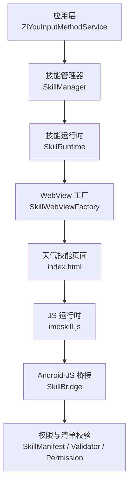
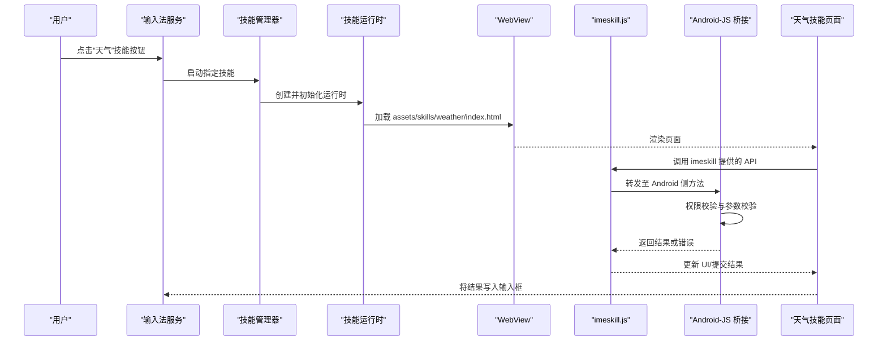
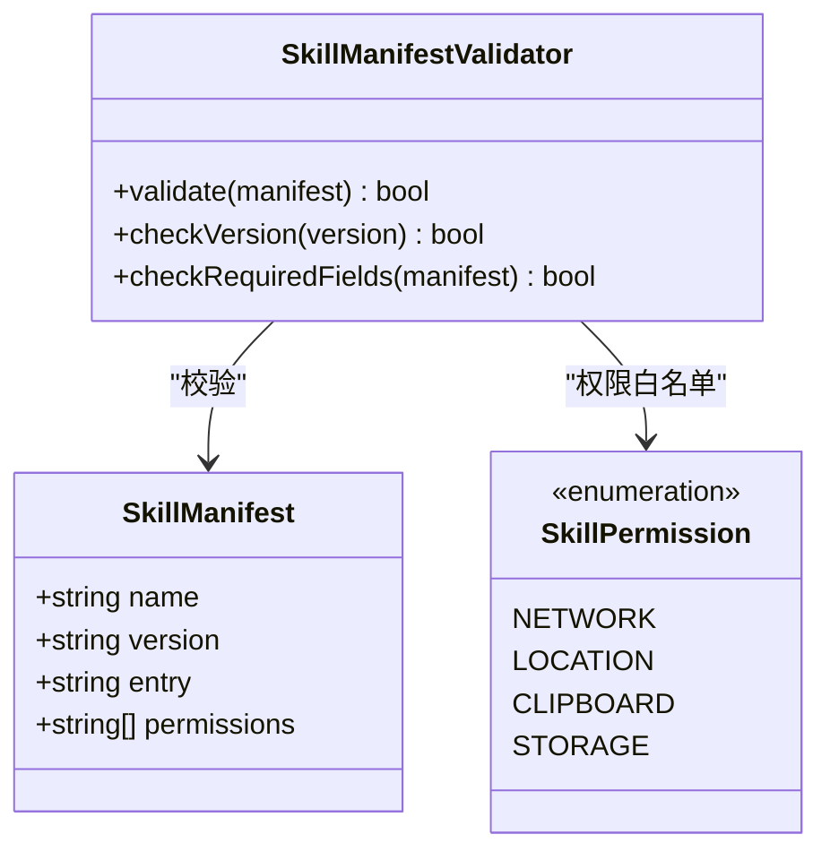
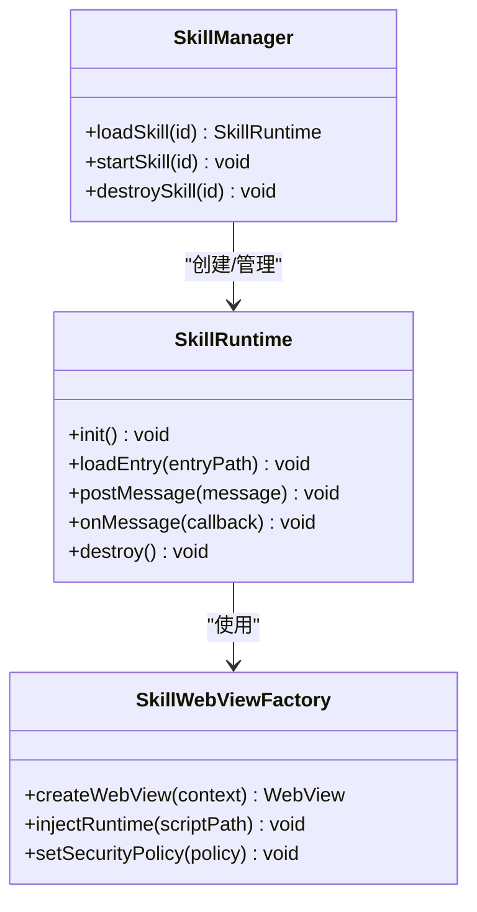
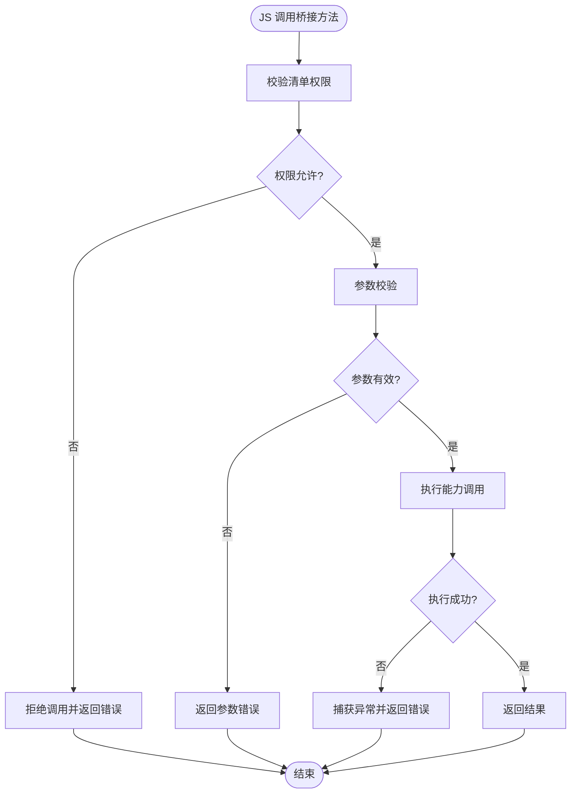
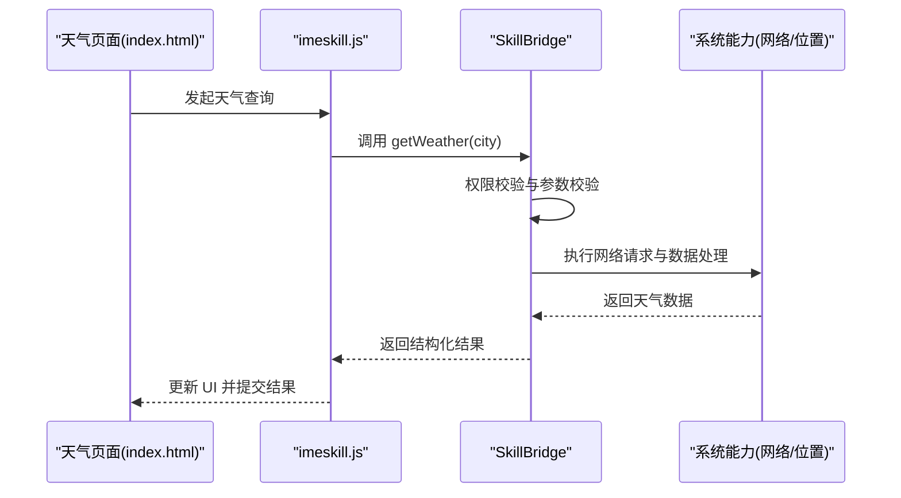
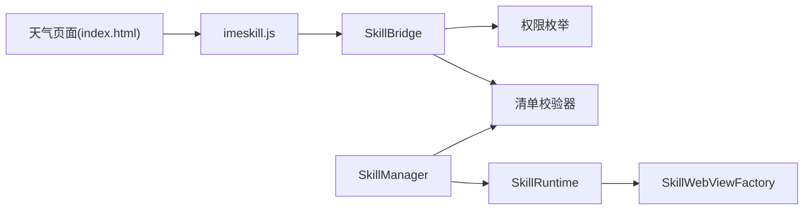

# 天气技能 (Weather Skill v1.1)

<cite>
**本文引用的文件**   
- [app/src/main/assets/skills/weather/index.html](file://app/src/main/assets/skills/weather/index.html)
- [app/src/main/assets/skills/weather/manifest.json](file://app/src/main/assets/skills/weather/manifest.json)
- [app/src/main/assets/skill_runtime/imeskill.js](file://app/src/main/assets/skill_runtime/imeskill.js)
- [app/src/main/java/com/ziyou/ime/skill/SkillManager.kt](file://app/src/main/java/com/ziyou/ime/skill/SkillManager.kt)
- [app/src/main/java/com/ziyou/ime/skill/SkillRuntime.kt](file://app/src/main/java/com/ziyou/ime/skill/SkillRuntime.kt)
- [app/src/main/java/com/ziyou/ime/skill/SkillWebViewFactory.kt](file://app/src/main/java/com/ziyou/ime/skill/SkillWebViewFactory.kt)
- [app/src/main/java/com/ziyou/ime/skill/SkillBridge.kt](file://app/src/main/java/com/ziyou/ime/skill/SkillBridge.kt)
- [core-logic/src/main/java/com/ziyou/ime/core/skill/SkillManifest.kt](file://core-logic/src/main/java/com/ziyou/ime/core/skill/SkillManifest.kt)
- [core-logic/src/main/java/com/ziyou/ime/core/skill/SkillManifestValidator.kt](file://core-logic/src/main/java/com/ziyou/ime/core/skill/SkillManifestValidator.kt)
- [core-logic/src/main/java/com/ziyou/ime/core/skill/SkillPermission.kt](file://core-logic/src/main/java/com/ziyou/ime/core/skill/SkillPermission.kt)
</cite>

## 目录
1. [简介](#简介)
2. [项目结构](#项目结构)
3. [核心组件](#核心组件)
4. [架构总览](#架构总览)
5. [详细组件分析](#详细组件分析)
6. [依赖关系分析](#依赖关系分析)
7. [性能考虑](#性能考虑)
8. [故障排查指南](#故障排查指南)
9. [结论](#结论)
10. [附录](#附录)

## 简介
本文件聚焦于输入法“技能插件系统”中的“天气技能（Weather Skill v1.1）”。该技能以 Web 页面形式提供，通过输入法的技能运行时与 Android 端桥接通信，实现从键盘面板触发、获取用户上下文、调用网络能力并回写结果到输入框的完整流程。文档将从系统架构、数据流、关键类与接口、错误处理与性能优化等方面进行全面解析，帮助开发者快速理解并扩展此类技能。

## 项目结构
天气技能由两部分组成：
- 前端资源：位于 assets/skills/weather 目录下，包含 index.html 与 manifest.json，定义技能的界面与元信息。
- 运行时与桥接：位于 app 模块的 skill 包中，负责加载、运行、权限校验以及与 WebView 交互。

图表来源
- [app/src/main/java/com/ziyou/ime/skill/SkillManager.kt](file://app/src/main/java/com/ziyou/ime/skill/SkillManager.kt)
- [app/src/main/java/com/ziyou/ime/skill/SkillRuntime.kt](file://app/src/main/java/com/ziyou/ime/skill/SkillRuntime.kt)
- [app/src/main/java/com/ziyou/ime/skill/SkillWebViewFactory.kt](file://app/src/main/java/com/ziyou/ime/skill/SkillWebViewFactory.kt)
- [app/src/main/assets/skills/weather/index.html](file://app/src/main/assets/skills/weather/index.html)
- [app/src/main/assets/skill_runtime/imeskill.js](file://app/src/main/assets/skill_runtime/imeskill.js)
- [core-logic/src/main/java/com/ziyou/ime/core/skill/SkillManifest.kt](file://core-logic/src/main/java/com/ziyou/ime/core/skill/SkillManifest.kt)
- [core-logic/src/main/java/com/ziyou/ime/core/skill/SkillManifestValidator.kt](file://core-logic/src/main/java/com/ziyou/ime/core/skill/SkillManifestValidator.kt)
- [core-logic/src/main/java/com/ziyou/ime/core/skill/SkillPermission.kt](file://core-logic/src/main/java/com/ziyou/ime/core/skill/SkillPermission.kt)

章节来源
- [app/src/main/assets/skills/weather/index.html](file://app/src/main/assets/skills/weather/index.html)
- [app/src/main/assets/skills/weather/manifest.json](file://app/src/main/assets/skills/weather/manifest.json)
- [app/src/main/assets/skill_runtime/imeskill.js](file://app/src/main/assets/skill_runtime/imeskill.js)
- [app/src/main/java/com/ziyou/ime/skill/SkillManager.kt](file://app/src/main/java/com/ziyou/ime/skill/SkillManager.kt)
- [app/src/main/java/com/ziyou/ime/skill/SkillRuntime.kt](file://app/src/main/java/com/ziyou/ime/skill/SkillRuntime.kt)
- [app/src/main/java/com/ziyou/ime/skill/SkillWebViewFactory.kt](file://app/src/main/java/com/ziyou/ime/skill/SkillWebViewFactory.kt)
- [core-logic/src/main/java/com/ziyou/ime/core/skill/SkillManifest.kt](file://core-logic/src/main/java/com/ziyou/ime/core/skill/SkillManifest.kt)
- [core-logic/src/main/java/com/ziyou/ime/core/skill/SkillManifestValidator.kt](file://core-logic/src/main/java/com/ziyou/ime/core/skill/SkillManifestValidator.kt)
- [core-logic/src/main/java/com/ziyou/ime/core/skill/SkillPermission.kt](file://core-logic/src/main/java/com/ziyou/ime/core/skill/SkillPermission.kt)

## 核心组件
- 技能清单与校验
  - 清单模型：描述技能名称、版本、入口、权限等元数据。
  - 清单校验器：校验清单字段完整性、版本号合法性、安全约束等。
  - 权限枚举：限定技能可访问的系统能力范围。
- 技能管理器
  - 负责技能的发现、安装、生命周期管理与调度。
- 技能运行时
  - 管理 WebView 实例、JS 环境初始化、消息路由与事件分发。
- WebView 工厂
  - 创建并配置 WebView，注入 JS 运行时脚本与安全策略。
- Android-JS 桥接
  - 暴露给 JS 调用的方法集合，封装系统能力（如网络、剪贴板、位置等），并进行权限检查。
- 天气技能前端
  - 基于 HTML/JS 的轻量界面，通过 imeskill.js 提供的 API 与宿主通信。

章节来源
- [core-logic/src/main/java/com/ziyou/ime/core/skill/SkillManifest.kt](file://core-logic/src/main/java/com/ziyou/ime/core/skill/SkillManifest.kt)
- [core-logic/src/main/java/com/ziyou/ime/core/skill/SkillManifestValidator.kt](file://core-logic/src/main/java/com/ziyou/ime/core/skill/SkillManifestValidator.kt)
- [core-logic/src/main/java/com/ziyou/ime/core/skill/SkillPermission.kt](file://core-logic/src/main/java/com/ziyou/ime/core/skill/SkillPermission.kt)
- [app/src/main/java/com/ziyou/ime/skill/SkillManager.kt](file://app/src/main/java/com/ziyou/ime/skill/SkillManager.kt)
- [app/src/main/java/com/ziyou/ime/skill/SkillRuntime.kt](file://app/src/main/java/com/ziyou/ime/skill/SkillRuntime.kt)
- [app/src/main/java/com/ziyou/ime/skill/SkillWebViewFactory.kt](file://app/src/main/java/com/ziyou/ime/skill/SkillWebViewFactory.kt)
- [app/src/main/java/com/ziyou/ime/skill/SkillBridge.kt](file://app/src/main/java/com/ziyou/ime/skill/SkillBridge.kt)
- [app/src/main/assets/skills/weather/index.html](file://app/src/main/assets/skills/weather/index.html)
- [app/src/main/assets/skill_runtime/imeskill.js](file://app/src/main/assets/skill_runtime/imeskill.js)

## 架构总览
下图展示了从键盘面板触发天气技能，到前端请求、桥接调用、返回结果的端到端流程。

图表来源
- [app/src/main/java/com/ziyou/ime/skill/SkillManager.kt](file://app/src/main/java/com/ziyou/ime/skill/SkillManager.kt)
- [app/src/main/java/com/ziyou/ime/skill/SkillRuntime.kt](file://app/src/main/java/com/ziyou/ime/skill/SkillRuntime.kt)
- [app/src/main/java/com/ziyou/ime/skill/SkillWebViewFactory.kt](file://app/src/main/java/com/ziyou/ime/skill/SkillWebViewFactory.kt)
- [app/src/main/assets/skill_runtime/imeskill.js](file://app/src/main/assets/skill_runtime/imeskill.js)
- [app/src/main/java/com/ziyou/ime/skill/SkillBridge.kt](file://app/src/main/java/com/ziyou/ime/skill/SkillBridge.kt)
- [app/src/main/assets/skills/weather/index.html](file://app/src/main/assets/skills/weather/index.html)

## 详细组件分析

### 技能清单与权限模型
- 清单模型定义了技能的基础信息与能力边界，包括名称、版本、入口路径、所需权限等。
- 清单校验器确保清单格式正确、版本语义合法、必填项存在，防止恶意或不合规技能进入运行时。
- 权限枚举限定了技能可调用的系统能力，例如网络、位置、剪贴板等，所有调用均需通过桥接进行授权检查。

图表来源
- [core-logic/src/main/java/com/ziyou/ime/core/skill/SkillManifest.kt](file://core-logic/src/main/java/com/ziyou/ime/core/skill/SkillManifest.kt)
- [core-logic/src/main/java/com/ziyou/ime/core/skill/SkillManifestValidator.kt](file://core-logic/src/main/java/com/ziyou/ime/core/skill/SkillManifestValidator.kt)
- [core-logic/src/main/java/com/ziyou/ime/core/skill/SkillPermission.kt](file://core-logic/src/main/java/com/ziyou/ime/core/skill/SkillPermission.kt)

章节来源
- [core-logic/src/main/java/com/ziyou/ime/core/skill/SkillManifest.kt](file://core-logic/src/main/java/com/ziyou/ime/core/skill/SkillManifest.kt)
- [core-logic/src/main/java/com/ziyou/ime/core/skill/SkillManifestValidator.kt](file://core-logic/src/main/java/com/ziyou/ime/core/skill/SkillManifestValidator.kt)
- [core-logic/src/main/java/com/ziyou/ime/core/skill/SkillPermission.kt](file://core-logic/src/main/java/com/ziyou/ime/core/skill/SkillPermission.kt)

### 技能管理器与运行时
- 技能管理器负责定位、安装与调度技能，维护技能实例的生命周期。
- 技能运行时负责 WebView 的创建、JS 环境初始化、消息路由、事件分发与资源清理。
- WebView 工厂统一创建与配置 WebView，注入 imeskill.js，设置安全策略与跨域规则。

图表来源
- [app/src/main/java/com/ziyou/ime/skill/SkillManager.kt](file://app/src/main/java/com/ziyou/ime/skill/SkillManager.kt)
- [app/src/main/java/com/ziyou/ime/skill/SkillRuntime.kt](file://app/src/main/java/com/ziyou/ime/skill/SkillRuntime.kt)
- [app/src/main/java/com/ziyou/ime/skill/SkillWebViewFactory.kt](file://app/src/main/java/com/ziyou/ime/skill/SkillWebViewFactory.kt)

章节来源
- [app/src/main/java/com/ziyou/ime/skill/SkillManager.kt](file://app/src/main/java/com/ziyou/ime/skill/SkillManager.kt)
- [app/src/main/java/com/ziyou/ime/skill/SkillRuntime.kt](file://app/src/main/java/com/ziyou/ime/skill/SkillRuntime.kt)
- [app/src/main/java/com/ziyou/ime/skill/SkillWebViewFactory.kt](file://app/src/main/java/com/ziyou/ime/skill/SkillWebViewFactory.kt)

### Android-JS 桥接与权限控制
- 桥接层暴露一组受控方法给 JS 调用，内部执行权限校验、参数校验与异常处理。
- 对于敏感能力（如网络、位置），需先检查清单声明与运行时权限，再执行具体逻辑。
- 返回结果通过统一的回调机制传递到 JS 层，保证前后端一致性。

图表来源
- [app/src/main/java/com/ziyou/ime/skill/SkillBridge.kt](file://app/src/main/java/com/ziyou/ime/skill/SkillBridge.kt)
- [core-logic/src/main/java/com/ziyou/ime/core/skill/SkillManifestValidator.kt](file://core-logic/src/main/java/com/ziyou/ime/core/skill/SkillManifestValidator.kt)
- [core-logic/src/main/java/com/ziyou/ime/core/skill/SkillPermission.kt](file://core-logic/src/main/java/com/ziyou/ime/core/skill/SkillPermission.kt)

章节来源
- [app/src/main/java/com/ziyou/ime/skill/SkillBridge.kt](file://app/src/main/java/com/ziyou/ime/skill/SkillBridge.kt)
- [core-logic/src/main/java/com/ziyou/ime/core/skill/SkillManifestValidator.kt](file://core-logic/src/main/java/com/ziyou/ime/core/skill/SkillManifestValidator.kt)
- [core-logic/src/main/java/com/ziyou/ime/core/skill/SkillPermission.kt](file://core-logic/src/main/java/com/ziyou/ime/core/skill/SkillPermission.kt)

### 天气技能前端与运行时脚本
- 天气技能页面通过 manifest.json 声明元信息，index.html 提供用户界面与交互逻辑。
- imeskill.js 作为运行时脚本，为页面提供统一的 API 调用方式，屏蔽底层差异。
- 页面在需要时调用桥接方法获取天气数据，并将结果写入输入框或展示给用户。

图表来源
- [app/src/main/assets/skills/weather/index.html](file://app/src/main/assets/skills/weather/index.html)
- [app/src/main/assets/skills/weather/manifest.json](file://app/src/main/assets/skills/weather/manifest.json)
- [app/src/main/assets/skill_runtime/imeskill.js](file://app/src/main/assets/skill_runtime/imeskill.js)
- [app/src/main/java/com/ziyou/ime/skill/SkillBridge.kt](file://app/src/main/java/com/ziyou/ime/skill/SkillBridge.kt)

章节来源
- [app/src/main/assets/skills/weather/index.html](file://app/src/main/assets/skills/weather/index.html)
- [app/src/main/assets/skills/weather/manifest.json](file://app/src/main/assets/skills/weather/manifest.json)
- [app/src/main/assets/skill_runtime/imeskill.js](file://app/src/main/assets/skill_runtime/imeskill.js)
- [app/src/main/java/com/ziyou/ime/skill/SkillBridge.kt](file://app/src/main/java/com/ziyou/ime/skill/SkillBridge.kt)

## 依赖关系分析
- 前端依赖运行时脚本与桥接 API，不直接访问系统能力。
- 运行时依赖 WebView 工厂与桥接层，负责生命周期与消息路由。
- 管理器依赖运行时与清单校验，确保技能安全启动。
- 桥接层依赖权限与清单校验，保障能力调用合规。

图表来源
- [app/src/main/assets/skills/weather/index.html](file://app/src/main/assets/skills/weather/index.html)
- [app/src/main/assets/skill_runtime/imeskill.js](file://app/src/main/assets/skill_runtime/imeskill.js)
- [app/src/main/java/com/ziyou/ime/skill/SkillBridge.kt](file://app/src/main/java/com/ziyou/ime/skill/SkillBridge.kt)
- [core-logic/src/main/java/com/ziyou/ime/core/skill/SkillManifestValidator.kt](file://core-logic/src/main/java/com/ziyou/ime/core/skill/SkillManifestValidator.kt)
- [core-logic/src/main/java/com/ziyou/ime/core/skill/SkillPermission.kt](file://core-logic/src/main/java/com/ziyou/ime/core/skill/SkillPermission.kt)
- [app/src/main/java/com/ziyou/ime/skill/SkillRuntime.kt](file://app/src/main/java/com/ziyou/ime/skill/SkillRuntime.kt)
- [app/src/main/java/com/ziyou/ime/skill/SkillWebViewFactory.kt](file://app/src/main/java/com/ziyou/ime/skill/SkillWebViewFactory.kt)
- [app/src/main/java/com/ziyou/ime/skill/SkillManager.kt](file://app/src/main/java/com/ziyou/ime/skill/SkillManager.kt)

章节来源
- [app/src/main/assets/skills/weather/index.html](file://app/src/main/assets/skills/weather/index.html)
- [app/src/main/assets/skill_runtime/imeskill.js](file://app/src/main/assets/skill_runtime/imeskill.js)
- [app/src/main/java/com/ziyou/ime/skill/SkillBridge.kt](file://app/src/main/java/com/ziyou/ime/skill/SkillBridge.kt)
- [core-logic/src/main/java/com/ziyou/ime/core/skill/SkillManifestValidator.kt](file://core-logic/src/main/java/com/ziyou/ime/core/skill/SkillManifestValidator.kt)
- [core-logic/src/main/java/com/ziyou/ime/core/skill/SkillPermission.kt](file://core-logic/src/main/java/com/ziyou/ime/core/skill/SkillPermission.kt)
- [app/src/main/java/com/ziyou/ime/skill/SkillRuntime.kt](file://app/src/main/java/com/ziyou/ime/skill/SkillRuntime.kt)
- [app/src/main/java/com/ziyou/ime/skill/SkillWebViewFactory.kt](file://app/src/main/java/com/ziyou/ime/skill/SkillWebViewFactory.kt)
- [app/src/main/java/com/ziyou/ime/skill/SkillManager.kt](file://app/src/main/java/com/ziyou/ime/skill/SkillManager.kt)

## 性能考虑
- WebView 复用与懒加载：避免频繁创建销毁，按需加载技能页面，减少内存占用。
- 资源预取与缓存：对静态资源与常用数据进行本地缓存，降低网络延迟。
- 消息批处理：合并多次桥接调用，减少主线程阻塞与序列化开销。
- 错误快速失败：在权限与参数校验阶段尽早返回，避免无效计算。
- UI 异步更新：将耗时操作放在后台线程，UI 更新在主线程，避免卡顿。

[本节为通用指导，无需引用具体文件]

## 故障排查指南
- 清单校验失败
  - 现象：技能无法启动，日志提示清单字段缺失或版本非法。
  - 排查：核对 manifest.json 字段完整性与版本号格式；确认校验器规则。
- 权限不足
  - 现象：桥接调用被拒绝，返回权限错误。
  - 排查：检查清单中权限声明与运行时权限授予状态。
- WebView 加载失败
  - 现象：页面空白或资源 404。
  - 排查：确认 assets 路径与入口文件命名；检查 WebView 安全策略与跨域配置。
- 网络请求失败
  - 现象：天气数据为空或超时。
  - 排查：检查网络权限、代理设置、API 可用性；增加重试与降级策略。
- 内存泄漏
  - 现象：长时间使用后内存增长。
  - 排查：确保 WebView 与运行时在合适时机销毁；避免持有 Activity 引用。

章节来源
- [core-logic/src/main/java/com/ziyou/ime/core/skill/SkillManifestValidator.kt](file://core-logic/src/main/java/com/ziyou/ime/core/skill/SkillManifestValidator.kt)
- [core-logic/src/main/java/com/ziyou/ime/core/skill/SkillPermission.kt](file://core-logic/src/main/java/com/ziyou/ime/core/skill/SkillPermission.kt)
- [app/src/main/java/com/ziyou/ime/skill/SkillBridge.kt](file://app/src/main/java/com/ziyou/ime/skill/SkillBridge.kt)
- [app/src/main/java/com/ziyou/ime/skill/SkillRuntime.kt](file://app/src/main/java/com/ziyou/ime/skill/SkillRuntime.kt)
- [app/src/main/java/com/ziyou/ime/skill/SkillWebViewFactory.kt](file://app/src/main/java/com/ziyou/ime/skill/SkillWebViewFactory.kt)

## 结论
天气技能通过“清单+运行时+桥接”的分层设计，实现了安全、可扩展的技能生态。前端以轻量 Web 技术实现，后端以 Kotlin 提供稳定能力与权限控制。建议在开发新技能时遵循清单规范、最小权限原则与异步最佳实践，以提升用户体验与系统稳定性。

[本节为总结性内容，无需引用具体文件]

## 附录
- 相关文档
  - 技能插件开发指南
  - 技能插件系统可行性方案
- 建议阅读顺序
  - 先了解清单与权限模型，再学习运行时与桥接机制，最后参考天气技能的前端实现。

[本节为补充信息，无需引用具体文件]