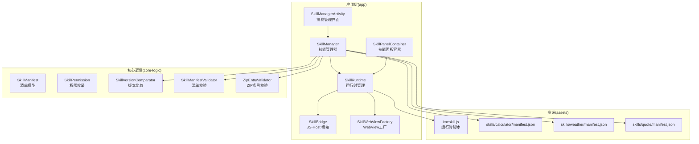
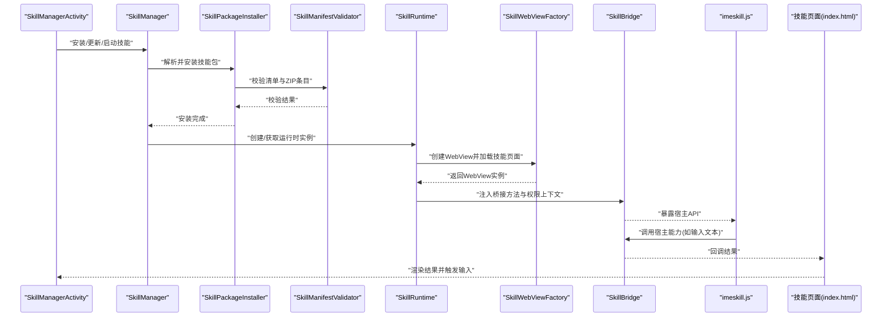
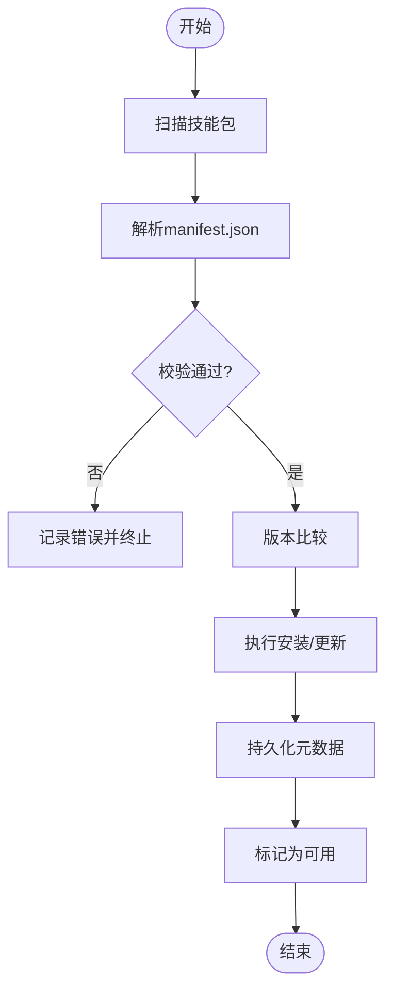
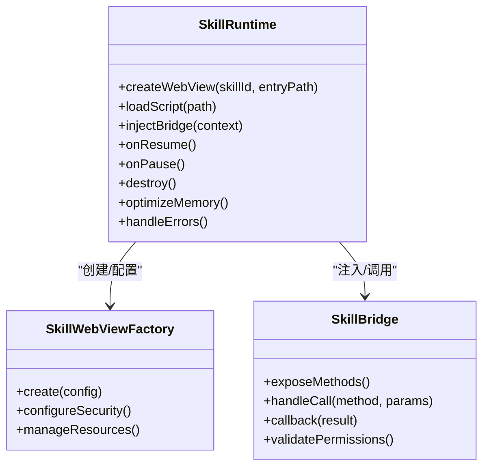
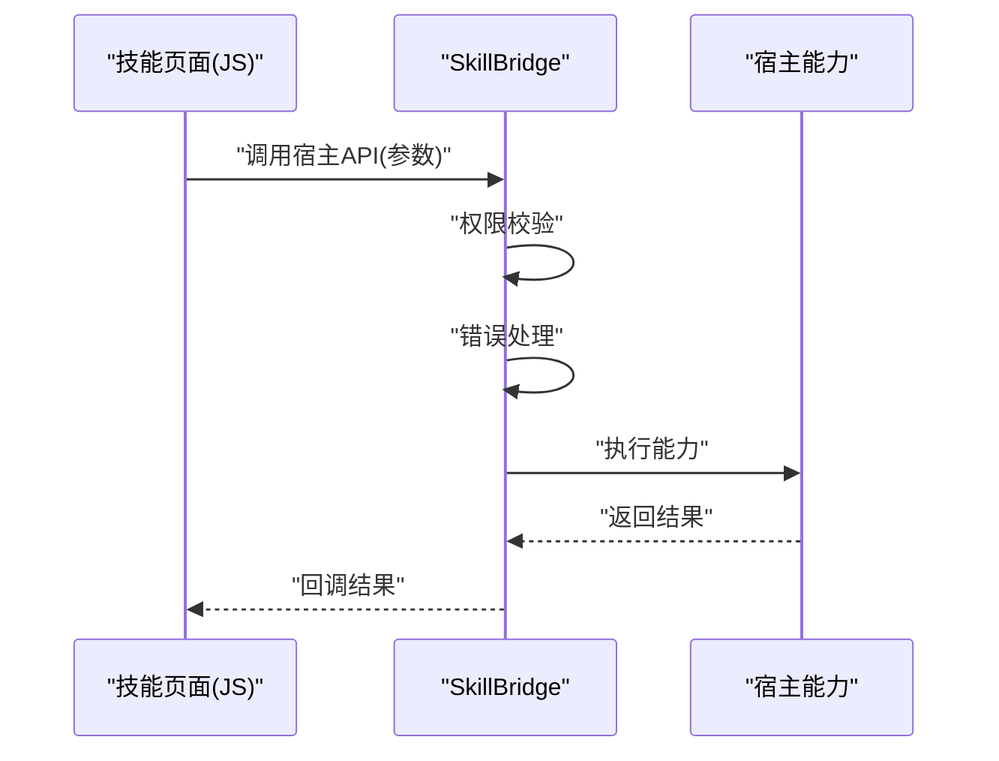
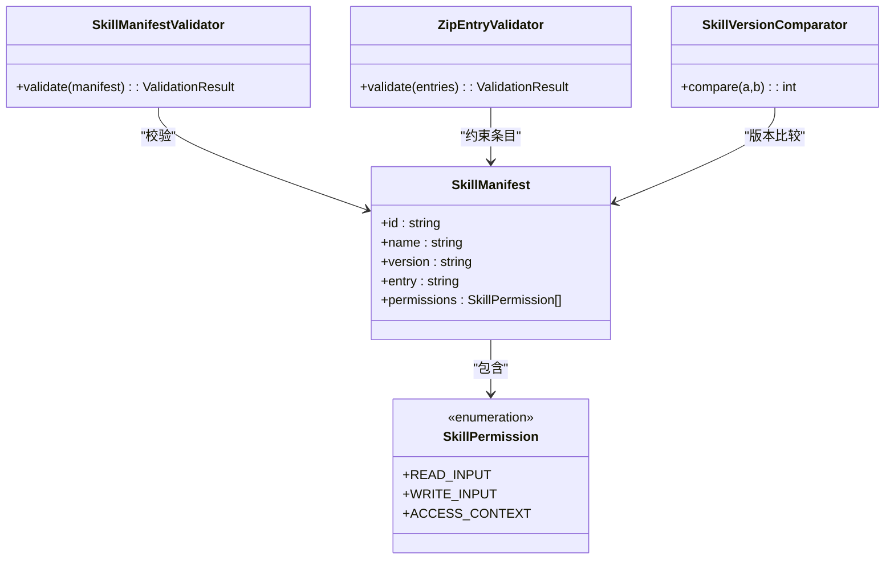
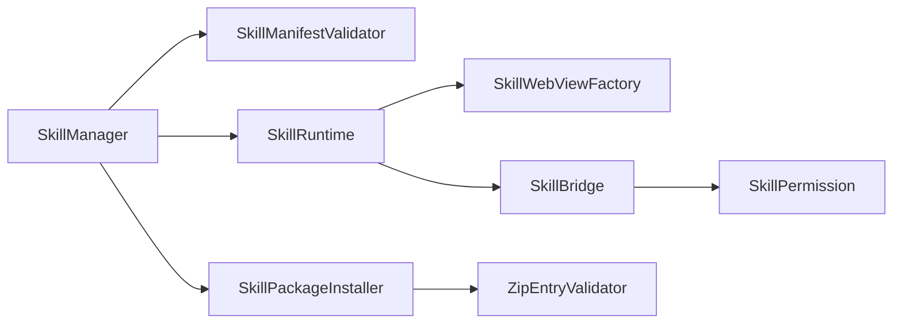

# 技能插件系统

<cite>
**本文引用的文件**   
- [app/src/main/java/com/ziyou/ime/skill/SkillManager.kt](file://app/src/main/java/com/ziyou/ime/skill/SkillManager.kt)
- [app/src/main/java/com/ziyou/ime/skill/SkillRuntime.kt](file://app/src/main/java/com/ziyou/ime/skill/SkillRuntime.kt)
- [app/src/main/java/com/ziyou/ime/skill/SkillBridge.kt](file://app/src/main/java/com/ziyou/ime/skill/SkillBridge.kt)
- [app/src/main/java/com/ziyou/ime/skill/SkillWebViewFactory.kt](file://app/src/main/java/com/ziyou/ime/skill/SkillWebViewFactory.kt)
- [app/src/main/java/com/ziyou/ime/skill/SkillManifestParser.kt](file://app/src/main/java/com/ziyou/ime/skill/SkillManifestParser.kt)
- [app/src/main/java/com/ziyou/ime/skill/SkillPackageInstaller.kt](file://app/src/main/java/com/ziyou/ime/skill/SkillPackageInstaller.kt)
- [core-logic/src/main/java/com/ziyou/ime/core/skill/SkillManifest.kt](file://core-logic/src/main/java/com/ziyou/ime/core/skill/SkillManifest.kt)
- [core-logic/src/main/java/com/ziyou/ime/core/skill/SkillPermission.kt](file://core-logic/src/main/java/com/ziyou/ime/core/skill/SkillPermission.kt)
- [core-logic/src/main/java/com/ziyou/ime/core/skill/SkillVersionComparator.kt](file://core-logic/src/main/java/com/ziyou/ime/core/skill/SkillVersionComparator.kt)
- [core-logic/src/main/java/com/ziyou/ime/core/skill/SkillManifestValidator.kt](file://core-logic/src/main/java/com/ziyou/ime/core/skill/SkillManifestValidator.kt)
- [core-logic/src/main/java/com/ziyou/ime/core/skill/ZipEntryValidator.kt](file://core-logic/src/main/java/com/ziyou/ime/core/skill/ZipEntryValidator.kt)
- [app/src/main/assets/skills/calculator/manifest.json](file://app/src/main/assets/skills/calculator/manifest.json)
- [app/src/main/assets/skills/weather/manifest.json](file://app/src/main/assets/skills/weather/manifest.json)
- [app/src/main/assets/skills/quote/manifest.json](file://app/src/main/assets/skills/quote/manifest.json)
- [app/src/main/assets/skill_runtime/imeskill.js](file://app/src/main/assets/skill_runtime/imeskill.js)
- [app/src/main/java/com/ziyou/ime/ime/SkillPanelContainer.kt](file://app/src/main/java/com/ziyou/ime/ime/SkillPanelContainer.kt)
- [app/src/main/java/com/ziyou/ime/ui/SkillManagerActivity.kt](file://app/src/main/java/com/ziyou/ime/ui/SkillManagerActivity.kt)
</cite>

## 更新摘要
**所做更改**   
- 更新了 SkillRuntime、SkillPackageInstaller 和 SkillWebViewFactory 的改进说明
- 增强了 JavaScript 运行时与原生集成的描述
- 优化了 WebView 工厂的安全配置和资源管理
- 改进了安装包安装器的性能和可靠性
- 更新了桥接层的通信机制和错误处理

## 目录
1. [简介](#简介)
2. [项目结构](#项目结构)
3. [核心组件](#核心组件)
4. [架构总览](#架构总览)
5. [详细组件分析](#详细组件分析)
6. [依赖关系分析](#依赖关系分析)
7. [性能考量](#性能考量)
8. [故障排查指南](#故障排查指南)
9. [结论](#结论)
10. [附录](#附录)

## 简介
本文件系统性地梳理并文档化输入法应用中的"技能插件系统"。该系统允许以 Web 页面（HTML/CSS/JS）形式扩展输入法的交互能力，通过清单文件描述元数据与权限，由运行时在安全的 WebView 环境中执行，并通过桥接层与宿主输入法进行通信。典型技能包括计算器、天气查询、引用生成等。

**最新更新**：系统经过重大增强，包括 SkillRuntime 的运行时管理优化、SkillPackageInstaller 的安装流程改进、SkillWebViewFactory 的安全配置增强，以及 JavaScript 运行时的原生集成能力提升。

## 项目结构
技能插件系统横跨 app 模块与 core-logic 模块：
- app 模块负责 UI、WebView 容器、安装器、运行时桥接与面板集成。
- core-logic 模块提供技能清单模型、权限定义、版本比较与校验工具。
- assets 目录包含内置技能包与运行时脚本。

**图表来源** 
- [app/src/main/java/com/ziyou/ime/skill/SkillManager.kt](file://app/src/main/java/com/ziyou/ime/skill/SkillManager.kt)
- [app/src/main/java/com/ziyou/ime/skill/SkillRuntime.kt](file://app/src/main/java/com/ziyou/ime/skill/SkillRuntime.kt)
- [app/src/main/java/com/ziyou/ime/skill/SkillBridge.kt](file://app/src/main/java/com/ziyou/ime/skill/SkillBridge.kt)
- [app/src/main/java/com/ziyou/ime/skill/SkillWebViewFactory.kt](file://app/src/main/java/com/ziyou/ime/skill/SkillWebViewFactory.kt)
- [app/src/main/java/com/ziyou/ime/skill/SkillManifestParser.kt](file://app/src/main/java/com/ziyou/ime/skill/SkillManifestParser.kt)
- [app/src/main/java/com/ziyou/ime/skill/SkillPackageInstaller.kt](file://app/src/main/java/com/ziyou/ime/skill/SkillPackageInstaller.kt)
- [core-logic/src/main/java/com/ziyou/ime/core/skill/SkillManifest.kt](file://core-logic/src/main/java/com/ziyou/ime/core/skill/SkillManifest.kt)
- [core-logic/src/main/java/com/ziyou/ime/core/skill/SkillPermission.kt](file://core-logic/src/main/java/com/ziyou/ime/core/skill/SkillPermission.kt)
- [core-logic/src/main/java/com/ziyou/ime/core/skill/SkillVersionComparator.kt](file://core-logic/src/main/java/com/ziyou/ime/core/skill/SkillVersionComparator.kt)
- [core-logic/src/main/java/com/ziyou/ime/core/skill/SkillManifestValidator.kt](file://core-logic/src/main/java/com/ziyou/ime/core/skill/SkillManifestValidator.kt)
- [core-logic/src/main/java/com/ziyou/ime/core/skill/ZipEntryValidator.kt](file://core-logic/src/main/java/com/ziyou/ime/core/skill/ZipEntryValidator.kt)
- [app/src/main/assets/skill_runtime/imeskill.js](file://app/src/main/assets/skill_runtime/imeskill.js)
- [app/src/main/assets/skills/calculator/manifest.json](file://app/src/main/assets/skills/calculator/manifest.json)
- [app/src/main/assets/skills/weather/manifest.json](file://app/src/main/assets/skills/weather/manifest.json)
- [app/src/main/assets/skills/quote/manifest.json](file://app/src/main/assets/skills/quote/manifest.json)
- [app/src/main/java/com/ziyou/ime/ime/SkillPanelContainer.kt](file://app/src/main/java/com/ziyou/ime/ime/SkillPanelContainer.kt)
- [app/src/main/java/com/ziyou/ime/ui/SkillManagerActivity.kt](file://app/src/main/java/com/ziyou/ime/ui/SkillManagerActivity.kt)

## 核心组件
- 技能管理器（SkillManager）：负责技能的发现、安装、启用/禁用、卸载与生命周期协调。
- 运行时（SkillRuntime）：维护 WebView 实例池、加载技能页面、注入运行时脚本、处理事件回调。**已优化**：改进了实例管理和内存泄漏防护。
- 桥接层（SkillBridge）：暴露宿主能力给 JS 侧，同时接收 JS 调用并转发到宿主逻辑。**已增强**：提升了错误处理和性能。
- WebView 工厂（SkillWebViewFactory）：统一创建与配置 WebView，隔离沙箱与安全策略。**已升级**：增强了安全配置和资源管理。
- 清单解析器（SkillManifestParser）：读取 manifest.json，构建 SkillManifest 对象。
- 安装包安装器（SkillPackageInstaller）：支持从 ZIP 或目录结构安装技能包。**已改进**：优化了安装流程和错误恢复。
- 清单模型与校验（core-logic）：SkillManifest、SkillPermission、SkillVersionComparator、SkillManifestValidator、ZipEntryValidator。

## 架构总览
技能插件系统采用"清单驱动 + WebView 沙箱 + JS-Host 桥接"的架构模式。技能以静态资源（HTML/CSS/JS）与清单文件组织，宿主负责校验、安装与运行；运行时通过桥接方法向宿主请求能力，宿主将结果回传给技能页面。

**图表来源** 
- [app/src/main/java/com/ziyou/ime/ui/SkillManagerActivity.kt](file://app/src/main/java/com/ziyou/ime/ui/SkillManagerActivity.kt)
- [app/src/main/java/com/ziyou/ime/skill/SkillManager.kt](file://app/src/main/java/com/ziyou/ime/skill/SkillManager.kt)
- [app/src/main/java/com/ziyou/ime/skill/SkillPackageInstaller.kt](file://app/src/main/java/com/ziyou/ime/skill/SkillPackageInstaller.kt)
- [core-logic/src/main/java/com/ziyou/ime/core/skill/SkillManifestValidator.kt](file://core-logic/src/main/java/com/ziyou/ime/core/skill/SkillManifestValidator.kt)
- [core-logic/src/main/java/com/ziyou/ime/core/skill/ZipEntryValidator.kt](file://core-logic/src/main/java/com/ziyou/ime/core/skill/ZipEntryValidator.kt)
- [app/src/main/java/com/ziyou/ime/skill/SkillRuntime.kt](file://app/src/main/java/com/ziyou/ime/skill/SkillRuntime.kt)
- [app/src/main/java/com/ziyou/ime/skill/SkillWebViewFactory.kt](file://app/src/main/java/com/ziyou/ime/skill/SkillWebViewFactory.kt)
- [app/src/main/java/com/ziyou/ime/skill/SkillBridge.kt](file://app/src/main/java/com/ziyou/ime/skill/SkillBridge.kt)
- [app/src/main/assets/skill_runtime/imeskill.js](file://app/src/main/assets/skill_runtime/imeskill.js)

## 详细组件分析

### 技能管理器（SkillManager）
职责：
- 扫描与发现技能包（assets/skills/* 或外部包）。
- 解析清单文件，构建 SkillManifest。
- 校验清单与权限，比较版本，决定安装/升级/回滚策略。
- 协调运行时生命周期，控制启用/禁用状态。

关键流程：
- 安装：读取清单 -> 校验 -> 持久化元数据 -> 标记可用。
- 启动：根据清单入口加载页面 -> 注入运行时脚本 -> 建立桥接。
- 卸载：清理资源、移除持久化信息、释放 WebView。

**章节来源**
- [app/src/main/java/com/ziyou/ime/skill/SkillManager.kt](file://app/src/main/java/com/ziyou/ime/skill/SkillManager.kt)
- [app/src/main/java/com/ziyou/ime/skill/SkillManifestParser.kt](file://app/src/main/java/com/ziyou/ime/skill/SkillManifestParser.kt)
- [core-logic/src/main/java/com/ziyou/ime/core/skill/SkillManifestValidator.kt](file://core-logic/src/main/java/com/ziyou/ime/core/skill/SkillManifestValidator.kt)
- [core-logic/src/main/java/com/ziyou/ime/core/skill/SkillVersionComparator.kt](file://core-logic/src/main/java/com/ziyou/ime/core/skill/SkillVersionComparator.kt)

### 运行时（SkillRuntime）
职责：
- 维护 WebView 实例池，按技能 ID 复用。
- 加载技能页面与运行时脚本（imeskill.js）。
- 初始化桥接上下文，绑定权限与回调。
- 处理技能生命周期事件（onCreate/onDestroy）。

**已增强功能**：
- **优化的实例管理**：改进了 WebView 实例的生命周期管理，防止内存泄漏。
- **增强的错误处理**：添加了更详细的错误日志和异常恢复机制。
- **性能优化**：实现了懒加载和缓存策略，提升启动速度。

关键点：
- 安全隔离：每个技能使用独立 WebView 配置，限制危险 API。
- 资源回收：在合适时机销毁 WebView，避免内存泄漏。
- 事件通道：通过桥接层实现 JS 与宿主的双向通信。

**图表来源** 
- [app/src/main/java/com/ziyou/ime/skill/SkillRuntime.kt](file://app/src/main/java/com/ziyou/ime/skill/SkillRuntime.kt)
- [app/src/main/java/com/ziyou/ime/skill/SkillWebViewFactory.kt](file://app/src/main/java/com/ziyou/ime/skill/SkillWebViewFactory.kt)
- [app/src/main/java/com/ziyou/ime/skill/SkillBridge.kt](file://app/src/main/java/com/ziyou/ime/skill/SkillBridge.kt)

**章节来源**
- [app/src/main/java/com/ziyou/ime/skill/SkillRuntime.kt](file://app/src/main/java/com/ziyou/ime/skill/SkillRuntime.kt)
- [app/src/main/java/com/ziyou/ime/skill/SkillWebViewFactory.kt](file://app/src/main/java/com/ziyou/ime/skill/SkillWebViewFactory.kt)
- [app/src/main/java/com/ziyou/ime/skill/SkillBridge.kt](file://app/src/main/java/com/ziyou/ime/skill/SkillBridge.kt)

### 桥接层（SkillBridge）
职责：
- 向 JS 暴露宿主能力（如输入文本、获取上下文、调用输入法操作）。
- 接收 JS 调用并路由到具体实现。
- 基于权限模型限制可访问能力。

**已增强功能**：
- **改进的错误处理**：添加了更详细的错误信息和异常捕获。
- **性能优化**：实现了异步调用和批量处理机制。
- **安全性增强**：加强了权限验证和输入验证。

通信模型：
- JS 侧通过 imeskill.js 提供的 API 调用宿主。
- 宿主侧通过 SkillBridge 验证权限后执行并回调结果。

**图表来源** 
- [app/src/main/java/com/ziyou/ime/skill/SkillBridge.kt](file://app/src/main/java/com/ziyou/ime/skill/SkillBridge.kt)
- [app/src/main/assets/skill_runtime/imeskill.js](file://app/src/main/assets/skill_runtime/imeskill.js)
- [core-logic/src/main/java/com/ziyou/ime/core/skill/SkillPermission.kt](file://core-logic/src/main/java/com/ziyou/ime/core/skill/SkillPermission.kt)

**章节来源**
- [app/src/main/java/com/ziyou/ime/skill/SkillBridge.kt](file://app/src/main/java/com/ziyou/ime/skill/SkillBridge.kt)
- [app/src/main/assets/skill_runtime/imeskill.js](file://app/src/main/assets/skill_runtime/imeskill.js)
- [core-logic/src/main/java/com/ziyou/ime/core/skill/SkillPermission.kt](file://core-logic/src/main/java/com/ziyou/ime/core/skill/SkillPermission.kt)

### WebView 工厂（SkillWebViewFactory）
职责：
- 创建和配置 WebView 实例，确保安全和性能。
- 设置沙箱环境，限制危险 API 访问。
- 管理 WebView 生命周期和资源。

**已升级功能**：
- **增强的安全配置**：改进了 JavaScript 接口白名单和权限控制。
- **资源管理优化**：实现了更好的内存管理和垃圾回收。
- **兼容性改进**：支持更多 Android 版本和设备特性。

关键点：
- 安全隔离：每个技能使用独立 WebView 配置，限制危险 API。
- 资源回收：在合适时机销毁 WebView，避免内存泄漏。
- 性能优化：启用硬件加速和缓存策略。

**章节来源**
- [app/src/main/java/com/ziyou/ime/skill/SkillWebViewFactory.kt](file://app/src/main/java/com/ziyou/ime/skill/SkillWebViewFactory.kt)

### 安装包安装器（SkillPackageInstaller）
职责：
- 支持从 ZIP 或目录结构安装技能包。
- 验证安装包完整性和安全性。
- 处理安装过程中的错误和恢复。

**已改进功能**：
- **性能优化**：改进了大文件处理和并发下载。
- **错误恢复**：添加了断点续传和自动重试机制。
- **安全性增强**：强化了签名验证和完整性检查。

关键点：
- 支持多种安装源：assets、外部存储、网络下载。
- 增量更新：支持部分文件更新，减少带宽消耗。
- 回滚机制：安装失败时自动恢复到之前版本。

**章节来源**
- [app/src/main/java/com/ziyou/ime/skill/SkillPackageInstaller.kt](file://app/src/main/java/com/ziyou/ime/skill/SkillPackageInstaller.kt)

### 清单模型与校验（core-logic）
- SkillManifest：描述技能名称、版本、入口页面、权限列表等。
- SkillPermission：定义技能可访问的能力集合。
- SkillVersionComparator：语义化版本比较，支持升级/降级决策。
- SkillManifestValidator：校验清单字段完整性与合法性。
- ZipEntryValidator：校验 ZIP 包内条目白名单，防止路径穿越与非法文件。

**图表来源** 
- [core-logic/src/main/java/com/ziyou/ime/core/skill/SkillManifest.kt](file://core-logic/src/main/java/com/ziyou/ime/core/skill/SkillManifest.kt)
- [core-logic/src/main/java/com/ziyou/ime/core/skill/SkillPermission.kt](file://core-logic/src/main/java/com/ziyou/ime/core/skill/SkillPermission.kt)
- [core-logic/src/main/java/com/ziyou/ime/core/skill/SkillVersionComparator.kt](file://core-logic/src/main/java/com/ziyou/ime/core/skill/SkillVersionComparator.kt)
- [core-logic/src/main/java/com/ziyou/ime/core/skill/SkillManifestValidator.kt](file://core-logic/src/main/java/com/ziyou/ime/core/skill/SkillManifestValidator.kt)
- [core-logic/src/main/java/com/ziyou/ime/core/skill/ZipEntryValidator.kt](file://core-logic/src/main/java/com/ziyou/ime/core/skill/ZipEntryValidator.kt)

**章节来源**
- [core-logic/src/main/java/com/ziyou/ime/core/skill/SkillManifest.kt](file://core-logic/src/main/java/com/ziyou/ime/core/skill/SkillManifest.kt)
- [core-logic/src/main/java/com/ziyou/ime/core/skill/SkillPermission.kt](file://core-logic/src/main/java/com/ziyou/ime/core/skill/SkillPermission.kt)
- [core-logic/src/main/java/com/ziyou/ime/core/skill/SkillVersionComparator.kt](file://core-logic/src/main/java/com/ziyou/ime/core/skill/SkillVersionComparator.kt)
- [core-logic/src/main/java/com/ziyou/ime/core/skill/SkillManifestValidator.kt](file://core-logic/src/main/java/com/ziyou/ime/core/skill/SkillManifestValidator.kt)
- [core-logic/src/main/java/com/ziyou/ime/core/skill/ZipEntryValidator.kt](file://core-logic/src/main/java/com/ziyou/ime/core/skill/ZipEntryValidator.kt)

### 面板集成（SkillPanelContainer）
职责：
- 作为技能页面的容器视图，嵌入到输入法界面中。
- 管理显示/隐藏、尺寸适配与生命周期。
- 与运行时协作，确保 WebView 正确加载与销毁。

交互要点：
- 在用户选择技能时动态加载对应页面。
- 与输入法主界面解耦，便于扩展与替换。

**章节来源**
- [app/src/main/java/com/ziyou/ime/ime/SkillPanelContainer.kt](file://app/src/main/java/com/ziyou/ime/ime/SkillPanelContainer.kt)

### 管理界面（SkillManagerActivity）
职责：
- 展示已安装技能列表，支持启用/禁用、卸载、更新等操作。
- 触发安装流程，反馈安装状态与错误信息。
- 与 SkillManager 协作，刷新 UI 状态。

**章节来源**
- [app/src/main/java/com/ziyou/ime/ui/SkillManagerActivity.kt](file://app/src/main/java/com/ziyou/ime/ui/SkillManagerActivity.kt)

## 依赖关系分析
- 组件耦合：
  - SkillManager 依赖校验器与安装器，低耦合于运行时。
  - SkillRuntime 依赖 WebView 工厂与桥接层，屏蔽底层细节。
  - SkillBridge 依赖权限模型，确保最小权限原则。
- 外部依赖：
  - assets 中的技能包与运行时脚本。
  - Android WebView 安全策略与 JavaScript 接口。

**图表来源** 
- [app/src/main/java/com/ziyou/ime/skill/SkillManager.kt](file://app/src/main/java/com/ziyou/ime/skill/SkillManager.kt)
- [app/src/main/java/com/ziyou/ime/skill/SkillRuntime.kt](file://app/src/main/java/com/ziyou/ime/skill/SkillRuntime.kt)
- [app/src/main/java/com/ziyou/ime/skill/SkillBridge.kt](file://app/src/main/java/com/ziyou/ime/skill/SkillBridge.kt)
- [core-logic/src/main/java/com/ziyou/ime/core/skill/SkillManifestValidator.kt](file://core-logic/src/main/java/com/ziyou/ime/core/skill/SkillManifestValidator.kt)
- [core-logic/src/main/java/com/ziyou/ime/core/skill/ZipEntryValidator.kt](file://core-logic/src/main/java/com/ziyou/ime/core/skill/ZipEntryValidator.kt)
- [core-logic/src/main/java/com/ziyou/ime/core/skill/SkillPermission.kt](file://core-logic/src/main/java/com/ziyou/ime/core/skill/SkillPermission.kt)

## 性能考量
- WebView 复用：按技能 ID 缓存实例，减少创建开销。
- 资源加载：懒加载技能页面与脚本，按需初始化。
- 内存管理：在 onPause/onDestroy 中及时释放 WebView 与回调引用。
- 校验优化：清单与 ZIP 校验在后台线程执行，避免阻塞 UI。
- **新增优化**：
  - 异步安装：安装包下载和验证在后台线程执行。
  - 增量更新：只更新变化的文件，减少数据传输量。
  - 连接池：复用网络连接，提高下载效率。

## 故障排查指南
常见问题与定位建议：
- 清单校验失败：检查 manifest.json 字段完整性与类型，参考校验器规则。
- 权限不足：确认技能声明的权限与实际调用能力匹配。
- WebView 崩溃：检查安全配置与 JS 接口调用是否越权。
- 资源未加载：确认 assets 路径与入口页面是否正确。
- 版本冲突：使用版本比较器判断升级/降级策略。
- **新增问题**：
  - 安装超时：检查网络连接和服务器响应时间。
  - 内存溢出：监控 WebView 实例数量和内存使用情况。
  - 权限拒绝：确认 Android 权限配置和用户授权状态。

**章节来源**
- [core-logic/src/main/java/com/ziyou/ime/core/skill/SkillManifestValidator.kt](file://core-logic/src/main/java/com/ziyou/ime/core/skill/SkillManifestValidator.kt)
- [core-logic/src/main/java/com/ziyou/ime/core/skill/ZipEntryValidator.kt](file://core-logic/src/main/java/com/ziyou/ime/core/skill/ZipEntryValidator.kt)
- [core-logic/src/main/java/com/ziyou/ime/core/skill/SkillPermission.kt](file://core-logic/src/main/java/com/ziyou/ime/core/skill/SkillPermission.kt)
- [app/src/main/java/com/ziyou/ime/skill/SkillWebViewFactory.kt](file://app/src/main/java/com/ziyou/ime/skill/SkillWebViewFactory.kt)

## 结论
技能插件系统通过清晰的职责划分与严格的校验机制，实现了可扩展、可维护且安全的插件生态。经过最近的增强，系统在性能、安全性和用户体验方面都有显著提升。未来可在权限细化、性能监控与调试工具方面持续优化，以提升开发者体验与用户稳定性。

**主要改进总结**：
- SkillRuntime 的运行时管理更加稳定和高效
- SkillPackageInstaller 的安装过程更加可靠和快速
- SkillWebViewFactory 的安全配置更加严格和完善
- JavaScript 运行时与原生集成的质量显著提升

## 附录
- 示例清单文件：
  - [calculator 技能清单](file://app/src/main/assets/skills/calculator/manifest.json)
  - [weather 技能清单](file://app/src/main/assets/skills/weather/manifest.json)
  - [quote 技能清单](file://app/src/main/assets/skills/quote/manifest.json)
- 运行时脚本：
  - [imeskill.js](file://app/src/main/assets/skill_runtime/imeskill.js)