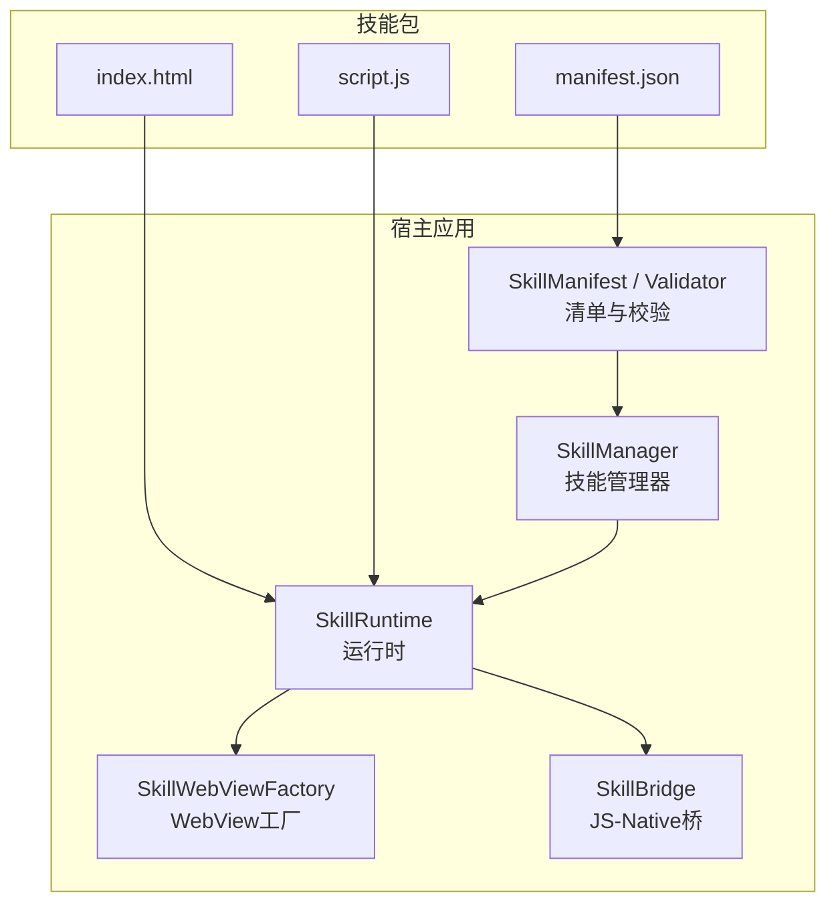
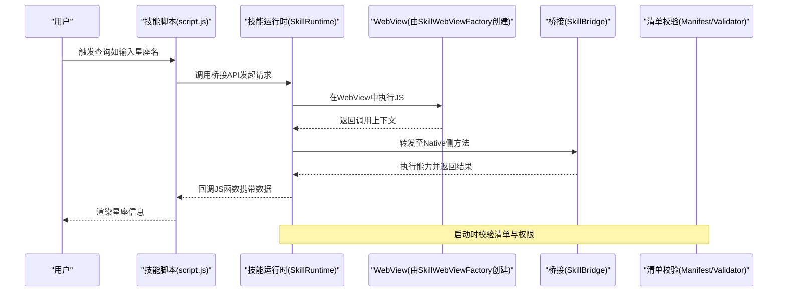
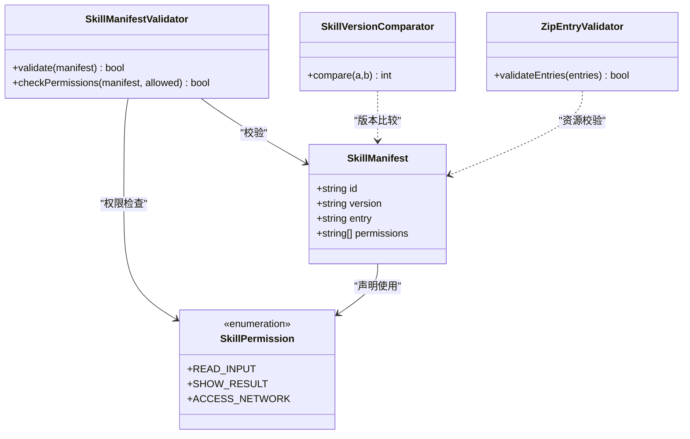
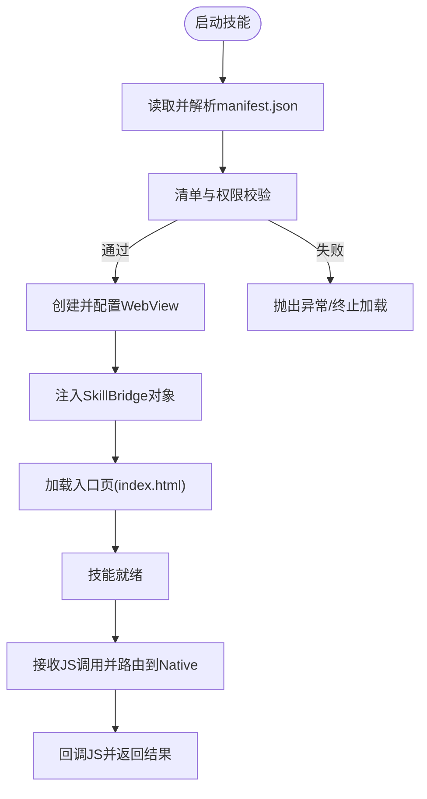
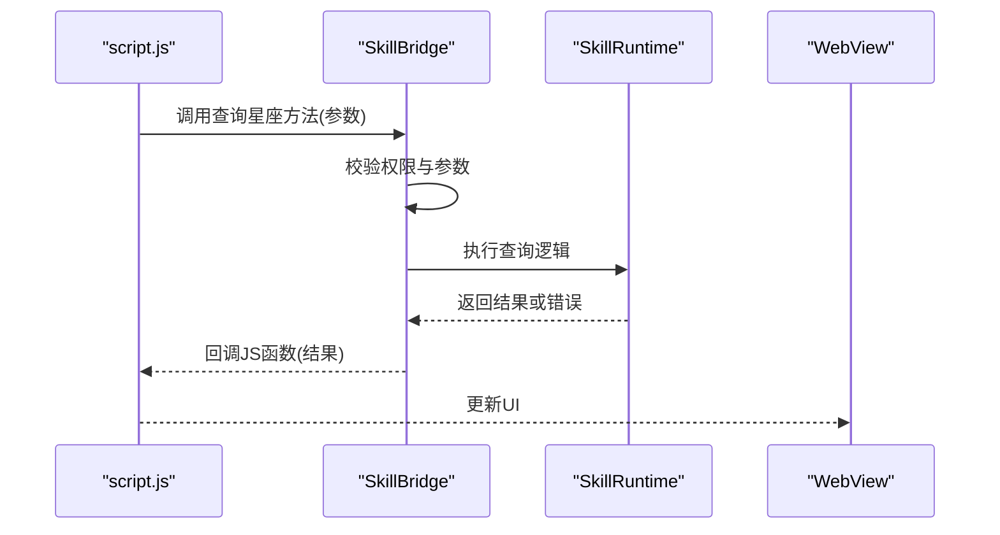
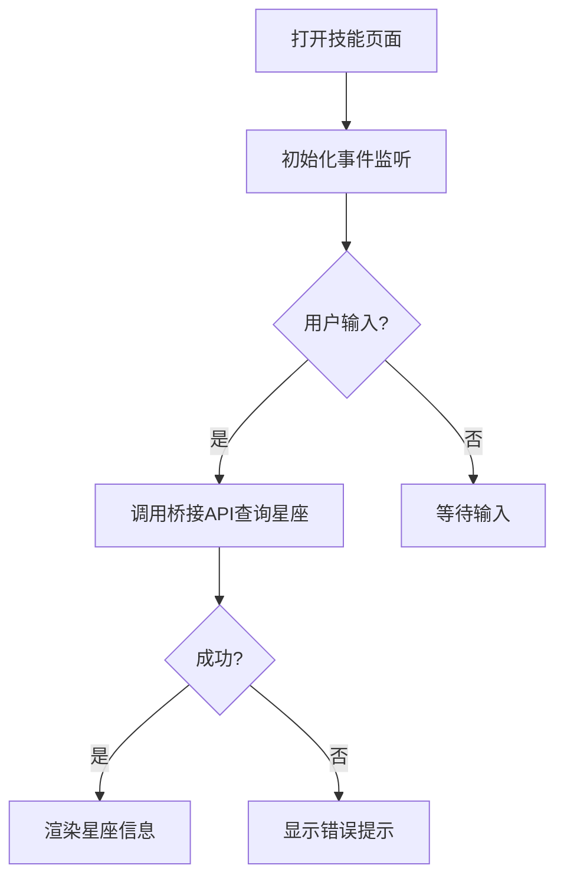
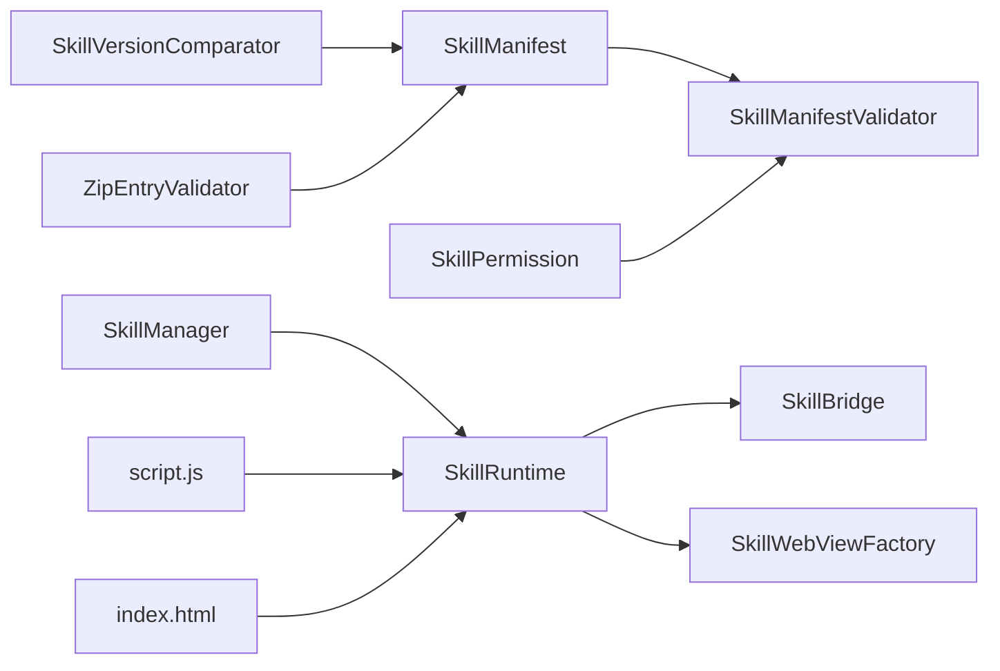

# 星座查询技能 (Constellation Skill v1.2)

<cite>
**本文引用的文件**   
- [skills-dev/com.user.constellation/index.html](file://skills-dev/com.user.constellation/index.html)
- [skills-dev/com.user.constellation/manifest.json](file://skills-dev/com.user.constellation/manifest.json)
- [skills-dev/com.user.constellation/script.js](file://skills-dev/com.user.constellation/script.js)
- [app/src/main/assets/skill_runtime/imeskill.js](file://app/src/main/assets/skill_runtime/imeskill.js)
- [app/src/main/java/com/ziyou/ime/skill/SkillManager.kt](file://app/src/main/java/com/ziyou/ime/skill/SkillManager.kt)
- [app/src/main/java/com/ziyou/ime/skill/SkillRuntime.kt](file://app/src/main/java/com/ziyou/ime/skill/SkillRuntime.kt)
- [app/src/main/java/com/ziyou/ime/skill/SkillWebViewFactory.kt](file://app/src/main/java/com/ziyou/ime/skill/SkillWebViewFactory.kt)
- [app/src/main/java/com/ziyou/ime/skill/SkillBridge.kt](file://app/src/main/java/com/ziyou/ime/skill/SkillBridge.kt)
- [core-logic/src/main/java/com/ziyou/ime/core/skill/SkillManifest.kt](file://core-logic/src/main/java/com/ziyou/ime/core/skill/SkillManifest.kt)
- [core-logic/src/main/java/com/ziyou/ime/core/skill/SkillManifestValidator.kt](file://core-logic/src/main/java/com/ziyou/ime/core/skill/SkillManifestValidator.kt)
- [core-logic/src/main/java/com/ziyou/ime/core/skill/SkillPermission.kt](file://core-logic/src/main/java/com/ziyou/ime/core/skill/SkillPermission.kt)
- [core-logic/src/main/java/com/ziyou/ime/core/skill/SkillVersionComparator.kt](file://core-logic/src/main/java/com/ziyou/ime/core/skill/SkillVersionComparator.kt)
- [core-logic/src/main/java/com/ziyou/ime/core/skill/ZipEntryValidator.kt](file://core-logic/src/main/java/com/ziyou/ime/core/skill/ZipEntryValidator.kt)
</cite>

## 目录
1. [简介](#简介)
2. [项目结构](#项目结构)
3. [核心组件](#核心组件)
4. [架构总览](#架构总览)
5. [详细组件分析](#详细组件分析)
6. [依赖关系分析](#依赖关系分析)
7. [性能考量](#性能考量)
8. [故障排查指南](#故障排查指南)
9. [结论](#结论)
10. [附录](#附录)

## 简介
本文件围绕“星座查询技能（Constellation Skill v1.2）”在输入法插件系统中的实现进行系统化说明。该技能以 Web 形式提供，通过输入法的技能运行时与 WebView 执行环境交互，完成用户输入到星座信息的查询与展示。文档从系统架构、数据流、处理逻辑、集成点、错误处理与性能特性等维度展开，帮助开发者快速理解并扩展技能能力。

## 项目结构
星座查询技能由两部分组成：
- 技能包（Web 前端与清单）：位于 skills-dev/com.user.constellation，包含 index.html、script.js 与 manifest.json，定义技能的元数据、权限与 UI 行为。
- 运行时与宿主（Android/Kotlin）：位于 app 与 core-logic 模块，负责技能安装、校验、运行、桥接通信与 WebView 生命周期管理。

图表来源
- [skills-dev/com.user.constellation/index.html](file://skills-dev/com.user.constellation/index.html)
- [skills-dev/com.user.constellation/script.js](file://skills-dev/com.user.constellation/script.js)
- [skills-dev/com.user.constellation/manifest.json](file://skills-dev/com.user.constellation/manifest.json)
- [app/src/main/java/com/ziyou/ime/skill/SkillManager.kt](file://app/src/main/java/com/ziyou/ime/skill/SkillManager.kt)
- [app/src/main/java/com/ziyou/ime/skill/SkillRuntime.kt](file://app/src/main/java/com/ziyou/ime/skill/SkillRuntime.kt)
- [app/src/main/java/com/ziyou/ime/skill/SkillWebViewFactory.kt](file://app/src/main/java/com/ziyou/ime/skill/SkillWebViewFactory.kt)
- [app/src/main/java/com/ziyou/ime/skill/SkillBridge.kt](file://app/src/main/java/com/ziyou/ime/skill/SkillBridge.kt)
- [core-logic/src/main/java/com/ziyou/ime/core/skill/SkillManifest.kt](file://core-logic/src/main/java/com/ziyou/ime/core/skill/SkillManifest.kt)
- [core-logic/src/main/java/com/ziyou/ime/core/skill/SkillManifestValidator.kt](file://core-logic/src/main/java/com/ziyou/ime/core/skill/SkillManifestValidator.kt)

章节来源
- [skills-dev/com.user.constellation/index.html](file://skills-dev/com.user.constellation/index.html)
- [skills-dev/com.user.constellation/script.js](file://skills-dev/com.user.constellation/script.js)
- [skills-dev/com.user.constellation/manifest.json](file://skills-dev/com.user.constellation/manifest.json)
- [app/src/main/java/com/ziyou/ime/skill/SkillManager.kt](file://app/src/main/java/com/ziyou/ime/skill/SkillManager.kt)
- [app/src/main/java/com/ziyou/ime/skill/SkillRuntime.kt](file://app/src/main/java/com/ziyou/ime/skill/SkillRuntime.kt)
- [app/src/main/java/com/ziyou/ime/skill/SkillWebViewFactory.kt](file://app/src/main/java/com/ziyou/ime/skill/SkillWebViewFactory.kt)
- [app/src/main/java/com/ziyou/ime/skill/SkillBridge.kt](file://app/src/main/java/com/ziyou/ime/skill/SkillBridge.kt)
- [core-logic/src/main/java/com/ziyou/ime/core/skill/SkillManifest.kt](file://core-logic/src/main/java/com/ziyou/ime/core/skill/SkillManifest.kt)
- [core-logic/src/main/java/com/ziyou/ime/core/skill/SkillManifestValidator.kt](file://core-logic/src/main/java/com/ziyou/ime/core/skill/SkillManifestValidator.kt)

## 核心组件
- 技能清单与校验（core-logic）
  - 清单模型：描述技能标识、版本、入口、权限等元数据。
  - 清单校验器：校验字段完整性、格式与约束。
  - 权限枚举：限定技能可访问的宿主能力。
  - 版本比较器：用于升级与兼容性判断。
  - Zip 条目校验器：确保打包资源安全与完整性。
- 运行时与桥接（app）
  - 技能管理器：负责技能的发现、安装、启停与生命周期。
  - 技能运行时：加载技能包、初始化 WebView、注入桥接对象、调度事件。
  - WebView 工厂：创建并配置 WebView，设置安全策略与 JS 接口。
  - JS-Native 桥：暴露宿主能力给 Web 端，接收回调与结果。
- 技能包（Web）
  - index.html：技能页面结构与样式。
  - script.js：业务逻辑，调用桥接 API 获取数据并渲染。
  - manifest.json：技能元数据与权限声明。

章节来源
- [core-logic/src/main/java/com/ziyou/ime/core/skill/SkillManifest.kt](file://core-logic/src/main/java/com/ziyou/ime/core/skill/SkillManifest.kt)
- [core-logic/src/main/java/com/ziyou/ime/core/skill/SkillManifestValidator.kt](file://core-logic/src/main/java/com/ziyou/ime/core/skill/SkillManifestValidator.kt)
- [core-logic/src/main/java/com/ziyou/ime/core/skill/SkillPermission.kt](file://core-logic/src/main/java/com/ziyou/ime/core/skill/SkillPermission.kt)
- [core-logic/src/main/java/com/ziyou/ime/core/skill/SkillVersionComparator.kt](file://core-logic/src/main/java/com/ziyou/ime/core/skill/SkillVersionComparator.kt)
- [core-logic/src/main/java/com/ziyou/ime/core/skill/ZipEntryValidator.kt](file://core-logic/src/main/java/com/ziyou/ime/core/skill/ZipEntryValidator.kt)
- [app/src/main/java/com/ziyou/ime/skill/SkillManager.kt](file://app/src/main/java/com/ziyou/ime/skill/SkillManager.kt)
- [app/src/main/java/com/ziyou/ime/skill/SkillRuntime.kt](file://app/src/main/java/com/ziyou/ime/skill/SkillRuntime.kt)
- [app/src/main/java/com/ziyou/ime/skill/SkillWebViewFactory.kt](file://app/src/main/java/com/ziyou/ime/skill/SkillWebViewFactory.kt)
- [app/src/main/java/com/ziyou/ime/skill/SkillBridge.kt](file://app/src/main/java/com/ziyou/ime/skill/SkillBridge.kt)
- [skills-dev/com.user.constellation/index.html](file://skills-dev/com.user.constellation/index.html)
- [skills-dev/com.user.constellation/script.js](file://skills-dev/com.user.constellation/script.js)
- [skills-dev/com.user.constellation/manifest.json](file://skills-dev/com.user.constellation/manifest.json)

## 架构总览
星座查询技能采用“Web 技能 + 宿主运行时”的解耦架构。技能包以静态资源形式存在，运行时负责加载、校验与安全隔离；JS-Native 桥作为唯一通信通道，保证能力边界清晰。

图表来源
- [app/src/main/java/com/ziyou/ime/skill/SkillRuntime.kt](file://app/src/main/java/com/ziyou/ime/skill/SkillRuntime.kt)
- [app/src/main/java/com/ziyou/ime/skill/SkillWebViewFactory.kt](file://app/src/main/java/com/ziyou/ime/skill/SkillWebViewFactory.kt)
- [app/src/main/java/com/ziyou/ime/skill/SkillBridge.kt](file://app/src/main/java/com/ziyou/ime/skill/SkillBridge.kt)
- [core-logic/src/main/java/com/ziyou/ime/core/skill/SkillManifest.kt](file://core-logic/src/main/java/com/ziyou/ime/core/skill/SkillManifest.kt)
- [core-logic/src/main/java/com/ziyou/ime/core/skill/SkillManifestValidator.kt](file://core-logic/src/main/java/com/ziyou/ime/core/skill/SkillManifestValidator.kt)
- [skills-dev/com.user.constellation/script.js](file://skills-dev/com.user.constellation/script.js)

## 详细组件分析

### 技能清单与校验（Manifest & Validator）
- 清单模型定义了技能标识、版本、入口页、权限列表等关键元数据。
- 校验器对字段类型、必填项、取值范围进行验证，防止非法或危险配置。
- 权限枚举限制技能可访问的宿主能力，确保安全边界。
- 版本比较器支持语义化版本比较，便于升级策略。
- Zip 条目校验器检查打包资源路径与白名单，避免越权访问。

图表来源
- [core-logic/src/main/java/com/ziyou/ime/core/skill/SkillManifest.kt](file://core-logic/src/main/java/com/ziyou/ime/core/skill/SkillManifest.kt)
- [core-logic/src/main/java/com/ziyou/ime/core/skill/SkillManifestValidator.kt](file://core-logic/src/main/java/com/ziyou/ime/core/skill/SkillManifestValidator.kt)
- [core-logic/src/main/java/com/ziyou/ime/core/skill/SkillPermission.kt](file://core-logic/src/main/java/com/ziyou/ime/core/skill/SkillPermission.kt)
- [core-logic/src/main/java/com/ziyou/ime/core/skill/SkillVersionComparator.kt](file://core-logic/src/main/java/com/ziyou/ime/core/skill/SkillVersionComparator.kt)
- [core-logic/src/main/java/com/ziyou/ime/core/skill/ZipEntryValidator.kt](file://core-logic/src/main/java/com/ziyou/ime/core/skill/ZipEntryValidator.kt)

章节来源
- [core-logic/src/main/java/com/ziyou/ime/core/skill/SkillManifest.kt](file://core-logic/src/main/java/com/ziyou/ime/core/skill/SkillManifest.kt)
- [core-logic/src/main/java/com/ziyou/ime/core/skill/SkillManifestValidator.kt](file://core-logic/src/main/java/com/ziyou/ime/core/skill/SkillManifestValidator.kt)
- [core-logic/src/main/java/com/ziyou/ime/core/skill/SkillPermission.kt](file://core-logic/src/main/java/com/ziyou/ime/core/skill/SkillPermission.kt)
- [core-logic/src/main/java/com/ziyou/ime/core/skill/SkillVersionComparator.kt](file://core-logic/src/main/java/com/ziyou/ime/core/skill/SkillVersionComparator.kt)
- [core-logic/src/main/java/com/ziyou/ime/core/skill/ZipEntryValidator.kt](file://core-logic/src/main/java/com/ziyou/ime/core/skill/ZipEntryValidator.kt)

### 运行时与 WebView 工厂（Runtime & WebViewFactory）
- 运行时负责加载技能包、初始化 WebView、注入桥接对象、分发事件与回调。
- WebView 工厂创建并配置 WebView，启用必要的功能与安全策略（如禁用危险 API）。
- 运行时与桥接协作，将 JS 调用路由到 Native 方法，并将结果回传给 JS。

图表来源
- [app/src/main/java/com/ziyou/ime/skill/SkillRuntime.kt](file://app/src/main/java/com/ziyou/ime/skill/SkillRuntime.kt)
- [app/src/main/java/com/ziyou/ime/skill/SkillWebViewFactory.kt](file://app/src/main/java/com/ziyou/ime/skill/SkillWebViewFactory.kt)
- [app/src/main/java/com/ziyou/ime/skill/SkillBridge.kt](file://app/src/main/java/com/ziyou/ime/skill/SkillBridge.kt)
- [skills-dev/com.user.constellation/manifest.json](file://skills-dev/com.user.constellation/manifest.json)
- [skills-dev/com.user.constellation/index.html](file://skills-dev/com.user.constellation/index.html)

章节来源
- [app/src/main/java/com/ziyou/ime/skill/SkillRuntime.kt](file://app/src/main/java/com/ziyou/ime/skill/SkillRuntime.kt)
- [app/src/main/java/com/ziyou/ime/skill/SkillWebViewFactory.kt](file://app/src/main/java/com/ziyou/ime/skill/SkillWebViewFactory.kt)
- [app/src/main/java/com/ziyou/ime/skill/SkillBridge.kt](file://app/src/main/java/com/ziyou/ime/skill/SkillBridge.kt)
- [skills-dev/com.user.constellation/manifest.json](file://skills-dev/com.user.constellation/manifest.json)
- [skills-dev/com.user.constellation/index.html](file://skills-dev/com.user.constellation/index.html)

### 桥接层（SkillBridge）
- 暴露一组受控的 Native 方法给 JS 调用，例如查询星座信息、显示结果等。
- 对调用参数进行校验与权限检查，确保仅允许已声明的能力被访问。
- 统一错误码与消息格式，便于前端处理异常。

图表来源
- [app/src/main/java/com/ziyou/ime/skill/SkillBridge.kt](file://app/src/main/java/com/ziyou/ime/skill/SkillBridge.kt)
- [app/src/main/java/com/ziyou/ime/skill/SkillRuntime.kt](file://app/src/main/java/com/ziyou/ime/skill/SkillRuntime.kt)
- [skills-dev/com.user.constellation/script.js](file://skills-dev/com.user.constellation/script.js)

章节来源
- [app/src/main/java/com/ziyou/ime/skill/SkillBridge.kt](file://app/src/main/java/com/ziyou/ime/skill/SkillBridge.kt)
- [app/src/main/java/com/ziyou/ime/skill/SkillRuntime.kt](file://app/src/main/java/com/ziyou/ime/skill/SkillRuntime.kt)
- [skills-dev/com.user.constellation/script.js](file://skills-dev/com.user.constellation/script.js)

### 技能包（Web 前端）
- index.html：定义页面结构与样式，承载星座查询结果的展示区域。
- script.js：实现用户交互、调用桥接 API、处理返回数据并渲染 UI。
- manifest.json：声明技能 ID、版本、入口页与所需权限。

图表来源
- [skills-dev/com.user.constellation/index.html](file://skills-dev/com.user.constellation/index.html)
- [skills-dev/com.user.constellation/script.js](file://skills-dev/com.user.constellation/script.js)
- [skills-dev/com.user.constellation/manifest.json](file://skills-dev/com.user.constellation/manifest.json)

章节来源
- [skills-dev/com.user.constellation/index.html](file://skills-dev/com.user.constellation/index.html)
- [skills-dev/com.user.constellation/script.js](file://skills-dev/com.user.constellation/script.js)
- [skills-dev/com.user.constellation/manifest.json](file://skills-dev/com.user.constellation/manifest.json)

### 运行时脚本（imeskill.js）
- 提供统一的运行时脚本，用于在 WebView 环境中初始化技能、注册桥接方法与事件总线。
- 屏蔽平台差异，为技能提供一致的 API 抽象。

章节来源
- [app/src/main/assets/skill_runtime/imeskill.js](file://app/src/main/assets/skill_runtime/imeskill.js)

## 依赖关系分析
- 技能包依赖运行时提供的桥接 API 与事件机制。
- 运行时依赖清单校验与权限控制，确保安全性。
- WebView 工厂依赖运行时配置与安全策略。
- 管理器协调安装、启停与生命周期。

图表来源
- [core-logic/src/main/java/com/ziyou/ime/core/skill/SkillManifest.kt](file://core-logic/src/main/java/com/ziyou/ime/core/skill/SkillManifest.kt)
- [core-logic/src/main/java/com/ziyou/ime/core/skill/SkillManifestValidator.kt](file://core-logic/src/main/java/com/ziyou/ime/core/skill/SkillManifestValidator.kt)
- [core-logic/src/main/java/com/ziyou/ime/core/skill/SkillPermission.kt](file://core-logic/src/main/java/com/ziyou/ime/core/skill/SkillPermission.kt)
- [core-logic/src/main/java/com/ziyou/ime/core/skill/SkillVersionComparator.kt](file://core-logic/src/main/java/com/ziyou/ime/core/skill/SkillVersionComparator.kt)
- [core-logic/src/main/java/com/ziyou/ime/core/skill/ZipEntryValidator.kt](file://core-logic/src/main/java/com/ziyou/ime/core/skill/ZipEntryValidator.kt)
- [app/src/main/java/com/ziyou/ime/skill/SkillManager.kt](file://app/src/main/java/com/ziyou/ime/skill/SkillManager.kt)
- [app/src/main/java/com/ziyou/ime/skill/SkillRuntime.kt](file://app/src/main/java/com/ziyou/ime/skill/SkillRuntime.kt)
- [app/src/main/java/com/ziyou/ime/skill/SkillWebViewFactory.kt](file://app/src/main/java/com/ziyou/ime/skill/SkillWebViewFactory.kt)
- [app/src/main/java/com/ziyou/ime/skill/SkillBridge.kt](file://app/src/main/java/com/ziyou/ime/skill/SkillBridge.kt)
- [skills-dev/com.user.constellation/script.js](file://skills-dev/com.user.constellation/script.js)
- [skills-dev/com.user.constellation/index.html](file://skills-dev/com.user.constellation/index.html)

章节来源
- [core-logic/src/main/java/com/ziyou/ime/core/skill/SkillManifest.kt](file://core-logic/src/main/java/com/ziyou/ime/core/skill/SkillManifest.kt)
- [core-logic/src/main/java/com/ziyou/ime/core/skill/SkillManifestValidator.kt](file://core-logic/src/main/java/com/ziyou/ime/core/skill/SkillManifestValidator.kt)
- [core-logic/src/main/java/com/ziyou/ime/core/skill/SkillPermission.kt](file://core-logic/src/main/java/com/ziyou/ime/core/skill/SkillPermission.kt)
- [core-logic/src/main/java/com/ziyou/ime/core/skill/SkillVersionComparator.kt](file://core-logic/src/main/java/com/ziyou/ime/core/skill/SkillVersionComparator.kt)
- [core-logic/src/main/java/com/ziyou/ime/core/skill/ZipEntryValidator.kt](file://core-logic/src/main/java/com/ziyou/ime/core/skill/ZipEntryValidator.kt)
- [app/src/main/java/com/ziyou/ime/skill/SkillManager.kt](file://app/src/main/java/com/ziyou/ime/skill/SkillManager.kt)
- [app/src/main/java/com/ziyou/ime/skill/SkillRuntime.kt](file://app/src/main/java/com/ziyou/ime/skill/SkillRuntime.kt)
- [app/src/main/java/com/ziyou/ime/skill/SkillWebViewFactory.kt](file://app/src/main/java/com/ziyou/ime/skill/SkillWebViewFactory.kt)
- [app/src/main/java/com/ziyou/ime/skill/SkillBridge.kt](file://app/src/main/java/com/ziyou/ime/skill/SkillBridge.kt)
- [skills-dev/com.user.constellation/script.js](file://skills-dev/com.user.constellation/script.js)
- [skills-dev/com.user.constellation/index.html](file://skills-dev/com.user.constellation/index.html)

## 性能考量
- 清单与资源校验应在安装阶段完成，避免运行时重复计算。
- WebView 实例应复用或按需创建，减少内存占用与启动开销。
- 桥接调用应避免频繁往返，必要时批量处理或缓存结果。
- 前端渲染应最小化 DOM 操作，使用虚拟滚动或分页提升流畅度。
- 网络请求需加超时与重试策略，避免阻塞主线程。

[本节为通用指导，不直接分析具体文件]

## 故障排查指南
- 清单校验失败：检查 manifest.json 字段完整性与权限声明是否匹配。
- WebView 无法加载：确认入口页路径正确且未被拦截；检查安全策略配置。
- 桥接调用无响应：核对权限是否授予；检查参数格式与错误码。
- 版本冲突：使用版本比较器判断兼容性与升级路径。
- 资源异常：通过 Zip 条目校验器定位缺失或非法资源。

章节来源
- [core-logic/src/main/java/com/ziyou/ime/core/skill/SkillManifestValidator.kt](file://core-logic/src/main/java/com/ziyou/ime/core/skill/SkillManifestValidator.kt)
- [core-logic/src/main/java/com/ziyou/ime/core/skill/ZipEntryValidator.kt](file://core-logic/src/main/java/com/ziyou/ime/core/skill/ZipEntryValidator.kt)
- [app/src/main/java/com/ziyou/ime/skill/SkillBridge.kt](file://app/src/main/java/com/ziyou/ime/skill/SkillBridge.kt)
- [app/src/main/java/com/ziyou/ime/skill/SkillRuntime.kt](file://app/src/main/java/com/ziyou/ime/skill/SkillRuntime.kt)

## 结论
星座查询技能以 Web 形态嵌入输入法插件系统，通过严格的清单校验、权限控制与安全的桥接通信，实现了前后端解耦与能力边界清晰。运行时与 WebView 工厂提供了稳定的执行环境，管理器负责生命周期与安装流程。整体架构具备良好的可扩展性与可维护性，适合持续迭代与生态扩展。

[本节为总结，不直接分析具体文件]

## 附录
- 开发建议
  - 在前端增加输入校验与友好错误提示。
  - 在后端为桥接方法添加日志与监控。
  - 使用版本比较器制定平滑升级策略。
  - 对敏感能力进行最小权限原则授权。

[本节为补充内容，不直接分析具体文件]