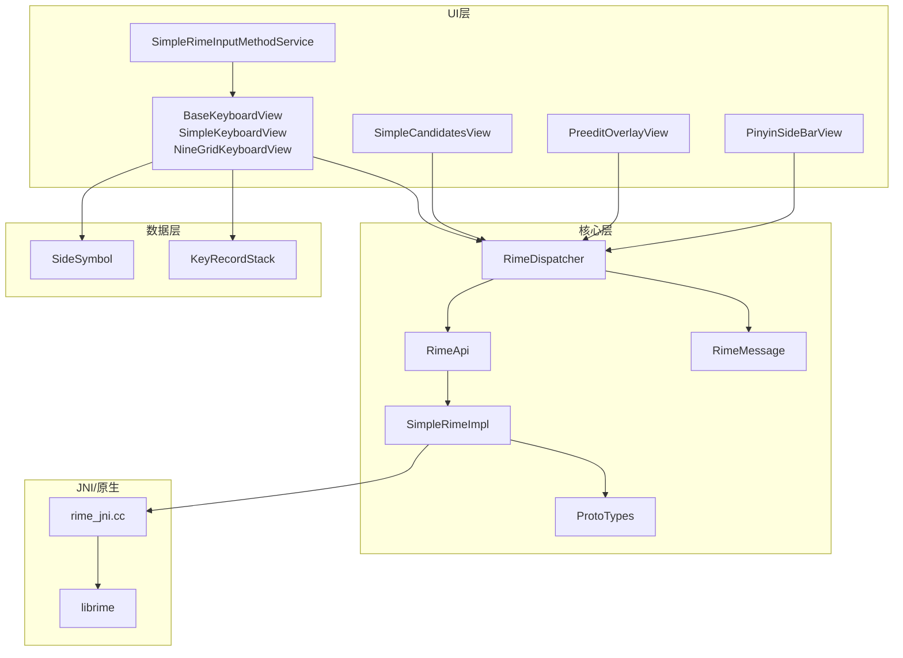
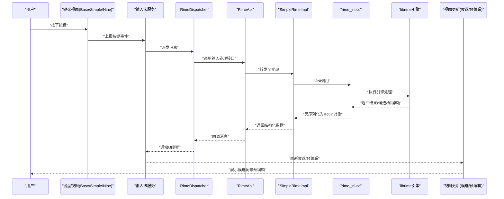
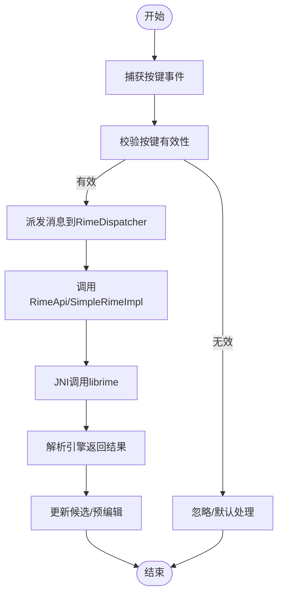
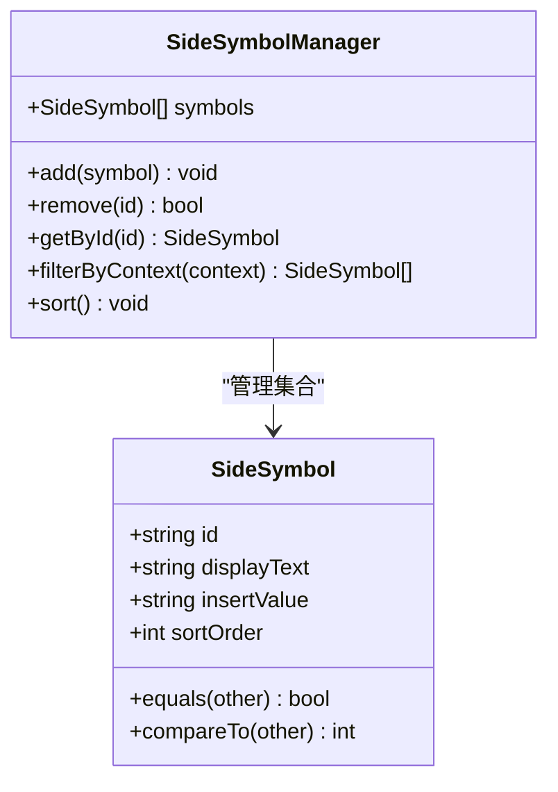
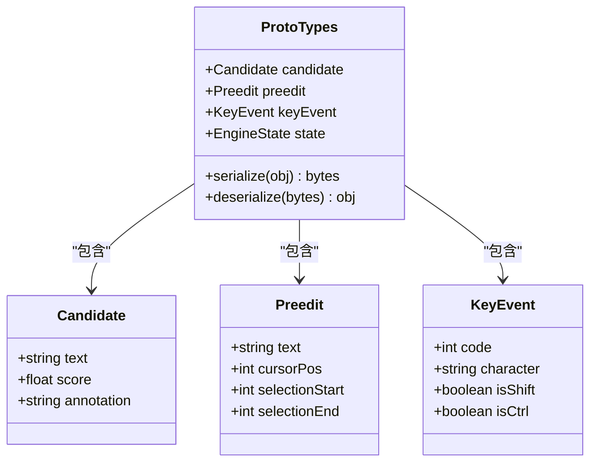
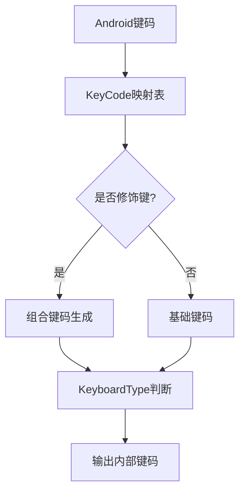
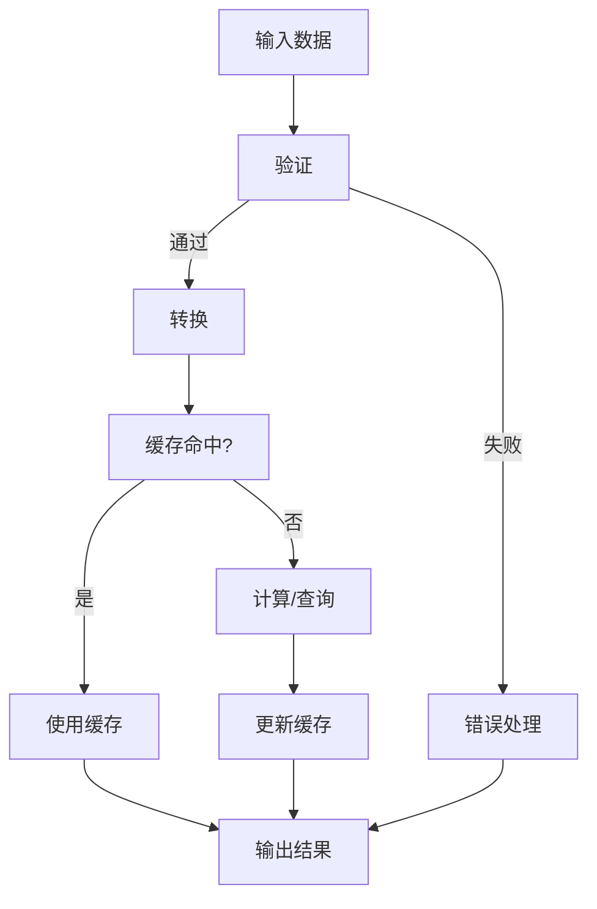
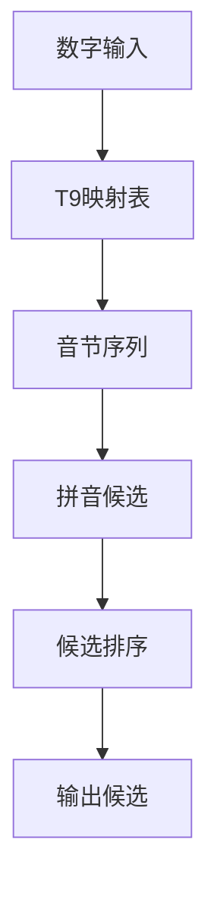
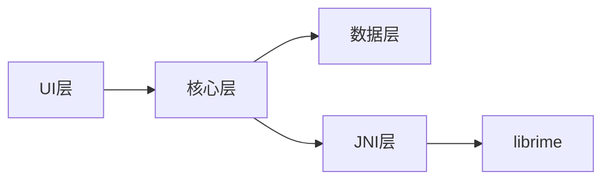

# 数据流设计

<cite>
**本文引用的文件**   
- [ProtoTypes.kt](file://app/src/main/java/com/ziyou/ime/core/ProtoTypes.kt)
- [RimeApi.kt](file://app/src/main/java/com/ziyou/ime/core/RimeApi.kt)
- [RimeDispatcher.kt](file://app/src/main/java/com/ziyou/ime/core/RimeDispatcher.kt)
- [RimeMessage.kt](file://app/src/main/java/com/ziyou/ime/core/RimeMessage.kt)
- [RimeNative.kt](file://app/src/main/java/com/ziyou/ime/core/RimeNative.kt)
- [SimpleRimeImpl.kt](file://app/src/main/java/com/ziyou/ime/core/SimpleRimeImpl.kt)
- [RimeSession.kt](file://app/src/main/java/com/ziyou/ime/daemon/RimeSession.kt)
- [KeyRecordStack.kt](file://app/src/main/java/com/ziyou/ime/data/KeyRecordStack.kt)
- [SideSymbol.kt](file://app/src/main/java/com/ziyou/ime/data/SideSymbol.kt)
- [KeyCode.kt](file://app/src/main/java/com/ziyou/ime/ime/KeyCode.kt)
- [KeyboardType.kt](file://app/src/main/java/com/ziyou/ime/ime/KeyboardType.kt)
- [NineGridKeyboardView.kt](file://app/src/main/java/com/ziyou/ime/ime/NineGridKeyboardView.kt)
- [SimpleKeyboardView.kt](file://app/src/main/java/com/ziyou/ime/ime/SimpleKeyboardView.kt)
- [BaseKeyboardView.kt](file://app/src/main/java/com/ziyou/ime/ime/BaseKeyboardView.kt)
- [PinyinSideBarView.kt](file://app/src/main/java/com/ziyou/ime/ime/PinyinSideBarView.kt)
- [PreeditOverlayView.kt](file://app/src/main/java/com/ziyou/ime/ime/PreeditOverlayView.kt)
- [SimpleCandidatesView.kt](file://app/src/main/java/com/ziyou/ime/ime/SimpleCandidatesView.kt)
- [SimpleRimeInputMethodService.kt](file://app/src/main/java/com/ziyou/ime/ime/SimpleRimeInputMethodService.kt)
- [T9PinYinUtils.kt](file://app/src/main/java/com/ziyou/ime/util/T9PinYinUtils.kt)
- [rime_jni.cc](file://app/src/main/jni/librime_jni/rime_jni.cc)
</cite>

## 目录
1. [引言](#引言)
2. [项目结构](#项目结构)
3. [核心组件](#核心组件)
4. [架构总览](#架构总览)
5. [详细组件分析](#详细组件分析)
6. [依赖关系分析](#依赖关系分析)
7. [性能考虑](#性能考虑)
8. [故障排查指南](#故障排查指南)
9. [结论](#结论)
10. [附录](#附录)

## 引言
本文件面向 ziyou-ime 项目的数据流设计，聚焦从按键事件到候选词生成的完整链路。文档将系统阐述：
- 输入数据的处理流程与关键转换点
- SideSymbol 侧边符号的数据结构与操作方式
- ProtoTypes 中定义的数据类型与序列化机制
- KeyCode 键码映射与 KeyboardType 键盘类型的转换逻辑
- 数据验证、转换与缓存策略
- 数据流图与各组件间的数据流转
- 最佳实践与性能优化建议

## 项目结构
本项目采用分层与按功能域组织相结合的结构：
- ime 层负责输入法 UI 与交互（键盘视图、候选栏、预编辑区）
- core 层封装 Rime 引擎的 Kotlin 接口与消息分发
- data 层提供数据结构与栈式记录（如 KeyRecordStack、SideSymbol）
- util 层提供工具方法（如 T9 拼音辅助）
- jni 层通过 C++ 桥接原生 librime

**图表来源** 
- [SimpleRimeInputMethodService.kt](file://app/src/main/java/com/ziyou/ime/ime/SimpleRimeInputMethodService.kt)
- [BaseKeyboardView.kt](file://app/src/main/java/com/ziyou/ime/ime/BaseKeyboardView.kt)
- [SimpleKeyboardView.kt](file://app/src/main/java/com/ziyou/ime/ime/SimpleKeyboardView.kt)
- [NineGridKeyboardView.kt](file://app/src/main/java/com/ziyou/ime/ime/NineGridKeyboardView.kt)
- [SimpleCandidatesView.kt](file://app/src/main/java/com/ziyou/ime/ime/SimpleCandidatesView.kt)
- [PreeditOverlayView.kt](file://app/src/main/java/com/ziyou/ime/ime/PreeditOverlayView.kt)
- [PinyinSideBarView.kt](file://app/src/main/java/com/ziyou/ime/ime/PinyinSideBarView.kt)
- [RimeDispatcher.kt](file://app/src/main/java/com/ziyou/ime/core/RimeDispatcher.kt)
- [RimeApi.kt](file://app/src/main/java/com/ziyou/ime/core/RimeApi.kt)
- [SimpleRimeImpl.kt](file://app/src/main/java/com/ziyou/ime/core/SimpleRimeImpl.kt)
- [RimeMessage.kt](file://app/src/main/java/com/ziyou/ime/core/RimeMessage.kt)
- [ProtoTypes.kt](file://app/src/main/java/com/ziyou/ime/core/ProtoTypes.kt)
- [SideSymbol.kt](file://app/src/main/java/com/ziyou/ime/data/SideSymbol.kt)
- [KeyRecordStack.kt](file://app/src/main/java/com/ziyou/ime/data/KeyRecordStack.kt)
- [rime_jni.cc](file://app/src/main/jni/librime_jni/rime_jni.cc)

**章节来源**
- [SimpleRimeInputMethodService.kt](file://app/src/main/java/com/ziyou/ime/ime/SimpleRimeInputMethodService.kt)
- [BaseKeyboardView.kt](file://app/src/main/java/com/ziyou/ime/ime/BaseKeyboardView.kt)
- [RimeDispatcher.kt](file://app/src/main/java/com/ziyou/ime/core/RimeDispatcher.kt)
- [RimeApi.kt](file://app/src/main/java/com/ziyou/ime/core/RimeApi.kt)
- [SimpleRimeImpl.kt](file://app/src/main/java/com/ziyou/ime/core/SimpleRimeImpl.kt)
- [RimeMessage.kt](file://app/src/main/java/com/ziyou/ime/core/RimeMessage.kt)
- [ProtoTypes.kt](file://app/src/main/java/com/ziyou/ime/core/ProtoTypes.kt)
- [SideSymbol.kt](file://app/src/main/java/com/ziyou/ime/data/SideSymbol.kt)
- [KeyRecordStack.kt](file://app/src/main/java/com/ziyou/ime/data/KeyRecordStack.kt)
- [rime_jni.cc](file://app/src/main/jni/librime_jni/rime_jni.cc)

## 核心组件
- 输入法服务与视图层
  - SimpleRimeInputMethodService：输入法入口，管理会话生命周期与状态同步
  - BaseKeyboardView/SimpleKeyboardView/NineGridKeyboardView：键盘视图基类与具体实现，负责按键捕获与展示
  - SimpleCandidatesView：候选项展示
  - PreeditOverlayView：预编辑文本显示
  - PinyinSideBarView：拼音侧边栏（用于快速导航或选择）
- 核心引擎封装
  - RimeDispatcher：消息分发与线程调度，统一处理 UI 与引擎交互
  - RimeApi：对外暴露的 Rime 能力接口
  - SimpleRimeImpl：Rime 的具体实现，调用 JNI 层
  - RimeMessage：跨层消息体定义
  - ProtoTypes：数据类型与序列化协议定义
- 数据与工具
  - SideSymbol：侧边符号数据结构与操作
  - KeyRecordStack：按键记录栈，维护历史按键序列
  - T9PinYinUtils：T9 九宫格与拼音转换工具
- JNI 桥接
  - rime_jni.cc：Kotlin/JNI 与 C++ librime 的桥接

**章节来源**
- [SimpleRimeInputMethodService.kt](file://app/src/main/java/com/ziyou/ime/ime/SimpleRimeInputMethodService.kt)
- [BaseKeyboardView.kt](file://app/src/main/java/com/ziyou/ime/ime/BaseKeyboardView.kt)
- [SimpleKeyboardView.kt](file://app/src/main/java/com/ziyou/ime/ime/SimpleKeyboardView.kt)
- [NineGridKeyboardView.kt](file://app/src/main/java/com/ziyou/ime/ime/NineGridKeyboardView.kt)
- [SimpleCandidatesView.kt](file://app/src/main/java/com/ziyou/ime/ime/SimpleCandidatesView.kt)
- [PreeditOverlayView.kt](file://app/src/main/java/com/ziyou/ime/ime/PreeditOverlayView.kt)
- [PinyinSideBarView.kt](file://app/src/main/java/com/ziyou/ime/ime/PinyinSideBarView.kt)
- [RimeDispatcher.kt](file://app/src/main/java/com/ziyou/ime/core/RimeDispatcher.kt)
- [RimeApi.kt](file://app/src/main/java/com/ziyou/ime/core/RimeApi.kt)
- [SimpleRimeImpl.kt](file://app/src/main/java/com/ziyou/ime/core/SimpleRimeImpl.kt)
- [RimeMessage.kt](file://app/src/main/java/com/ziyou/ime/core/RimeMessage.kt)
- [ProtoTypes.kt](file://app/src/main/java/com/ziyou/ime/core/ProtoTypes.kt)
- [SideSymbol.kt](file://app/src/main/java/com/ziyou/ime/data/SideSymbol.kt)
- [KeyRecordStack.kt](file://app/src/main/java/com/ziyou/ime/data/KeyRecordStack.kt)
- [T9PinYinUtils.kt](file://app/src/main/java/com/ziyou/ime/util/T9PinYinUtils.kt)
- [rime_jni.cc](file://app/src/main/jni/librime_jni/rime_jni.cc)

## 架构总览
下图展示了从用户按键到候选词展示的端到端数据流，包括 UI 层、核心层、数据层与 JNI 层的协作。

**图表来源** 
- [BaseKeyboardView.kt](file://app/src/main/java/com/ziyou/ime/ime/BaseKeyboardView.kt)
- [SimpleRimeInputMethodService.kt](file://app/src/main/java/com/ziyou/ime/ime/SimpleRimeInputMethodService.kt)
- [RimeDispatcher.kt](file://app/src/main/java/com/ziyou/ime/core/RimeDispatcher.kt)
- [RimeApi.kt](file://app/src/main/java/com/ziyou/ime/core/RimeApi.kt)
- [SimpleRimeImpl.kt](file://app/src/main/java/com/ziyou/ime/core/SimpleRimeImpl.kt)
- [rime_jni.cc](file://app/src/main/jni/librime_jni/rime_jni.cc)
- [SimpleCandidatesView.kt](file://app/src/main/java/com/ziyou/ime/ime/SimpleCandidatesView.kt)
- [PreeditOverlayView.kt](file://app/src/main/java/com/ziyou/ime/ime/PreeditOverlayView.kt)

## 详细组件分析

### 按键事件到候选词生成链路
- 键盘视图捕获按键并上报给输入法服务
- 输入法服务通过 RimeDispatcher 将事件转换为内部消息
- RimeApi/SimpleRimeImpl 调用 JNI 层驱动 librime 引擎进行分词与翻译
- 引擎返回候选列表与预编辑字符串，经反序列化后回传 UI
- UI 层更新候选栏与预编辑区域

**图表来源** 
- [BaseKeyboardView.kt](file://app/src/main/java/com/ziyou/ime/ime/BaseKeyboardView.kt)
- [RimeDispatcher.kt](file://app/src/main/java/com/ziyou/ime/core/RimeDispatcher.kt)
- [RimeApi.kt](file://app/src/main/java/com/ziyou/ime/core/RimeApi.kt)
- [SimpleRimeImpl.kt](file://app/src/main/java/com/ziyou/ime/core/SimpleRimeImpl.kt)
- [rime_jni.cc](file://app/src/main/jni/librime_jni/rime_jni.cc)
- [SimpleCandidatesView.kt](file://app/src/main/java/com/ziyou/ime/ime/SimpleCandidatesView.kt)
- [PreeditOverlayView.kt](file://app/src/main/java/com/ziyou/ime/ime/PreeditOverlayView.kt)

**章节来源**
- [BaseKeyboardView.kt](file://app/src/main/java/com/ziyou/ime/ime/BaseKeyboardView.kt)
- [RimeDispatcher.kt](file://app/src/main/java/com/ziyou/ime/core/RimeDispatcher.kt)
- [RimeApi.kt](file://app/src/main/java/com/ziyou/ime/core/RimeApi.kt)
- [SimpleRimeImpl.kt](file://app/src/main/java/com/ziyou/ime/core/SimpleRimeImpl.kt)
- [rime_jni.cc](file://app/src/main/jni/librime_jni/rime_jni.cc)
- [SimpleCandidatesView.kt](file://app/src/main/java/com/ziyou/ime/ime/SimpleCandidatesView.kt)
- [PreeditOverlayView.kt](file://app/src/main/java/com/ziyou/ime/ime/PreeditOverlayView.kt)

### SideSymbol 侧边符号的数据结构与操作方式
- 数据结构
  - 字段通常包含符号标识、显示文本、插入值、排序权重等
  - 支持集合操作（添加、删除、查找、排序）
- 操作方式
  - 初始化时加载配置或资源
  - 根据上下文动态过滤与排序
  - 与键盘视图联动，提供快速插入能力

**图表来源** 
- [SideSymbol.kt](file://app/src/main/java/com/ziyou/ime/data/SideSymbol.kt)

**章节来源**
- [SideSymbol.kt](file://app/src/main/java/com/ziyou/ime/data/SideSymbol.kt)

### ProtoTypes 数据类型与序列化机制
- 数据类型
  - 定义候选项、预编辑字符串、键事件、引擎状态等核心结构
  - 使用可序列化的格式（如 JSON/Protobuf）以便跨进程/线程传递
- 序列化机制
  - 在 JNI 层将 C++ 对象序列化为字节流
  - Kotlin 层反序列化为强类型对象，确保类型安全
  - 版本兼容策略（字段可选、默认值）

**图表来源** 
- [ProtoTypes.kt](file://app/src/main/java/com/ziyou/ime/core/ProtoTypes.kt)

**章节来源**
- [ProtoTypes.kt](file://app/src/main/java/com/ziyou/ime/core/ProtoTypes.kt)

### KeyCode 键码映射与 KeyboardType 键盘类型转换
- KeyCode 键码映射
  - 将 Android 键码映射为输入法内部键码
  - 支持修饰键组合（Shift/Ctrl/Alt）
- KeyboardType 键盘类型转换
  - 根据当前模式（拼音/五笔/T9/符号）切换键盘布局
  - 与键码映射联动，确保不同键盘类型的行为一致

**图表来源** 
- [KeyCode.kt](file://app/src/main/java/com/ziyou/ime/ime/KeyCode.kt)
- [KeyboardType.kt](file://app/src/main/java/com/ziyou/ime/ime/KeyboardType.kt)

**章节来源**
- [KeyCode.kt](file://app/src/main/java/com/ziyou/ime/ime/KeyCode.kt)
- [KeyboardType.kt](file://app/src/main/java/com/ziyou/ime/ime/KeyboardType.kt)

### 数据验证、转换与缓存策略
- 数据验证
  - 输入合法性检查（字符集、长度、编码）
  - 键码有效性校验（范围、组合）
- 数据转换
  - 键码到内部键码的映射
  - 引擎结果到 UI 对象的反序列化
- 缓存策略
  - 候选词缓存（最近使用、频率统计）
  - 预编辑状态缓存（避免重复计算）
  - 侧边符号缓存（按上下文预加载）

**图表来源** 
- [RimeDispatcher.kt](file://app/src/main/java/com/ziyou/ime/core/RimeDispatcher.kt)
- [SimpleRimeImpl.kt](file://app/src/main/java/com/ziyou/ime/core/SimpleRimeImpl.kt)
- [KeyRecordStack.kt](file://app/src/main/java/com/ziyou/ime/data/KeyRecordStack.kt)
- [SideSymbol.kt](file://app/src/main/java/com/ziyou/ime/data/SideSymbol.kt)

**章节来源**
- [RimeDispatcher.kt](file://app/src/main/java/com/ziyou/ime/core/RimeDispatcher.kt)
- [SimpleRimeImpl.kt](file://app/src/main/java/com/ziyou/ime/core/SimpleRimeImpl.kt)
- [KeyRecordStack.kt](file://app/src/main/java/com/ziyou/ime/data/KeyRecordStack.kt)
- [SideSymbol.kt](file://app/src/main/java/com/ziyou/ime/data/SideSymbol.kt)

### T9 九宫格与拼音转换
- T9PinYinUtils 提供数字键到拼音音节的映射
- 结合 NineGridKeyboardView 实现九宫格输入体验
- 支持模糊匹配与纠错

**图表来源** 
- [T9PinYinUtils.kt](file://app/src/main/java/com/ziyou/ime/util/T9PinYinUtils.kt)
- [NineGridKeyboardView.kt](file://app/src/main/java/com/ziyou/ime/ime/NineGridKeyboardView.kt)

**章节来源**
- [T9PinYinUtils.kt](file://app/src/main/java/com/ziyou/ime/util/T9PinYinUtils.kt)
- [NineGridKeyboardView.kt](file://app/src/main/java/com/ziyou/ime/ime/NineGridKeyboardView.kt)

## 依赖关系分析
- 组件耦合
  - UI 层依赖核心层接口，不直接访问 JNI
  - 核心层封装 JNI 细节，向上提供稳定 API
  - 数据层独立于 UI 与引擎，便于复用与测试
- 外部依赖
  - librime 引擎通过 JNI 集成
  - Android 输入法框架提供生命周期与服务管理

**图表来源** 
- [SimpleRimeInputMethodService.kt](file://app/src/main/java/com/ziyou/ime/ime/SimpleRimeInputMethodService.kt)
- [RimeDispatcher.kt](file://app/src/main/java/com/ziyou/ime/core/RimeDispatcher.kt)
- [RimeApi.kt](file://app/src/main/java/com/ziyou/ime/core/RimeApi.kt)
- [SimpleRimeImpl.kt](file://app/src/main/java/com/ziyou/ime/core/SimpleRimeImpl.kt)
- [rime_jni.cc](file://app/src/main/jni/librime_jni/rime_jni.cc)

**章节来源**
- [SimpleRimeInputMethodService.kt](file://app/src/main/java/com/ziyou/ime/ime/SimpleRimeInputMethodService.kt)
- [RimeDispatcher.kt](file://app/src/main/java/com/ziyou/ime/core/RimeDispatcher.kt)
- [RimeApi.kt](file://app/src/main/java/com/ziyou/ime/core/RimeApi.kt)
- [SimpleRimeImpl.kt](file://app/src/main/java/com/ziyou/ime/core/SimpleRimeImpl.kt)
- [rime_jni.cc](file://app/src/main/jni/librime_jni/rime_jni.cc)

## 性能考虑
- 减少 JNI 调用频率：批量处理按键事件，合并多次引擎调用
- 缓存热点数据：候选词、常用符号、预编辑状态
- 异步处理：耗时操作放入后台线程，避免阻塞 UI
- 内存管理：及时释放大对象，避免内存泄漏
- 序列化优化：使用高效序列化格式，减少对象创建

[本节为通用指导，无需特定文件引用]

## 故障排查指南
- 常见问题
  - 候选词不更新：检查消息派发与回调链路
  - 预编辑异常：验证键码映射与状态同步
  - 崩溃与卡顿：定位 JNI 调用与序列化过程
- 调试建议
  - 打印关键节点日志（按键、消息、引擎返回）
  - 使用 Android Studio 调试器断点核心函数
  - 检查 ProtoTypes 序列化/反序列化一致性

**章节来源**
- [RimeDispatcher.kt](file://app/src/main/java/com/ziyou/ime/core/RimeDispatcher.kt)
- [RimeMessage.kt](file://app/src/main/java/com/ziyou/ime/core/RimeMessage.kt)
- [ProtoTypes.kt](file://app/src/main/java/com/ziyou/ime/core/ProtoTypes.kt)
- [rime_jni.cc](file://app/src/main/jni/librime_jni/rime_jni.cc)

## 结论
ziyou-ime 的数据流设计以清晰的层次划分与稳定的接口抽象为核心，实现了从按键事件到候选词生成的完整链路。通过 ProtoTypes 的类型化与序列化机制，确保了跨层数据的一致性与安全性。SideSymbol、KeyCode、KeyboardType 等模块提供了灵活的扩展能力。建议在开发中遵循数据验证、转换与缓存的最佳实践，持续优化性能与用户体验。

[本节为总结性内容，无需特定文件引用]

## 附录
- 术语表
  - 预编辑：输入过程中显示的中间文本
  - 候选词：引擎提供的可能输入结果
  - 键码：按键的数值表示
  - 序列化：将对象转换为可存储/传输格式的过程
- 参考文件
  - 输入法服务与视图：见 ime 包
  - 核心引擎封装：见 core 包
  - 数据结构与工具：见 data 与 util 包
  - JNI 桥接：见 jni 包

[本节为补充信息，无需特定文件引用]