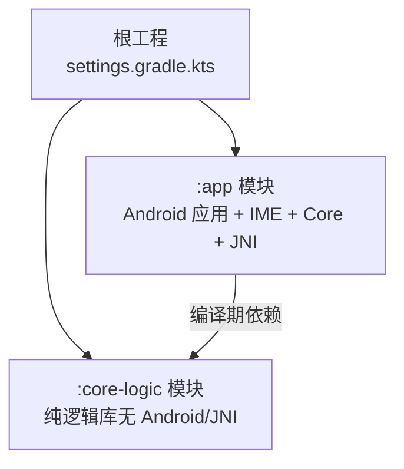
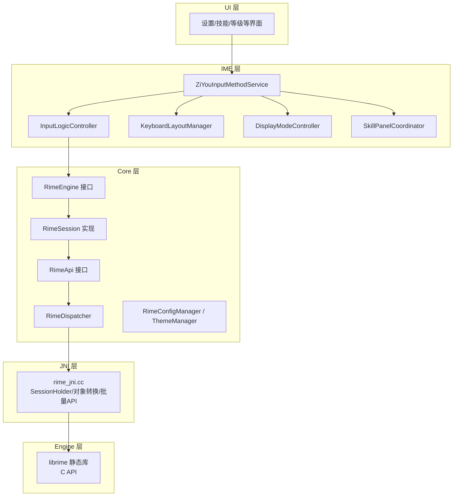
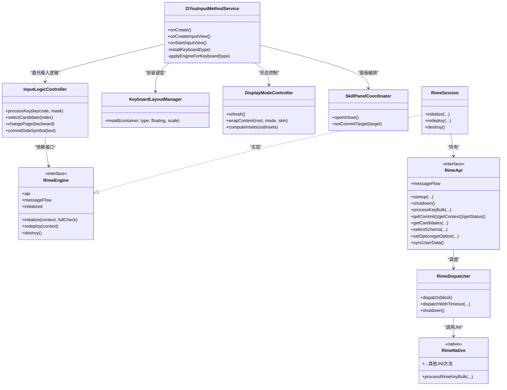
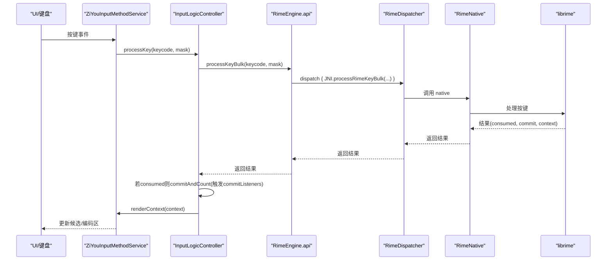
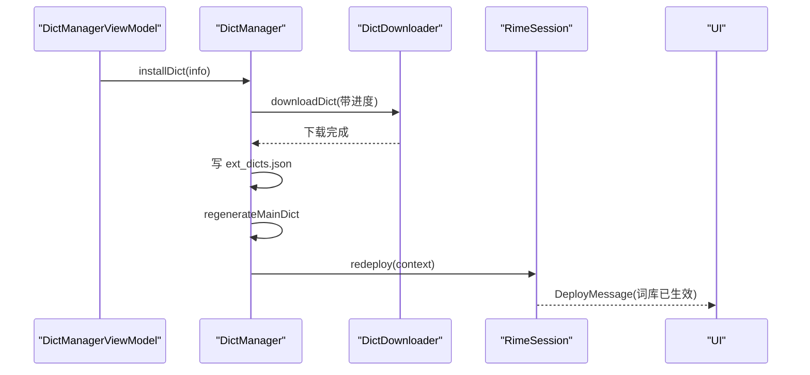
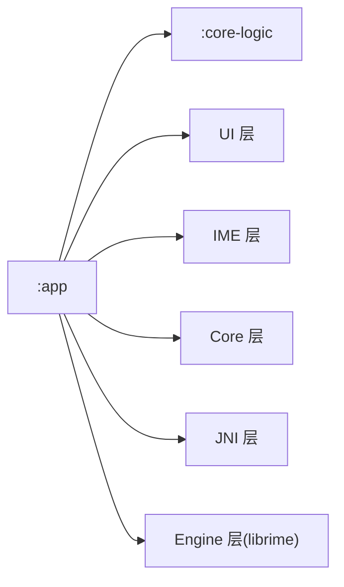
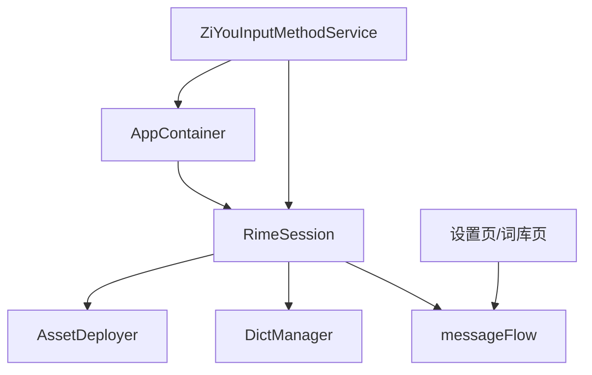
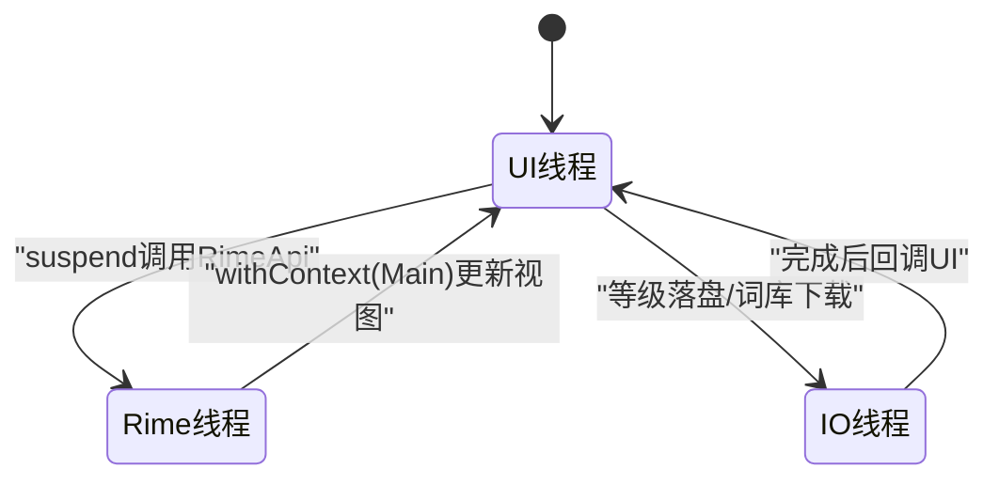

# 整体架构概览

<cite>
**本文引用的文件**   
- [settings.gradle.kts](file://settings.gradle.kts)
- [build.gradle.kts](file://build.gradle.kts)
- [app/build.gradle.kts](file://app/build.gradle.kts)
- [core-logic/build.gradle.kts](file://core-logic/build.gradle.kts)
- [ARCHITECTURE.md](file://ARCHITECTURE.md)
- [ZiyouApplication.kt](file://app/src/main/java/com/ziyou/ime/ZiyouApplication.kt)
- [AppContainer.kt](file://app/src/main/java/com/ziyou/ime/di/AppContainer.kt)
- [RimeApi.kt](file://app/src/main/java/com/ziyou/ime/core/RimeApi.kt)
- [RimeDispatcher.kt](file://app/src/main/java/com/ziyou/ime/core/RimeDispatcher.kt)
- [ZiYouInputMethodService.kt](file://app/src/main/java/com/ziyou/ime/ime/ZiYouInputMethodService.kt)
- [rime_jni.cc](file://app/src/main/jni/librime_jni/rime_jni.cc)
- [T9PinYinUtils.kt](file://core-logic/src/main/java/com/ziyou/ime/util/T9PinYinUtils.kt)
- [LevelEngine.kt](file://core-logic/src/main/java/com/ziyou/ime/core/level/LevelEngine.kt)
</cite>

## 目录
1. [简介](#简介)
2. [项目结构](#项目结构)
3. [核心组件](#核心组件)
4. [架构总览](#架构总览)
5. [详细组件分析](#详细组件分析)
6. [依赖关系分析](#依赖关系分析)
7. [性能与线程模型](#性能与线程模型)
8. [故障排查指南](#故障排查指南)
9. [结论](#结论)
10. [附录：关键流程图与类图](#附录关键流程图与类图)

## 简介
本文件面向希望快速理解字由输入法整体架构的开发者，围绕五层引擎栈（UI → IME → Core → JNI → Engine）与 Gradle 多模块组织（:app 与 :core-logic）展开。文档重点说明各层职责、组件交互、数据流向、单向依赖设计原则（:app → :core-logic），以及系统边界、技术栈选择与架构权衡。文末提供架构图与类图，帮助读者建立全局认知。

## 项目结构
- 根工程通过 settings.gradle.kts 声明两个子模块：:app 与 :core-logic。
- :app 为 Android 应用模块，包含 UI、IME 服务、Core 层、JNI 桥接与 librime 集成；同时负责资源部署、主题、词库管理等业务域。
- :core-logic 为纯 Kotlin 逻辑库，不包含任何 Android/JNI 依赖，承载可独立单元测试的纯逻辑（如 T9 映射、九宫格状态机、等级计分等）。
- 依赖方向严格单向：:app → :core-logic，由编译器强制约束，避免反向耦合。



**图表来源** 
- [settings.gradle.kts:25-28](file://settings.gradle.kts#L25-L28)

**章节来源**
- [settings.gradle.kts:1-28](file://settings.gradle.kts#L1-L28)
- [build.gradle.kts:1-7](file://build.gradle.kts#L1-L7)
- [app/build.gradle.kts:143-147](file://app/build.gradle.kts#L143-L147)
- [core-logic/build.gradle.kts:5-11](file://core-logic/build.gradle.kts#L5-L11)

## 核心组件
- 应用入口：ZiyouApplication，负责全局初始化，资源部署与引擎初始化延迟到 RimeSession 异步执行。
- DI 组合根：AppContainer，装配 RimeSession 的部署步骤与上屏监听，暴露 rimeEngine 供调用方使用。
- 引擎接口与调度：RimeApi（所有操作 suspend）、RimeDispatcher（单线程调度器，保证 librime 线程安全）。
- IME 服务：ZiYouInputMethodService，管理生命周期、视图装配、输入协作与消息处理。
- JNI 层：rime_jni.cc，封装 librime 单例、会话 RAII、对象转换与批量 API。
- 纯逻辑：T9PinYinUtils（T9↔拼音双向映射）、LevelEngine（等级计分引擎）等位于 :core-logic。

**章节来源**
- [ZiyouApplication.kt:1-26](file://app/src/main/java/com/ziyou/ime/ZiyouApplication.kt#L1-L26)
- [AppContainer.kt:1-59](file://app/src/main/java/com/ziyou/ime/di/AppContainer.kt#L1-L59)
- [RimeApi.kt:1-105](file://app/src/main/java/com/ziyou/ime/core/RimeApi.kt#L1-L105)
- [RimeDispatcher.kt:1-91](file://app/src/main/java/com/ziyou/ime/core/RimeDispatcher.kt#L1-L91)
- [ZiYouInputMethodService.kt:1-800](file://app/src/main/java/com/ziyou/ime/ime/ZiYouInputMethodService.kt#L1-L800)
- [rime_jni.cc:1-200](file://app/src/main/jni/librime_jni/rime_jni.cc#L1-L200)
- [T9PinYinUtils.kt:1-375](file://core-logic/src/main/java/com/ziyou/ime/util/T9PinYinUtils.kt#L1-L375)
- [LevelEngine.kt:1-187](file://core-logic/src/main/java/com/ziyou/ime/core/level/LevelEngine.kt#L1-L187)

## 架构总览
字由输入法采用经典的五层引擎栈，自上而下职责清晰、单向依赖：
- UI 层：设置页、技能面板、等级页面等（Compose/传统 View）。
- IME 层：InputMethodService 及多个协作控制器（输入逻辑、键盘布局、显示模式、技能面板协调等）。
- Core 层：RimeEngine 接口、RimeSession 实现、RimeApi、RimeDispatcher、配置与主题管理。
- JNI 层：C++ 封装 librime，导出 Java 可调用的 native 方法。
- Engine 层：librime 预编译静态库（C API）。



**图表来源** 
- [ZiYouInputMethodService.kt:1-800](file://app/src/main/java/com/ziyou/ime/ime/ZiYouInputMethodService.kt#L1-L800)
- [RimeApi.kt:1-105](file://app/src/main/java/com/ziyou/ime/core/RimeApi.kt#L1-L105)
- [RimeDispatcher.kt:1-91](file://app/src/main/java/com/ziyou/ime/core/RimeDispatcher.kt#L1-L91)
- [rime_jni.cc:1-200](file://app/src/main/jni/librime_jni/rime_jni.cc#L1-L200)

## 详细组件分析

### 五层引擎栈与模块边界
- UI 层：以 Compose 为主，承载设置、技能管理与等级展示等。
- IME 层：ZiYouInputMethodService 聚焦生命周期与视图装配；输入热路径委托 InputLogicController；键盘布局由 KeyboardLayoutManager 组装；显示形态由 DisplayModeController 管理；技能面板由 SkillPanelCoordinator 编排。
- Core 层：RimeEngine 抽象生命周期，RimeSession 统一初始化/销毁/重部署；RimeApi 定义全部操作（suspend）；RimeDispatcher 确保 librime 单线程安全；配置与主题管理封装 JNI 配置与皮肤切换。
- JNI 层：rime_jni.cc 导出 native 方法，封装 librime 单例、会话 RAII、对象转换与批量 API（processKeyBulk 等）。
- Engine 层：librime 预编译静态库，提供 C API。



**图表来源** 
- [ZiYouInputMethodService.kt:1-800](file://app/src/main/java/com/ziyou/ime/ime/ZiYouInputMethodService.kt#L1-L800)
- [RimeApi.kt:1-105](file://app/src/main/java/com/ziyou/ime/core/RimeApi.kt#L1-L105)
- [RimeDispatcher.kt:1-91](file://app/src/main/java/com/ziyou/ime/core/RimeDispatcher.kt#L1-L91)
- [rime_jni.cc:1-200](file://app/src/main/jni/librime_jni/rime_jni.cc#L1-L200)

**章节来源**
- [ARCHITECTURE.md:1-632](file://ARCHITECTURE.md#L1-L632)

### 数据流：按键到输出（QWERTY/普通按键）
- 触摸软键盘 → Service.onKeyPress → InputLogicController.processKey → RimeApi.processKeyBulk → RimeDispatcher.dispatch → JNI processRimeKeyBulk → librime 处理 → 返回 consumed/commit/context → UI 刷新。
- commit 后触发 commitListeners（当前为 LevelStats 计分，仅内存自增）。



**图表来源** 
- [ZiYouInputMethodService.kt:1-800](file://app/src/main/java/com/ziyou/ime/ime/ZiYouInputMethodService.kt#L1-L800)
- [RimeApi.kt:1-105](file://app/src/main/java/com/ziyou/ime/core/RimeApi.kt#L1-L105)
- [RimeDispatcher.kt:1-91](file://app/src/main/java/com/ziyou/ime/core/RimeDispatcher.kt#L1-L91)
- [rime_jni.cc:1-200](file://app/src/main/jni/librime_jni/rime_jni.cc#L1-L200)

**章节来源**
- [ARCHITECTURE.md:393-430](file://ARCHITECTURE.md#L393-L430)

### 数据流：九宫格拼音消歧
- 数字键输入 → KeyRecordStack.pushT9Key → PinyinHintProvider.buildHints → 侧栏展示候选拼音 → 用户选择 → ReplaceCommand → replaceKey + processKey(XK_End) → 智能退格还原。

```mermaid
flowchart TD
Start(["开始"]) --> PushT9["pushT9Key('4'/'8'/'6')"]
PushT9 --> BuildHints["PinyinHintProvider.buildHints(context)"]
BuildHints --> ShowCandidates["侧栏展示候选拼音"]
ShowCandidates --> SelectPinyin{"用户选择拼音?"}
SelectPinyin --> |是| ReplaceCmd["keyRecordStack.pushPinyinSelectAction(pinyin)<br/>→ ReplaceCommand"]
ReplaceCmd --> ReplaceKey["engine.api.replaceKey(caretPos, length, pinyin+\"'\")"]
ReplaceKey --> EndKey["engine.api.processKey(XK_End)"]
EndKey --> UpdateUI["renderContext(context)"]
SelectPinyin --> |否| Backspace{"BackSpace?"}
Backspace --> |是| Restore["popAndRestore()<br/>→ restorePinyin(command)"]
Restore --> UpdateUI
Backspace --> |否| NormalBack["普通退格"]
NormalBack --> UpdateUI
UpdateUI --> End(["结束"])
```

**图表来源** 
- [ZiYouInputMethodService.kt:1-800](file://app/src/main/java/com/ziyou/ime/ime/ZiYouInputMethodService.kt#L1-L800)
- [T9PinYinUtils.kt:1-375](file://core-logic/src/main/java/com/ziyou/ime/util/T9PinYinUtils.kt#L1-L375)

**章节来源**
- [ARCHITECTURE.md:409-421](file://ARCHITECTURE.md#L409-L421)

### 数据流：扩展词库安装到生效
- ViewModel.installDict → DictManager.installDict → DictDownloader.downloadDict → 写 ext_dicts.json → regenerateMainDict → RimeSession.redeploy → UI 提示「词库已生效」。



**图表来源** 
- [ARCHITECTURE.md:422-429](file://ARCHITECTURE.md#L422-L429)

**章节来源**
- [ARCHITECTURE.md:422-429](file://ARCHITECTURE.md#L422-L429)

### 单向依赖与模块边界
- :app → :core-logic 单向依赖，编译器强制。:core-logic 不依赖 Android/JNI，便于 JVM 单元测试。
- :app 内部遵循 UI → IME → Core → JNI → Engine 单向向下依赖。



**图表来源** 
- [app/build.gradle.kts:143-147](file://app/build.gradle.kts#L143-L147)
- [core-logic/build.gradle.kts:5-11](file://core-logic/build.gradle.kts#L5-L11)

**章节来源**
- [app/build.gradle.kts:143-147](file://app/build.gradle.kts#L143-L147)
- [core-logic/build.gradle.kts:5-11](file://core-logic/build.gradle.kts#L5-L11)

## 依赖关系分析
- 模块依赖：:app 依赖 :core-logic（implementation(project(":core-logic"))）。
- 运行时依赖：ZiYouInputMethodService 通过 AppContainer.rimeEngine 获取 RimeEngine；RimeSession 装配 deploySteps（AssetDeployer → DictManager.regenerateMainDict）。
- 消息流：RimeSession.messageFlow 被 Service 与设置页订阅，用于方案/选项/部署状态变更。



**图表来源** 
- [AppContainer.kt:1-59](file://app/src/main/java/com/ziyou/ime/di/AppContainer.kt#L1-L59)
- [ZiYouInputMethodService.kt:1-800](file://app/src/main/java/com/ziyou/ime/ime/ZiYouInputMethodService.kt#L1-L800)

**章节来源**
- [AppContainer.kt:1-59](file://app/src/main/java/com/ziyou/ime/di/AppContainer.kt#L1-L59)
- [ZiYouInputMethodService.kt:1-800](file://app/src/main/java/com/ziyou/ime/ime/ZiYouInputMethodService.kt#L1-L800)

## 性能与线程模型
- 单线程 Dispatcher：RimeDispatcher 使用 SingleThreadExecutor，确保 librime 线程安全；processKeyBulk 减少 JNI 跨界次数（一次按键仅 1 次主线程↔Rime 线程往返与 1 次 JNI 调用）。
- 热路径零磁盘 IO：LevelStats 仅做原子自增，达阈值或生命周期节点才后台落盘。
- 线程模型：UI 线程发起协程 → Rime 线程执行 JNI → withContext(Main) 切回更新视图；IO 线程处理等级落盘、词库下载等。



**图表来源** 
- [RimeDispatcher.kt:1-91](file://app/src/main/java/com/ziyou/ime/core/RimeDispatcher.kt#L1-L91)
- [LevelEngine.kt:1-187](file://core-logic/src/main/java/com/ziyou/ime/core/level/LevelEngine.kt#L1-L187)

**章节来源**
- [ARCHITECTURE.md:431-454](file://ARCHITECTURE.md#L431-L454)

## 故障排查指南
- 引擎未就绪：awaitEngineReady 超时导致同步放弃，需等待部署完成消息重同步。
- 方案切换失败：检查 schema 是否编译/部署成功，必要时在设置页重新部署。
- 词库生效问题：regenerateMainDict 后必须 redeploy，否则新词库不生效。
- 悬浮形态异常：确认 onEvaluateFullscreenMode=false，横屏下保留原应用画面。

**章节来源**
- [ZiYouInputMethodService.kt:1-800](file://app/src/main/java/com/ziyou/ime/ime/ZiYouInputMethodService.kt#L1-L800)
- [ARCHITECTURE.md:469-503](file://ARCHITECTURE.md#L469-L503)

## 结论
字由输入法通过五层引擎栈与 Gradle 多模块组织，实现了清晰的职责划分与单向依赖。Core 层接口化与 DI 容器提升了可测试性与可扩展性；JNI 层批量 API 与单线程调度保障了性能与线程安全；:core-logic 纯逻辑下沉使单元测试与增量构建更高效。整体架构兼顾了输入流畅度、功能扩展性与安全性，适合持续演进。

## 附录：关键流程图与类图
- 五层引擎栈类图与数据流序列图已在上述章节中给出，便于快速定位实现细节。