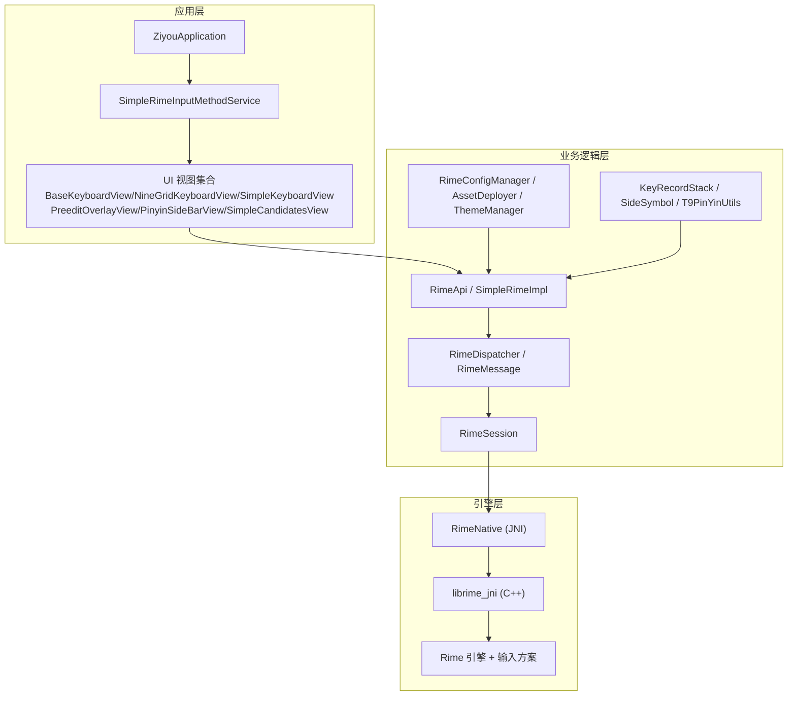
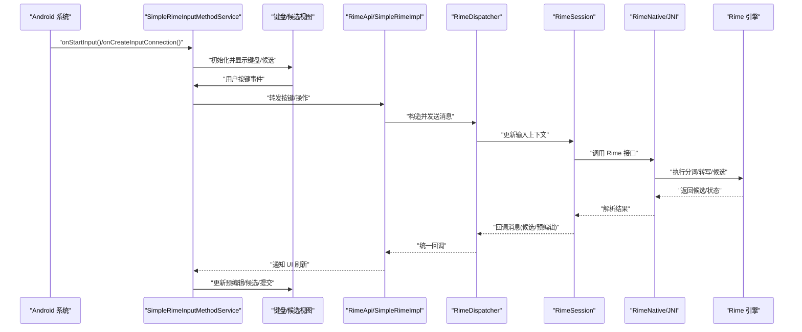
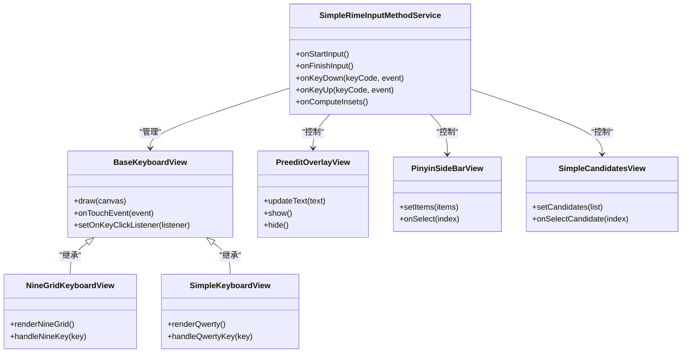
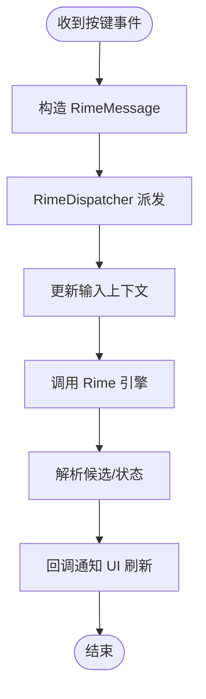
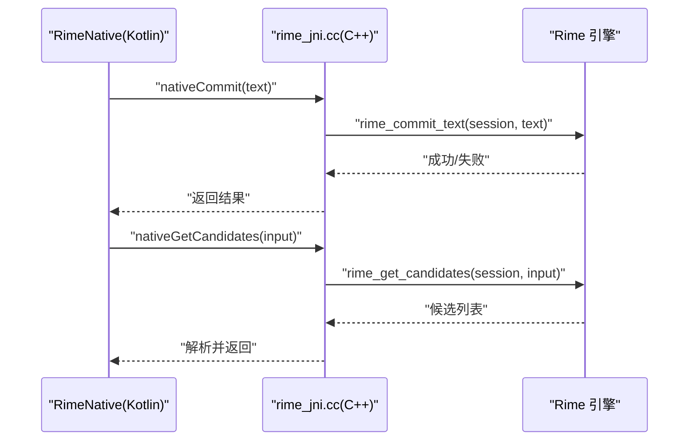
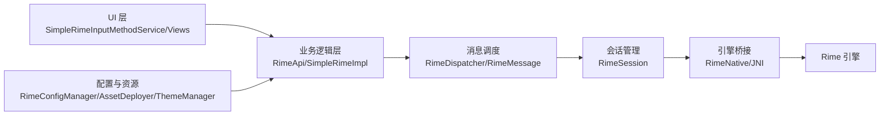

# 整体架构概览

<cite>
**本文引用的文件**   
- [AndroidManifest.xml](file://app/src/main/AndroidManifest.xml)
- [SimpleRimeInputMethodService.kt](file://app/src/main/java/com/ziyou/ime/ime/SimpleRimeInputMethodService.kt)
- [BaseKeyboardView.kt](file://app/src/main/java/com/ziyou/ime/ime/BaseKeyboardView.kt)
- [NineGridKeyboardView.kt](file://app/src/main/java/com/ziyou/ime/ime/NineGridKeyboardView.kt)
- [SimpleKeyboardView.kt](file://app/src/main/java/com/ziyou/ime/ime/SimpleKeyboardView.kt)
- [PreeditOverlayView.kt](file://app/src/main/java/com/ziyou/ime/ime/PreeditOverlayView.kt)
- [PinyinSideBarView.kt](file://app/src/main/java/com/ziyou/ime/ime/PinyinSideBarView.kt)
- [SimpleCandidatesView.kt](file://app/src/main/java/com/ziyou/ime/ime/SimpleCandidatesView.kt)
- [KeyCode.kt](file://app/src/main/java/com/ziyou/ime/ime/KeyCode.kt)
- [KeyboardType.kt](file://app/src/main/java/com/ziyou/ime/ime/KeyboardType.kt)
- [RimeApi.kt](file://app/src/main/java/com/ziyou/ime/core/RimeApi.kt)
- [RimeDispatcher.kt](file://app/src/main/java/com/ziyou/ime/core/RimeDispatcher.kt)
- [RimeMessage.kt](file://app/src/main/java/com/ziyou/ime/core/RimeMessage.kt)
- [RimeNative.kt](file://app/src/main/java/com/ziyou/ime/core/RimeNative.kt)
- [SimpleRimeImpl.kt](file://app/src/main/java/com/ziyou/ime/core/SimpleRimeImpl.kt)
- [ProtoTypes.kt](file://app/src/main/java/com/ziyou/ime/core/ProtoTypes.kt)
- [RimeSession.kt](file://app/src/main/java/com/ziyou/ime/daemon/RimeSession.kt)
- [AssetDeployer.kt](file://app/src/main/java/com/ziyou/ime/config/AssetDeployer.kt)
- [RimeConfigManager.kt](file://app/src/main/java/com/ziyou/ime/config/RimeConfigManager.kt)
- [ThemeManager.kt](file://app/src/main/java/com/ziyou/ime/config/ThemeManager.kt)
- [KeyRecordStack.kt](file://app/src/main/java/com/ziyou/ime/data/KeyRecordStack.kt)
- [SideSymbol.kt](file://app/src/main/java/com/ziyou/ime/data/SideSymbol.kt)
- [T9PinYinUtils.kt](file://app/src/main/java/com/ziyou/ime/util/T9PinYinUtils.kt)
- [SettingsActivity.kt](file://app/src/main/java/com/ziyou/ime/ui/SettingsActivity.kt)
- [ZiyouApplication.kt](file://app/src/main/java/com/ziyou/ime/ZiyouApplication.kt)
- [rime_jni.cc](file://app/src/main/jni/librime_jni/rime_jni.cc)
- [CMakeLists.txt](file://app/src/main/jni/librime_jni/CMakeLists.txt)
- [input_method.xml](file://app/src/main/res/xml/input_method.xml)
- [default.yaml](file://app/src/main/assets/rime/default.yaml)
- [luna_pinyin.schema.yaml](file://app/src/main/assets/rime/luna_pinyin.schema.yaml)
- [cangjie5.schema.yaml](file://app/src/main/assets/rime/cangjie5.schema.yaml)
- [symbols.yaml](file://app/src/main/assets/rime/symbols.yaml)
</cite>

## 目录
1. [简介](#简介)
2. [项目结构](#项目结构)
3. [核心组件](#核心组件)
4. [架构总览](#架构总览)
5. [详细组件分析](#详细组件分析)
6. [依赖关系分析](#依赖关系分析)
7. [性能考量](#性能考量)
8. [故障排查指南](#故障排查指南)
9. [结论](#结论)
10. [附录](#附录)

## 简介
本文件为 ziyou-ime 输入法项目的整体架构概览，面向开发者与产品人员，帮助快速理解基于分层架构的设计思路。项目采用 UI 层、业务逻辑层、Rime 引擎层的清晰划分：UI 层负责键盘渲染与用户交互；业务逻辑层负责输入状态管理、候选词处理、配置与主题等；Rime 引擎层通过 JNI 桥接原生 Rime 能力，提供输入方案与转写能力。文档同时说明 Android InputMethodService 的实现方式与生命周期管理，并给出系统架构图、数据流图与关键调用时序，强调解耦、可测试性与可扩展性等设计原则。

## 项目结构
项目按功能域组织代码：
- app/src/main/java/com/ziyou/ime：应用主模块，包含 IME 服务、UI 视图、核心逻辑、配置与工具类
- app/src/main/jni/librime_jni：JNI 桥接层，封装对 Rime 原生的调用
- app/src/main/assets/rime：Rime 输入方案与资源（schema/dict/yaml）
- app/src/main/res/xml：IME 描述与资源
- core-logic：独立的核心逻辑模块（当前为空示例，便于后续拆分）
- librime-prebuilt：Rime 源码与构建脚本（供参考或本地编译）

图表来源
- [SimpleRimeInputMethodService.kt:1-200](file://app/src/main/java/com/ziyou/ime/ime/SimpleRimeInputMethodService.kt#L1-L200)
- [BaseKeyboardView.kt:1-200](file://app/src/main/java/com/ziyou/ime/ime/BaseKeyboardView.kt#L1-L200)
- [NineGridKeyboardView.kt:1-200](file://app/src/main/java/com/ziyou/ime/ime/NineGridKeyboardView.kt#L1-L200)
- [SimpleKeyboardView.kt:1-200](file://app/src/main/java/com/ziyou/ime/ime/SimpleKeyboardView.kt#L1-L200)
- [PreeditOverlayView.kt:1-200](file://app/src/main/java/com/ziyou/ime/ime/PreeditOverlayView.kt#L1-L200)
- [PinyinSideBarView.kt:1-200](file://app/src/main/java/com/ziyou/ime/ime/PinyinSideBarView.kt#L1-L200)
- [SimpleCandidatesView.kt:1-200](file://app/src/main/java/com/ziyou/ime/ime/SimpleCandidatesView.kt#L1-L200)
- [RimeApi.kt:1-200](file://app/src/main/java/com/ziyou/ime/core/RimeApi.kt#L1-L200)
- [SimpleRimeImpl.kt:1-200](file://app/src/main/java/com/ziyou/ime/core/SimpleRimeImpl.kt#L1-L200)
- [RimeDispatcher.kt:1-200](file://app/src/main/java/com/ziyou/ime/core/RimeDispatcher.kt#L1-L200)
- [RimeMessage.kt:1-200](file://app/src/main/java/com/ziyou/ime/core/RimeMessage.kt#L1-L200)
- [RimeNative.kt:1-200](file://app/src/main/java/com/ziyou/ime/core/RimeNative.kt#L1-L200)
- [RimeSession.kt:1-200](file://app/src/main/java/com/ziyou/ime/daemon/RimeSession.kt#L1-L200)
- [RimeConfigManager.kt:1-200](file://app/src/main/java/com/ziyou/ime/config/RimeConfigManager.kt#L1-L200)
- [AssetDeployer.kt:1-200](file://app/src/main/java/com/ziyou/ime/config/AssetDeployer.kt#L1-L200)
- [ThemeManager.kt:1-200](file://app/src/main/java/com/ziyou/ime/config/ThemeManager.kt#L1-L200)
- [KeyRecordStack.kt:1-200](file://app/src/main/java/com/ziyou/ime/data/KeyRecordStack.kt#L1-L200)
- [SideSymbol.kt:1-200](file://app/src/main/java/com/ziyou/ime/data/SideSymbol.kt#L1-L200)
- [T9PinYinUtils.kt:1-200](file://app/src/main/java/com/ziyou/ime/util/T9PinYinUtils.kt#L1-L200)
- [rime_jni.cc:1-200](file://app/src/main/jni/librime_jni/rime_jni.cc#L1-L200)
- [CMakeLists.txt:1-200](file://app/src/main/jni/librime_jni/CMakeLists.txt#L1-L200)

章节来源
- [AndroidManifest.xml:1-200](file://app/src/main/AndroidManifest.xml#L1-L200)
- [input_method.xml:1-200](file://app/src/main/res/xml/input_method.xml#L1-L200)

## 核心组件
- 输入法服务与 UI 视图
  - SimpleRimeInputMethodService：继承自 InputMethodService，作为系统输入法入口，负责生命周期回调、软键盘显示/隐藏、事件分发与 UI 绑定
  - BaseKeyboardView/NineGridKeyboardView/SimpleKeyboardView：键盘视图基类与具体实现，处理按键绘制与点击事件
  - PreeditOverlayView/PinyinSideBarView/SimpleCandidatesView：预编辑区、拼音侧边栏与候选项展示
- 核心逻辑与消息调度
  - RimeApi/SimpleRimeImpl：对外暴露的输入 API，内部维护会话与状态，屏蔽底层细节
  - RimeDispatcher/RimeMessage：统一的消息派发与类型化消息定义，解耦 UI 与引擎
  - RimeSession：单例或进程内会话管理，持有 Rime 上下文与输入状态
- 引擎桥接
  - RimeNative：JNI 接口封装，调用 rime_jni.cc 中的 C++ 方法
  - rime_jni.cc：C++ 层桥接，调用 Rime 原生 API，完成分词、转写、候选生成等
- 配置与资源
  - RimeConfigManager/AssetDeployer/ThemeManager：加载与部署 Rime 配置、资源与主题
  - assets/rime/*.yaml：Rime 输入方案与符号表
- 数据与工具
  - KeyRecordStack/SideSymbol：按键历史与侧边栏符号数据结构
  - T9PinYinUtils：九宫格与拼音辅助算法

章节来源
- [SimpleRimeInputMethodService.kt:1-200](file://app/src/main/java/com/ziyou/ime/ime/SimpleRimeInputMethodService.kt#L1-L200)
- [BaseKeyboardView.kt:1-200](file://app/src/main/java/com/ziyou/ime/ime/BaseKeyboardView.kt#L1-L200)
- [NineGridKeyboardView.kt:1-200](file://app/src/main/java/com/ziyou/ime/ime/NineGridKeyboardView.kt#L1-L200)
- [SimpleKeyboardView.kt:1-200](file://app/src/main/java/com/ziyou/ime/ime/SimpleKeyboardView.kt#L1-L200)
- [PreeditOverlayView.kt:1-200](file://app/src/main/java/com/ziyou/ime/ime/PreeditOverlayView.kt#L1-L200)
- [PinyinSideBarView.kt:1-200](file://app/src/main/java/com/ziyou/ime/ime/PinyinSideBarView.kt#L1-L200)
- [SimpleCandidatesView.kt:1-200](file://app/src/main/java/com/ziyou/ime/ime/SimpleCandidatesView.kt#L1-L200)
- [RimeApi.kt:1-200](file://app/src/main/java/com/ziyou/ime/core/RimeApi.kt#L1-L200)
- [SimpleRimeImpl.kt:1-200](file://app/src/main/java/com/ziyou/ime/core/SimpleRimeImpl.kt#L1-L200)
- [RimeDispatcher.kt:1-200](file://app/src/main/java/com/ziyou/ime/core/RimeDispatcher.kt#L1-L200)
- [RimeMessage.kt:1-200](file://app/src/main/java/com/ziyou/ime/core/RimeMessage.kt#L1-L200)
- [RimeNative.kt:1-200](file://app/src/main/java/com/ziyou/ime/core/RimeNative.kt#L1-L200)
- [RimeSession.kt:1-200](file://app/src/main/java/com/ziyou/ime/daemon/RimeSession.kt#L1-L200)
- [RimeConfigManager.kt:1-200](file://app/src/main/java/com/ziyou/ime/config/RimeConfigManager.kt#L1-L200)
- [AssetDeployer.kt:1-200](file://app/src/main/java/com/ziyou/ime/config/AssetDeployer.kt#L1-L200)
- [ThemeManager.kt:1-200](file://app/src/main/java/com/ziyou/ime/config/ThemeManager.kt#L1-L200)
- [KeyRecordStack.kt:1-200](file://app/src/main/java/com/ziyou/ime/data/KeyRecordStack.kt#L1-L200)
- [SideSymbol.kt:1-200](file://app/src/main/java/com/ziyou/ime/data/SideSymbol.kt#L1-L200)
- [T9PinYinUtils.kt:1-200](file://app/src/main/java/com/ziyou/ime/util/T9PinYinUtils.kt#L1-L200)

## 架构总览
项目采用分层架构与消息驱动模式：
- UI 层：接收用户输入事件，更新键盘与候选展示
- 业务逻辑层：将 UI 事件转换为结构化消息，调度到 Rime 引擎，处理候选与提交
- 引擎层：通过 JNI 调用 Rime 原生能力，返回候选与状态变更

图表来源
- [SimpleRimeInputMethodService.kt:1-200](file://app/src/main/java/com/ziyou/ime/ime/SimpleRimeInputMethodService.kt#L1-L200)
- [RimeApi.kt:1-200](file://app/src/main/java/com/ziyou/ime/core/RimeApi.kt#L1-L200)
- [RimeDispatcher.kt:1-200](file://app/src/main/java/com/ziyou/ime/core/RimeDispatcher.kt#L1-L200)
- [RimeSession.kt:1-200](file://app/src/main/java/com/ziyou/ime/daemon/RimeSession.kt#L1-L200)
- [RimeNative.kt:1-200](file://app/src/main/java/com/ziyou/ime/core/RimeNative.kt#L1-L200)
- [rime_jni.cc:1-200](file://app/src/main/jni/librime_jni/rime_jni.cc#L1-L200)

## 详细组件分析

### 输入法服务与 UI 层
- SimpleRimeInputMethodService
  - 职责：实现 InputMethodService 生命周期，创建 InputConnection，管理软键盘可见性，协调 UI 与核心逻辑
  - 关键点：在 onStartInput/onFinishInput 中初始化/释放资源；在 onEvaluateEditingModeChanged 中调整布局；在 onKeyDown/onKeyUp 中转发事件
- 键盘与候选视图
  - BaseKeyboardView：抽象键盘视图，定义绘制与事件钩子
  - NineGridKeyboardView/SimpleKeyboardView：九宫格与简易键盘实现
  - PreeditOverlayView：预编辑文本覆盖层
  - PinyinSideBarView：拼音侧边栏滚动选择
  - SimpleCandidatesView：候选列表展示与选择回调

图表来源
- [SimpleRimeInputMethodService.kt:1-200](file://app/src/main/java/com/ziyou/ime/ime/SimpleRimeInputMethodService.kt#L1-L200)
- [BaseKeyboardView.kt:1-200](file://app/src/main/java/com/ziyou/ime/ime/BaseKeyboardView.kt#L1-L200)
- [NineGridKeyboardView.kt:1-200](file://app/src/main/java/com/ziyou/ime/ime/NineGridKeyboardView.kt#L1-L200)
- [SimpleKeyboardView.kt:1-200](file://app/src/main/java/com/ziyou/ime/ime/SimpleKeyboardView.kt#L1-L200)
- [PreeditOverlayView.kt:1-200](file://app/src/main/java/com/ziyou/ime/ime/PreeditOverlayView.kt#L1-L200)
- [PinyinSideBarView.kt:1-200](file://app/src/main/java/com/ziyou/ime/ime/PinyinSideBarView.kt#L1-L200)
- [SimpleCandidatesView.kt:1-200](file://app/src/main/java/com/ziyou/ime/ime/SimpleCandidatesView.kt#L1-L200)

章节来源
- [SimpleRimeInputMethodService.kt:1-200](file://app/src/main/java/com/ziyou/ime/ime/SimpleRimeInputMethodService.kt#L1-L200)
- [BaseKeyboardView.kt:1-200](file://app/src/main/java/com/ziyou/ime/ime/BaseKeyboardView.kt#L1-L200)
- [NineGridKeyboardView.kt:1-200](file://app/src/main/java/com/ziyou/ime/ime/NineGridKeyboardView.kt#L1-L200)
- [SimpleKeyboardView.kt:1-200](file://app/src/main/java/com/ziyou/ime/ime/SimpleKeyboardView.kt#L1-L200)
- [PreeditOverlayView.kt:1-200](file://app/src/main/java/com/ziyou/ime/ime/PreeditOverlayView.kt#L1-L200)
- [PinyinSideBarView.kt:1-200](file://app/src/main/java/com/ziyou/ime/ime/PinyinSideBarView.kt#L1-L200)
- [SimpleCandidatesView.kt:1-200](file://app/src/main/java/com/ziyou/ime/ime/SimpleCandidatesView.kt#L1-L200)

### 业务逻辑层与消息调度
- RimeApi/SimpleRimeImpl
  - 职责：对外暴露统一的输入 API，封装会话、状态与回调；支持切换输入方案、提交字符、获取候选
- RimeDispatcher/RimeMessage
  - 职责：定义消息类型与派发机制，解耦 UI 与引擎；保证线程安全与顺序性
- RimeSession
  - 职责：维护 Rime 上下文、输入状态、方案切换与缓存

图表来源
- [RimeApi.kt:1-200](file://app/src/main/java/com/ziyou/ime/core/RimeApi.kt#L1-L200)
- [SimpleRimeImpl.kt:1-200](file://app/src/main/java/com/ziyou/ime/core/SimpleRimeImpl.kt#L1-L200)
- [RimeDispatcher.kt:1-200](file://app/src/main/java/com/ziyou/ime/core/RimeDispatcher.kt#L1-L200)
- [RimeMessage.kt:1-200](file://app/src/main/java/com/ziyou/ime/core/RimeMessage.kt#L1-L200)
- [RimeSession.kt:1-200](file://app/src/main/java/com/ziyou/ime/daemon/RimeSession.kt#L1-L200)

章节来源
- [RimeApi.kt:1-200](file://app/src/main/java/com/ziyou/ime/core/RimeApi.kt#L1-L200)
- [SimpleRimeImpl.kt:1-200](file://app/src/main/java/com/ziyou/ime/core/SimpleRimeImpl.kt#L1-L200)
- [RimeDispatcher.kt:1-200](file://app/src/main/java/com/ziyou/ime/core/RimeDispatcher.kt#L1-L200)
- [RimeMessage.kt:1-200](file://app/src/main/java/com/ziyou/ime/core/RimeMessage.kt#L1-L200)
- [RimeSession.kt:1-200](file://app/src/main/java/com/ziyou/ime/daemon/RimeSession.kt#L1-L200)

### 引擎层与 JNI 桥接
- RimeNative
  - 职责：声明 native 方法，映射到 C++ 实现；负责参数序列化与结果反序列化
- rime_jni.cc
  - 职责：实现 JNI 接口，调用 Rime API（如 create/destroy session、commit、get_candidates 等）
- CMakeLists.txt
  - 职责：定义 JNI 模块、链接库与头文件路径

图表来源
- [RimeNative.kt:1-200](file://app/src/main/java/com/ziyou/ime/core/RimeNative.kt#L1-L200)
- [rime_jni.cc:1-200](file://app/src/main/jni/librime_jni/rime_jni.cc#L1-L200)
- [CMakeLists.txt:1-200](file://app/src/main/jni/librime_jni/CMakeLists.txt#L1-L200)

章节来源
- [RimeNative.kt:1-200](file://app/src/main/java/com/ziyou/ime/core/RimeNative.kt#L1-L200)
- [rime_jni.cc:1-200](file://app/src/main/jni/librime_jni/rime_jni.cc#L1-L200)
- [CMakeLists.txt:1-200](file://app/src/main/jni/librime_jni/CMakeLists.txt#L1-L200)

### 配置与资源管理
- RimeConfigManager
  - 职责：加载 default.yaml、schema.yaml 等配置，合并与校验
- AssetDeployer
  - 职责：从 assets 部署 Rime 资源到运行时目录，确保引擎可用
- ThemeManager
  - 职责：管理主题与样式，影响 UI 渲染

章节来源
- [RimeConfigManager.kt:1-200](file://app/src/main/java/com/ziyou/ime/config/RimeConfigManager.kt#L1-L200)
- [AssetDeployer.kt:1-200](file://app/src/main/java/com/ziyou/ime/config/AssetDeployer.kt#L1-L200)
- [ThemeManager.kt:1-200](file://app/src/main/java/com/ziyou/ime/config/ThemeManager.kt#L1-L200)
- [default.yaml:1-200](file://app/src/main/assets/rime/default.yaml#L1-L200)
- [luna_pinyin.schema.yaml:1-200](file://app/src/main/assets/rime/luna_pinyin.schema.yaml#L1-L200)
- [cangjie5.schema.yaml:1-200](file://app/src/main/assets/rime/cangjie5.schema.yaml#L1-L200)
- [symbols.yaml:1-200](file://app/src/main/assets/rime/symbols.yaml#L1-L200)

### 数据模型与工具
- ProtoTypes
  - 职责：定义跨层传输的数据结构（如候选项、输入上下文）
- KeyRecordStack/SideSymbol
  - 职责：按键历史记录与侧边栏符号集合
- T9PinYinUtils
  - 职责：九宫格与拼音转换辅助算法

章节来源
- [ProtoTypes.kt:1-200](file://app/src/main/java/com/ziyou/ime/core/ProtoTypes.kt#L1-L200)
- [KeyRecordStack.kt:1-200](file://app/src/main/java/com/ziyou/ime/data/KeyRecordStack.kt#L1-L200)
- [SideSymbol.kt:1-200](file://app/src/main/java/com/ziyou/ime/data/SideSymbol.kt#L1-L200)
- [T9PinYinUtils.kt:1-200](file://app/src/main/java/com/ziyou/ime/util/T9PinYinUtils.kt#L1-L200)

## 依赖关系分析
- UI 层依赖业务逻辑层（RimeApi/SimpleRimeImpl），不直接访问 JNI
- 业务逻辑层依赖 RimeSession 与 RimeNative，屏蔽引擎细节
- 引擎层通过 JNI 与 Rime 原生交互，避免上层耦合
- 配置与资源由配置层统一管理，注入到业务逻辑层

图表来源
- [SimpleRimeInputMethodService.kt:1-200](file://app/src/main/java/com/ziyou/ime/ime/SimpleRimeInputMethodService.kt#L1-L200)
- [RimeApi.kt:1-200](file://app/src/main/java/com/ziyou/ime/core/RimeApi.kt#L1-L200)
- [RimeDispatcher.kt:1-200](file://app/src/main/java/com/ziyou/ime/core/RimeDispatcher.kt#L1-L200)
- [RimeSession.kt:1-200](file://app/src/main/java/com/ziyou/ime/daemon/RimeSession.kt#L1-L200)
- [RimeNative.kt:1-200](file://app/src/main/java/com/ziyou/ime/core/RimeNative.kt#L1-L200)
- [rime_jni.cc:1-200](file://app/src/main/jni/librime_jni/rime_jni.cc#L1-L200)
- [RimeConfigManager.kt:1-200](file://app/src/main/java/com/ziyou/ime/config/RimeConfigManager.kt#L1-L200)
- [AssetDeployer.kt:1-200](file://app/src/main/java/com/ziyou/ime/config/AssetDeployer.kt#L1-L200)
- [ThemeManager.kt:1-200](file://app/src/main/java/com/ziyou/ime/config/ThemeManager.kt#L1-L200)

章节来源
- [SimpleRimeInputMethodService.kt:1-200](file://app/src/main/java/com/ziyou/ime/ime/SimpleRimeInputMethodService.kt#L1-L200)
- [RimeApi.kt:1-200](file://app/src/main/java/com/ziyou/ime/core/RimeApi.kt#L1-L200)
- [RimeDispatcher.kt:1-200](file://app/src/main/java/com/ziyou/ime/core/RimeDispatcher.kt#L1-L200)
- [RimeSession.kt:1-200](file://app/src/main/java/com/ziyou/ime/daemon/RimeSession.kt#L1-L200)
- [RimeNative.kt:1-200](file://app/src/main/java/com/ziyou/ime/core/RimeNative.kt#L1-L200)
- [rime_jni.cc:1-200](file://app/src/main/jni/librime_jni/rime_jni.cc#L1-L200)
- [RimeConfigManager.kt:1-200](file://app/src/main/java/com/ziyou/ime/config/RimeConfigManager.kt#L1-L200)
- [AssetDeployer.kt:1-200](file://app/src/main/java/com/ziyou/ime/config/AssetDeployer.kt#L1-L200)
- [ThemeManager.kt:1-200](file://app/src/main/java/com/ziyou/ime/config/ThemeManager.kt#L1-L200)

## 性能考量
- 减少 JNI 调用频率：批量处理按键与候选请求，避免频繁跨层通信
- 异步与线程隔离：UI 线程仅做渲染与事件分发，耗时计算放在后台线程
- 资源预热：启动时预加载常用 schema 与词典，降低首次延迟
- 内存优化：复用候选对象，避免频繁分配；及时释放 Rime 会话
- 渲染优化：键盘视图按需重绘，使用离屏缓冲减少闪烁

[本节为通用指导，无需引用具体文件]

## 故障排查指南
- 输入法未显示
  - 检查 AndroidManifest.xml 中输入法服务声明与权限
  - 确认 input_method.xml 配置正确
- 候选为空或异常
  - 检查 Rime 配置与 schema 是否部署成功
  - 查看 RimeSession 状态与日志输出
- JNI 崩溃
  - 核对 rime_jni.cc 的参数传递与内存管理
  - 使用 ndk-stack 定位崩溃堆栈
- 主题不生效
  - 确认 ThemeManager 加载的资源路径与命名规范

章节来源
- [AndroidManifest.xml:1-200](file://app/src/main/AndroidManifest.xml#L1-L200)
- [input_method.xml:1-200](file://app/src/main/res/xml/input_method.xml#L1-L200)
- [RimeConfigManager.kt:1-200](file://app/src/main/java/com/ziyou/ime/config/RimeConfigManager.kt#L1-L200)
- [AssetDeployer.kt:1-200](file://app/src/main/java/com/ziyou/ime/config/AssetDeployer.kt#L1-L200)
- [ThemeManager.kt:1-200](file://app/src/main/java/com/ziyou/ime/config/ThemeManager.kt#L1-L200)
- [rime_jni.cc:1-200](file://app/src/main/jni/librime_jni/rime_jni.cc#L1-L200)

## 结论
ziyou-ime 通过清晰的三层架构与消息驱动模式，实现了 UI、业务与引擎的良好解耦。输入法服务负责生命周期与事件分发，业务层统一调度与状态管理，引擎层专注转写与候选生成。该设计具备良好的可测试性与可扩展性，便于后续引入更多输入方案与特性。建议持续优化 JNI 调用与渲染性能，完善错误处理与监控，提升用户体验。

[本节为总结性内容，无需引用具体文件]

## 附录
- 开发建议
  - 新增输入方案：在 assets/rime 中添加 schema.yaml，并在 RimeConfigManager 中注册
  - 扩展键盘视图：继承 BaseKeyboardView，实现自定义绘制与事件处理
  - 增强消息类型：在 RimeMessage 中定义新消息，并在 RimeDispatcher 中路由
- 相关入口
  - SettingsActivity：设置界面入口
  - ZiyouApplication：应用初始化与全局配置

章节来源
- [SettingsActivity.kt:1-200](file://app/src/main/java/com/ziyou/ime/ui/SettingsActivity.kt#L1-L200)
- [ZiyouApplication.kt:1-200](file://app/src/main/java/com/ziyou/ime/ZiyouApplication.kt#L1-L200)