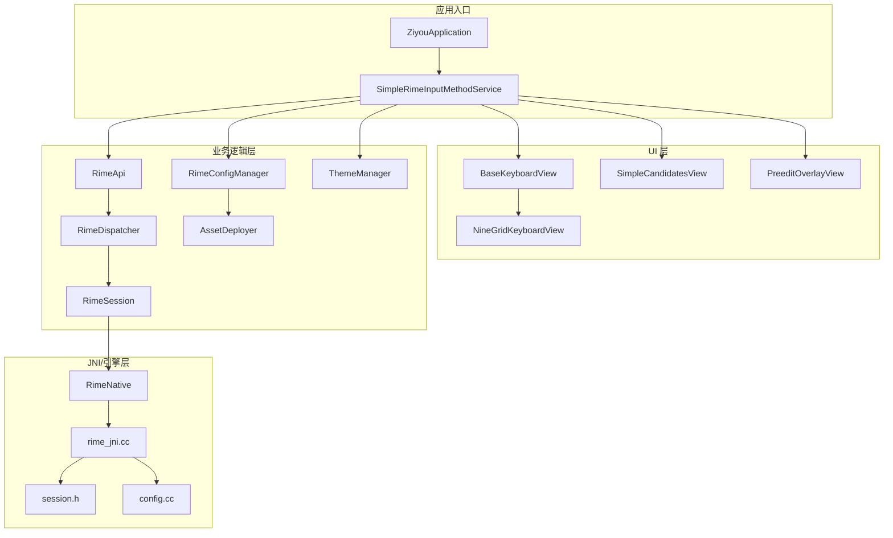
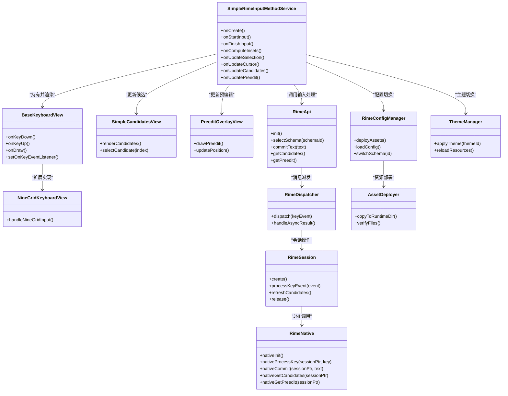
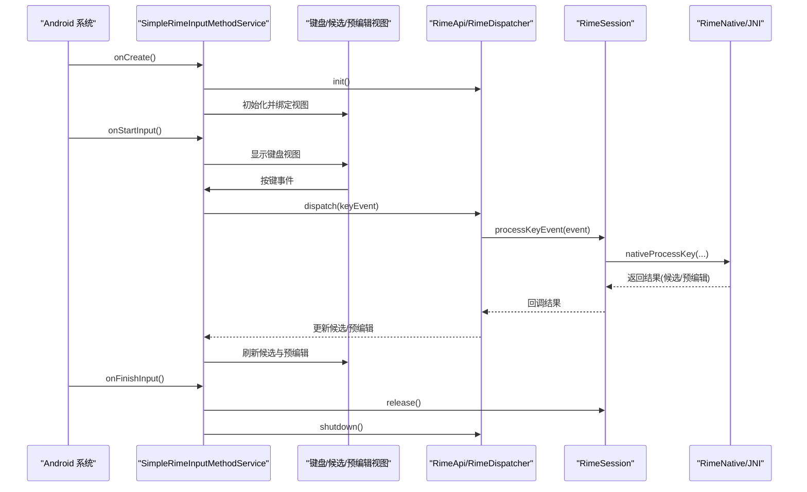
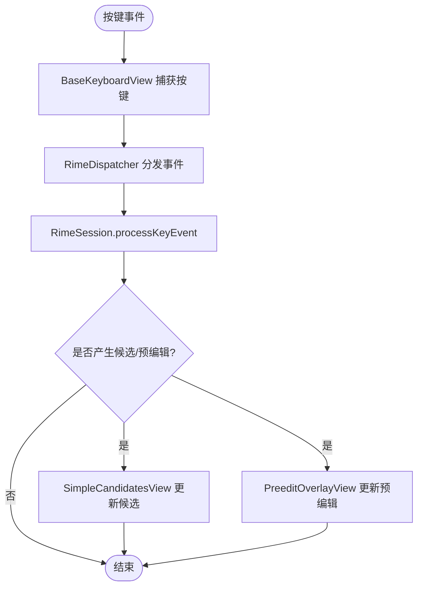
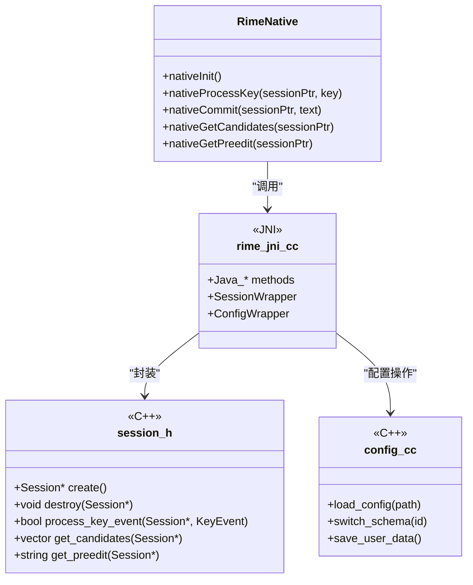
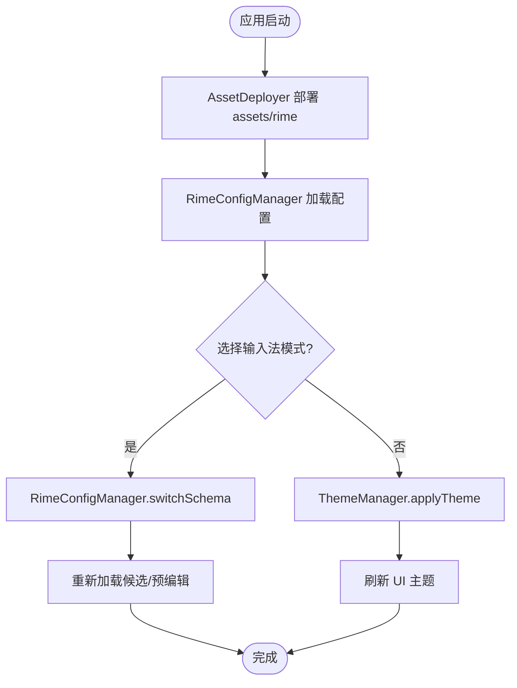
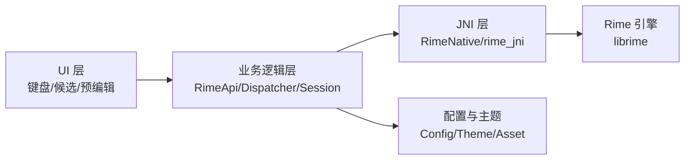

# 架构设计

<cite>
**本文引用的文件**   
- [app/src/main/java/com/ziyou/ime/ZiyouApplication.kt](file://app/src/main/java/com/ziyou/ime/ZiyouApplication.kt)
- [app/src/main/java/com/ziyou/ime/ime/SimpleRimeInputMethodService.kt](file://app/src/main/java/com/ziyou/ime/ime/SimpleRimeInputMethodService.kt)
- [app/src/main/java/com/ziyou/ime/ime/BaseKeyboardView.kt](file://app/src/main/java/com/ziyou/ime/ime/BaseKeyboardView.kt)
- [app/src/main/java/com/ziyou/ime/ime/NineGridKeyboardView.kt](file://app/src/main/java/com/ziyou/ime/ime/NineGridKeyboardView.kt)
- [app/src/main/java/com/ziyou/ime/ime/SimpleCandidatesView.kt](file://app/src/main/java/com/ziyou/ime/ime/SimpleCandidatesView.kt)
- [app/src/main/java/com/ziyou/ime/ime/PreeditOverlayView.kt](file://app/src/main/java/com/ziyou/ime/ime/PreeditOverlayView.kt)
- [app/src/main/java/com/ziyou/ime/core/RimeApi.kt](file://app/src/main/java/com/ziyou/ime/core/RimeApi.kt)
- [app/src/main/java/com/ziyou/ime/core/RimeDispatcher.kt](file://app/src/main/java/com/ziyou/ime/core/RimeDispatcher.kt)
- [app/src/main/java/com/ziyou/ime/core/RimeNative.kt](file://app/src/main/java/com/ziyou/ime/core/RimeNative.kt)
- [app/src/main/java/com/ziyou/ime/core/SimpleRimeImpl.kt](file://app/src/main/java/com/ziyou/ime/core/SimpleRimeImpl.kt)
- [app/src/main/java/com/ziyou/ime/daemon/RimeSession.kt](file://app/src/main/java/com/ziyou/ime/daemon/RimeSession.kt)
- [app/src/main/java/com/ziyou/ime/config/RimeConfigManager.kt](file://app/src/main/java/com/ziyou/ime/config/RimeConfigManager.kt)
- [app/src/main/java/com/ziyou/ime/config/ThemeManager.kt](file://app/src/main/java/com/ziyou/ime/config/ThemeManager.kt)
- [app/src/main/java/com/ziyou/ime/config/AssetDeployer.kt](file://app/src/main/java/com/ziyou/ime/config/AssetDeployer.kt)
- [app/src/main/jni/librime_jni/rime_jni.cc](file://app/src/main/jni/librime_jni/rime_jni.cc)
- [app/src/main/jni/librime_jni/session.h](file://app/src/main/jni/librime_jni/session.h)
- [app/src/main/jni/librime_jni/config.cc](file://app/src/main/jni/librime_jni/config.cc)
- [app/src/main/jni/librime_jni/helper-types.h](file://app/src/main/jni/librime_jni/helper-types.h)
- [app/src/main/jni/librime_jni/jni-utils.h](file://app/src/main/jni/librime_jni/jni-utils.h)
- [app/src/main/jni/librime_jni/objconv.h](file://app/src/main/jni/librime_jni/objconv.h)
- [app/src/main/assets/rime/default.yaml](file://app/src/main/assets/rime/default.yaml)
- [app/src/main/assets/rime/luna_pinyin.schema.yaml](file://app/src/main/assets/rime/luna_pinyin.schema.yaml)
- [app/src/main/assets/rime/cangjie5.schema.yaml](file://app/src/main/assets/rime/cangjie5.schema.yaml)
- [app/src/main/assets/rime/t9.schema.yaml](file://app/src/main/assets/rime/t9.schema.yaml)
- [app/src/main/res/xml/input_method.xml](file://app/src/main/res/xml/input_method.xml)
- [README.md](file://README.md)
- [ARCHITECTURE.md](file://ARCHITECTURE.md)
</cite>

## 目录
1. [简介](#简介)
2. [项目结构](#项目结构)
3. [核心组件](#核心组件)
4. [架构总览](#架构总览)
5. [详细组件分析](#详细组件分析)
6. [依赖关系分析](#依赖关系分析)
7. [性能考量](#性能考量)
8. [故障排查指南](#故障排查指南)
9. [结论](#结论)
10. [附录](#附录)

## 简介
本文件为 ziyou-ime 输入法项目的架构设计文档，围绕分层架构（UI 层、业务逻辑层、Rime 引擎层）展开，系统阐述 Android InputMethodService 的实现与生命周期管理、Rime 引擎的 JNI 集成方案（接口设计、会话管理与异步通信）、数据流向与核心组件协作（键盘视图、候选词显示、预编辑区域），以及配置管理与主题切换机制。文档包含架构图与数据流图，帮助开发者快速理解整体设计与实现要点。

## 项目结构
项目采用多模块组织，核心代码位于 app 模块：
- UI 层：输入方法服务与各类键盘/候选/预编辑视图
- 业务逻辑层：Rime 调度器、API 封装、会话管理、配置与主题管理
- 引擎层：JNI 桥接与 C++ Session/Config 封装
- 资源与配置：assets/rime 下的 schema/dict/yaml 配置，res/xml 输入法声明

图表来源
- [app/src/main/java/com/ziyou/ime/ZiyouApplication.kt](file://app/src/main/java/com/ziyou/ime/ZiyouApplication.kt)
- [app/src/main/java/com/ziyou/ime/ime/SimpleRimeInputMethodService.kt](file://app/src/main/java/com/ziyou/ime/ime/SimpleRimeInputMethodService.kt)
- [app/src/main/java/com/ziyou/ime/ime/BaseKeyboardView.kt](file://app/src/main/java/com/ziyou/ime/ime/BaseKeyboardView.kt)
- [app/src/main/java/com/ziyou/ime/ime/NineGridKeyboardView.kt](file://app/src/main/java/com/ziyou/ime/ime/NineGridKeyboardView.kt)
- [app/src/main/java/com/ziyou/ime/ime/SimpleCandidatesView.kt](file://app/src/main/java/com/ziyou/ime/ime/SimpleCandidatesView.kt)
- [app/src/main/java/com/ziyou/ime/ime/PreeditOverlayView.kt](file://app/src/main/java/com/ziyou/ime/ime/PreeditOverlayView.kt)
- [app/src/main/java/com/ziyou/ime/core/RimeApi.kt](file://app/src/main/java/com/ziyou/ime/core/RimeApi.kt)
- [app/src/main/java/com/ziyou/ime/core/RimeDispatcher.kt](file://app/src/main/java/com/ziyou/ime/core/RimeDispatcher.kt)
- [app/src/main/java/com/ziyou/ime/core/RimeNative.kt](file://app/src/main/java/com/ziyou/ime/core/RimeNative.kt)
- [app/src/main/java/com/ziyou/ime/daemon/RimeSession.kt](file://app/src/main/java/com/ziyou/ime/daemon/RimeSession.kt)
- [app/src/main/java/com/ziyou/ime/config/RimeConfigManager.kt](file://app/src/main/java/com/ziyou/ime/config/RimeConfigManager.kt)
- [app/src/main/java/com/ziyou/ime/config/ThemeManager.kt](file://app/src/main/java/com/ziyou/ime/config/ThemeManager.kt)
- [app/src/main/java/com/ziyou/ime/config/AssetDeployer.kt](file://app/src/main/java/com/ziyou/ime/config/AssetDeployer.kt)
- [app/src/main/jni/librime_jni/rime_jni.cc](file://app/src/main/jni/librime_jni/rime_jni.cc)
- [app/src/main/jni/librime_jni/session.h](file://app/src/main/jni/librime_jni/session.h)
- [app/src/main/jni/librime_jni/config.cc](file://app/src/main/jni/librime_jni/config.cc)

章节来源
- [README.md](file://README.md)
- [ARCHITECTURE.md](file://ARCHITECTURE.md)

## 核心组件
- 输入方法服务：继承 Android InputMethodService，负责输入法生命周期、窗口与软键盘展示、事件分发与状态同步。
- 键盘视图：BaseKeyboardView 抽象基类，NineGridKeyboardView 九宫格实现；处理按键捕获、手势与布局绘制。
- 候选与预编辑：SimpleCandidatesView 展示候选列表；PreeditOverlayView 在目标输入框上方绘制预编辑文本。
- Rime 引擎集成：RimeApi 暴露高层 API；RimeDispatcher 统一消息派发；RimeNative 调用 JNI；RimeSession 管理会话上下文。
- 配置与主题：RimeConfigManager 管理 Rime 配置与部署；ThemeManager 管理主题资源；AssetDeployer 将 assets/rime 部署到运行时路径。
- JNI 层：rime_jni.cc 暴露 native 方法，封装 librime Session/Config 操作；helper-types.h、jni-utils.h、objconv.h 提供类型转换与工具。

章节来源
- [app/src/main/java/com/ziyou/ime/ime/SimpleRimeInputMethodService.kt](file://app/src/main/java/com/ziyou/ime/ime/SimpleRimeInputMethodService.kt)
- [app/src/main/java/com/ziyou/ime/ime/BaseKeyboardView.kt](file://app/src/main/java/com/ziyou/ime/ime/BaseKeyboardView.kt)
- [app/src/main/java/com/ziyou/ime/ime/NineGridKeyboardView.kt](file://app/src/main/java/com/ziyou/ime/ime/NineGridKeyboardView.kt)
- [app/src/main/java/com/ziyou/ime/ime/SimpleCandidatesView.kt](file://app/src/main/java/com/ziyou/ime/ime/SimpleCandidatesView.kt)
- [app/src/main/java/com/ziyou/ime/ime/PreeditOverlayView.kt](file://app/src/main/java/com/ziyou/ime/ime/PreeditOverlayView.kt)
- [app/src/main/java/com/ziyou/ime/core/RimeApi.kt](file://app/src/main/java/com/ziyou/ime/core/RimeApi.kt)
- [app/src/main/java/com/ziyou/ime/core/RimeDispatcher.kt](file://app/src/main/java/com/ziyou/ime/core/RimeDispatcher.kt)
- [app/src/main/java/com/ziyou/ime/core/RimeNative.kt](file://app/src/main/java/com/ziyou/ime/core/RimeNative.kt)
- [app/src/main/java/com/ziyou/ime/daemon/RimeSession.kt](file://app/src/main/java/com/ziyou/ime/daemon/RimeSession.kt)
- [app/src/main/java/com/ziyou/ime/config/RimeConfigManager.kt](file://app/src/main/java/com/ziyou/ime/config/RimeConfigManager.kt)
- [app/src/main/java/com/ziyou/ime/config/ThemeManager.kt](file://app/src/main/java/com/ziyou/ime/config/ThemeManager.kt)
- [app/src/main/java/com/ziyou/ime/config/AssetDeployer.kt](file://app/src/main/java/com/ziyou/ime/config/AssetDeployer.kt)
- [app/src/main/jni/librime_jni/rime_jni.cc](file://app/src/main/jni/librime_jni/rime_jni.cc)
- [app/src/main/jni/librime_jni/session.h](file://app/src/main/jni/librime_jni/session.h)
- [app/src/main/jni/librime_jni/config.cc](file://app/src/main/jni/librime_jni/config.cc)

## 架构总览
系统采用清晰的分层架构：
- UI 层：Android 视图与 InputMethodService 负责用户交互与窗口管理
- 业务逻辑层：RimeApi/RimeDispatcher/RimeSession 负责输入处理流程编排与状态管理
- 引擎层：RimeNative + rime_jni.cc + session.h/config.cc 负责与 C++ librime 交互
- 配置与主题：RimeConfigManager/ThemeManager/AssetDeployer 负责资源部署与主题切换

图表来源
- [app/src/main/java/com/ziyou/ime/ime/SimpleRimeInputMethodService.kt](file://app/src/main/java/com/ziyou/ime/ime/SimpleRimeInputMethodService.kt)
- [app/src/main/java/com/ziyou/ime/ime/BaseKeyboardView.kt](file://app/src/main/java/com/ziyou/ime/ime/BaseKeyboardView.kt)
- [app/src/main/java/com/ziyou/ime/ime/NineGridKeyboardView.kt](file://app/src/main/java/com/ziyou/ime/ime/NineGridKeyboardView.kt)
- [app/src/main/java/com/ziyou/ime/ime/SimpleCandidatesView.kt](file://app/src/main/java/com/ziyou/ime/ime/SimpleCandidatesView.kt)
- [app/src/main/java/com/ziyou/ime/ime/PreeditOverlayView.kt](file://app/src/main/java/com/ziyou/ime/ime/PreeditOverlayView.kt)
- [app/src/main/java/com/ziyou/ime/core/RimeApi.kt](file://app/src/main/java/com/ziyou/ime/core/RimeApi.kt)
- [app/src/main/java/com/ziyou/ime/core/RimeDispatcher.kt](file://app/src/main/java/com/ziyou/ime/core/RimeDispatcher.kt)
- [app/src/main/java/com/ziyou/ime/daemon/RimeSession.kt](file://app/src/main/java/com/ziyou/ime/daemon/RimeSession.kt)
- [app/src/main/java/com/ziyou/ime/core/RimeNative.kt](file://app/src/main/java/com/ziyou/ime/core/RimeNative.kt)
- [app/src/main/java/com/ziyou/ime/config/RimeConfigManager.kt](file://app/src/main/java/com/ziyou/ime/config/RimeConfigManager.kt)
- [app/src/main/java/com/ziyou/ime/config/ThemeManager.kt](file://app/src/main/java/com/ziyou/ime/config/ThemeManager.kt)
- [app/src/main/java/com/ziyou/ime/config/AssetDeployer.kt](file://app/src/main/java/com/ziyou/ime/config/AssetDeployer.kt)

## 详细组件分析

### 输入方法服务与生命周期
- SimpleRimeInputMethodService 继承 InputMethodService，负责：
  - onCreate：初始化 Rime 引擎、加载配置、创建会话、绑定 UI
  - onStartInput：根据焦点位置与输入类型选择合适键盘布局
  - onUpdateSelection/onUpdateCursor：同步光标与选区，驱动预编辑与候选更新
  - onFinishInput：释放资源、关闭会话
- 与 UI 组件协作：
  - 通过 BaseKeyboardView 及其子类渲染键盘
  - 通过 SimpleCandidatesView 展示候选
  - 通过 PreeditOverlayView 在目标输入框上方绘制预编辑文本

图表来源
- [app/src/main/java/com/ziyou/ime/ime/SimpleRimeInputMethodService.kt](file://app/src/main/java/com/ziyou/ime/ime/SimpleRimeInputMethodService.kt)
- [app/src/main/java/com/ziyou/ime/core/RimeApi.kt](file://app/src/main/java/com/ziyou/ime/core/RimeApi.kt)
- [app/src/main/java/com/ziyou/ime/core/RimeDispatcher.kt](file://app/src/main/java/com/ziyou/ime/core/RimeDispatcher.kt)
- [app/src/main/java/com/ziyou/ime/daemon/RimeSession.kt](file://app/src/main/java/com/ziyou/ime/daemon/RimeSession.kt)
- [app/src/main/java/com/ziyou/ime/core/RimeNative.kt](file://app/src/main/java/com/ziyou/ime/core/RimeNative.kt)
- [app/src/main/jni/librime_jni/rime_jni.cc](file://app/src/main/jni/librime_jni/rime_jni.cc)

章节来源
- [app/src/main/java/com/ziyou/ime/ime/SimpleRimeInputMethodService.kt](file://app/src/main/java/com/ziyou/ime/ime/SimpleRimeInputMethodService.kt)
- [app/src/main/res/xml/input_method.xml](file://app/src/main/res/xml/input_method.xml)

### 键盘视图与候选/预编辑协作
- BaseKeyboardView 定义通用键盘行为（按键捕获、绘制、事件回调）
- NineGridKeyboardView 实现九宫格输入逻辑（数字键映射拼音/符号）
- SimpleCandidatesView 渲染候选列表，支持滑动/点击选择
- PreeditOverlayView 在目标输入框上方绘制预编辑文本，随光标移动更新位置

图表来源
- [app/src/main/java/com/ziyou/ime/ime/BaseKeyboardView.kt](file://app/src/main/java/com/ziyou/ime/ime/BaseKeyboardView.kt)
- [app/src/main/java/com/ziyou/ime/ime/NineGridKeyboardView.kt](file://app/src/main/java/com/ziyou/ime/ime/NineGridKeyboardView.kt)
- [app/src/main/java/com/ziyou/ime/ime/SimpleCandidatesView.kt](file://app/src/main/java/com/ziyou/ime/ime/SimpleCandidatesView.kt)
- [app/src/main/java/com/ziyou/ime/ime/PreeditOverlayView.kt](file://app/src/main/java/com/ziyou/ime/ime/PreeditOverlayView.kt)
- [app/src/main/java/com/ziyou/ime/core/RimeDispatcher.kt](file://app/src/main/java/com/ziyou/ime/core/RimeDispatcher.kt)
- [app/src/main/java/com/ziyou/ime/daemon/RimeSession.kt](file://app/src/main/java/com/ziyou/ime/daemon/RimeSession.kt)

章节来源
- [app/src/main/java/com/ziyou/ime/ime/BaseKeyboardView.kt](file://app/src/main/java/com/ziyou/ime/ime/BaseKeyboardView.kt)
- [app/src/main/java/com/ziyou/ime/ime/NineGridKeyboardView.kt](file://app/src/main/java/com/ziyou/ime/ime/NineGridKeyboardView.kt)
- [app/src/main/java/com/ziyou/ime/ime/SimpleCandidatesView.kt](file://app/src/main/java/com/ziyou/ime/ime/SimpleCandidatesView.kt)
- [app/src/main/java/com/ziyou/ime/ime/PreeditOverlayView.kt](file://app/src/main/java/com/ziyou/ime/ime/PreeditOverlayView.kt)

### Rime 引擎集成与 JNI 接口设计
- RimeNative 暴露 native 方法，包括初始化、按键处理、提交文本、获取候选与预编辑等
- rime_jni.cc 实现 JNI 桥接，调用 session.h/config.cc 中的 C++ 接口
- helper-types.h、jni-utils.h、objconv.h 提供 Java/C++ 类型转换与工具函数
- 会话管理：每个输入会话对应一个 Session，避免跨会话污染；支持创建/销毁与线程安全访问

图表来源
- [app/src/main/java/com/ziyou/ime/core/RimeNative.kt](file://app/src/main/java/com/ziyou/ime/core/RimeNative.kt)
- [app/src/main/jni/librime_jni/rime_jni.cc](file://app/src/main/jni/librime_jni/rime_jni.cc)
- [app/src/main/jni/librime_jni/session.h](file://app/src/main/jni/librime_jni/session.h)
- [app/src/main/jni/librime_jni/config.cc](file://app/src/main/jni/librime_jni/config.cc)
- [app/src/main/jni/librime_jni/helper-types.h](file://app/src/main/jni/librime_jni/helper-types.h)
- [app/src/main/jni/librime_jni/jni-utils.h](file://app/src/main/jni/librime_jni/jni-utils.h)
- [app/src/main/jni/librime_jni/objconv.h](file://app/src/main/jni/librime_jni/objconv.h)

章节来源
- [app/src/main/java/com/ziyou/ime/core/RimeNative.kt](file://app/src/main/java/com/ziyou/ime/core/RimeNative.kt)
- [app/src/main/jni/librime_jni/rime_jni.cc](file://app/src/main/jni/librime_jni/rime_jni.cc)
- [app/src/main/jni/librime_jni/session.h](file://app/src/main/jni/librime_jni/session.h)
- [app/src/main/jni/librime_jni/config.cc](file://app/src/main/jni/librime_jni/config.cc)

### 配置管理与主题切换
- RimeConfigManager 负责：
  - 部署 assets/rime 下的 schema/dict/yaml 到运行时目录
  - 加载与切换 schema（如 luna_pinyin、cangjie5、t9）
  - 保存用户自定义配置与词典
- ThemeManager 负责：
  - 切换主题资源（颜色、字体、图标）
  - 动态刷新 UI 以适配新主题
- AssetDeployer 负责：
  - 从 assets 拷贝资源到外部存储或私有目录
  - 校验文件完整性与版本一致性

图表来源
- [app/src/main/java/com/ziyou/ime/config/RimeConfigManager.kt](file://app/src/main/java/com/ziyou/ime/config/RimeConfigManager.kt)
- [app/src/main/java/com/ziyou/ime/config/ThemeManager.kt](file://app/src/main/java/com/ziyou/ime/config/ThemeManager.kt)
- [app/src/main/java/com/ziyou/ime/config/AssetDeployer.kt](file://app/src/main/java/com/ziyou/ime/config/AssetDeployer.kt)
- [app/src/main/assets/rime/default.yaml](file://app/src/main/assets/rime/default.yaml)
- [app/src/main/assets/rime/luna_pinyin.schema.yaml](file://app/src/main/assets/rime/luna_pinyin.schema.yaml)
- [app/src/main/assets/rime/cangjie5.schema.yaml](file://app/src/main/assets/rime/cangjie5.schema.yaml)
- [app/src/main/assets/rime/t9.schema.yaml](file://app/src/main/assets/rime/t9.schema.yaml)

章节来源
- [app/src/main/java/com/ziyou/ime/config/RimeConfigManager.kt](file://app/src/main/java/com/ziyou/ime/config/RimeConfigManager.kt)
- [app/src/main/java/com/ziyou/ime/config/ThemeManager.kt](file://app/src/main/java/com/ziyou/ime/config/ThemeManager.kt)
- [app/src/main/java/com/ziyou/ime/config/AssetDeployer.kt](file://app/src/main/java/com/ziyou/ime/config/AssetDeployer.kt)
- [app/src/main/assets/rime/default.yaml](file://app/src/main/assets/rime/default.yaml)
- [app/src/main/assets/rime/luna_pinyin.schema.yaml](file://app/src/main/assets/rime/luna_pinyin.schema.yaml)
- [app/src/main/assets/rime/cangjie5.schema.yaml](file://app/src/main/assets/rime/cangjie5.schema.yaml)
- [app/src/main/assets/rime/t9.schema.yaml](file://app/src/main/assets/rime/t9.schema.yaml)

## 依赖关系分析
- UI 层依赖业务逻辑层进行输入处理与状态更新
- 业务逻辑层依赖 JNI 层与 Rime 引擎交互
- 配置与主题模块独立于输入流程，但影响 UI 表现与引擎行为
- 避免循环依赖：UI 不直接调用 JNI，业务逻辑层作为唯一入口

图表来源
- [app/src/main/java/com/ziyou/ime/ime/SimpleRimeInputMethodService.kt](file://app/src/main/java/com/ziyou/ime/ime/SimpleRimeInputMethodService.kt)
- [app/src/main/java/com/ziyou/ime/core/RimeApi.kt](file://app/src/main/java/com/ziyou/ime/core/RimeApi.kt)
- [app/src/main/java/com/ziyou/ime/core/RimeDispatcher.kt](file://app/src/main/java/com/ziyou/ime/core/RimeDispatcher.kt)
- [app/src/main/java/com/ziyou/ime/daemon/RimeSession.kt](file://app/src/main/java/com/ziyou/ime/daemon/RimeSession.kt)
- [app/src/main/java/com/ziyou/ime/core/RimeNative.kt](file://app/src/main/java/com/ziyou/ime/core/RimeNative.kt)
- [app/src/main/jni/librime_jni/rime_jni.cc](file://app/src/main/jni/librime_jni/rime_jni.cc)
- [app/src/main/java/com/ziyou/ime/config/RimeConfigManager.kt](file://app/src/main/java/com/ziyou/ime/config/RimeConfigManager.kt)
- [app/src/main/java/com/ziyou/ime/config/ThemeManager.kt](file://app/src/main/java/com/ziyou/ime/config/ThemeManager.kt)

章节来源
- [app/src/main/java/com/ziyou/ime/core/SimpleRimeImpl.kt](file://app/src/main/java/com/ziyou/ime/core/SimpleRimeImpl.kt)
- [app/src/main/jni/librime_jni/rime_jni.cc](file://app/src/main/jni/librime_jni/rime_jni.cc)

## 性能考量
- 会话复用：避免频繁创建/销毁 Session，减少 JNI 开销
- 异步处理：按键处理与候选生成尽量异步，避免阻塞 UI 线程
- 资源缓存：候选列表与预编辑文本增量更新，减少重绘
- 配置热更新：schema 切换时仅重载必要资源，避免全量重建
- 内存管理：及时释放不再使用的视图与 Session，防止内存泄漏

[本节为通用指导，无需特定文件引用]

## 故障排查指南
- 引擎初始化失败：检查 assets/rime 部署路径与权限，确认 default.yaml 与 schema 文件存在
- 候选不更新：确认 RimeDispatcher 是否正确转发按键事件，检查 Session 状态
- 预编辑错位：核对 PreeditOverlayView 的位置计算与目标输入框坐标同步
- 主题未生效：验证 ThemeManager 的资源加载与 UI 刷新流程
- JNI 崩溃：检查 rime_jni.cc 的类型转换与空指针处理，使用日志定位

章节来源
- [app/src/main/java/com/ziyou/ime/config/AssetDeployer.kt](file://app/src/main/java/com/ziyou/ime/config/AssetDeployer.kt)
- [app/src/main/java/com/ziyou/ime/core/RimeDispatcher.kt](file://app/src/main/java/com/ziyou/ime/core/RimeDispatcher.kt)
- [app/src/main/java/com/ziyou/ime/ime/PreeditOverlayView.kt](file://app/src/main/java/com/ziyou/ime/ime/PreeditOverlayView.kt)
- [app/src/main/java/com/ziyou/ime/config/ThemeManager.kt](file://app/src/main/java/com/ziyou/ime/config/ThemeManager.kt)
- [app/src/main/jni/librime_jni/rime_jni.cc](file://app/src/main/jni/librime_jni/rime_jni.cc)

## 结论
ziyou-ime 采用清晰的分层架构，将 UI、业务逻辑与 Rime 引擎解耦，通过 JNI 实现高效稳定的输入法体验。输入方法服务负责生命周期与窗口管理，业务逻辑层编排输入流程，JNI 层封装 librime 能力。配置与主题模块提供灵活的定制能力。整体设计兼顾性能与可维护性，适合进一步扩展与优化。

[本节为总结，无需特定文件引用]

## 附录
- 输入法声明：input_method.xml 定义输入法元数据与属性
- 资源与配置：assets/rime 下包含默认配置与各输入法 schema
- 构建与依赖：libs/include 与 librime-prebuilt 提供 C++ 头文件与预编译库

章节来源
- [app/src/main/res/xml/input_method.xml](file://app/src/main/res/xml/input_method.xml)
- [app/src/main/assets/rime/default.yaml](file://app/src/main/assets/rime/default.yaml)
- [app/src/main/assets/rime/luna_pinyin.schema.yaml](file://app/src/main/assets/rime/luna_pinyin.schema.yaml)
- [app/src/main/assets/rime/cangjie5.schema.yaml](file://app/src/main/assets/rime/cangjie5.schema.yaml)
- [app/src/main/assets/rime/t9.schema.yaml](file://app/src/main/assets/rime/t9.schema.yaml)