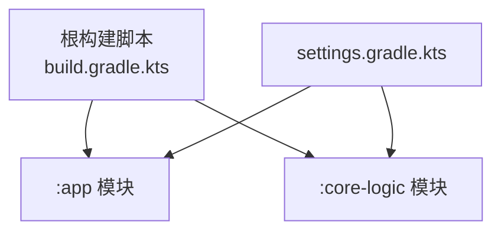
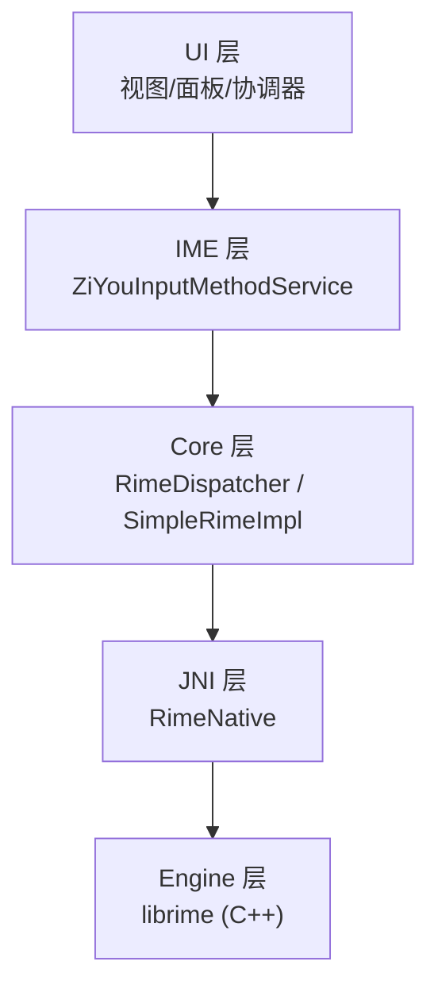
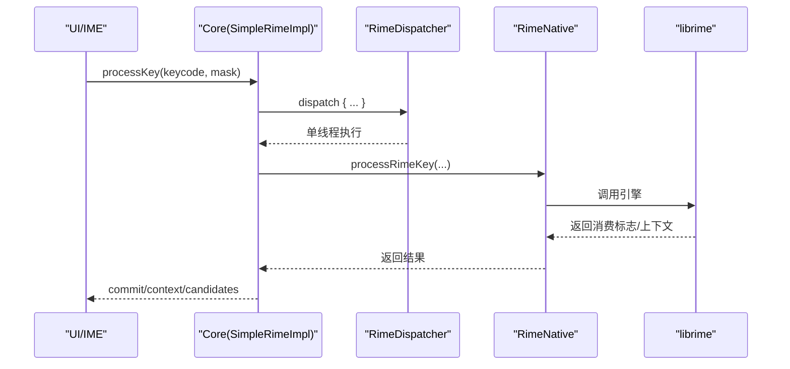
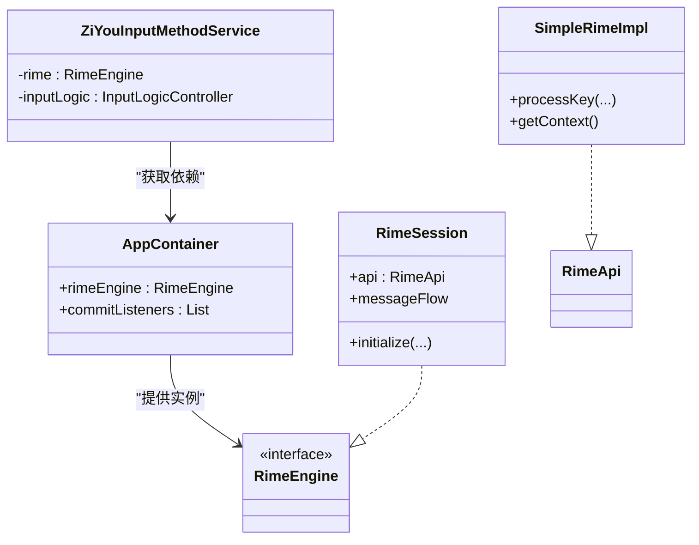
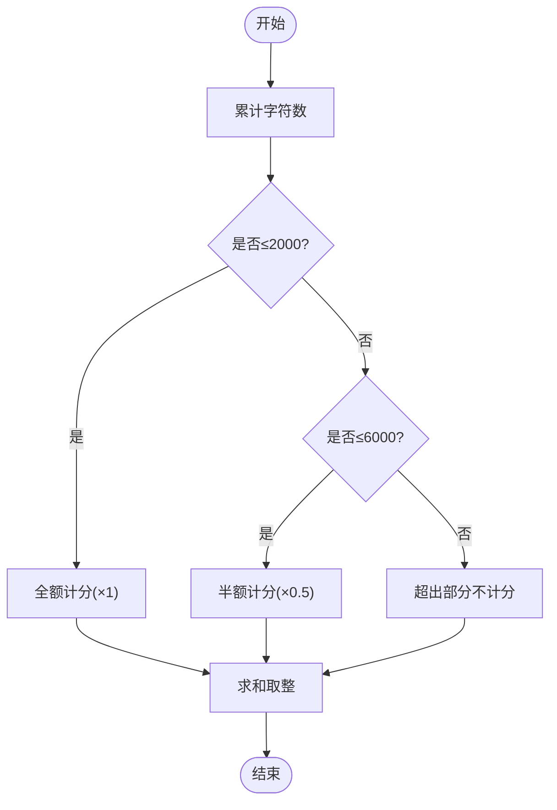
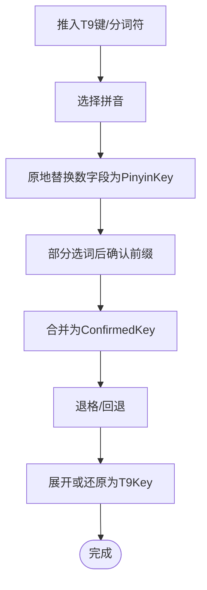
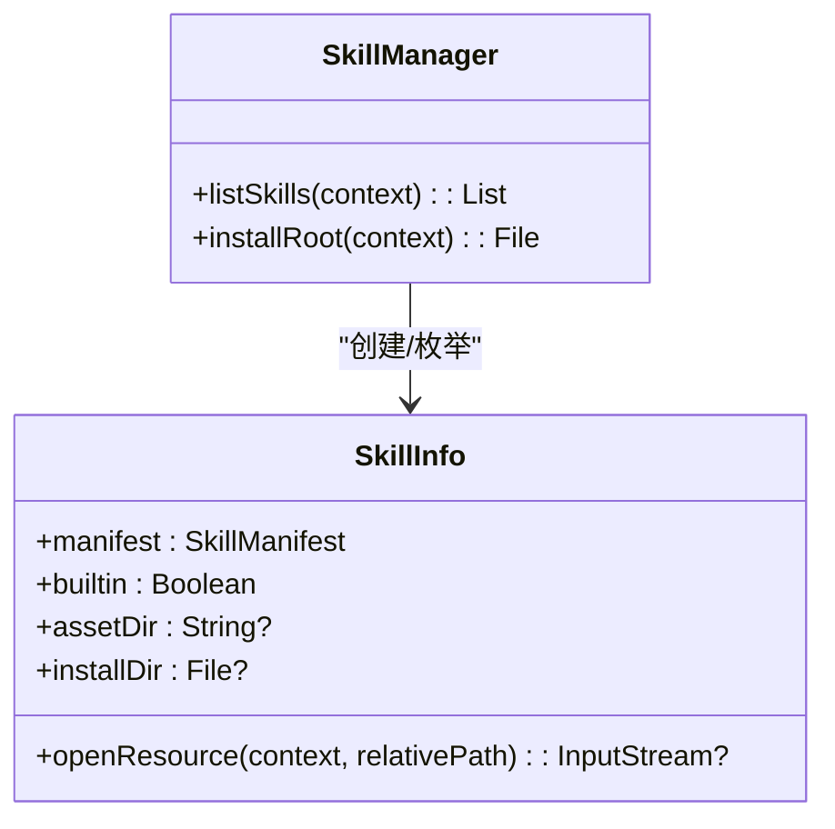
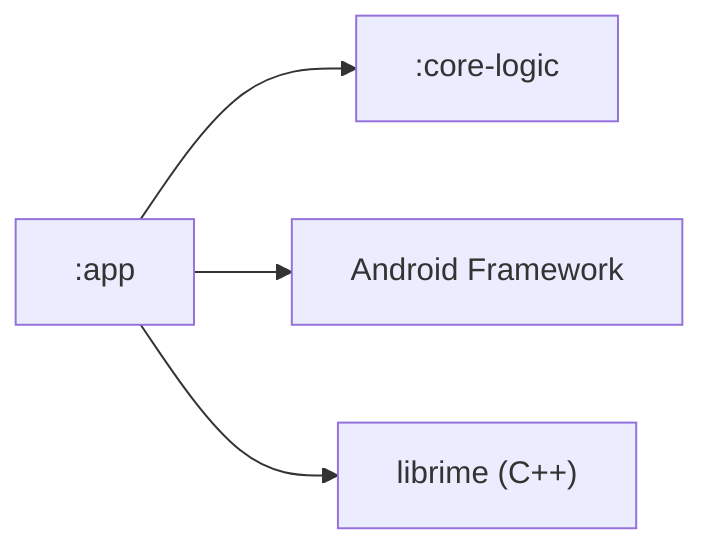

# 架构设计

<cite>
**本文引用的文件**   
- [settings.gradle.kts](file://settings.gradle.kts)
- [build.gradle.kts](file://build.gradle.kts)
- [ZiyouApplication.kt](file://app/src/main/java/com/ziyou/ime/ZiyouApplication.kt)
- [ZiYouInputMethodService.kt](file://app/src/main/java/com/ziyou/ime/ime/ZiYouInputMethodService.kt)
- [RimeDispatcher.kt](file://app/src/main/java/com/ziyou/ime/core/RimeDispatcher.kt)
- [SimpleRimeImpl.kt](file://app/src/main/java/com/ziyou/ime/core/SimpleRimeImpl.kt)
- [RimeNative.kt](file://app/src/main/java/com/ziyou/ime/core/RimeNative.kt)
- [LevelEngine.kt](file://core-logic/src/main/java/com/ziyou/ime/core/level/LevelEngine.kt)
- [KeyRecordStack.kt](file://core-logic/src/main/java/com/ziyou/ime/core/t9/KeyRecordStack.kt)
- [T9PinYinUtils.kt](file://core-logic/src/main/java/com/ziyou/ime/util/T9PinYinUtils.kt)
- [SkillManager.kt](file://app/src/main/java/com/ziyou/ime/skill/SkillManager.kt)
</cite>

## 目录
1. [引言](#引言)
2. [项目结构](#项目结构)
3. [核心组件](#核心组件)
4. [架构总览](#架构总览)
5. [详细组件分析](#详细组件分析)
6. [依赖关系分析](#依赖关系分析)
7. [性能考量](#性能考量)
8. [故障排查指南](#故障排查指南)
9. [结论](#结论)
10. [附录](#附录)

## 引言
本文件系统化阐述字由输入法的整体架构与实现要点，覆盖：
- Gradle 多模块组织（:app 与 :core-logic）
- 五层引擎栈（UI → IME → Core → JNI → Engine）的设计与数据流
- 依赖注入容器 AppContainer 的组合根模式与单向依赖原则
- 四大横向业务域：等级体系、扩展词库、九宫格 T9 输入、技能插件
- 系统边界、组件交互、数据流图与部署拓扑
- 关键设计权衡：单线程 Dispatcher、RAII 资源管理、批量 API 调用等

## 项目结构
- 顶层构建脚本定义 Android Application/Library 插件版本与仓库策略。
- settings.gradle.kts 声明两个子模块：:app（应用与 IME 服务）、:core-logic（纯逻辑与工具）。
- :app 模块包含 IME 服务、UI、JNI 封装、Rime 调度器、技能运行时与配置管理等。
- :core-logic 模块提供无状态计算引擎（等级体系）、T9 输入状态机、Markdown 解析、技能清单校验等。

**图表来源** 
- [build.gradle.kts:1-7](file://build.gradle.kts#L1-L7)
- [settings.gradle.kts:1-28](file://settings.gradle.kts#L1-L28)

**章节来源**
- [build.gradle.kts:1-7](file://build.gradle.kts#L1-L7)
- [settings.gradle.kts:1-28](file://settings.gradle.kts#L1-L28)

## 核心组件
- 应用入口 ZiyouApplication：全局初始化与延迟启动 Rime 引擎（避免阻塞主线程）。
- IME 服务 ZiYouInputMethodService：输入法生命周期、视图构建、键盘布局切换、候选区与编码区同步、面板协调器编排。
- 核心调度 RimeDispatcher：单线程协程调度器，保证 librime 非线程安全 API 的顺序执行。
- RimeApi 实现 SimpleRimeImpl：统一封装所有 Rime 操作，全部经 Dispatcher 派发。
- JNI 桥接 RimeNative：声明 native 方法，负责库加载与消息回调分发。
- 等级引擎 LevelEngine：纯计算引擎，负责积分、等级、权益解锁规则。
- 九宫格 KeyRecordStack：T9 输入状态机，维护编码串顺序、拼音锁定与确认段合并。
- T9 映射工具 T9PinYinUtils：T9 键序列与拼音的双向映射与格式化。
- 技能管理器 SkillManager：内置与已安装技能的枚举与资源访问。

**章节来源**
- [ZiyouApplication.kt:1-26](file://app/src/main/java/com/ziyou/ime/ZiyouApplication.kt#L1-L26)
- [ZiYouInputMethodService.kt:1-800](file://app/src/main/java/com/ziyou/ime/ime/ZiYouInputMethodService.kt#L1-L800)
- [RimeDispatcher.kt:1-91](file://app/src/main/java/com/ziyou/ime/core/RimeDispatcher.kt#L1-L91)
- [SimpleRimeImpl.kt:1-177](file://app/src/main/java/com/ziyou/ime/core/SimpleRimeImpl.kt#L1-L177)
- [RimeNative.kt:1-170](file://app/src/main/java/com/ziyou/ime/core/RimeNative.kt#L1-L170)
- [LevelEngine.kt:1-187](file://core-logic/src/main/java/com/ziyou/ime/core/level/LevelEngine.kt#L1-L187)
- [KeyRecordStack.kt:1-310](file://core-logic/src/main/java/com/ziyou/ime/core/t9/KeyRecordStack.kt#L1-L310)
- [T9PinYinUtils.kt:1-375](file://core-logic/src/main/java/com/ziyou/ime/util/T9PinYinUtils.kt#L1-L375)
- [SkillManager.kt:1-110](file://app/src/main/java/com/ziyou/ime/skill/SkillManager.kt#L1-L110)

## 架构总览
字由输入法采用“五层引擎栈”分层架构，严格单向依赖：UI → IME → Core → JNI → Engine。

- UI 层：各类面板协调器、键盘视图、候选区与编码区视图。
- IME 层：输入法服务、输入逻辑控制器、显示形态控制、面板编排。
- Core 层：单线程调度器与 RimeApi 实现，屏蔽线程与并发细节。
- JNI 层：native 方法声明、库加载、消息回调转发。
- Engine 层：librime 引擎（C++），处理分词、翻译、候选生成。

**图表来源** 
- [ZiYouInputMethodService.kt:1-800](file://app/src/main/java/com/ziyou/ime/ime/ZiYouInputMethodService.kt#L1-L800)
- [RimeDispatcher.kt:1-91](file://app/src/main/java/com/ziyou/ime/core/RimeDispatcher.kt#L1-L91)
- [SimpleRimeImpl.kt:1-177](file://app/src/main/java/com/ziyou/ime/core/SimpleRimeImpl.kt#L1-L177)
- [RimeNative.kt:1-170](file://app/src/main/java/com/ziyou/ime/core/RimeNative.kt#L1-L170)

## 详细组件分析

### 五层引擎栈与数据流
- 按键事件从 UI/IME 进入 Core，通过 RimeDispatcher 在单线程上调用 SimpleRimeImpl，再经 RimeNative 调用 librime。
- 结果（commit/context/candidates）回传至 IME，更新候选区与编码区；消息流（方案/选项/部署）通过 RimeMessageHandler 通知上层。

**图表来源** 
- [ZiYouInputMethodService.kt:1-800](file://app/src/main/java/com/ziyou/ime/ime/ZiYouInputMethodService.kt#L1-L800)
- [SimpleRimeImpl.kt:1-177](file://app/src/main/java/com/ziyou/ime/core/SimpleRimeImpl.kt#L1-L177)
- [RimeDispatcher.kt:1-91](file://app/src/main/java/com/ziyou/ime/core/RimeDispatcher.kt#L1-L91)
- [RimeNative.kt:1-170](file://app/src/main/java/com/ziyou/ime/core/RimeNative.kt#L1-L170)

**章节来源**
- [ZiYouInputMethodService.kt:1-800](file://app/src/main/java/com/ziyou/ime/ime/ZiYouInputMethodService.kt#L1-L800)
- [SimpleRimeImpl.kt:1-177](file://app/src/main/java/com/ziyou/ime/core/SimpleRimeImpl.kt#L1-L177)
- [RimeDispatcher.kt:1-91](file://app/src/main/java/com/ziyou/ime/core/RimeDispatcher.kt#L1-L91)
- [RimeNative.kt:1-170](file://app/src/main/java/com/ziyou/ime/core/RimeNative.kt#L1-L170)

### 依赖注入容器 AppContainer（组合根）
- AppContainer 作为组合根集中装配 RimeEngine（生产为 RimeSession 单例）、CommitListeners 等，供 IME 与服务使用。
- 通过 DI 解耦具体实现，便于替换与测试（如 FakeRimeEngine）。
- 单向依赖：UI/IME 依赖 Core/JNI，Core 不反向依赖 UI/IME。

**图表来源** 
- [ZiYouInputMethodService.kt:1-800](file://app/src/main/java/com/ziyou/ime/ime/ZiYouInputMethodService.kt#L1-L800)
- [SimpleRimeImpl.kt:1-177](file://app/src/main/java/com/ziyou/ime/core/SimpleRimeImpl.kt#L1-L177)

**章节来源**
- [ZiYouInputMethodService.kt:1-800](file://app/src/main/java/com/ziyou/ime/ime/ZiYouInputMethodService.kt#L1-L800)

### 等级体系（LevelEngine）
- 纯计算引擎，无 I/O，提供分段计分、连续天数奖励、等级判定与权益解锁规则。
- 热路径计数由 LevelStats 负责，持久化由 LevelRepository 负责。

**图表来源** 
- [LevelEngine.kt:1-187](file://core-logic/src/main/java/com/ziyou/ime/core/level/LevelEngine.kt#L1-L187)

**章节来源**
- [LevelEngine.kt:1-187](file://core-logic/src/main/java/com/ziyou/ime/core/level/LevelEngine.kt#L1-L187)

### 九宫格 T9 输入（KeyRecordStack + T9PinYinUtils）
- KeyRecordStack 维护输入记录列表，确保与 Rime 编码串逻辑顺序一致，支持拼音锁定、确认段合并与智能退格。
- T9PinYinUtils 提供 T9 键序列与拼音的双向映射与格式化，支撑侧栏候选与预览。

**图表来源** 
- [KeyRecordStack.kt:1-310](file://core-logic/src/main/java/com/ziyou/ime/core/t9/KeyRecordStack.kt#L1-L310)
- [T9PinYinUtils.kt:1-375](file://core-logic/src/main/java/com/ziyou/ime/util/T9PinYinUtils.kt#L1-L375)

**章节来源**
- [KeyRecordStack.kt:1-310](file://core-logic/src/main/java/com/ziyou/ime/core/t9/KeyRecordStack.kt#L1-L310)
- [T9PinYinUtils.kt:1-375](file://core-logic/src/main/java/com/ziyou/ime/util/T9PinYinUtils.kt#L1-L375)

### 技能插件（SkillManager + Runtime）
- SkillManager 枚举内置与已安装技能，提供统一资源读取入口，内置 assets 与用户安装 files 双源。
- 技能运行时（WebView）按 manifest 加载资源，ZipEntryValidator 进行纵深防御（防 Zip Slip）。

**图表来源** 
- [SkillManager.kt:1-110](file://app/src/main/java/com/ziyou/ime/skill/SkillManager.kt#L1-L110)

**章节来源**
- [SkillManager.kt:1-110](file://app/src/main/java/com/ziyou/ime/skill/SkillManager.kt#L1-L110)

### 扩展词库（部署与重编译）
- 词库与方案 YAML 位于 assets/rime，首次或升级时触发 fullCheck 以编译新方案（如 t9）。
- 部署完成后通过消息流通知上层，IME 层进行状态重同步，避免窗口期异常。

**章节来源**
- [ZiYouInputMethodService.kt:1-800](file://app/src/main/java/com/ziyou/ime/ime/ZiYouInputMethodService.kt#L1-L800)

## 依赖关系分析
- 模块依赖：:app 依赖 :core-logic（等级、T9、Markdown、技能清单校验等）。
- 组件耦合：IME 依赖 Core/JNI，Core 仅依赖 Dispatcher/Native，单向依赖清晰。
- 外部依赖：Android Framework（IME API、Clipboard、Assets）、librime（C++）。

**图表来源** 
- [settings.gradle.kts:1-28](file://settings.gradle.kts#L1-L28)
- [build.gradle.kts:1-7](file://build.gradle.kts#L1-L7)

**章节来源**
- [settings.gradle.kts:1-28](file://settings.gradle.kts#L1-L28)
- [build.gradle.kts:1-7](file://build.gradle.kts#L1-L7)

## 性能考量
- 单线程 Dispatcher：避免 librime 并发问题，简化锁与竞态条件。
- 批量 API：processKeyBulk 一次 JNI 跨界完成 processKey + getCommit + getContext，减少跨进程开销。
- RAII 资源管理：native 堆释放 trimNativeHeap 在部署后或内存吃紧时回收持留页。
- 视图重建与状态同步：latest-wins 串行化 engineSyncJob，避免快速切换导致的迟到写入。
- 预热缓存：符号分类 YAML 预热，降低首次 IO 延迟。

**章节来源**
- [RimeDispatcher.kt:1-91](file://app/src/main/java/com/ziyou/ime/core/RimeDispatcher.kt#L1-L91)
- [RimeNative.kt:1-170](file://app/src/main/java/com/ziyou/ime/core/RimeNative.kt#L1-L170)
- [ZiYouInputMethodService.kt:1-800](file://app/src/main/java/com/ziyou/ime/ime/ZiYouInputMethodService.kt#L1-L800)

## 故障排查指南
- 引擎未就绪：awaitEngineReady 轮询等待，超时放弃并依赖部署完成消息重同步。
- 方案切换失败：selectSchema 失败记录日志，全键盘回退默认方案兜底。
- 中→英竞态：pendingEnglishMode 强制 ascii_mode=true，避免异步 toggle 冲突。
- 剪贴板权限：Android 13+ 敏感内容跳过入库，后台读限制导致空值需忽略。
- 皮肤与主题：onConfigurationChanged 通知 SkinManager 重建快照并换肤。

**章节来源**
- [ZiYouInputMethodService.kt:1-800](file://app/src/main/java/com/ziyou/ime/ime/ZiYouInputMethodService.kt#L1-L800)

## 结论
字由输入法通过清晰的五层架构与单向依赖，结合单线程调度与批量 API，实现了高性能、可维护的输入法内核。模块化（:app/:core-logic）与 DI 组合根提升了可测试性与扩展性。四大横向业务域（等级、词库、T9、技能）职责明确，易于演进。

## 附录
- 系统边界：IME 服务对外暴露输入法能力，内部通过 Core/JNI 与 librime 交互。
- 部署拓扑：assets/rime 资源随 APK 打包，用户数据位于内部存储；技能资源内置 assets 与用户安装 files 双源。
- 最佳实践：保持单向依赖、避免跨层直接访问、优先使用批量 API、及时释放 native 资源。