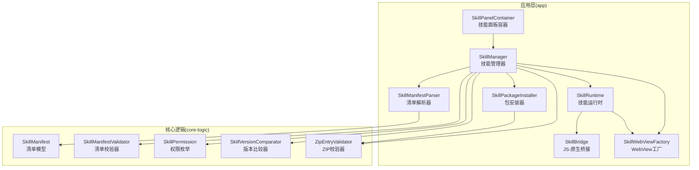
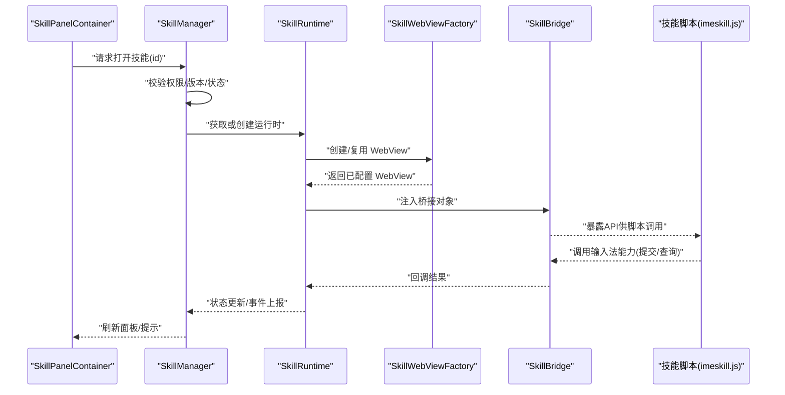
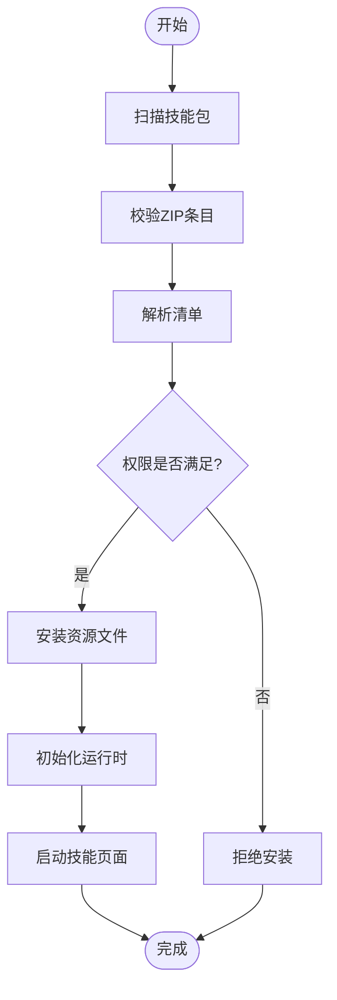
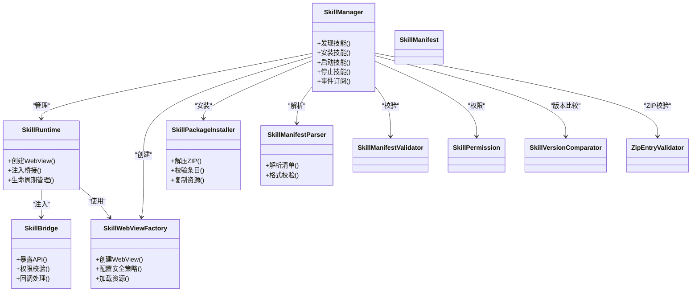

# 核心逻辑-技能模块

<cite>
**本文引用的文件**   
- [app/src/main/java/com/ziyou/ime/skill/SkillManager.kt](file://app/src/main/java/com/ziyou/ime/skill/SkillManager.kt)
- [app/src/main/java/com/ziyou/ime/skill/SkillRuntime.kt](file://app/src/main/java/com/ziyou/ime/skill/SkillRuntime.kt)
- [app/src/main/java/com/ziyou/ime/skill/SkillBridge.kt](file://app/src/main/java/com/ziyou/ime/skill/SkillBridge.kt)
- [app/src/main/java/com/ziyou/ime/skill/SkillWebViewFactory.kt](file://app/src/main/java/com/ziyou/ime/skill/SkillWebViewFactory.kt)
- [app/src/main/java/com/ziyou/ime/skill/SkillManifestParser.kt](file://app/src/main/java/com/ziyou/ime/skill/SkillManifestParser.kt)
- [app/src/main/java/com/ziyou/ime/skill/SkillPackageInstaller.kt](file://app/src/main/java/com/ziyou/ime/skill/SkillPackageInstaller.kt)
- [core-logic/src/main/java/com/ziyou/ime/core/skill/SkillManifest.kt](file://core-logic/src/main/java/com/ziyou/ime/core/skill/SkillManifest.kt)
- [core-logic/src/main/java/com/ziyou/ime/core/skill/SkillManifestValidator.kt](file://core-logic/src/main/java/com/ziyou/ime/core/skill/SkillManifestValidator.kt)
- [core-logic/src/main/java/com/ziyou/ime/core/skill/SkillPermission.kt](file://core-logic/src/main/java/com/ziyou/ime/core/skill/SkillPermission.kt)
- [core-logic/src/main/java/com/ziyou/ime/core/skill/SkillVersionComparator.kt](file://core-logic/src/main/java/com/ziyou/ime/core/skill/SkillVersionComparator.kt)
- [core-logic/src/main/java/com/ziyou/ime/core/skill/ZipEntryValidator.kt](file://core-logic/src/main/java/com/ziyou/ime/core/skill/ZipEntryValidator.kt)
- [app/src/main/assets/skills/calculator/manifest.json](file://app/src/main/assets/skills/calculator/manifest.json)
- [app/src/main/assets/skills/quote/manifest.json](file://app/src/main/assets/skills/quote/manifest.json)
- [app/src/main/assets/skills/weather/manifest.json](file://app/src/main/assets/skills/weather/manifest.json)
- [app/src/main/assets/skill_runtime/imeskill.js](file://app/src/main/assets/skill_runtime/imeskill.js)
- [app/src/main/java/com/ziyou/ime/ime/SkillPanelContainer.kt](file://app/src/main/java/com/ziyou/ime/ime/SkillPanelContainer.kt)
</cite>

## 目录
1. [简介](#简介)
2. [项目结构](#项目结构)
3. [核心组件](#核心组件)
4. [架构总览](#架构总览)
5. [详细组件分析](#详细组件分析)
6. [依赖关系分析](#依赖关系分析)
7. [性能考量](#性能考量)
8. [故障排查指南](#故障排查指南)
9. [结论](#结论)
10. [附录](#附录)

## 简介
本文件聚焦输入法项目的“技能模块”，即通过 Web 技术实现的插件化能力（如计算器、天气、引用等）。该模块负责技能的发现、安装、校验、生命周期管理、与宿主输入法的桥接通信，以及在 UI 面板中展示与交互。文档从系统架构、组件职责、数据流、错误处理与性能优化等方面进行全面解析，帮助开发者快速理解并扩展技能生态。

## 项目结构
技能模块由两部分组成：
- app 层：实现技能运行时、管理器、Web 视图工厂、包安装器、清单解析、UI 容器等。
- core-logic 层：定义技能清单模型、权限枚举、清单校验器、版本比较器、ZIP 条目校验器等通用能力。

图表来源
- [app/src/main/java/com/ziyou/ime/skill/SkillManager.kt](file://app/src/main/java/com/ziyou/ime/skill/SkillManager.kt)
- [app/src/main/java/com/ziyou/ime/skill/SkillRuntime.kt](file://app/src/main/java/com/ziyou/ime/skill/SkillRuntime.kt)
- [app/src/main/java/com/ziyou/ime/skill/SkillBridge.kt](file://app/src/main/java/com/ziyou/ime/skill/SkillBridge.kt)
- [app/src/main/java/com/ziyou/ime/skill/SkillWebViewFactory.kt](file://app/src/main/java/com/ziyou/ime/skill/SkillWebViewFactory.kt)
- [app/src/main/java/com/ziyou/ime/skill/SkillPackageInstaller.kt](file://app/src/main/java/com/ziyou/ime/skill/SkillPackageInstaller.kt)
- [app/src/main/java/com/ziyou/ime/skill/SkillManifestParser.kt](file://app/src/main/java/com/ziyou/ime/skill/SkillManifestParser.kt)
- [core-logic/src/main/java/com/ziyou/ime/core/skill/SkillManifest.kt](file://core-logic/src/main/java/com/ziyou/ime/core/skill/SkillManifest.kt)
- [core-logic/src/main/java/com/ziyou/ime/core/skill/SkillManifestValidator.kt](file://core-logic/src/main/java/com/ziyou/ime/core/skill/SkillManifestValidator.kt)
- [core-logic/src/main/java/com/ziyou/ime/core/skill/SkillPermission.kt](file://core-logic/src/main/java/com/ziyou/ime/core/skill/SkillPermission.kt)
- [core-logic/src/main/java/com/ziyou/ime/core/skill/SkillVersionComparator.kt](file://core-logic/src/main/java/com/ziyou/ime/core/skill/SkillVersionComparator.kt)
- [core-logic/src/main/java/com/ziyou/ime/core/skill/ZipEntryValidator.kt](file://core-logic/src/main/java/com/ziyou/ime/core/skill/ZipEntryValidator.kt)

章节来源
- [app/src/main/java/com/ziyou/ime/skill/SkillManager.kt](file://app/src/main/java/com/ziyou/ime/skill/SkillManager.kt)
- [core-logic/src/main/java/com/ziyou/ime/core/skill/SkillManifest.kt](file://core-logic/src/main/java/com/ziyou/ime/core/skill/SkillManifest.kt)

## 核心组件
- 技能管理器 SkillManager：统一入口，负责技能发现、安装、启用/禁用、版本升级、事件分发与面板控制。
- 技能运行时 SkillRuntime：维护单个技能的 WebView 实例、生命周期、消息通道与资源加载策略。
- JS-原生桥接 SkillBridge：暴露给技能脚本的 API，用于调用输入法能力（如提交文本、获取上下文、显示候选等）。
- WebView 工厂 SkillWebViewFactory：创建并配置 WebView，设置安全策略、混合内容、缓存与沙箱参数。
- 包安装器 SkillPackageInstaller：解压技能包、校验 ZIP 条目、复制资源到应用目录。
- 清单解析器 SkillManifestParser：读取 manifest.json，构建清单模型并进行基础格式校验。
- 核心逻辑（core-logic）：
  - SkillManifest：清单数据结构（id、name、version、permissions、entry、icons 等）。
  - SkillManifestValidator：校验必填字段、权限合法性、版本号格式等。
  - SkillPermission：权限白名单（如网络、存储、剪贴板等）。
  - SkillVersionComparator：语义化版本比较，支持升序/降序选择。
  - ZipEntryValidator：限制 ZIP 路径穿越、非法文件名、过大条目等。

章节来源
- [app/src/main/java/com/ziyou/ime/skill/SkillManager.kt](file://app/src/main/java/com/ziyou/ime/skill/SkillManager.kt)
- [app/src/main/java/com/ziyou/ime/skill/SkillRuntime.kt](file://app/src/main/java/com/ziyou/ime/skill/SkillRuntime.kt)
- [app/src/main/java/com/ziyou/ime/skill/SkillBridge.kt](file://app/src/main/java/com/ziyou/ime/skill/SkillBridge.kt)
- [app/src/main/java/com/ziyou/ime/skill/SkillWebViewFactory.kt](file://app/src/main/java/com/ziyou/ime/skill/SkillWebViewFactory.kt)
- [app/src/main/java/com/ziyou/ime/skill/SkillPackageInstaller.kt](file://app/src/main/java/com/ziyou/ime/skill/SkillPackageInstaller.kt)
- [app/src/main/java/com/ziyou/ime/skill/SkillManifestParser.kt](file://app/src/main/java/com/ziyou/ime/skill/SkillManifestParser.kt)
- [core-logic/src/main/java/com/ziyou/ime/core/skill/SkillManifest.kt](file://core-logic/src/main/java/com/ziyou/ime/core/skill/SkillManifest.kt)
- [core-logic/src/main/java/com/ziyou/ime/core/skill/SkillManifestValidator.kt](file://core-logic/src/main/java/com/ziyou/ime/core/skill/SkillManifestValidator.kt)
- [core-logic/src/main/java/com/ziyou/ime/core/skill/SkillPermission.kt](file://core-logic/src/main/java/com/ziyou/ime/core/skill/SkillPermission.kt)
- [core-logic/src/main/java/com/ziyou/ime/core/skill/SkillVersionComparator.kt](file://core-logic/src/main/java/com/ziyou/ime/core/skill/SkillVersionComparator.kt)
- [core-logic/src/main/java/com/ziyou/ime/core/skill/ZipEntryValidator.kt](file://core-logic/src/main/java/com/ziyou/ime/core/skill/ZipEntryValidator.kt)

## 架构总览
技能模块采用“管理器 + 运行时 + 桥接 + 工厂”的分层设计，核心逻辑下沉至 core-logic，确保可复用与可测试性。UI 侧通过 SkillPanelContainer 承载技能面板，与管理器解耦。

图表来源
- [app/src/main/java/com/ziyou/ime/skill/SkillManager.kt](file://app/src/main/java/com/ziyou/ime/skill/SkillManager.kt)
- [app/src/main/java/com/ziyou/ime/skill/SkillRuntime.kt](file://app/src/main/java/com/ziyou/ime/skill/SkillRuntime.kt)
- [app/src/main/java/com/ziyou/ime/skill/SkillBridge.kt](file://app/src/main/java/com/ziyou/ime/skill/SkillBridge.kt)
- [app/src/main/java/com/ziyou/ime/skill/SkillWebViewFactory.kt](file://app/src/main/java/com/ziyou/ime/skill/SkillWebViewFactory.kt)
- [app/src/main/assets/skill_runtime/imeskill.js](file://app/src/main/assets/skill_runtime/imeskill.js)
- [app/src/main/java/com/ziyou/ime/ime/SkillPanelContainer.kt](file://app/src/main/java/com/ziyou/ime/ime/SkillPanelContainer.kt)

## 详细组件分析

### 技能管理器 SkillManager
- 职责
  - 技能发现与注册：扫描 assets/skills 目录，解析 manifest.json。
  - 安装与升级：调用安装器解压、校验、复制；使用版本比较器决定升级策略。
  - 生命周期：启动/停止技能，管理运行时实例池。
  - 权限检查：基于 SkillPermission 进行最小授权。
  - 事件总线：向 UI 和运行时广播技能状态变化。
- 关键流程
  - 安装流程：校验 ZIP -> 解析清单 -> 写入本地 -> 初始化运行时。
  - 启动流程：权限校验 -> 创建/复用 WebView -> 注入桥接 -> 加载入口页面。
- 异常处理
  - 清单缺失/格式错误：回退到默认或跳过该技能。
  - 权限不足：拒绝启动并提示用户。
  - 版本冲突：按策略降级或要求更新。

章节来源
- [app/src/main/java/com/ziyou/ime/skill/SkillManager.kt](file://app/src/main/java/com/ziyou/ime/skill/SkillManager.kt)
- [core-logic/src/main/java/com/ziyou/ime/core/skill/SkillManifestValidator.kt](file://core-logic/src/main/java/com/ziyou/ime/core/skill/SkillManifestValidator.kt)
- [core-logic/src/main/java/com/ziyou/ime/core/skill/SkillVersionComparator.kt](file://core-logic/src/main/java/com/ziyou/ime/core/skill/SkillVersionComparator.kt)

### 技能运行时 SkillRuntime
- 职责
  - WebView 生命周期管理：创建、销毁、暂停、恢复。
  - 资源加载：优先本地 assets，其次网络（若允许）。
  - 桥接注入：将 SkillBridge 暴露给 window 对象。
  - 状态同步：与管理器保持运行态一致。
- 性能要点
  - 单例/复用 WebView，避免频繁重建。
  - 按需加载脚本与样式，减少首屏时间。
  - 合理设置缓存策略与内存回收。

章节来源
- [app/src/main/java/com/ziyou/ime/skill/SkillRuntime.kt](file://app/src/main/java/com/ziyou/ime/skill/SkillRuntime.kt)
- [app/src/main/java/com/ziyou/ime/skill/SkillBridge.kt](file://app/src/main/java/com/ziyou/ime/skill/SkillBridge.kt)

### JS-原生桥接 SkillBridge
- 职责
  - 暴露安全的 API 集合（如提交文本、获取输入上下文、显示候选、读取配置等）。
  - 参数校验与权限检查，防止越权调用。
  - 异步回调与错误码标准化。
- 安全策略
  - 白名单方法、最小权限原则。
  - 输入输出序列化与长度限制。

章节来源
- [app/src/main/java/com/ziyou/ime/skill/SkillBridge.kt](file://app/src/main/java/com/ziyou/ime/skill/SkillBridge.kt)
- [core-logic/src/main/java/com/ziyou/ime/core/skill/SkillPermission.kt](file://core-logic/src/main/java/com/ziyou/ime/core/skill/SkillPermission.kt)

### WebView 工厂 SkillWebViewFactory
- 职责
  - 创建 WebView 实例，配置安全选项（禁止 file 协议访问外部、限制混合内容）。
  - 设置 JavaScript 接口、缓存、缩放、字体与主题适配。
  - 提供统一的加载入口（assets 路径映射）。
- 性能与安全
  - 预加载常用资源，降低首次渲染耗时。
  - 隔离每个技能的进程/线程（视平台能力）。

章节来源
- [app/src/main/java/com/ziyou/ime/skill/SkillWebViewFactory.kt](file://app/src/main/java/com/ziyou/ime/skill/SkillWebViewFactory.kt)

### 包安装器 SkillPackageInstaller
- 职责
  - 解压技能包（ZIP），校验条目合法性（路径穿越、大小限制）。
  - 复制资源到应用私有目录，生成索引。
- 校验流程
  - 遍历 ZIP 条目 -> 过滤非法路径 -> 计算哈希/大小 -> 写入磁盘。

章节来源
- [app/src/main/java/com/ziyou/ime/skill/SkillPackageInstaller.kt](file://app/src/main/java/com/ziyou/ime/skill/SkillPackageInstaller.kt)
- [core-logic/src/main/java/com/ziyou/ime/core/skill/ZipEntryValidator.kt](file://core-logic/src/main/java/com/ziyou/ime/core/skill/ZipEntryValidator.kt)

### 清单解析器 SkillManifestParser
- 职责
  - 读取 manifest.json，反序列化为 SkillManifest。
  - 基础格式校验（必填字段、类型、范围）。
- 容错策略
  - 缺失字段使用默认值或标记为无效。
  - 记录解析日志便于调试。

章节来源
- [app/src/main/java/com/ziyou/ime/skill/SkillManifestParser.kt](file://app/src/main/java/com/ziyou/ime/skill/SkillManifestParser.kt)
- [core-logic/src/main/java/com/ziyou/ime/core/skill/SkillManifest.kt](file://core-logic/src/main/java/com/ziyou/ime/core/skill/SkillManifest.kt)

### 核心逻辑（core-logic）
- SkillManifest：定义技能元数据与入口信息。
- SkillManifestValidator：校验清单完整性与合法性。
- SkillPermission：权限枚举与校验规则。
- SkillVersionComparator：语义化版本比较，支持补丁/次主/主版本。
- ZipEntryValidator：ZIP 条目安全检查。

章节来源
- [core-logic/src/main/java/com/ziyou/ime/core/skill/SkillManifest.kt](file://core-logic/src/main/java/com/ziyou/ime/core/skill/SkillManifest.kt)
- [core-logic/src/main/java/com/ziyou/ime/core/skill/SkillManifestValidator.kt](file://core-logic/src/main/java/com/ziyou/ime/core/skill/SkillManifestValidator.kt)
- [core-logic/src/main/java/com/ziyou/ime/core/skill/SkillPermission.kt](file://core-logic/src/main/java/com/ziyou/ime/core/skill/SkillPermission.kt)
- [core-logic/src/main/java/com/ziyou/ime/core/skill/SkillVersionComparator.kt](file://core-logic/src/main/java/com/ziyou/ime/core/skill/SkillVersionComparator.kt)
- [core-logic/src/main/java/com/ziyou/ime/core/skill/ZipEntryValidator.kt](file://core-logic/src/main/java/com/ziyou/ime/core/skill/ZipEntryValidator.kt)

### 概念总览
以下流程图概括了技能安装与启动的核心步骤，便于非技术读者理解整体过程。

[本图为概念流程，不直接对应具体源码文件]

## 依赖关系分析
技能模块内部依赖清晰，核心逻辑与 UI 解耦，便于独立测试与替换实现。

图表来源
- [app/src/main/java/com/ziyou/ime/skill/SkillManager.kt](file://app/src/main/java/com/ziyou/ime/skill/SkillManager.kt)
- [app/src/main/java/com/ziyou/ime/skill/SkillRuntime.kt](file://app/src/main/java/com/ziyou/ime/skill/SkillRuntime.kt)
- [app/src/main/java/com/ziyou/ime/skill/SkillBridge.kt](file://app/src/main/java/com/ziyou/ime/skill/SkillBridge.kt)
- [app/src/main/java/com/ziyou/ime/skill/SkillWebViewFactory.kt](file://app/src/main/java/com/ziyou/ime/skill/SkillWebViewFactory.kt)
- [app/src/main/java/com/ziyou/ime/skill/SkillPackageInstaller.kt](file://app/src/main/java/com/ziyou/ime/skill/SkillPackageInstaller.kt)
- [app/src/main/java/com/ziyou/ime/skill/SkillManifestParser.kt](file://app/src/main/java/com/ziyou/ime/skill/SkillManifestParser.kt)
- [core-logic/src/main/java/com/ziyou/ime/core/skill/SkillManifest.kt](file://core-logic/src/main/java/com/ziyou/ime/core/skill/SkillManifest.kt)
- [core-logic/src/main/java/com/ziyou/ime/core/skill/SkillManifestValidator.kt](file://core-logic/src/main/java/com/ziyou/ime/core/skill/SkillManifestValidator.kt)
- [core-logic/src/main/java/com/ziyou/ime/core/skill/SkillPermission.kt](file://core-logic/src/main/java/com/ziyou/ime/core/skill/SkillPermission.kt)
- [core-logic/src/main/java/com/ziyou/ime/core/skill/SkillVersionComparator.kt](file://core-logic/src/main/java/com/ziyou/ime/core/skill/SkillVersionComparator.kt)
- [core-logic/src/main/java/com/ziyou/ime/core/skill/ZipEntryValidator.kt](file://core-logic/src/main/java/com/ziyou/ime/core/skill/ZipEntryValidator.kt)

章节来源
- [app/src/main/java/com/ziyou/ime/skill/SkillManager.kt](file://app/src/main/java/com/ziyou/ime/skill/SkillManager.kt)
- [core-logic/src/main/java/com/ziyou/ime/core/skill/SkillManifest.kt](file://core-logic/src/main/java/com/ziyou/ime/core/skill/SkillManifest.kt)

## 性能考量
- WebView 复用：避免频繁创建/销毁，降低内存抖动与启动时延。
- 资源预加载：对常用脚本与样式进行懒加载与缓存。
- 事件节流：高频输入事件在桥接层做去抖与批量处理。
- 权限最小化：仅申请必要权限，减少运行时开销。
- 列表与面板：技能面板按需渲染，避免一次性绘制大量节点。

[本节为通用指导，不直接分析具体文件]

## 故障排查指南
- 清单解析失败
  - 现象：技能无法识别或启动失败。
  - 排查：检查 manifest.json 字段完整性与类型，确认解析器日志。
  - 参考：清单模型与校验器。
- 权限不足
  - 现象：部分功能不可用或被拒绝。
  - 排查：核对 SkillPermission 白名单与调用点权限声明。
- 安装失败
  - 现象：解压错误或文件写入失败。
  - 排查：检查 ZIP 条目合法性、路径穿越防护、磁盘空间。
- 运行时崩溃
  - 现象：WebView 崩溃或页面白屏。
  - 排查：查看 WebView 配置、JavaScript 错误、桥接调用栈。
- 版本冲突
  - 现象：升级失败或回滚。
  - 排查：使用版本比较器确认语义化版本顺序与兼容性。

章节来源
- [core-logic/src/main/java/com/ziyou/ime/core/skill/SkillManifestValidator.kt](file://core-logic/src/main/java/com/ziyou/ime/core/skill/SkillManifestValidator.kt)
- [core-logic/src/main/java/com/ziyou/ime/core/skill/SkillPermission.kt](file://core-logic/src/main/java/com/ziyou/ime/core/skill/SkillPermission.kt)
- [core-logic/src/main/java/com/ziyou/ime/core/skill/ZipEntryValidator.kt](file://core-logic/src/main/java/com/ziyou/ime/core/skill/ZipEntryValidator.kt)
- [core-logic/src/main/java/com/ziyou/ime/core/skill/SkillVersionComparator.kt](file://core-logic/src/main/java/com/ziyou/ime/core/skill/SkillVersionComparator.kt)

## 结论
技能模块以清晰的职责划分与严格的校验机制，构建了可扩展、安全的插件体系。通过管理器统一编排、运行时隔离执行、桥接安全通信，既保证了用户体验，又提升了系统的稳定性与可维护性。建议后续持续完善权限模型、增强监控与诊断能力，并引入更丰富的内置技能以提升输入法生产力。

[本节为总结，不直接分析具体文件]

## 附录
- 示例清单文件
  - [calculator 清单](file://app/src/main/assets/skills/calculator/manifest.json)
  - [quote 清单](file://app/src/main/assets/skills/quote/manifest.json)
  - [weather 清单](file://app/src/main/assets/skills/weather/manifest.json)
- 运行时脚本
  - [imeskill.js](file://app/src/main/assets/skill_runtime/imeskill.js)
- UI 容器
  - [SkillPanelContainer](file://app/src/main/java/com/ziyou/ime/ime/SkillPanelContainer.kt)

[本节为参考资料，不直接分析具体文件]