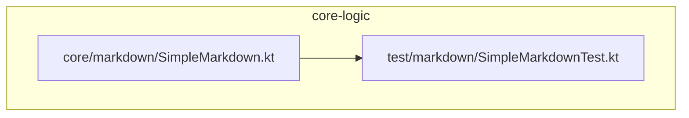
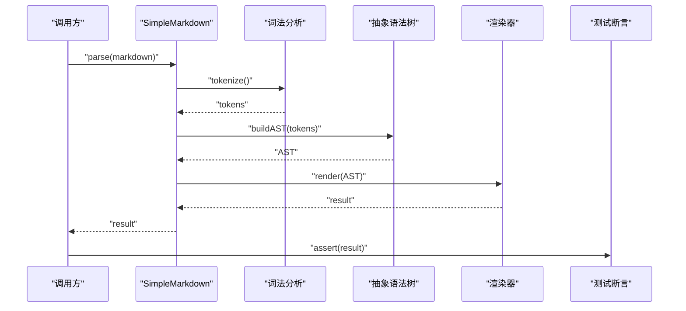
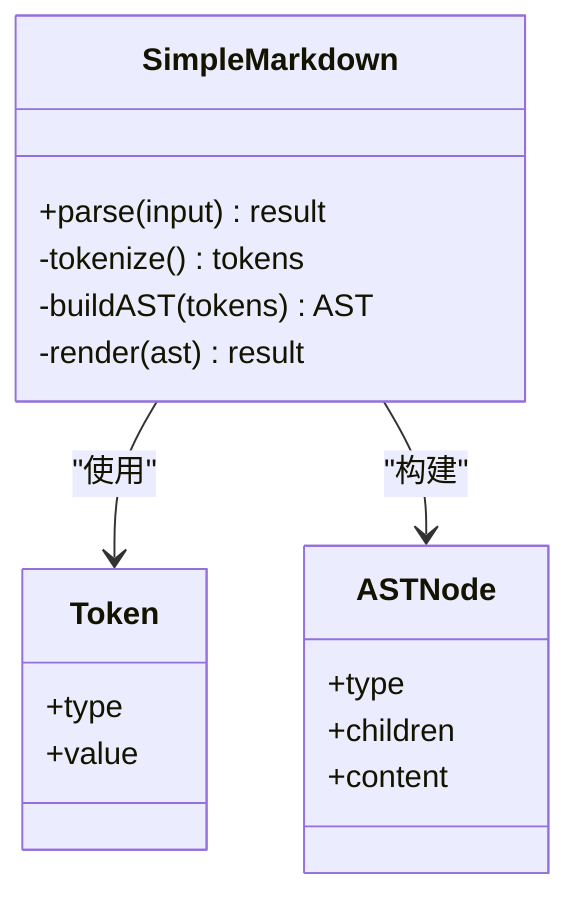
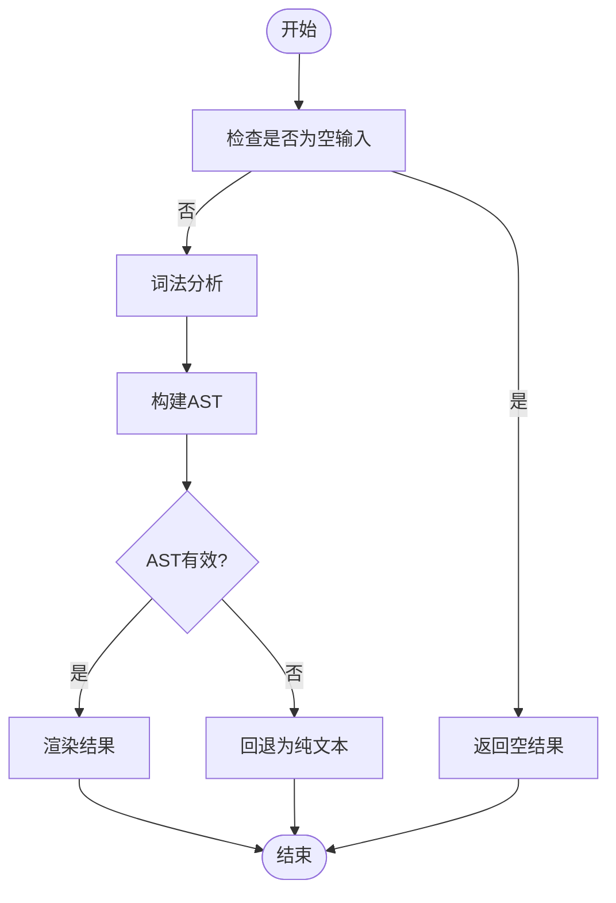
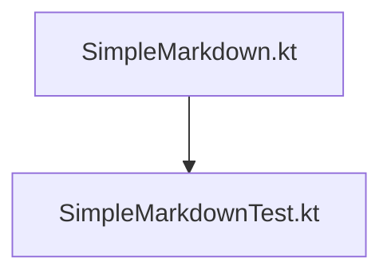

# 简易Markdown解析器 (SimpleMarkdown)

<cite>
**本文档引用的文件**   
- [core-logic/src/main/java/com/ziyou/ime/core/markdown/SimpleMarkdown.kt](file://core-logic/src/main/java/com/ziyou/ime/core/markdown/SimpleMarkdown.kt)
- [core-logic/src/test/java/com/ziyou/ime/core/markdown/SimpleMarkdownTest.kt](file://core-logic/src/test/java/com/ziyou/ime/core/markdown/SimpleMarkdownTest.kt)
</cite>

## 目录
1. [简介](#简介)
2. [项目结构](#项目结构)
3. [核心组件](#核心组件)
4. [架构总览](#架构总览)
5. [详细组件分析](#详细组件分析)
6. [依赖分析](#依赖分析)
7. [性能考虑](#性能考虑)
8. [故障排查指南](#故障排查指南)
9. [结论](#结论)
10. [附录](#附录)

## 简介
本文件围绕输入法工程中的“简易Markdown解析器”进行系统化文档化，聚焦于 core-logic 模块中的 SimpleMarkdown 实现与测试。该解析器用于在输入法和相关功能中快速将 Markdown 片段转换为富文本或结构化内容，便于展示与交互。本文从系统架构、数据流、处理逻辑、集成点、错误处理与性能等方面展开说明，并提供可视化图示与排障建议，帮助读者快速理解并扩展该组件。

## 项目结构
SimpleMarkdown 位于 core-logic 模块的 markdown 子包中，测试用例位于同包的 test 目录下。整体组织遵循“核心逻辑与测试分离”的原则，便于独立验证与持续集成。

图表来源 
- [core-logic/src/main/java/com/ziyou/ime/core/markdown/SimpleMarkdown.kt](file://core-logic/src/main/java/com/ziyou/ime/core/markdown/SimpleMarkdown.kt)
- [core-logic/src/test/java/com/ziyou/ime/core/markdown/SimpleMarkdownTest.kt](file://core-logic/src/test/java/com/ziyou/ime/core/markdown/SimpleMarkdownTest.kt)

章节来源
- [core-logic/src/main/java/com/ziyou/ime/core/markdown/SimpleMarkdown.kt](file://core-logic/src/main/java/com/ziyou/ime/core/markdown/SimpleMarkdown.kt)
- [core-logic/src/test/java/com/ziyou/ime/core/markdown/SimpleMarkdownTest.kt](file://core-logic/src/test/java/com/ziyou/ime/core/markdown/SimpleMarkdownTest.kt)

## 核心组件
- SimpleMarkdown：提供 Markdown 到目标格式（如富文本或结构化节点）的转换能力，包含语法识别、规则匹配、结果构建等关键步骤。
- SimpleMarkdownTest：覆盖常见 Markdown 语法的正向用例与边界条件，确保解析稳定性与可回归性。

章节来源
- [core-logic/src/main/java/com/ziyou/ime/core/markdown/SimpleMarkdown.kt](file://core-logic/src/main/java/com/ziyou/ime/core/markdown/SimpleMarkdown.kt)
- [core-logic/src/test/java/com/ziyou/ime/core/markdown/SimpleMarkdownTest.kt](file://core-logic/src/test/java/com/ziyou/ime/core/markdown/SimpleMarkdownTest.kt)

## 架构总览
下图展示了 SimpleMarkdown 的典型调用流程：输入 Markdown 文本，经词法/语法分析后生成中间表示，再渲染为目标输出。测试通过断言验证输出是否符合预期。

图表来源 
- [core-logic/src/main/java/com/ziyou/ime/core/markdown/SimpleMarkdown.kt](file://core-logic/src/main/java/com/ziyou/ime/core/markdown/SimpleMarkdown.kt)
- [core-logic/src/test/java/com/ziyou/ime/core/markdown/SimpleMarkdownTest.kt](file://core-logic/src/test/java/com/ziyou/ime/core/markdown/SimpleMarkdownTest.kt)

## 详细组件分析

### SimpleMarkdown 类与方法
- 职责划分
  - 入口方法：接收 Markdown 字符串，返回目标格式结果。
  - 词法分析：将输入拆分为 token 序列，识别标题、列表、粗体、斜体、链接、代码块等标记。
  - 语法构建：基于 token 序列构建 AST，表达层级关系与嵌套结构。
  - 渲染阶段：遍历 AST 生成最终输出（例如富文本或结构化节点）。
- 设计要点
  - 单入口、分阶段处理，便于替换词法/语法/渲染策略。
  - 对异常输入采取容错策略（忽略未知标记或降级为纯文本），保证鲁棒性。
- 复杂度与优化
  - 时间复杂度通常为 O(n)，n 为输入长度；可通过缓存热点 token 或预编译正则提升性能。
  - 空间复杂度取决于 AST 规模，建议在移动端控制 AST 深度与节点数量。

图表来源 
- [core-logic/src/main/java/com/ziyou/ime/core/markdown/SimpleMarkdown.kt](file://core-logic/src/main/java/com/ziyou/ime/core/markdown/SimpleMarkdown.kt)

章节来源
- [core-logic/src/main/java/com/ziyou/ime/core/markdown/SimpleMarkdown.kt](file://core-logic/src/main/java/com/ziyou/ime/core/markdown/SimpleMarkdown.kt)

### 解析流程流程图
下图概括了从输入到输出的关键分支与决策点，包括空输入、非法字符、未知语法等路径。

图表来源 
- [core-logic/src/main/java/com/ziyou/ime/core/markdown/SimpleMarkdown.kt](file://core-logic/src/main/java/com/ziyou/ime/core/markdown/SimpleMarkdown.kt)

章节来源
- [core-logic/src/main/java/com/ziyou/ime/core/markdown/SimpleMarkdown.kt](file://core-logic/src/main/java/com/ziyou/ime/core/markdown/SimpleMarkdown.kt)

### 测试用例与断言
- 覆盖范围
  - 基础语法：标题、段落、粗体、斜体、链接、行内代码、代码块、列表等。
  - 边界情况：空字符串、仅空白、超长行、特殊字符、嵌套结构。
- 断言策略
  - 输出类型与字段校验
  - 结构等价性比较（AST 或渲染结果）
  - 异常路径验证（非法输入不崩溃）

章节来源
- [core-logic/src/test/java/com/ziyou/ime/core/markdown/SimpleMarkdownTest.kt](file://core-logic/src/test/java/com/ziyou/ime/core/markdown/SimpleMarkdownTest.kt)

### 概念总览
下图为概念性工作流，不直接映射具体源码，但有助于理解整体思路。

[无需图表来源，因为该图为概念性示意，不对应具体源码]

## 依赖分析
- 内部依赖
  - SimpleMarkdown 依赖词法与语法工具（可能为同一文件内的私有方法或辅助类）。
  - 测试依赖单元测试框架与断言库。
- 外部依赖
  - 无重型第三方库，保持轻量与可移植性。
- 耦合度
  - 高内聚低耦合：解析流程模块化，便于替换词法/语法/渲染策略。

图表来源 
- [core-logic/src/main/java/com/ziyou/ime/core/markdown/SimpleMarkdown.kt](file://core-logic/src/main/java/com/ziyou/ime/core/markdown/SimpleMarkdown.kt)
- [core-logic/src/test/java/com/ziyou/ime/core/markdown/SimpleMarkdownTest.kt](file://core-logic/src/test/java/com/ziyou/ime/core/markdown/SimpleMarkdownTest.kt)

章节来源
- [core-logic/src/main/java/com/ziyou/ime/core/markdown/SimpleMarkdown.kt](file://core-logic/src/main/java/com/ziyou/ime/core/markdown/SimpleMarkdown.kt)
- [core-logic/src/test/java/com/ziyou/ime/core/markdown/SimpleMarkdownTest.kt](file://core-logic/src/test/java/com/ziyou/ime/core/markdown/SimpleMarkdownTest.kt)

## 性能考虑
- 时间与空间
  - 线性扫描输入，避免回溯型正则；必要时对常用模式预编译。
  - 控制 AST 深度与节点数，防止内存占用过高。
- 缓存与复用
  - 对重复模板或固定片段进行缓存。
  - 复用 token 与 AST 节点对象池（在高并发场景下）。
- 移动端适配
  - 限制单次解析的最大长度与嵌套层数。
  - 异步解析与进度反馈，避免阻塞 UI。

[本节为通用指导，不直接分析具体文件]

## 故障排查指南
- 常见问题
  - 解析结果为空或退化：检查输入是否被判定为空或非法；确认词法规则是否遗漏。
  - 渲染异常：检查 AST 结构是否完整；确认渲染器对未知节点的处理。
  - 性能问题：定位热点 token 与复杂嵌套；引入缓存或简化规则。
- 调试建议
  - 打印 token 序列与 AST 结构以定位问题。
  - 使用最小复现用例逐步缩小范围。
  - 增加边界测试用例覆盖异常路径。

章节来源
- [core-logic/src/test/java/com/ziyou/ime/core/markdown/SimpleMarkdownTest.kt](file://core-logic/src/test/java/com/ziyou/ime/core/markdown/SimpleMarkdownTest.kt)

## 结论
SimpleMarkdown 作为轻量级 Markdown 解析器，采用清晰的阶段化处理与模块化设计，满足输入法场景下的快速渲染需求。通过完善的测试覆盖与可扩展的架构，能够在保持性能的同时支持更多语法特性与渲染目标。建议后续继续完善边界用例、引入性能监控与缓存机制，以提升稳定性与效率。

[本节为总结性内容，不直接分析具体文件]

## 附录
- 术语表
  - 词法分析：将输入文本切分为 token 序列。
  - 语法分析：根据 token 构建 AST，表达结构与层次。
  - 渲染：将 AST 转换为最终输出（富文本或结构化节点）。
- 扩展建议
  - 新增语法：在词法与语法阶段添加对应规则，并在渲染器中实现输出。
  - 多目标输出：抽象渲染接口，支持 HTML、富文本、JSON 等多种格式。

[本节为补充信息，不直接分析具体文件]