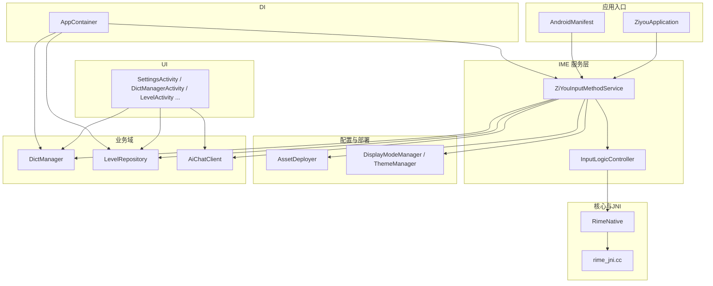
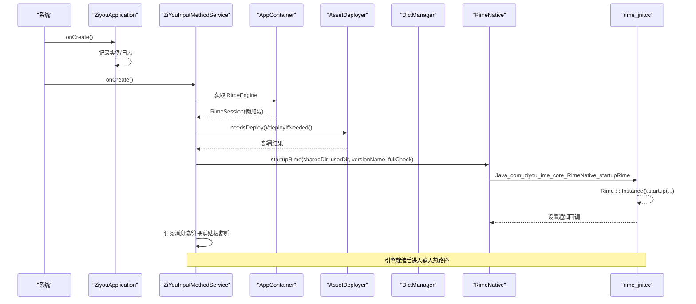
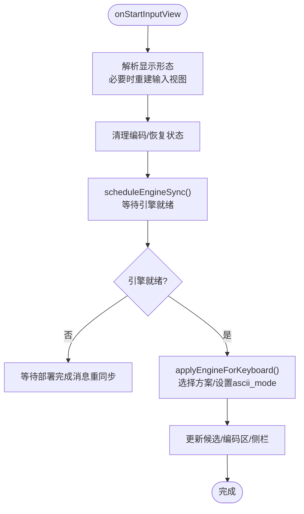
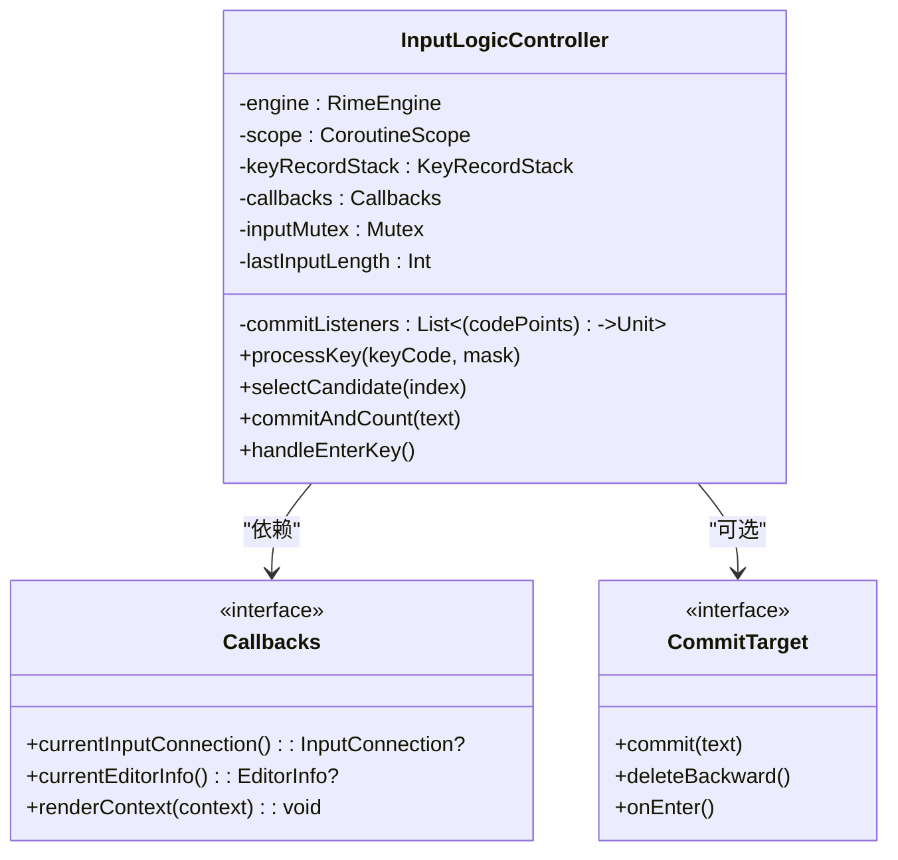
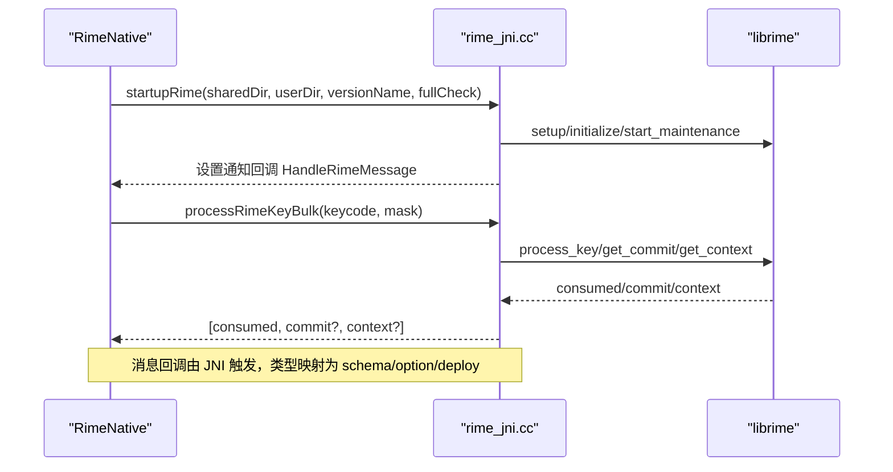
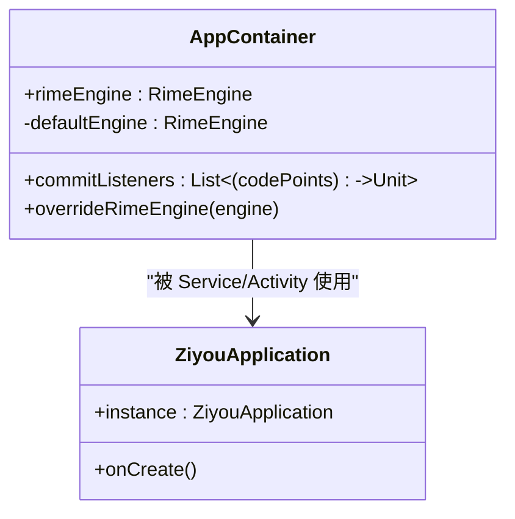
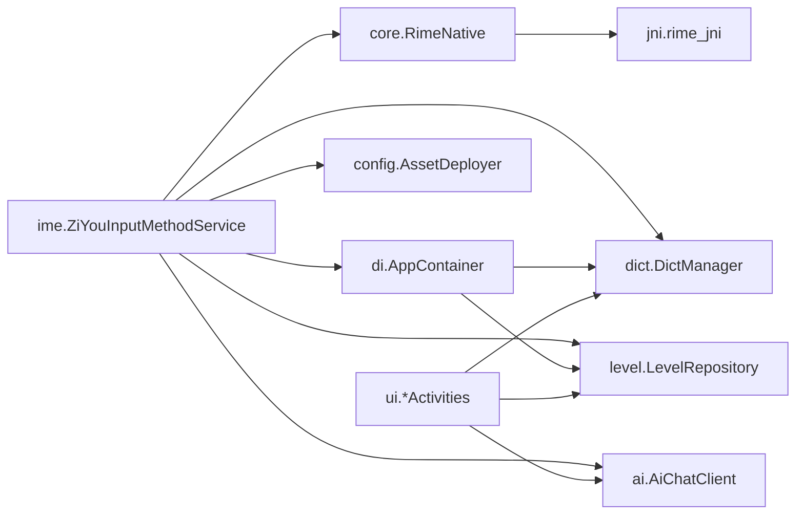

# App 模块设计

<cite>
**本文引用的文件**   
- [ZiyouApplication.kt](file://app/src/main/java/com/ziyou/ime/ZiyouApplication.kt)
- [AndroidManifest.xml](file://app/src/main/AndroidManifest.xml)
- [build.gradle.kts](file://app/build.gradle.kts)
- [ZiYouInputMethodService.kt](file://app/src/main/java/com/ziyou/ime/ime/ZiYouInputMethodService.kt)
- [InputLogicController.kt](file://app/src/main/java/com/ziyou/ime/ime/InputLogicController.kt)
- [RimeNative.kt](file://app/src/main/java/com/ziyou/ime/core/RimeNative.kt)
- [rime_jni.cc](file://app/src/main/jni/librime_jni/rime_jni.cc)
- [AppContainer.kt](file://app/src/main/java/com/ziyou/ime/di/AppContainer.kt)
- [AssetDeployer.kt](file://app/src/main/java/com/ziyou/ime/config/AssetDeployer.kt)
- [DictManager.kt](file://app/src/main/java/com/ziyou/ime/dict/DictManager.kt)
- [LevelRepository.kt](file://app/src/main/java/com/ziyou/ime/level/LevelRepository.kt)
- [AiChatClient.kt](file://app/src/main/java/com/ziyou/ime/ai/AiChatClient.kt)
</cite>

## 目录
1. [简介](#简介)
2. [项目结构](#项目结构)
3. [核心组件](#核心组件)
4. [架构总览](#架构总览)
5. [详细组件分析](#详细组件分析)
6. [依赖关系分析](#依赖关系分析)
7. [性能考量](#性能考量)
8. [故障排查指南](#故障排查指南)
9. [结论](#结论)
10. [附录](#附录)

## 简介
本文件系统化梳理 :app 模块作为 Android 应用层的职责与架构设计，重点覆盖以下方面：
- 输入法服务 ZiYouInputMethodService 的职责边界、生命周期与视图编排
- JNI 集成层 rime_jni 的启动流程、输入热路径与消息回调机制
- 业务域持久化：等级体系（level）、扩展词库（dict）、AI 能力（ai）
- UI 层（activities、views）的组织原则与配置资源
- 依赖管理与装配（AppContainer），以及 Application 初始化策略
- 模块架构图与关键类关系说明

## 项目结构
:app 模块采用“按功能域分包 + 分层解耦”的组织方式：
- ime：输入法服务与键盘视图、候选区、面板协调器
- core：JNI 封装、消息协议、调度器
- jni/librime_jni：C++ 实现 Rime 引擎桥接
- config：资源部署、显示模式、主题等配置管理
- dict：扩展词库安装/启用/禁用与主词库重建
- level：等级体系状态持久化与结算
- ai：AI 问答客户端与 Markdown 渲染
- ui：设置页、词库管理、技能管理等 Activity
- di：轻量 DI 容器（组合根）

图表来源
- [ZiyouApplication.kt:1-26](file://app/src/main/java/com/ziyou/ime/ZiyouApplication.kt#L1-L26)
- [AndroidManifest.xml:1-110](file://app/src/main/AndroidManifest.xml#L1-L110)
- [ZiYouInputMethodService.kt:1-800](file://app/src/main/java/com/ziyou/ime/ime/ZiYouInputMethodService.kt#L1-L800)
- [InputLogicController.kt:1-200](file://app/src/main/java/com/ziyou/ime/ime/InputLogicController.kt#L1-L200)
- [RimeNative.kt:1-170](file://app/src/main/java/com/ziyou/ime/core/RimeNative.kt#L1-L170)
- [rime_jni.cc:1-528](file://app/src/main/jni/librime_jni/rime_jni.cc#L1-L528)
- [AssetDeployer.kt:1-162](file://app/src/main/java/com/ziyou/ime/config/AssetDeployer.kt#L1-L162)
- [DictManager.kt:1-376](file://app/src/main/java/com/ziyou/ime/dict/DictManager.kt#L1-L376)
- [LevelRepository.kt:1-181](file://app/src/main/java/com/ziyou/ime/level/LevelRepository.kt#L1-L181)
- [AiChatClient.kt:1-194](file://app/src/main/java/com/ziyou/ime/ai/AiChatClient.kt#L1-L194)

章节来源
- [AndroidManifest.xml:1-110](file://app/src/main/AndroidManifest.xml#L1-L110)
- [build.gradle.kts:1-192](file://app/build.gradle.kts#L1-L192)

## 核心组件
- 应用入口 ZiyouApplication：全局初始化点，延迟 Rime 引擎初始化至 RimeSession 异步执行，避免阻塞主线程。
- 输入法服务 ZiYouInputMethodService：负责 Rime 引擎生命周期、按键事件处理、输入视图构建与显示形态切换、面板协调、剪贴板监听、皮肤与方案同步。
- 输入逻辑控制器 InputLogicController：从 Service 剥离输入热路径，统一 processKey、commit、UI 刷新与上屏目标路由（编辑器或技能面板）。
- JNI 集成层 RimeNative + rime_jni：声明 native 接口，C++ 单例封装 Rime 引擎会话、选项、方案、候选操作，提供批量按键处理与消息回调。
- 依赖容器 AppContainer：组合根，装配 RimeSession 部署步骤（资源部署 → 扩展词库注入），并注入 commit 监听（等级计分）。
- 资源部署 AssetDeployer：按需将 assets/rime 与 predict.db 部署到内部存储，版本对比决定是否 fullCheck。
- 扩展词库 DictManager：安装/卸载/启用/禁用扩展词库，动态重建 luna_pinyin.dict.yaml。
- 等级体系 LevelRepository：SharedPreferences 持久化等级状态，支持每日签到、积分累计与跨日重置。
- AI 能力 AiChatClient：OpenAI 兼容非流式请求，HTTPS 强制、超时与响应体大小限制，Markdown 基础格式约束。

章节来源
- [ZiyouApplication.kt:1-26](file://app/src/main/java/com/ziyou/ime/ZiyouApplication.kt#L1-L26)
- [ZiYouInputMethodService.kt:1-800](file://app/src/main/java/com/ziyou/ime/ime/ZiYouInputMethodService.kt#L1-L800)
- [InputLogicController.kt:1-200](file://app/src/main/java/com/ziyou/ime/ime/InputLogicController.kt#L1-L200)
- [RimeNative.kt:1-170](file://app/src/main/java/com/ziyou/ime/core/RimeNative.kt#L1-L170)
- [rime_jni.cc:1-528](file://app/src/main/jni/librime_jni/rime_jni.cc#L1-L528)
- [AppContainer.kt:1-59](file://app/src/main/java/com/ziyou/ime/di/AppContainer.kt#L1-L59)
- [AssetDeployer.kt:1-162](file://app/src/main/java/com/ziyou/ime/config/AssetDeployer.kt#L1-L162)
- [DictManager.kt:1-376](file://app/src/main/java/com/ziyou/ime/dict/DictManager.kt#L1-L376)
- [LevelRepository.kt:1-181](file://app/src/main/java/com/ziyou/ime/level/LevelRepository.kt#L1-L181)
- [AiChatClient.kt:1-194](file://app/src/main/java/com/ziyou/ime/ai/AiChatClient.kt#L1-L194)

## 架构总览
整体采用“服务驱动 + 分层解耦 + 事件驱动”的架构：
- 服务层（IME 服务）聚焦生命周期与 UI 编排，通过 DI 获取引擎与协作对象
- 核心层（RimeNative + rime_jni）封装原生引擎调用，提供批量 API 降低跨界开销
- 业务层（dict/level/ai）以独立模块暴露接口，通过 AppContainer 注入横切关注点
- 配置与部署（AssetDeployer/ThemeManager/DisplayModeManager）保障运行期一致性

图表来源
- [ZiyouApplication.kt:1-26](file://app/src/main/java/com/ziyou/ime/ZiyouApplication.kt#L1-L26)
- [ZiYouInputMethodService.kt:1-800](file://app/src/main/java/com/ziyou/ime/ime/ZiYouInputMethodService.kt#L1-L800)
- [AppContainer.kt:1-59](file://app/src/main/java/com/ziyou/ime/di/AppContainer.kt#L1-L59)
- [AssetDeployer.kt:1-162](file://app/src/main/java/com/ziyou/ime/config/AssetDeployer.kt#L1-L162)
- [DictManager.kt:1-376](file://app/src/main/java/com/ziyou/ime/dict/DictManager.kt#L1-L376)
- [RimeNative.kt:1-170](file://app/src/main/java/com/ziyou/ime/core/RimeNative.kt#L1-L170)
- [rime_jni.cc:1-528](file://app/src/main/jni/librime_jni/rime_jni.cc#L1-L528)

## 详细组件分析

### 输入法服务 ZiYouInputMethodService
- 职责边界
  - 管理 Rime 引擎生命周期（onCreate 启动，onDestroy 销毁）
  - 处理按键事件，转发给 RimeApi；提交 commit 文本到编辑器
  - 管理输入视图（键盘+候选词）显示/隐藏与悬浮/停靠形态切换
  - 同步 Rime 上下文状态到 UI（候选词、编码区、拼音侧栏）
  - 协调多面板（技能/AI/涂鸦/粘贴板/工具）生命周期与键盘收放
- 关键流程
  - 引擎就绪等待与最新写入串行化（scheduleEngineSync）
  - 键盘布局安装与切换（installKeyboard/switchKeyboard）
  - 候选区与功能按钮栏可见性控制（updateToolbarVisibility）
  - 剪贴板监听与历史收录（captureClipboardToHistory）
  - 皮肤变更监听与视图重建（SkinManager.addListener）
  - 方案与 ascii_mode 同步（applyEngineForKeyboard）

图表来源
- [ZiYouInputMethodService.kt:1-800](file://app/src/main/java/com/ziyou/ime/ime/ZiYouInputMethodService.kt#L1-L800)

章节来源
- [ZiYouInputMethodService.kt:1-800](file://app/src/main/java/com/ziyou/ime/ime/ZiYouInputMethodService.kt#L1-L800)

### 输入逻辑控制器 InputLogicController
- 职责边界
  - 统一 processKey 热路径：批量调用 engine.api.processKeyBulk，减少 JNI 跨界
  - 上屏目标抽象（CommitTarget）：默认宿主编辑器，技能面板时改道 JS 注入
  - 九宫格状态机协同（KeyRecordStack）：选词/退格/替换需同步清理
  - 慢按键监控与编码长度上限保护（MAX_INPUT_LENGTH）
- 关键流程
  - 串行化输入事务（Mutex）保证一次按键原子性
  - 消费分支：commit 文本上屏 + renderContext 刷新 UI
  - 未消费分支：退格/回车/可打印字符直接上屏

图表来源
- [InputLogicController.kt:1-200](file://app/src/main/java/com/ziyou/ime/ime/InputLogicController.kt#L1-L200)

章节来源
- [InputLogicController.kt:1-200](file://app/src/main/java/com/ziyou/ime/ime/InputLogicController.kt#L1-L200)

### JNI 集成层 RimeNative + rime_jni
- 职责边界
  - RimeNative：声明 native 方法，维护 isLoaded 标志，处理 Rime 消息回调分发
  - rime_jni：C++ 单例封装 Rime 引擎会话、选项、方案、候选操作；提供批量按键处理与消息回调
- 关键流程
  - 启动：设置环境变量（shared/user/version），setup/initialize/start_maintenance
  - 输入热路径：processRimeKeyBulk 合并 processKey/getCommit/getContext
  - 消息回调：schema/option/deploy 三类消息转交 Java 层处理
  - 内存优化：trimNativeHeap 归还空闲页（mallopt M_PURGE）

图表来源
- [RimeNative.kt:1-170](file://app/src/main/java/com/ziyou/ime/core/RimeNative.kt#L1-L170)
- [rime_jni.cc:1-528](file://app/src/main/jni/librime_jni/rime_jni.cc#L1-L528)

章节来源
- [RimeNative.kt:1-170](file://app/src/main/java/com/ziyou/ime/core/RimeNative.kt#L1-L170)
- [rime_jni.cc:1-528](file://app/src/main/jni/librime_jni/rime_jni.cc#L1-L528)

### 依赖容器 AppContainer 与 Application 初始化
- 组合根职责
  - 装配 RimeSession.deploySteps：资源部署 → 扩展词库注入
  - 注入 commit 监听：等级计分（脱敏码点数）
  - 测试覆盖：overrideRimeEngine 注入 fake 实现
- Application 初始化策略
  - 仅保存实例与日志，Rime 引擎初始化延迟至 RimeSession.initialize 异步执行

图表来源
- [AppContainer.kt:1-59](file://app/src/main/java/com/ziyou/ime/di/AppContainer.kt#L1-L59)
- [ZiyouApplication.kt:1-26](file://app/src/main/java/com/ziyou/ime/ZiyouApplication.kt#L1-L26)

章节来源
- [AppContainer.kt:1-59](file://app/src/main/java/com/ziyou/ime/di/AppContainer.kt#L1-L59)
- [ZiyouApplication.kt:1-26](file://app/src/main/java/com/ziyou/ime/ZiyouApplication.kt#L1-L26)

### 资源部署 AssetDeployer
- 职责边界
  - 版本对比决定是否需要部署（needsDeploy）
  - 递归复制 assets/rime 到共享目录，部署 predict.db 到用户目录
  - 记录已部署版本，供升级/首次安装判断
- 关键点
  - deployIfNeeded/forceDeploy 两种模式
  - getSharedDataDir/getUserDataDir 返回路径供 JNI 使用

章节来源
- [AssetDeployer.kt:1-162](file://app/src/main/java/com/ziyou/ime/config/AssetDeployer.kt#L1-L162)

### 扩展词库 DictManager
- 职责边界
  - 安装/卸载/启用/禁用扩展词库，维护 ext_dicts.json 安装记录
  - 动态重建 luna_pinyin.dict.yaml，追加已启用扩展词库
  - 本地预览读取与词条统计
- 关键点
  - MAX_ENABLED_DICTS 建议上限
  - regenerateMainDict 在部署与词库变更后调用

章节来源
- [DictManager.kt:1-376](file://app/src/main/java/com/ziyou/ime/dict/DictManager.kt#L1-L376)

### 等级体系 LevelRepository
- 职责边界
  - SharedPreferences 持久化等级状态（totalPoints/level/todayChars/streakDays 等）
  - 每日签到 checkInToday 发放首用奖励与连续天数加成
  - accumulate 累计字符数并结算积分，跨日重置当日计数
- 关键点
  - 所有写方法 @Synchronized 保证一致性
  - 数据纯聚合计数，不含输入内容，隐私安全

章节来源
- [LevelRepository.kt:1-181](file://app/src/main/java/com/ziyou/ime/level/LevelRepository.kt#L1-L181)

### AI 能力 AiChatClient
- 职责边界
  - OpenAI 兼容 chat/completions 非流式请求
  - 强制 HTTPS、连接/读取超时、响应体大小限制
  - 组装 system/history/user 消息，解析 choices[0].message.content
- 关键点
  - BASE_SYSTEM_PROMPT 约束 Markdown 基础格式
  - friendlyHttpError 友好错误提示

章节来源
- [AiChatClient.kt:1-194](file://app/src/main/java/com/ziyou/ime/ai/AiChatClient.kt#L1-L194)

## 依赖关系分析
- 模块内依赖方向
  - ime 依赖 core、di、config、dict、level、ai
  - core 依赖 jni（native 接口）
  - di 依赖 daemon（RimeSession）、config、dict、level
  - ui 依赖 dict、level、ai
- 外部依赖
  - AndroidX Core/Lifecycle/Compose/Webview/CustomView
  - Kotlin Coroutines
  - JSON（org.json）用于词库与 AI 请求
- 潜在循环依赖
  - 通过 AppContainer 反转依赖方向（daemon 不直接依赖 config/dict）

图表来源
- [ZiYouInputMethodService.kt:1-800](file://app/src/main/java/com/ziyou/ime/ime/ZiYouInputMethodService.kt#L1-L800)
- [RimeNative.kt:1-170](file://app/src/main/java/com/ziyou/ime/core/RimeNative.kt#L1-L170)
- [AppContainer.kt:1-59](file://app/src/main/java/com/ziyou/ime/di/AppContainer.kt#L1-L59)
- [AssetDeployer.kt:1-162](file://app/src/main/java/com/ziyou/ime/config/AssetDeployer.kt#L1-L162)
- [DictManager.kt:1-376](file://app/src/main/java/com/ziyou/ime/dict/DictManager.kt#L1-L376)
- [LevelRepository.kt:1-181](file://app/src/main/java/com/ziyou/ime/level/LevelRepository.kt#L1-L181)
- [AiChatClient.kt:1-194](file://app/src/main/java/com/ziyou/ime/ai/AiChatClient.kt#L1-L194)

章节来源
- [build.gradle.kts:1-192](file://app/build.gradle.kts#L1-L192)

## 性能考量
- 输入热路径优化
  - 批量按键处理 processRimeKeyBulk 减少 JNI 跨界与线程切换
  - 编码长度上限 MAX_INPUT_LENGTH 防止组句搜索爆炸
  - 慢按键告警阈值 SLOW_KEY_WARN_MS 便于定位退化
- 内存与资源
  - trimNativeHeap 归还空闲页，降低部署后常驻占用
  - 预测词库 predict.db 预部署，减少运行时 IO
- 并发与串行化
  - scheduleEngineSync latest-wins 避免快速切换导致迟到写入
  - inputMutex 保证一次按键原子性，避免竞态

## 故障排查指南
- 引擎未就绪
  - 症状：访问 rime.api 抛异常或长时间无响应
  - 排查：检查 awaitEngineReady 超时、部署是否完成、fullCheck 是否必要
- 方案切换失败
  - 症状：切换九宫格/全键盘方案失败
  - 排查：确认方案已编译/部署，回退默认方案日志
- 词库重建失败
  - 症状：扩展词库启用后无效
  - 排查：检查 ext_dicts.json 与 luna_pinyin.dict.yaml 生成日志
- 等级数据异常
  - 症状：积分/等级不更新
  - 排查：checkInToday 是否重复调用、accumulate 参数是否为正
- AI 请求失败
  - 症状：HTTP 错误或空响应
  - 排查：API Key、HTTPS、超时、响应体大小限制、错误码友好提示

章节来源
- [ZiYouInputMethodService.kt:1-800](file://app/src/main/java/com/ziyou/ime/ime/ZiYouInputMethodService.kt#L1-L800)
- [DictManager.kt:1-376](file://app/src/main/java/com/ziyou/ime/dict/DictManager.kt#L1-L376)
- [LevelRepository.kt:1-181](file://app/src/main/java/com/ziyou/ime/level/LevelRepository.kt#L1-L181)
- [AiChatClient.kt:1-194](file://app/src/main/java/com/ziyou/ime/ai/AiChatClient.kt#L1-L194)

## 结论
:app 模块以输入法服务为核心，结合 JNI 集成层与轻量 DI 容器，实现了高内聚、低耦合的架构设计。通过资源部署与扩展词库管理保障引擎可用性，等级体系与 AI 能力增强用户体验。输入热路径的性能优化与并发控制确保稳定流畅的打字体验。后续可平滑迁移至 Hilt/Koin 以进一步提升可测试性与可维护性。

## 附录
- 配置文件与资源
  - AndroidManifest：声明服务、活动、FileProvider、权限与备份规则
  - build.gradle.kts：NDK ABI 过滤、CMake 参数、签名与混淆配置
  - res/xml/input_method.xml：输入法元数据
  - assets/rime/*：Rime 配置与词典
  - assets/skills/*：技能插件包（manifest/index.html/script.js）

章节来源
- [AndroidManifest.xml:1-110](file://app/src/main/AndroidManifest.xml#L1-L110)
- [build.gradle.kts:1-192](file://app/build.gradle.kts#L1-L192)