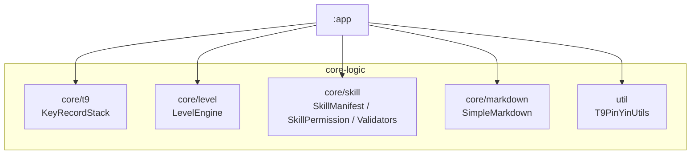
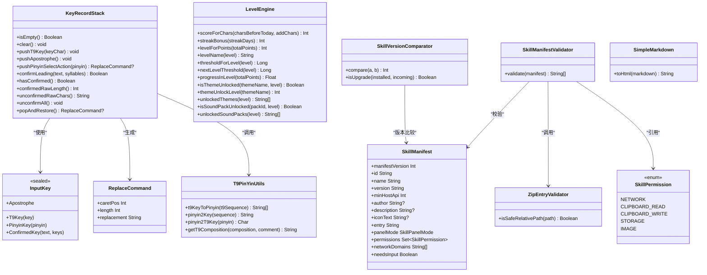
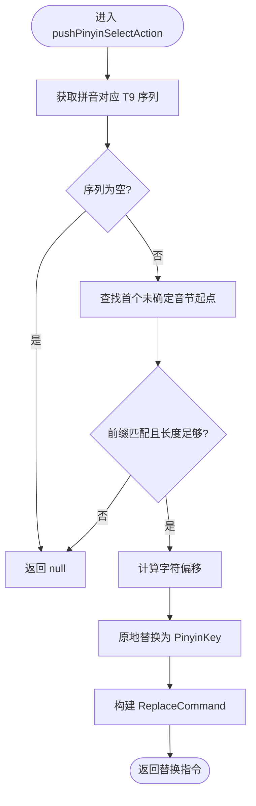
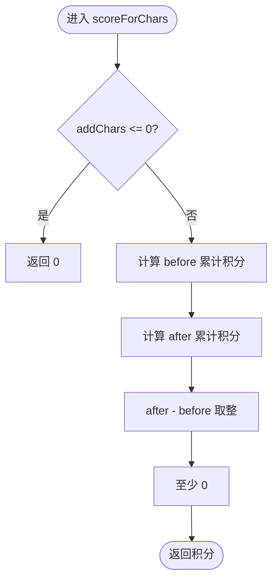
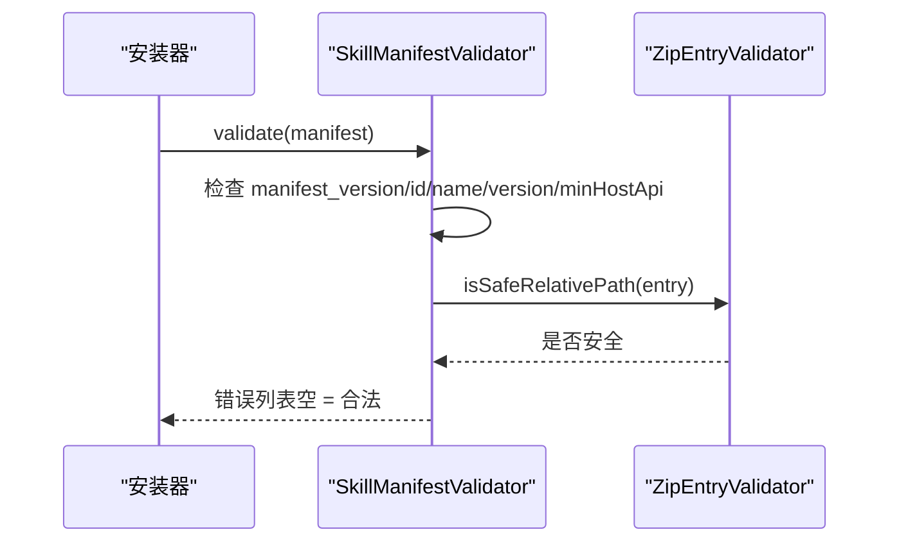
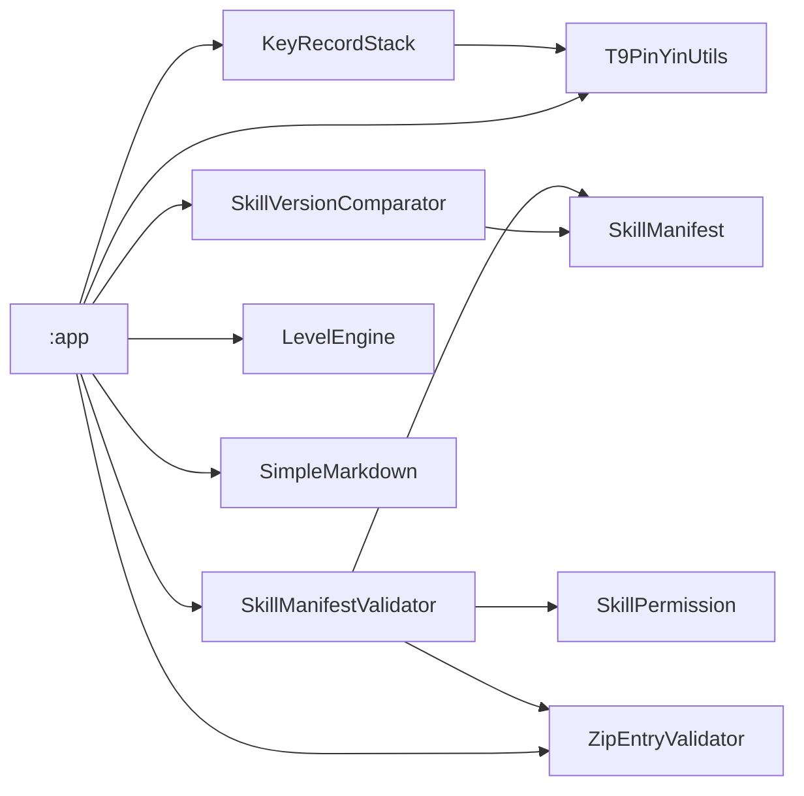

# Core Logic 模块设计

<cite>
**本文引用的文件**   
- [core-logic/build.gradle.kts](file://core-logic/build.gradle.kts)
- [KeyRecordStack.kt](file://core-logic/src/main/java/com/ziyou/ime/core/t9/KeyRecordStack.kt)
- [T9PinYinUtils.kt](file://core-logic/src/main/java/com/ziyou/ime/util/T9PinYinUtils.kt)
- [LevelEngine.kt](file://core-logic/src/main/java/com/ziyou/ime/core/level/LevelEngine.kt)
- [SkillManifest.kt](file://core-logic/src/main/java/com/ziyou/ime/core/skill/SkillManifest.kt)
- [SkillPermission.kt](file://core-logic/src/main/java/com/ziyou/ime/core/skill/SkillPermission.kt)
- [SkillManifestValidator.kt](file://core-logic/src/main/java/com/ziyou/ime/core/skill/SkillManifestValidator.kt)
- [ZipEntryValidator.kt](file://core-logic/src/main/java/com/ziyou/ime/core/skill/ZipEntryValidator.kt)
- [SkillVersionComparator.kt](file://core-logic/src/main/java/com/ziyou/ime/core/skill/SkillVersionComparator.kt)
- [SimpleMarkdown.kt](file://core-logic/src/main/java/com/ziyou/ime/core/markdown/SimpleMarkdown.kt)
- [KeyRecordStackTest.kt](file://core-logic/src/test/java/com/ziyou/ime/core/t9/KeyRecordStackTest.kt)
- [LevelEngineTest.kt](file://core-logic/src/test/java/com/ziyou/ime/core/level/LevelEngineTest.kt)
- [SimpleMarkdownTest.kt](file://core-logic/src/test/java/com/ziyou/ime/core/markdown/SimpleMarkdownTest.kt)
- [T9PinYinUtilsTest.kt](file://core-logic/src/test/java/com/ziyou/ime/util/T9PinYinUtilsTest.kt)
</cite>

## 目录
1. [简介](#简介)
2. [项目结构](#项目结构)
3. [核心组件](#核心组件)
4. [架构总览](#架构总览)
5. [详细组件分析](#详细组件分析)
6. [依赖关系分析](#依赖关系分析)
7. [性能考量](#性能考量)
8. [故障排查指南](#故障排查指南)
9. [结论](#结论)
10. [附录：接口契约与测试策略](#附录接口契约与测试策略)

## 简介
Core Logic 模块是一个纯逻辑库，不包含任何 Android 依赖，目标是提供高内聚、可测试、可复用的输入与业务计算能力。模块职责包括：
- T9 九宫格映射与输入状态机（KeyRecordStack）
- 等级计分引擎（LevelEngine）
- 技能插件校验（SkillManifestValidator、ZipEntryValidator、SkillVersionComparator）
- Markdown 渲染（SimpleMarkdown）
- T9 拼音双向映射工具（T9PinYinUtils）

该模块通过 Kotlin 语言实现，采用纯函数与不可变数据结构，确保单元测试友好与跨平台复用。

## 项目结构
模块以 Android Library 形态组织，但代码不依赖 Android Framework，仅使用 AGP/Kotlin 工具链。包结构按功能域划分：
- core/t9：T9 输入状态机与键记录栈
- core/level：等级体系与积分计算
- core/skill：技能插件元数据、权限与校验
- core/markdown：极简 Markdown → HTML 转换
- util：通用工具（T9 拼音映射）

图表来源
- [core-logic/build.gradle.kts:1-29](file://core-logic/build.gradle.kts#L1-L29)

章节来源
- [core-logic/build.gradle.kts:1-29](file://core-logic/build.gradle.kts#L1-L29)

## 核心组件
- KeyRecordStack：维护 T9 按键与已锁定拼音的输入状态，支持分段确认、智能退格与偏移计算。
- LevelEngine：无状态纯计算引擎，负责分段计分、连续天数奖励、等级判定与权益解锁。
- SkillManifestValidator：校验技能 manifest 字段合法性，返回错误列表。
- ZipEntryValidator：路径安全校验（防 Zip Slip），限制包大小、条目数与路径长度。
- SkillVersionComparator：版本号比较与升级判定。
- SimpleMarkdown：极简 Markdown → HTML 转换器，保证内容安全转义。
- T9PinYinUtils：T9 数字键序列与拼音的双向映射工具。

章节来源
- [KeyRecordStack.kt:1-310](file://core-logic/src/main/java/com/ziyou/ime/core/t9/KeyRecordStack.kt#L1-L310)
- [LevelEngine.kt:1-187](file://core-logic/src/main/java/com/ziyou/ime/core/level/LevelEngine.kt#L1-L187)
- [SkillManifestValidator.kt:1-78](file://core-logic/src/main/java/com/ziyou/ime/core/skill/SkillManifestValidator.kt#L1-L78)
- [ZipEntryValidator.kt:1-37](file://core-logic/src/main/java/com/ziyou/ime/core/skill/ZipEntryValidator.kt#L1-L37)
- [SkillVersionComparator.kt:1-30](file://core-logic/src/main/java/com/ziyou/ime/core/skill/SkillVersionComparator.kt#L1-L30)
- [SimpleMarkdown.kt:1-174](file://core-logic/src/main/java/com/ziyou/ime/core/markdown/SimpleMarkdown.kt#L1-L174)
- [T9PinYinUtils.kt:1-375](file://core-logic/src/main/java/com/ziyou/ime/util/T9PinYinUtils.kt#L1-L375)

## 架构总览
Core Logic 模块遵循“纯逻辑 + 无 I/O”的设计原则，所有核心算法均为纯函数或不可变数据结构操作，避免副作用与外部依赖。上层应用层（:app）通过单向依赖引入模块，编译器强制边界，确保模块的可移植性与可测试性。

图表来源
- [KeyRecordStack.kt:1-310](file://core-logic/src/main/java/com/ziyou/ime/core/t9/KeyRecordStack.kt#L1-L310)
- [T9PinYinUtils.kt:1-375](file://core-logic/src/main/java/com/ziyou/ime/util/T9PinYinUtils.kt#L1-L375)
- [LevelEngine.kt:1-187](file://core-logic/src/main/java/com/ziyou/ime/core/level/LevelEngine.kt#L1-L187)
- [SkillManifest.kt:1-51](file://core-logic/src/main/java/com/ziyou/ime/core/skill/SkillManifest.kt#L1-L51)
- [SkillPermission.kt:1-27](file://core-logic/src/main/java/com/ziyou/ime/core/skill/SkillPermission.kt#L1-L27)
- [SkillManifestValidator.kt:1-78](file://core-logic/src/main/java/com/ziyou/ime/core/skill/SkillManifestValidator.kt#L1-L78)
- [ZipEntryValidator.kt:1-37](file://core-logic/src/main/java/com/ziyou/ime/core/skill/ZipEntryValidator.kt#L1-L37)
- [SkillVersionComparator.kt:1-30](file://core-logic/src/main/java/com/ziyou/ime/core/skill/SkillVersionComparator.kt#L1-L30)
- [SimpleMarkdown.kt:1-174](file://core-logic/src/main/java/com/ziyou/ime/core/markdown/SimpleMarkdown.kt#L1-L174)

## 详细组件分析

### T9 九宫格映射与输入状态机（KeyRecordStack）
- 设计理念：维护一个输入记录栈，保持“列表顺序 == Rime 编码串的逻辑顺序”。选定拼音时原地替换首个未确定音节的 T9 段，保证字符偏移可按列表顺序累加；部分选词后合并为已确认段，退格时展开还原。
- 关键方法：
  - pushT9Key/pushApostrophe：追加数字键与分词符
  - pushPinyinSelectAction：将拼音锁定到首个未确定音节段，并返回替换指令
  - confirmLeading：将引擎确认的前缀段落合并为已确认段，跳过已确认段进行后续处理
  - popAndRestore：智能回退，根据栈顶类型决定还原或弹出
  - confirmedRawLength/unconfirmedRawChars：用于计算原始编码串中的偏移与重放
- 复杂度与不变式：
  - 时间复杂度：O(n) 扫描与替换，n 为当前记录数量
  - 空间复杂度：O(n) 存储记录
  - 不变式：已确认段始终位于栈头，已锁定拼音优先于剩余数字段

图表来源
- [KeyRecordStack.kt:57-83](file://core-logic/src/main/java/com/ziyou/ime/core/t9/KeyRecordStack.kt#L57-L83)

章节来源
- [KeyRecordStack.kt:1-310](file://core-logic/src/main/java/com/ziyou/ime/core/t9/KeyRecordStack.kt#L1-L310)

### 等级计分引擎（LevelEngine）
- 设计理念：纯计算引擎，无状态、无 I/O，所有函数为纯函数，便于单测与热路径优化。
- 核心规则：
  - 分段计分：当日累计 2000 字全额（每字 1 分），2000–6000 字半额（每字 0.5 分），超过 6000 不再计分
  - 连续天数奖励：第 2 天起逐日 +5，单日封顶 +30，每满 7 天额外 +50
  - 等级判定：基于累计积分阈值表，1–10 级指数递增
  - 权益解锁：皮肤与音效包按等级解锁
- 复杂度：O(1) 查表与 O(n) 线性遍历（n=10），常数时间级别

图表来源
- [LevelEngine.kt:69-74](file://core-logic/src/main/java/com/ziyou/ime/core/level/LevelEngine.kt#L69-L74)

章节来源
- [LevelEngine.kt:1-187](file://core-logic/src/main/java/com/ziyou/ime/core/level/LevelEngine.kt#L1-L187)

### 技能插件校验（SkillManifestValidator、ZipEntryValidator）
- SkillManifestValidator：校验 manifest 字段合法性，包括版本、ID 格式、名称长度、版本号格式、宿主 API 版本、入口路径、网络域名白名单与权限声明一致性等。返回错误列表，空列表表示合法。
- ZipEntryValidator：路径安全校验，拒绝空路径、绝对路径、反斜杠、盘符冒号、包含“..”/“.”/空段、超长路径与 NUL 字符，防止 Zip Slip 攻击。
- 设计要点：纯字符串逻辑，不触碰文件系统，可独立单测。

图表来源
- [SkillManifestValidator.kt:37-76](file://core-logic/src/main/java/com/ziyou/ime/core/skill/SkillManifestValidator.kt#L37-L76)
- [ZipEntryValidator.kt:29-35](file://core-logic/src/main/java/com/ziyou/ime/core/skill/ZipEntryValidator.kt#L29-L35)

章节来源
- [SkillManifestValidator.kt:1-78](file://core-logic/src/main/java/com/ziyou/ime/core/skill/SkillManifestValidator.kt#L1-L78)
- [ZipEntryValidator.kt:1-37](file://core-logic/src/main/java/com/ziyou/ime/core/skill/ZipEntryValidator.kt#L1-L37)

### 技能版本比较（SkillVersionComparator）
- 功能：按数字点分格式比较版本号，缺段视为 0；isUpgrade 严格更高才允许覆盖安装，防止降级替换攻击。
- 复杂度：O(k)，k 为版本号段数。

章节来源
- [SkillVersionComparator.kt:1-30](file://core-logic/src/main/java/com/ziyou/ime/core/skill/SkillVersionComparator.kt#L1-L30)

### Markdown 渲染（SimpleMarkdown）
- 功能：极简 Markdown → HTML 转换器，支持标题、围栏代码块、表格、无序/有序列表、引用、分隔线、加粗、行内代码、链接（仅保留文字）。
- 安全性：全部文本先做 HTML 实体转义再套标签，杜绝注入风险。
- 复杂度：O(n) 线性扫描，n 为行数。

章节来源
- [SimpleMarkdown.kt:1-174](file://core-logic/src/main/java/com/ziyou/ime/core/markdown/SimpleMarkdown.kt#L1-L174)

### T9 拼音双向映射（T9PinYinUtils）
- 功能：T9 数字键序列与拼音的双向映射，支持候选拼音由长到短去重保序、O(1) 反查、单字符映射与格式化显示。
- 数据结构：内部维护 pinyinMap 与 reverseMap，digitToGroup/groupToDigit 映射。
- 复杂度：t9KeyToPinyin 最坏 O(L^2)（L≤6），pinyin2Key O(1)。

章节来源
- [T9PinYinUtils.kt:1-375](file://core-logic/src/main/java/com/ziyou/ime/util/T9PinYinUtils.kt#L1-L375)

## 依赖关系分析
- 模块内依赖方向：
  - KeyRecordStack 依赖 T9PinYinUtils
  - SkillManifestValidator 依赖 SkillManifest、SkillPermission、ZipEntryValidator
  - SkillVersionComparator 与 SkillManifest 协作进行版本比较
  - SimpleMarkdown 独立无依赖
- 模块外依赖：
  - :app 依赖 :core-logic（单向，编译器强制边界）
  - 测试依赖 JUnit

图表来源
- [core-logic/build.gradle.kts:1-29](file://core-logic/build.gradle.kts#L1-L29)
- [KeyRecordStack.kt:1-310](file://core-logic/src/main/java/com/ziyou/ime/core/t9/KeyRecordStack.kt#L1-L310)
- [SkillManifestValidator.kt:1-78](file://core-logic/src/main/java/com/ziyou/ime/core/skill/SkillManifestValidator.kt#L1-L78)

章节来源
- [core-logic/build.gradle.kts:1-29](file://core-logic/build.gradle.kts#L1-L29)

## 性能考量
- KeyRecordStack：
  - 原地替换与合并减少内存分配
  - 字符偏移计算线性扫描，适合主线程快速响应
- LevelEngine：
  - 纯计算，无 I/O，缓存阈值表与名称数组
  - 分段计分与等级判定为 O(1)/O(n)（n=10）
- T9PinYinUtils：
  - 反向索引 O(1) 查询，候选生成从长到短匹配，限制最大长度 6
- SimpleMarkdown：
  - 单次线性扫描，HTML 转义在行内处理，避免二次解析

## 故障排查指南
- KeyRecordStack：
  - 多音节位置错乱：检查 confirmLeading 是否成功合并，确认段宽度按合并前记录计算
  - 退格异常：popAndRestore 需展开已确认段后再处理栈尾
- SkillManifestValidator：
  - 安装失败：查看错误列表，常见原因包括 ID 格式、版本号、入口路径、权限缺失
  - Zip Slip 防护：确保 entry 路径安全，拒绝相对路径逃逸
- LevelEngine：
  - 积分异常：检查分段阈值与封顶规则，确认 charsBeforeToday 与 addChars 非负
- SimpleMarkdown：
  - 注入风险：确认所有文本经过 escape，链接只保留文字

章节来源
- [KeyRecordStack.kt:98-142](file://core-logic/src/main/java/com/ziyou/ime/core/t9/KeyRecordStack.kt#L98-L142)
- [SkillManifestValidator.kt:37-76](file://core-logic/src/main/java/com/ziyou/ime/core/skill/SkillManifestValidator.kt#L37-L76)
- [LevelEngine.kt:57-74](file://core-logic/src/main/java/com/ziyou/ime/core/level/LevelEngine.kt#L57-L74)
- [SimpleMarkdown.kt:147-154](file://core-logic/src/main/java/com/ziyou/ime/core/markdown/SimpleMarkdown.kt#L147-L154)

## 结论
Core Logic 模块以纯逻辑为核心，通过不可变数据与纯函数实现高内聚、低耦合的输入与业务计算能力。模块设计强调可测试性与可复用性，避免 Android 依赖，确保跨平台与易维护。各组件职责清晰，接口契约明确，单元测试覆盖关键路径，为上层应用提供稳定可靠的支撑。

## 附录：接口契约与测试策略

### 接口契约说明
- KeyRecordStack：
  - 输入：T9 数字键、分词符、拼音选择、部分选词确认
  - 输出：ReplaceCommand（caretPos、length、replacement）、布尔状态（hasConfirmed）、原始编码串片段
- LevelEngine：
  - 输入：累计字符数、新增字符数、连续天数、累计积分、主题/音效标识
  - 输出：积分、等级、进度、解锁状态、名称集合
- SkillManifestValidator：
  - 输入：SkillManifest
  - 输出：错误列表（空 = 合法）
- ZipEntryValidator：
  - 输入：路径字符串
  - 输出：是否安全（布尔）
- SkillVersionComparator：
  - 输入：两个版本号字符串
  - 输出：比较结果（整数）、是否升级（布尔）
- SimpleMarkdown：
  - 输入：Markdown 文本
  - 输出：HTML 片段

### 单元测试策略
- 覆盖边界条件与异常路径（如非法输入、空值、越界）
- 验证核心不变式（如列表顺序与编码串一致、积分单调递增）
- 针对纯函数进行等价类划分与参数组合测试
- 使用 JUnit 框架，断言期望值与行为

章节来源
- [KeyRecordStackTest.kt:1-185](file://core-logic/src/test/java/com/ziyou/ime/core/t9/KeyRecordStackTest.kt#L1-L185)
- [LevelEngineTest.kt:1-111](file://core-logic/src/test/java/com/ziyou/ime/core/level/LevelEngineTest.kt#L1-L111)
- [SimpleMarkdownTest.kt:1-89](file://core-logic/src/test/java/com/ziyou/ime/core/markdown/SimpleMarkdownTest.kt#L1-L89)
- [T9PinYinUtilsTest.kt:1-74](file://core-logic/src/test/java/com/ziyou/ime/util/T9PinYinUtilsTest.kt#L1-L74)