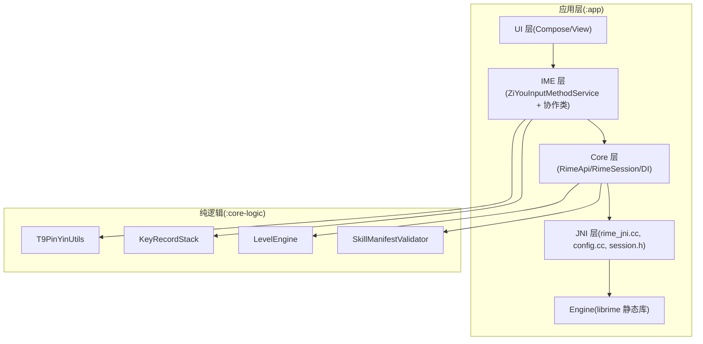
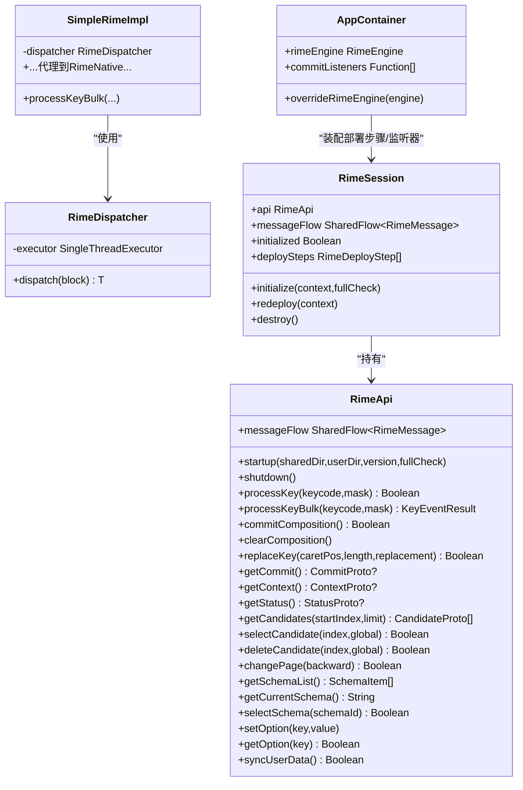
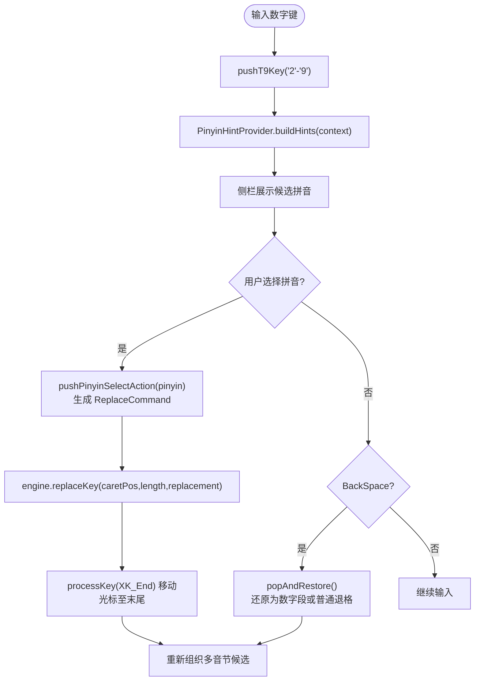
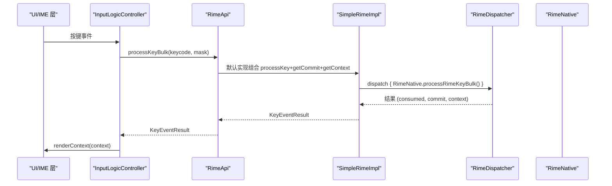
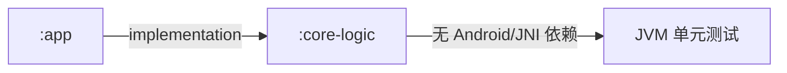
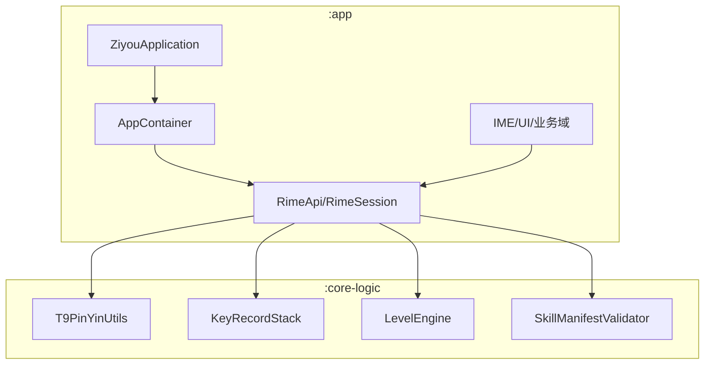

# 模块设计

<cite>
**本文引用的文件**   
- [settings.gradle.kts](file://settings.gradle.kts)
- [build.gradle.kts](file://build.gradle.kts)
- [app/build.gradle.kts](file://app/build.gradle.kts)
- [core-logic/build.gradle.kts](file://core-logic/build.gradle.kts)
- [ARCHITECTURE.md](file://ARCHITECTURE.md)
- [ZiyouApplication.kt](file://app/src/main/java/com/ziyou/ime/ZiyouApplication.kt)
- [AppContainer.kt](file://app/src/main/java/com/ziyou/ime/di/AppContainer.kt)
- [RimeApi.kt](file://app/src/main/java/com/ziyou/ime/core/RimeApi.kt)
- [RimeSession.kt](file://app/src/main/java/com/ziyou/ime/daemon/RimeSession.kt)
- [KeyRecordStack.kt](file://core-logic/src/main/java/com/ziyou/ime/core/t9/KeyRecordStack.kt)
- [T9PinYinUtils.kt](file://core-logic/src/main/java/com/ziyou/ime/util/T9PinYinUtils.kt)
- [LevelEngine.kt](file://core-logic/src/main/java/com/ziyou/ime/core/level/LevelEngine.kt)
- [SkillManifestValidator.kt](file://core-logic/src/main/java/com/ziyou/ime/core/skill/SkillManifestValidator.kt)
</cite>

## 目录
1. [引言](#引言)
2. [项目结构](#项目结构)
3. [核心组件](#核心组件)
4. [架构总览](#架构总览)
5. [详细组件分析](#详细组件分析)
6. [依赖分析](#依赖分析)
7. [性能考量](#性能考量)
8. [故障排查指南](#故障排查指南)
9. [结论](#结论)
10. [附录：接口契约与依赖图](#附录接口契约与依赖图)

## 引言
本文件聚焦字由输入法的模块设计，重点阐述 :app 与 :core-logic 的职责划分与设计原则。:app 承担 Android 应用层、JNI 集成、业务域持久化与 UI；:core-logic 承载纯逻辑（T9 映射、等级计分、技能插件校验等），不依赖 Android 框架与 JNI。通过 Gradle 多模块与编译器约束，强制依赖方向为 :app → :core-logic，确保边界清晰、可测试性强、构建快速。

## 项目结构
- 根工程使用 settings.gradle.kts 声明子模块 :app 与 :core-logic。
- :app 为 Android Application，包含 IME 服务、UI、Core/JNI 集成、业务域（等级、词库、九宫格、技能插件）与配置/部署。
- :core-logic 为 Android Library（仅用于复用 Kotlin 工具链），内部代码无 Android 依赖，提供 T9 双向映射、九宫格状态机、等级引擎、技能 manifest 校验等。

```mermaid
graph TB
A["根工程<br/>settings.gradle.kts"] --> B[":app (Android 应用)"]
A --> C[":core-logic (纯逻辑库)"]
B --> |implementation(project(":core-logic"))| C
```

**图表来源** 
- [settings.gradle.kts:25-28](file://settings.gradle.kts#L25-L28)
- [app/build.gradle.kts:143-147](file://app/build.gradle.kts#L143-L147)

**章节来源**
- [settings.gradle.kts:25-28](file://settings.gradle.kts#L25-L28)
- [build.gradle.kts:1-7](file://build.gradle.kts#L1-L7)
- [app/build.gradle.kts:143-147](file://app/build.gradle.kts#L143-L147)
- [core-logic/build.gradle.kts:1-29](file://core-logic/build.gradle.kts#L1-L29)

## 核心组件
- :app 模块职责
  - Android 应用入口与 IME 生命周期管理
  - Core/JNI 集成：RimeApi 接口、SimpleRimeImpl、RimeDispatcher、RimeNative
  - 业务域持久化：等级体系（LevelRepository/LevelStats）、扩展词库（DictManager）、侧栏符号、主题/皮肤
  - UI 层：Compose/View 键盘视图、候选区、编码区、技能面板容器
- :core-logic 模块职责
  - T9 拼音双向映射（util/T9PinYinUtils）
  - 九宫格输入状态机（core/t9/KeyRecordStack）
  - 等级计分纯引擎（core/level/LevelEngine）
  - 技能插件校验（core/skill/*：manifest 校验、Zip 安全、版本比较、权限定义）

**章节来源**
- [ARCHITECTURE.md:1-108](file://ARCHITECTURE.md#L1-L108)
- [core-logic/build.gradle.kts:5-11](file://core-logic/build.gradle.kts#L5-L11)

## 架构总览
整体采用“五层引擎栈”：UI → IME → Core → JNI → Engine（librime）。横向扩展四个业务域（等级、词库、九宫格、技能插件），纯逻辑下沉到 :core-logic。依赖方向严格单向：:app → :core-logic，由编译器保证。



**图表来源** 
- [ARCHITECTURE.md:1-66](file://ARCHITECTURE.md#L1-L66)

**章节来源**
- [ARCHITECTURE.md:1-66](file://ARCHITECTURE.md#L1-L66)

## 详细组件分析

### :app 模块：Android 应用层、JNI 集成、业务域持久化
- 应用入口与初始化
  - ZiyouApplication 负责全局初始化，资源部署与引擎启动延迟至 RimeSession.initialize() 异步执行，避免阻塞主线程。
- DI 组合根
  - AppContainer 作为轻量 DI 容器，装配 RimeSession.deploySteps（资源部署→扩展词库注入）与 commitListeners（等级计分），使调用方依赖接口而非单例，便于测试替换。
- 引擎接口与实现
  - RimeApi 定义所有 suspend 方法（生命周期、输入处理、候选操作、方案/选项、消息流），默认 processKeyBulk 将多次调用合并为单次调度，减少线程往返与 JNI 跨界。
  - SimpleRimeImpl 将每个方法经 RimeDispatcher.dispatch 执行对应 JNI 调用。
- 会话与生命周期
  - RimeSession(object) 统一管理引擎生命周期，含 initialize/redeploy/destroy，带 lifecycleMutex 互斥与超时保护，避免并发双重初始化与线程泄漏。
  - deploySteps 由组合根装配，daemon 层不直接依赖业务模块，依赖方向反转。
- 消息流
  - SharedFlow<RimeMessage> 支持多订阅者（IME/设置页/词库页），replay=1 与新订阅者收到最近消息，extraBufferCapacity 防背压丢失。



**图表来源** 
- [RimeApi.kt:1-105](file://app/src/main/java/com/ziyou/ime/core/RimeApi.kt#L1-L105)
- [RimeSession.kt:1-226](file://app/src/main/java/com/ziyou/ime/daemon/RimeSession.kt#L1-L226)
- [AppContainer.kt:1-59](file://app/src/main/java/com/ziyou/ime/di/AppContainer.kt#L1-L59)

**章节来源**
- [ZiyouApplication.kt:1-26](file://app/src/main/java/com/ziyou/ime/ZiyouApplication.kt#L1-L26)
- [AppContainer.kt:1-59](file://app/src/main/java/com/ziyou/ime/di/AppContainer.kt#L1-L59)
- [RimeApi.kt:1-105](file://app/src/main/java/com/ziyou/ime/core/RimeApi.kt#L1-L105)
- [RimeSession.kt:1-226](file://app/src/main/java/com/ziyou/ime/daemon/RimeSession.kt#L1-L226)

### :core-logic 模块：纯逻辑设计与可复用组件
- T9 拼音双向映射（T9PinYinUtils）
  - 数字键序列 ↔ 拼音数组（按匹配长度由长到短、去重保序）
  - 拼音 → T9 键序列（O(1) 反向索引）
  - 格式化 T9 编码为可读拼音显示
- 九宫格输入状态机（KeyRecordStack）
  - 维护列表顺序 == Rime 编码串逻辑顺序
  - 选定拼音原地替换首个 T9Key 段，返回 ReplaceCommand 供 replaceKey
  - 智能退格解锁尾部拼音还原为数字段
  - 部分选词后确认段合并，保持原始编码串偏移一致
- 等级计分引擎（LevelEngine）
  - 分段计分（前2000字每字1分，2000–6000字每字0.5分）
  - 连续天数奖励与等级门槛（指数递增）
  - 权益解锁规则（皮肤/音效包）
- 技能插件校验（SkillManifestValidator）
  - manifest 字段合法性校验（id/name/version/minHostApi/entry/networkDomains）
  - 宿主 API 版本控制（HOST_API_VERSION）
  - ZipEntryValidator、版本比较、权限定义等纯逻辑



**图表来源** 
- [KeyRecordStack.kt:1-310](file://core-logic/src/main/java/com/ziyou/ime/core/t9/KeyRecordStack.kt#L1-L310)
- [T9PinYinUtils.kt:1-375](file://core-logic/src/main/java/com/ziyou/ime/util/T9PinYinUtils.kt#L1-L375)

**章节来源**
- [T9PinYinUtils.kt:1-375](file://core-logic/src/main/java/com/ziyou/ime/util/T9PinYinUtils.kt#L1-L375)
- [KeyRecordStack.kt:1-310](file://core-logic/src/main/java/com/ziyou/ime/core/t9/KeyRecordStack.kt#L1-L310)
- [LevelEngine.kt:1-187](file://core-logic/src/main/java/com/ziyou/ime/core/level/LevelEngine.kt#L1-L187)
- [SkillManifestValidator.kt:1-78](file://core-logic/src/main/java/com/ziyou/ime/core/skill/SkillManifestValidator.kt#L1-L78)

### 模块间依赖关系与接口契约
- 依赖方向
  - :app → :core-logic（单向，编译器强制）
  - :app 内 UI → IME → Core → JNI → Engine（单向向下）
- 接口契约
  - RimeApi：所有操作均为 suspend，processKeyBulk 热路径单次跨界返回 (consumed, commit, context)
  - RimeEngine：生命周期抽象（initialize/redeploy/destroy），消息流 messageFlow，初始化状态 initialized
  - AppContainer：暴露 rimeEngine 与 commitListeners，测试可通过 overrideRimeEngine 注入替身



**图表来源** 
- [RimeApi.kt:1-105](file://app/src/main/java/com/ziyou/ime/core/RimeApi.kt#L1-L105)
- [RimeSession.kt:1-226](file://app/src/main/java/com/ziyou/ime/daemon/RimeSession.kt#L1-L226)

**章节来源**
- [ARCHITECTURE.md:68-108](file://ARCHITECTURE.md#L68-L108)
- [AppContainer.kt:1-59](file://app/src/main/java/com/ziyou/ime/di/AppContainer.kt#L1-L59)

## 依赖分析
- 编译期依赖
  - app/build.gradle.kts 中 implementation(project(":core-logic")) 声明单向依赖
  - core-logic/build.gradle.kts 无 Android 依赖，仅 JUnit 测试依赖
- 运行时依赖
  - :app 通过 AppContainer 获取 RimeEngine，避免硬依赖单例
  - :core-logic 被 :app 在 IME/Core/UI 层调用，提供纯逻辑能力



**图表来源** 
- [app/build.gradle.kts:143-147](file://app/build.gradle.kts#L143-L147)
- [core-logic/build.gradle.kts:26-29](file://core-logic/build.gradle.kts#L26-L29)

**章节来源**
- [app/build.gradle.kts:143-147](file://app/build.gradle.kts#L143-L147)
- [core-logic/build.gradle.kts:5-11](file://core-logic/build.gradle.kts#L5-L11)

## 性能考量
- 单线程 Dispatcher：librime 非线程安全，所有 JNI 调用在单一线程执行，协程友好且顺序保证
- 批量 API：processKeyBulk 将三次调用合并为一次跨界，显著降低主线程↔Rime 线程往返
- 热路径零磁盘 IO：等级计分 onCommit 仅 O(1) 原子自增，达阈值或退出时后台落盘
- RAII 资源管理：C++ SessionHolder/CString/JRef/JString 避免泄漏
- 条件编译：CMake option() 控制可选模块，最小二进制体积

**章节来源**
- [ARCHITECTURE.md:70-108](file://ARCHITECTURE.md#L70-L108)

## 故障排查指南
- 引擎初始化失败
  - 检查 deploySteps 是否装配正确（资源部署→扩展词库注入）
  - 查看 initialize 超时日志（STARTUP_TIMEOUT_MS），确认词典文件完整性
- 输入错乱/丢字
  - 确认 InputLogicController.inputMutex 串行化输入事务
  - 检查 KeyRecordStack 的 ReplaceCommand 位置计算是否正确
- 技能插件加载失败
  - 校验 SkillManifestValidator 错误列表（id/name/version/minHostApi/entry/networkDomains）
  - 确认 HOST_API_VERSION 与技能 minHostApi 兼容

**章节来源**
- [RimeSession.kt:88-153](file://app/src/main/java/com/ziyou/ime/daemon/RimeSession.kt#L88-L153)
- [KeyRecordStack.kt:57-83](file://core-logic/src/main/java/com/ziyou/ime/core/t9/KeyRecordStack.kt#L57-L83)
- [SkillManifestValidator.kt:37-76](file://core-logic/src/main/java/com/ziyou/ime/core/skill/SkillManifestValidator.kt#L37-L76)

## 结论
:app 与 :core-logic 的职责划分清晰，依赖方向由编译器强制保证。:app 专注 Android 集成、UI 与业务持久化，:core-logic 提供高内聚、可复用的纯逻辑组件。通过接口化、DI 组合根与批量 API，系统在可测试性、性能与可维护性上达到良好平衡。

## 附录：接口契约与依赖图

### 接口契约摘要
- RimeApi
  - 生命周期：startup/shutdown
  - 输入处理：processKey/processKeyBulk/commitComposition/clearComposition/replaceKey
  - 状态查询：getCommit/getContext/getStatus/getCandidates
  - 候选操作：selectCandidate/deleteCandidate/changePage
  - 方案管理：getSchemaList/getCurrentSchema/selectSchema
  - 运行时选项：setOption/getOption
  - 同步：syncUserData
  - 消息流：messageFlow
- RimeEngine
  - initialize/redeploy/destroy
  - api/messageFlow/initialized
- AppContainer
  - rimeEngine/commitListeners/overrideRimeEngine

**章节来源**
- [RimeApi.kt:1-105](file://app/src/main/java/com/ziyou/ime/core/RimeApi.kt#L1-L105)
- [RimeSession.kt:1-226](file://app/src/main/java/com/ziyou/ime/daemon/RimeSession.kt#L1-L226)
- [AppContainer.kt:1-59](file://app/src/main/java/com/ziyou/ime/di/AppContainer.kt#L1-L59)

### 模块依赖图


**图表来源** 
- [ZiyouApplication.kt:1-26](file://app/src/main/java/com/ziyou/ime/ZiyouApplication.kt#L1-L26)
- [AppContainer.kt:1-59](file://app/src/main/java/com/ziyou/ime/di/AppContainer.kt#L1-L59)
- [RimeApi.kt:1-105](file://app/src/main/java/com/ziyou/ime/core/RimeApi.kt#L1-L105)
- [RimeSession.kt:1-226](file://app/src/main/java/com/ziyou/ime/daemon/RimeSession.kt#L1-L226)
- [T9PinYinUtils.kt:1-375](file://core-logic/src/main/java/com/ziyou/ime/util/T9PinYinUtils.kt#L1-L375)
- [KeyRecordStack.kt:1-310](file://core-logic/src/main/java/com/ziyou/ime/core/t9/KeyRecordStack.kt#L1-L310)
- [LevelEngine.kt:1-187](file://core-logic/src/main/java/com/ziyou/ime/core/level/LevelEngine.kt#L1-L187)
- [SkillManifestValidator.kt:1-78](file://core-logic/src/main/java/com/ziyou/ime/core/skill/SkillManifestValidator.kt#L1-L78)