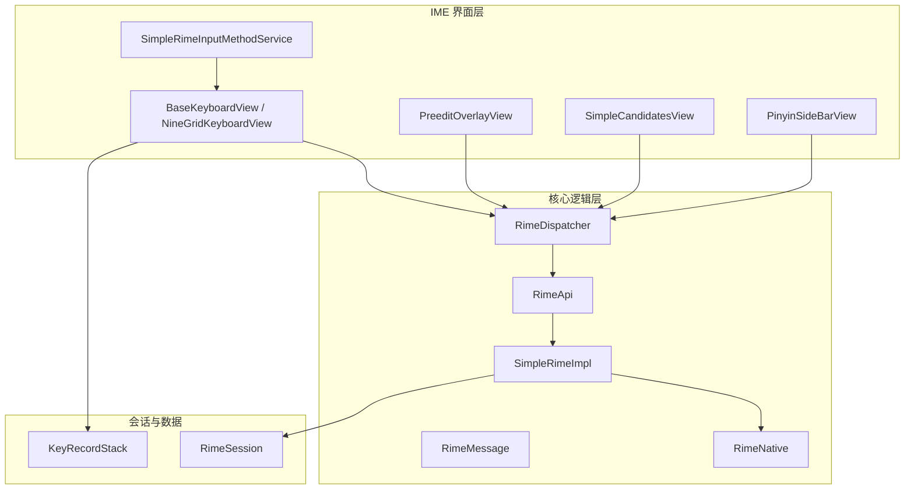
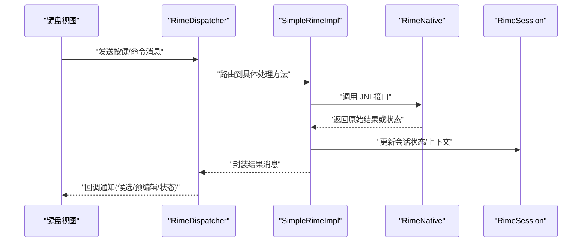
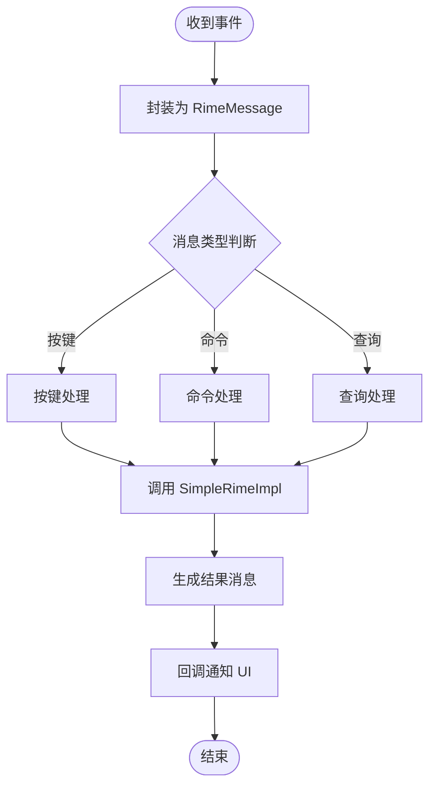
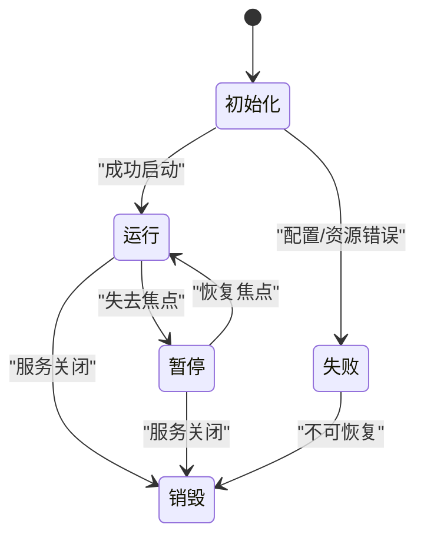
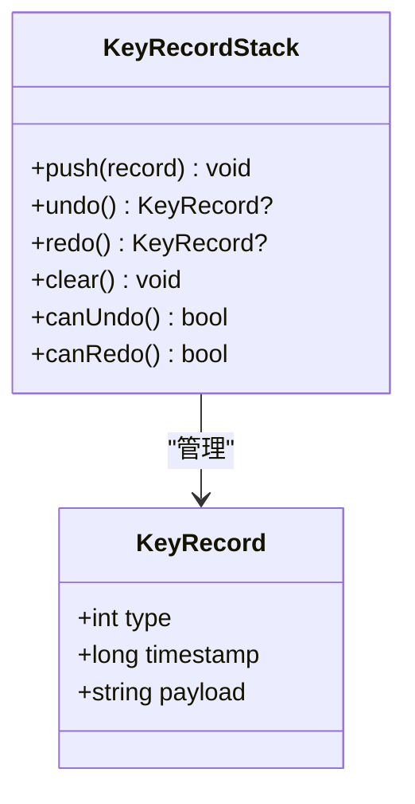
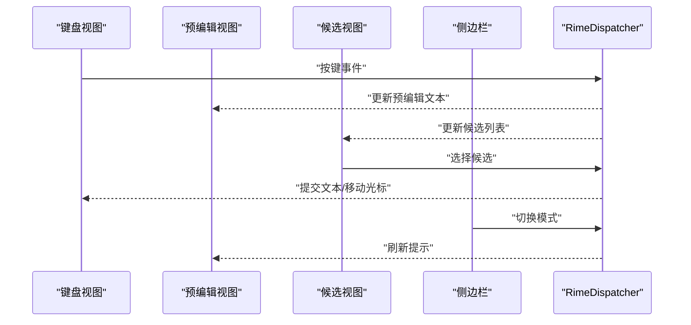
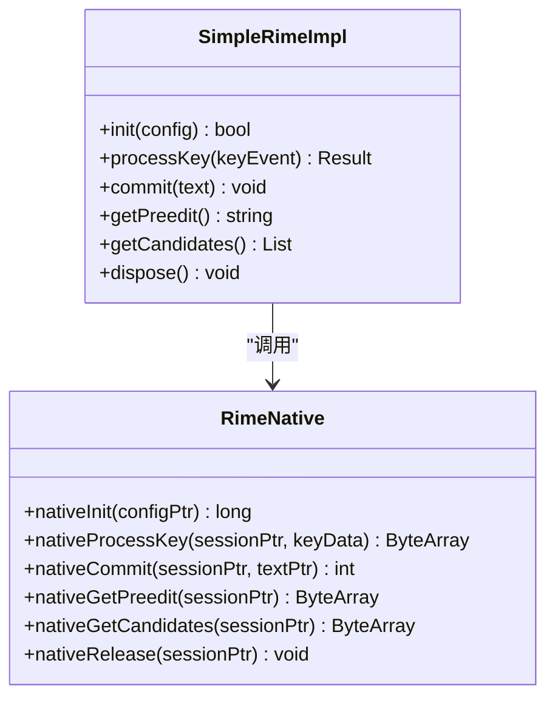
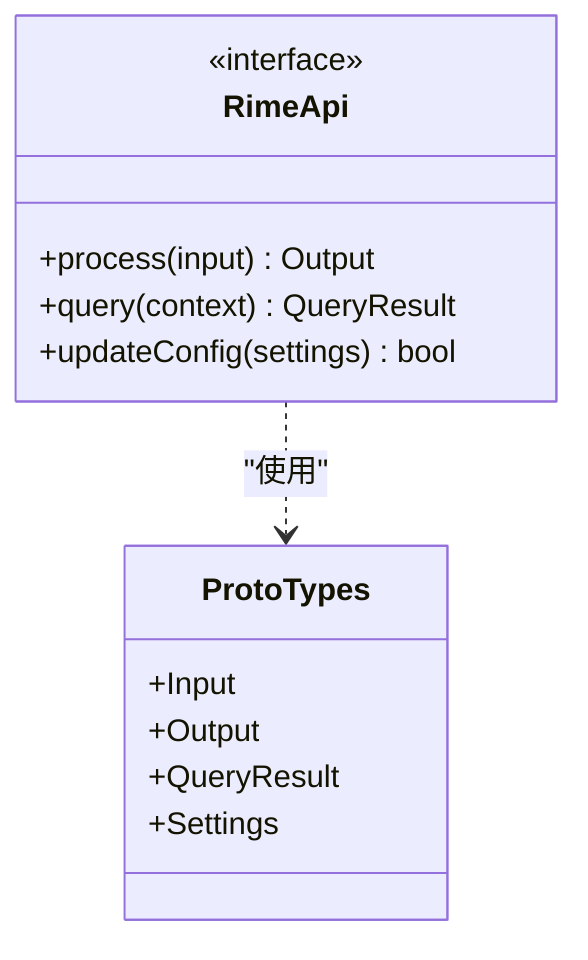
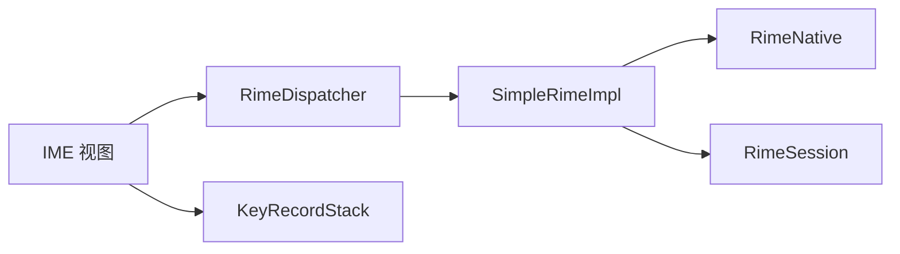

# 组件交互模式

<cite>
**本文引用的文件**   
- [RimeDispatcher.kt](file://app/src/main/java/com/ziyou/ime/core/RimeDispatcher.kt)
- [RimeMessage.kt](file://app/src/main/java/com/ziyou/ime/core/RimeMessage.kt)
- [RimeNative.kt](file://app/src/main/java/com/ziyou/ime/core/RimeNative.kt)
- [SimpleRimeImpl.kt](file://app/src/main/java/com/ziyou/ime/core/SimpleRimeImpl.kt)
- [RimeSession.kt](file://app/src/main/java/com/ziyou/ime/daemon/RimeSession.kt)
- [KeyRecordStack.kt](file://app/src/main/java/com/ziyou/ime/data/KeyRecordStack.kt)
- [SimpleRimeInputMethodService.kt](file://app/src/main/java/com/ziyou/ime/ime/SimpleRimeInputMethodService.kt)
- [BaseKeyboardView.kt](file://app/src/main/java/com/ziyou/ime/ime/BaseKeyboardView.kt)
- [NineGridKeyboardView.kt](file://app/src/main/java/com/ziyou/ime/ime/NineGridKeyboardView.kt)
- [PreeditOverlayView.kt](file://app/src/main/java/com/ziyou/ime/ime/PreeditOverlayView.kt)
- [SimpleCandidatesView.kt](file://app/src/main/java/com/ziyou/ime/ime/SimpleCandidatesView.kt)
- [PinyinSideBarView.kt](file://app/src/main/java/com/ziyou/ime/ime/PinyinSideBarView.kt)
- [RimeApi.kt](file://app/src/main/java/com/ziyou/ime/core/RimeApi.kt)
- [ProtoTypes.kt](file://app/src/main/java/com/ziyou/ime/core/ProtoTypes.kt)
</cite>

## 目录
1. [简介](#简介)
2. [项目结构](#项目结构)
3. [核心组件](#核心组件)
4. [架构总览](#架构总览)
5. [详细组件分析](#详细组件分析)
6. [依赖关系分析](#依赖关系分析)
7. [性能考虑](#性能考虑)
8. [故障排查指南](#故障排查指南)
9. [结论](#结论)
10. [附录](#附录)

## 简介
本文件聚焦 ziyou-ime 的组件交互模式，重点阐述：
- RimeDispatcher 的消息分发机制与异步通信模式
- RimeSession 的生命周期管理与状态维护
- KeyRecordStack 的按键记录栈实现及撤销/重做能力
- 组件间事件传递与回调处理
- 关键时序图与状态图
- 错误处理与异常恢复策略
- 开发者集成最佳实践与常见问题解决方案

## 项目结构
项目采用分层组织：
- ime 层负责输入法服务与键盘视图（输入采集、候选展示、预编辑显示）
- core 层封装 Rime 引擎调用、消息定义与分发器
- daemon 层管理长生命周期会话（RimeSession）
- data 层提供数据结构与工具（如 KeyRecordStack）
- jni/librime_jni 为原生桥接层

图表来源
- [SimpleRimeInputMethodService.kt](file://app/src/main/java/com/ziyou/ime/ime/SimpleRimeInputMethodService.kt)
- [BaseKeyboardView.kt](file://app/src/main/java/com/ziyou/ime/ime/BaseKeyboardView.kt)
- [NineGridKeyboardView.kt](file://app/src/main/java/com/ziyou/ime/ime/NineGridKeyboardView.kt)
- [PreeditOverlayView.kt](file://app/src/main/java/com/ziyou/ime/ime/PreeditOverlayView.kt)
- [SimpleCandidatesView.kt](file://app/src/main/java/com/ziyou/ime/ime/SimpleCandidatesView.kt)
- [PinyinSideBarView.kt](file://app/src/main/java/com/ziyou/ime/ime/PinyinSideBarView.kt)
- [RimeDispatcher.kt](file://app/src/main/java/com/ziyou/ime/core/RimeDispatcher.kt)
- [RimeMessage.kt](file://app/src/main/java/com/ziyou/ime/core/RimeMessage.kt)
- [RimeApi.kt](file://app/src/main/java/com/ziyou/ime/core/RimeApi.kt)
- [SimpleRimeImpl.kt](file://app/src/main/java/com/ziyou/ime/core/SimpleRimeImpl.kt)
- [RimeNative.kt](file://app/src/main/java/com/ziyou/ime/core/RimeNative.kt)
- [RimeSession.kt](file://app/src/main/java/com/ziyou/ime/daemon/RimeSession.kt)
- [KeyRecordStack.kt](file://app/src/main/java/com/ziyou/ime/data/KeyRecordStack.kt)

章节来源
- [SimpleRimeInputMethodService.kt](file://app/src/main/java/com/ziyou/ime/ime/SimpleRimeInputMethodService.kt)
- [RimeDispatcher.kt](file://app/src/main/java/com/ziyou/ime/core/RimeDispatcher.kt)
- [RimeSession.kt](file://app/src/main/java/com/ziyou/ime/daemon/RimeSession.kt)
- [KeyRecordStack.kt](file://app/src/main/java/com/ziyou/ime/data/KeyRecordStack.kt)

## 核心组件
- RimeDispatcher：统一消息入口，负责将 UI 事件转换为内部消息，调度到对应处理器，并异步回传结果。
- RimeMessage：消息类型与载荷定义，承载按键、命令、回调等上下文。
- SimpleRimeImpl：对 Rime 引擎的统一抽象实现，屏蔽 JNI 细节，暴露高层接口。
- RimeNative：JNI 绑定，负责与底层 C/C++ 库交互。
- RimeSession：会话管理器，维护 Rime 上下文、配置、用户词库与状态。
- KeyRecordStack：按键历史栈，支持撤销/重做，辅助输入法行为控制。
- IME 视图组件：采集按键、展示候选与预编辑文本、侧边栏联动。

章节来源
- [RimeDispatcher.kt](file://app/src/main/java/com/ziyou/ime/core/RimeDispatcher.kt)
- [RimeMessage.kt](file://app/src/main/java/com/ziyou/ime/core/RimeMessage.kt)
- [SimpleRimeImpl.kt](file://app/src/main/java/com/ziyou/ime/core/SimpleRimeImpl.kt)
- [RimeNative.kt](file://app/src/main/java/com/ziyou/ime/core/RimeNative.kt)
- [RimeSession.kt](file://app/src/main/java/com/ziyou/ime/daemon/RimeSession.kt)
- [KeyRecordStack.kt](file://app/src/main/java/com/ziyou/ime/data/KeyRecordStack.kt)

## 架构总览
整体采用“UI -> Dispatcher -> Impl -> Native -> Session”的分层架构，配合消息驱动与回调机制，确保输入流程清晰、可测试、可扩展。

图表来源
- [RimeDispatcher.kt](file://app/src/main/java/com/ziyou/ime/core/RimeDispatcher.kt)
- [SimpleRimeImpl.kt](file://app/src/main/java/com/ziyou/ime/core/SimpleRimeImpl.kt)
- [RimeNative.kt](file://app/src/main/java/com/ziyou/ime/core/RimeNative.kt)
- [RimeSession.kt](file://app/src/main/java/com/ziyou/ime/daemon/RimeSession.kt)

## 详细组件分析

### RimeDispatcher：消息分发与异步通信
- 职责
  - 接收来自 UI 的事件（按键、手势、系统命令）
  - 将事件包装为 RimeMessage，分发给对应的处理器
  - 通过回调机制将处理结果异步回传给 UI
- 关键点
  - 消息类型化：不同消息走不同分支，避免耦合
  - 线程模型：后台处理，主线程回调，保证 UI 安全
  - 幂等性：重复消息需去重或忽略
  - 超时与降级：长时间无响应时回退默认行为

图表来源
- [RimeDispatcher.kt](file://app/src/main/java/com/ziyou/ime/core/RimeDispatcher.kt)
- [RimeMessage.kt](file://app/src/main/java/com/ziyou/ime/core/RimeMessage.kt)
- [SimpleRimeImpl.kt](file://app/src/main/java/com/ziyou/ime/core/SimpleRimeImpl.kt)

章节来源
- [RimeDispatcher.kt](file://app/src/main/java/com/ziyou/ime/core/RimeDispatcher.kt)
- [RimeMessage.kt](file://app/src/main/java/com/ziyou/ime/core/RimeMessage.kt)

### RimeSession：生命周期与状态管理
- 生命周期阶段
  - 初始化：加载配置、构建上下文、准备插件
  - 运行：处理输入、维护候选与预编辑状态
  - 暂停/恢复：切换应用焦点时的状态保存与恢复
  - 销毁：释放资源、持久化用户词库
- 状态维护
  - 当前输入上下文、候选列表、光标位置、标点模式、语言模式
  - 与用户词库、历史记录的读写同步

图表来源
- [RimeSession.kt](file://app/src/main/java/com/ziyou/ime/daemon/RimeSession.kt)

章节来源
- [RimeSession.kt](file://app/src/main/java/com/ziyou/ime/daemon/RimeSession.kt)

### KeyRecordStack：按键记录栈与撤销/重做
- 数据结构
  - 基于双栈或带版本号的单栈，支持正向操作与反向撤销
  - 每个节点记录按键类型、时间戳、影响范围
- 功能
  - push：记录新按键
  - undo：回滚上一个操作
  - redo：重放已撤销的操作
  - clear：清空历史
- 复杂度
  - 操作均为 O(1)，空间与操作次数线性增长

图表来源
- [KeyRecordStack.kt](file://app/src/main/java/com/ziyou/ime/data/KeyRecordStack.kt)

章节来源
- [KeyRecordStack.kt](file://app/src/main/java/com/ziyou/ime/data/KeyRecordStack.kt)

### IME 视图与事件传递
- 事件流
  - 键盘视图捕获按键，转发给 RimeDispatcher
  - 预编辑视图监听候选变化，渲染当前输入
  - 候选视图响应选择，提交最终文本
  - 侧边栏联动拼音/九宫格模式切换
- 回调处理
  - 使用回调接口或观察者模式，解耦视图与逻辑层
  - 防抖与节流，避免频繁刷新导致卡顿

图表来源
- [BaseKeyboardView.kt](file://app/src/main/java/com/ziyou/ime/ime/BaseKeyboardView.kt)
- [NineGridKeyboardView.kt](file://app/src/main/java/com/ziyou/ime/ime/NineGridKeyboardView.kt)
- [PreeditOverlayView.kt](file://app/src/main/java/com/ziyou/ime/ime/PreeditOverlayView.kt)
- [SimpleCandidatesView.kt](file://app/src/main/java/com/ziyou/ime/ime/SimpleCandidatesView.kt)
- [PinyinSideBarView.kt](file://app/src/main/java/com/ziyou/ime/ime/PinyinSideBarView.kt)
- [RimeDispatcher.kt](file://app/src/main/java/com/ziyou/ime/core/RimeDispatcher.kt)

章节来源
- [BaseKeyboardView.kt](file://app/src/main/java/com/ziyou/ime/ime/BaseKeyboardView.kt)
- [NineGridKeyboardView.kt](file://app/src/main/java/com/ziyou/ime/ime/NineGridKeyboardView.kt)
- [PreeditOverlayView.kt](file://app/src/main/java/com/ziyou/ime/ime/PreeditOverlayView.kt)
- [SimpleCandidatesView.kt](file://app/src/main/java/com/ziyou/ime/ime/SimpleCandidatesView.kt)
- [PinyinSideBarView.kt](file://app/src/main/java/com/ziyou/ime/ime/PinyinSideBarView.kt)

### SimpleRimeImpl 与 RimeNative：引擎桥接
- SimpleRimeImpl
  - 统一上层接口，屏蔽 JNI 差异
  - 负责参数校验、结果解析、异常转换
- RimeNative
  - 声明 native 方法，映射到 C/C++ 实现
  - 处理字符串编码、内存管理

图表来源
- [SimpleRimeImpl.kt](file://app/src/main/java/com/ziyou/ime/core/SimpleRimeImpl.kt)
- [RimeNative.kt](file://app/src/main/java/com/ziyou/ime/core/RimeNative.kt)

章节来源
- [SimpleRimeImpl.kt](file://app/src/main/java/com/ziyou/ime/core/SimpleRimeImpl.kt)
- [RimeNative.kt](file://app/src/main/java/com/ziyou/ime/core/RimeNative.kt)

### RimeApi 与 ProtoTypes：协议与类型
- RimeApi
  - 定义对外暴露的 API 边界，便于替换实现或扩展
- ProtoTypes
  - 定义跨进程/模块传输的数据结构，保证一致性

图表来源
- [RimeApi.kt](file://app/src/main/java/com/ziyou/ime/core/RimeApi.kt)
- [ProtoTypes.kt](file://app/src/main/java/com/ziyou/ime/core/ProtoTypes.kt)

章节来源
- [RimeApi.kt](file://app/src/main/java/com/ziyou/ime/core/RimeApi.kt)
- [ProtoTypes.kt](file://app/src/main/java/com/ziyou/ime/core/ProtoTypes.kt)

## 依赖关系分析
- 低耦合高内聚：UI 仅依赖 Dispatcher，不直接访问引擎
- 明确边界：JNI 层隔离在 RimeNative，上层通过 SimpleRimeImpl 访问
- 会话独立：RimeSession 作为状态中心，避免分散状态导致不一致
- 数据栈独立：KeyRecordStack 与业务逻辑解耦，便于复用

图表来源
- [RimeDispatcher.kt](file://app/src/main/java/com/ziyou/ime/core/RimeDispatcher.kt)
- [SimpleRimeImpl.kt](file://app/src/main/java/com/ziyou/ime/core/SimpleRimeImpl.kt)
- [RimeNative.kt](file://app/src/main/java/com/ziyou/ime/core/RimeNative.kt)
- [RimeSession.kt](file://app/src/main/java/com/ziyou/ime/daemon/RimeSession.kt)
- [KeyRecordStack.kt](file://app/src/main/java/com/ziyou/ime/data/KeyRecordStack.kt)

章节来源
- [RimeDispatcher.kt](file://app/src/main/java/com/ziyou/ime/core/RimeDispatcher.kt)
- [SimpleRimeImpl.kt](file://app/src/main/java/com/ziyou/ime/core/SimpleRimeImpl.kt)
- [RimeNative.kt](file://app/src/main/java/com/ziyou/ime/core/RimeNative.kt)
- [RimeSession.kt](file://app/src/main/java/com/ziyou/ime/daemon/RimeSession.kt)
- [KeyRecordStack.kt](file://app/src/main/java/com/ziyou/ime/data/KeyRecordStack.kt)

## 性能考虑
- 减少 JNI 调用频率：批量处理按键，合并结果
- 缓存热点数据：候选列表、预编辑文本增量更新
- 避免主线程阻塞：耗时计算放入后台线程，回调切回主线程
- 内存管理：及时释放 native 资源，防止泄漏
- 栈大小控制：KeyRecordStack 设置上限，避免无限增长

[本节为通用指导，无需特定文件引用]

## 故障排查指南
- 常见症状
  - 候选不更新：检查 Dispatcher 是否收到消息、回调是否被注册
  - 崩溃于 JNI：确认指针有效性、字符串编码、空值处理
  - 状态不一致：核对 Session 初始化顺序与生命周期
  - 撤销失效：验证 KeyRecordStack 的 push/undo/redo 调用链
- 定位步骤
  - 打印消息流转日志（入队、出队、回调）
  - 断点调试 JNI 返回值与异常堆栈
  - 检查配置文件与资源路径是否正确
  - 复现最小用例，逐步缩小范围

章节来源
- [RimeDispatcher.kt](file://app/src/main/java/com/ziyou/ime/core/RimeDispatcher.kt)
- [SimpleRimeImpl.kt](file://app/src/main/java/com/ziyou/ime/core/SimpleRimeImpl.kt)
- [RimeNative.kt](file://app/src/main/java/com/ziyou/ime/core/RimeNative.kt)
- [RimeSession.kt](file://app/src/main/java/com/ziyou/ime/daemon/RimeSession.kt)
- [KeyRecordStack.kt](file://app/src/main/java/com/ziyou/ime/data/KeyRecordStack.kt)

## 结论
通过清晰的分层与消息驱动架构，ziyou-ime 实现了高内聚、低耦合的输入法核心。RimeDispatcher 统一入口、RimeSession 集中状态、KeyRecordStack 提供可逆操作，结合 JNI 桥接与 UI 解耦，使系统具备良好的可维护性与扩展性。遵循本文的最佳实践与排查指南，可有效提升开发效率与稳定性。

[本节为总结，无需特定文件引用]

## 附录
- 集成建议
  - 在 IME 服务中创建唯一 RimeSession，避免多实例竞争
  - 使用 RimeDispatcher 作为所有输入的唯一切口
  - 为 UI 组件注册统一的回调监听，避免重复更新
  - 对 KeyRecordStack 设置合理上限，定期清理历史
- 常见问题
  - 中文/英文模式切换无效：检查模式开关消息是否到达 Dispatcher
  - 候选过多导致卡顿：启用分页与懒加载
  - 重启后用户词库丢失：确保 Session 销毁前持久化

[本节为补充信息，无需特定文件引用]