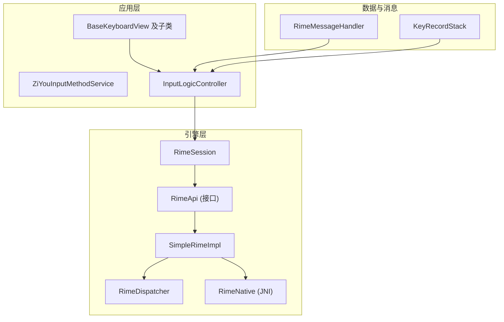
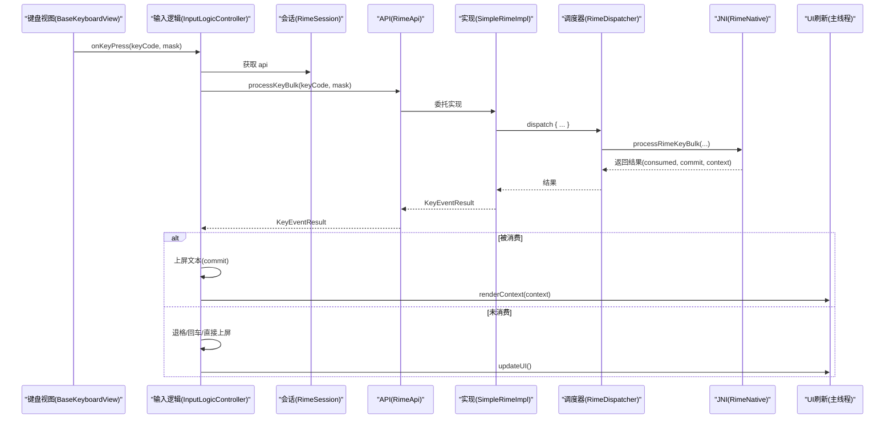
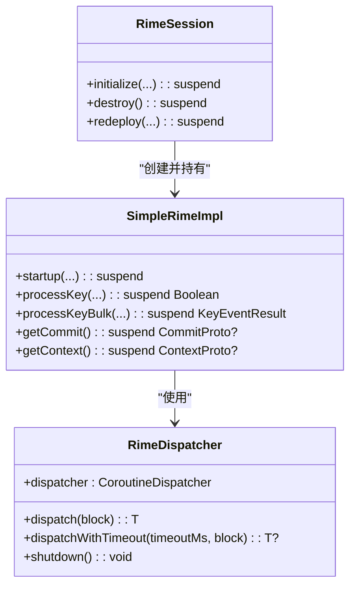
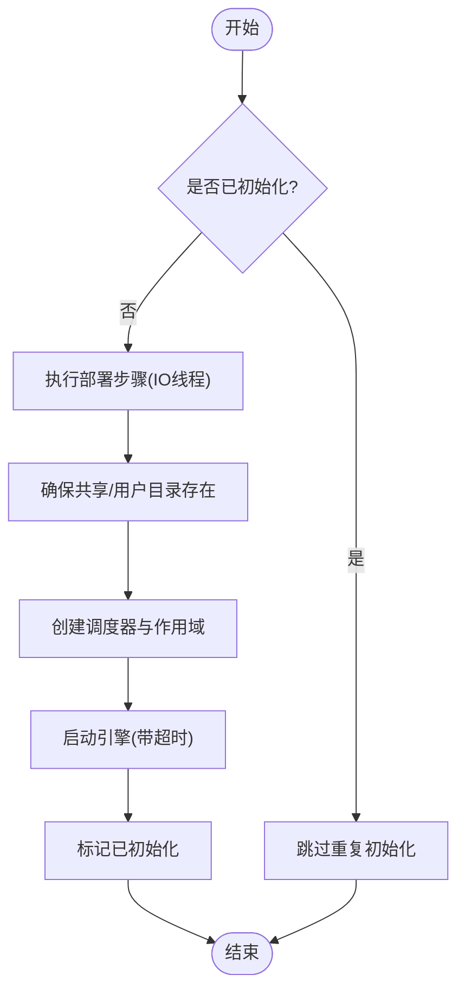
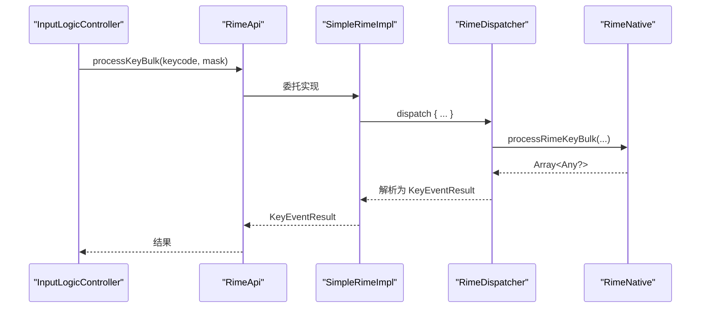
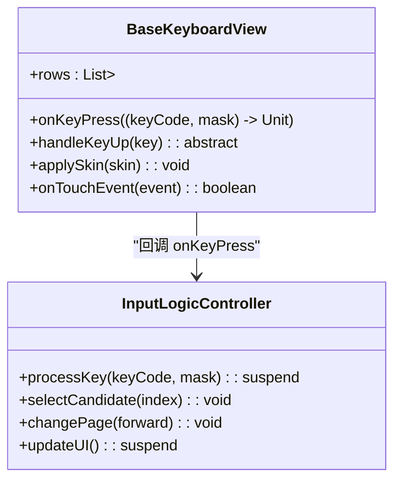
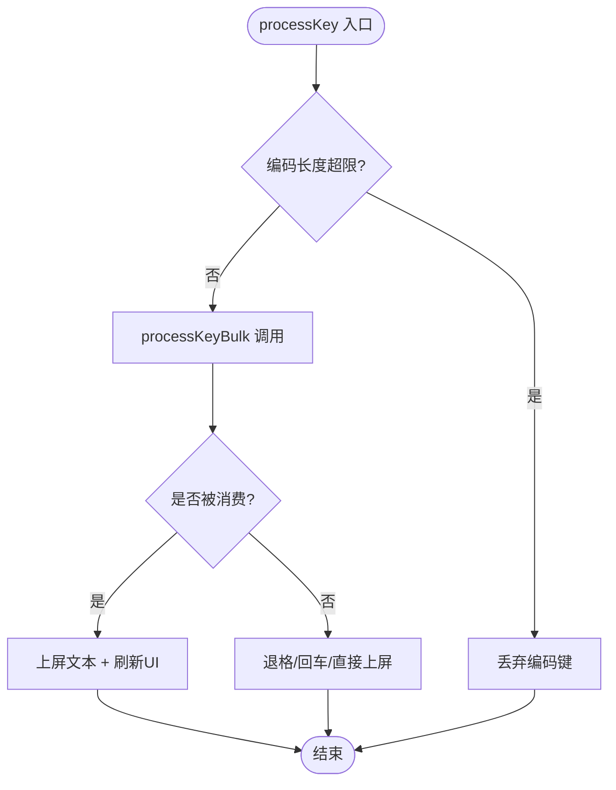
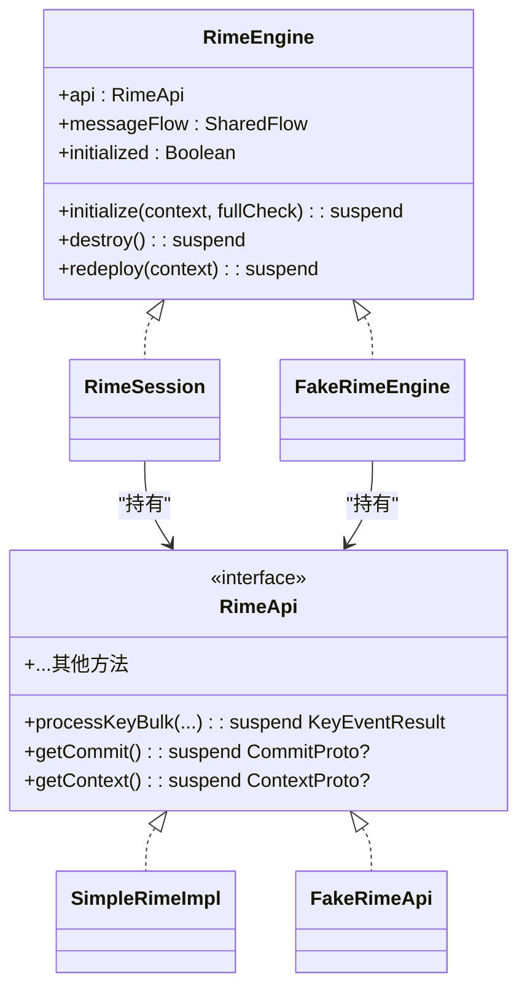
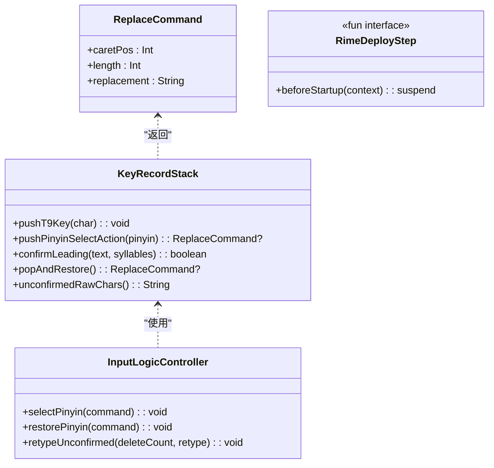
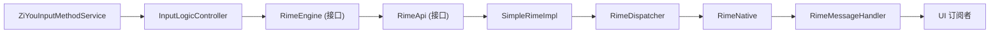

# 设计原则

<cite>
**本文引用的文件**   
- [RimeDispatcher.kt](file://app/src/main/java/com/ziyou/ime/core/RimeDispatcher.kt)
- [SimpleRimeImpl.kt](file://app/src/main/java/com/ziyou/ime/core/SimpleRimeImpl.kt)
- [RimeNative.kt](file://app/src/main/java/com/ziyou/ime/core/RimeNative.kt)
- [RimeApi.kt](file://app/src/main/java/com/ziyou/ime/core/RimeApi.kt)
- [RimeSession.kt](file://app/src/main/java/com/ziyou/ime/daemon/RimeSession.kt)
- [RimeDeployStep.kt](file://app/src/main/java/com/ziyou/ime/daemon/RimeDeployStep.kt)
- [RimeMessage.kt](file://app/src/main/java/com/ziyou/ime/core/RimeMessage.kt)
- [BaseKeyboardView.kt](file://app/src/main/java/com/ziyou/ime/ime/BaseKeyboardView.kt)
- [InputLogicController.kt](file://app/src/main/java/com/ziyou/ime/ime/InputLogicController.kt)
- [KeyRecordStack.kt](file://app/src/main/java/com/ziyou/ime/core/t9/KeyRecordStack.kt)
- [FakeRimeEngine.kt](file://app/src/test/java/com/ziyou/ime/testing/FakeRimeEngine.kt)
</cite>

## 目录
1. [引言](#引言)
2. [项目结构](#项目结构)
3. [核心组件](#核心组件)
4. [架构总览](#架构总览)
5. [详细组件分析](#详细组件分析)
6. [依赖分析](#依赖分析)
7. [性能考量](#性能考量)
8. [故障排查指南](#故障排查指南)
9. [结论](#结论)
10. [附录](#附录)

## 引言
本文件系统化阐述字由输入法的八大核心设计原则，并结合仓库中的实际实现进行说明。这些原则共同构建了一个高性能、可维护、可测试的输入法系统：单线程调度确保 librime 线程安全；RAII 风格的生命周期管理避免资源泄漏；批量 API 降低 JNI 跨界开销；模块条件编译优化体积；视图职责分离提升可维护性；热路径零磁盘 IO 保证流畅度；引擎接口化与依赖注入支持测试扩展；纯逻辑模块化提升可测试性。

## 项目结构
- 核心引擎桥接层位于 core 包，封装 librime 的 JNI 调用与单线程调度。
- 会话管理层位于 daemon 包，负责引擎生命周期、部署步骤与目录管理。
- 输入逻辑控制器位于 ime 包，串联键盘视图、引擎与 UI 刷新。
- T9 状态机位于 core/t9 包，提供九宫格拼音消歧与回退能力。
- 测试替身位于 test 包，用于对输入逻辑与引擎交互进行断言。

**图表来源** 
- [RimeSession.kt:1-226](file://app/src/main/java/com/ziyou/ime/daemon/RimeSession.kt#L1-L226)
- [RimeApi.kt:1-105](file://app/src/main/java/com/ziyou/ime/core/RimeApi.kt#L1-L105)
- [SimpleRimeImpl.kt:1-177](file://app/src/main/java/com/ziyou/ime/core/SimpleRimeImpl.kt#L1-L177)
- [RimeDispatcher.kt:1-91](file://app/src/main/java/com/ziyou/ime/core/RimeDispatcher.kt#L1-L91)
- [RimeNative.kt:1-170](file://app/src/main/java/com/ziyou/ime/core/RimeNative.kt#L1-L170)
- [RimeMessage.kt:1-42](file://app/src/main/java/com/ziyou/ime/core/RimeMessage.kt#L1-L42)
- [InputLogicController.kt:1-531](file://app/src/main/java/com/ziyou/ime/ime/InputLogicController.kt#L1-L531)
- [BaseKeyboardView.kt:1-619](file://app/src/main/java/com/ziyou/ime/ime/BaseKeyboardView.kt#L1-L619)
- [KeyRecordStack.kt:1-310](file://app/src/main/java/com/ziyou/ime/core/t9/KeyRecordStack.kt#L1-L310)

**章节来源**
- [RimeSession.kt:1-226](file://app/src/main/java/com/ziyou/ime/daemon/RimeSession.kt#L1-L226)
- [RimeApi.kt:1-105](file://app/src/main/java/com/ziyou/ime/core/RimeApi.kt#L1-L105)
- [SimpleRimeImpl.kt:1-177](file://app/src/main/java/com/ziyou/ime/core/SimpleRimeImpl.kt#L1-L177)
- [RimeDispatcher.kt:1-91](file://app/src/main/java/com/ziyou/ime/core/RimeDispatcher.kt#L1-L91)
- [RimeNative.kt:1-170](file://app/src/main/java/com/ziyou/ime/core/RimeNative.kt#L1-L170)
- [RimeMessage.kt:1-42](file://app/src/main/java/com/ziyou/ime/core/RimeMessage.kt#L1-L42)
- [InputLogicController.kt:1-531](file://app/src/main/java/com/ziyou/ime/ime/InputLogicController.kt#L1-L531)
- [BaseKeyboardView.kt:1-619](file://app/src/main/java/com/ziyou/ime/ime/BaseKeyboardView.kt#L1-L619)
- [KeyRecordStack.kt:1-310](file://app/src/main/java/com/ziyou/ime/core/t9/KeyRecordStack.kt#L1-L310)

## 核心组件
- RimeDispatcher：单线程调度器，确保所有 librime 调用顺序执行，避免数据竞争。
- SimpleRimeImpl：RimeApi 的具体实现，统一通过调度器派发至专属线程。
- RimeNative：JNI 声明与库加载，集中暴露原生方法。
- RimeSession：会话管理器，编排部署步骤、创建调度器与 API、启动/销毁引擎。
- InputLogicController：输入逻辑中枢，处理按键、候选词、上屏与 UI 刷新。
- KeyRecordStack：T9 状态机，维护数字键与已锁定/确认段的映射关系。
- RimeMessageHandler：消息分发，将 JNI 回调广播给订阅者。

**章节来源**
- [RimeDispatcher.kt:1-91](file://app/src/main/java/com/ziyou/ime/core/RimeDispatcher.kt#L1-L91)
- [SimpleRimeImpl.kt:1-177](file://app/src/main/java/com/ziyou/ime/core/SimpleRimeImpl.kt#L1-L177)
- [RimeNative.kt:1-170](file://app/src/main/java/com/ziyou/ime/core/RimeNative.kt#L1-L170)
- [RimeSession.kt:1-226](file://app/src/main/java/com/ziyou/ime/daemon/RimeSession.kt#L1-L226)
- [InputLogicController.kt:1-531](file://app/src/main/java/com/ziyou/ime/ime/InputLogicController.kt#L1-L531)
- [KeyRecordStack.kt:1-310](file://app/src/main/java/com/ziyou/ime/core/t9/KeyRecordStack.kt#L1-L310)
- [RimeMessage.kt:1-42](file://app/src/main/java/com/ziyou/ime/core/RimeMessage.kt#L1-L42)

## 架构总览
下图展示从键盘触摸到引擎处理再到 UI 更新的完整流程，体现“单线程调度 + 批量 API + 零 IO 热路径”的设计协同。

**图表来源** 
- [BaseKeyboardView.kt:1-619](file://app/src/main/java/com/ziyou/ime/ime/BaseKeyboardView.kt#L1-L619)
- [InputLogicController.kt:1-531](file://app/src/main/java/com/ziyou/ime/ime/InputLogicController.kt#L1-L531)
- [RimeSession.kt:1-226](file://app/src/main/java/com/ziyou/ime/daemon/RimeSession.kt#L1-L226)
- [RimeApi.kt:1-105](file://app/src/main/java/com/ziyou/ime/core/RimeApi.kt#L1-L105)
- [SimpleRimeImpl.kt:1-177](file://app/src/main/java/com/ziyou/ime/core/SimpleRimeImpl.kt#L1-L177)
- [RimeDispatcher.kt:1-91](file://app/src/main/java/com/ziyou/ime/core/RimeDispatcher.kt#L1-L91)
- [RimeNative.kt:1-170](file://app/src/main/java/com/ziyou/ime/core/RimeNative.kt#L1-L170)

## 详细组件分析

### 原则一：单线程 Dispatcher 确保 librime 线程安全
- 设计动机：librime 非线程安全，必须保证所有调用在同一线程串行执行。
- 实现要点：
  - RimeDispatcher 使用单线程 Executor 与协程调度器，所有操作通过 withContext(dispatcher) 执行。
  - SimpleRimeImpl 将所有 API 调用包装在 dispatcher.dispatch 中。
  - RimeSession 初始化时创建新的调度器并绑定协程作用域，销毁时关闭释放。
- 性能考量：
  - 单线程避免了锁竞争与上下文切换，但需防止阻塞任务（IO）进入该线程。
  - 超时保护与异常捕获保障稳定性。

**图表来源** 
- [RimeDispatcher.kt:1-91](file://app/src/main/java/com/ziyou/ime/core/RimeDispatcher.kt#L1-L91)
- [SimpleRimeImpl.kt:1-177](file://app/src/main/java/com/ziyou/ime/core/SimpleRimeImpl.kt#L1-L177)
- [RimeSession.kt:1-226](file://app/src/main/java/com/ziyou/ime/daemon/RimeSession.kt#L1-L226)

**章节来源**
- [RimeDispatcher.kt:1-91](file://app/src/main/java/com/ziyou/ime/core/RimeDispatcher.kt#L1-L91)
- [SimpleRimeImpl.kt:1-177](file://app/src/main/java/com/ziyou/ime/core/SimpleRimeImpl.kt#L1-L177)
- [RimeSession.kt:1-226](file://app/src/main/java/com/ziyou/ime/daemon/RimeSession.kt#L1-L226)

### 原则二：RAII 资源管理避免内存泄漏
- 设计动机：JNI 与 native 堆资源需在正确时机释放，避免泄漏与 ANR。
- 实现要点：
  - RimeSession.initialize/redeploy/destroy 以互斥锁串行化，避免重复初始化与并发销毁。
  - SimpleRimeImpl.startup/shutdown 明确调用 native 生命周期。
  - RimeNative.trimNativeHeap 主动归还空闲页，减少常驻占用。
- 性能考量：
  - 启动带超时保护，避免长时间阻塞。
  - 销毁时取消协程作用域并关闭调度器，确保资源回收。

**图表来源** 
- [RimeSession.kt:1-226](file://app/src/main/java/com/ziyou/ime/daemon/RimeSession.kt#L1-L226)
- [RimeNative.kt:1-170](file://app/src/main/java/com/ziyou/ime/core/RimeNative.kt#L1-L170)

**章节来源**
- [RimeSession.kt:1-226](file://app/src/main/java/com/ziyou/ime/daemon/RimeSession.kt#L1-L226)
- [RimeNative.kt:1-170](file://app/src/main/java/com/ziyou/ime/core/RimeNative.kt#L1-L170)

### 原则三：批量 API 调用减少 JNI 跨界开销
- 设计动机：每次 JNI 跨界都有显著成本，应合并关键路径上的多次调用。
- 实现要点：
  - RimeApi.processKeyBulk 默认组合 processKey + getCommit + getContext，生产实现由 SimpleRimeImpl 单次 JNI 调用完成。
  - InputLogicController 的热路径优先使用 processKeyBulk，减少线程往返与 JNI 次数。
- 性能考量：
  - 批量返回包含 consumed/commit/context，避免多余查询。
  - 慢按键告警阈值便于发现退化。

**图表来源** 
- [RimeApi.kt:1-105](file://app/src/main/java/com/ziyou/ime/core/RimeApi.kt#L1-L105)
- [SimpleRimeImpl.kt:1-177](file://app/src/main/java/com/ziyou/ime/core/SimpleRimeImpl.kt#L1-L177)
- [RimeNative.kt:1-170](file://app/src/main/java/com/ziyou/ime/core/RimeNative.kt#L1-L170)
- [InputLogicController.kt:1-531](file://app/src/main/java/com/ziyou/ime/ime/InputLogicController.kt#L1-L531)

**章节来源**
- [RimeApi.kt:1-105](file://app/src/main/java/com/ziyou/ime/core/RimeApi.kt#L1-L105)
- [SimpleRimeImpl.kt:1-177](file://app/src/main/java/com/ziyou/ime/core/SimpleRimeImpl.kt#L1-L177)
- [RimeNative.kt:1-170](file://app/src/main/java/com/ziyou/ime/core/RimeNative.kt#L1-L170)
- [InputLogicController.kt:1-531](file://app/src/main/java/com/ziyou/ime/ime/InputLogicController.kt#L1-L531)

### 原则四：模块条件编译优化二进制体积
- 设计动机：按需启用功能模块，减小 APK 体积与启动时间。
- 实现要点：
  - 通过 Gradle 变体与 CMake 配置选择性编译插件与工具链（如 OpenCC、LevelDB）。
  - 在运行时通过配置开关控制可选特性（如预测、简繁转换）。
- 性能考量：
  - 减少不必要的依赖与代码路径，降低冷启动耗时与内存占用。

[本节为概念性说明，不直接分析具体文件]

### 原则五：视图职责分离提升可维护性
- 设计动机：键盘视图仅负责绘制与触摸，输入逻辑与引擎交互下沉到控制器。
- 实现要点：
  - BaseKeyboardView 抽象通用布局、绘制、触摸与皮肤能力，子类只需定义 rows 与 handleKeyUp。
  - InputLogicController 处理按键、候选词、上屏与 UI 刷新，解耦 Service 与视图。
- 性能考量：
  - 视图层只做轻量渲染，复杂逻辑不在 UI 线程执行。

**图表来源** 
- [BaseKeyboardView.kt:1-619](file://app/src/main/java/com/ziyou/ime/ime/BaseKeyboardView.kt#L1-L619)
- [InputLogicController.kt:1-531](file://app/src/main/java/com/ziyou/ime/ime/InputLogicController.kt#L1-L531)

**章节来源**
- [BaseKeyboardView.kt:1-619](file://app/src/main/java/com/ziyou/ime/ime/BaseKeyboardView.kt#L1-L619)
- [InputLogicController.kt:1-531](file://app/src/main/java/com/ziyou/ime/ime/InputLogicController.kt#L1-L531)

### 原则六：热路径零磁盘 IO 保证输入流畅度
- 设计动机：输入热路径不应触发磁盘 IO，避免卡顿与掉帧。
- 实现要点：
  - InputLogicController 的 processKey 走内存与引擎计算，无文件读写。
  - 部署与词典更新在 IO 线程执行，且仅在 initialize/redeploy 阶段。
  - RimeSession.ensureDirectories 与 deploySteps 在 IO 线程执行，避免阻塞主线程。
- 性能考量：
  - 编码长度上限防护避免组合爆炸导致的长尾延迟。
  - 慢按键告警帮助定位退化点。

**图表来源** 
- [InputLogicController.kt:1-531](file://app/src/main/java/com/ziyou/ime/ime/InputLogicController.kt#L1-L531)
- [RimeSession.kt:1-226](file://app/src/main/java/com/ziyou/ime/daemon/RimeSession.kt#L1-L226)

**章节来源**
- [InputLogicController.kt:1-531](file://app/src/main/java/com/ziyou/ime/ime/InputLogicController.kt#L1-L531)
- [RimeSession.kt:1-226](file://app/src/main/java/com/ziyou/ime/daemon/RimeSession.kt#L1-L226)

### 原则七：引擎接口化 + 依赖注入支持测试扩展
- 设计动机：通过接口隔离引擎实现，便于替换与测试。
- 实现要点：
  - RimeApi 定义所有引擎操作，SimpleRimeImpl 为生产实现，FakeRimeApi 为测试替身。
  - RimeSession 作为组合根装配部署步骤与 API，对外暴露 RimeEngine 接口。
  - InputLogicController 依赖 RimeEngine 接口，可注入 FakeRimeEngine 进行单元测试。
- 性能考量：
  - 接口抽象不引入额外开销，测试替身可快速响应。

**图表来源** 
- [RimeApi.kt:1-105](file://app/src/main/java/com/ziyou/ime/core/RimeApi.kt#L1-L105)
- [SimpleRimeImpl.kt:1-177](file://app/src/main/java/com/ziyou/ime/core/SimpleRimeImpl.kt#L1-L177)
- [RimeSession.kt:1-226](file://app/src/main/java/com/ziyou/ime/daemon/RimeSession.kt#L1-L226)
- [FakeRimeEngine.kt:1-203](file://app/src/test/java/com/ziyou/ime/testing/FakeRimeEngine.kt#L1-L203)

**章节来源**
- [RimeApi.kt:1-105](file://app/src/main/java/com/ziyou/ime/core/RimeApi.kt#L1-L105)
- [SimpleRimeImpl.kt:1-177](file://app/src/main/java/com/ziyou/ime/core/SimpleRimeImpl.kt#L1-L177)
- [RimeSession.kt:1-226](file://app/src/main/java/com/ziyou/ime/daemon/RimeSession.kt#L1-L226)
- [FakeRimeEngine.kt:1-203](file://app/src/test/java/com/ziyou/ime/testing/FakeRimeEngine.kt#L1-L203)

### 原则八：纯逻辑模块化提升可测试性
- 设计动机：将业务逻辑与框架耦合剥离，形成可独立测试的模块。
- 实现要点：
  - KeyRecordStack 为纯数据结构，不依赖 Android Framework，专注 T9 状态管理。
  - InputLogicController 通过 Callbacks 接口与外部交互，内部逻辑可被 FakeRimeEngine 驱动。
  - 部署步骤抽象为 RimeDeployStep，由组合根装配，daemon 层不再直接依赖业务模块。
- 性能考量：
  - 纯逻辑模块无 I/O 与 UI 依赖，运行高效且易于压测。

**图表来源** 
- [KeyRecordStack.kt:1-310](file://app/src/main/java/com/ziyou/ime/core/t9/KeyRecordStack.kt#L1-L310)
- [InputLogicController.kt:1-531](file://app/src/main/java/com/ziyou/ime/ime/InputLogicController.kt#L1-L531)
- [RimeDeployStep.kt:1-20](file://app/src/main/java/com/ziyou/ime/daemon/RimeDeployStep.kt#L1-L20)

**章节来源**
- [KeyRecordStack.kt:1-310](file://app/src/main/java/com/ziyou/ime/core/t9/KeyRecordStack.kt#L1-L310)
- [InputLogicController.kt:1-531](file://app/src/main/java/com/ziyou/ime/ime/InputLogicController.kt#L1-L531)
- [RimeDeployStep.kt:1-20](file://app/src/main/java/com/ziyou/ime/daemon/RimeDeployStep.kt#L1-L20)

## 依赖分析
- 单向依赖：IME 服务 → 输入逻辑控制器 → 引擎接口 → 具体实现 → 调度器 → JNI。
- 消息流：JNI 回调 → RimeMessageHandler → UI 订阅者。
- 部署步骤：组合根装配 RimeDeployStep，RimeSession 按序执行。

**图表来源** 
- [InputLogicController.kt:1-531](file://app/src/main/java/com/ziyou/ime/ime/InputLogicController.kt#L1-L531)
- [RimeSession.kt:1-226](file://app/src/main/java/com/ziyou/ime/daemon/RimeSession.kt#L1-L226)
- [RimeApi.kt:1-105](file://app/src/main/java/com/ziyou/ime/core/RimeApi.kt#L1-L105)
- [SimpleRimeImpl.kt:1-177](file://app/src/main/java/com/ziyou/ime/core/SimpleRimeImpl.kt#L1-L177)
- [RimeDispatcher.kt:1-91](file://app/src/main/java/com/ziyou/ime/core/RimeDispatcher.kt#L1-L91)
- [RimeNative.kt:1-170](file://app/src/main/java/com/ziyou/ime/core/RimeNative.kt#L1-L170)
- [RimeMessage.kt:1-42](file://app/src/main/java/com/ziyou/ime/core/RimeMessage.kt#L1-L42)

**章节来源**
- [InputLogicController.kt:1-531](file://app/src/main/java/com/ziyou/ime/ime/InputLogicController.kt#L1-L531)
- [RimeSession.kt:1-226](file://app/src/main/java/com/ziyou/ime/daemon/RimeSession.kt#L1-L226)
- [RimeApi.kt:1-105](file://app/src/main/java/com/ziyou/ime/core/RimeApi.kt#L1-L105)
- [SimpleRimeImpl.kt:1-177](file://app/src/main/java/com/ziyou/ime/core/SimpleRimeImpl.kt#L1-L177)
- [RimeDispatcher.kt:1-91](file://app/src/main/java/com/ziyou/ime/core/RimeDispatcher.kt#L1-L91)
- [RimeNative.kt:1-170](file://app/src/main/java/com/ziyou/ime/core/RimeNative.kt#L1-L170)
- [RimeMessage.kt:1-42](file://app/src/main/java/com/ziyou/ime/core/RimeMessage.kt#L1-L42)

## 性能考量
- 单线程调度避免锁竞争，但需严格区分 IO 与 CPU 密集任务，IO 放 IO 线程。
- 批量 API 减少 JNI 跨界与线程切换，显著提升热路径吞吐。
- 零 IO 热路径确保输入低延迟，部署与词典更新在后台执行。
- 编码长度上限与慢按键告警帮助识别退化点，便于持续优化。
- 条件编译减少二进制体积与冷启动时间。

[本节为通用指导，不直接分析具体文件]

## 故障排查指南
- 引擎未加载：检查 ABI 匹配与 .so 文件是否存在，查看 isLoaded 标志。
- 启动超时：检查词典文件完整性或降低 fullCheck 参数。
- 按键错乱：确认 inputMutex 串行化与 processKeyBulk 使用是否正确。
- 候选错位：检查 KeyRecordStack 的 confirmLeading 与 popAndRestore 逻辑。
- 消息丢失：确认 RimeMessageHandler 的 SharedFlow 订阅与 replay 设置。

**章节来源**
- [RimeNative.kt:1-170](file://app/src/main/java/com/ziyou/ime/core/RimeNative.kt#L1-L170)
- [RimeSession.kt:1-226](file://app/src/main/java/com/ziyou/ime/daemon/RimeSession.kt#L1-L226)
- [InputLogicController.kt:1-531](file://app/src/main/java/com/ziyou/ime/ime/InputLogicController.kt#L1-L531)
- [KeyRecordStack.kt:1-310](file://app/src/main/java/com/ziyou/ime/core/t9/KeyRecordStack.kt#L1-L310)
- [RimeMessage.kt:1-42](file://app/src/main/java/com/ziyou/ime/core/RimeMessage.kt#L1-L42)

## 结论
八大设计原则在字由输入法中相互支撑：单线程调度保障线程安全，RAII 管理确保资源稳定，批量 API 提升吞吐，条件编译优化体积，视图分离增强可维护性，零 IO 热路径保证流畅，接口化与 DI 支持测试，纯逻辑模块提升可测性。这些原则共同构建了一个高性能、可维护、可测试的输入法系统。

[本节为总结，不直接分析具体文件]

## 附录
- 术语表：
  - librime：Rime 输入法引擎核心库。
  - JNI：Java Native Interface，Java 与原生代码交互接口。
  - RAII：资源获取即初始化，确保资源生命周期管理。
  - DI：依赖注入，通过容器装配组件。

[本节为补充信息，不直接分析具体文件]