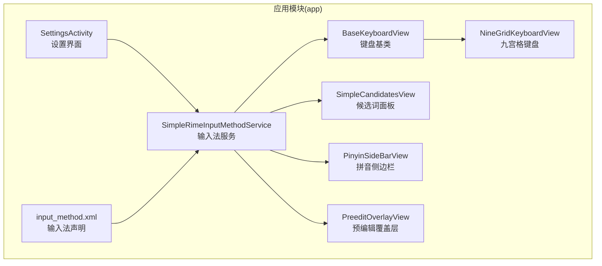
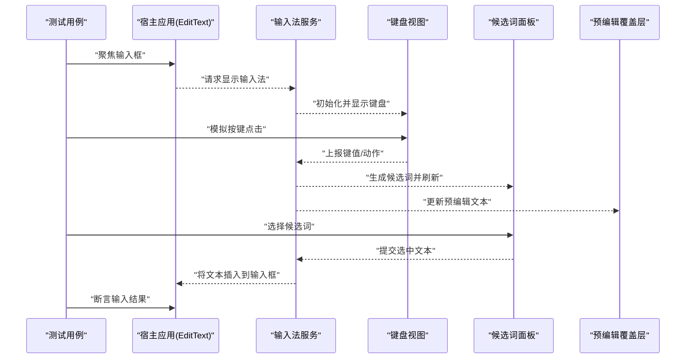
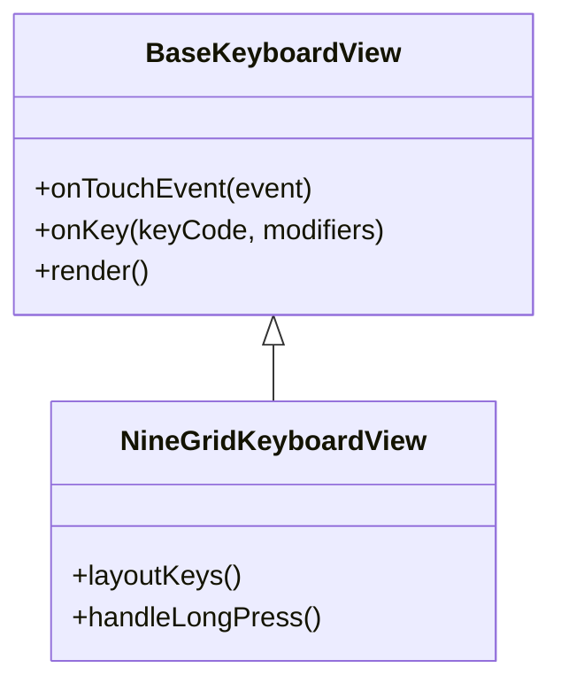
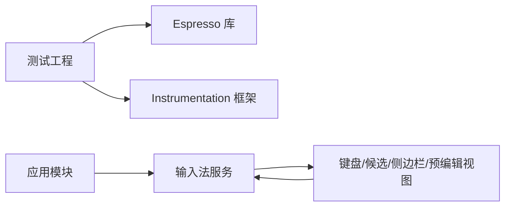

# UI 测试

<cite>
**本文引用的文件**   
- [app/src/main/java/com/ziyou/ime/ime/SimpleRimeInputMethodService.kt](file://app/src/main/java/com/ziyou/ime/ime/SimpleRimeInputMethodService.kt)
- [app/src/main/java/com/ziyou/ime/ime/BaseKeyboardView.kt](file://app/src/main/java/com/ziyou/ime/ime/BaseKeyboardView.kt)
- [app/src/main/java/com/ziyou/ime/ime/NineGridKeyboardView.kt](file://app/src/main/java/com/ziyou/ime/ime/NineGridKeyboardView.kt)
- [app/src/main/java/com/ziyou/ime/ime/SimpleCandidatesView.kt](file://app/src/main/java/com/ziyou/ime/ime/SimpleCandidatesView.kt)
- [app/src/main/java/com/ziyou/ime/ime/PinyinSideBarView.kt](file://app/src/main/java/com/ziyou/ime/ime/PinyinSideBarView.kt)
- [app/src/main/java/com/ziyou/ime/ime/PreeditOverlayView.kt](file://app/src/main/java/com/ziyou/ime/ime/PreeditOverlayView.kt)
- [app/src/main/java/com/ziyou/ime/ui/SettingsActivity.kt](file://app/src/main/java/com/ziyou/ime/ui/SettingsActivity.kt)
- [app/src/main/res/xml/input_method.xml](file://app/src/main/res/xml/input_method.xml)
- [app/build.gradle.kts](file://app/build.gradle.kts)
- [build.gradle.kts](file://build.gradle.kts)
- [settings.gradle.kts](file://settings.gradle.kts)
- [gradle.properties](file://gradle.properties)
- [ARCHITECTURE.md](file://ARCHITECTURE.md)
</cite>

## 目录
1. [简介](#简介)
2. [项目结构](#项目结构)
3. [核心组件](#核心组件)
4. [架构总览](#架构总览)
5. [详细组件分析](#详细组件分析)
6. [依赖分析](#依赖分析)
7. [性能考虑](#性能考虑)
8. [故障排查指南](#故障排查指南)
9. [结论](#结论)
10. [附录](#附录)

## 简介
本文件面向输入法应用的 UI 自动化测试，重点围绕 Espresso 与 Instrumentation 测试框架，为键盘视图交互、候选词选择、设置界面操作等场景提供可执行的测试策略。文档涵盖：
- Espresso 安装与配置要点
- 输入法服务（IME）的 UI 测试方法与注意事项
- 模拟用户输入事件与验证界面状态变化
- 异步操作与动画效果的测试处理
- 九宫格键盘、侧边栏滚动、预编辑文本显示等核心功能的测试示例思路
- 测试数据管理与环境配置最佳实践
- 性能优化技巧与常见问题解决方案

## 项目结构
该输入法应用采用模块化组织，UI 相关的关键类集中在 app 模块中：
- 输入法服务与键盘视图：位于 ime 包下，包含基础键盘、九宫格键盘、候选词面板、拼音侧边栏、预编辑覆盖层等
- 设置界面：位于 ui 包下的 SettingsActivity
- 资源与清单：XML 定义输入法服务入口与能力

图表来源
- [app/src/main/java/com/ziyou/ime/ime/SimpleRimeInputMethodService.kt](file://app/src/main/java/com/ziyou/ime/ime/SimpleRimeInputMethodService.kt)
- [app/src/main/java/com/ziyou/ime/ime/BaseKeyboardView.kt](file://app/src/main/java/com/ziyou/ime/ime/BaseKeyboardView.kt)
- [app/src/main/java/com/ziyou/ime/ime/NineGridKeyboardView.kt](file://app/src/main/java/com/ziyou/ime/ime/NineGridKeyboardView.kt)
- [app/src/main/java/com/ziyou/ime/ime/SimpleCandidatesView.kt](file://app/src/main/java/com/ziyou/ime/ime/SimpleCandidatesView.kt)
- [app/src/main/java/com/ziyou/ime/ime/PinyinSideBarView.kt](file://app/src/main/java/com/ziyou/ime/ime/PinyinSideBarView.kt)
- [app/src/main/java/com/ziyou/ime/ime/PreeditOverlayView.kt](file://app/src/main/java/com/ziyou/ime/ime/PreeditOverlayView.kt)
- [app/src/main/res/xml/input_method.xml](file://app/src/main/res/xml/input_method.xml)

章节来源
- [app/build.gradle.kts](file://app/build.gradle.kts)
- [build.gradle.kts](file://build.gradle.kts)
- [settings.gradle.kts](file://settings.gradle.kts)
- [gradle.properties](file://gradle.properties)
- [ARCHITECTURE.md](file://ARCHITECTURE.md)

## 核心组件
- 输入法服务 SimpleRimeInputMethodService：作为系统输入法入口，负责生命周期管理、与宿主应用通信、键盘与候选面板的展示控制
- 键盘视图 BaseKeyboardView/NineGridKeyboardView：实现按键布局与点击事件分发；九宫格键盘用于数字/符号快速输入
- 候选词面板 SimpleCandidatesView：展示翻译结果并支持横向滚动与选择
- 拼音侧边栏 PinyinSideBarView：提供拼音字母索引与滑动定位
- 预编辑覆盖层 PreeditOverlayView：显示当前正在编辑的文本，随输入动态更新
- 设置界面 SettingsActivity：提供主题、布局、引擎等配置项

章节来源
- [app/src/main/java/com/ziyou/ime/ime/SimpleRimeInputMethodService.kt](file://app/src/main/java/com/ziyou/ime/ime/SimpleRimeInputMethodService.kt)
- [app/src/main/java/com/ziyou/ime/ime/BaseKeyboardView.kt](file://app/src/main/java/com/ziyou/ime/ime/BaseKeyboardView.kt)
- [app/src/main/java/com/ziyou/ime/ime/NineGridKeyboardView.kt](file://app/src/main/java/com/ziyou/ime/ime/NineGridKeyboardView.kt)
- [app/src/main/java/com/ziyou/ime/ime/SimpleCandidatesView.kt](file://app/src/main/java/com/ziyou/ime/ime/SimpleCandidatesView.kt)
- [app/src/main/java/com/ziyou/ime/ime/PinyinSideBarView.kt](file://app/src/main/java/com/ziyou/ime/ime/PinyinSideBarView.kt)
- [app/src/main/java/com/ziyou/ime/ime/PreeditOverlayView.kt](file://app/src/main/java/com/ziyou/ime/ime/PreeditOverlayView.kt)
- [app/src/main/java/com/ziyou/ime/ui/SettingsActivity.kt](file://app/src/main/java/com/ziyou/ime/ui/SettingsActivity.kt)

## 架构总览
输入法 UI 测试的核心在于通过 Instrumentation 启动系统输入法流程，并在宿主应用中触发输入框焦点，从而让输入法窗口可见。Espresso 在宿主应用进程内对可见 UI 进行断言与交互。

图表来源
- [app/src/main/java/com/ziyou/ime/ime/SimpleRimeInputMethodService.kt](file://app/src/main/java/com/ziyou/ime/ime/SimpleRimeInputMethodService.kt)
- [app/src/main/java/com/ziyou/ime/ime/BaseKeyboardView.kt](file://app/src/main/java/com/ziyou/ime/ime/BaseKeyboardView.kt)
- [app/src/main/java/com/ziyou/ime/ime/SimpleCandidatesView.kt](file://app/src/main/java/com/ziyou/ime/ime/SimpleCandidatesView.kt)
- [app/src/main/java/com/ziyou/ime/ime/PreeditOverlayView.kt](file://app/src/main/java/com/ziyou/ime/ime/PreeditOverlayView.kt)

## 详细组件分析

### 输入法服务与 UI 生命周期
- 输入法服务负责创建和销毁键盘视图、候选面板与预编辑覆盖层，并与宿主应用交换文本
- 测试需确保输入法已启用且被设置为默认输入法，否则无法弹出键盘

章节来源
- [app/src/main/java/com/ziyou/ime/ime/SimpleRimeInputMethodService.kt](file://app/src/main/java/com/ziyou/ime/ime/SimpleRimeInputMethodService.kt)
- [app/src/main/res/xml/input_method.xml](file://app/src/main/res/xml/input_method.xml)

### 键盘视图与九宫格交互
- BaseKeyboardView 提供通用按键绘制与事件分发逻辑
- NineGridKeyboardView 扩展九宫格布局，适合数字/符号快速输入
- 测试可通过 Espresso 对按键进行点击或长按，验证键值上报与 UI 反馈

图表来源
- [app/src/main/java/com/ziyou/ime/ime/BaseKeyboardView.kt](file://app/src/main/java/com/ziyou/ime/ime/BaseKeyboardView.kt)
- [app/src/main/java/com/ziyou/ime/ime/NineGridKeyboardView.kt](file://app/src/main/java/com/ziyou/ime/ime/NineGridKeyboardView.kt)

章节来源
- [app/src/main/java/com/ziyou/ime/ime/BaseKeyboardView.kt](file://app/src/main/java/com/ziyou/ime/ime/BaseKeyboardView.kt)
- [app/src/main/java/com/ziyou/ime/ime/NineGridKeyboardView.kt](file://app/src/main/java/com/ziyou/ime/ime/NineGridKeyboardView.kt)

### 候选词面板与选择
- SimpleCandidatesView 展示候选列表，支持横向滚动与点击选择
- 测试应等待候选列表渲染完成后再进行选择，避免竞态条件

章节来源
- [app/src/main/java/com/ziyou/ime/ime/SimpleCandidatesView.kt](file://app/src/main/java/com/ziyou/ime/ime/SimpleCandidatesView.kt)

### 拼音侧边栏与滚动定位
- PinyinSideBarView 提供字母索引与滑动定位功能
- 测试需确保侧边栏可见并可滚动，使用 Espresso 的 scrollable 匹配器进行交互

章节来源
- [app/src/main/java/com/ziyou/ime/ime/PinyinSideBarView.kt](file://app/src/main/java/com/ziyou/ime/ime/PinyinSideBarView.kt)

### 预编辑文本显示
- PreeditOverlayView 显示当前编辑中的文本，随输入动态更新
- 测试应断言预编辑文本与输入序列一致，注意异步更新时机

章节来源
- [app/src/main/java/com/ziyou/ime/ime/PreeditOverlayView.kt](file://app/src/main/java/com/ziyou/ime/ime/PreeditOverlayView.kt)

### 设置界面操作
- SettingsActivity 提供主题、布局、引擎等配置项
- 测试可进入设置页面，修改选项后返回输入法界面，验证配置生效

章节来源
- [app/src/main/java/com/ziyou/ime/ui/SettingsActivity.kt](file://app/src/main/java/com/ziyou/ime/ui/SettingsActivity.kt)

## 依赖分析
- 输入法服务依赖各视图组件进行 UI 渲染与事件处理
- 测试依赖 Instrumentation 与 Espresso 在宿主应用进程中执行
- Gradle 配置需引入 AndroidX Test、Espresso 库，并确保目标设备/模拟器满足要求

图表来源
- [app/build.gradle.kts](file://app/build.gradle.kts)
- [build.gradle.kts](file://build.gradle.kts)
- [settings.gradle.kts](file://settings.gradle.kts)
- [gradle.properties](file://gradle.properties)

章节来源
- [app/build.gradle.kts](file://app/build.gradle.kts)
- [build.gradle.kts](file://build.gradle.kts)
- [settings.gradle.kts](file://settings.gradle.kts)
- [gradle.properties](file://gradle.properties)

## 性能考虑
- 减少不必要的 UI 刷新：在批量输入时合并更新，避免频繁重绘
- 合理设置超时与等待：使用稳定等待策略而非固定 sleep
- 降低动画开销：在测试环境中禁用或缩短动画，提升稳定性
- 并行化测试：按功能模块拆分用例，利用多设备/多实例并行执行

[本节为通用指导，不直接分析具体文件]

## 故障排查指南
- 输入法未启用或未被设为默认：检查系统设置与清单声明
- 键盘不可见：确认 EditText 已获取焦点且输入法窗口允许显示
- 候选词不出现：检查输入序列与翻译逻辑，确保候选面板渲染完成
- 侧边栏滚动失败：确认滚动容器正确且内容足够长
- 预编辑文本不同步：增加等待或使用观察者回调确保更新完成
- 测试不稳定：统一等待策略，避免竞态条件；必要时添加重试机制

章节来源
- [app/src/main/java/com/ziyou/ime/ime/SimpleRimeInputMethodService.kt](file://app/src/main/java/com/ziyou/ime/ime/SimpleRimeInputMethodService.kt)
- [app/src/main/java/com/ziyou/ime/ime/SimpleCandidatesView.kt](file://app/src/main/java/com/ziyou/ime/ime/SimpleCandidatesView.kt)
- [app/src/main/java/com/ziyou/ime/ime/PinyinSideBarView.kt](file://app/src/main/java/com/ziyou/ime/ime/PinyinSideBarView.kt)
- [app/src/main/java/com/ziyou/ime/ime/PreeditOverlayView.kt](file://app/src/main/java/com/ziyou/ime/ime/PreeditOverlayView.kt)

## 结论
通过对输入法服务与关键 UI 组件的分析，结合 Espresso 与 Instrumentation 的最佳实践，可以为九宫格键盘、候选词选择、侧边栏滚动、预编辑文本显示等核心功能建立稳定可靠的 UI 自动化测试。遵循统一的等待策略、合理的测试数据管理与环境配置，能够显著提升测试的稳定性与执行效率。

[本节为总结性内容，不直接分析具体文件]

## 附录

### Espresso 安装与配置要点
- 在 app/build.gradle.kts 中引入 AndroidX Test 与 Espresso 依赖
- 确保目标 SDK 与编译 SDK 版本兼容
- 在 gradle.properties 中配置必要的测试参数（如并行度、JVM 参数）

章节来源
- [app/build.gradle.kts](file://app/build.gradle.kts)
- [gradle.properties](file://gradle.properties)

### Instrumentation 测试的设置与运行
- 使用 AndroidJUnitRunner 作为测试运行器
- 通过 Instrumentation 启动宿主应用并聚焦输入框以触发输入法
- 在测试前确保输入法已启用并被设为默认

章节来源
- [app/src/main/res/xml/input_method.xml](file://app/src/main/res/xml/input_method.xml)

### 模拟用户输入事件与验证界面状态
- 使用 Espresso 对键盘按键进行点击/长按，验证键值上报
- 对候选词面板进行点击选择，断言输入框文本更新
- 对侧边栏进行滚动定位，验证候选列表变化
- 对预编辑覆盖层进行文本断言，确保与输入序列一致

章节来源
- [app/src/main/java/com/ziyou/ime/ime/NineGridKeyboardView.kt](file://app/src/main/java/com/ziyou/ime/ime/NineGridKeyboardView.kt)
- [app/src/main/java/com/ziyou/ime/ime/SimpleCandidatesView.kt](file://app/src/main/java/com/ziyou/ime/ime/SimpleCandidatesView.kt)
- [app/src/main/java/com/ziyou/ime/ime/PinyinSideBarView.kt](file://app/src/main/java/com/ziyou/ime/ime/PinyinSideBarView.kt)
- [app/src/main/java/com/ziyou/ime/ime/PreeditOverlayView.kt](file://app/src/main/java/com/ziyou/ime/ime/PreeditOverlayView.kt)

### 异步操作与动画效果测试
- 使用 IdlingResource 或稳定等待策略处理异步更新
- 在测试环境中禁用或缩短动画以提升稳定性
- 对候选词渲染、预编辑文本更新等异步过程进行同步断言

章节来源
- [app/src/main/java/com/ziyou/ime/ime/SimpleCandidatesView.kt](file://app/src/main/java/com/ziyou/ime/ime/SimpleCandidatesView.kt)
- [app/src/main/java/com/ziyou/ime/ime/PreeditOverlayView.kt](file://app/src/main/java/com/ziyou/ime/ime/PreeditOverlayView.kt)

### 测试数据管理与环境配置
- 使用固定输入序列与预期输出，保证可重复性
- 在测试前重置输入法状态与配置，避免污染
- 针对不同分辨率与语言环境准备测试数据

章节来源
- [app/src/main/java/com/ziyou/ime/ui/SettingsActivity.kt](file://app/src/main/java/com/ziyou/ime/ui/SettingsActivity.kt)

### 常见测试场景示例思路
- 九宫格键盘输入：点击数字键，断言预编辑文本与输入框更新
- 侧边栏滚动定位：滑动字母索引，验证候选列表变化
- 候选词选择：点击候选项，断言输入框最终文本
- 设置界面操作：修改主题或布局，返回输入法验证生效

章节来源
- [app/src/main/java/com/ziyou/ime/ime/NineGridKeyboardView.kt](file://app/src/main/java/com/ziyou/ime/ime/NineGridKeyboardView.kt)
- [app/src/main/java/com/ziyou/ime/ime/PinyinSideBarView.kt](file://app/src/main/java/com/ziyou/ime/ime/PinyinSideBarView.kt)
- [app/src/main/java/com/ziyou/ime/ime/SimpleCandidatesView.kt](file://app/src/main/java/com/ziyou/ime/ime/SimpleCandidatesView.kt)
- [app/src/main/java/com/ziyou/ime/ui/SettingsActivity.kt](file://app/src/main/java/com/ziyou/ime/ui/SettingsActivity.kt)