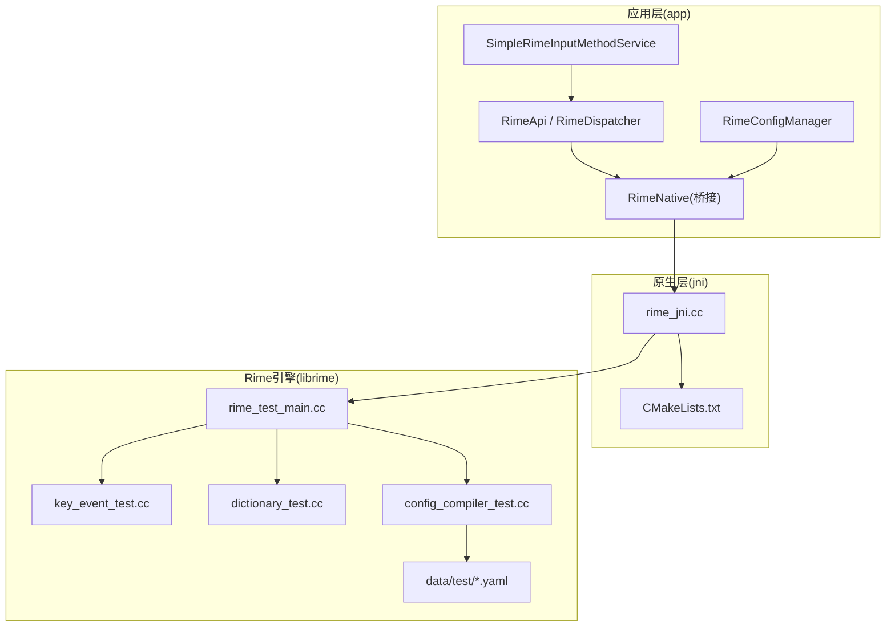
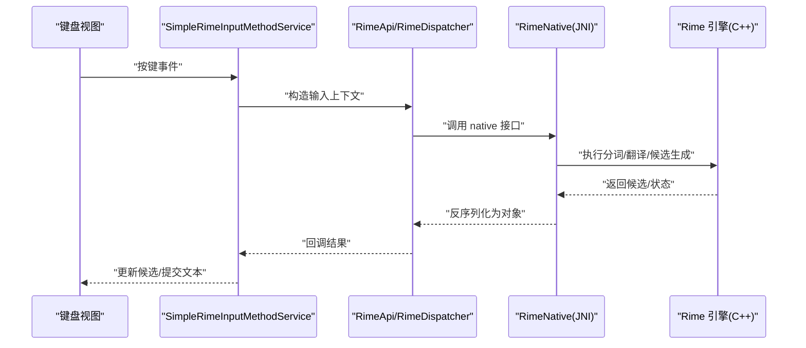
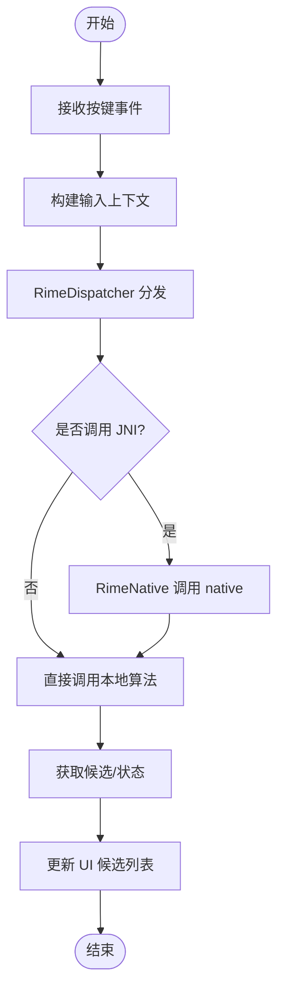
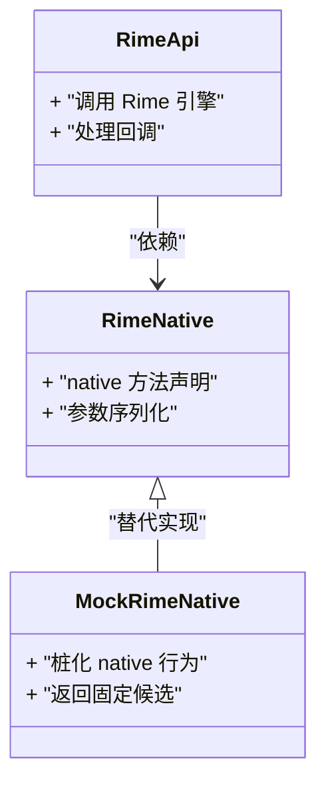
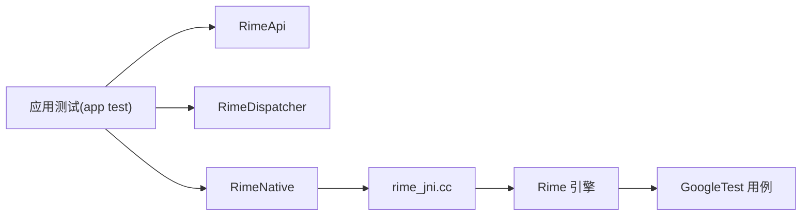

# 单元测试

<cite>
**本文引用的文件**   
- [app/build.gradle.kts](file://app/build.gradle.kts)
- [build.gradle.kts](file://build.gradle.kts)
- [settings.gradle.kts](file://settings.gradle.kts)
- [app/src/main/java/com/ziyou/ime/core/RimeNative.kt](file://app/src/main/java/com/ziyou/ime/core/RimeNative.kt)
- [app/src/main/java/com/ziyou/ime/core/SimpleRimeImpl.kt](file://app/src/main/java/com/ziyou/ime/core/SimpleRimeImpl.kt)
- [app/src/main/java/com/ziyou/ime/core/RimeApi.kt](file://app/src/main/java/com/ziyou/ime/core/RimeApi.kt)
- [app/src/main/java/com/ziyou/ime/core/RimeDispatcher.kt](file://app/src/main/java/com/ziyou/ime/core/RimeDispatcher.kt)
- [app/src/main/java/com/ziyou/ime/core/RimeMessage.kt](file://app/src/main/java/com/ziyou/ime/core/RimeMessage.kt)
- [app/src/main/java/com/ziyou/ime/ime/SimpleRimeInputMethodService.kt](file://app/src/main/java/com/ziyou/ime/ime/SimpleRimeInputMethodService.kt)
- [app/src/main/java/com/ziyou/ime/config/RimeConfigManager.kt](file://app/src/main/java/com/ziyou/ime/config/RimeConfigManager.kt)
- [app/src/main/jni/librime_jni/rime_jni.cc](file://app/src/main/jni/librime_jni/rime_jni.cc)
- [app/src/main/jni/librime_jni/CMakeLists.txt](file://app/src/main/jni/librime_jni/CMakeLists.txt)
- [librime-prebuilt/librime/test/rime_test_main.cc](file://librime-prebuilt/librime/test/rime_test_main.cc)
- [librime-prebuilt/librime/test/key_event_test.cc](file://librime-prebuilt/librime/test/key_event_test.cc)
- [librime-prebuilt/librime/test/dictionary_test.cc](file://librime-prebuilt/librime/test/dictionary_test.cc)
- [librime-prebuilt/librime/test/config_compiler_test.cc](file://librime-prebuilt/librime/test/config_compiler_test.cc)
- [librime-prebuilt/librime/data/test/config_test.yaml](file://librime-prebuilt/librime/data/test/config_test.yaml)
- [librime-prebuilt/librime/data/test/dictionary_test.dict.yaml](file://librime-prebuilt/librime/data/test/dictionary_test.dict.yaml)
</cite>

## 目录
1. [简介](#简介)
2. [项目结构](#项目结构)
3. [核心组件](#核心组件)
4. [架构总览](#架构总览)
5. [详细组件分析](#详细组件分析)
6. [依赖分析](#依赖分析)
7. [性能考虑](#性能考虑)
8. [故障排查指南](#故障排查指南)
9. [结论](#结论)
10. [附录](#附录)

## 简介
本文件面向 Rime 输入法项目的单元测试实践，围绕 JUnit 测试框架、Android 与 Kotlin 工程环境、JNI 桥接层、以及 Rime 引擎核心逻辑（输入处理、候选词生成等）的测试方法展开。文档提供：
- 测试用例编写规范与最佳实践
- 针对 JNI 接口与外部依赖的 Mock 策略
- 测试数据准备与管理（含配置与词典资源）
- 断言使用与常见测试模式
- 覆盖率统计的配置与使用方法
- 结合本仓库结构的示例路径与参考实现

## 项目结构
本项目为 Android 应用 + 原生库（librime）的组合工程，测试相关要点如下：
- 应用模块 app 包含 Java/Kotlin 代码与 assets 中的 Rime 配置文件与词典
- 原生层通过 jni 目录暴露 C++ 接口给上层 Kotlin/Java
- 第三方 librime 预构建库位于 librime-prebuilt，其自带 C++ 测试样例与测试数据
- Gradle 脚本用于统一构建与测试任务编排

图表来源
- [app/src/main/java/com/ziyou/ime/ime/SimpleRimeInputMethodService.kt](file://app/src/main/java/com/ziyou/ime/ime/SimpleRimeInputMethodService.kt)
- [app/src/main/java/com/ziyou/ime/core/RimeApi.kt](file://app/src/main/java/com/ziyou/ime/core/RimeApi.kt)
- [app/src/main/java/com/ziyou/ime/core/RimeDispatcher.kt](file://app/src/main/java/com/ziyou/ime/core/RimeDispatcher.kt)
- [app/src/main/java/com/ziyou/ime/core/RimeNative.kt](file://app/src/main/java/com/ziyou/ime/core/RimeNative.kt)
- [app/src/main/jni/librime_jni/rime_jni.cc](file://app/src/main/jni/librime_jni/rime_jni.cc)
- [app/src/main/jni/librime_jni/CMakeLists.txt](file://app/src/main/jni/librime_jni/CMakeLists.txt)
- [librime-prebuilt/librime/test/rime_test_main.cc](file://librime-prebuilt/librime/test/rime_test_main.cc)
- [librime-prebuilt/librime/test/key_event_test.cc](file://librime-prebuilt/librime/test/key_event_test.cc)
- [librime-prebuilt/librime/test/dictionary_test.cc](file://librime-prebuilt/librime/test/dictionary_test.cc)
- [librime-prebuilt/librime/test/config_compiler_test.cc](file://librime-prebuilt/librime/test/config_compiler_test.cc)
- [librime-prebuilt/librime/data/test/config_test.yaml](file://librime-prebuilt/librime/data/test/config_test.yaml)
- [librime-prebuilt/librime/data/test/dictionary_test.dict.yaml](file://librime-prebuilt/librime/data/test/dictionary_test.dict.yaml)

章节来源
- [app/build.gradle.kts](file://app/build.gradle.kts)
- [build.gradle.kts](file://build.gradle.kts)
- [settings.gradle.kts](file://settings.gradle.kts)

## 核心组件
本节聚焦与测试密切相关的核心类与职责边界，便于设计高内聚、低耦合的测试方案。

- SimpleRimeInputMethodService
  - 负责 IME 事件接入、键盘输入分发、候选展示与提交
  - 测试关注点：按键事件路由、候选列表更新、提交行为
- RimeApi / RimeDispatcher
  - 封装对 Rime 引擎的调用与消息派发
  - 测试关注点：API 调用契约、异步消息流转、错误回传
- RimeNative
  - JNI 桥接层，将 Kotlin/Java 调用映射到 C++ 接口
  - 测试关注点：参数序列化、异常传播、内存安全
- RimeConfigManager
  - 管理 Rime 配置加载与部署
  - 测试关注点：配置解析、默认值合并、资源路径

章节来源
- [app/src/main/java/com/ziyou/ime/ime/SimpleRimeInputMethodService.kt](file://app/src/main/java/com/ziyou/ime/ime/SimpleRimeInputMethodService.kt)
- [app/src/main/java/com/ziyou/ime/core/RimeApi.kt](file://app/src/main/java/com/ziyou/ime/core/RimeApi.kt)
- [app/src/main/java/com/ziyou/ime/core/RimeDispatcher.kt](file://app/src/main/java/com/ziyou/ime/core/RimeDispatcher.kt)
- [app/src/main/java/com/ziyou/ime/core/RimeNative.kt](file://app/src/main/java/com/ziyou/ime/core/RimeNative.kt)
- [app/src/main/java/com/ziyou/ime/config/RimeConfigManager.kt](file://app/src/main/java/com/ziyou/ime/config/RimeConfigManager.kt)

## 架构总览
下图展示了从键盘输入到候选词生成的端到端流程，并标注了可测试的关键节点。

图表来源
- [app/src/main/java/com/ziyou/ime/ime/SimpleRimeInputMethodService.kt](file://app/src/main/java/com/ziyou/ime/ime/SimpleRimeInputMethodService.kt)
- [app/src/main/java/com/ziyou/ime/core/RimeApi.kt](file://app/src/main/java/com/ziyou/ime/core/RimeApi.kt)
- [app/src/main/java/com/ziyou/ime/core/RimeDispatcher.kt](file://app/src/main/java/com/ziyou/ime/core/RimeDispatcher.kt)
- [app/src/main/java/com/ziyou/ime/core/RimeNative.kt](file://app/src/main/java/com/ziyou/ime/core/RimeNative.kt)
- [app/src/main/jni/librime_jni/rime_jni.cc](file://app/src/main/jni/librime_jni/rime_jni.cc)

## 详细组件分析

### 输入处理与候选生成测试
- 目标
  - 验证按键事件到候选词的完整链路
  - 覆盖拼音转换、分词、过滤、排序等关键步骤
- 建议策略
  - 在应用层使用 Instrumented Test 或 Robolectric 模拟 IME 事件
  - 对 JNI 层采用桩函数或轻量级 Native 测试（如 GoogleTest）
  - 使用 Rime 提供的测试数据与最小化 schema/dict 加速执行

图表来源
- [app/src/main/java/com/ziyou/ime/core/RimeDispatcher.kt](file://app/src/main/java/com/ziyou/ime/core/RimeDispatcher.kt)
- [app/src/main/java/com/ziyou/ime/core/RimeNative.kt](file://app/src/main/java/com/ziyou/ime/core/RimeNative.kt)
- [app/src/main/java/com/ziyou/ime/core/RimeApi.kt](file://app/src/main/java/com/ziyou/ime/core/RimeApi.kt)

章节来源
- [app/src/main/java/com/ziyou/ime/core/RimeDispatcher.kt](file://app/src/main/java/com/ziyou/ime/core/RimeDispatcher.kt)
- [app/src/main/java/com/ziyou/ime/core/RimeNative.kt](file://app/src/main/java/com/ziyou/ime/core/RimeNative.kt)
- [app/src/main/java/com/ziyou/ime/core/RimeApi.kt](file://app/src/main/java/com/ziyou/ime/core/RimeApi.kt)

### JNI 接口与外部依赖的 Mock
- 适用场景
  - 避免每次运行都加载真实 native 库
  - 隔离外部系统调用（文件系统、网络、设备特性）
- 推荐方式
  - Kotlin/Java 层：使用 Mockito/Kotlin Test 对接口进行桩化
  - JNI 层：使用 GoogleTest 编写 C++ 侧测试，或使用静态桩替换 native 方法
  - 对于 Rime 引擎：优先复用 librime 自带的测试套件与数据

图表来源
- [app/src/main/java/com/ziyou/ime/core/RimeApi.kt](file://app/src/main/java/com/ziyou/ime/core/RimeApi.kt)
- [app/src/main/java/com/ziyou/ime/core/RimeNative.kt](file://app/src/main/java/com/ziyou/ime/core/RimeNative.kt)

章节来源
- [app/src/main/java/com/ziyou/ime/core/RimeNative.kt](file://app/src/main/java/com/ziyou/ime/core/RimeNative.kt)
- [app/src/main/java/com/ziyou/ime/core/RimeApi.kt](file://app/src/main/java/com/ziyou/ime/core/RimeApi.kt)

### 测试数据准备与管理
- 数据来源
  - Rime 官方测试数据位于 librime-prebuilt 的 data/test 目录
  - 应用 assets 中存放运行时使用的 schema/dict 与主题配置
- 管理策略
  - 使用最小化数据集提升测试速度
  - 将测试配置与真实配置分离，避免污染用户数据
  - 通过临时目录或内存文件系统组织测试资源

章节来源
- [librime-prebuilt/librime/data/test/config_test.yaml](file://librime-prebuilt/librime/data/test/config_test.yaml)
- [librime-prebuilt/librime/data/test/dictionary_test.dict.yaml](file://librime-prebuilt/librime/data/test/dictionary_test.dict.yaml)
- [app/src/main/assets/rime/default.yaml](file://app/src/main/assets/rime/default.yaml)
- [app/src/main/assets/rime/luna_pinyin.schema.yaml](file://app/src/main/assets/rime/luna_pinyin.schema.yaml)
- [app/src/main/assets/rime/cangjie5.schema.yaml](file://app/src/main/assets/rime/cangjie5.schema.yaml)

### 断言与常见测试模式
- 断言建议
  - 明确输入与期望输出（候选列表、状态码、错误信息）
  - 对边界条件（空输入、超长输入、非法字符）进行覆盖
  - 对异步回调使用同步等待或测试调度器
- 常见模式
  - Given-When-Then 结构组织用例
  - 参数化测试覆盖多组输入
  - 使用 Fixture 初始化共享资源

章节来源
- [app/src/main/java/com/ziyou/ime/core/RimeMessage.kt](file://app/src/main/java/com/ziyou/ime/core/RimeMessage.kt)

### 覆盖率统计配置与使用
- 工具选择
  - Android 单元测试：JaCoCo
  - 集成测试：AndroidX Test + JaCoCo
- 配置要点
  - 在模块 build.gradle 启用 coverage
  - 指定需要采集的代码范围
  - 生成报告并查看覆盖率指标

章节来源
- [app/build.gradle.kts](file://app/build.gradle.kts)
- [build.gradle.kts](file://build.gradle.kts)

## 依赖分析
下图展示测试相关依赖关系，包括应用层、JNI 层与 Rime 引擎之间的交互。

图表来源
- [app/src/main/java/com/ziyou/ime/core/RimeApi.kt](file://app/src/main/java/com/ziyou/ime/core/RimeApi.kt)
- [app/src/main/java/com/ziyou/ime/core/RimeDispatcher.kt](file://app/src/main/java/com/ziyou/ime/core/RimeDispatcher.kt)
- [app/src/main/java/com/ziyou/ime/core/RimeNative.kt](file://app/src/main/java/com/ziyou/ime/core/RimeNative.kt)
- [app/src/main/jni/librime_jni/rime_jni.cc](file://app/src/main/jni/librime_jni/rime_jni.cc)
- [librime-prebuilt/librime/test/rime_test_main.cc](file://librime-prebuilt/librime/test/rime_test_main.cc)

章节来源
- [app/src/main/jni/librime_jni/CMakeLists.txt](file://app/src/main/jni/librime_jni/CMakeLists.txt)
- [librime-prebuilt/librime/test/key_event_test.cc](file://librime-prebuilt/librime/test/key_event_test.cc)
- [librime-prebuilt/librime/test/dictionary_test.cc](file://librime-prebuilt/librime/test/dictionary_test.cc)
- [librime-prebuilt/librime/test/config_compiler_test.cc](file://librime-prebuilt/librime/test/config_compiler_test.cc)

## 性能考虑
- 测试数据规模控制：使用最小化词典与 schema，减少 IO 与解析开销
- 避免重复初始化：在测试套件级别共享 Rime 实例或配置
- 并行执行：合理拆分测试集，利用 CI 并行加速
- 内存与崩溃防护：对 JNI 调用增加异常捕获与超时保护

[本节为通用指导，不直接分析具体文件]

## 故障排查指南
- 常见问题
  - JNI 加载失败：检查 so 库架构与 ABI 匹配
  - 配置解析错误：校验 YAML 语法与引用关系
  - 候选为空：确认 schema/dict 路径与权限
- 定位手段
  - 打印关键日志（输入上下文、中间状态、错误码）
  - 使用 Rime 控制台工具复现问题
  - 逐步缩小测试范围，定位回归点

章节来源
- [app/src/main/jni/librime_jni/CMakeLists.txt](file://app/src/main/jni/librime_jni/CMakeLists.txt)
- [librime-prebuilt/librime/test/config_compiler_test.cc](file://librime-prebuilt/librime/test/config_compiler_test.cc)

## 结论
通过分层测试策略（应用层、JNI 层、引擎层），结合 Rime 官方测试数据与最小化配置，可以有效保障输入处理与候选生成逻辑的正确性与稳定性。建议在 CI 中集成单元测试与覆盖率统计，持续监控质量趋势。

[本节为总结性内容，不直接分析具体文件]

## 附录
- 参考测试入口与样例
  - Rime C++ 测试主程序：[rime_test_main.cc](file://librime-prebuilt/librime/test/rime_test_main.cc)
  - 按键事件测试：[key_event_test.cc](file://librime-prebuilt/librime/test/key_event_test.cc)
  - 词典测试：[dictionary_test.cc](file://librime-prebuilt/librime/test/dictionary_test.cc)
  - 配置编译测试：[config_compiler_test.cc](file://librime-prebuilt/librime/test/config_compiler_test.cc)
- 测试数据
  - 配置样例：[config_test.yaml](file://librime-prebuilt/librime/data/test/config_test.yaml)
  - 词典样例：[dictionary_test.dict.yaml](file://librime-prebuilt/librime/data/test/dictionary_test.dict.yaml)

章节来源
- [librime-prebuilt/librime/test/rime_test_main.cc](file://librime-prebuilt/librime/test/rime_test_main.cc)
- [librime-prebuilt/librime/test/key_event_test.cc](file://librime-prebuilt/librime/test/key_event_test.cc)
- [librime-prebuilt/librime/test/dictionary_test.cc](file://librime-prebuilt/librime/test/dictionary_test.cc)
- [librime-prebuilt/librime/test/config_compiler_test.cc](file://librime-prebuilt/librime/test/config_compiler_test.cc)
- [librime-prebuilt/librime/data/test/config_test.yaml](file://librime-prebuilt/librime/data/test/config_test.yaml)
- [librime-prebuilt/librime/data/test/dictionary_test.dict.yaml](file://librime-prebuilt/librime/data/test/dictionary_test.dict.yaml)