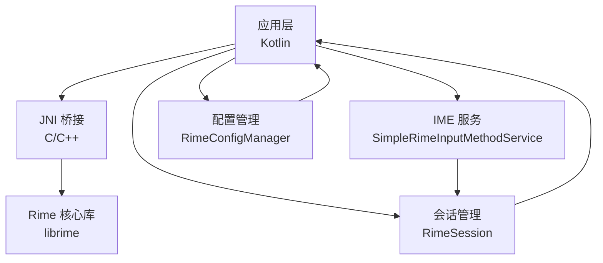
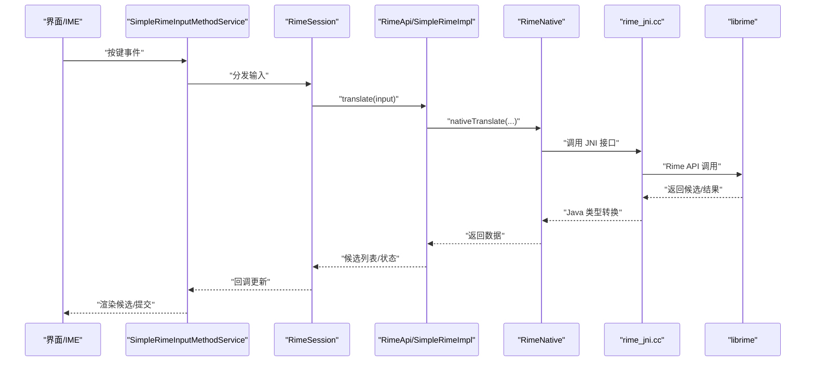
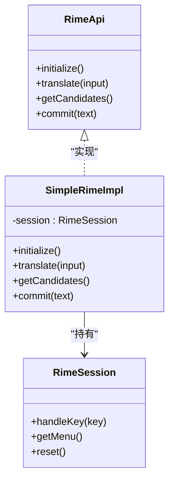
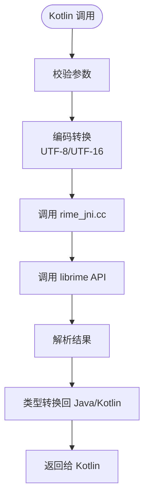
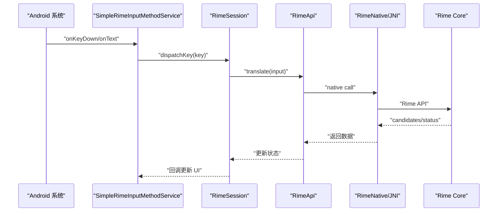
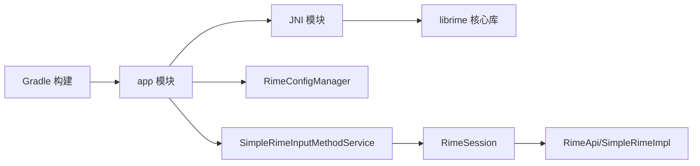

# 性能测试

<cite>
**本文引用的文件**   
- [app/src/main/java/com/ziyou/ime/core/RimeApi.kt](file://app/src/main/java/com/ziyou/ime/core/RimeApi.kt)
- [app/src/main/java/com/ziyou/ime/core/SimpleRimeImpl.kt](file://app/src/main/java/com/ziyou/ime/core/SimpleRimeImpl.kt)
- [app/src/main/java/com/ziyou/ime/core/RimeNative.kt](file://app/src/main/java/com/ziyou/ime/core/RimeNative.kt)
- [app/src/main/jni/librime_jni/rime_jni.cc](file://app/src/main/jni/librime_jni/rime_jni.cc)
- [app/src/main/jni/librime_jni/session.h](file://app/src/main/jni/librime_jni/session.h)
- [app/src/main/java/com/ziyou/ime/daemon/RimeSession.kt](file://app/src/main/java/com/ziyou/ime/daemon/RimeSession.kt)
- [app/src/main/java/com/ziyou/ime/config/RimeConfigManager.kt](file://app/src/main/java/com/ziyou/ime/config/RimeConfigManager.kt)
- [app/src/main/java/com/ziyou/ime/ime/SimpleRimeInputMethodService.kt](file://app/src/main/java/com/ziyou/ime/ime/SimpleRimeInputMethodService.kt)
- [app/build.gradle.kts](file://app/build.gradle.kts)
- [build.gradle.kts](file://build.gradle.kts)
- [settings.gradle.kts](file://settings.gradle.kts)
- [gradle.properties](file://gradle.properties)
- [librime-prebuilt/librime/src/rime_api.h](file://librime-prebuilt/librime/src/rime_api.h)
</cite>

## 目录
1. [简介](#简介)
2. [项目结构](#项目结构)
3. [核心组件](#核心组件)
4. [架构总览](#架构总览)
5. [详细组件分析](#详细组件分析)
6. [依赖分析](#依赖分析)
7. [性能考虑](#性能考虑)
8. [故障排查指南](#故障排查指南)
9. [结论](#结论)
10. [附录](#附录)

## 简介
本文件面向 Android 输入法（基于 Rime）的性能测试与优化，覆盖以下主题：
- 使用 Android Profiler 监控 CPU、内存、网络、电池使用情况
- 为 Rime 引擎初始化、候选词生成、内存管理等关键路径编写基准测试（Benchmark）
- 压力测试与负载测试方法，特别是大量输入处理与并发请求场景
- 性能回归测试的自动化方案与告警机制
- 具体性能测试示例：拼音转换性能、内存占用优化、JNI 调用效率
- 性能问题定位与分析方法：内存泄漏检测、CPU 热点分析等

## 项目结构
本项目采用多模块组织，应用层位于 app 模块，JNI 桥接在 jni 目录，Rime 核心库以预编译形式集成于 librime-prebuilt。关键路径包括：
- Kotlin 层：RimeApi、SimpleRimeImpl、RimeSession、IME Service
- JNI 层：rime_jni.cc、session.h
- 配置与资源：RimeConfigManager、assets/rime 下的 schema/dict

图表来源
- [app/src/main/java/com/ziyou/ime/ime/SimpleRimeInputMethodService.kt](file://app/src/main/java/com/ziyou/ime/ime/SimpleRimeInputMethodService.kt)
- [app/src/main/java/com/ziyou/ime/daemon/RimeSession.kt](file://app/src/main/java/com/ziyou/ime/daemon/RimeSession.kt)
- [app/src/main/java/com/ziyou/ime/config/RimeConfigManager.kt](file://app/src/main/java/com/ziyou/ime/config/RimeConfigManager.kt)
- [app/src/main/java/com/ziyou/ime/core/RimeApi.kt](file://app/src/main/java/com/ziyou/ime/core/RimeApi.kt)
- [app/src/main/java/com/ziyou/ime/core/SimpleRimeImpl.kt](file://app/src/main/java/com/ziyou/ime/core/SimpleRimeImpl.kt)
- [app/src/main/java/com/ziyou/ime/core/RimeNative.kt](file://app/src/main/java/com/ziyou/ime/core/RimeNative.kt)
- [app/src/main/jni/librime_jni/rime_jni.cc](file://app/src/main/jni/librime_jni/rime_jni.cc)
- [app/src/main/jni/librime_jni/session.h](file://app/src/main/jni/librime_jni/session.h)

章节来源
- [app/build.gradle.kts](file://app/build.gradle.kts)
- [build.gradle.kts](file://build.gradle.kts)
- [settings.gradle.kts](file://settings.gradle.kts)
- [gradle.properties](file://gradle.properties)

## 核心组件
- RimeApi：对外暴露的 Kotlin API，封装 Rime 引擎能力（如初始化、提交、候选查询等）
- SimpleRimeImpl：RimeApi 的具体实现，负责状态管理与调用 JNI
- RimeNative：声明 native 方法，用于与 rime_jni.cc 交互
- rime_jni.cc / session.h：JNI 实现，封装对 librime 的调用（创建/销毁 Session、输入处理、候选获取）
- RimeSession：会话级封装，持有单个 Rime Session 的生命周期与上下文
- SimpleRimeInputMethodService：IME 入口，接收用户输入并调度 Rime 处理流程
- RimeConfigManager：加载与更新 Rime 配置（schema、dict、symbols 等）

章节来源
- [app/src/main/java/com/ziyou/ime/core/RimeApi.kt](file://app/src/main/java/com/ziyou/ime/core/RimeApi.kt)
- [app/src/main/java/com/ziyou/ime/core/SimpleRimeImpl.kt](file://app/src/main/java/com/ziyou/ime/core/SimpleRimeImpl.kt)
- [app/src/main/java/com/ziyou/ime/core/RimeNative.kt](file://app/src/main/java/com/ziyou/ime/core/RimeNative.kt)
- [app/src/main/jni/librime_jni/rime_jni.cc](file://app/src/main/jni/librime_jni/rime_jni.cc)
- [app/src/main/jni/librime_jni/session.h](file://app/src/main/jni/librime_jni/session.h)
- [app/src/main/java/com/ziyou/ime/daemon/RimeSession.kt](file://app/src/main/java/com/ziyou/ime/daemon/RimeSession.kt)
- [app/src/main/java/com/ziyou/ime/ime/SimpleRimeInputMethodService.kt](file://app/src/main/java/com/ziyou/ime/ime/SimpleRimeInputMethodService.kt)
- [app/src/main/java/com/ziyou/ime/config/RimeConfigManager.kt](file://app/src/main/java/com/ziyou/ime/config/RimeConfigManager.kt)

## 架构总览
下图展示从 IME 到 Rime 核心的完整调用链，以及 JNI 桥接点。该链路是性能测试的重点关注区域。

图表来源
- [app/src/main/java/com/ziyou/ime/ime/SimpleRimeInputMethodService.kt](file://app/src/main/java/com/ziyou/ime/ime/SimpleRimeInputMethodService.kt)
- [app/src/main/java/com/ziyou/ime/daemon/RimeSession.kt](file://app/src/main/java/com/ziyou/ime/daemon/RimeSession.kt)
- [app/src/main/java/com/ziyou/ime/core/RimeApi.kt](file://app/src/main/java/com/ziyou/ime/core/RimeApi.kt)
- [app/src/main/java/com/ziyou/ime/core/SimpleRimeImpl.kt](file://app/src/main/java/com/ziyou/ime/core/SimpleRimeImpl.kt)
- [app/src/main/java/com/ziyou/ime/core/RimeNative.kt](file://app/src/main/java/com/ziyou/ime/core/RimeNative.kt)
- [app/src/main/jni/librime_jni/rime_jni.cc](file://app/src/main/jni/librime_jni/rime_jni.cc)
- [librime-prebuilt/librime/src/rime_api.h](file://librime-prebuilt/librime/src/rime_api.h)

## 详细组件分析

### RimeApi 与 SimpleRimeImpl
- 职责：定义统一的 Kotlin 接口与默认实现，屏蔽底层细节；提供初始化、输入翻译、候选获取、提交等方法
- 关键点：
  - 初始化阶段需预热词典与 schema，避免首次冷启动卡顿
  - 翻译过程应尽量减少对象分配与字符串拷贝
  - 错误路径需快速失败并记录可观测指标

图表来源
- [app/src/main/java/com/ziyou/ime/core/RimeApi.kt](file://app/src/main/java/com/ziyou/ime/core/RimeApi.kt)
- [app/src/main/java/com/ziyou/ime/core/SimpleRimeImpl.kt](file://app/src/main/java/com/ziyou/ime/core/SimpleRimeImpl.kt)
- [app/src/main/java/com/ziyou/ime/daemon/RimeSession.kt](file://app/src/main/java/com/ziyou/ime/daemon/RimeSession.kt)

章节来源
- [app/src/main/java/com/ziyou/ime/core/RimeApi.kt](file://app/src/main/java/com/ziyou/ime/core/RimeApi.kt)
- [app/src/main/java/com/ziyou/ime/core/SimpleRimeImpl.kt](file://app/src/main/java/com/ziyou/ime/core/SimpleRimeImpl.kt)
- [app/src/main/java/com/ziyou/ime/daemon/RimeSession.kt](file://app/src/main/java/com/ziyou/ime/daemon/RimeSession.kt)

### JNI 桥接（RimeNative 与 rime_jni.cc）
- 职责：将 Kotlin 调用映射到 C/C++ 的 Rime API，进行参数转换与返回值封装
- 关键点：
  - 避免频繁的 JNI 边界切换，批量处理输入
  - 注意 UTF-8/UTF-16 编码转换开销
  - 异常与错误码需清晰传递，便于上层统计

图表来源
- [app/src/main/java/com/ziyou/ime/core/RimeNative.kt](file://app/src/main/java/com/ziyou/ime/core/RimeNative.kt)
- [app/src/main/jni/librime_jni/rime_jni.cc](file://app/src/main/jni/librime_jni/rime_jni.cc)
- [librime-prebuilt/librime/src/rime_api.h](file://librime-prebuilt/librime/src/rime_api.h)

章节来源
- [app/src/main/java/com/ziyou/ime/core/RimeNative.kt](file://app/src/main/java/com/ziyou/ime/core/RimeNative.kt)
- [app/src/main/jni/librime_jni/rime_jni.cc](file://app/src/main/jni/librime_jni/rime_jni.cc)
- [librime-prebuilt/librime/src/rime_api.h](file://librime-prebuilt/librime/src/rime_api.h)

### IME 服务与会话管理
- SimpleRimeInputMethodService：接收系统输入事件，分发给 RimeSession，更新候选与提交
- RimeSession：维护单次输入会话的状态，缓存中间结果，减少重复计算

图表来源
- [app/src/main/java/com/ziyou/ime/ime/SimpleRimeInputMethodService.kt](file://app/src/main/java/com/ziyou/ime/ime/SimpleRimeInputMethodService.kt)
- [app/src/main/java/com/ziyou/ime/daemon/RimeSession.kt](file://app/src/main/java/com/ziyou/ime/daemon/RimeSession.kt)
- [app/src/main/java/com/ziyou/ime/core/RimeApi.kt](file://app/src/main/java/com/ziyou/ime/core/RimeApi.kt)
- [app/src/main/java/com/ziyou/ime/core/RimeNative.kt](file://app/src/main/java/com/ziyou/ime/core/RimeNative.kt)
- [app/src/main/jni/librime_jni/rime_jni.cc](file://app/src/main/jni/librime_jni/rime_jni.cc)

章节来源
- [app/src/main/java/com/ziyou/ime/ime/SimpleRimeInputMethodService.kt](file://app/src/main/java/com/ziyou/ime/ime/SimpleRimeInputMethodService.kt)
- [app/src/main/java/com/ziyou/ime/daemon/RimeSession.kt](file://app/src/main/java/com/ziyou/ime/daemon/RimeSession.kt)

## 依赖分析
- Kotlin 层依赖 JNI 层，JNI 层依赖 librime 核心库
- IME 服务依赖会话管理与配置管理
- 构建脚本定义了模块与依赖关系

图表来源
- [build.gradle.kts](file://build.gradle.kts)
- [app/build.gradle.kts](file://app/build.gradle.kts)
- [settings.gradle.kts](file://settings.gradle.kts)
- [gradle.properties](file://gradle.properties)

章节来源
- [build.gradle.kts](file://build.gradle.kts)
- [app/build.gradle.kts](file://app/build.gradle.kts)
- [settings.gradle.kts](file://settings.gradle.kts)
- [gradle.properties](file://gradle.properties)

## 性能考虑
- 初始化预热：在进程启动或首帧前完成 Rime 引擎与词典加载，避免首次输入卡顿
- 输入批处理：合并多次按键输入，减少 JNI 调用次数与对象分配
- 内存复用：重用候选列表与临时缓冲区，降低 GC 压力
- 线程模型：将耗时操作（如大词典检索）放入后台线程，主线程仅做轻量更新
- 日志与埋点：在关键路径添加耗时与内存指标，便于回归监控

[本节为通用指导，不直接分析具体文件]

## 故障排查指南
- 内存泄漏检测：
  - 使用 Android Studio Memory Profiler 观察堆快照与分配热点
  - 检查 RimeSession 生命周期是否随页面正确释放
  - 确认 JNI 侧未持有不必要的全局引用
- CPU 热点分析：
  - 使用 CPU Profiler 录制输入序列，识别 JNI 调用与字符串转换热点
  - 关注长任务阻塞主线程的情况
- 电池与功耗：
  - 通过 Battery Historian 分析唤醒与后台活动
  - 减少不必要的轮询与频繁 JNI 调用
- 网络与 IO：
  - 若涉及远程词典或配置更新，确保异步化与重试策略

[本节为通用指导，不直接分析具体文件]

## 结论
通过对 Rime 输入法的关键路径进行系统化性能测试与监控，结合 Android Profiler 与基准测试，可有效发现瓶颈并持续优化。建议建立自动化回归流水线，将性能指标纳入质量门禁，确保版本迭代中的稳定性与用户体验。

[本节为总结性内容，不直接分析具体文件]

## 附录

### Android Profiler 使用要点
- CPU：录制输入序列，查看方法耗时与 JNI 调用栈
- 内存：观察分配热点、GC 频率与堆增长趋势
- 网络：监控配置下载与远程词典访问
- 电池：分析唤醒锁与后台任务

[本节为通用指导，不直接分析具体文件]

### 基准测试（Benchmark）编写方法
- 目标路径：
  - 引擎初始化与预热
  - 拼音输入翻译与候选生成
  - JNI 调用往返开销
  - 内存分配与回收
- 指标定义：
  - 时延：P50/P95/P99 延迟
  - 吞吐：每秒输入处理量
  - 内存：峰值与平均分配量
  - 抖动：GC 停顿时间与频率
- 工具建议：
  - Android Benchmark Library（JMH）
  - Robolectric/Espresso 驱动 UI 层
  - 自定义命令行工具驱动 JNI 层

[本节为通用指导，不直接分析具体文件]

### 压力测试与负载测试
- 大量输入处理：
  - 构造长文本与高频词序列，模拟真实打字场景
  - 逐步增加输入速率，观察延迟与内存变化
- 并发请求：
  - 多线程并发调用翻译接口，验证线程安全与资源竞争
  - 监控线程池队列长度与拒绝策略
- 指标阈值：
  - 设定 P95 延迟上限与内存峰值限制
  - 失败率与超时率阈值

[本节为通用指导，不直接分析具体文件]

### 性能回归测试与告警
- 自动化：
  - 在 CI 中执行基准测试套件，比较基线指标
  - 使用性能报告生成与归档
- 告警机制：
  - 当 P95 延迟超过阈值或内存增长异常时触发告警
  - 关联代码变更与性能波动，辅助定位问题

[本节为通用指导，不直接分析具体文件]

### 具体性能测试示例（路径指引）
- 拼音转换性能：
  - 参考 RimeApi.translate 与 SimpleRimeImpl 的实现路径
  - 在 SimpleRimeInputMethodService 中录制输入序列
- 内存占用优化：
  - 检查 RimeSession 与候选对象的分配与释放
  - 使用 Memory Profiler 对比优化前后差异
- JNI 调用效率：
  - 在 rime_jni.cc 与 RimeNative 之间测量往返时间
  - 减少编码转换与对象创建

章节来源
- [app/src/main/java/com/ziyou/ime/core/RimeApi.kt](file://app/src/main/java/com/ziyou/ime/core/RimeApi.kt)
- [app/src/main/java/com/ziyou/ime/core/SimpleRimeImpl.kt](file://app/src/main/java/com/ziyou/ime/core/SimpleRimeImpl.kt)
- [app/src/main/java/com/ziyou/ime/core/RimeNative.kt](file://app/src/main/java/com/ziyou/ime/core/RimeNative.kt)
- [app/src/main/jni/librime_jni/rime_jni.cc](file://app/src/main/jni/librime_jni/rime_jni.cc)
- [app/src/main/java/com/ziyou/ime/ime/SimpleRimeInputMethodService.kt](file://app/src/main/java/com/ziyou/ime/ime/SimpleRimeInputMethodService.kt)