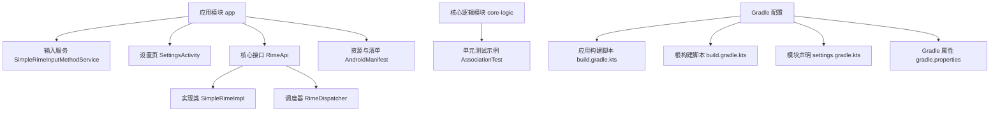
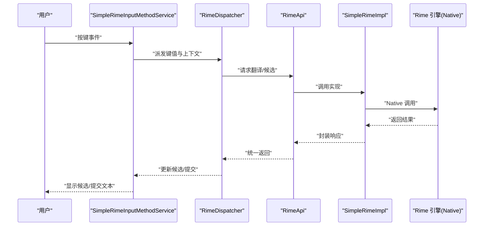
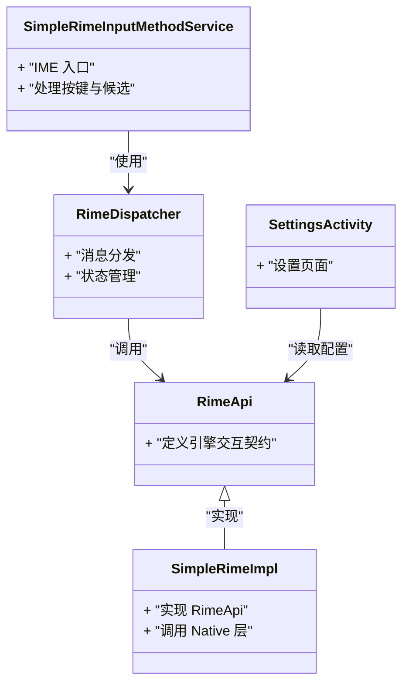

# 测试指南

<cite>
**本文档引用的文件**   
- [app/build.gradle.kts](file://app/build.gradle.kts)
- [build.gradle.kts](file://build.gradle.kts)
- [settings.gradle.kts](file://settings.gradle.kts)
- [gradle.properties](file://gradle.properties)
- [app/src/main/AndroidManifest.xml](file://app/src/main/AndroidManifest.xml)
- [app/src/main/java/com/ziyou/ime/ZiyouApplication.kt](file://app/src/main/java/com/ziyou/ime/ZiyouApplication.kt)
- [app/src/main/java/com/ziyou/ime/core/RimeApi.kt](file://app/src/main/java/com/ziyou/ime/core/RimeApi.kt)
- [app/src/main/java/com/ziyou/ime/core/SimpleRimeImpl.kt](file://app/src/main/java/com/ziyou/ime/core/SimpleRimeImpl.kt)
- [app/src/main/java/com/ziyou/ime/core/RimeDispatcher.kt](file://app/src/main/java/com/ziyou/ime/core/RimeDispatcher.kt)
- [app/src/main/java/com/ziyou/ime/ime/SimpleRimeInputMethodService.kt](file://app/src/main/java/com/ziyou/ime/ime/SimpleRimeInputMethodService.kt)
- [app/src/main/java/com/ziyou/ime/ui/SettingsActivity.kt](file://app/src/main/java/com/ziyou/ime/ui/SettingsActivity.kt)
- [core-logic/src/test/java/com/ziyou/ime/core/association/AssociationTest.kt](file://core-logic/src/test/java/com/ziyou/ime/core/association/AssociationTest.kt)
</cite>

## 目录
1. [简介](#简介)
2. [项目结构](#项目结构)
3. [核心组件](#核心组件)
4. [架构总览](#架构总览)
5. [详细组件分析](#详细组件分析)
6. [依赖分析](#依赖分析)
7. [性能考虑](#性能考虑)
8. [故障排查指南](#故障排查指南)
9. [结论](#结论)
10. [附录](#附录)

## 简介
本指南面向输入法项目的测试工程师与开发者，系统阐述单元测试、UI 测试、性能与压力测试的编写方法与实践，覆盖 JUnit 用例组织与命名规范、模拟对象与测试数据构建、Espresso UI 测试方案、持续集成自动化配置、覆盖率统计与质量检查设置，以及常见问题调试方法与性能瓶颈定位策略。文档内容基于仓库现有结构与代码实现进行归纳与扩展，确保可操作且贴合实际工程。

## 项目结构
本项目采用多模块结构：应用层位于 app 模块，核心逻辑位于 core-logic 模块，JNI 与原生库通过 librime-prebuilt 引入。测试相关配置集中在 Gradle 脚本中，UI 入口为 InputMethodService，业务核心围绕 Rime 引擎封装。

图表来源
- [app/build.gradle.kts](file://app/build.gradle.kts)
- [build.gradle.kts](file://build.gradle.kts)
- [settings.gradle.kts](file://settings.gradle.kts)
- [gradle.properties](file://gradle.properties)
- [app/src/main/AndroidManifest.xml](file://app/src/main/AndroidManifest.xml)
- [app/src/main/java/com/ziyou/ime/ime/SimpleRimeInputMethodService.kt](file://app/src/main/java/com/ziyou/ime/ime/SimpleRimeInputMethodService.kt)
- [app/src/main/java/com/ziyou/ime/ui/SettingsActivity.kt](file://app/src/main/java/com/ziyou/ime/ui/SettingsActivity.kt)
- [app/src/main/java/com/ziyou/ime/core/RimeApi.kt](file://app/src/main/java/com/ziyou/ime/core/RimeApi.kt)
- [app/src/main/java/com/ziyou/ime/core/SimpleRimeImpl.kt](file://app/src/main/java/com/ziyou/ime/core/SimpleRimeImpl.kt)
- [app/src/main/java/com/ziyou/ime/core/RimeDispatcher.kt](file://app/src/main/java/com/ziyou/ime/core/RimeDispatcher.kt)
- [core-logic/src/test/java/com/ziyou/ime/core/association/AssociationTest.kt](file://core-logic/src/test/java/com/ziyou/ime/core/association/AssociationTest.kt)

章节来源
- [app/build.gradle.kts](file://app/build.gradle.kts)
- [build.gradle.kts](file://build.gradle.kts)
- [settings.gradle.kts](file://settings.gradle.kts)
- [gradle.properties](file://gradle.properties)
- [app/src/main/AndroidManifest.xml](file://app/src/main/AndroidManifest.xml)

## 核心组件
- 输入服务：SimpleRimeInputMethodService 作为 IME 入口，负责按键事件处理、候选词展示与提交。
- 核心接口与实现：RimeApi 定义引擎交互契约；SimpleRimeImpl 提供具体实现；RimeDispatcher 负责消息分发与状态管理。
- 应用初始化：ZiyouApplication 完成全局初始化与依赖装配。
- 设置界面：SettingsActivity 承载用户偏好配置。

章节来源
- [app/src/main/java/com/ziyou/ime/ime/SimpleRimeInputMethodService.kt](file://app/src/main/java/com/ziyou/ime/ime/SimpleRimeInputMethodService.kt)
- [app/src/main/java/com/ziyou/ime/core/RimeApi.kt](file://app/src/main/java/com/ziyou/ime/core/RimeApi.kt)
- [app/src/main/java/com/ziyou/ime/core/SimpleRimeImpl.kt](file://app/src/src/main/java/com/ziyou/ime/core/SimpleRimeImpl.kt)
- [app/src/main/java/com/ziyou/ime/core/RimeDispatcher.kt](file://app/src/main/java/com/ziyou/ime/core/RimeDispatcher.kt)
- [app/src/main/java/com/ziyou/ime/ZiyouApplication.kt](file://app/src/main/java/com/ziyou/ime/ZiyouApplication.kt)
- [app/src/main/java/com/ziyou/ime/ui/SettingsActivity.kt](file://app/src/main/java/com/ziyou/ime/ui/SettingsActivity.kt)

## 架构总览
下图展示了从输入事件到引擎处理的调用链，以及测试在其中的切入点（单测、UI 测试、性能测试）。

图表来源
- [app/src/main/java/com/ziyou/ime/ime/SimpleRimeInputMethodService.kt](file://app/src/main/java/com/ziyou/ime/ime/SimpleRimeInputMethodService.kt)
- [app/src/main/java/com/ziyou/ime/core/RimeDispatcher.kt](file://app/src/main/java/com/ziyou/ime/core/RimeDispatcher.kt)
- [app/src/main/java/com/ziyou/ime/core/RimeApi.kt](file://app/src/main/java/com/ziyou/ime/core/RimeApi.kt)
- [app/src/main/java/com/ziyou/ime/core/SimpleRimeImpl.kt](file://app/src/main/java/com/ziyou/ime/core/SimpleRimeImpl.kt)

## 详细组件分析

### 单元测试：JUnit 组织与命名规范
- 包与目录
  - 核心逻辑测试位于 core-logic 模块的 test 目录，便于对纯 Kotlin 逻辑进行快速验证。
  - 应用层测试建议放在 app/src/androidTest 或 app/src/test 下，按功能域划分包名。
- 命名规范
  - 测试类以被测类名 + Test 结尾，如 AssociationTest。
  - 测试方法使用描述性命名：should_场景_期望行为，例如 should_return_candidates_when_input_valid。
- 用例组织
  - 将测试按功能域分组（如 association、spelling、filter），每个组一个测试类。
  - 使用 @Before/@After 或 @BeforeEach/@AfterEach 管理测试环境。
- 断言与期望
  - 使用 AssertJ 或 Hamcrest 增强可读性；对异常路径使用 assertThrows。

章节来源
- [core-logic/src/test/java/com/ziyou/ime/core/association/AssociationTest.kt](file://core-logic/src/test/java/com/ziyou/ime/core/association/AssociationTest.kt)

### 模拟对象与测试数据
- 模拟策略
  - 对 RimeApi 等外部依赖使用 MockK/Kotlin 内置 mock 机制，隔离 Native 调用与 IO。
  - 对 RimeDispatcher 的状态变化使用 verify 与 argumentCaptor 验证交互。
- 测试数据
  - 使用工厂函数或数据类生成稳定输入集，避免硬编码字符串。
  - 针对边界条件准备空输入、超长输入、非法字符等数据集。
- 异步与回调
  - 使用 runBlocking、TestDispatcher 或等待器（CountDownLatch）同步化异步流程。

章节来源
- [app/src/main/java/com/ziyou/ime/core/RimeApi.kt](file://app/src/main/java/com/ziyou/ime/core/RimeApi.kt)
- [app/src/main/java/com/ziyou/ime/core/SimpleRimeImpl.kt](file://app/src/main/java/com/ziyou/ime/core/SimpleRimeImpl.kt)
- [app/src/main/java/com/ziyou/ime/core/RimeDispatcher.kt](file://app/src/main/java/com/ziyou/ime/core/RimeDispatcher.kt)

### UI 测试：Espresso 框架与 IME 场景
- 测试目标
  - 验证 SettingsActivity 的配置项读写与生效。
  - 验证输入过程中候选词展示与提交行为。
- 测试环境
  - 使用 ActivityScenarioRule 启动目标 Activity。
  - 对于 IME 场景，优先通过 Instrumentation 注入键值或使用 UiAutomator 辅助。
- 关键步骤
  - 构造输入序列并触发渲染。
  - 使用 onView 匹配候选列表项并断言可见性与文本。
  - 提交后断言目标编辑框内容。

章节来源
- [app/src/main/java/com/ziyou/ime/ui/SettingsActivity.kt](file://app/src/main/java/com/ziyou/ime/ui/SettingsActivity.kt)
- [app/src/main/java/com/ziyou/ime/ime/SimpleRimeInputMethodService.kt](file://app/src/main/java/com/ziyou/ime/ime/SimpleRimeInputMethodService.kt)

### 性能测试与压力测试
- 基准测试
  - 使用 Benchmark 库对候选生成、过滤、排序等热点方法进行微基准测试。
  - 控制输入规模与并发度，记录 P95/P99 延迟与内存占用。
- 压力测试
  - 通过循环输入大量键值，观察 CPU、内存、GC 与 ANR 情况。
  - 结合 Android Profiler 与 systrace 定位瓶颈。
- 指标采集
  - 自定义埋点上报关键路径耗时与错误率。
  - 使用 TraceView/Perfetto 进行帧级与线程级分析。

章节来源
- [app/src/main/java/com/ziyou/ime/core/RimeDispatcher.kt](file://app/src/main/java/com/ziyou/ime/core/RimeDispatcher.kt)
- [app/src/main/java/com/ziyou/ime/core/SimpleRimeImpl.kt](file://app/src/main/java/com/ziyou/ime/core/SimpleRimeImpl.kt)

### 持续集成中的自动化测试配置
- 任务编排
  - 在 CI 中依次执行 lint、单元测试、UI 测试、构建产物与覆盖率报告。
- 并行与缓存
  - 启用 Gradle 守护进程与并行构建，缓存依赖与构建输出。
- 报告与归档
  - 聚合测试报告（JUnit XML、HTML 覆盖率），上传至 CI 平台。
- 门禁规则
  - 失败即阻断合并；覆盖率阈值与代码风格检查作为准入条件。

章节来源
- [app/build.gradle.kts](file://app/build.gradle.kts)
- [build.gradle.kts](file://build.gradle.kts)
- [settings.gradle.kts](file://settings.gradle.kts)
- [gradle.properties](file://gradle.properties)

### 测试覆盖率统计与质量检查
- 覆盖率
  - 使用 JaCoCo 收集行覆盖率与分支覆盖率，生成 HTML 报告。
  - 设置最低覆盖率阈值，未达标则构建失败。
- 质量检查
  - 集成 ktlint/detekt 进行代码风格与静态分析。
  - 使用 lint 检查 Android 特定问题。
- 报告可视化
  - 将覆盖率与质量报告纳入 CI 流水线，便于团队评审。

章节来源
- [app/build.gradle.kts](file://app/build.gradle.kts)
- [build.gradle.kts](file://build.gradle.kts)
- [gradle.properties](file://gradle.properties)

## 依赖分析
下图展示核心组件之间的依赖关系，有助于理解测试隔离与模拟范围。

图表来源
- [app/src/main/java/com/ziyou/ime/core/RimeApi.kt](file://app/src/main/java/com/ziyou/ime/core/RimeApi.kt)
- [app/src/main/java/com/ziyou/ime/core/SimpleRimeImpl.kt](file://app/src/main/java/com/ziyou/ime/core/SimpleRimeImpl.kt)
- [app/src/main/java/com/ziyou/ime/core/RimeDispatcher.kt](file://app/src/main/java/com/ziyou/ime/core/RimeDispatcher.kt)
- [app/src/main/java/com/ziyou/ime/ime/SimpleRimeInputMethodService.kt](file://app/src/main/java/com/ziyou/ime/ime/SimpleRimeInputMethodService.kt)
- [app/src/main/java/com/ziyou/ime/ui/SettingsActivity.kt](file://app/src/main/java/com/ziyou/ime/ui/SettingsActivity.kt)

章节来源
- [app/src/main/java/com/ziyou/ime/core/RimeApi.kt](file://app/src/main/java/com/ziyou/ime/core/RimeApi.kt)
- [app/src/main/java/com/ziyou/ime/core/SimpleRimeImpl.kt](file://app/src/main/java/com/ziyou/ime/core/SimpleRimeImpl.kt)
- [app/src/main/java/com/ziyou/ime/core/RimeDispatcher.kt](file://app/src/main/java/com/ziyou/ime/core/RimeDispatcher.kt)
- [app/src/main/java/com/ziyou/ime/ime/SimpleRimeInputMethodService.kt](file://app/src/main/java/com/ziyou/ime/ime/SimpleRimeInputMethodService.kt)
- [app/src/main/java/com/ziyou/ime/ui/SettingsActivity.kt](file://app/src/main/java/com/ziyou/ime/ui/SettingsActivity.kt)

## 性能考虑
- 热点路径优化
  - 减少不必要的对象创建与字符串拼接，复用缓冲区。
  - 对长列表候选进行分页与懒加载。
- 异步与并发
  - 使用协程与线程池分离 IO 与计算，避免阻塞主线程。
- 监控与回归
  - 建立性能基线，CI 中运行基准测试防止退化。
  - 对关键 API 添加耗时埋点与告警。

[本节为通用指导，不直接分析具体文件]

## 故障排查指南
- 常见单测问题
  - 依赖未正确 Mock：检查接口契约与调用顺序。
  - 异步时序问题：使用 TestDispatcher 或等待器同步化。
  - 数据污染：确保测试间隔离，清理共享状态。
- UI 测试不稳定
  - 使用稳定性更高的匹配器与显式等待。
  - 避免与系统动画竞争，必要时禁用动画。
- 性能瓶颈定位
  - 使用 Android Profiler 与 systrace 抓取火焰图。
  - 关注 GC 频繁与主线程卡顿，定位热点方法。
- 日志与诊断
  - 开启详细日志与崩溃堆栈上报。
  - 使用 adb logcat 与 crash 报告辅助定位。

[本节为通用指导，不直接分析具体文件]

## 结论
通过分层测试策略（单元、UI、性能）、严格的用例组织与命名规范、完善的模拟与数据管理、以及 CI 中的自动化与质量门禁，可以显著提升输入法项目的稳定性与交付效率。建议在迭代中持续完善测试覆盖与性能基线，形成可度量、可追溯的质量保障体系。

[本节为总结性内容，不直接分析具体文件]

## 附录
- 最佳实践清单
  - 单一职责：每个测试只验证一个行为。
  - 可重复：测试不依赖外部状态与环境。
  - 可读性：命名清晰、断言明确、注释必要。
- 常用工具
  - 单测：JUnit、MockK、AssertJ。
  - UI：Espresso、UiAutomator。
  - 性能：Benchmark、Profiler、systrace/Perfetto。
  - 质量：JaCoCo、ktlint/detekt、lint。

[本节为补充信息，不直接分析具体文件]