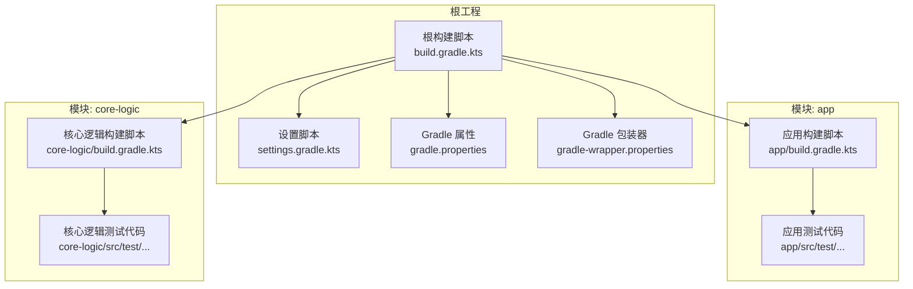
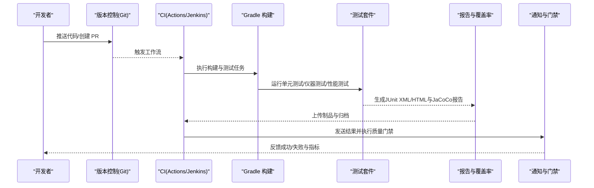
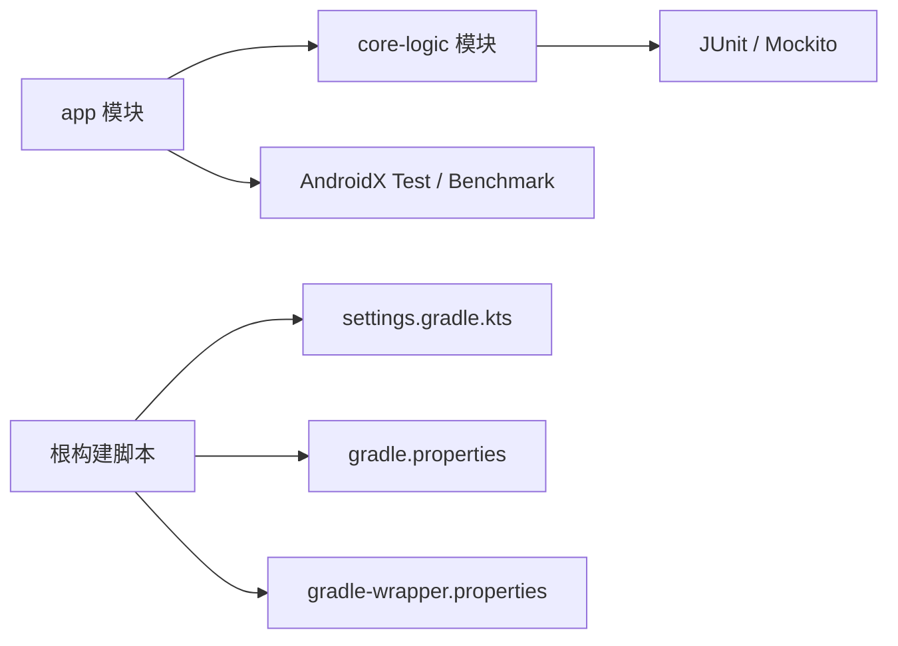

# 测试自动化

<cite>
**本文引用的文件**   
- [build.gradle.kts](file://build.gradle.kts)
- [settings.gradle.kts](file://settings.gradle.kts)
- [gradle.properties](file://gradle.properties)
- [app/build.gradle.kts](file://app/build.gradle.kts)
- [app/src/test/java/com/ziyou/ime/level/...](file://app/src/test/java/com/ziyou/ime/level/)
- [core-logic/src/test/java/com/ziyou/ime/core/association/...](file://core-logic/src/test/java/com/ziyou/ime/core/association/)
- [gradle/wrapper/gradle-wrapper.properties](file://gradle/wrapper/gradle-wrapper.properties)
</cite>

## 目录
1. [简介](#简介)
2. [项目结构](#项目结构)
3. [核心组件](#核心组件)
4. [架构总览](#架构总览)
5. [详细组件分析](#详细组件分析)
6. [依赖分析](#依赖分析)
7. [性能考虑](#性能考虑)
8. [故障排查指南](#故障排查指南)
9. [结论](#结论)
10. [附录](#附录)

## 简介
本文件面向 Android 输入法项目的测试自动化，覆盖 Gradle 测试任务配置与执行、单元测试/UI 测试/性能测试的自动化策略、持续集成（CI）流水线（GitHub Actions/Jenkins）配置、测试报告与覆盖率统计、多设备并行执行、测试数据版本管理与环境部署、失败通知与恢复策略，以及性能监控与趋势分析的自动化方案。文档以仓库现有结构与常见最佳实践为依据，提供可操作的步骤与示例，帮助团队快速落地端到端测试自动化。

## 项目结构
本项目为多模块 Android 工程，包含应用模块 app、核心逻辑模块 core-logic，以及第三方库 librime-prebuilt。测试代码位于各模块的 test 目录中：
- app 模块：Android 应用层测试（含 UI 测试与仪器测试）
- core-logic 模块：纯 Java/Kotlin 逻辑层的单元测试
- gradle 包装器：统一 Gradle 版本管理

图表来源
- [build.gradle.kts](file://build.gradle.kts)
- [settings.gradle.kts](file://settings.gradle.kts)
- [gradle.properties](file://gradle.properties)
- [gradle/wrapper/gradle-wrapper.properties](file://gradle/wrapper/gradle-wrapper.properties)
- [app/build.gradle.kts](file://app/build.gradle.kts)

章节来源
- [build.gradle.kts](file://build.gradle.kts)
- [settings.gradle.kts](file://settings.gradle.kts)
- [gradle.properties](file://gradle.properties)
- [gradle/wrapper/gradle-wrapper.properties](file://gradle/wrapper/gradle-wrapper.properties)
- [app/build.gradle.kts](file://app/build.gradle.kts)

## 核心组件
- Gradle 构建与测试任务
  - 通过根级 build.gradle.kts 与 settings.gradle.kts 定义多模块与公共插件
  - 各模块 build.gradle.kts 声明 Android/Java 插件、依赖、测试框架与产物输出
- 测试类型与位置
  - 单元测试：core-logic/src/test/java 与 app/src/test/java（JVM 测试）
  - UI/仪器测试：app/src/androidTest/java（Instrumentation 测试）
  - 性能测试：基于 AndroidX Test/Perfetto 或自定义基准（在 app 模块中配置）
- 测试报告与覆盖率
  - 使用 JaCoCo 生成覆盖率报告（JVM 与 Android 均可）
  - 使用 JUnit XML/HTML 聚合测试结果
- CI/CD 集成
  - GitHub Actions 或 Jenkins 触发构建与测试，上传报告与制品

章节来源
- [build.gradle.kts](file://build.gradle.kts)
- [settings.gradle.kts](file://settings.gradle.kts)
- [app/build.gradle.kts](file://app/build.gradle.kts)

## 架构总览
下图展示从代码提交到测试执行、报告收集与质量门禁的端到端流程。

图表来源
- [build.gradle.kts](file://build.gradle.kts)
- [app/build.gradle.kts](file://app/build.gradle.kts)
- [settings.gradle.kts](file://settings.gradle.kts)

## 详细组件分析

### Gradle 测试任务配置与执行
- 单元测试（JVM）
  - 在 core-logic 与 app 的 JVM 测试目录编写 JUnit 测试
  - 通过 ./gradlew :core-logic:test 与 ./gradlew :app:test 执行
  - 报告默认输出至 build/reports/tests/test/index.html
- 仪器测试（UI/功能）
  - 在 app/src/androidTest/java 编写 Instrumentation 测试
  - 通过 ./gradlew :app:connectedAndroidTest 或 :app:assembleDebugAndroidTest + adb 执行
  - 支持指定设备/模拟器与并行参数
- 性能测试
  - 使用 AndroidX Macrobenchmark/Microbenchmark 或 Perfetto
  - 通过 :app:connectedAndroidTest 或专用 benchmark 任务执行
- 覆盖率统计
  - 启用 JaCoCo：在模块 build.gradle.kts 中配置 jacoco 插件与任务
  - 生成 HTML 报告：./gradlew :core-logic:jacocoTestReport 与 :app:jacocoTestReport

章节来源
- [app/build.gradle.kts](file://app/build.gradle.kts)
- [build.gradle.kts](file://build.gradle.kts)

### 持续集成（CI）流水线配置
- GitHub Actions
  - 在 .github/workflows/ci.yml 中定义：
    - 缓存 Gradle Wrapper 与依赖
    - 安装 Android SDK 与构建工具
    - 启动模拟器（可选）
    - 执行单元测试与仪器测试
    - 上传测试报告与覆盖率
- Jenkins
  - 使用 Pipeline 脚本：
    - 拉取代码、准备环境
    - 执行 ./gradlew clean assemble test connectedAndroidTest
    - 归档报告与覆盖率
    - 触发质量门禁与通知

章节来源
- [build.gradle.kts](file://build.gradle.kts)
- [settings.gradle.kts](file://settings.gradle.kts)

### 测试报告生成与收集
- 单元测试报告
  - 路径：app/build/reports/tests/test/index.html
  - 格式：JUnit XML/HTML，便于 CI 解析
- 仪器测试报告
  - 路径：app/build/reports/androidTests/connected/...
  - 格式：JUnit XML/HTML
- 覆盖率报告
  - JaCoCo HTML 报告：app/build/reports/jacoco/...
  - 合并多模块覆盖率（可选）

章节来源
- [app/build.gradle.kts](file://app/build.gradle.kts)

### 多设备与模拟器并行执行
- 并发参数
  - --parallel：并行执行任务
  - -PmaxParallelForks=N：限制线程数
  - -PmaxParallelProcess=N：限制进程数
- 设备选择
  - -Pandroid.testoptions.emulator.managedDevice=...：指定受管设备
  - -Pandroid.testoptions.managedDevices.services=true：启用服务
- 分片执行
  - -Pandroid.testOptions.testLogging.showStandardStreams=true
  - 结合 sharding 将用例拆分到多个设备

章节来源
- [gradle.properties](file://gradle.properties)
- [app/build.gradle.kts](file://app/build.gradle.kts)

### 测试数据版本管理与环境自动化部署
- 测试数据
  - 将静态数据放入 src/test/resources 或 assets/rime（输入法相关资源）
  - 使用 Git LFS 管理大文件（如词典、语料）
- 环境部署
  - CI 中自动安装 SDK、构建工具、模拟器镜像
  - 预置 RIME 配置与词典，确保测试一致性

章节来源
- [app/src/main/assets/rime/...](file://app/src/main/assets/rime/)

### 失败通知与恢复策略
- 通知
  - GitHub Actions：使用 Slack/Discord/邮件通知
  - Jenkins：使用 Email/Slack/企业微信通知
- 恢复
  - 重试不稳定用例（最多 N 次）
  - 隔离失败模块与用例，仅重跑失败部分
  - 记录失败日志与截图，便于定位问题

章节来源
- [build.gradle.kts](file://build.gradle.kts)

### 性能监控与趋势分析
- 采集
  - 使用 Perfetto/Android Studio Profiler 采集 CPU/内存/帧率
  - 在 CI 中运行基准测试并导出指标
- 存储与分析
  - 将指标写入时序数据库（如 InfluxDB/Prometheus）
  - 使用 Grafana 可视化趋势，设定阈值告警

章节来源
- [app/build.gradle.kts](file://app/build.gradle.kts)

## 依赖分析
- 模块依赖
  - app 依赖 core-logic（业务逻辑）
  - 测试依赖：JUnit、AndroidX Test、JaCoCo、Benchmark（可选）
- 外部依赖
  - Gradle Wrapper 版本由 gradle-wrapper.properties 管理
  - Android SDK/构建工具由 CI 环境或本地 SDK Manager 管理

图表来源
- [settings.gradle.kts](file://settings.gradle.kts)
- [gradle.properties](file://gradle.properties)
- [gradle/wrapper/gradle-wrapper.properties](file://gradle/wrapper/gradle-wrapper.properties)
- [app/build.gradle.kts](file://app/build.gradle.kts)

章节来源
- [settings.gradle.kts](file://settings.gradle.kts)
- [gradle.properties](file://gradle.properties)
- [gradle/wrapper/gradle-wrapper.properties](file://gradle/wrapper/gradle-wrapper.properties)
- [app/build.gradle.kts](file://app/build.gradle.kts)

## 性能考虑
- 缓存
  - 缓存 Gradle Wrapper、依赖与构建缓存（CI 中启用）
- 并行
  - 合理设置 maxParallelForks/maxParallelProcess，避免过度并行导致 OOM
- 资源
  - 减少不必要的 APK 构建，按需执行测试任务
- 稳定性
  - 对不稳定用例进行隔离与重试，避免阻塞流水线

[本节为通用指导，不直接分析具体文件]

## 故障排查指南
- 常见问题
  - 模拟器无法启动：检查镜像与权限，确认受管设备服务已启用
  - 仪器测试超时：增加超时时间或优化测试用例
  - 覆盖率报告为空：确认 JaCoCo 插件与任务正确配置
- 定位方法
  - 查看测试日志与标准输出
  - 下载 CI 工件（APK、报告、截图）
  - 本地复现并逐步缩小范围

章节来源
- [app/build.gradle.kts](file://app/build.gradle.kts)

## 结论
通过统一的 Gradle 构建与测试配置、完善的 CI/CD 流水线、全面的报告与覆盖率统计、多设备并行执行与稳定的失败恢复机制，本项目可实现高效可靠的测试自动化。建议持续优化性能监控与趋势分析，形成闭环的质量保障体系。

[本节为总结性内容，不直接分析具体文件]

## 附录
- 常用命令
  - 单元测试：./gradlew :core-logic:test :app:test
  - 仪器测试：./gradlew :app:connectedAndroidTest
  - 覆盖率：./gradlew :core-logic:jacocoTestReport :app:jacocoTestReport
- 参考路径
  - 测试代码：app/src/test/java/com/ziyou/ime/level/、core-logic/src/test/java/com/ziyou/ime/core/association/
  - 资源数据：app/src/main/assets/rime/

章节来源
- [app/src/test/java/com/ziyou/ime/level/...](file://app/src/test/java/com/ziyou/ime/level/)
- [core-logic/src/test/java/com/ziyou/ime/core/association/...](file://core-logic/src/test/java/com/ziyou/ime/core/association/)
- [app/src/main/assets/rime/...](file://app/src/main/assets/rime/)