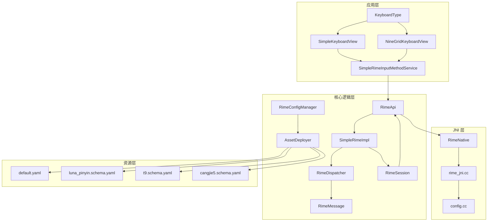
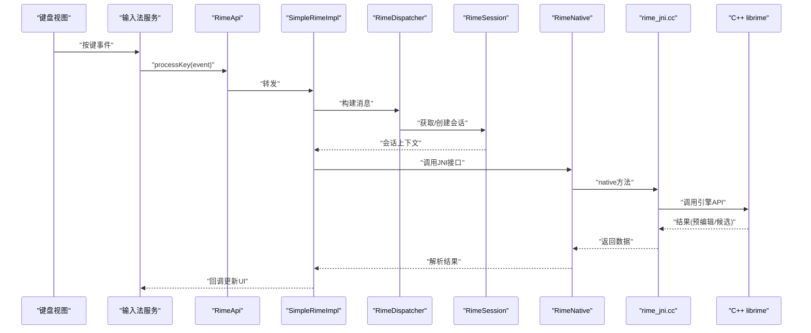
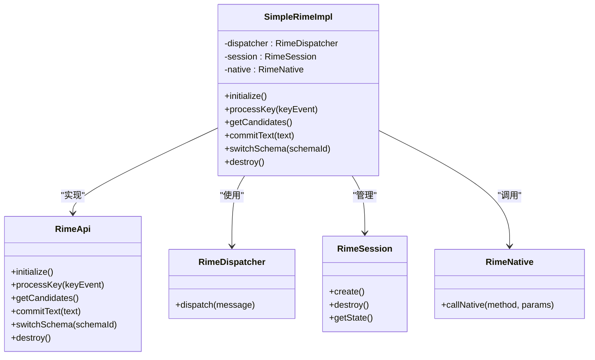
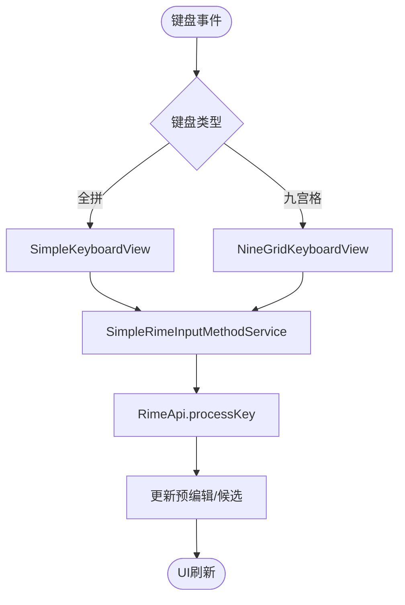
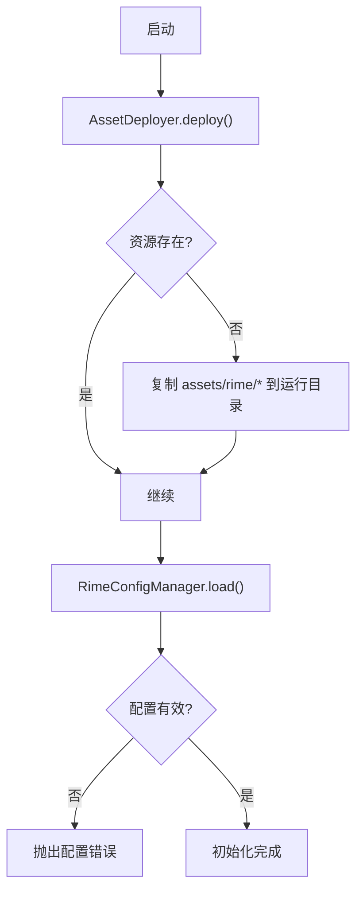
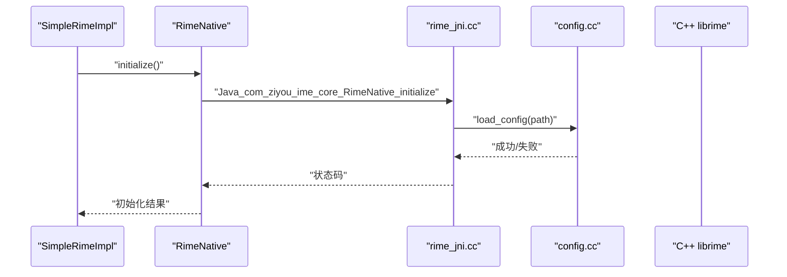
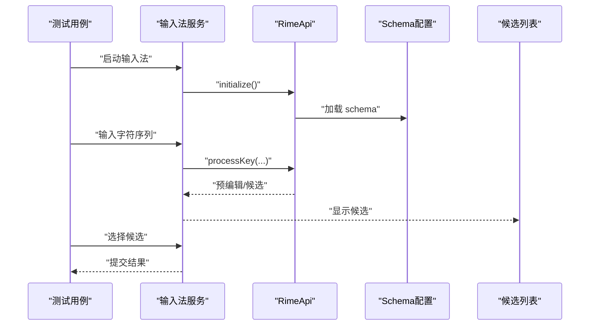
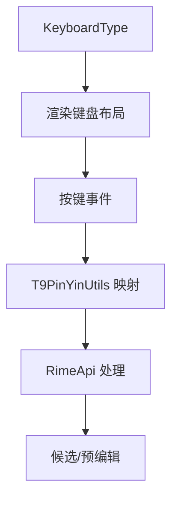
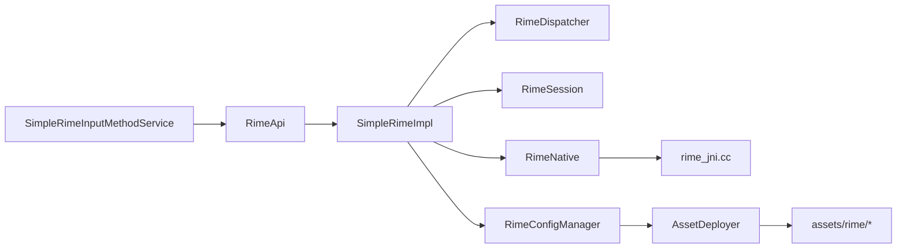

# 集成测试

<cite>
**本文引用的文件**   
- [app/src/main/java/com/ziyou/ime/core/RimeApi.kt](file://app/src/main/java/com/ziyou/ime/core/RimeApi.kt)
- [app/src/main/java/com/ziyou/ime/core/RimeNative.kt](file://app/src/main/java/com/ziyou/ime/core/RimeNative.kt)
- [app/src/main/java/com/ziyou/ime/core/SimpleRimeImpl.kt](file://app/src/main/java/com/ziyou/ime/core/SimpleRimeImpl.kt)
- [app/src/main/java/com/ziyou/ime/core/RimeDispatcher.kt](file://app/src/main/java/com/ziyou/ime/core/RimeDispatcher.kt)
- [app/src/main/java/com/ziyou/ime/core/RimeMessage.kt](file://app/src/main/java/com/ziyou/ime/core/RimeMessage.kt)
- [app/src/main/java/com/ziyou/ime/core/ProtoTypes.kt](file://app/src/main/java/com/ziyou/ime/core/ProtoTypes.kt)
- [app/src/main/java/com/ziyou/ime/daemon/RimeSession.kt](file://app/src/main/java/com/ziyou/ime/daemon/RimeSession.kt)
- [app/src/main/java/com/ziyou/ime/config/RimeConfigManager.kt](file://app/src/main/java/com/ziyou/ime/config/RimeConfigManager.kt)
- [app/src/main/java/com/ziyou/ime/config/AssetDeployer.kt](file://app/src/main/java/com/ziyou/ime/config/AssetDeployer.kt)
- [app/src/main/java/com/ziyou/ime/ime/SimpleRimeInputMethodService.kt](file://app/src/main/java/com/ziyou/ime/ime/SimpleRimeInputMethodService.kt)
- [app/src/main/java/com/ziyou/ime/ime/KeyboardType.kt](file://app/src/main/java/com/ziyou/ime/ime/KeyboardType.kt)
- [app/src/main/java/com/ziyou/ime/ime/NineGridKeyboardView.kt](file://app/src/main/java/com/ziyou/ime/ime/NineGridKeyboardView.kt)
- [app/src/main/java/com/ziyou/ime/ime/SimpleKeyboardView.kt](file://app/src/main/java/com/ziyou/ime/ime/SimpleKeyboardView.kt)
- [app/src/main/java/com/ziyou/ime/util/T9PinYinUtils.kt](file://app/src/main/java/com/ziyou/ime/util/T9PinYinUtils.kt)
- [app/src/main/jni/librime_jni/rime_jni.cc](file://app/src/main/jni/librime_jni/rime_jni.cc)
- [app/src/main/jni/librime_jni/config.cc](file://app/src/main/jni/librime_jni/config.cc)
- [app/src/main/assets/rime/default.yaml](file://app/src/main/assets/rime/default.yaml)
- [app/src/main/assets/rime/luna_pinyin.schema.yaml](file://app/src/main/assets/rime/luna_pinyin.schema.yaml)
- [app/src/main/assets/rime/t9.schema.yaml](file://app/src/main/assets/rime/t9.schema.yaml)
- [app/src/main/assets/rime/cangjie5.schema.yaml](file://app/src/main/assets/rime/cangjie5.schema.yaml)
- [app/src/main/res/xml/input_method.xml](file://app/src/main/res/xml/input_method.xml)
- [librime-prebuilt/librime/src/rime_api.h](file://librime-prebuilt/librime/src/rime_api.h)
</cite>

## 目录
1. [简介](#简介)
2. [项目结构](#项目结构)
3. [核心组件](#核心组件)
4. [架构总览](#架构总览)
5. [详细组件分析](#详细组件分析)
6. [依赖关系分析](#依赖关系分析)
7. [性能考虑](#性能考虑)
8. [故障排查指南](#故障排查指南)
9. [结论](#结论)
10. [附录](#附录)

## 简介
本文件面向 Rime 引擎与 Android 应用的整体集成测试，覆盖 JNI 接口调用、配置文件加载、资源管理、端到端用户输入流程（全拼、五笔、九宫格）、会话状态维护、API 集成测试以及调试技巧。文档以“从上层输入法服务到底层 C++ 引擎”的视角，给出可操作的测试方案与示例路径，帮助读者快速搭建测试环境并编写稳定可靠的集成测试用例。

## 项目结构
本项目采用分层组织：
- 应用层：输入法服务、键盘视图、设置界面等
- 核心逻辑层：Rime API 封装、消息分发、会话管理、配置与资源部署
- JNI 层：Android 与 C++ librime 的桥接
- 资源层：assets 下的 schema/dict 与 default 配置

图表来源
- [app/src/main/java/com/ziyou/ime/ime/SimpleRimeInputMethodService.kt](file://app/src/main/java/com/ziyou/ime/ime/SimpleRimeInputMethodService.kt)
- [app/src/main/java/com/ziyou/ime/core/RimeApi.kt](file://app/src/main/java/com/ziyou/ime/core/RimeApi.kt)
- [app/src/main/java/com/ziyou/ime/core/SimpleRimeImpl.kt](file://app/src/main/java/com/ziyou/ime/core/SimpleRimeImpl.kt)
- [app/src/main/java/com/ziyou/ime/core/RimeDispatcher.kt](file://app/src/main/java/com/ziyou/ime/core/RimeDispatcher.kt)
- [app/src/main/java/com/ziyou/ime/core/RimeMessage.kt](file://app/src/main/java/com/ziyou/ime/core/RimeMessage.kt)
- [app/src/main/java/com/ziyou/ime/daemon/RimeSession.kt](file://app/src/main/java/com/ziyou/ime/daemon/RimeSession.kt)
- [app/src/main/java/com/ziyou/ime/config/RimeConfigManager.kt](file://app/src/main/java/com/ziyou/ime/config/RimeConfigManager.kt)
- [app/src/main/java/com/ziyou/ime/config/AssetDeployer.kt](file://app/src/main/java/com/ziyou/ime/config/AssetDeployer.kt)
- [app/src/main/jni/librime_jni/rime_jni.cc](file://app/src/main/jni/librime_jni/rime_jni.cc)
- [app/src/main/jni/librime_jni/config.cc](file://app/src/main/jni/librime_jni/config.cc)
- [app/src/main/assets/rime/default.yaml](file://app/src/main/assets/rime/default.yaml)
- [app/src/main/assets/rime/luna_pinyin.schema.yaml](file://app/src/main/assets/rime/luna_pinyin.schema.yaml)
- [app/src/main/assets/rime/t9.schema.yaml](file://app/src/main/assets/rime/t9.schema.yaml)
- [app/src/main/assets/rime/cangjie5.schema.yaml](file://app/src/main/assets/rime/cangjie5.schema.yaml)

章节来源
- [app/src/main/java/com/ziyou/ime/ime/SimpleRimeInputMethodService.kt](file://app/src/main/java/com/ziyou/ime/ime/SimpleRimeInputMethodService.kt)
- [app/src/main/java/com/ziyou/ime/core/RimeApi.kt](file://app/src/main/java/com/ziyou/ime/core/RimeApi.kt)
- [app/src/main/java/com/ziyou/ime/core/SimpleRimeImpl.kt](file://app/src/main/java/com/ziyou/ime/core/SimpleRimeImpl.kt)
- [app/src/main/java/com/ziyou/ime/core/RimeDispatcher.kt](file://app/src/main/java/com/ziyou/ime/core/RimeDispatcher.kt)
- [app/src/main/java/com/ziyou/ime/core/RimeMessage.kt](file://app/src/main/java/com/ziyou/ime/core/RimeMessage.kt)
- [app/src/main/java/com/ziyou/ime/daemon/RimeSession.kt](file://app/src/main/java/com/ziyou/ime/daemon/RimeSession.kt)
- [app/src/main/java/com/ziyou/ime/config/RimeConfigManager.kt](file://app/src/main/java/com/ziyou/ime/config/RimeConfigManager.kt)
- [app/src/main/java/com/ziyou/ime/config/AssetDeployer.kt](file://app/src/main/java/com/ziyou/ime/config/AssetDeployer.kt)
- [app/src/main/jni/librime_jni/rime_jni.cc](file://app/src/main/jni/librime_jni/rime_jni.cc)
- [app/src/main/jni/librime_jni/config.cc](file://app/src/main/jni/librime_jni/config.cc)
- [app/src/main/assets/rime/default.yaml](file://app/src/main/assets/rime/default.yaml)
- [app/src/main/assets/rime/luna_pinyin.schema.yaml](file://app/src/main/assets/rime/luna_pinyin.schema.yaml)
- [app/src/main/assets/rime/t9.schema.yaml](file://app/src/main/assets/rime/t9.schema.yaml)
- [app/src/main/assets/rime/cangjie5.schema.yaml](file://app/src/main/assets/rime/cangjie5.schema.yaml)

## 核心组件
- RimeApi：对外暴露的输入法核心能力抽象，定义初始化、输入处理、候选词获取、提交、切换模式等关键方法。
- SimpleRimeImpl：RimeApi 的具体实现，负责调度消息、维护会话上下文、与 JNI 交互。
- RimeDispatcher：消息分发器，将上层事件转换为内部消息模型并路由到对应处理器。
- RimeMessage：统一的消息数据结构，承载键值、操作类型、参数等。
- RimeSession：会话生命周期管理，负责创建/销毁会话、状态隔离、持久化。
- RimeConfigManager：配置加载与校验，确保 schema/dict/default 正确部署。
- AssetDeployer：资源部署器，将 assets 中的 rime 资源复制到运行时目录。
- RimeNative：JNI 入口封装，调用底层 C++ 接口。
- rime_jni.cc/config.cc：JNI 与 C++ 层的桥接与配置处理。

章节来源
- [app/src/main/java/com/ziyou/ime/core/RimeApi.kt](file://app/src/main/java/com/ziyou/ime/core/RimeApi.kt)
- [app/src/main/java/com/ziyou/ime/core/SimpleRimeImpl.kt](file://app/src/main/java/com/ziyou/ime/core/SimpleRimeImpl.kt)
- [app/src/main/java/com/ziyou/ime/core/RimeDispatcher.kt](file://app/src/main/java/com/ziyou/ime/core/RimeDispatcher.kt)
- [app/src/main/java/com/ziyou/ime/core/RimeMessage.kt](file://app/src/main/java/com/ziyou/ime/core/RimeMessage.kt)
- [app/src/main/java/com/ziyou/ime/daemon/RimeSession.kt](file://app/src/main/java/com/ziyou/ime/daemon/RimeSession.kt)
- [app/src/main/java/com/ziyou/ime/config/RimeConfigManager.kt](file://app/src/main/java/com/ziyou/ime/config/RimeConfigManager.kt)
- [app/src/main/java/com/ziyou/ime/config/AssetDeployer.kt](file://app/src/main/java/com/ziyou/ime/config/AssetDeployer.kt)
- [app/src/main/java/com/ziyou/ime/core/RimeNative.kt](file://app/src/main/java/com/ziyou/ime/core/RimeNative.kt)
- [app/src/main/jni/librime_jni/rime_jni.cc](file://app/src/main/jni/librime_jni/rime_jni.cc)
- [app/src/main/jni/librime_jni/config.cc](file://app/src/main/jni/librime_jni/config.cc)

## 架构总览
下图展示了从输入法服务到 C++ 引擎的完整调用链，包括配置部署、会话创建、输入处理与候选返回。

图表来源
- [app/src/main/java/com/ziyou/ime/ime/SimpleRimeInputMethodService.kt](file://app/src/main/java/com/ziyou/ime/ime/SimpleRimeInputMethodService.kt)
- [app/src/main/java/com/ziyou/ime/core/RimeApi.kt](file://app/src/main/java/com/ziyou/ime/core/RimeApi.kt)
- [app/src/main/java/com/ziyou/ime/core/SimpleRimeImpl.kt](file://app/src/main/java/com/ziyou/ime/core/SimpleRimeImpl.kt)
- [app/src/main/java/com/ziyou/ime/core/RimeDispatcher.kt](file://app/src/main/java/com/ziyou/ime/core/RimeDispatcher.kt)
- [app/src/main/java/com/ziyou/ime/daemon/RimeSession.kt](file://app/src/main/java/com/ziyou/ime/daemon/RimeSession.kt)
- [app/src/main/java/com/ziyou/ime/core/RimeNative.kt](file://app/src/main/java/com/ziyou/ime/core/RimeNative.kt)
- [app/src/main/jni/librime_jni/rime_jni.cc](file://app/src/main/jni/librime_jni/rime_jni.cc)

## 详细组件分析

### RimeApi 与 SimpleRimeImpl 集成要点
- 职责划分：RimeApi 定义稳定接口；SimpleRimeImpl 负责具体实现与错误处理。
- 关键流程：初始化引擎、加载配置、创建会话、处理输入、获取候选、提交文本、切换模式。
- 错误处理：对 JNI 异常、空结果、无效参数进行捕获与上报。

图表来源
- [app/src/main/java/com/ziyou/ime/core/RimeApi.kt](file://app/src/main/java/com/ziyou/ime/core/RimeApi.kt)
- [app/src/main/java/com/ziyou/ime/core/SimpleRimeImpl.kt](file://app/src/main/java/com/ziyou/ime/core/SimpleRimeImpl.kt)
- [app/src/main/java/com/ziyou/ime/core/RimeDispatcher.kt](file://app/src/main/java/com/ziyou/ime/core/RimeDispatcher.kt)
- [app/src/main/java/com/ziyou/ime/daemon/RimeSession.kt](file://app/src/main/java/com/ziyou/ime/daemon/RimeSession.kt)
- [app/src/main/java/com/ziyou/ime/core/RimeNative.kt](file://app/src/main/java/com/ziyou/ime/core/RimeNative.kt)

章节来源
- [app/src/main/java/com/ziyou/ime/core/RimeApi.kt](file://app/src/main/java/com/ziyou/ime/core/RimeApi.kt)
- [app/src/main/java/com/ziyou/ime/core/SimpleRimeImpl.kt](file://app/src/main/java/com/ziyou/ime/core/SimpleRimeImpl.kt)

### 输入法服务与键盘视图集成
- 输入法服务负责生命周期、输入法窗口、焦点管理与事件派发。
- 键盘视图根据 KeyboardType 渲染不同布局（全拼、九宫格），并将按键事件回传给服务。

图表来源
- [app/src/main/java/com/ziyou/ime/ime/SimpleRimeInputMethodService.kt](file://app/src/main/java/com/ziyou/ime/ime/SimpleRimeInputMethodService.kt)
- [app/src/main/java/com/ziyou/ime/ime/SimpleKeyboardView.kt](file://app/src/main/java/com/ziyou/ime/ime/SimpleKeyboardView.kt)
- [app/src/main/java/com/ziyou/ime/ime/NineGridKeyboardView.kt](file://app/src/main/java/com/ziyou/ime/ime/NineGridKeyboardView.kt)
- [app/src/main/java/com/ziyou/ime/ime/KeyboardType.kt](file://app/src/main/java/com/ziyou/ime/ime/KeyboardType.kt)

章节来源
- [app/src/main/java/com/ziyou/ime/ime/SimpleRimeInputMethodService.kt](file://app/src/main/java/com/ziyou/ime/ime/SimpleRimeInputMethodService.kt)
- [app/src/main/java/com/ziyou/ime/ime/SimpleKeyboardView.kt](file://app/src/main/java/com/ziyou/ime/ime/SimpleKeyboardView.kt)
- [app/src/main/java/com/ziyou/ime/ime/NineGridKeyboardView.kt](file://app/src/main/java/com/ziyou/ime/ime/NineGridKeyboardView.kt)
- [app/src/main/java/com/ziyou/ime/ime/KeyboardType.kt](file://app/src/main/java/com/ziyou/ime/ime/KeyboardType.kt)

### 配置与资源部署
- RimeConfigManager 负责校验与加载 default.yaml、schema 与字典。
- AssetDeployer 将 assets/rime 下资源部署到运行时目录，确保引擎可用。

图表来源
- [app/src/main/java/com/ziyou/ime/config/AssetDeployer.kt](file://app/src/main/java/com/ziyou/ime/config/AssetDeployer.kt)
- [app/src/main/java/com/ziyou/ime/config/RimeConfigManager.kt](file://app/src/main/java/com/ziyou/ime/config/RimeConfigManager.kt)
- [app/src/main/assets/rime/default.yaml](file://app/src/main/assets/rime/default.yaml)
- [app/src/main/assets/rime/luna_pinyin.schema.yaml](file://app/src/main/assets/rime/luna_pinyin.schema.yaml)
- [app/src/main/assets/rime/t9.schema.yaml](file://app/src/main/assets/rime/t9.schema.yaml)
- [app/src/main/assets/rime/cangjie5.schema.yaml](file://app/src/main/assets/rime/cangjie5.schema.yaml)

章节来源
- [app/src/main/java/com/ziyou/ime/config/AssetDeployer.kt](file://app/src/main/java/com/ziyou/ime/config/AssetDeployer.kt)
- [app/src/main/java/com/ziyou/ime/config/RimeConfigManager.kt](file://app/src/main/java/com/ziyou/ime/config/RimeConfigManager.kt)
- [app/src/main/assets/rime/default.yaml](file://app/src/main/assets/rime/default.yaml)
- [app/src/main/assets/rime/luna_pinyin.schema.yaml](file://app/src/main/assets/rime/luna_pinyin.schema.yaml)
- [app/src/main/assets/rime/t9.schema.yaml](file://app/src/main/assets/rime/t9.schema.yaml)
- [app/src/main/assets/rime/cangjie5.schema.yaml](file://app/src/main/assets/rime/cangjie5.schema.yaml)

### JNI 接口与 C++ 引擎集成
- RimeNative 封装 native 方法，rime_jni.cc 提供 Java/C++ 互操作。
- config.cc 处理配置相关调用，如部署、校验、路径解析。

图表来源
- [app/src/main/java/com/ziyou/ime/core/RimeNative.kt](file://app/src/main/java/com/ziyou/ime/core/RimeNative.kt)
- [app/src/main/jni/librime_jni/rime_jni.cc](file://app/src/main/jni/librime_jni/rime_jni.cc)
- [app/src/main/jni/librime_jni/config.cc](file://app/src/main/jni/librime_jni/config.cc)

章节来源
- [app/src/main/java/com/ziyou/ime/core/RimeNative.kt](file://app/src/main/java/com/ziyou/ime/core/RimeNative.kt)
- [app/src/main/jni/librime_jni/rime_jni.cc](file://app/src/main/jni/librime_jni/rime_jni.cc)
- [app/src/main/jni/librime_jni/config.cc](file://app/src/main/jni/librime_jni/config.cc)

### 端到端测试流程（全拼、五笔、九宫格）
- 全拼：通过 luna_pinyin.schema 进行拼音输入与候选选择。
- 五笔：通过 cangjie5.schema 进行字形编码输入。
- 九宫格：通过 t9.schema 与 T9 映射工具进行数字键盘输入。

图表来源
- [app/src/main/java/com/ziyou/ime/ime/SimpleRimeInputMethodService.kt](file://app/src/main/java/com/ziyou/ime/ime/SimpleRimeInputMethodService.kt)
- [app/src/main/java/com/ziyou/ime/core/RimeApi.kt](file://app/src/main/java/com/ziyou/ime/core/RimeApi.kt)
- [app/src/main/assets/rime/luna_pinyin.schema.yaml](file://app/src/main/assets/rime/luna_pinyin.schema.yaml)
- [app/src/main/assets/rime/cangjie5.schema.yaml](file://app/src/main/assets/rime/cangjie5.schema.yaml)
- [app/src/main/assets/rime/t9.schema.yaml](file://app/src/main/assets/rime/t9.schema.yaml)

章节来源
- [app/src/main/java/com/ziyou/ime/ime/SimpleRimeInputMethodService.kt](file://app/src/main/java/com/ziyou/ime/ime/SimpleRimeInputMethodService.kt)
- [app/src/main/java/com/ziyou/ime/core/RimeApi.kt](file://app/src/main/java/com/ziyou/ime/core/RimeApi.kt)
- [app/src/main/assets/rime/luna_pinyin.schema.yaml](file://app/src/main/assets/rime/luna_pinyin.schema.yaml)
- [app/src/main/assets/rime/cangjie5.schema.yaml](file://app/src/main/assets/rime/cangjie5.schema.yaml)
- [app/src/main/assets/rime/t9.schema.yaml](file://app/src/main/assets/rime/t9.schema.yaml)

### 输入法模式切换与 T9 辅助
- KeyboardType 决定键盘布局与输入策略。
- T9PinYinUtils 提供数字到拼音首字母映射，辅助九宫格输入。

图表来源
- [app/src/main/java/com/ziyou/ime/ime/KeyboardType.kt](file://app/src/main/java/com/ziyou/ime/ime/KeyboardType.kt)
- [app/src/main/java/com/ziyou/ime/util/T9PinYinUtils.kt](file://app/src/main/java/com/ziyou/ime/util/T9PinYinUtils.kt)
- [app/src/main/java/com/ziyou/ime/core/RimeApi.kt](file://app/src/main/java/com/ziyou/ime/core/RimeApi.kt)

章节来源
- [app/src/main/java/com/ziyou/ime/ime/KeyboardType.kt](file://app/src/main/java/com/ziyou/ime/ime/KeyboardType.kt)
- [app/src/main/java/com/ziyou/ime/util/T9PinYinUtils.kt](file://app/src/main/java/com/ziyou/ime/util/T9PinYinUtils.kt)
- [app/src/main/java/com/ziyou/ime/core/RimeApi.kt](file://app/src/main/java/com/ziyou/ime/core/RimeApi.kt)

## 依赖关系分析
- 上层模块依赖核心逻辑层（RimeApi/SimpleRimeImpl），核心逻辑层依赖 JNI 与配置管理。
- 资源层由配置管理器驱动部署，确保 schema/dict 可用。
- 输入法服务与键盘视图解耦，通过 KeyboardType 控制行为。

图表来源
- [app/src/main/java/com/ziyou/ime/ime/SimpleRimeInputMethodService.kt](file://app/src/main/java/com/ziyou/ime/ime/SimpleRimeInputMethodService.kt)
- [app/src/main/java/com/ziyou/ime/core/RimeApi.kt](file://app/src/main/java/com/ziyou/ime/core/RimeApi.kt)
- [app/src/main/java/com/ziyou/ime/core/SimpleRimeImpl.kt](file://app/src/main/java/com/ziyou/ime/core/SimpleRimeImpl.kt)
- [app/src/main/java/com/ziyou/ime/core/RimeDispatcher.kt](file://app/src/main/java/com/ziyou/ime/core/RimeDispatcher.kt)
- [app/src/main/java/com/ziyou/ime/daemon/RimeSession.kt](file://app/src/main/java/com/ziyou/ime/daemon/RimeSession.kt)
- [app/src/main/java/com/ziyou/ime/core/RimeNative.kt](file://app/src/main/java/com/ziyou/ime/core/RimeNative.kt)
- [app/src/main/java/com/ziyou/ime/config/RimeConfigManager.kt](file://app/src/main/java/com/ziyou/ime/config/RimeConfigManager.kt)
- [app/src/main/java/com/ziyou/ime/config/AssetDeployer.kt](file://app/src/main/java/com/ziyou/ime/config/AssetDeployer.kt)
- [app/src/main/jni/librime_jni/rime_jni.cc](file://app/src/main/jni/librime_jni/rime_jni.cc)
- [app/src/main/assets/rime/default.yaml](file://app/src/main/assets/rime/default.yaml)

章节来源
- [app/src/main/java/com/ziyou/ime/ime/SimpleRimeInputMethodService.kt](file://app/src/main/java/com/ziyou/ime/ime/SimpleRimeInputMethodService.kt)
- [app/src/main/java/com/ziyou/ime/core/RimeApi.kt](file://app/src/main/java/com/ziyou/ime/core/RimeApi.kt)
- [app/src/main/java/com/ziyou/ime/core/SimpleRimeImpl.kt](file://app/src/main/java/com/ziyou/ime/core/SimpleRimeImpl.kt)
- [app/src/main/java/com/ziyou/ime/config/RimeConfigManager.kt](file://app/src/main/java/com/ziyou/ime/config/RimeConfigManager.kt)
- [app/src/main/java/com/ziyou/ime/config/AssetDeployer.kt](file://app/src/main/java/com/ziyou/ime/config/AssetDeployer.kt)
- [app/src/main/jni/librime_jni/rime_jni.cc](file://app/src/main/jni/librime_jni/rime_jni.cc)

## 性能考虑
- 避免重复初始化：在输入法服务生命周期内复用会话与引擎实例。
- 批量输入处理：合并高频按键事件，减少 JNI 调用次数。
- 资源预热：启动时异步部署资源与加载常用 schema，降低首次延迟。
- 候选缓存：对常见输入序列进行缓存，提升响应速度。
- 内存管理：及时释放不再使用的会话与临时对象，防止泄漏。

[本节为通用指导，不直接分析具体文件]

## 故障排查指南
- 配置加载失败：检查 default.yaml 与 schema 引用是否正确，确认资源已部署到运行目录。
- JNI 崩溃：查看 rime_jni.cc 日志，确认参数传递与内存边界安全。
- 候选为空：验证 schema 与字典是否匹配，检查输入序列是否符合规则。
- 输入法无响应：确认输入法服务已启用，input_method.xml 配置正确。
- 九宫格映射异常：核对 T9PinYinUtils 映射表与 t9.schema 配置一致性。

章节来源
- [app/src/main/jni/librime_jni/rime_jni.cc](file://app/src/main/jni/librime_jni/rime_jni.cc)
- [app/src/main/jni/librime_jni/config.cc](file://app/src/main/jni/librime_jni/config.cc)
- [app/src/main/res/xml/input_method.xml](file://app/src/main/res/xml/input_method.xml)
- [app/src/main/assets/rime/default.yaml](file://app/src/main/assets/rime/default.yaml)
- [app/src/main/assets/rime/luna_pinyin.schema.yaml](file://app/src/main/assets/rime/luna_pinyin.schema.yaml)
- [app/src/main/assets/rime/t9.schema.yaml](file://app/src/main/assets/rime/t9.schema.yaml)
- [app/src/main/java/com/ziyou/ime/util/T9PinYinUtils.kt](file://app/src/main/java/com/ziyou/ime/util/T9PinYinUtils.kt)

## 结论
通过分层设计与清晰的职责划分，Rime 输入法在 Android 平台实现了稳定的集成。本文档提供了从配置部署、JNI 调用、会话管理到端到端测试的完整指南，帮助开发者快速搭建测试环境、编写覆盖多模式的集成测试，并高效定位与解决问题。

[本节为总结性内容，不直接分析具体文件]

## 附录

### 测试环境搭建
- 准备 assets/rime 资源：确保 default.yaml、schema 与字典齐全。
- 配置 input_method.xml：声明输入法服务与能力。
- 初始化顺序：先部署资源，再加载配置，最后初始化引擎与会话。
- 模拟数据：准备典型输入序列与预期候选，用于断言。

章节来源
- [app/src/main/assets/rime/default.yaml](file://app/src/main/assets/rime/default.yaml)
- [app/src/main/assets/rime/luna_pinyin.schema.yaml](file://app/src/main/assets/rime/luna_pinyin.schema.yaml)
- [app/src/main/assets/rime/t9.schema.yaml](file://app/src/main/assets/rime/t9.schema.yaml)
- [app/src/main/assets/rime/cangjie5.schema.yaml](file://app/src/main/assets/rime/cangjie5.schema.yaml)
- [app/src/main/res/xml/input_method.xml](file://app/src/main/res/xml/input_method.xml)

### API 集成测试要点（RimeApi）
- 初始化与销毁：验证 initialize/destroy 的正确性与幂等性。
- 输入处理：覆盖正常输入、退格、空格、标点等场景。
- 候选获取：断言候选列表非空且符合预期。
- 提交文本：验证 commitText 能正确输出到目标输入框。
- 模式切换：验证 switchSchema 后输入行为变化。

章节来源
- [app/src/main/java/com/ziyou/ime/core/RimeApi.kt](file://app/src/main/java/com/ziyou/ime/core/RimeApi.kt)
- [app/src/main/java/com/ziyou/ime/core/SimpleRimeImpl.kt](file://app/src/main/java/com/ziyou/ime/core/SimpleRimeImpl.kt)

### 输入法服务生命周期与会话状态
- 生命周期：onCreate/onStart/onBind/onDestroy 中正确初始化与清理。
- 会话状态：保持预编辑与候选状态一致，避免跨应用污染。
- 事件派发：确保按键事件与候选选择事件正确流转。

章节来源
- [app/src/main/java/com/ziyou/ime/ime/SimpleRimeInputMethodService.kt](file://app/src/main/java/com/ziyou/ime/ime/SimpleRimeInputMethodService.kt)
- [app/src/main/java/com/ziyou/ime/daemon/RimeSession.kt](file://app/src/main/java/com/ziyou/ime/daemon/RimeSession.kt)

### 调试技巧
- 日志采集：在 JNI 与核心逻辑层添加关键日志，便于定位问题。
- 断点调试：在 RimeApi 与 SimpleRimeImpl 的关键方法设置断点。
- 资源校验：使用配置校验工具或脚本验证 schema/dict 有效性。
- 模拟器与真机：在不同设备上验证兼容性。

章节来源
- [app/src/main/jni/librime_jni/rime_jni.cc](file://app/src/main/jni/librime_jni/rime_jni.cc)
- [app/src/main/java/com/ziyou/ime/core/RimeApi.kt](file://app/src/main/java/com/ziyou/ime/core/RimeApi.kt)
- [app/src/main/java/com/ziyou/ime/core/SimpleRimeImpl.kt](file://app/src/main/java/com/ziyou/ime/core/SimpleRimeImpl.kt)

### 参考：C++ librime API
- rime_api.h 定义了 C++ 侧的核心接口，供 JNI 层调用。

章节来源
- [librime-prebuilt/librime/src/rime_api.h](file://librime-prebuilt/librime/src/rime_api.h)