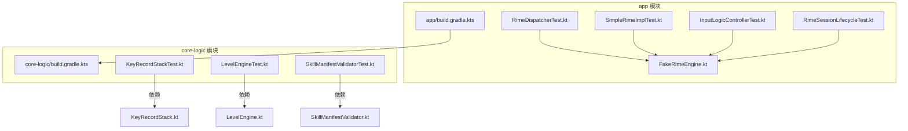
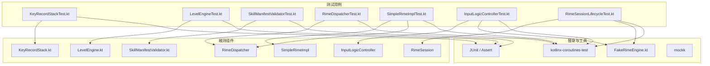
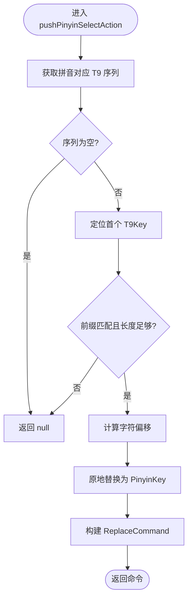
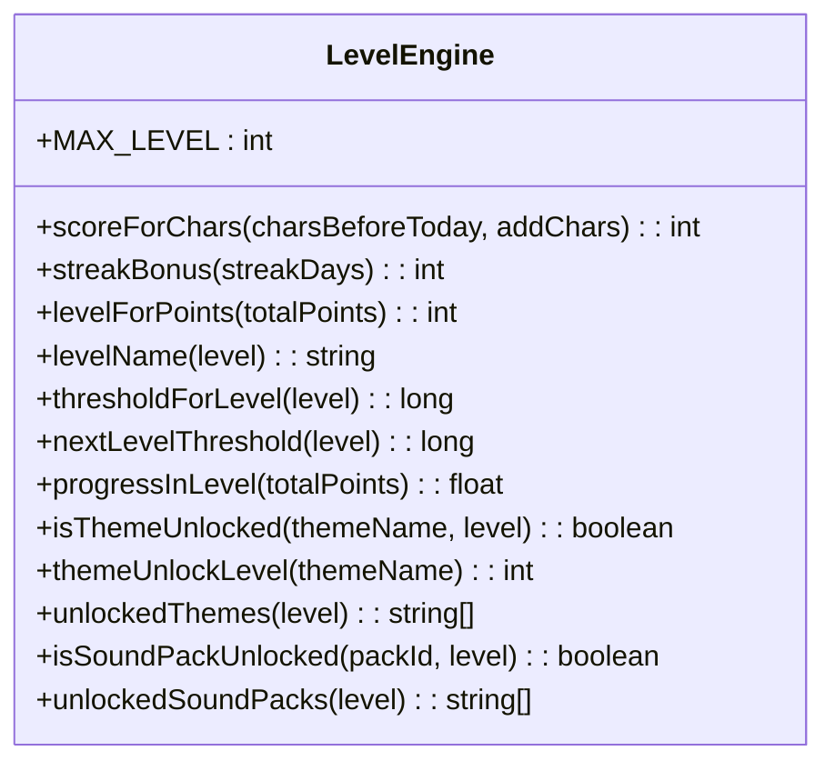
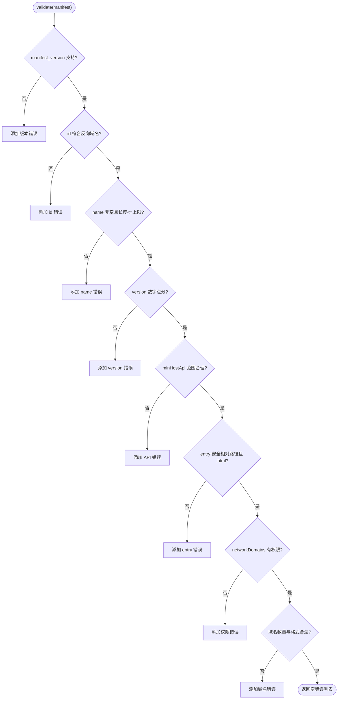
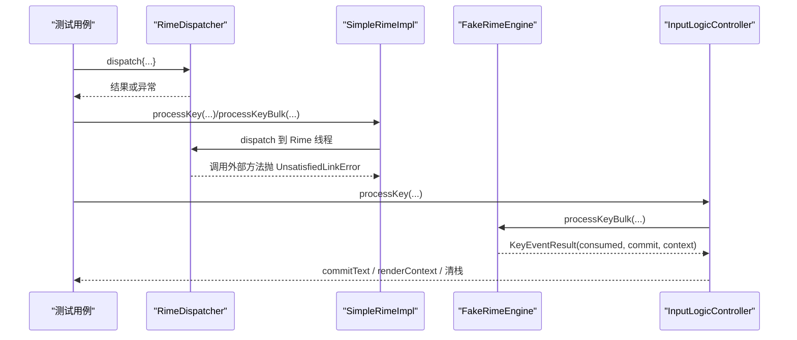
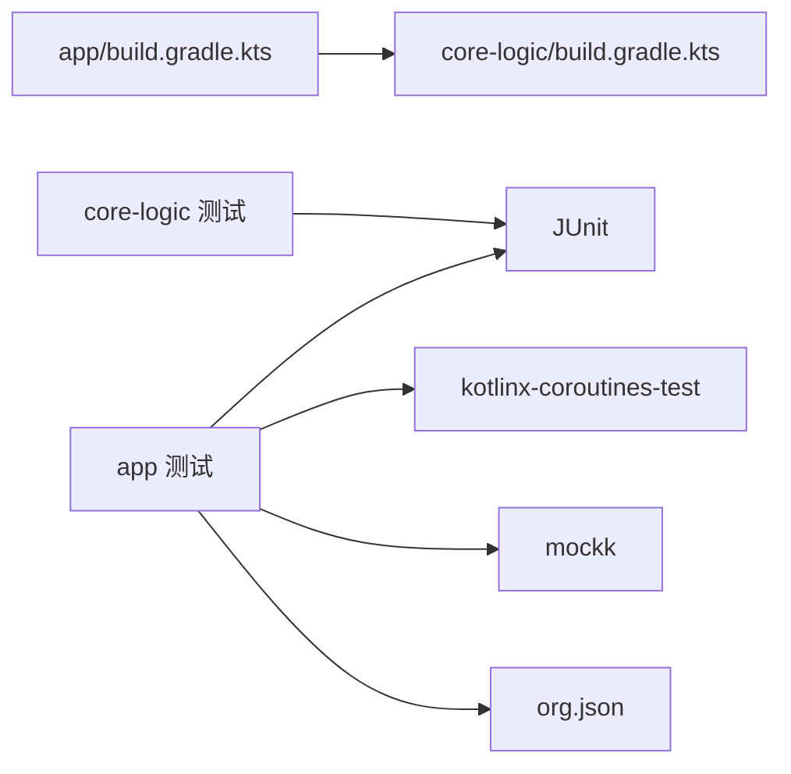

# 单元测试规范

<cite>
**本文引用的文件**   
- [KeyRecordStackTest.kt](file://core-logic/src/test/java/com/ziyou/ime/core/t9/KeyRecordStackTest.kt)
- [LevelEngineTest.kt](file://core-logic/src/test/java/com/ziyou/ime/core/level/LevelEngineTest.kt)
- [SkillManifestValidatorTest.kt](file://core-logic/src/test/java/com/ziyou/ime/core/skill/SkillManifestValidatorTest.kt)
- [RimeDispatcherTest.kt](file://app/src/test/java/com/ziyou/ime/core/RimeDispatcherTest.kt)
- [SimpleRimeImplTest.kt](file://app/src/test/java/com/ziyou/ime/core/SimpleRimeImplTest.kt)
- [InputLogicControllerTest.kt](file://app/src/test/java/com/ziyou/ime/ime/InputLogicControllerTest.kt)
- [RimeSessionLifecycleTest.kt](file://app/src/test/java/com/ziyou/ime/daemon/RimeSessionLifecycleTest.kt)
- [FakeRimeEngine.kt](file://app/src/test/java/com/ziyou/ime/testing/FakeRimeEngine.kt)
- [KeyRecordStack.kt](file://core-logic/src/main/java/com/ziyou/ime/core/t9/KeyRecordStack.kt)
- [LevelEngine.kt](file://core-logic/src/main/java/com/ziyou/ime/core/level/LevelEngine.kt)
- [SkillManifestValidator.kt](file://core-logic/src/main/java/com/ziyou/ime/core/skill/SkillManifestValidator.kt)
- [build.gradle.kts（app）](file://app/build.gradle.kts)
- [build.gradle.kts（core-logic）](file://core-logic/build.gradle.kts)
</cite>

## 目录
1. [引言](#引言)
2. [项目结构](#项目结构)
3. [核心组件](#核心组件)
4. [架构总览](#架构总览)
5. [详细组件分析](#详细组件分析)
6. [依赖分析](#依赖分析)
7. [性能考虑](#性能考虑)
8. [故障排查指南](#故障排查指南)
9. [结论](#结论)
10. [附录](#附录)

## 引言
本规范面向输入法项目的单元测试编写，聚焦以下目标：
- 统一测试命名约定、数据准备与断言风格
- 覆盖关键业务逻辑：九宫格输入状态机、等级计算引擎、技能清单校验
- 协程测试最佳实践：runTest、虚拟时间、调度器隔离
- 覆盖率要求与质量门禁建议
- 常见场景与调试技巧

## 项目结构
本项目采用多模块组织，纯逻辑集中在 core-logic 模块，便于独立运行单元测试；应用层在 app 模块中通过 DI 注入替身进行集成级验证。

图表来源
- [build.gradle.kts（app）:1-192](file://app/build.gradle.kts#L1-L192)
- [build.gradle.kts（core-logic）:1-29](file://core-logic/build.gradle.kts#L1-L29)

章节来源
- [build.gradle.kts（app）:1-192](file://app/build.gradle.kts#L1-L192)
- [build.gradle.kts（core-logic）:1-29](file://core-logic/build.gradle.kts#L1-L29)

## 核心组件
- KeyRecordStack：九宫格输入状态机，维护 T9 键序列、已锁定拼音与确认段，提供替换指令与智能退格还原。
- LevelEngine：纯计算引擎，负责分段计分、连续签到奖励、等级判定与权益解锁。
- SkillManifestValidator：技能清单字段合法性校验，返回错误列表以便安装失败时提示。

章节来源
- [KeyRecordStack.kt:1-310](file://core-logic/src/main/java/com/ziyou/ime/core/t9/KeyRecordStack.kt#L1-L310)
- [LevelEngine.kt:1-187](file://core-logic/src/main/java/com/ziyou/ime/core/level/LevelEngine.kt#L1-L187)
- [SkillManifestValidator.kt:1-78](file://core-logic/src/main/java/com/ziyou/ime/core/skill/SkillManifestValidator.kt#L1-L78)

## 架构总览
下图展示测试如何围绕真实或替身组件展开：纯逻辑由单元测试直接验证；涉及协程与线程调度的路径使用 RimeDispatcher 与 FakeRimeEngine 进行隔离与验证。

图表来源
- [KeyRecordStackTest.kt:1-185](file://core-logic/src/test/java/com/ziyou/ime/core/t9/KeyRecordStackTest.kt#L1-L185)
- [LevelEngineTest.kt:1-111](file://core-logic/src/test/java/com/ziyou/ime/core/level/LevelEngineTest.kt#L1-L111)
- [SkillManifestValidatorTest.kt:1-107](file://core-logic/src/test/java/com/ziyou/ime/core/skill/SkillManifestValidatorTest.kt#L1-L107)
- [RimeDispatcherTest.kt:1-133](file://app/src/test/java/com/ziyou/ime/core/RimeDispatcherTest.kt#L1-L133)
- [SimpleRimeImplTest.kt:1-253](file://app/src/test/java/com/ziyou/ime/core/SimpleRimeImplTest.kt#L1-L253)
- [InputLogicControllerTest.kt:1-530](file://app/src/test/java/com/ziyou/ime/ime/InputLogicControllerTest.kt#L1-L530)
- [RimeSessionLifecycleTest.kt:1-180](file://app/src/test/java/com/ziyou/ime/daemon/RimeSessionLifecycleTest.kt#L1-L180)
- [FakeRimeEngine.kt:1-203](file://app/src/test/java/com/ziyou/ime/testing/FakeRimeEngine.kt#L1-L203)

## 详细组件分析

### KeyRecordStack 栈操作测试
- 设计要点
  - 列表顺序等于 Rime 编码串逻辑顺序，确保偏移计算正确。
  - 选拼音原地替换首个 T9 段，避免多音节位置错乱。
  - 支持分段确认与智能退格还原。
- 测试覆盖
  - 选拼音锁定与偏移累加
  - 退格还原为数字段或普通退格
  - 非法/不匹配返回 null
  - 分段确认合并与未确认段偏移跳过
  - 展开确认段与恢复原始顺序
- 断言风格
  - 使用 assertEquals/assertNull/assertTrue/assertFalse 对 ReplaceCommand 的 caretPos、length、replacement 与栈状态进行断言。

图表来源
- [KeyRecordStack.kt:57-83](file://core-logic/src/main/java/com/ziyou/ime/core/t9/KeyRecordStack.kt#L57-L83)

章节来源
- [KeyRecordStackTest.kt:1-185](file://core-logic/src/test/java/com/ziyou/ime/core/t9/KeyRecordStackTest.kt#L1-L185)
- [KeyRecordStack.kt:1-310](file://core-logic/src/main/java/com/ziyou/ime/core/t9/KeyRecordStack.kt#L1-L310)

### LevelEngine 等级计算测试
- 设计要点
  - 纯函数、无状态，便于单测覆盖边界条件。
  - 分段计分：全额区间、半额区间、封顶不再计分。
  - 连续签到奖励：逐日递增、单日封顶、每满 7 天额外奖励。
  - 等级判定与进度：阈值表、名称映射、进度计算。
  - 权益解锁：皮肤与音效包按等级门槛解锁。
- 测试覆盖
  - scoreForChars 各档位与边界
  - streakBonus 规则与封顶
  - levelForPoints、thresholdForLevel、nextLevelThreshold、progressInLevel
  - isThemeUnlocked/isSoundPackUnlocked 与 themeUnlockLevel

图表来源
- [LevelEngine.kt:1-187](file://core-logic/src/main/java/com/ziyou/ime/core/level/LevelEngine.kt#L1-L187)

章节来源
- [LevelEngineTest.kt:1-111](file://core-logic/src/test/java/com/ziyou/ime/core/level/LevelEngineTest.kt#L1-L111)
- [LevelEngine.kt:1-187](file://core-logic/src/main/java/com/ziyou/ime/core/level/LevelEngine.kt#L1-L187)

### SkillManifestValidator 验证逻辑测试
- 设计要点
  - 校验 manifest_version、id、name、version、min_host_api、entry、networkDomains、permissions。
  - 使用正则表达式约束 id、version、domain 格式。
  - 返回错误列表，空列表表示合法。
- 测试覆盖
  - 全字段合法零错误
  - 版本不支持、id 非法、名称为空或超长、版本号格式错误
  - minHostApi 高于宿主版本被拒绝
  - 入口路径逃逸或非 html 被拒绝
  - networkDomains 需配套 network 权限
  - 非法域名、权限解析、面板形态解析

图表来源
- [SkillManifestValidator.kt:37-76](file://core-logic/src/main/java/com/ziyou/ime/core/skill/SkillManifestValidator.kt#L37-L76)

章节来源
- [SkillManifestValidatorTest.kt:1-107](file://core-logic/src/test/java/com/ziyou/ime/core/skill/SkillManifestValidatorTest.kt#L1-L107)
- [SkillManifestValidator.kt:1-78](file://core-logic/src/main/java/com/ziyou/ime/core/skill/SkillManifestValidator.kt#L1-L78)

### 协程与调度测试（RimeDispatcher、SimpleRimeImpl、InputLogicController、RimeSession）
- 调度与超时
  - RimeDispatcherTest 使用 runBlocking 避免虚拟时间与真实单线程调度器的冲突，验证专属线程执行、异常传播、超时返回 null、shutdown 后行为。
- Native 不可用时的防御
  - SimpleRimeImplTest 通过捕获 UnsatisfiedLinkError 验证 dispatcher 线程切换与 startup 防御。
- 输入逻辑控制器
  - InputLogicControllerTest 使用 UnconfinedTestDispatcher 与 FakeRimeEngine 模拟按键消费、commitTarget 路由、异常容错、并发串行化、分段确认与重打序列。
- 生命周期
  - RimeSessionLifecycleTest 使用 runBlocking 避免 withTimeoutOrNull 在虚拟时间下的竞态问题，验证 deploySteps 执行顺序与失败状态保持。

图表来源
- [RimeDispatcherTest.kt:1-133](file://app/src/test/java/com/ziyou/ime/core/RimeDispatcherTest.kt#L1-L133)
- [SimpleRimeImplTest.kt:1-253](file://app/src/test/java/com/ziyou/ime/core/SimpleRimeImplTest.kt#L1-L253)
- [InputLogicControllerTest.kt:1-530](file://app/src/test/java/com/ziyou/ime/ime/InputLogicControllerTest.kt#L1-L530)
- [FakeRimeEngine.kt:1-203](file://app/src/test/java/com/ziyou/ime/testing/FakeRimeEngine.kt#L1-L203)

章节来源
- [RimeDispatcherTest.kt:1-133](file://app/src/test/java/com/ziyou/ime/core/RimeDispatcherTest.kt#L1-L133)
- [SimpleRimeImplTest.kt:1-253](file://app/src/test/java/com/ziyou/ime/core/SimpleRimeImplTest.kt#L1-L253)
- [InputLogicControllerTest.kt:1-530](file://app/src/test/java/com/ziyou/ime/ime/InputLogicControllerTest.kt#L1-L530)
- [RimeSessionLifecycleTest.kt:1-180](file://app/src/test/java/com/ziyou/ime/daemon/RimeSessionLifecycleTest.kt#L1-L180)
- [FakeRimeEngine.kt:1-203](file://app/src/test/java/com/ziyou/ime/testing/FakeRimeEngine.kt#L1-L203)

## 依赖分析
- 模块依赖
  - app 依赖 core-logic，单向依赖保证纯逻辑可独立测试。
- 测试依赖
  - JUnit、kotlinx-coroutines-test、mockk、json（用于 skin.json 解码）。
- 替身与桩
  - FakeRimeEngine 提供可配置的 RimeEngine/RimeApi 替身，记录调用历史并控制返回值。

图表来源
- [build.gradle.kts（app）:179-191](file://app/build.gradle.kts#L179-L191)
- [build.gradle.kts（core-logic）:26-28](file://core-logic/build.gradle.kts#L26-L28)

章节来源
- [build.gradle.kts（app）:1-192](file://app/build.gradle.kts#L1-L192)
- [build.gradle.kts（core-logic）:1-29](file://core-logic/build.gradle.kts#L1-L29)

## 性能考虑
- 纯逻辑测试应快速稳定，避免 I/O 与网络。
- 协程测试优先使用 UnconfinedTestDispatcher 或标准 runTest，减少虚拟时间带来的竞态风险。
- 对于需要真实线程行为的场景（如 RimeDispatcher），使用 runBlocking 避免虚拟时间干扰。
- 大量边界用例应分组组织，避免重复数据准备。

## 故障排查指南
- 常见异常
  - UnsatisfiedLinkError：native 库未加载，测试中通过捕获异常验证调度路径。
  - IllegalStateException：startup 前置检查失败（如 rime_jni 未加载）。
- 调试技巧
  - 使用替身记录调用历史（FakeRimeEngine.*Calls）验证调用顺序与参数。
  - 对协程并发路径使用 async/awaitAll 构造竞争场景，断言串行化。
  - 对生命周期类单例，必要时通过反射重置内部状态保证隔离。

章节来源
- [SimpleRimeImplTest.kt:96-144](file://app/src/test/java/com/ziyou/ime/core/SimpleRimeImplTest.kt#L96-L144)
- [RimeSessionLifecycleTest.kt:152-179](file://app/src/test/java/com/ziyou/ime/daemon/RimeSessionLifecycleTest.kt#L152-L179)
- [FakeRimeEngine.kt:59-203](file://app/src/test/java/com/ziyou/ime/testing/FakeRimeEngine.kt#L59-L203)

## 结论
本规范以现有测试用例为依据，总结了栈操作、等级计算、清单校验等核心场景的测试编写方法与最佳实践。通过替身与协程测试工具，能够在无 native 环境与真实线程行为之间取得平衡，确保测试的可读性、稳定性与可维护性。建议在 CI 中引入覆盖率门禁，持续保障代码质量。

## 附录
- 测试命名约定
  - 文件名：被测类名 + Test.kt
  - 方法名：动词短语描述行为，包含前提与期望结果，例如 selectPinyin_locksFirstSegment_atOffsetZero
- 测试数据准备
  - 构造最小合法对象（如 valid() 工厂方法），单点破坏字段以覆盖错误分支
  - 使用替身设置返回值序列与异常，模拟不同路径
- 断言方法
  - 使用 assertEquals/assertNull/assertTrue/assertFalse 精确断言状态与返回值
  - 对协程异步行为，结合 verify 与调用历史列表断言
- 协程测试
  - 优先 runTest；对依赖真实线程的行为使用 runBlocking
  - 使用 UnconfinedTestDispatcher 简化同步执行，避免虚拟时间竞态
- 覆盖率与质量门禁
  - 建议核心逻辑模块行覆盖率≥80%，分支覆盖率≥70%
  - 将测试作为 PR 门禁，失败则阻断合并