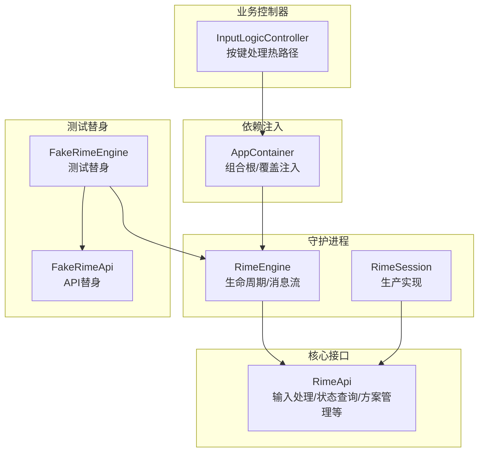
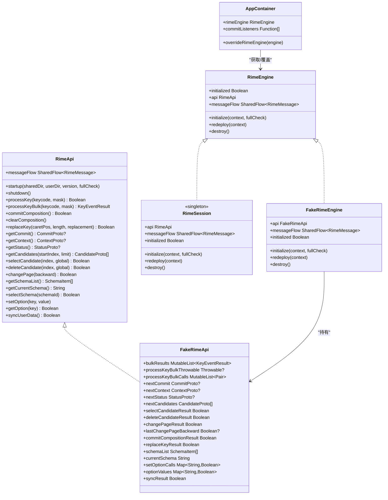
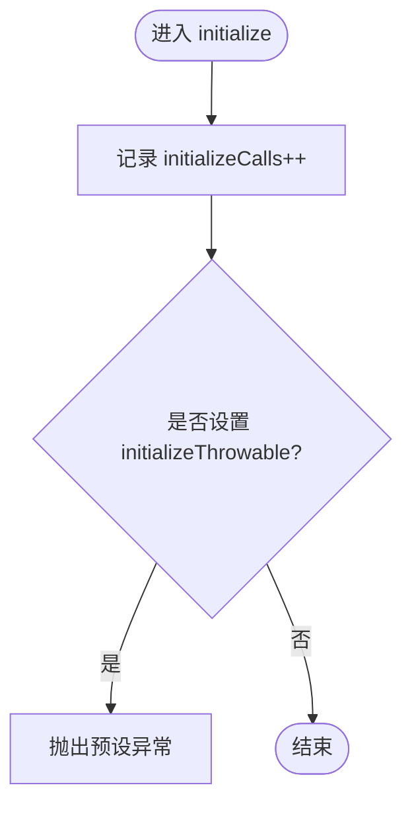
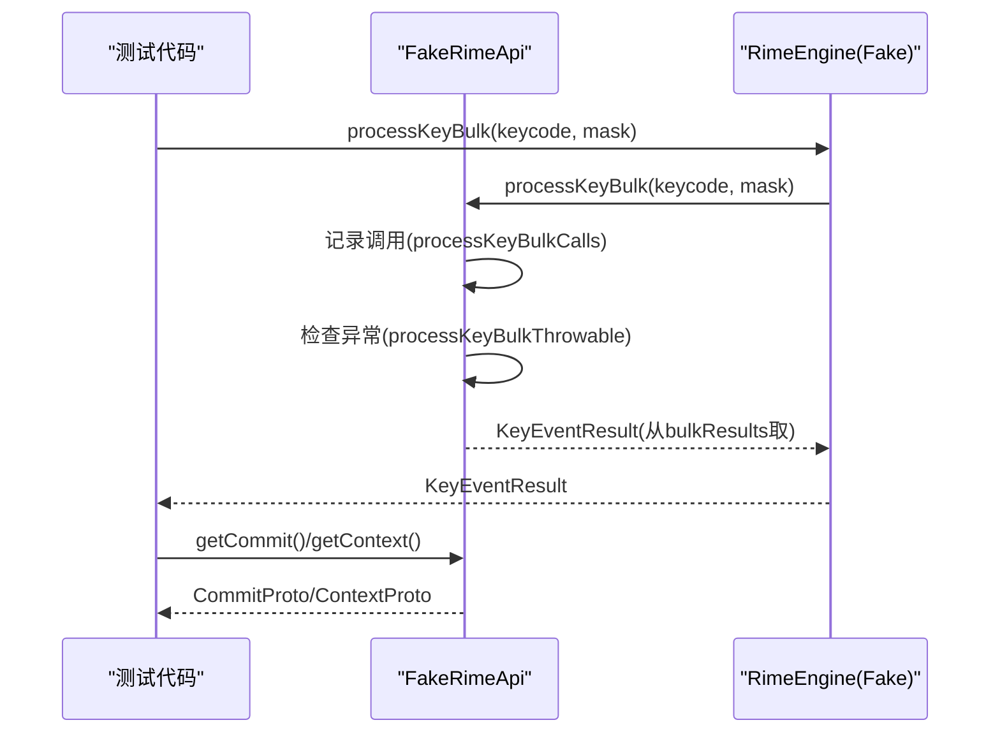
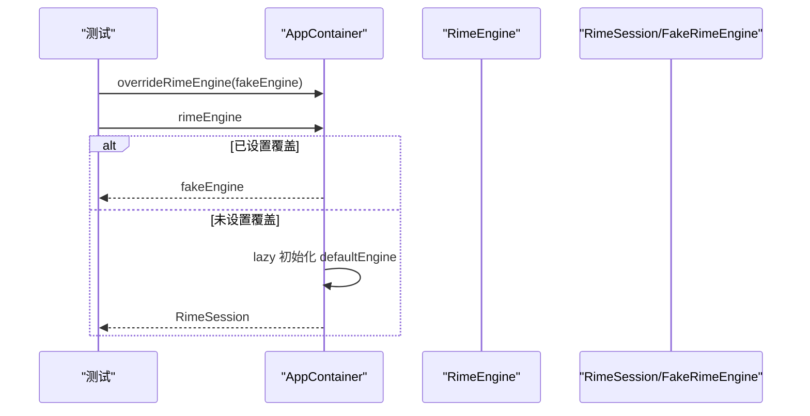
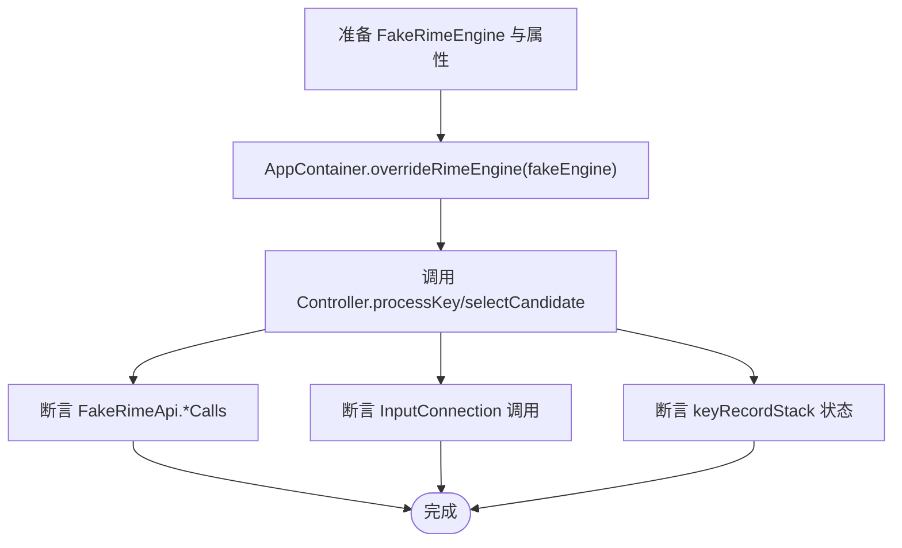
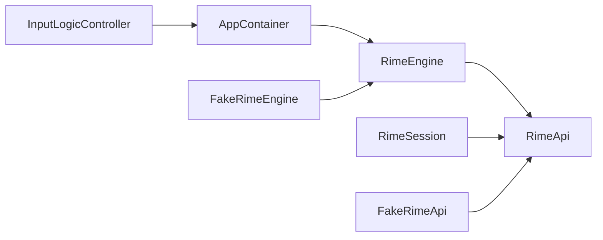

# 测试替身与模拟对象

<cite>
**本文引用的文件**   
- [FakeRimeEngine.kt](file://app/src/test/java/com/ziyou/ime/testing/FakeRimeEngine.kt)
- [RimeApi.kt](file://app/src/main/java/com/ziyou/ime/core/RimeApi.kt)
- [AppContainer.kt](file://app/src/main/java/com/ziyou/ime/di/AppContainer.kt)
- [RimeSession.kt](file://app/src/main/java/com/ziyou/ime/daemon/RimeSession.kt)
- [InputLogicControllerTest.kt](file://app/src/test/java/com/ziyou/ime/ime/InputLogicControllerTest.kt)
</cite>

## 目录
1. [简介](#简介)
2. [项目结构](#项目结构)
3. [核心组件](#核心组件)
4. [架构总览](#架构总览)
5. [详细组件分析](#详细组件分析)
6. [依赖关系分析](#依赖关系分析)
7. [性能考量](#性能考量)
8. [故障排查指南](#故障排查指南)
9. [结论](#结论)
10. [附录](#附录)

## 简介
本技术文档聚焦于输入法项目中“测试替身与模拟对象”的设计与实现，重点围绕以下目标展开：
- 解释 FakeRimeEngine 的设计模式：如何通过属性注入控制行为、使用 *Calls 列表记录调用历史。
- 说明 FakeRimeApi 的实现细节：processKeyBulk、getCommit、getContext 等核心方法的模拟策略。
- 展示 AppContainer.overrideRimeEngine() 的依赖注入替换机制，以及如何在测试中注入测试替身。
- 描述其他测试替身的实现模式（如 FakeSkinContext），并给出高质量测试替身与断言方法的最佳实践。
- 提供可复用的测试用例示例，帮助读者编写稳定、可读性强的单元测试。

## 项目结构
本项目采用分层组织方式：
- core 层定义 RimeApi 接口与消息类型，屏蔽底层实现差异。
- daemon 层提供 RimeEngine 抽象与生产实现 RimeSession，管理引擎生命周期与调度。
- di 层提供轻量 DI 容器 AppContainer，作为全局装配点，支持测试时替换实现。
- test 层包含 FakeRimeEngine 及大量针对输入逻辑、调度器等的单元测试。

图表来源
- [RimeApi.kt:1-105](file://app/src/main/java/com/ziyou/ime/core/RimeApi.kt#L1-L105)
- [RimeSession.kt:1-226](file://app/src/main/java/com/ziyou/ime/daemon/RimeSession.kt#L1-L226)
- [AppContainer.kt:1-59](file://app/src/main/java/com/ziyou/ime/di/AppContainer.kt#L1-L59)
- [FakeRimeEngine.kt:1-203](file://app/src/test/java/com/ziyou/ime/testing/FakeRimeEngine.kt#L1-L203)

章节来源
- [RimeApi.kt:1-105](file://app/src/main/java/com/ziyou/ime/core/RimeApi.kt#L1-L105)
- [RimeSession.kt:1-226](file://app/src/main/java/com/ziyou/ime/daemon/RimeSession.kt#L1-L226)
- [AppContainer.kt:1-59](file://app/src/main/java/com/ziyou/ime/di/AppContainer.kt#L1-L59)
- [FakeRimeEngine.kt:1-203](file://app/src/test/java/com/ziyou/ime/testing/FakeRimeEngine.kt#L1-L203)

## 核心组件
- RimeApi：定义所有与 Rime 引擎交互的 suspend API，包括启动/关闭、按键处理、候选操作、方案管理、选项设置、同步与消息流等。默认 processKeyBulk 将 processKey + getCommit + getContext 合并为一次调用，便于在 fake 中按三次调用组合实现。
- RimeEngine：暴露 initialized、api、messageFlow 以及 initialize/redeploy/destroy 生命周期方法。
- RimeSession：生产实现，负责部署步骤、线程调度、超时保护、资源清理等。
- AppContainer：组合根，提供 rimeEngine 访问点与 overrideRimeEngine 测试注入钩子。
- FakeRimeEngine / FakeRimeApi：测试替身，通过属性注入控制返回值，并通过 *Calls 列表记录调用历史，便于断言。

章节来源
- [RimeApi.kt:1-105](file://app/src/main/java/com/ziyou/ime/core/RimeApi.kt#L1-L105)
- [RimeSession.kt:1-226](file://app/src/main/java/com/ziyou/ime/daemon/RimeSession.kt#L1-L226)
- [AppContainer.kt:1-59](file://app/src/main/java/com/ziyou/ime/di/AppContainer.kt#L1-L59)
- [FakeRimeEngine.kt:1-203](file://app/src/test/java/com/ziyou/ime/testing/FakeRimeEngine.kt#L1-L203)

## 架构总览
下图展示了测试替身在整体架构中的位置与交互关系，以及依赖注入如何替换生产实现。

图表来源
- [RimeApi.kt:1-105](file://app/src/main/java/com/ziyou/ime/core/RimeApi.kt#L1-L105)
- [RimeSession.kt:1-226](file://app/src/main/java/com/ziyou/ime/daemon/RimeSession.kt#L1-L226)
- [AppContainer.kt:1-59](file://app/src/main/java/com/ziyou/ime/di/AppContainer.kt#L1-L59)
- [FakeRimeEngine.kt:1-203](file://app/src/test/java/com/ziyou/ime/testing/FakeRimeEngine.kt#L1-L203)

## 详细组件分析

### FakeRimeEngine 设计模式与行为控制
- 设计要点
  - 实现 RimeEngine，暴露 api = FakeRimeApi()，统一由 FakeRimeApi 控制输入与状态。
  - 生命周期方法（initialize/redeploy/destroy）默认空实现，但记录调用次数与参数，便于断言。
  - messageFlow 使用 MutableSharedFlow 暴露给调用方，用于验证消息事件。
- 属性注入控制行为
  - 通过 bulkResults、processKeyBulkThrowable、nextCommit、nextContext、nextStatus、nextCandidates 等属性精确控制每次调用的返回结果或异常。
  - 通过 initializeCalls、lastFullCheck、initializeThrowable 等字段记录初始化行为与错误场景。
- 调用历史记录
  - 各方法内部追加调用记录到 *Calls 列表（如 processKeyBulkCalls、selectCandidateCalls、replaceKeyCalls、setOptionCalls），方便断言调用顺序与参数。

图表来源
- [FakeRimeEngine.kt:31-52](file://app/src/test/java/com/ziyou/ime/testing/FakeRimeEngine.kt#L31-L52)

章节来源
- [FakeRimeEngine.kt:1-52](file://app/src/test/java/com/ziyou/ime/testing/FakeRimeEngine.kt#L1-L52)

### FakeRimeApi 核心方法模拟策略
- processKeyBulk
  - 从 bulkResults 队列按序消费返回值；若仅有一个元素则重复返回该元素；耗尽后返回默认未消费结果。
  - 支持通过 processKeyBulkThrowable 抛出异常以模拟引擎故障。
  - 记录每次调用的 keycode 与 mask 到 processKeyBulkCalls。
- getCommit / getContext / getStatus
  - 直接返回 nextCommit / nextContext / nextStatus，便于测试不同状态分支。
  - commitCalls / contextCalls 记录调用次数。
- 候选与编码操作
  - selectCandidate/deleteCandidate/changePage/commitComposition/clearComposition/replaceKey 均支持返回值与调用记录，便于断言选择、翻页、替换等行为。
- 方案管理与运行时选项
  - schemaList/currentSchema/selectSchema 支持切换与读取当前方案；setOption/getOption 维护选项映射。
- 同步与消息流
  - syncUserData 返回预设结果；messageFlow 通过代理暴露 SharedFlow。

图表来源
- [FakeRimeEngine.kt:59-197](file://app/src/test/java/com/ziyou/ime/testing/FakeRimeEngine.kt#L59-L197)
- [RimeApi.kt:26-40](file://app/src/main/java/com/ziyou/ime/core/RimeApi.kt#L26-L40)

章节来源
- [FakeRimeEngine.kt:59-197](file://app/src/test/java/com/ziyou/ime/testing/FakeRimeEngine.kt#L59-L197)
- [RimeApi.kt:26-40](file://app/src/main/java/com/ziyou/ime/core/RimeApi.kt#L26-L40)

### AppContainer.overrideRimeEngine() 依赖注入替换机制
- 作用
  - 提供全局唯一的装配点，默认返回 RimeSession；测试时可通过 overrideRimeEngine(fakeEngine) 替换为 FakeRimeEngine。
- 装配职责
  - 首次访问 defaultEngine 时执行部署步骤（资源部署、扩展词库注入），确保 RimeSession 正确初始化。
- 使用方式
  - 在测试 @Before 中调用 AppContainer.overrideRimeEngine(fakeEngine)，在 @After 中恢复为 null。
  - 业务组件通过 AppContainer.rimeEngine 获取引擎实例，无需关心具体实现。

图表来源
- [AppContainer.kt:25-59](file://app/src/main/java/com/ziyou/ime/di/AppContainer.kt#L25-L59)

章节来源
- [AppContainer.kt:25-59](file://app/src/main/java/com/ziyou/ime/di/AppContainer.kt#L25-L59)

### 测试用例示例与断言方法
- 典型测试流程
  - 准备阶段：创建 FakeRimeEngine，设置 bulkResults/nextCommit/nextContext 等属性，调用 AppContainer.overrideRimeEngine(fakeEngine)。
  - 执行阶段：调用 InputLogicController.processKey/selectCandidate 等方法。
  - 断言阶段：校验 InputConnection 调用、keyRecordStack 状态、FakeRimeApi.*Calls 列表、回调监听等。
- 关键断言点
  - 按键被消费：commitText 上屏、清空栈、渲染上下文。
  - 按键未消费：退格删除、回车路由、可打印字符提交。
  - commitTarget 路由：面板路径不触发编辑器动作。
  - 异常容错：engineThrows 不崩溃且无副作用。
  - 并发串行化：inputMutex 保证调用顺序与结果一致性。
  - 编码长度上限防护：超限后丢弃编码键，功能键绕过限制。

图表来源
- [InputLogicControllerTest.kt:53-79](file://app/src/test/java/com/ziyou/ime/ime/InputLogicControllerTest.kt#L53-L79)
- [InputLogicControllerTest.kt:84-134](file://app/src/test/java/com/ziyou/ime/ime/InputLogicControllerTest.kt#L84-L134)
- [InputLogicControllerTest.kt:279-310](file://app/src/test/java/com/ziyou/ime/ime/InputLogicControllerTest.kt#L279-L310)
- [InputLogicControllerTest.kt:408-461](file://app/src/test/java/com/ziyou/ime/ime/InputLogicControllerTest.kt#L408-L461)

章节来源
- [InputLogicControllerTest.kt:53-79](file://app/src/test/java/com/ziyou/ime/ime/InputLogicControllerTest.kt#L53-L79)
- [InputLogicControllerTest.kt:84-134](file://app/src/test/java/com/ziyou/ime/ime/InputLogicControllerTest.kt#L84-L134)
- [InputLogicControllerTest.kt:279-310](file://app/src/test/java/com/ziyou/ime/ime/InputLogicControllerTest.kt#L279-L310)
- [InputLogicControllerTest.kt:408-461](file://app/src/test/java/com/ziyou/ime/ime/InputLogicControllerTest.kt#L408-L461)

### 其他测试替身模式（如 FakeSkinContext）
- 常见模式
  - 实现对应接口，提供默认空实现或简单缓存。
  - 通过属性注入控制返回值（如 nextXxx、resultXxx）。
  - 使用 *Calls 列表记录调用历史，便于断言方法与参数。
- 适用场景
  - UI 上下文、皮肤系统、网络客户端、存储后端等外部依赖。
- 最佳实践
  - 保持替身轻量、确定性高、易于配置。
  - 避免在替身中引入复杂逻辑，确保测试快速稳定。

[本节为概念性内容，不直接分析具体文件]

## 依赖关系分析
- 耦合与内聚
  - RimeApi 与 RimeEngine 解耦清晰，FakeRimeApi/FakeRimeEngine 分别实现对应接口，内聚度高。
  - AppContainer 作为唯一装配点，降低模块间硬耦合。
- 直接/间接依赖
  - InputLogicController 依赖 AppContainer.rimeEngine，间接依赖 RimeApi。
  - RimeSession 依赖 SimpleRimeImpl（生产实现），测试中通过 AppContainer 替换。
- 循环依赖
  - 未发现循环依赖；依赖方向明确：业务层 → DI 容器 → 守护进程 → 核心接口。
- 外部依赖
  - Android 框架（InputConnection、EditorInfo）、协程（SharedFlow、CoroutineScope）、JNI（librime）。

图表来源
- [AppContainer.kt:25-59](file://app/src/main/java/com/ziyou/ime/di/AppContainer.kt#L25-L59)
- [RimeSession.kt:1-226](file://app/src/main/java/com/ziyou/ime/daemon/RimeSession.kt#L1-L226)
- [RimeApi.kt:1-105](file://app/src/main/java/com/ziyou/ime/core/RimeApi.kt#L1-L105)
- [FakeRimeEngine.kt:1-203](file://app/src/test/java/com/ziyou/ime/testing/FakeRimeEngine.kt#L1-L203)

章节来源
- [AppContainer.kt:25-59](file://app/src/main/java/com/ziyou/ime/di/AppContainer.kt#L25-L59)
- [RimeSession.kt:1-226](file://app/src/main/java/com/ziyou/ime/daemon/RimeSession.kt#L1-L226)
- [RimeApi.kt:1-105](file://app/src/main/java/com/ziyou/ime/core/RimeApi.kt#L1-L105)
- [FakeRimeEngine.kt:1-203](file://app/src/test/java/com/ziyou/ime/testing/FakeRimeEngine.kt#L1-L203)

## 性能考量
- processKeyBulk 优化
  - 生产实现单次 JNI 跨界，减少线程往返；fake 实现按三次调用组合，便于测试。
- 线程与协程
  - RimeDispatcher 专用线程执行，避免主线程阻塞；测试中使用 UnconfinedTestDispatcher 提升确定性。
- 内存与状态
  - FakeRimeApi 使用可变集合记录调用历史，注意在大型测试中及时清理，避免内存增长。
- 超时与异常
  - RimeSession 启动带超时保护，防止长时间阻塞；测试中通过 processKeyBulkThrowable 模拟异常路径。

[本节为通用指导，不直接分析具体文件]

## 故障排查指南
- 常见问题
  - 未初始化：调用 api 前需先 initialize，否则抛出异常。
  - 线程问题：确保测试环境设置正确的 Dispatcher（UnconfinedTestDispatcher）。
  - 状态不一致：检查 bulkResults 队列是否耗尽，必要时重置。
  - 异常路径：通过 processKeyBulkThrowable 或 initializeThrowable 验证容错逻辑。
- 调试技巧
  - 查看 *Calls 列表确认调用顺序与参数。
  - 使用 verify/mockk 断言 InputConnection 调用。
  - 打印 messageFlow 事件，验证 schema 切换、option 变更等。

章节来源
- [RimeSession.kt:71-74](file://app/src/main/java/com/ziyou/ime/daemon/RimeSession.kt#L71-L74)
- [InputLogicControllerTest.kt:279-288](file://app/src/test/java/com/ziyou/ime/ime/InputLogicControllerTest.kt#L279-L288)

## 结论
通过 FakeRimeEngine 与 FakeRimeApi 的组合，项目实现了高度可配置、易断言的测试替身体系。结合 AppContainer 的依赖注入替换机制，测试可以无缝覆盖生产逻辑，确保输入热路径的正确性与稳定性。遵循属性注入、调用历史记录、异常模拟等最佳实践，能够显著提升测试质量与可维护性。

[本节为总结性内容，不直接分析具体文件]

## 附录
- 测试替身设计原则
  - 单一职责：替身只关注被测行为，不引入额外复杂性。
  - 可配置性：通过属性注入控制返回值与异常。
  - 可观察性：使用 *Calls 列表记录调用历史，便于断言。
  - 稳定性：避免依赖外部状态，确保测试快速、确定。
- 最佳实践清单
  - 在 @Before 中注入替身，@After 中清理。
  - 使用 runTest/runBlocking 管理协程上下文。
  - 断言调用顺序与参数，而非仅结果。
  - 覆盖正常路径、边界条件与异常路径。

[本节为概念性内容，不直接分析具体文件]