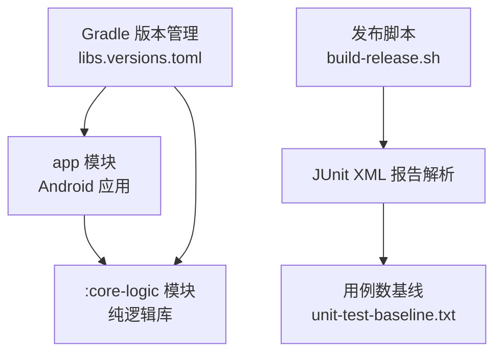
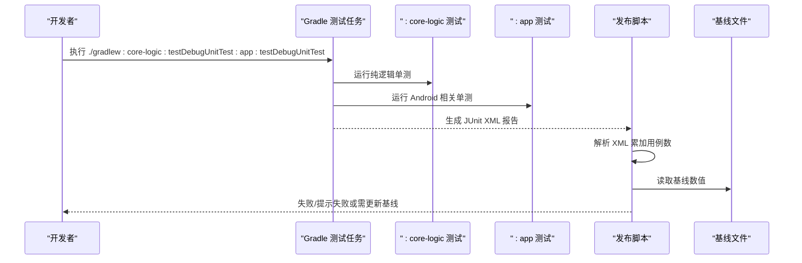
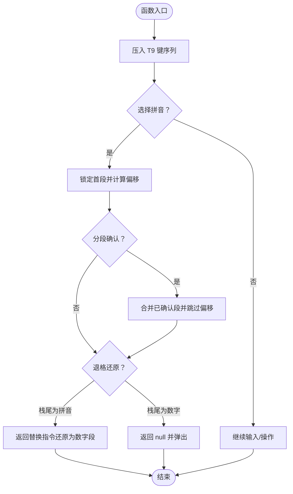
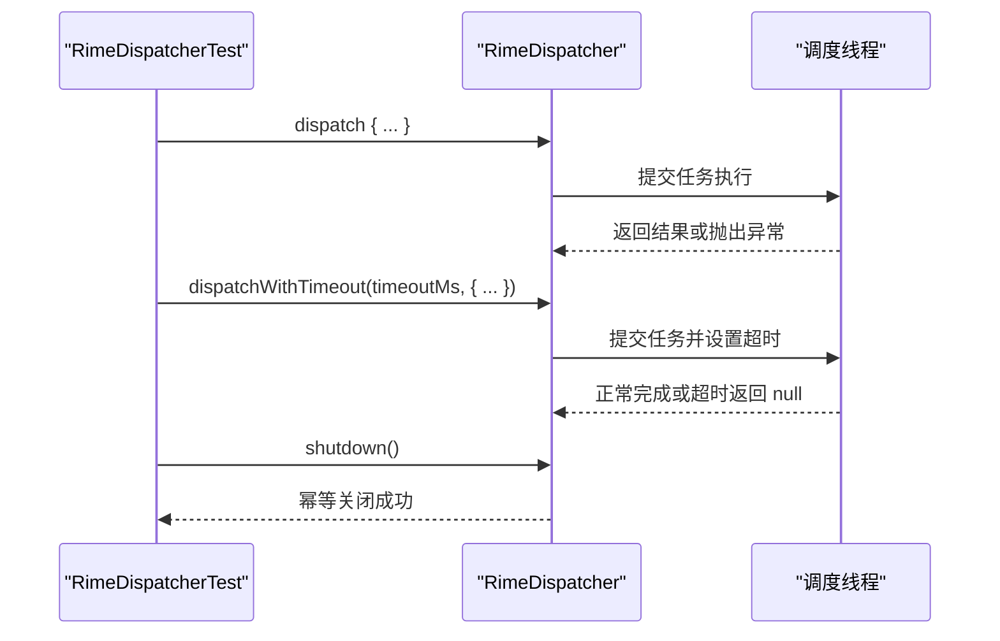
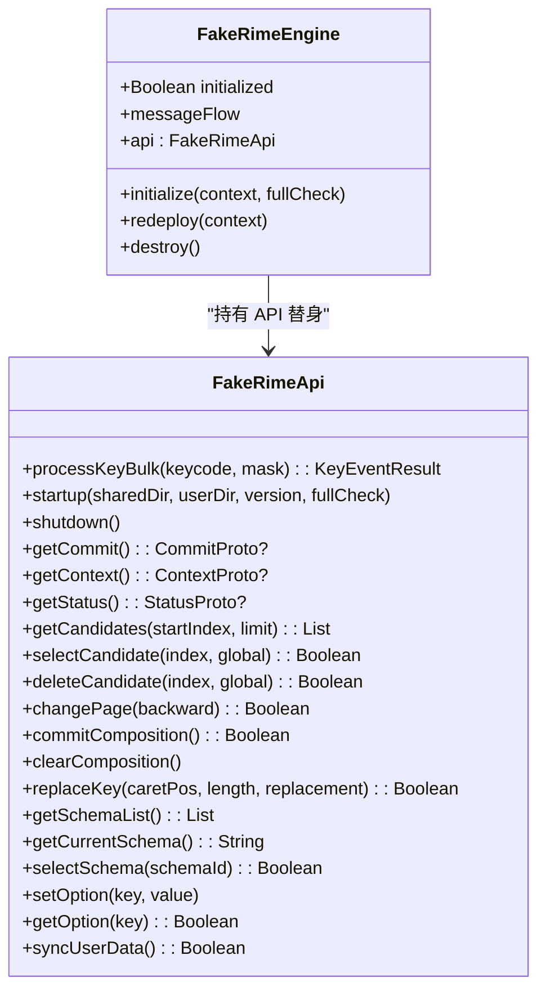
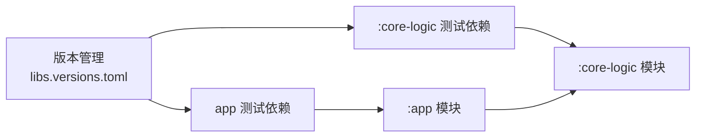

# 测试架构设计

<cite>
**本文引用的文件**   
- [app/build.gradle.kts](file://app/build.gradle.kts)
- [core-logic/build.gradle.kts](file://core-logic/build.gradle.kts)
- [build.gradle.kts](file://build.gradle.kts)
- [gradle/libs.versions.toml](file://gradle/libs.versions.toml)
- [scripts/unit-test-baseline.txt](file://scripts/unit-test-baseline.txt)
- [scripts/build-release.sh](file://scripts/build-release.sh)
- [app/src/test/java/com/ziyou/ime/core/RimeDispatcherTest.kt](file://app/src/test/java/com/ziyou/ime/core/RimeDispatcherTest.kt)
- [core-logic/src/test/java/com/ziyou/ime/core/t9/KeyRecordStackTest.kt](file://core-logic/src/test/java/com/ziyou/ime/core/t9/KeyRecordStackTest.kt)
- [app/src/test/java/com/ziyou/ime/testing/FakeRimeEngine.kt](file://app/src/test/java/com/ziyou/ime/testing/FakeRimeEngine.kt)
</cite>

## 目录
1. [引言](#引言)
2. [项目结构](#项目结构)
3. [核心组件](#核心组件)
4. [架构总览](#架构总览)
5. [详细组件分析](#详细组件分析)
6. [依赖分析](#依赖分析)
7. [性能考量](#性能考量)
8. [故障排查指南](#故障排查指南)
9. [结论](#结论)
10. [附录](#附录)

## 引言
本技术文档围绕输入法的“纯逻辑下沉到 :core-logic”的测试策略展开，系统阐述分层测试架构、测试目录组织、测试依赖与运行配置、基线比对机制以及最佳实践与性能优化建议。通过将可独立验证的纯逻辑迁移至 :core-logic 模块，项目实现了脱离 Android 运行时的 JVM 单元测试，显著提升测试执行速度与可维护性；同时通过统一的 Gradle 版本管理与脚本门禁，保障用例数量与质量稳定增长。

## 项目结构
本项目采用多模块结构：
- app：Android 应用层，包含 UI、JNI 交互、Android 相关测试（app/src/test）。
- core-logic：纯逻辑库（无 Android 框架依赖），承载 T9、Markdown、技能清单校验等可独立测试的算法与状态机，测试位于 core-logic/src/test。
- 根构建脚本与版本管理：统一插件与依赖版本，集中管理测试框架与工具链。

图表来源 
- [app/build.gradle.kts:1-192](file://app/build.gradle.kts#L1-L192)
- [core-logic/build.gradle.kts:1-29](file://core-logic/build.gradle.kts#L1-L29)
- [gradle/libs.versions.toml:1-51](file://gradle/libs.versions.toml#L1-L51)
- [scripts/build-release.sh:100-165](file://scripts/build-release.sh#L100-L165)
- [scripts/unit-test-baseline.txt:1-13](file://scripts/unit-test-baseline.txt#L1-L13)

章节来源
- [app/build.gradle.kts:1-192](file://app/build.gradle.kts#L1-L192)
- [core-logic/build.gradle.kts:1-29](file://core-logic/build.gradle.kts#L1-L29)
- [build.gradle.kts:1-7](file://build.gradle.kts#L1-L7)

## 核心组件
- 纯逻辑模块 :core-logic
  - 职责：承载不依赖 Android 框架的纯 Kotlin 逻辑（如 T9 拼音双向映射、Markdown 渲染、技能清单校验等），便于在 JVM 上快速执行单测。
  - 优势：避免 Android 运行时开销，提升测试速度；边界清晰，编译器强制单向依赖（app → core-logic）。
- 应用模块 :app
  - 职责：Android 界面、JNI 集成、输入法服务与业务编排；提供 Android 相关测试与仪器化测试。
  - 测试隔离：Android 桩方法默认返回默认值，减少“not mocked”异常对纯逻辑测试的影响。
- 测试替身与基础设施
  - FakeRimeEngine：为 RimeEngine/RimeApi 提供可配置的替身，记录调用历史并控制返回值，用于上层逻辑的断言。
  - JUnit5/MockK/Coroutines Test：统一版本管理，支撑异步与协程测试场景。

章节来源
- [core-logic/build.gradle.kts:1-29](file://core-logic/build.gradle.kts#L1-L29)
- [app/build.gradle.kts:1-192](file://app/build.gradle.kts#L1-L192)
- [app/src/test/java/com/ziyou/ime/testing/FakeRimeEngine.kt:1-203](file://app/src/test/java/com/ziyou/ime/testing/FakeRimeEngine.kt#L1-L203)

## 架构总览
测试架构遵循“纯逻辑下沉 + 分层测试”的原则：
- 纯逻辑测试（JVM）：core-logic/src/test，无需 Android 环境，执行速度快、稳定性高。
- Android 相关测试（JVM）：app/src/test，针对 Android 桩方法与协程调度进行验证。
- 基线与门禁：通过脚本解析 JUnit XML 报告，统计用例总数并与基线比对，确保用例只增不减且全绿。

图表来源 
- [scripts/build-release.sh:100-165](file://scripts/build-release.sh#L100-L165)
- [scripts/unit-test-baseline.txt:1-13](file://scripts/unit-test-baseline.txt#L1-L13)
- [app/build.gradle.kts:105-111](file://app/build.gradle.kts#L105-L111)

## 详细组件分析

### 纯逻辑测试示例：T9 拼音状态机（KeyRecordStack）
- 目标：验证九宫格输入状态机的不变式（列表顺序 == Rime 编码串逻辑顺序），覆盖选拼音替换、偏移累加、退格还原、分段确认与非法输入处理。
- 关键断言点：
  - 首段锁定后第二段偏移正确累加。
  - 退格时根据栈尾类型返回替换指令或 null。
  - confirmLeading 合并已确认段与未确认段偏移。
  - 非法/不匹配输入保持栈状态不变。

图表来源 
- [core-logic/src/test/java/com/ziyou/ime/core/t9/KeyRecordStackTest.kt:1-185](file://core-logic/src/test/java/com/ziyou/ime/core/t9/KeyRecordStackTest.kt#L1-L185)

章节来源
- [core-logic/src/test/java/com/ziyou/ime/core/t9/KeyRecordStackTest.kt:1-185](file://core-logic/src/test/java/com/ziyou/ime/core/t9/KeyRecordStackTest.kt#L1-L185)

### Android 相关测试示例：RimeDispatcher 调度路径
- 目标：验证调度器在专属线程执行、异常传播、超时返回、关闭后行为与幂等性。
- 关键点：
  - 使用 runBlocking 避免虚拟时间与真实单线程调度器的冲突。
  - 通过 CountDownLatch 模拟阻塞以触发超时分支。
  - 多次 shutdown 应幂等且不抛异常。

图表来源 
- [app/src/test/java/com/ziyou/ime/core/RimeDispatcherTest.kt:1-133](file://app/src/test/java/com/ziyou/ime/core/RimeDispatcherTest.kt#L1-L133)

章节来源
- [app/src/test/java/com/ziyou/ime/core/RimeDispatcherTest.kt:1-133](file://app/src/test/java/com/ziyou/ime/core/RimeDispatcherTest.kt#L1-L133)

### 测试替身：FakeRimeEngine 与 FakeRimeApi
- 目标：为 RimeEngine/RimeApi 提供可配置的替身，支持设置返回值、抛出异常、记录调用历史，用于上层逻辑的断言。
- 能力：
  - processKeyBulk 返回序列消费与异常注入。
  - 生命周期方法调用计数与参数记录。
  - 候选操作、方案管理、选项设置与同步操作的替身实现。

图表来源 
- [app/src/test/java/com/ziyou/ime/testing/FakeRimeEngine.kt:1-203](file://app/src/test/java/com/ziyou/ime/testing/FakeRimeEngine.kt#L1-L203)

章节来源
- [app/src/test/java/com/ziyou/ime/testing/FakeRimeEngine.kt:1-203](file://app/src/test/java/com/ziyou/ime/testing/FakeRimeEngine.kt#L1-L203)

## 依赖分析
- 版本管理：通过 gradle/libs.versions.toml 统一管理 JUnit、MockK、Coroutines Test、org.json 等依赖版本，避免版本漂移。
- 模块依赖方向：app → core-logic（单向），编译器强制边界，保证纯逻辑模块不被 Android 反向依赖污染。
- 测试依赖：
  - app 模块：testImplementation junit、kotlinx-coroutines-test、mockk、json（JVM 真实实现）。
  - core-logic 模块：testImplementation junit。

图表来源 
- [gradle/libs.versions.toml:1-51](file://gradle/libs.versions.toml#L1-L51)
- [app/build.gradle.kts:179-191](file://app/build.gradle.kts#L179-L191)
- [core-logic/build.gradle.kts:26-28](file://core-logic/build.gradle.kts#L26-L28)

章节来源
- [gradle/libs.versions.toml:1-51](file://gradle/libs.versions.toml#L1-L51)
- [app/build.gradle.kts:179-191](file://app/build.gradle.kts#L179-L191)
- [core-logic/build.gradle.kts:26-28](file://core-logic/build.gradle.kts#L26-L28)

## 性能考量
- 纯逻辑测试在 JVM 上执行，避免 Android 运行时初始化与 JNI 调用，显著缩短单测时间。
- app 模块 testOptions.isReturnDefaultValues=true，减少“not mocked”异常带来的调试成本。
- 使用协程测试工具（runBlocking/runTest）与 MockK 替代外部依赖，降低 I/O 与网络开销。
- 基线门禁防止用例退化，间接提升回归测试效率与稳定性。

## 故障排查指南
- 用例数低于基线：检查是否删除了既有用例或未更新基线文件；若确需下调，需在提交说明中写明理由并同步更新 scripts/unit-test-baseline.txt。
- 有跳过用例：禁止通过 @Ignore 使套件变绿；应修复用例或补充缺失场景。
- 未找到 JUnit XML 报告：确认 Gradle 测试任务执行成功，路径为 */build/test-results/testDebugUnitTest/*.xml。
- 签名配置缺失：发布脚本要求 keystore.properties 存在且指向有效密钥库；否则构建失败。

章节来源
- [scripts/build-release.sh:100-165](file://scripts/build-release.sh#L100-L165)
- [scripts/unit-test-baseline.txt:1-13](file://scripts/unit-test-baseline.txt#L1-L13)
- [app/build.gradle.kts:105-111](file://app/build.gradle.kts#L105-L111)

## 结论
通过将纯逻辑下沉至 :core-logic 模块，项目实现了高性能、高可维护性的 JVM 单元测试体系。配合统一的依赖版本管理、清晰的模块边界与严格的基线门禁，测试套件在速度与质量上均得到保障。建议在后续迭代中持续扩展纯逻辑覆盖范围，完善替身与夹具，进一步优化测试执行与诊断体验。

## 附录
- 测试命令参考：
  - 运行全量单测：./gradlew :core-logic:testDebugUnitTest :app:testDebugUnitTest
  - 发布构建（含门禁）：./scripts/build-release.sh [--abis <list>] [--rebuild-native] [--skip-tests]
- 基线更新方式：
  - 执行上述测试命令后，将实测总数写入 scripts/unit-test-baseline.txt 的首个纯数字行（其余行为注释）。

章节来源
- [scripts/unit-test-baseline.txt:1-13](file://scripts/unit-test-baseline.txt#L1-L13)
- [scripts/build-release.sh:100-165](file://scripts/build-release.sh#L100-L165)