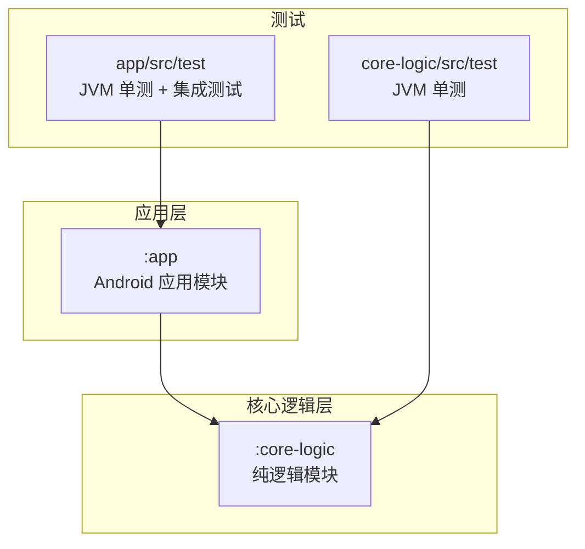
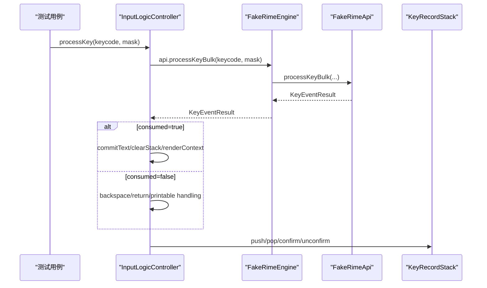
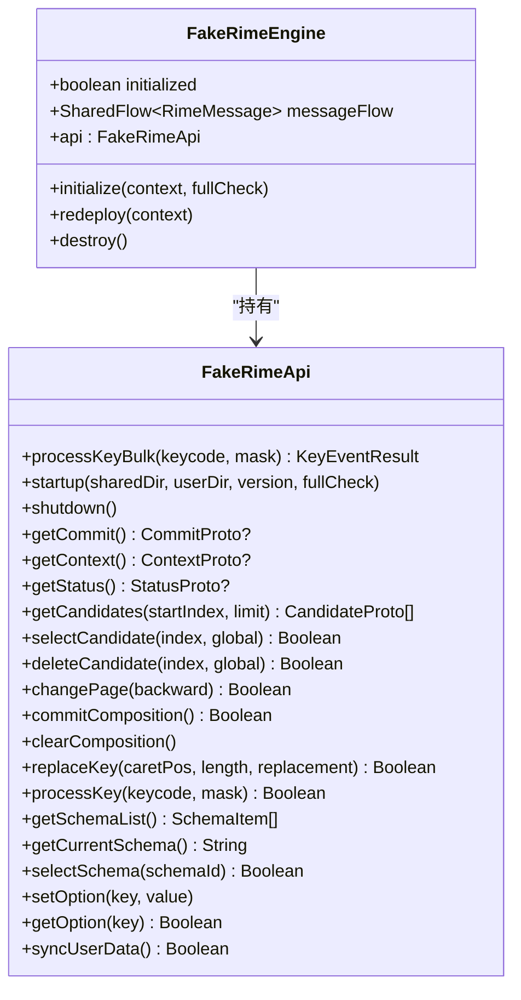
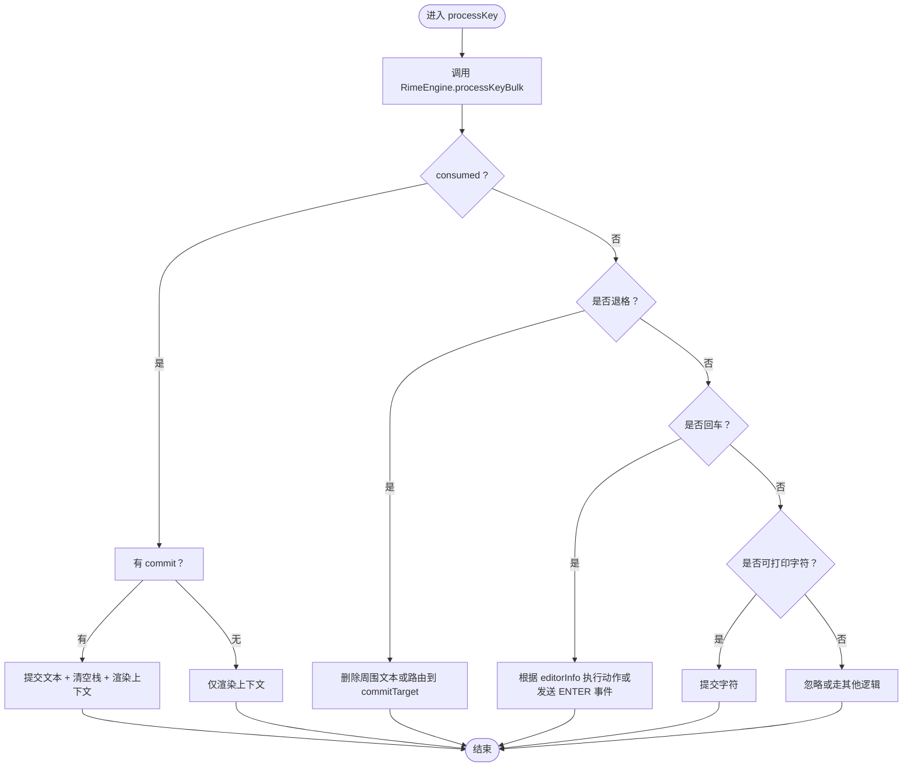
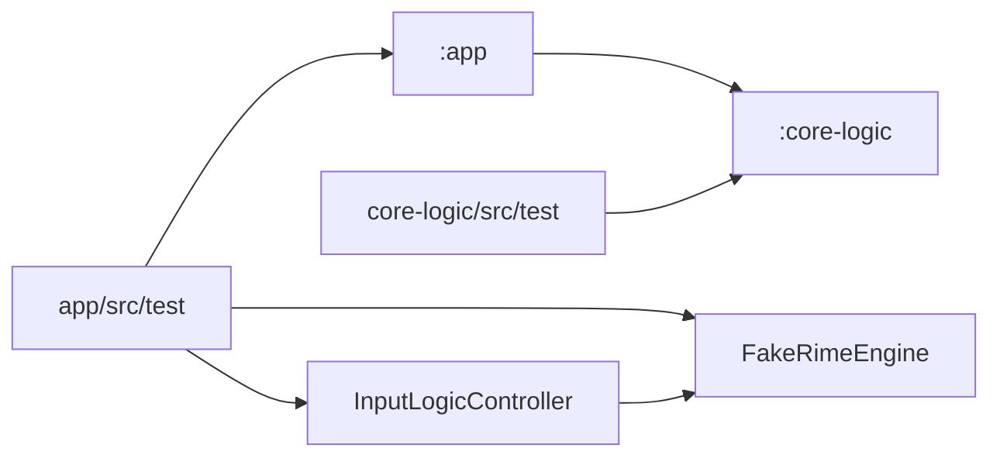

# 测试策略

<cite>
**本文引用的文件**   
- [FakeRimeEngine.kt](file://app/src/test/java/com/ziyou/ime/testing/FakeRimeEngine.kt)
- [T9PinYinUtilsTest.kt](file://core-logic/src/test/java/com/ziyou/ime/util/T9PinYinUtilsTest.kt)
- [KeyRecordStackTest.kt](file://core-logic/src/test/java/com/ziyou/ime/core/t9/KeyRecordStackTest.kt)
- [LevelEngineTest.kt](file://core-logic/src/test/java/com/ziyou/ime/core/level/LevelEngineTest.kt)
- [RimeDispatcherTest.kt](file://app/src/test/java/com/ziyou/ime/core/RimeDispatcherTest.kt)
- [RimeSessionLifecycleTest.kt](file://app/src/test/java/com/ziyou/ime/daemon/RimeSessionLifecycleTest.kt)
- [InputLogicControllerTest.kt](file://app/src/test/java/com/ziyou/ime/ime/InputLogicControllerTest.kt)
- [unit-test-baseline.txt](file://scripts/unit-test-baseline.txt)
- [core-logic/build.gradle.kts](file://core-logic/build.gradle.kts)
- [app/build.gradle.kts](file://app/build.gradle.kts)
</cite>

## 目录
1. [简介](#简介)
2. [项目结构](#项目结构)
3. [核心组件](#核心组件)
4. [架构总览](#架构总览)
5. [详细组件分析](#详细组件分析)
6. [依赖关系分析](#依赖关系分析)
7. [性能考量](#性能考量)
8. [故障排查指南](#故障排查指南)
9. [结论](#结论)
10. [附录](#附录)

## 简介
本文件系统化阐述项目的测试策略与实现，重点包括：
- 纯逻辑下沉到 :core-logic 模块后，脱离 Android 运行时进行 JVM 单元测试的优势与收益。
- FakeRimeEngine 测试替身的设计、注入机制与替换真实实现的入口 AppContainer.overrideRimeEngine()。
- 核心逻辑的测试覆盖规范与示例，涵盖 T9PinYinUtilsTest、KeyRecordStackTest、LevelEngineTest 等。
- 测试运行命令与基线比对机制（./gradlew 测试命令与 scripts/unit-test-baseline.txt）。
- 高质量单测与集成测试编写范式、覆盖率统计与质量保证流程。

## 项目结构
本项目采用多模块组织，测试按模块划分：
- core-logic：纯逻辑模块，不包含 Android UI/JNI，适合快速、稳定的 JVM 单元测试。
- app：Android 应用模块，包含与 Android 框架交互的代码及集成测试。

**图示来源** 
- [core-logic/build.gradle.kts:1-29](file://core-logic/build.gradle.kts#L1-L29)
- [app/build.gradle.kts:143-192](file://app/build.gradle.kts#L143-L192)

**章节来源**
- [core-logic/build.gradle.kts:1-29](file://core-logic/build.gradle.kts#L1-L29)
- [app/build.gradle.kts:105-111](file://app/build.gradle.kts#L105-L111)

## 核心组件
- FakeRimeEngine：可配置的 RimeEngine 测试替身，内部持有 FakeRimeApi，通过属性控制返回值并记录调用历史，便于断言。
- InputLogicController：输入逻辑控制器，通过 DI 钩子 AppContainer.overrideRimeEngine() 注入 FakeRimeEngine，完成按键处理、候选选择、退格重打等路径验证。
- LevelEngine：纯计算引擎，用于等级、进度、解锁门槛等规则判定，全部为无副作用的函数式逻辑，天然适合单测。
- KeyRecordStack：九宫格输入状态机，维护击键序列、拼音锁定、分段确认与还原，是复杂边界条件的高价值测试目标。
- T9PinYinUtils：T9 数字键与拼音的双向映射工具，提供 O(1) 反查与去重保序匹配，回归测试确保稳定性。
- RimeDispatcher：调度器，保障在专属线程执行任务、超时控制与异常传播，测试覆盖线程模型与超时行为。
- RimeSession：生命周期管理，测试聚焦于未初始化状态、deploySteps 执行顺序与失败回退。

**章节来源**
- [FakeRimeEngine.kt:1-203](file://app/src/test/java/com/ziyou/ime/testing/FakeRimeEngine.kt#L1-L203)
- [InputLogicControllerTest.kt:32-79](file://app/src/test/java/com/ziyou/ime/ime/InputLogicControllerTest.kt#L32-L79)
- [LevelEngineTest.kt:1-111](file://core-logic/src/test/java/com/ziyou/ime/core/level/LevelEngineTest.kt#L1-L111)
- [KeyRecordStackTest.kt:1-185](file://core-logic/src/test/java/com/ziyou/ime/core/t9/KeyRecordStackTest.kt#L1-L185)
- [T9PinYinUtilsTest.kt:1-74](file://core-logic/src/test/java/com/ziyou/ime/util/T9PinYinUtilsTest.kt#L1-L74)
- [RimeDispatcherTest.kt:1-133](file://app/src/test/java/com/ziyou/ime/core/RimeDispatcherTest.kt#L1-L133)
- [RimeSessionLifecycleTest.kt:1-180](file://app/src/test/java/com/ziyou/ime/daemon/RimeSessionLifecycleTest.kt#L1-L180)

## 架构总览
测试架构围绕“纯逻辑下沉 + 替身注入”展开：
- 纯逻辑模块 :core-logic 不依赖 Android 框架，可在 JVM 环境极速运行单测。
- app 模块通过 DI 钩子替换 RimeEngine 实现，使上层逻辑在不启动 Android 环境的情况下进行端到端路径验证。
- 基线文件统一约束用例数量，构建门禁保证质量稳定。

**图示来源** 
- [InputLogicControllerTest.kt:84-134](file://app/src/test/java/com/ziyou/ime/ime/InputLogicControllerTest.kt#L84-L134)
- [FakeRimeEngine.kt:59-197](file://app/src/test/java/com/ziyou/ime/testing/FakeRimeEngine.kt#L59-L197)
- [KeyRecordStackTest.kt:19-117](file://core-logic/src/test/java/com/ziyou/ime/core/t9/KeyRecordStackTest.kt#L19-L117)

## 详细组件分析

### FakeRimeEngine 测试替身设计与注入机制
- 设计要点：
  - 暴露 initialized、messageFlow 等只读属性，便于观察状态。
  - 生命周期方法 initialize/redeploy/destroy 默认空实现，记录调用次数与参数，支持抛出异常模拟故障。
  - FakeRimeApi 集中管理所有 API 行为：按键处理、状态查询、候选操作、编码操作、方案管理、运行时选项、同步与消息流。
  - 通过 bulkResults 队列控制每次 processKeyBulk 的返回；processKeyBulkThrowable 模拟引擎异常。
- 注入机制：
  - 测试中通过 AppContainer.overrideRimeEngine(fakeEngine) 替换真实实现，随后构造 InputLogicController 时直接使用 AppContainer.rimeEngine。
  - 测试结束后恢复 null，避免污染其他用例。

**图示来源** 
- [FakeRimeEngine.kt:21-52](file://app/src/test/java/com/ziyou/ime/testing/FakeRimeEngine.kt#L21-L52)
- [FakeRimeEngine.kt:59-197](file://app/src/test/java/com/ziyou/ime/testing/FakeRimeEngine.kt#L59-L197)

**章节来源**
- [FakeRimeEngine.kt:1-203](file://app/src/test/java/com/ziyou/ime/testing/FakeRimeEngine.kt#L1-L203)
- [InputLogicControllerTest.kt:53-79](file://app/src/test/java/com/ziyou/ime/ime/InputLogicControllerTest.kt#L53-L79)

### 纯逻辑下沉到 :core-logic 的测试优势
- 无需 Android 运行时：避免虚拟时间、线程调度、JNI 加载等不稳定因素，提升单测速度与确定性。
- 编译期边界：依赖方向 :app → :core-logic，编译器强制纯逻辑不引入 Android 类型，降低耦合。
- 快速反馈：JVM 单测执行速度快，利于持续集成与频繁回归。

**章节来源**
- [core-logic/build.gradle.kts:5-11](file://core-logic/build.gradle.kts#L5-L11)
- [app/build.gradle.kts:143-147](file://app/build.gradle.kts#L143-L147)

### 核心逻辑测试覆盖规范与示例

#### T9PinYinUtilsTest：双向映射回归
- 覆盖点：
  - 数字键序列到候选拼音（由长到短、去重保序）。
  - 拼音到数字键的反查（O(1)）。
  - 单字符映射与非法输入边界。
  - 正反向往返一致性。
- 编写建议：
  - 使用 assertArrayEquals/assertEquals/assertTrue 明确断言。
  - 对边界值（null、空串、非法数字）进行全覆盖。
  - 往返一致性用例确保映射稳定。

**章节来源**
- [T9PinYinUtilsTest.kt:1-74](file://core-logic/src/test/java/com/ziyou/ime/util/T9PinYinUtilsTest.kt#L1-L74)

#### KeyRecordStackTest：九宫格输入状态机
- 覆盖点：
  - 选拼音锁定首个 T9 段、多音节字符偏移累加。
  - 智能退格还原为数字段、分段确认合并与偏移跳过。
  - 非法或不匹配返回 null，保持栈不变。
- 编写建议：
  - 以“列表顺序 == Rime 编码串逻辑顺序”为核心不变式设计用例。
  - 针对 confirmLeading、popAndRestore、unconfirmAll 等关键路径分别覆盖。

**章节来源**
- [KeyRecordStackTest.kt:1-185](file://core-logic/src/test/java/com/ziyou/ime/core/t9/KeyRecordStackTest.kt#L1-L185)

#### LevelEngineTest：纯计算引擎
- 覆盖点：
  - 分段计分（全额/半额/封顶）、连续签到奖励。
  - 等级判定与进度、主题/音效包解锁门槛。
- 编写建议：
  - 使用字面量主题名与内置皮肤 meta.name 一致，避免引入 Android 依赖。
  - 边界值（0、上限、满级）与中间值均覆盖。

**章节来源**
- [LevelEngineTest.kt:1-111](file://core-logic/src/test/java/com/ziyou/ime/core/level/LevelEngineTest.kt#L1-L111)

#### RimeDispatcherTest：调度器行为
- 覆盖点：
  - 专属线程执行、异常传播、超时返回 null、shutdown 幂等。
- 编写建议：
  - 使用 runBlocking 避免虚拟时间与真实线程调度的冲突。
  - 通过 CountDownLatch 模拟阻塞，验证超时路径。

**章节来源**
- [RimeDispatcherTest.kt:1-133](file://app/src/test/java/com/ziyou/ime/core/RimeDispatcherTest.kt#L1-L133)

#### RimeSessionLifecycleTest：生命周期与部署步骤
- 覆盖点：
  - 未初始化状态、initialize 因 native 库缺失失败、deploySteps 顺序执行、redeploy 重新执行。
- 编写建议：
  - 通过反射重置单例内部状态，保证测试隔离。
  - 使用 runBlocking 而非 runTest，避免虚拟时间导致竞态分支。

**章节来源**
- [RimeSessionLifecycleTest.kt:1-180](file://app/src/test/java/com/ziyou/ime/daemon/RimeSessionLifecycleTest.kt#L1-L180)

#### InputLogicControllerTest：热路径与路由
- 覆盖点：
  - 按键被 Rime 消费：commit 上屏、清栈、刷新 UI。
  - 按键未消费：退格删字、回车路由面板、可打印字符直接提交。
  - commitTarget 路由（技能面板 vs 宿主编辑器）、commitListeners 计分回调。
  - 异常容错、inputMutex 串行化、编码长度上限防护。
- 编写建议：
  - 使用 AppContainer.overrideRimeEngine(fakeEngine) 注入替身。
  - 通过 verify 断言 InputConnection 调用与 FakeRimeApi 调用历史。
  - 针对 partialConfirm、retypeUnconfirmed、deleteUnconfirmedBackward 等复杂路径设计用例。

**章节来源**
- [InputLogicControllerTest.kt:32-79](file://app/src/test/java/com/ziyou/ime/ime/InputLogicControllerTest.kt#L32-L79)
- [InputLogicControllerTest.kt:84-461](file://app/src/test/java/com/ziyou/ime/ime/InputLogicControllerTest.kt#L84-L461)

### 概念性概览
以下流程图展示“按键处理”的核心决策路径，适用于理解测试关注点与边界条件。

[此图为概念性流程，不直接映射具体源码文件]

## 依赖关系分析
- 模块依赖：
  - :app 依赖 :core-logic，单向依赖确保纯逻辑边界。
- 测试依赖：
  - JUnit、Kotlin Coroutines Test、MockK、JSON（皮肤解码）等。
- 测试替身与注入：
  - FakeRimeEngine 替代 RimeEngine，AppContainer.overrideRimeEngine() 作为注入点。

**图示来源** 
- [app/build.gradle.kts:143-192](file://app/build.gradle.kts#L143-L192)
- [core-logic/build.gradle.kts:26-29](file://core-logic/build.gradle.kts#L26-L29)

**章节来源**
- [app/build.gradle.kts:143-192](file://app/build.gradle.kts#L143-L192)
- [core-logic/build.gradle.kts:26-29](file://core-logic/build.gradle.kts#L26-L29)

## 性能考量
- 纯逻辑单测在 JVM 环境执行，无 Android/JNI 开销，速度更快、更稳定。
- 使用 UnconfinedTestDispatcher 与 runBlocking 避免虚拟时间导致的竞态问题。
- 通过 FakeRimeApi 的批量结果队列减少 I/O 与异步等待，提高测试吞吐。

[本节为通用指导，不直接分析具体文件]

## 故障排查指南
- 常见异常：
  - UnsatisfiedLinkError：native 库未加载，测试应聚焦不依赖 native 的路径或使用替身。
  - IllegalStateException：未初始化访问 API，需先 initialize 或检查状态。
  - 超时路径：dispatchWithTimeout 返回 null，需验证超时分支。
- 调试技巧：
  - 使用 FakeRimeApi 的 *Calls 列表断言调用历史。
  - 通过 mockk.verify 验证 InputConnection 调用。
  - 使用反射重置单例状态，保证测试隔离。

**章节来源**
- [RimeSessionLifecycleTest.kt:58-113](file://app/src/test/java/com/ziyou/ime/daemon/RimeSessionLifecycleTest.kt#L58-L113)
- [RimeDispatcherTest.kt:60-97](file://app/src/test/java/com/ziyou/ime/core/RimeDispatcherTest.kt#L60-L97)
- [InputLogicControllerTest.kt:277-310](file://app/src/test/java/com/ziyou/ime/ime/InputLogicControllerTest.kt#L277-L310)

## 结论
本项目通过纯逻辑下沉与替身注入，构建了高效、稳定、易维护的测试体系。核心逻辑的单测覆盖全面，集成测试路径清晰，基线机制保障质量稳定。建议在后续迭代中继续扩展替身能力、完善覆盖率统计与自动化门禁。

[本节为总结，不直接分析具体文件]

## 附录

### 测试运行命令与基线比对
- 运行测试：
  - ./gradlew :core-logic:testDebugUnitTest :app:testDebugUnitTest
- 基线文件作用：
  - scripts/unit-test-baseline.txt 记录全仓唯一来源的用例数基线，构建门禁从 Gradle JUnit XML 报告累加实测用例数，低于基线即判定失败。
- 更新基线：
  - 执行上述测试命令后，将实测总数写入基线文件（首个纯数字行即基线，其余行为注释）。

**章节来源**
- [unit-test-baseline.txt:1-13](file://scripts/unit-test-baseline.txt#L1-L13)

### 测试覆盖率统计与质量保证流程
- 覆盖率统计：
  - 可通过 Gradle 插件生成覆盖率报告（如 jacoco），结合 CI 设置阈值门禁。
- 质量保证流程：
  - 本地开发：频繁运行单测，确保新增/修改逻辑的测试覆盖。
  - 持续集成：执行测试命令，校验用例数不低于基线，失败阻断发布。
  - 回归测试：核心路径（T9、KeyRecordStack、LevelEngine、InputLogicController）必须保持高覆盖。

[本节为通用指导，不直接分析具体文件]