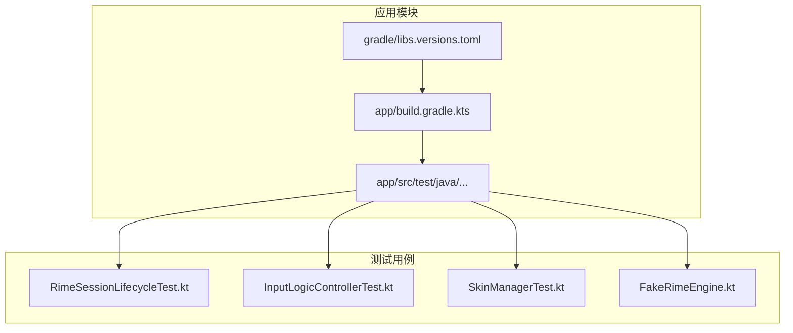
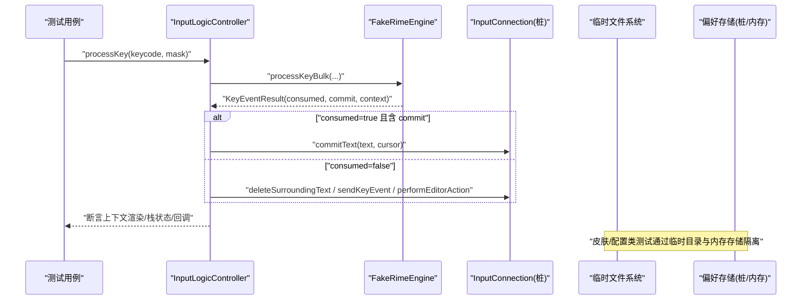
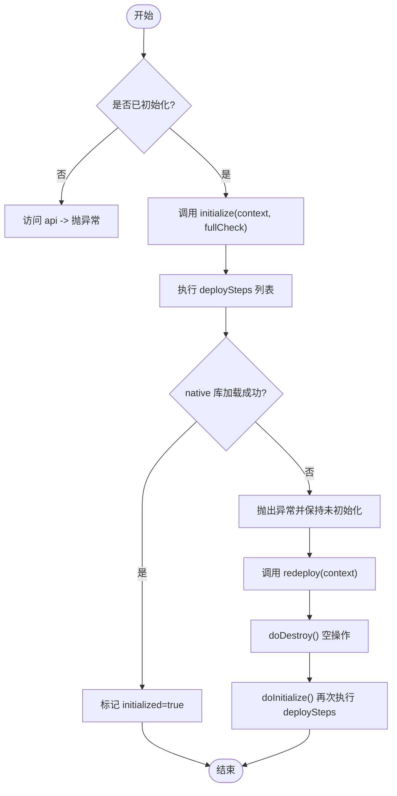
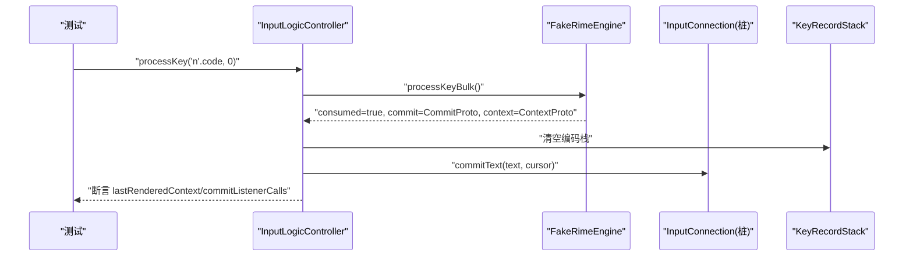
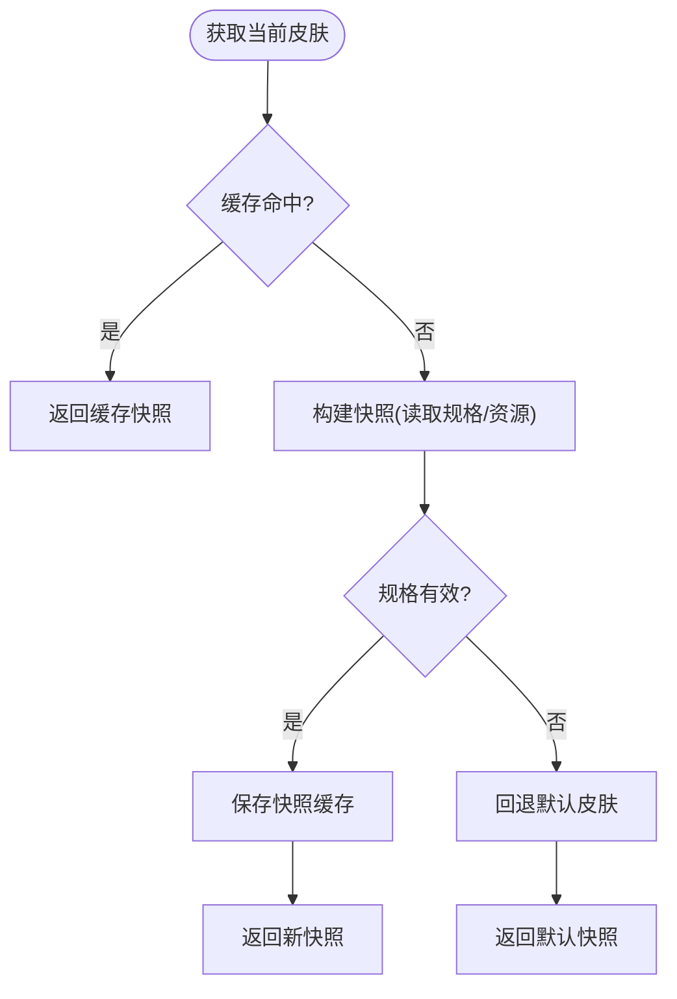
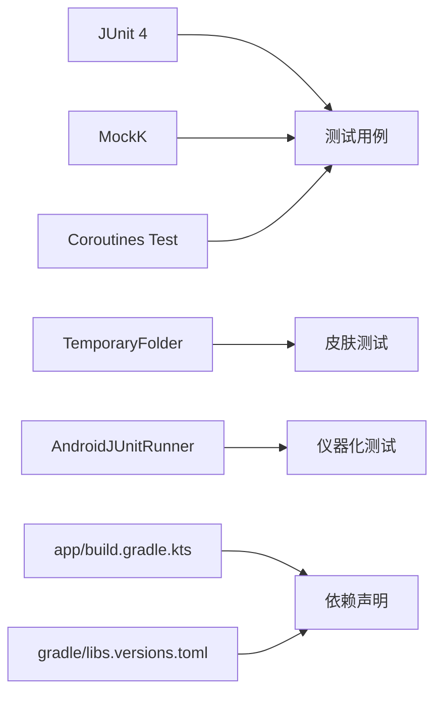

# 集成测试策略

<cite>
**本文引用的文件**   
- [RimeSessionLifecycleTest.kt](file://app/src/test/java/com/ziyou/ime/daemon/RimeSessionLifecycleTest.kt)
- [InputLogicControllerTest.kt](file://app/src/test/java/com/ziyou/ime/ime/InputLogicControllerTest.kt)
- [SkinManagerTest.kt](file://app/src/test/java/com/ziyou/ime/skin/SkinManagerTest.kt)
- [FakeRimeEngine.kt](file://app/src/test/java/com/ziyou/ime/testing/FakeRimeEngine.kt)
- [build.gradle.kts](file://app/build.gradle.kts)
- [libs.versions.toml](file://gradle/libs.versions.toml)
</cite>

## 目录
1. [引言](#引言)
2. [项目结构](#项目结构)
3. [核心组件](#核心组件)
4. [架构总览](#架构总览)
5. [详细组件分析](#详细组件分析)
6. [依赖分析](#依赖分析)
7. [性能考虑](#性能考虑)
8. [故障排查指南](#故障排查指南)
9. [结论](#结论)
10. [附录](#附录)

## 引言
本技术文档面向 Android 输入法项目的集成测试策略，围绕以下目标展开：
- 解释 RimeSessionLifecycleTest 中的引擎生命周期测试设计
- 解释 InputLogicControllerTest 中的输入逻辑集成测试设计
- 解释 SkinManagerTest 中的皮肤管理集成测试设计
- 说明在 Android 环境下如何使用 Robolectric 或 AndroidJUnitRunner 进行组件测试
- 给出数据库、网络请求与文件操作的集成测试策略
- 明确测试环境隔离与数据清理机制
- 提供复杂业务逻辑与组件交互的集成测试示例
- 总结性能优化与调试技巧

## 项目结构
本项目采用多模块组织，测试代码集中在 app 模块的 test 目录中。关键测试文件包括：
- 引擎生命周期：app/src/test/java/com/ziyou/ime/daemon/RimeSessionLifecycleTest.kt
- 输入逻辑：app/src/test/java/com/ziyou/ime/ime/InputLogicControllerTest.kt
- 皮肤管理：app/src/test/java/com/ziyou/ime/skin/SkinManagerTest.kt
- 测试替身（Fake）：app/src/test/java/com/ziyou/ime/testing/FakeRimeEngine.kt
- 构建与测试配置：app/build.gradle.kts、gradle/libs.versions.toml

**图表来源** 
- [build.gradle.kts:1-192](file://app/build.gradle.kts#L1-L192)
- [libs.versions.toml:1-51](file://gradle/libs.versions.toml#L1-L51)

**章节来源**
- [build.gradle.kts:1-192](file://app/build.gradle.kts#L1-L192)
- [libs.versions.toml:1-51](file://gradle/libs.versions.toml#L1-L51)

## 核心组件
- RimeSessionLifecycleTest：验证 RimeSession 的生命周期行为（未初始化状态、initialize 失败路径、deploySteps 执行顺序、redeploy 重执行），并通过反射重置单例状态保证测试隔离。
- InputLogicControllerTest：覆盖 processKey 热路径，使用 FakeRimeEngine 注入到 AppContainer，断言 commit、上下文渲染、退格/回车路由、commitTarget 分流、异常容错与 inputMutex 串行化等。
- SkinManagerTest：验证皮肤快照缓存命中与失效、非法切换拒绝、损坏回退默认皮肤；使用 TemporaryFolder 与 FakeSkinContext 实现文件系统隔离。
- FakeRimeEngine：可配置的 RimeEngine/RimeApi 替身，记录调用历史并控制返回值，用于输入逻辑与引擎交互的确定性测试。

**章节来源**
- [RimeSessionLifecycleTest.kt:1-180](file://app/src/test/java/com/ziyou/ime/daemon/RimeSessionLifecycleTest.kt#L1-L180)
- [InputLogicControllerTest.kt:1-530](file://app/src/test/java/com/ziyou/ime/ime/InputLogicControllerTest.kt#L1-L530)
- [SkinManagerTest.kt:1-80](file://app/src/test/java/com/ziyou/ime/skin/SkinManagerTest.kt#L1-L80)
- [FakeRimeEngine.kt:1-203](file://app/src/test/java/com/ziyou/ime/testing/FakeRimeEngine.kt#L1-L203)

## 架构总览
下图展示了集成测试的关键交互：测试通过替换真实依赖（如 RimeEngine）为 Fake 实现，驱动被测组件（InputLogicController、SkinManager、RimeSession）完成端到端流程，同时断言外部副作用（InputConnection、文件系统、偏好存储）。

**图表来源** 
- [InputLogicControllerTest.kt:80-120](file://app/src/test/java/com/ziyou/ime/ime/InputLogicControllerTest.kt#L80-L120)
- [FakeRimeEngine.kt:59-100](file://app/src/test/java/com/ziyou/ime/testing/FakeRimeEngine.kt#L59-L100)

## 详细组件分析

### RimeSession 生命周期测试
- 未初始化状态：访问 api 抛出异常；destroy 为空操作。
- initialize 失败路径：由于 native 库不可用，initialize 抛出异常但保持未初始化状态；在此之前 deploySteps 已按序执行。
- redeploy：在未初始化状态下也可安全调用，内部先 doDestroy（空操作）再 doInitialize，重新执行 deploySteps。
- 测试隔离：通过反射重置单例内部字段（dispatcher、rimeApi、sessionScope、isInitialized），避免跨用例污染。

**图表来源** 
- [RimeSessionLifecycleTest.kt:56-140](file://app/src/test/java/com/ziyou/ime/daemon/RimeSessionLifecycleTest.kt#L56-L140)

**章节来源**
- [RimeSessionLifecycleTest.kt:1-180](file://app/src/test/java/com/ziyou/ime/daemon/RimeSessionLifecycleTest.kt#L1-L180)

### InputLogicController 输入逻辑集成测试
- 按键被 Rime 消费：提交文本、清空编码栈、刷新 UI 上下文；commitListener 统计码点长度。
- 按键未消费：退格删除周围文本；回车根据编辑器类型决定发送键事件或执行编辑器动作；可打印字符直接提交。
- commitTarget 路由：当存在面板目标时，提交/删除/回车走目标接口而非 InputConnection。
- 异常容错：引擎抛异常时不提交、不渲染，保证健壮性。
- 并发串行化：inputMutex 确保多次 processKey 调用按序执行，结果与顺序一致。
- 选词与分段确认：selectCandidate 支持部分确认、末尾补发 End、校验编码匹配度，必要时清栈降级。
- 编码长度上限防护：达到上限后丢弃后续编码键，功能键（退格、空格）绕过限制。

**图表来源** 
- [InputLogicControllerTest.kt:84-122](file://app/src/test/java/com/ziyou/ime/ime/InputLogicControllerTest.kt#L84-L122)
- [FakeRimeEngine.kt:73-82](file://app/src/test/java/com/ziyou/ime/testing/FakeRimeEngine.kt#L73-L82)

**章节来源**
- [InputLogicControllerTest.kt:1-530](file://app/src/test/java/com/ziyou/ime/ime/InputLogicControllerTest.kt#L1-L530)
- [FakeRimeEngine.kt:1-203](file://app/src/test/java/com/ziyou/ime/testing/FakeRimeEngine.kt#L1-L203)

### SkinManager 皮肤管理集成测试
- 快照缓存命中：连续获取相同快照对象。
- 失效重建：invalidate 后返回新快照对象。
- 当前皮肤 ID 变更：切换到不同皮肤后返回新快照。
- 非法切换拒绝：设置未知皮肤 ID 不生效。
- 损坏回退：当前皮肤指向不存在目录时回退默认皮肤并复位 ID。
- 隔离机制：使用 TemporaryFolder 与 FakeSkinContext，避免影响系统资源与持久化存储。

**图表来源** 
- [SkinManagerTest.kt:37-78](file://app/src/test/java/com/ziyou/ime/skin/SkinManagerTest.kt#L37-L78)

**章节来源**
- [SkinManagerTest.kt:1-80](file://app/src/test/java/com/ziyou/ime/skin/SkinManagerTest.kt#L1-L80)

## 依赖分析
- 测试框架与工具：
  - JUnit 4、MockK、Coroutines Test 用于单元测试与协程调度控制
  - TemporaryFolder 用于文件系统隔离
  - AndroidJUnitRunner 作为仪器化测试运行器（由 build.gradle.kts 指定）
- 构建与版本管理：
  - app/build.gradle.kts 定义测试运行器、AndroidX 依赖、Compose BOM、Coroutines、MockK、org.json（JVM 单测）等
  - gradle/libs.versions.toml 集中管理依赖版本

**图表来源** 
- [build.gradle.kts:105-192](file://app/build.gradle.kts#L105-L192)
- [libs.versions.toml:1-51](file://gradle/libs.versions.toml#L1-L51)

**章节来源**
- [build.gradle.kts:1-192](file://app/build.gradle.kts#L1-L192)
- [libs.versions.toml:1-51](file://gradle/libs.versions.toml#L1-L51)

## 性能考虑
- 使用 FakeRimeEngine 替代 JNI 与原生库调用，避免昂贵的 native 初始化与 I/O，提升单测速度。
- 对协程测试使用 UnconfinedTestDispatcher 或 runTest 虚拟时间，避免真实线程调度带来的不确定性与时序问题。
- 针对超时路径（如 initialize 的 withTimeoutOrNull）在 runBlocking 下执行，避免虚拟时间导致的竞态分支误判。
- 皮肤快照缓存减少重复构建开销；测试中通过 invalidate 精确控制失效时机。
- 输入逻辑测试关注热路径（processKey），通过批量结果队列与调用计数降低断言成本。

[本节为通用指导，不直接分析具体文件]

## 故障排查指南
- 未初始化访问异常：检查 RimeSession.initialized 状态与 initialize/redeploy 调用链；确保测试前 resetRimeSessionState。
- native 库缺失导致初始化失败：确认测试环境无 native 库时，initialize 应抛出异常且保持未初始化；deploySteps 应在失败前执行。
- 输入逻辑异常：若引擎抛异常，确认 controller 捕获异常且不提交/渲染；检查 inputMutex 串行化是否正确。
- 皮肤快照不一致：检查 SkinRepository 的当前皮肤 ID 与缓存失效逻辑；确认 TemporaryFolder 与 FakeSkinContext 正确隔离。
- 并发与时序问题：使用 runTest 与协程测试工具控制调度；避免在虚拟时间下触发真实超时竞态。

**章节来源**
- [RimeSessionLifecycleTest.kt:141-179](file://app/src/test/java/com/ziyou/ime/daemon/RimeSessionLifecycleTest.kt#L141-L179)
- [InputLogicControllerTest.kt:277-310](file://app/src/test/java/com/ziyou/ime/ime/InputLogicControllerTest.kt#L277-L310)
- [SkinManagerTest.kt:21-35](file://app/src/test/java/com/ziyou/ime/skin/SkinManagerTest.kt#L21-L35)

## 结论
本项目的集成测试策略以“替换依赖 + 严格断言”为核心：
- 通过 FakeRimeEngine 屏蔽 native 与外部系统，确保输入逻辑与引擎交互的可测试性与稳定性
- 利用 TemporaryFolder 与内存存储实现文件系统与配置的隔离
- 借助协程测试工具与 Unconfined 调度，消除异步竞态与不确定行为
- 针对生命周期、输入热路径、皮肤快照等关键场景提供完备用例，覆盖异常与边界条件

[本节为总结，不直接分析具体文件]

## 附录
- Android 组件测试运行器：
  - 仪器化测试：androidTestImplementation 依赖 Espresso、AndroidX Test、Compose UI Test；运行器由 testInstrumentationRunner 指定为 AndroidJUnitRunner
  - 单测：testImplementation 包含 JUnit、MockK、Coroutines Test、org.json（JVM）
- 数据库测试策略（建议）：
  - 使用内存版 SQLite 或 In-Memory DB，测试前后清理表数据
  - 使用事务回滚保证用例间隔离
- 网络请求测试策略（建议）：
  - 使用 OkHttp MockWebServer 或 Retrofit 的 Mock 适配器，录制/回放响应
  - 断言请求参数、URL、HTTP 方法与状态码
- 文件操作测试策略（建议）：
  - 使用 TemporaryFolder 创建独立目录，模拟用户目录与缓存目录
  - 校验读写权限、编码、文件结构与元数据

[本节为通用指导，不直接分析具体文件]