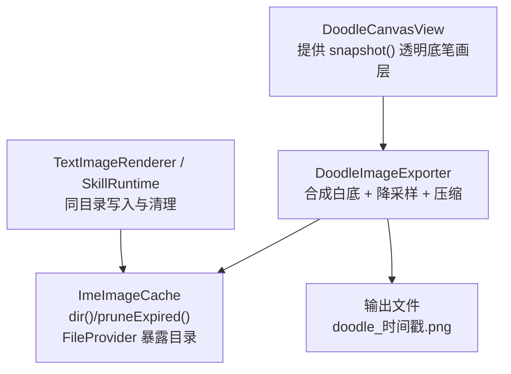
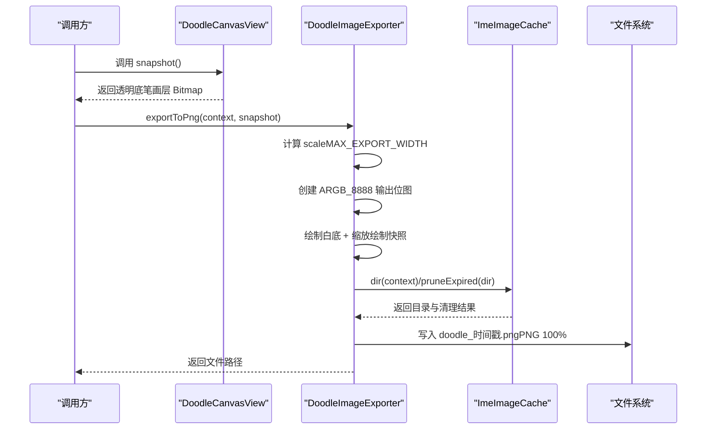
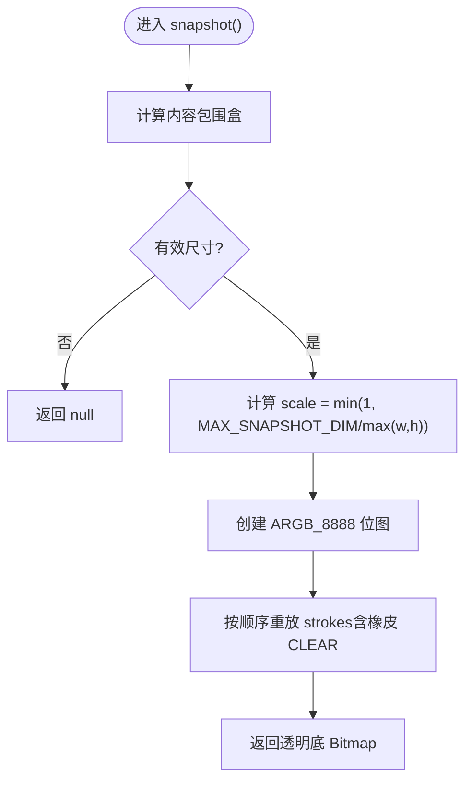
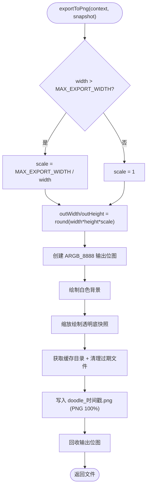
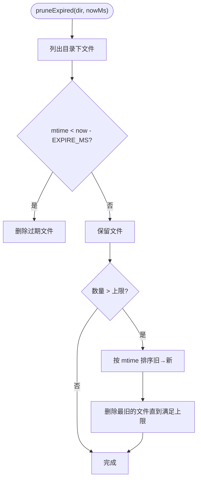
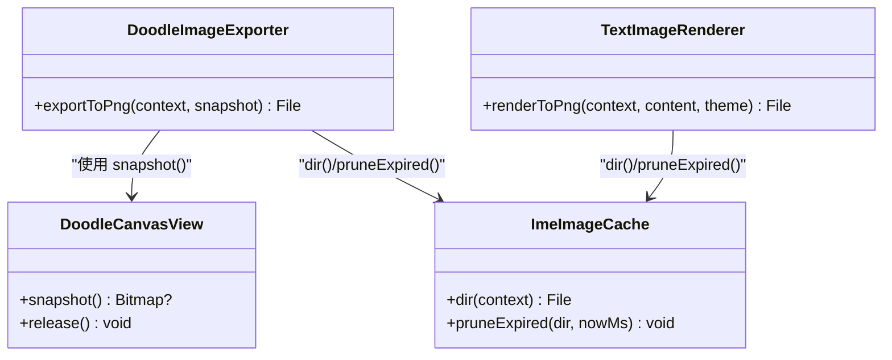

# 图片导出机制

<cite>
**本文引用的文件**   
- [DoodleCanvasView.kt](file://app/src/main/java/com/ziyou/ime/ime/DoodleCanvasView.kt)
- [DoodleImageExporter.kt](file://app/src/main/java/com/ziyou/ime/ime/DoodleImageExporter.kt)
- [TextImageRenderer.kt](file://app/src/main/java/com/ziyou/ime/ime/TextImageRenderer.kt)
- [ImeImageCacheTest.kt](file://app/src/test/java/com/ziyou/ime/ime/ImeImageCacheTest.kt)
</cite>

## 目录
1. [简介](#简介)
2. [项目结构](#项目结构)
3. [核心组件](#核心组件)
4. [架构总览](#架构总览)
5. [详细组件分析](#详细组件分析)
6. [依赖关系分析](#依赖关系分析)
7. [性能考量](#性能考量)
8. [故障排查指南](#故障排查指南)
9. [结论](#结论)
10. [附录：使用示例与最佳实践](#附录使用示例与最佳实践)

## 简介
本技术文档聚焦于涂鸦图片导出机制，围绕 DoodleImageExporter 的位图生成流程展开，涵盖从 DoodleCanvasView 获取快照数据、位图格式转换、质量压缩算法、导出尺寸限制与降采样策略（防止超大 Bitmap 导致 OOM）、存储管理（命名规则、目录结构、过期清理）、图片格式支持（PNG/JPEG）、透明度处理与色彩空间注意事项、异步导出流程、回调与错误处理策略，以及优化建议与性能调优技巧。

## 项目结构
- 涂鸦画布视图负责采集笔迹、维护世界坐标下的笔画栈、离屏缓存与视口平移，并提供 snapshot() 输出透明底的仅笔画层位图。
- 导出器将透明底快照合成为不透明白底 PNG，进行等比降采样与压缩，并写入共享缓存目录。
- 文本渲染器与技能运行时同样使用该缓存目录与清理策略，保证 FileProvider 暴露路径一致且避免误删未读文件。

**图表来源** 
- [DoodleCanvasView.kt:438-464](file://app/src/main/java/com/ziyou/ime/ime/DoodleCanvasView.kt#L438-L464)
- [DoodleImageExporter.kt:32-62](file://app/src/main/java/com/ziyou/ime/ime/DoodleImageExporter.kt#L32-L62)
- [TextImageRenderer.kt:96-102](file://app/src/main/java/com/ziyou/ime/ime/TextImageRenderer.kt#L96-L102)

**章节来源**
- [DoodleCanvasView.kt:17-40](file://app/src/main/java/com/ziyou/ime/ime/DoodleCanvasView.kt#L17-L40)
- [DoodleImageExporter.kt:11-20](file://app/src/main/java/com/ziyou/ime/ime/DoodleImageExporter.kt#L11-L20)
- [TextImageRenderer.kt:14-25](file://app/src/main/java/com/ziyou/ime/ime/TextImageRenderer.kt#L14-L25)

## 核心组件
- DoodleCanvasView：无限画布、双层渲染、撤销/橡皮/平移、snapshot() 输出透明底笔画层。
- DoodleImageExporter：将透明底快照合成为白底 PNG，按宽度上限等比降采样，写入缓存目录。
- ImeImageCache（通过 dir()/pruneExpired() 被调用）：提供缓存目录与过期清理策略，确保对端应用异步读取安全。

**章节来源**
- [DoodleCanvasView.kt:438-464](file://app/src/main/java/com/ziyou/ime/ime/DoodleCanvasView.kt#L438-L464)
- [DoodleImageExporter.kt:21-62](file://app/src/main/java/com/ziyou/ime/ime/DoodleImageExporter.kt#L21-L62)
- [TextImageRenderer.kt:96-102](file://app/src/main/java/com/ziyou/ime/ime/TextImageRenderer.kt#L96-L102)

## 架构总览
下图展示从“用户绘制”到“导出为 PNG 文件”的端到端流程，包括尺寸限制、降采样、合成与存储。

**图表来源** 
- [DoodleCanvasView.kt:438-464](file://app/src/main/java/com/ziyou/ime/ime/DoodleCanvasView.kt#L438-L464)
- [DoodleImageExporter.kt:32-62](file://app/src/main/java/com/ziyou/ime/ime/DoodleImageExporter.kt#L32-L62)
- [TextImageRenderer.kt:96-102](file://app/src/main/java/com/ziyou/ime/ime/TextImageRenderer.kt#L96-L102)

## 详细组件分析

### DoodleCanvasView 快照生成
- 快照目标：输出透明底、仅笔画层的 Bitmap，用于后续合成。
- 包围盒计算：基于所有非橡皮笔画的世界坐标包围盒，考虑笔宽外扩留白。
- 尺寸限制：若包围盒最大边超过 MAX_SNAPSHOT_DIM（2048px），则等比缩放至不超过该阈值，避免超大 Bitmap。
- 渲染过程：在独立 Canvas 上按落笔顺序重放 strokes（pen 绘制或橡皮 CLEAR），还原合成结果。
- 资源管理：返回的 Bitmap 由调用方负责 recycle；release() 回收离屏层与笔画栈。

**图表来源** 
- [DoodleCanvasView.kt:409-430](file://app/src/main/java/com/ziyou/ime/ime/DoodleCanvasView.kt#L409-L430)
- [DoodleCanvasView.kt:438-464](file://app/src/main/java/com/ziyou/ime/ime/DoodleCanvasView.kt#L438-L464)

**章节来源**
- [DoodleCanvasView.kt:438-464](file://app/src/main/java/com/ziyou/ime/ime/DoodleCanvasView.kt#L438-L464)

### DoodleImageExporter 导出流程
- 输入：透明底笔画层 Bitmap（来自 DoodleCanvasView.snapshot）。
- 尺寸限制与降采样：当宽度超过 MAX_EXPORT_WIDTH（1080px）时，按等比比例缩放输出尺寸，最小尺寸为 1px。
- 合成背景：创建 ARGB_8888 位图，先绘制白色背景，再缩放绘制透明底快照，确保部分接收应用不会将透明区渲染为黑色。
- 存储管理：调用 ImeImageCache.dir(context) 获取缓存目录，执行 pruneExpired(dir) 清理过期文件，然后以“doodle_时间戳.png”命名写入。
- 压缩：使用 PNG 格式，质量参数 100（无损压缩）。
- 资源释放：finally 中回收输出位图，避免内存泄漏。

**图表来源** 
- [DoodleImageExporter.kt:32-62](file://app/src/main/java/com/ziyou/ime/ime/DoodleImageExporter.kt#L32-L62)

**章节来源**
- [DoodleImageExporter.kt:21-62](file://app/src/main/java/com/ziyou/ime/ime/DoodleImageExporter.kt#L21-L62)

### 存储管理与清理策略（ImeImageCache）
- 目录：统一通过 ImeImageCache.dir(context) 获取，供 FileProvider 暴露。
- 命名规则：doodle_时间戳.png（导出器），ai_answer_时间戳.png（文本渲染器）。
- 清理策略：pruneExpired(dir, nowMs) 删除超过过期阈值的文件，并在爆发式发图时按 mtime 补删，保留最近 N 个文件，避免误删对端尚未异步读走的新图。
- 测试验证：测试用例覆盖过期删除、宽限窗口保留、目录不存在安全早返回等场景。

**图表来源** 
- [ImeImageCacheTest.kt:25-41](file://app/src/test/java/com/ziyou/ime/ime/ImeImageCacheTest.kt#L25-L41)
- [ImeImageCacheTest.kt:43-61](file://app/src/test/java/com/ziyou/ime/ime/ImeImageCacheTest.kt#L43-L61)
- [ImeImageCacheTest.kt:63-69](file://app/src/test/java/com/ziyou/ime/ime/ImeImageCacheTest.kt#L63-L69)

**章节来源**
- [TextImageRenderer.kt:96-102](file://app/src/main/java/com/ziyou/ime/ime/TextImageRenderer.kt#L96-L102)
- [ImeImageCacheTest.kt:25-41](file://app/src/test/java/com/ziyou/ime/ime/ImeImageCacheTest.kt#L25-L41)

### 图片格式支持与透明度处理
- 格式：当前实现使用 PNG（无损压缩，质量 100），适合保留线条清晰度与透明通道信息（尽管导出前已合成白底）。
- 透明度处理：DoodleCanvasView 输出的透明底仅在导出阶段被合成到白底，避免部分接收应用将透明区域渲染为黑色。
- 色彩空间：ARGB_8888 提供完整 Alpha 通道；导出后为不透明 PNG，兼容大多数分享场景。

**章节来源**
- [DoodleImageExporter.kt:40-57](file://app/src/main/java/com/ziyou/ime/ime/DoodleImageExporter.kt#L40-L57)
- [DoodleCanvasView.kt:447-463](file://app/src/main/java/com/ziyou/ime/ime/DoodleCanvasView.kt#L447-L463)

### 导出回调机制与异步流程
- 回调：当前导出器为同步方法，无内置回调接口；调用方可自行封装回调（成功/失败）与进度上报。
- 异步建议：由于纯 CPU 绘制与压缩，建议在后台线程执行，避免阻塞主线程；可结合协程或线程池实现异步导出。
- 错误处理：捕获 IO 异常与压缩异常，向上抛出或转换为业务错误码；确保 finally 中回收位图。

[本节为通用指导，不涉及具体文件分析]

## 依赖关系分析
- DoodleImageExporter 依赖 DoodleCanvasView 提供的透明底快照。
- DoodleImageExporter 依赖 ImeImageCache 的 dir()/pruneExpired() 进行存储与清理。
- TextImageRenderer/SkillRuntime 与导出器共用同一缓存目录与清理策略，确保一致性。

**图表来源** 
- [DoodleCanvasView.kt:438-464](file://app/src/main/java/com/ziyou/ime/ime/DoodleCanvasView.kt#L438-L464)
- [DoodleImageExporter.kt:32-62](file://app/src/main/java/com/ziyou/ime/ime/DoodleImageExporter.kt#L32-L62)
- [TextImageRenderer.kt:96-102](file://app/src/main/java/com/ziyou/ime/ime/TextImageRenderer.kt#L96-L102)

**章节来源**
- [DoodleCanvasView.kt:438-464](file://app/src/main/java/com/ziyou/ime/ime/DoodleCanvasView.kt#L438-L464)
- [DoodleImageExporter.kt:32-62](file://app/src/main/java/com/ziyou/ime/ime/DoodleImageExporter.kt#L32-L62)
- [TextImageRenderer.kt:96-102](file://app/src/main/java/com/ziyou/ime/ime/TextImageRenderer.kt#L96-L102)

## 性能考量
- 尺寸限制与降采样：
  - DoodleCanvasView 的 MAX_SNAPSHOT_DIM（2048px）限制快照最大边长，避免超大 Bitmap。
  - DoodleImageExporter 的 MAX_EXPORT_WIDTH（1080px）限制导出宽度，超限时等比缩放。
- 内存占用：
  - 使用 ARGB_8888 位图，注意及时 recycle；导出完成后立即回收输出位图。
  - 离屏 backingBitmap 在 release() 中回收，确保零驻留内存。
- I/O 与压缩：
  - PNG 100% 压缩体积较大但清晰度高；如需更小体积可考虑 JPEG（需处理透明度）。
  - 批量导出时建议合并清理操作，减少磁盘遍历次数。
- 并发与线程：
  - 导出为 CPU 密集任务，应在后台线程执行；避免在主线程阻塞 UI。

[本节为通用指导，不涉及具体文件分析]

## 故障排查指南
- 导出结果为黑底：
  - 检查是否直接传递透明底给接收应用；应确保导出器已合成白底。
- OOM 崩溃：
  - 确认 MAX_SNAPSHOT_DIM 与 MAX_EXPORT_WIDTH 设置合理；避免超大分辨率导出。
  - 检查是否忘记 recycle 位图。
- 文件未出现或被误删：
  - 确认 ImeImageCache.pruneExpired 的过期阈值与调用时机；避免在宽限窗口内误删。
  - 检查 FileProvider 暴露目录是否正确。
- 导出缓慢：
  - 评估是否需要降低导出尺寸或改用 JPEG；优化压缩参数。

**章节来源**
- [DoodleImageExporter.kt:32-62](file://app/src/main/java/com/ziyou/ime/ime/DoodleImageExporter.kt#L32-L62)
- [ImeImageCacheTest.kt:25-41](file://app/src/test/java/com/ziyou/ime/ime/ImeImageCacheTest.kt#L25-L41)

## 结论
DoodleImageExporter 通过严格的尺寸限制与等比降采样，结合透明底白底合成与 PNG 无损压缩，实现了稳定可靠的涂鸦图片导出。配合 ImeImageCache 的过期清理策略，既保证了分享体验，又避免了内存与存储风险。建议在实际使用中采用异步导出、完善回调与错误处理，并根据场景权衡 PNG/JPEG 的体积与质量。

[本节为总结性内容，不涉及具体文件分析]

## 附录：使用示例与最佳实践
- 配置导出选项：
  - 调整 MAX_EXPORT_WIDTH 控制导出宽度上限；根据设备像素密度与分享平台需求设定。
  - 如需 JPEG，可在导出器中增加格式选择与透明度处理逻辑。
- 监听导出进度：
  - 封装异步任务，分阶段回调（开始、压缩中、完成、失败）。
- 处理导出失败：
  - 捕获 IO 异常与压缩异常，提示用户重试或降级（如缩小尺寸）。
- 图片优化建议：
  - 优先使用 PNG 保持线条清晰度；对照片类内容可考虑 JPEG 减小体积。
  - 合理设置导出尺寸，避免过大导致传输与显示问题。
- 存储空间管理策略：
  - 定期调用 pruneExpired 清理过期文件；监控可用空间，必要时限制导出频率。
- 性能调优技巧：
  - 后台线程执行导出；复用 Paint/Canvas 对象；避免频繁创建大位图。

[本节为通用指导，不涉及具体文件分析]