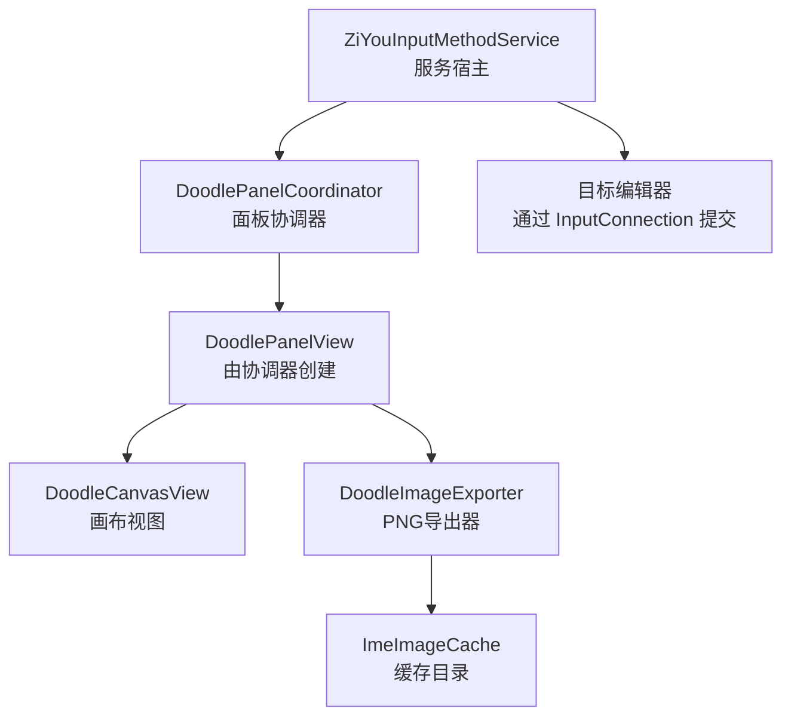
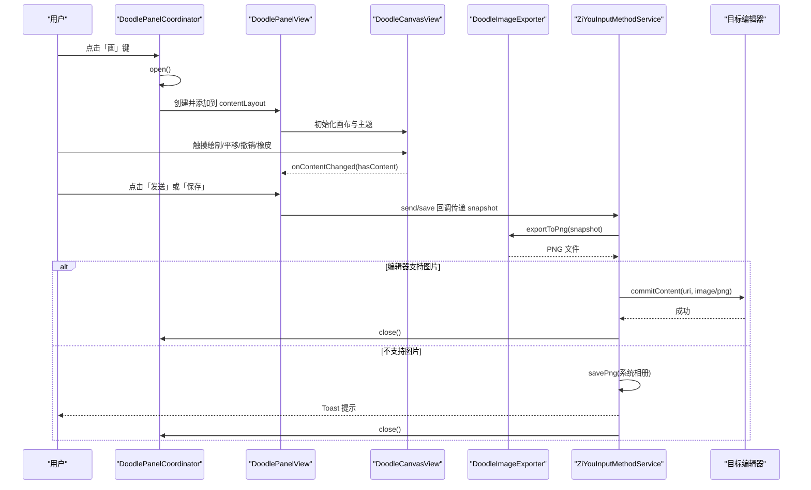
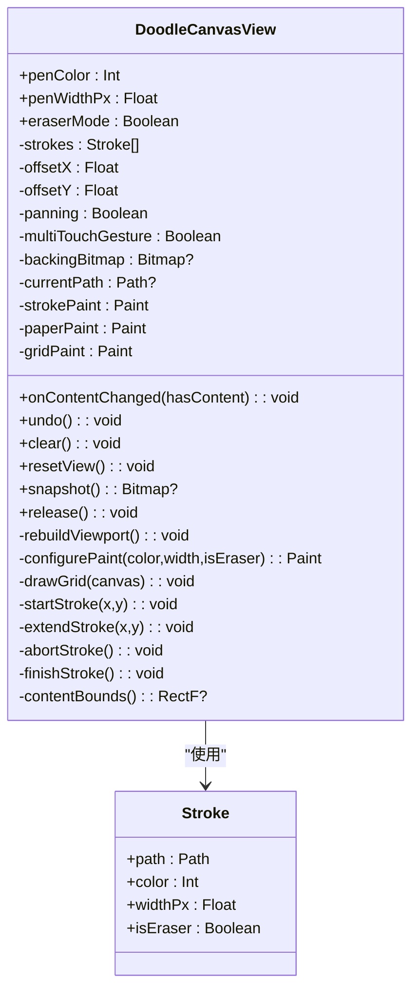
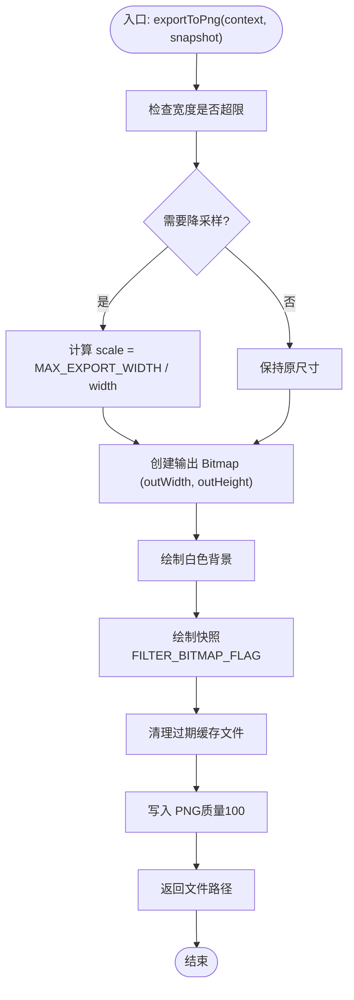
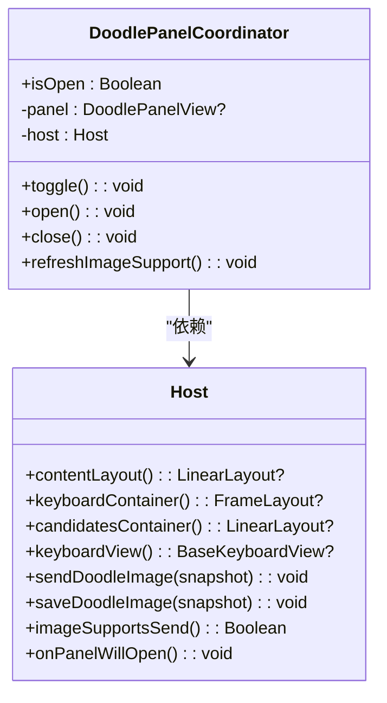
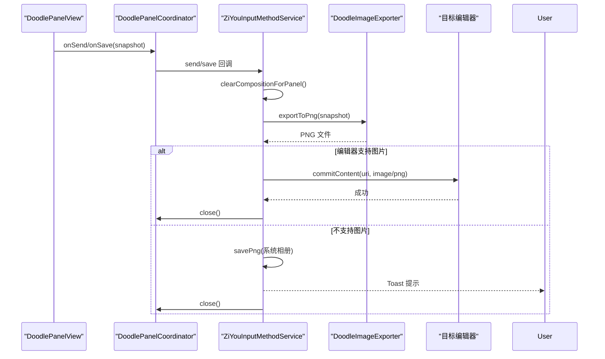
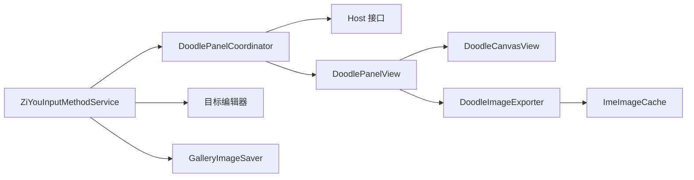

# 涂鸦画板

<cite>
**本文引用的文件**   
- [DoodleCanvasView.kt](file://app/src/main/java/com/ziyou/ime/ime/DoodleCanvasView.kt)
- [DoodleImageExporter.kt](file://app/src/main/java/com/ziyou/ime/ime/DoodleImageExporter.kt)
- [DoodlePanelCoordinator.kt](file://app/src/main/java/com/ziyou/ime/ime/DoodlePanelCoordinator.kt)
- [ZiYouInputMethodService.kt](file://app/src/main/java/com/ziyou/ime/ime/ZiYouInputMethodService.kt)
</cite>

## 目录
1. [简介](#简介)
2. [项目结构](#项目结构)
3. [核心组件](#核心组件)
4. [架构总览](#架构总览)
5. [详细组件分析](#详细组件分析)
6. [依赖关系分析](#依赖关系分析)
7. [性能考量](#性能考量)
8. [故障排查指南](#故障排查指南)
9. [结论](#结论)
10. [附录：示例与最佳实践](#附录示例与最佳实践)

## 简介
本技术文档围绕输入法中的“涂鸦画板”能力展开，系统性说明以下模块的实现与协作：
- DoodleCanvasView：无限画布、触摸事件处理、画笔工具、颜色选择、撤销重做机制。
- DoodleImageExporter：位图生成、格式转换、质量压缩与存储管理。
- DoodlePanelCoordinator：面板生命周期管理、与其他面板的互斥逻辑、布局调整机制。
- 与输入法的集成：图片插入、文本混合编辑、状态同步。
并提供自定义画笔效果与导出选项的实践建议，以及用户交互流程与性能优化要点。

## 项目结构
涂鸦画板相关代码位于 ime 包下，由视图层（画布）、导出器、面板协调器与服务宿主组成，职责清晰、耦合低：
- 视图层：DoodleCanvasView 负责绘制与手势处理。
- 导出器：DoodleImageExporter 负责将快照合成 PNG 并落盘。
- 面板协调器：DoodlePanelCoordinator 负责打开/关闭面板、接管键盘与候选区高度、按钮态切换。
- 服务宿主：ZiYouInputMethodService 提供容器访问、图片发送/保存入口、编辑器能力探测。

图表来源
- [ZiYouInputMethodService.kt:174-200](file://app/src/main/java/com/ziyou/ime/ime/ZiYouInputMethodService.kt#L174-L200)
- [DoodlePanelCoordinator.kt:79-119](file://app/src/main/java/com/ziyou/ime/ime/DoodlePanelCoordinator.kt#L79-L119)
- [DoodleCanvasView.kt:142-153](file://app/src/main/java/com/ziyou/ime/ime/DoodleCanvasView.kt#L142-L153)
- [DoodleImageExporter.kt:32-62](file://app/src/main/java/com/ziyou/ime/ime/DoodleImageExporter.kt#L32-L62)

章节来源
- [DoodleCanvasView.kt:1-475](file://app/src/main/java/com/ziyou/ime/ime/DoodleCanvasView.kt#L1-L475)
- [DoodleImageExporter.kt:1-64](file://app/src/main/java/com/ziyou/ime/ime/DoodleImageExporter.kt#L1-L64)
- [DoodlePanelCoordinator.kt:1-135](file://app/src/main/java/com/ziyou/ime/ime/DoodlePanelCoordinator.kt#L1-L135)
- [ZiYouInputMethodService.kt:174-200](file://app/src/main/java/com/ziyou/ime/ime/ZiYouInputMethodService.kt#L174-L200)

## 核心组件
- DoodleCanvasView
  - 无限画布：世界坐标存储笔画，offset 描述视口左上角；屏幕坐标 = 世界坐标 − offset。
  - 双层渲染：底层离屏 Bitmap 缓存当前视口可见笔迹；顶层仅绘制实时 Path 与网格。
  - 手势区分：单指绘制，第二指落下进入平移并回滚试探笔画；避免与键盘手势冲突。
  - 编辑操作：撤销（弹出末笔后重放）、橡皮（CLEAR 增量绘入离屏位图）、清空（复位视口）。
  - 导出快照：按全部内容包围盒渲染，带尺寸上限防 OOM。
- DoodleImageExporter
  - 透明底笔迹层合成为不透明白底 PNG，宽度超限时等比降采样。
  - 写入 FileProvider 暴露的缓存子目录，支持 commitContent 直接提交。
- DoodlePanelCoordinator
  - 打开面板时收起键盘与候选区，面板高度等于二者实测高度之和（IME 窗口总高不变）。
  - 根据编辑器是否接受图片动态切换「发送」/「保存」按钮。
  - 与 AI/技能/粘贴板等面板遵循同一拆分纪律，不接管 commitTarget 输入路由。
- ZiYouInputMethodService
  - 提供 Host 接口实现：容器访问、图片发送/保存、编辑器能力探测、面板打开前清理编码。
  - 发送路径：后台线程合成 PNG → FileProvider URI → InputLogicController.commitImageToEditor。
  - 保存路径：后台线程合成 PNG → GalleryImageSaver.savePng → 系统相册。

章节来源
- [DoodleCanvasView.kt:17-40](file://app/src/main/java/com/ziyou/ime/ime/DoodleCanvasView.kt#L17-L40)
- [DoodleImageExporter.kt:11-20](file://app/src/main/java/com/ziyou/ime/ime/DoodleImageExporter.kt#L11-L20)
- [DoodlePanelCoordinator.kt:12-23](file://app/src/main/java/com/ziyou/ime/ime/DoodlePanelCoordinator.kt#L12-L23)
- [ZiYouInputMethodService.kt:174-200](file://app/src/main/java/com/ziyou/ime/ime/ZiYouInputMethodService.kt#L174-L200)

## 架构总览
涂鸦画板的整体交互从面板协调器开始，协调器创建并挂载画布面板，画布通过回调通知内容变化；导出器在后台线程完成 PNG 合成与落盘；服务宿主负责与编辑器通信和相册保存。

图表来源
- [DoodlePanelCoordinator.kt:79-119](file://app/src/main/java/com/ziyou/ime/ime/DoodlePanelCoordinator.kt#L79-L119)
- [DoodleCanvasView.kt:367-390](file://app/src/main/java/com/ziyou/ime/ime/DoodleCanvasView.kt#L367-L390)
- [DoodleImageExporter.kt:32-62](file://app/src/main/java/com/ziyou/ime/ime/DoodleImageExporter.kt#L32-L62)
- [ZiYouInputMethodService.kt:1229-1297](file://app/src/main/java/com/ziyou/ime/ime/ZiYouInputMethodService.kt#L1229-L1297)

## 详细组件分析

### DoodleCanvasView：画布绘制与手势处理
- 坐标系与无限画布
  - 笔画以世界坐标存储于 strokes；offsetX/offsetY 描述视口世界坐标左上角；屏幕坐标 = 世界坐标 − offset。
  - 拖拽即平移 offset，因此画布四向无限延展，可在可视区域外继续绘制。
- 双层渲染策略
  - 底层：离屏 backing Bitmap 作为当前视口的位图缓存（缓存当前 offset 下的可见笔迹）。
  - 顶层：仅当前正在画的一条实时 Path，onDraw = 纸面 + 网格 + drawBitmap + 活动笔迹。
  - 单笔绘制期间 offset 不变，收笔仅把该笔以屏幕坐标烙入位图（O(1)，与笔画总数无关）；平移时才按笔画栈整体重放位图（受 MAX_STROKES 上限约束）。
- 手势区分
  - 单指始终绘制；第二根手指落下即切到平移态并回滚试探中的笔画。
  - 画布在面板内独占触摸区域，与键盘手势零冲突。
- 编辑与导出
  - 撤销：弹出末笔后重放；橡皮：CLEAR 混合模式增量绘入离屏位图；导出 snapshot 渲染全部内容包围盒（非仅视口），带尺寸上限防 OOM。
  - 固定白底 + 主题描边网格，导出图在深色主题下依然清晰可读。

图表来源
- [DoodleCanvasView.kt:60-66](file://app/src/main/java/com/ziyou/ime/ime/DoodleCanvasView.kt#L60-L66)
- [DoodleCanvasView.kt:142-179](file://app/src/main/java/com/ziyou/ime/ime/DoodleCanvasView.kt#L142-L179)
- [DoodleCanvasView.kt:367-430](file://app/src/main/java/com/ziyou/ime/ime/DoodleCanvasView.kt#L367-L430)

章节来源
- [DoodleCanvasView.kt:17-40](file://app/src/main/java/com/ziyou/ime/ime/DoodleCanvasView.kt#L17-L40)
- [DoodleCanvasView.kt:142-179](file://app/src/main/java/com/ziyou/ime/ime/DoodleCanvasView.kt#L142-L179)
- [DoodleCanvasView.kt:226-283](file://app/src/main/java/com/ziyou/ime/ime/DoodleCanvasView.kt#L226-L283)
- [DoodleCanvasView.kt:367-430](file://app/src/main/java/com/ziyou/ime/ime/DoodleCanvasView.kt#L367-L430)

### DoodleImageExporter：图片导出与存储管理
- 功能概述
  - 将 DoodleCanvasView.snapshot 的透明底笔迹层合成为不透明白底图片（避免部分应用渲染为黑色）。
  - 宽度超限时等比降采样，输出写入 cache 下 ImeImageCache.CACHE_DIR_NAME 目录（FileProvider 已暴露，可直接经 commitContent 提交）。
  - 纯 CPU 绘制 + PNG 压缩，须在后台线程调用；传入的快照由调用方负责 recycle。
- 关键流程
  - 计算缩放比例（仅超限时）→ 创建输出 Bitmap → 绘制白底与快照 → 写入缓存目录 → 返回文件路径。

图表来源
- [DoodleImageExporter.kt:32-62](file://app/src/main/java/com/ziyou/ime/ime/DoodleImageExporter.kt#L32-L62)

章节来源
- [DoodleImageExporter.kt:11-20](file://app/src/main/java/com/ziyou/ime/ime/DoodleImageExporter.kt#L11-L20)
- [DoodleImageExporter.kt:32-62](file://app/src/main/java/com/ziyou/ime/ime/DoodleImageExporter.kt#L32-L62)

### DoodlePanelCoordinator：面板协调器设计
- 职责边界
  - 从 ZiYouInputMethodService 剥离「涂鸦面板生命周期 + 键盘收放布局编排」职责，与 AiPanelCoordinator / SkillPanelCoordinator 遵循同一拆分纪律。
  - 与 AI 面板的差异：涂鸦无文字输入需求，打开即收起键盘/候选区，画布接管二者实测高度之和（IME 窗口总高严格不变），且不接管 commitTarget 输入路由——对 Rime 引擎与输入链路零侵入。
- 面板生命周期
  - open：挂载到内容根容器顶部并立即收起键盘/候选区；面板高度 = 二者实测高度之和（未测量时回退固定高度）。
  - close：回收画布资源、恢复键盘/候选区可见，并从容器移除（幂等）。
  - refreshImageSupport：编辑器切换时重判图片能力，刷新面板「发送/保存」按钮。
- 与宿主的能力契约
  - Host 接口提供 contentLayout/keyboardContainer/candidatesContainer/keyboardView 访问，以及 send/save 出口与 onPanelWillOpen 清理。

图表来源
- [DoodlePanelCoordinator.kt:25-62](file://app/src/main/java/com/ziyou/ime/ime/DoodlePanelCoordinator.kt#L25-L62)
- [DoodlePanelCoordinator.kt:79-119](file://app/src/main/java/com/ziyou/ime/ime/DoodlePanelCoordinator.kt#L79-L119)

章节来源
- [DoodlePanelCoordinator.kt:12-23](file://app/src/main/java/com/ziyou/ime/ime/DoodlePanelCoordinator.kt#L12-L23)
- [DoodlePanelCoordinator.kt:79-119](file://app/src/main/java/com/ziyou/ime/ime/DoodlePanelCoordinator.kt#L79-L119)

### 与输入法的集成：图片插入、文本混合编辑与状态同步
- 图片插入
  - 发送路径：后台线程合成 PNG → FileProvider.getUriForFile → InputLogicController.commitImageToEditor → 成功则关闭面板。
  - 保存路径：后台线程合成 PNG → GalleryImageSaver.savePng → 系统相册 → 成功后关闭面板。
- 文本混合编辑
  - 涂鸦面板不接管 commitTarget 输入路由，对 Rime 引擎与输入链路零侵入；面板打开前统一清理活跃编码与候选展示，避免残留 preedit/候选。
- 状态同步
  - 面板打开前调用 clearCompositionForPanel，重置键盘输入状态与候选区；面板按钮态根据 editorAcceptsImage 动态切换。

图表来源
- [ZiYouInputMethodService.kt:284-295](file://app/src/main/java/com/ziyou/ime/ime/ZiYouInputMethodService.kt#L284-L295)
- [ZiYouInputMethodService.kt:1229-1297](file://app/src/main/java/com/ziyou/ime/ime/ZiYouInputMethodService.kt#L1229-L1297)
- [DoodleImageExporter.kt:32-62](file://app/src/main/java/com/ziyou/ime/ime/DoodleImageExporter.kt#L32-L62)

章节来源
- [ZiYouInputMethodService.kt:284-295](file://app/src/main/java/com/ziyou/ime/ime/ZiYouInputMethodService.kt#L284-L295)
- [ZiYouInputMethodService.kt:1229-1297](file://app/src/main/java/com/ziyou/ime/ime/ZiYouInputMethodService.kt#L1229-L1297)

## 依赖关系分析
- 组件耦合
  - DoodlePanelCoordinator 依赖 Host 接口解耦具体实现，降低与 Service 的直接耦合。
  - DoodleCanvasView 通过回调 onContentChanged 通知面板更新按钮可用态，避免反向引用。
  - DoodleImageExporter 独立于 UI，仅依赖上下文与缓存目录，便于测试与复用。
- 外部依赖
  - FileProvider 暴露缓存目录供 commitContent 使用。
  - GalleryImageSaver 用于保存到系统相册（Android 10+）。
  - SkinManager/SkinTheme 提供主题与配色。

图表来源
- [DoodlePanelCoordinator.kt:25-62](file://app/src/main/java/com/ziyou/ime/ime/DoodlePanelCoordinator.kt#L25-L62)
- [DoodleImageExporter.kt:32-62](file://app/src/main/java/com/ziyou/ime/ime/DoodleImageExporter.kt#L32-L62)
- [ZiYouInputMethodService.kt:1229-1297](file://app/src/main/java/com/ziyou/ime/ime/ZiYouInputMethodService.kt#L1229-L1297)

章节来源
- [DoodlePanelCoordinator.kt:25-62](file://app/src/main/java/com/ziyou/ime/ime/DoodlePanelCoordinator.kt#L25-L62)
- [DoodleImageExporter.kt:32-62](file://app/src/main/java/com/ziyou/ime/ime/DoodleImageExporter.kt#L32-L62)
- [ZiYouInputMethodService.kt:1229-1297](file://app/src/main/java/com/ziyou/ime/ime/ZiYouInputMethodService.kt#L1229-L1297)

## 性能考量
- 绘制热路径
  - 单笔绘制期间 offset 不变，收笔仅以屏幕坐标烙入位图（O(1)，与笔画总数无关）。
  - 平移时才按笔画栈整体重放位图（受 MAX_STROKES=500 约束），避免频繁重放。
- 内存控制
  - 导出快照时对内容包围盒进行等比降采样（MAX_SNAPSHOT_DIM=2048px），防止超大 Bitmap 撑爆内存。
  - 导出器对宽度超过 MAX_EXPORT_WIDTH=1080px 的图片进行降采样，减少文件大小与 IO。
- 渲染优化
  - 双层渲染：离屏位图缓存当前视口可见笔迹，顶层仅绘制实时 Path 与网格，保证 onDraw 复杂度稳定。
  - 网格绘制为常数条数（O(1)），与笔画数无关。
- 线程模型
  - 导出与压缩在后台线程执行，UI 反馈在主线程，避免卡顿。
  - 面板打开前清理编码与候选，避免状态残留导致的额外渲染。

[本节为通用性能指导，不直接分析具体文件]

## 故障排查指南
- 常见问题
  - 导出失败或黑图：确认 snapshot 是否为透明底且包含笔画；确保导出器在白底上绘制快照。
  - 编辑器不接受图片：检查 editorAcceptsImage 返回值；若不支持则走保存相册路径。
  - 面板高度异常：当键盘/候选区尚未测量时，协调器会回退固定高度（FALLBACK_PANEL_HEIGHT_DP=300dp）。
  - 内存溢出：检查 MAX_STROKES 与 MAX_SNAPSHOT_DIM 配置；确保及时 recycle 快照与输出 Bitmap。
- 定位方法
  - 查看日志：ZiYouInputMethodService 中记录发送/保存异常与 Toast 提示。
  - 验证缓存目录：确认 ImeImageCache 目录存在且可写。
  - 检查权限：保存到相册需要 Android 10+ 及相应权限。

章节来源
- [ZiYouInputMethodService.kt:1229-1297](file://app/src/main/java/com/ziyou/ime/ime/ZiYouInputMethodService.kt#L1229-L1297)
- [DoodleImageExporter.kt:32-62](file://app/src/main/java/com/ziyou/ime/ime/DoodleImageExporter.kt#L32-L62)
- [DoodlePanelCoordinator.kt:79-119](file://app/src/main/java/com/ziyou/ime/ime/DoodlePanelCoordinator.kt#L79-L119)

## 结论
涂鸦画板通过清晰的职责划分与低耦合设计，实现了高性能的无限画布、稳定的手势处理、可靠的图片导出与面板协调。与输入法的集成遵循“零侵入”原则，确保与 Rime 引擎与输入链路完全解耦。通过合理的内存控制与线程模型，系统在复杂场景下仍保持流畅体验。

[本节为总结性内容，不直接分析具体文件]

## 附录：示例与最佳实践
- 自定义画笔效果
  - 修改 penWidthPx 与 penColor 以改变笔触粗细与颜色。
  - 启用 eraserMode 以切换橡皮擦模式（使用 CLEAR 混合模式）。
  - 参考路径：[DoodleCanvasView.kt:72-78](file://app/src/main/java/com/ziyou/ime/ime/DoodleCanvasView.kt#L72-L78)
- 导出选项定制
  - 调整 MAX_EXPORT_WIDTH 以控制输出宽度上限。
  - 调整 MAX_SNAPSHOT_DIM 以限制导出时的最大边长。
  - 参考路径：[DoodleImageExporter.kt:23-24](file://app/src/main/java/com/ziyou/ime/ime/DoodleImageExporter.kt#L23-L24)、[DoodleCanvasView.kt:56-57](file://app/src/main/java/com/ziyou/ime/ime/DoodleCanvasView.kt#L56-L57)
- 用户交互流程
  - 打开面板：点击「画」键 → 收起键盘与候选区 → 显示画布。
  - 绘制与编辑：单指绘制、双指平移、撤销/橡皮/清空。
  - 发送/保存：根据编辑器能力选择发送或保存到相册 → 成功后关闭面板。
  - 参考路径：[DoodlePanelCoordinator.kt:79-119](file://app/src/main/java/com/ziyou/ime/ime/DoodlePanelCoordinator.kt#L79-L119)、[ZiYouInputMethodService.kt:1229-1297](file://app/src/main/java/com/ziyou/ime/ime/ZiYouInputMethodService.kt#L1229-L1297)
- 性能优化建议
  - 合理设置 MAX_STROKES 与 MAX_SNAPSHOT_DIM，避免内存峰值过高。
  - 在高频绘制场景中尽量减少 invalidate 调用频率。
  - 导出与压缩务必在后台线程执行，避免阻塞主线程。

[本节为实践指导，不直接分析具体文件]