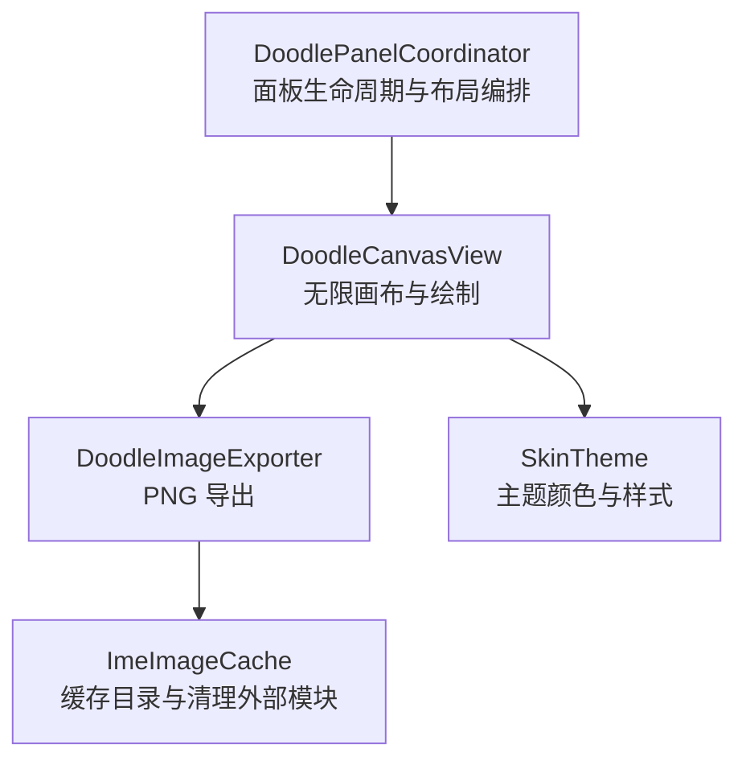
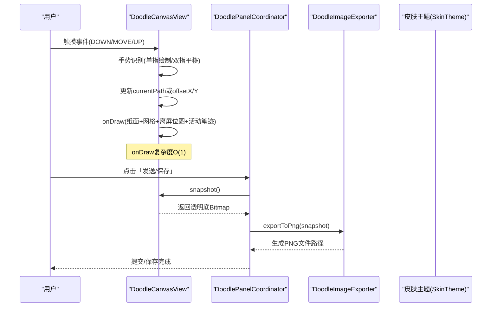
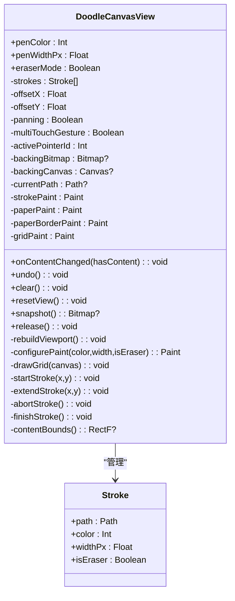
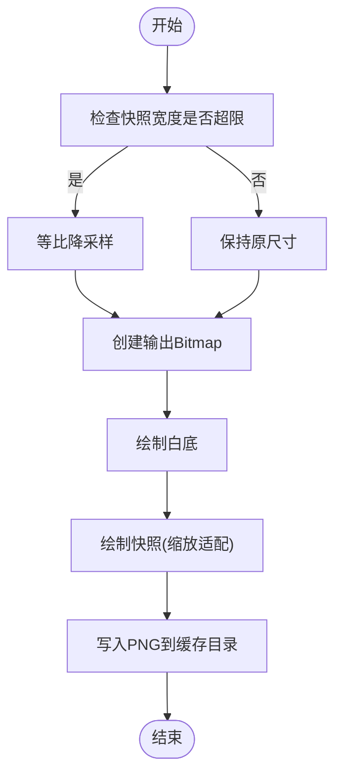
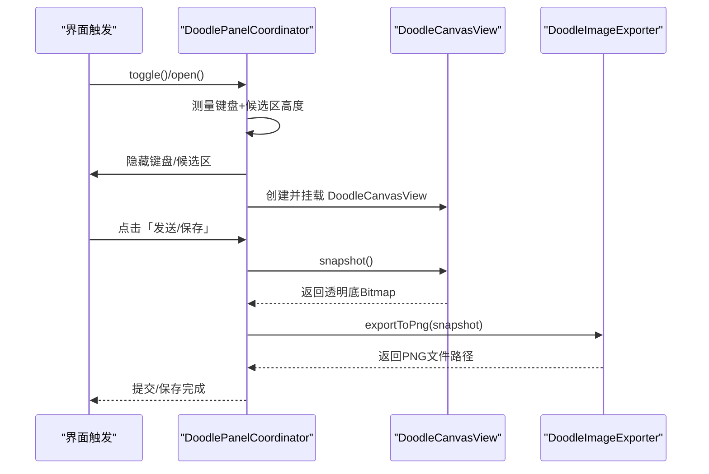
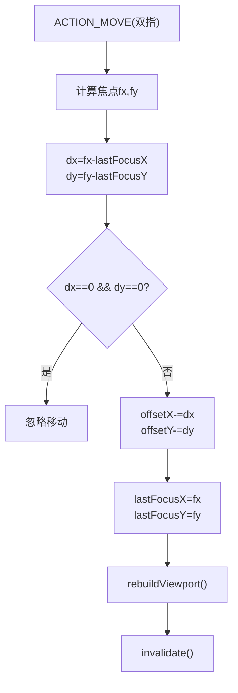
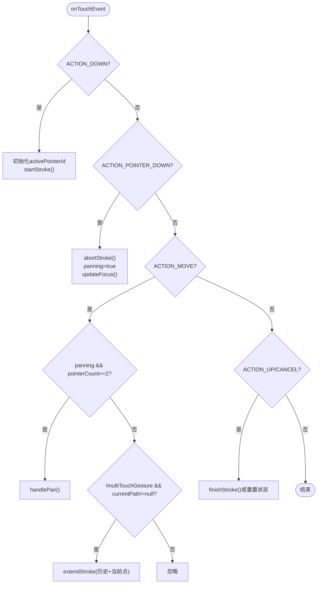
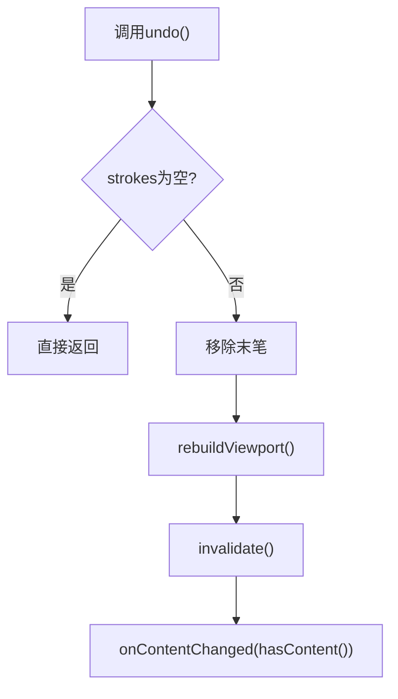
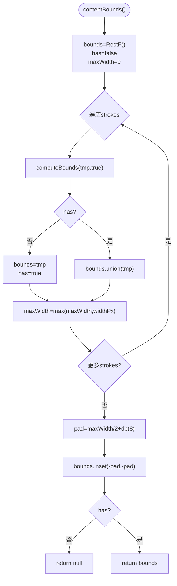
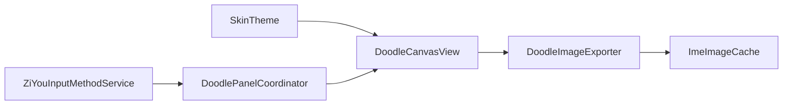

# 画布绘制功能

<cite>
**本文引用的文件**   
- [DoodleCanvasView.kt](file://app/src/main/java/com/ziyou/ime/ime/DoodleCanvasView.kt)
- [DoodleImageExporter.kt](file://app/src/main/java/com/ziyou/ime/ime/DoodleImageExporter.kt)
- [DoodlePanelCoordinator.kt](file://app/src/main/java/com/ziyou/ime/ime/DoodlePanelCoordinator.kt)
- [SkinTheme.kt](file://app/src/main/java/com/ziyou/ime/skin/SkinTheme.kt)
</cite>

## 目录
1. [简介](#简介)
2. [项目结构](#项目结构)
3. [核心组件](#核心组件)
4. [架构总览](#架构总览)
5. [详细组件分析](#详细组件分析)
6. [依赖关系分析](#依赖关系分析)
7. [性能考量](#性能考量)
8. [故障排查指南](#故障排查指南)
9. [结论](#结论)
10. [附录](#附录)

## 简介
本技术文档围绕 DoodleCanvasView 的画布绘制能力进行系统化说明，重点覆盖：
- 无限画布的世界坐标与屏幕坐标转换机制、视口平移系统（offsetX/offsetY）实现原理
- 双层渲染优化策略：底层离屏 Bitmap 缓存当前视口可见笔迹，顶层实时 Path 绘制活动笔迹，确保 onDraw 恒为 O(1)
- 触摸事件处理逻辑：单指绘制、双指平移手势区分、多点触控状态管理
- 笔画数据结构 Stroke 的设计与属性
- 撤销重做机制、橡皮擦除功能、内容包围盒计算算法
- 自定义画笔效果、参数配置、高刷屏平滑绘制的实践建议
- 导出流程与内存管理最佳实践

## 项目结构
涂鸦相关代码主要位于 ime 包下，包含画布视图、图像导出器与面板协调器；主题资源通过 SkinTheme 提供。

图表来源
- [DoodleCanvasView.kt:1-475](file://app/src/main/java/com/ziyou/ime/ime/DoodleCanvasView.kt#L1-L475)
- [DoodleImageExporter.kt:1-64](file://app/src/main/java/com/ziyou/ime/ime/DoodleImageExporter.kt#L1-L64)
- [DoodlePanelCoordinator.kt:1-135](file://app/src/main/java/com/ziyou/ime/ime/DoodlePanelCoordinator.kt#L1-L135)
- [SkinTheme.kt:1-126](file://app/src/main/java/com/ziyou/ime/skin/SkinTheme.kt#L1-L126)

章节来源
- [DoodleCanvasView.kt:1-475](file://app/src/main/java/com/ziyou/ime/ime/DoodleCanvasView.kt#L1-L475)
- [DoodleImageExporter.kt:1-64](file://app/src/main/java/com/ziyou/ime/ime/DoodleImageExporter.kt#L1-L64)
- [DoodlePanelCoordinator.kt:1-135](file://app/src/main/java/com/ziyou/ime/ime/DoodlePanelCoordinator.kt#L1-L135)
- [SkinTheme.kt:1-126](file://app/src/main/java/com/ziyou/ime/skin/SkinTheme.kt#L1-L126)

## 核心组件
- DoodleCanvasView：无限画布的核心 View，负责世界/屏幕坐标转换、视口平移、双层渲染、触摸事件处理、撤销/清空/复位、快照导出等。
- DoodleImageExporter：将透明底快照合成为白底 PNG，并写入缓存目录供发送或保存。
- DoodlePanelCoordinator：管理涂鸦面板的打开/关闭、高度守恒、按钮态刷新以及与宿主的能力桥接。
- SkinTheme：主题运行时快照，提供边框色、背景色等视觉参数，被画布用于纸面描边与网格配色。

章节来源
- [DoodleCanvasView.kt:1-475](file://app/src/main/java/com/ziyou/ime/ime/DoodleCanvasView.kt#L1-L475)
- [DoodleImageExporter.kt:1-64](file://app/src/main/java/com/ziyou/ime/ime/DoodleImageExporter.kt#L1-L64)
- [DoodlePanelCoordinator.kt:1-135](file://app/src/main/java/com/ziyou/ime/ime/DoodlePanelCoordinator.kt#L1-L135)
- [SkinTheme.kt:1-126](file://app/src/main/java/com/ziyou/ime/skin/SkinTheme.kt#L1-L126)

## 架构总览
下图展示从用户触摸到最终渲染与导出的整体流程，以及各组件之间的职责边界。

图表来源
- [DoodleCanvasView.kt:183-203](file://app/src/main/java/com/ziyou/ime/ime/DoodleCanvasView.kt#L183-L203)
- [DoodleCanvasView.kt:226-283](file://app/src/main/java/com/ziyou/ime/ime/DoodleCanvasView.kt#L226-L283)
- [DoodleCanvasView.kt:438-464](file://app/src/main/java/com/ziyou/ime/ime/DoodleCanvasView.kt#L438-L464)
- [DoodleImageExporter.kt:32-62](file://app/src/main/java/com/ziyou/ime/ime/DoodleImageExporter.kt#L32-L62)
- [DoodlePanelCoordinator.kt:121-133](file://app/src/main/java/com/ziyou/ime/ime/DoodlePanelCoordinator.kt#L121-L133)

## 详细组件分析

### DoodleCanvasView：无限画布与双层渲染
- 坐标系与视口
  - 世界坐标存储于 strokes；屏幕坐标 = 世界坐标 − offset。拖拽即平移 offset，从而实现四向无限延展。
  - offsetX/offsetY 控制视口左上角在世界坐标中的位置。
- 双层渲染
  - 底层：backingBitmap + backingCanvas 作为当前视口的位图缓存，仅缓存可见区域笔迹。
  - 顶层：onDraw 绘制纸面白底圆角卡片、参考网格、离屏位图、活动笔迹（当前 Path）。
  - 单笔绘制期间 offset 不变，收笔以屏幕坐标直接烙入位图，O(1) 复杂度；平移时按 strokes 整体重放位图。
- 触摸事件
  - 单指：始终绘制，使用历史采样点提升高刷屏顺滑度。
  - 第二指落下：回滚试探中的笔画，进入双指平移模式；抬起后恢复单指绘制。
  - 多点触控：出现多指抑制绘制直至全部抬起，避免误触。
- 编辑操作
  - 撤销：弹出末笔后重建视口位图并重放。
  - 橡皮：在离屏层使用 CLEAR 混合模式增量擦除；回滚时重放还原。
  - 清空：清空 strokes、重置 offset 与位图。
  - 复位：根据内容包围盒居中视口。
- 导出
  - snapshot() 基于 strokes 顺序重放合成透明底 Bitmap，并按最大边长降采样防 OOM。
  - 导出 PNG 由 DoodleImageExporter 负责合成白底与压缩。

图表来源
- [DoodleCanvasView.kt:60-66](file://app/src/main/java/com/ziyou/ime/ime/DoodleCanvasView.kt#L60-L66)
- [DoodleCanvasView.kt:142-170](file://app/src/main/java/com/ziyou/ime/ime/DoodleCanvasView.kt#L142-L170)
- [DoodleCanvasView.kt:183-203](file://app/src/main/java/com/ziyou/ime/ime/DoodleCanvasView.kt#L183-L203)
- [DoodleCanvasView.kt:226-283](file://app/src/main/java/com/ziyou/ime/ime/DoodleCanvasView.kt#L226-L283)
- [DoodleCanvasView.kt:307-363](file://app/src/main/java/com/ziyou/ime/ime/DoodleCanvasView.kt#L307-L363)
- [DoodleCanvasView.kt:409-430](file://app/src/main/java/com/ziyou/ime/ime/DoodleCanvasView.kt#L409-L430)
- [DoodleCanvasView.kt:438-464](file://app/src/main/java/com/ziyou/ime/ime/DoodleCanvasView.kt#L438-L464)

章节来源
- [DoodleCanvasView.kt:1-475](file://app/src/main/java/com/ziyou/ime/ime/DoodleCanvasView.kt#L1-L475)

### DoodleImageExporter：PNG 导出与尺寸控制
- 输入：透明底 Bitmap（仅笔画层），由 DoodleCanvasView.snapshot() 提供。
- 处理：若宽度超过阈值则等比降采样，绘制白底并叠加快照，输出 PNG 至缓存目录。
- 线程：纯 CPU 绘制与压缩，应在后台线程调用；输出 Bitmap 由调用方回收。

图表来源
- [DoodleImageExporter.kt:32-62](file://app/src/main/java/com/ziyou/ime/ime/DoodleImageExporter.kt#L32-L62)

章节来源
- [DoodleImageExporter.kt:1-64](file://app/src/main/java/com/ziyou/ime/ime/DoodleImageExporter.kt#L1-L64)

### DoodlePanelCoordinator：面板生命周期与布局编排
- 打开面板：隐藏键盘与候选区，插入涂鸦面板并设置高度等于二者实测高度之和（高度守恒）。
- 关闭面板：释放画布资源、恢复键盘与候选区可见性、移除面板视图。
- 能力桥接：暴露 send/save 图片、震动反馈、面板开关等方法给 DoodlePanelView。

图表来源
- [DoodlePanelCoordinator.kt:79-100](file://app/src/main/java/com/ziyou/ime/ime/DoodlePanelCoordinator.kt#L79-L100)
- [DoodlePanelCoordinator.kt:112-119](file://app/src/main/java/com/ziyou/ime/ime/DoodlePanelCoordinator.kt#L112-L119)
- [DoodlePanelCoordinator.kt:121-133](file://app/src/main/java/com/ziyou/ime/ime/DoodlePanelCoordinator.kt#L121-L133)
- [DoodleCanvasView.kt:438-464](file://app/src/main/java/com/ziyou/ime/ime/DoodleCanvasView.kt#L438-L464)
- [DoodleImageExporter.kt:32-62](file://app/src/main/java/com/ziyou/ime/ime/DoodleImageExporter.kt#L32-L62)

章节来源
- [DoodlePanelCoordinator.kt:1-135](file://app/src/main/java/com/ziyou/ime/ime/DoodlePanelCoordinator.kt#L1-L135)

### 坐标系统与视口平移算法
- 世界坐标 → 屏幕坐标：screen = world − offset
- 平移：dx/dy 来自双指中点位移，offsetX -= dx, offsetY -= dy，随后重建视口位图并重绘。
- 网格绘制：依据 offset 计算首条网格线位置，常数条数绘制，O(1)。

图表来源
- [DoodleCanvasView.kt:291-305](file://app/src/main/java/com/ziyou/ime/ime/DoodleCanvasView.kt#L291-L305)
- [DoodleCanvasView.kt:205-222](file://app/src/main/java/com/ziyou/ime/ime/DoodleCanvasView.kt#L205-L222)

章节来源
- [DoodleCanvasView.kt:205-222](file://app/src/main/java/com/ziyou/ime/ime/DoodleCanvasView.kt#L205-L222)
- [DoodleCanvasView.kt:291-305](file://app/src/main/java/com/ziyou/ime/ime/DoodleCanvasView.kt#L291-L305)

### 触摸事件处理与手势区分
- ACTION_DOWN：初始化单指绘制，记录 activePointerId，启动试探笔画。
- ACTION_POINTER_DOWN：第二指落下时回滚试探笔画，进入平移模式。
- ACTION_MOVE：
  - 双指且 pointerCount≥2：执行平移。
  - 单指且存在 currentPath：追加历史采样点与当前点，提升高刷屏顺滑度。
- ACTION_UP/CANCEL：结束绘制或重置状态，确保多指场景不残留活动笔迹。

图表来源
- [DoodleCanvasView.kt:226-283](file://app/src/main/java/com/ziyou/ime/ime/DoodleCanvasView.kt#L226-L283)
- [DoodleCanvasView.kt:307-330](file://app/src/main/java/com/ziyou/ime/ime/DoodleCanvasView.kt#L307-L330)

章节来源
- [DoodleCanvasView.kt:226-283](file://app/src/main/java/com/ziyou/ime/ime/DoodleCanvasView.kt#L226-L283)
- [DoodleCanvasView.kt:307-330](file://app/src/main/java/com/ziyou/ime/ime/DoodleCanvasView.kt#L307-L330)

### 笔画数据结构 Stroke 设计
- path：世界坐标下的 Path，支持撤销重放与导出。
- color：笔色（橡皮模式下忽略）。
- widthPx：笔宽（px），橡皮模式使用三倍宽度并启用 CLEAR 混合。
- isEraser：是否为橡皮笔画，影响绘制与导出时的混合模式。

章节来源
- [DoodleCanvasView.kt:60-66](file://app/src/main/java/com/ziyou/ime/ime/DoodleCanvasView.kt#L60-L66)

### 撤销重做机制与橡皮擦除
- 撤销：移除末笔后重建视口位图并重放所有 strokes，毫秒级响应。
- 橡皮：在离屏层使用 CLEAR 增量擦除；回滚时重建位图还原。
- 清空：清空 strokes、重置 offset 与位图，回调内容变化。

图表来源
- [DoodleCanvasView.kt:370-377](file://app/src/main/java/com/ziyou/ime/ime/DoodleCanvasView.kt#L370-L377)
- [DoodleCanvasView.kt:159-170](file://app/src/main/java/com/ziyou/ime/ime/DoodleCanvasView.kt#L159-L170)

章节来源
- [DoodleCanvasView.kt:370-377](file://app/src/main/java/com/ziyou/ime/ime/DoodleCanvasView.kt#L370-L377)
- [DoodleCanvasView.kt:159-170](file://app/src/main/java/com/ziyou/ime/ime/DoodleCanvasView.kt#L159-L170)

### 内容包围盒计算算法
- 遍历非橡皮笔画，合并 path 的 bounds，取最大笔宽作为 pad，扩展边界。
- 无内容返回 null；有内容返回包含所有笔迹的最小矩形（含外扩）。

图表来源
- [DoodleCanvasView.kt:409-430](file://app/src/main/java/com/ziyou/ime/ime/DoodleCanvasView.kt#L409-L430)

章节来源
- [DoodleCanvasView.kt:409-430](file://app/src/main/java/com/ziyou/ime/ime/DoodleCanvasView.kt#L409-L430)

### 导出与内存管理
- snapshot()：按 strokes 顺序重放合成透明底 Bitmap，按最大边长降采样防止超大 Bitmap。
- exportToPng()：白底合成 PNG，写入缓存目录，输出 Bitmap 由调用方回收。
- release()：回收离屏层与 strokes，确保零驻留内存。

章节来源
- [DoodleCanvasView.kt:438-464](file://app/src/main/java/com/ziyou/ime/ime/DoodleCanvasView.kt#L438-L464)
- [DoodleImageExporter.kt:32-62](file://app/src/main/java/com/ziyou/ime/ime/DoodleImageExporter.kt#L32-L62)
- [DoodleCanvasView.kt:466-473](file://app/src/main/java/com/ziyou/ime/ime/DoodleCanvasView.kt#L466-L473)

## 依赖关系分析
- DoodleCanvasView 依赖 SkinTheme 获取边框色与主题颜色。
- DoodlePanelCoordinator 依赖 ZiYouInputMethodService 提供的容器与导出能力。
- DoodleImageExporter 依赖 ImeImageCache 的缓存目录与清理策略。

图表来源
- [DoodleCanvasView.kt:117-133](file://app/src/main/java/com/ziyou/ime/ime/DoodleCanvasView.kt#L117-L133)
- [DoodlePanelCoordinator.kt:25-62](file://app/src/main/java/com/ziyou/ime/ime/DoodlePanelCoordinator.kt#L25-L62)
- [DoodleImageExporter.kt:52-58](file://app/src/main/java/com/ziyou/ime/ime/DoodleImageExporter.kt#L52-L58)

章节来源
- [DoodleCanvasView.kt:117-133](file://app/src/main/java/com/ziyou/ime/ime/DoodleCanvasView.kt#L117-L133)
- [DoodlePanelCoordinator.kt:25-62](file://app/src/main/java/com/ziyou/ime/ime/DoodlePanelCoordinator.kt#L25-L62)
- [DoodleImageExporter.kt:52-58](file://app/src/main/java/com/ziyou/ime/ime/DoodleImageExporter.kt#L52-L58)

## 性能考量
- 双层渲染：onDraw 恒为 O(1)，仅绘制纸面、网格、离屏位图与活动笔迹；平移时才按 strokes 重放，受 MAX_STROKES 上限约束。
- 历史采样：利用 MotionEvent.history 补全高刷屏采样点，提升顺滑度。
- 内存控制：MAX_STROKES 限制笔画数量；导出时按最大边长降采样；release() 及时回收离屏层与 strokes。
- 绘制优化：复用 Paint 对象，减少分配；橡皮使用 CLEAR 混合模式在离屏层增量绘制，避免实时预览开销。

[本节为通用指导，无需引用具体文件]

## 故障排查指南
- 画面异常或黑屏
  - 检查 backingBitmap/backingCanvas 是否正确初始化与回收。
  - 确认 onSizeChanged 中重建位图与重放逻辑。
- 平移卡顿或错位
  - 检查 handlePan 中 offsetX/offsetY 更新与 rebuildViewport 调用时机。
  - 确认 drawGrid 网格偏移计算正确。
- 橡皮无效或无法回滚
  - 确认 eraserMode 下使用 CLEAR 混合模式并在离屏层绘制。
  - abortStroke 时若为橡皮需重建位图还原。
- 导出图片过大或 OOM
  - 检查 snapshot 的 MAX_SNAPSHOT_DIM 降采样逻辑。
  - 确认 exportToPng 的输出 Bitmap 已回收。

章节来源
- [DoodleCanvasView.kt:142-170](file://app/src/main/java/com/ziyou/ime/ime/DoodleCanvasView.kt#L142-L170)
- [DoodleCanvasView.kt:291-305](file://app/src/main/java/com/ziyou/ime/ime/DoodleCanvasView.kt#L291-L305)
- [DoodleCanvasView.kt:332-342](file://app/src/main/java/com/ziyou/ime/ime/DoodleCanvasView.kt#L332-L342)
- [DoodleCanvasView.kt:438-464](file://app/src/main/java/com/ziyou/ime/ime/DoodleCanvasView.kt#L438-L464)
- [DoodleImageExporter.kt:32-62](file://app/src/main/java/com/ziyou/ime/ime/DoodleImageExporter.kt#L32-L62)

## 结论
DoodleCanvasView 通过世界坐标与屏幕坐标分离、视口平移与双层渲染，实现了高性能的无限画布体验。其触摸事件处理清晰区分绘制与平移，Stroke 数据结构简洁高效，撤销/橡皮/导出等功能完善。配合 DoodleImageExporter 与 DoodlePanelCoordinator，形成完整的涂鸦面板生态。建议在大规模绘制场景中关注 MAX_STROKES 与导出尺寸限制，确保内存稳定与流畅体验。

[本节为总结性内容，无需引用具体文件]

## 附录
- 自定义画笔效果
  - 通过 penColor、penWidthPx 配置笔色与宽度；在 configurePaint 中调整 strokeCap/strokeJoin 以获得不同端点与连接风格。
  - 可结合 SkinTheme.borderColor 统一主题风格。
- 高刷屏平滑绘制
  - 充分利用 MotionEvent.history 补全采样点，减少丢帧导致的折线感。
- 内存管理最佳实践
  - 及时调用 release() 回收离屏层与 strokes；导出完成后回收中间 Bitmap。
  - 合理设置 MAX_STROKES 与 MAX_SNAPSHOT_DIM，平衡内存与质量。

章节来源
- [DoodleCanvasView.kt:111-133](file://app/src/main/java/com/ziyou/ime/ime/DoodleCanvasView.kt#L111-L133)
- [DoodleCanvasView.kt:172-179](file://app/src/main/java/com/ziyou/ime/ime/DoodleCanvasView.kt#L172-L179)
- [DoodleCanvasView.kt:254-258](file://app/src/main/java/com/ziyou/ime/ime/DoodleCanvasView.kt#L254-L258)
- [DoodleCanvasView.kt:466-473](file://app/src/main/java/com/ziyou/ime/ime/DoodleCanvasView.kt#L466-L473)
- [DoodleImageExporter.kt:32-62](file://app/src/main/java/com/ziyou/ime/ime/DoodleImageExporter.kt#L32-L62)